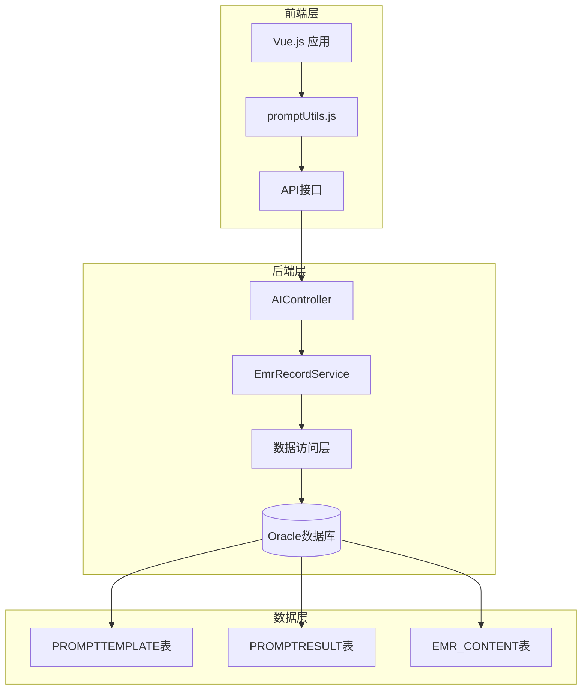
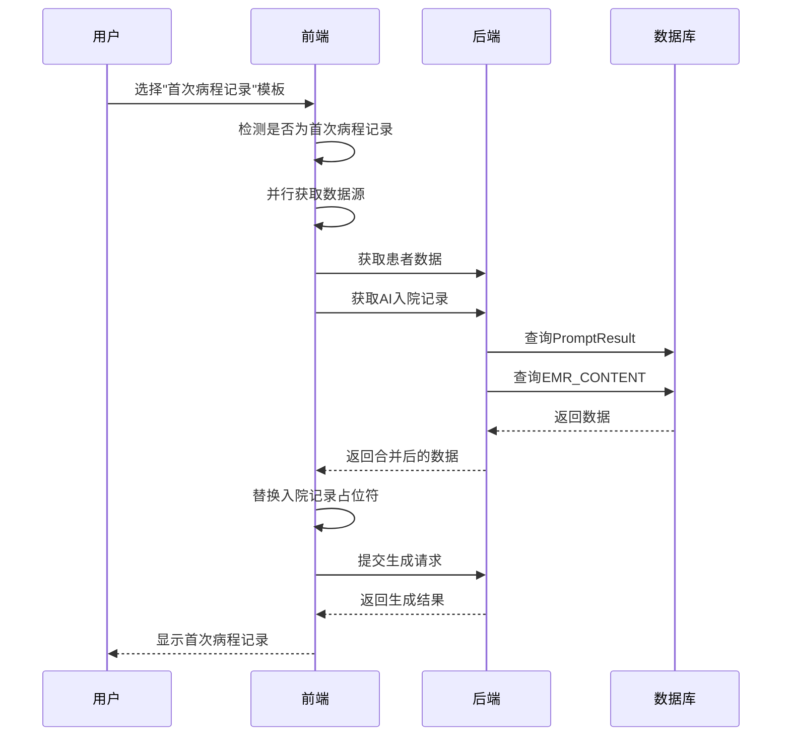
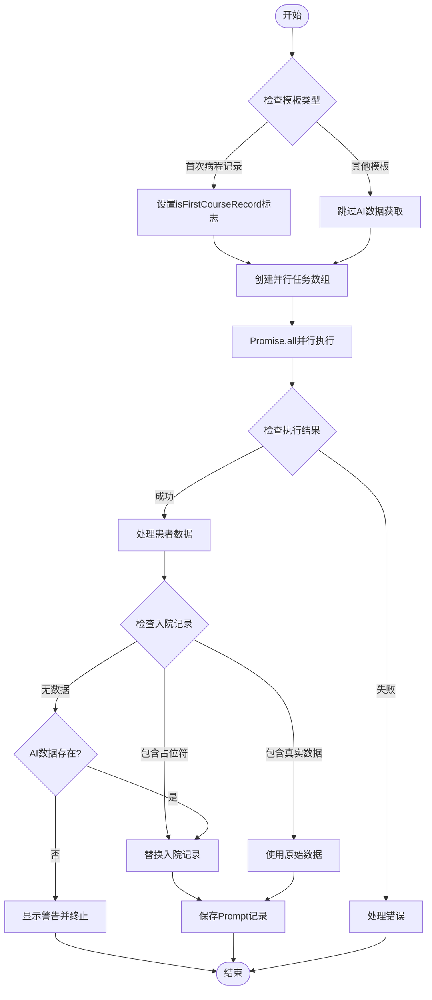
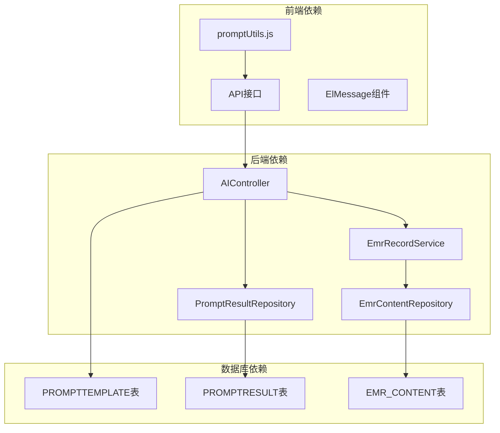

# 首次病程记录入院记录替代逻辑

<cite>
**本文档引用的文件**
- [promptUtils.js](file://med_ai_assistant_1.0_bs_vue/src/utils/promptUtils.js)
- [AIController.java](file://med_ai_assistant_1.0_bs_backend/src/main/java/com/example/medaiassistant/controller/AIController.java)
- [EmrRecordService.java](file://med_ai_assistant_1.0_bs_backend/src/main/java/com/example/medaiassistant/service/EmrRecordService.java)
- [EMR病历内容查询接口.md](file://med_ai_assistant_1.0_bs_backend/doc/接口/病历记录/EMR病历内容查询接口.md)
- [入院记录获取与分析准入逻辑小迭代方案.md](file://med_ai_assistant_1.0_bs_backend/doc/迭代/小迭代/已完成/入院记录获取与分析准入逻辑小迭代方案.md)
- [insert-first-course-record-prompt-template.sql](file://med_ai_assistant_1.0_bs_backend/sql-scripts/insert-first-course-record-prompt-template.sql)
- [2026-04-10 更新日志](file://med_ai_assistant_1.0_bs_vue/docs/更新日志/2026-04-10.md)
</cite>

## 目录
1. [简介](#简介)
2. [项目结构](#项目结构)
3. [核心组件](#核心组件)
4. [架构概览](#架构概览)
5. [详细组件分析](#详细组件分析)
6. [依赖关系分析](#依赖关系分析)
7. [性能考虑](#性能考虑)
8. [故障排除指南](#故障排除指南)
9. [结论](#结论)

## 简介

首次病程记录入院记录替代逻辑是MedAiAssistant系统中一个重要的数据处理机制，旨在解决入院记录数据缺失时首次病程记录生成的问题。该逻辑通过智能的数据源选择和降级策略，确保即使在入院记录尚未录入或AI生成的入院记录总结缺失的情况下，仍能生成规范的首次病程记录。

该功能的核心价值在于：
- **数据完整性保障**：确保首次病程记录生成不受入院记录缺失影响
- **智能降级策略**：提供多层次的数据源选择机制
- **用户体验优化**：减少因数据缺失导致的生成失败
- **医疗规范遵循**：严格按照《病历书写基本规范》要求生成

## 项目结构

MedAiAssistant系统采用前后端分离架构，首次病程记录替代逻辑涉及以下关键组件：



**图表来源**
- [promptUtils.js:1-261](file://med_ai_assistant_1.0_bs_vue/src/utils/promptUtils.js#L1-261)
- [AIController.java:663-1050](file://med_ai_assistant_1.0_bs_backend/src/main/java/com/example/medaiassistant/controller/AIController.java#L663-L1050)

**章节来源**
- [promptUtils.js:1-261](file://med_ai_assistant_1.0_bs_vue/src/utils/promptUtils.js#L1-261)
- [AIController.java:663-1050](file://med_ai_assistant_1.0_bs_backend/src/main/java/com/example/medaiassistant/controller/AIController.java#L663-L1050)

## 核心组件

### 前端处理组件

前端的`promptUtils.js`文件实现了首次病程记录的智能替代逻辑，主要包括：

1. **并行数据获取**：同时获取患者数据、模板内容和AI生成的入院记录
2. **条件判断逻辑**：识别是否为首次病程记录模板
3. **替代数据处理**：在入院记录缺失时自动替换为AI生成内容
4. **错误处理机制**：当所有数据源都不可用时提供用户反馈

### 后端数据处理组件

后端的`AIController`实现了完整的三层降级策略：

1. **优先级策略**：PromptResult中的入院记录总结 > EMR_CONTENT原始入院记录 > 标记"无入院记录数据"
2. **智能合并机制**：自动处理不同数据源的数据格式
3. **异常容错处理**：确保单个数据源故障不影响整体功能

**章节来源**
- [promptUtils.js:98-186](file://med_ai_assistant_1.0_bs_vue/src/utils/promptUtils.js#L98-L186)
- [AIController.java:987-1036](file://med_ai_assistant_1.0_bs_backend/src/main/java/com/example/medaiassistant/controller/AIController.java#L987-L1036)

## 架构概览

首次病程记录替代逻辑采用分层架构设计，确保系统的可维护性和扩展性：



**图表来源**
- [promptUtils.js:122-141](file://med_ai_assistant_1.0_bs_vue/src/utils/promptUtils.js#L122-L141)
- [AIController.java:994-1036](file://med_ai_assistant_1.0_bs_backend/src/main/java/com/example/medaiassistant/controller/AIController.java#L994-L1036)

## 详细组件分析

### 前端替代逻辑实现

前端的替代逻辑通过`handlePromptExecution`函数实现，该函数包含了完整的数据处理流程：

#### 核心处理流程



**图表来源**
- [promptUtils.js:166-186](file://med_ai_assistant_1.0_bs_vue/src/utils/promptUtils.js#L166-L186)

#### 并行数据获取机制

前端实现了智能的并行数据获取策略：

| 数据源 | 获取时机 | 失败处理 |
|--------|----------|----------|
| 患者数据 | 始终获取 | 正常处理 |
| Prompt模板 | 始终获取 | 错误处理 |
| AI入院记录 | 仅首次病程记录 | `.catch()`包裹，失败不中断 |

**章节来源**
- [promptUtils.js:122-141](file://med_ai_assistant_1.0_bs_vue/src/utils/promptUtils.js#L122-L141)
- [promptUtils.js:166-186](file://med_ai_assistant_1.0_bs_vue/src/utils/promptUtils.js#L166-L186)

### 后端降级策略实现

后端实现了严格的三层降级策略，确保数据获取的可靠性：

#### 降级策略层次

```mermaid
flowchart TD
Priority1[优先级1: PromptResult入院记录总结] --> CheckSummary{检查是否有入院记录总结}
CheckSummary --> |有| UseSummary[使用入院记录总结]
CheckSummary --> |无| Priority2[降级到Priority2: EMR_CONTENT原始入院记录]
Priority2 --> CheckEMR{检查EMR_CONTENT是否有入院记录}
CheckEMR --> |有| UseEMR[使用EMR入院记录]
CheckEMR --> |无| Priority3[兜底Priority3: 标记"无入院记录数据"]
UseSummary --> Success[成功返回]
UseEMR --> Success
Priority3 --> MarkData[输出标记数据]
MarkData --> Success
```

**图表来源**
- [AIController.java:987-1036](file://med_ai_assistant_1.0_bs_backend/src/main/java/com/example/medaiassistant/controller/AIController.java#L987-L1036)

#### 数据源优先级决策

后端根据模板类型和配置动态决定数据源优先级：

| 模板类型 | 优先数据源 | 备用数据源 | 处理逻辑 |
|----------|------------|------------|----------|
| 首次病程记录 | PromptResult入院记录总结 | EMR_CONTENT原始入院记录 | 支持替代逻辑 |
| 其他模板 | PromptResult相关数据 | EMR_CONTENT相关数据 | 标准降级策略 |
| 无配置模板 | 默认10种数据类型 | - | 完整数据源覆盖 |

**章节来源**
- [AIController.java:685-735](file://med_ai_assistant_1.0_bs_backend/src/main/java/com/example/medaiassistant/controller/AIController.java#L685-L735)
- [AIController.java:987-1036](file://med_ai_assistant_1.0_bs_backend/src/main/java/com/example/medaiassistant/controller/AIController.java#L987-L1036)

### 数据模板与规范

系统内置了严格的模板规范，确保生成内容的标准化：

#### 首次病程记录模板要求

| 规范类别 | 具体要求 | 处理方式 |
|----------|----------|----------|
| 核心章节 | 病例特点、拟诊讨论、诊疗计划 | 必须包含，结构化输出 |
| 数据来源 | 入院记录、诊断信息、检查结果 | 严格基于提供的资料 |
| 语言规范 | 标准中文医学术语 | 禁止推测，客观陈述 |
| 格式要求 | 段落式书写，无编号 | 符合《病历书写基本规范》 |

**章节来源**
- [insert-first-course-record-prompt-template.sql:48-109](file://med_ai_assistant_1.0_bs_backend/sql-scripts/insert-first-course-record-prompt-template.sql#L48-L109)

## 依赖关系分析

### 组件间依赖关系



**图表来源**
- [promptUtils.js:1-4](file://med_ai_assistant_1.0_bs_vue/src/utils/promptUtils.js#L1-L4)
- [AIController.java:651-651](file://med_ai_assistant_1.0_bs_backend/src/main/java/com/example/medaiassistant/controller/AIController.java#L651-L651)

### 数据流依赖

系统中的数据流遵循严格的依赖关系：

1. **前端到后端**：通过API接口传递参数和配置
2. **后端到数据库**：通过Repository层访问数据
3. **数据到模板**：通过模板引擎处理生成内容
4. **结果到前端**：通过API返回处理结果

**章节来源**
- [promptUtils.js:224-243](file://med_ai_assistant_1.0_bs_vue/src/utils/promptUtils.js#L224-L243)
- [AIController.java:663-667](file://med_ai_assistant_1.0_bs_backend/src/main/java/com/example/medaiassistant/controller/AIController.java#L663-L667)

## 性能考虑

### 并行处理优化

系统采用了多项性能优化策略：

#### 前端并行处理
- **Promise.all并行执行**：同时获取多个数据源，减少总等待时间
- **智能失败处理**：单个数据源失败不影响整体流程
- **条件性数据获取**：仅在需要时获取AI入院记录

#### 后端降级策略
- **优先缓存利用**：优先使用PromptResult缓存数据
- **最小化数据库查询**：通过一次查询获取所需数据
- **异常容错机制**：确保单点故障不影响整体性能

### 内存和资源管理

系统在内存使用方面采取了以下优化措施：

| 优化策略 | 实现方式 | 效果 |
|----------|----------|------|
| 数据流式处理 | 使用StringBuilder构建响应 | 减少内存碎片 |
| 异常处理优化 | 统一的日志记录和错误处理 | 提高系统稳定性 |
| 资源清理 | 及时释放数据库连接和API资源 | 降低资源占用 |

## 故障排除指南

### 常见问题及解决方案

#### 问题1：首次病程记录生成失败

**症状**：用户选择"首次病程记录"模板后，系统提示"无入院记录数据，无法生成首次病程记录"

**可能原因**：
1. 患者资料中确实没有入院记录
2. AI生成的入院记录总结缺失
3. 数据库连接异常

**解决方案**：
1. 检查患者资料是否包含入院记录
2. 确认AI入院记录总结是否已生成
3. 验证数据库连接状态

#### 问题2：替代逻辑未生效

**症状**：即使存在AI入院记录，系统仍提示数据缺失

**可能原因**：
1. 模板名称不匹配
2. 数据格式不正确
3. 前端逻辑错误

**解决方案**：
1. 确认模板名称为"首次病程记录"
2. 检查数据格式是否符合预期
3. 查看浏览器控制台错误信息

#### 问题3：性能问题

**症状**：首次病程记录生成响应时间过长

**可能原因**：
1. 数据库查询性能问题
2. 网络延迟
3. 前端处理逻辑复杂

**解决方案**：
1. 优化数据库查询索引
2. 检查网络连接质量
3. 分析前端性能瓶颈

**章节来源**
- [promptUtils.js:177-181](file://med_ai_assistant_1.0_bs_vue/src/utils/promptUtils.js#L177-L181)
- [AIController.java:1032-1036](file://med_ai_assistant_1.0_bs_backend/src/main/java/com/example/medaiassistant/controller/AIController.java#L1032-L1036)

### 调试和监控

系统提供了完善的调试和监控机制：

#### 前端调试
- **控制台日志**：详细的执行步骤记录
- **用户提示**：友好的错误信息显示
- **性能监控**：执行时间统计

#### 后端监控
- **日志记录**：完整的执行流程日志
- **错误追踪**：详细的异常信息记录
- **性能指标**：响应时间和资源使用情况

## 结论

首次病程记录入院记录替代逻辑是MedAiAssistant系统中的关键功能，它通过智能的数据源选择和降级策略，有效解决了入院记录数据缺失的问题。该逻辑的设计体现了以下优势：

### 技术优势

1. **智能降级策略**：实现了三层数据源优先级，确保数据获取的可靠性
2. **并行处理优化**：通过并行获取多个数据源，显著提升响应速度
3. **异常容错机制**：单点故障不影响整体功能，提高系统稳定性
4. **用户体验优化**：减少因数据缺失导致的生成失败，提升用户满意度

### 业务价值

1. **医疗规范遵循**：严格按照《病历书写基本规范》生成首次病程记录
2. **数据完整性保障**：确保首次病程记录生成不受入院记录缺失影响
3. **工作效率提升**：减少人工干预，提高病历生成效率
4. **质量控制加强**：通过标准化模板确保生成内容的质量

### 未来发展方向

1. **AI模型优化**：持续改进AI生成的入院记录质量
2. **数据源扩展**：增加更多数据源支持，提高数据获取成功率
3. **性能进一步优化**：通过缓存和预加载机制提升系统性能
4. **智能化程度提升**：引入更多机器学习算法，提高替代逻辑的准确性

该替代逻辑的成功实施，不仅解决了技术难题，更为整个MedAiAssistant系统的稳定运行和用户体验提升奠定了坚实基础。