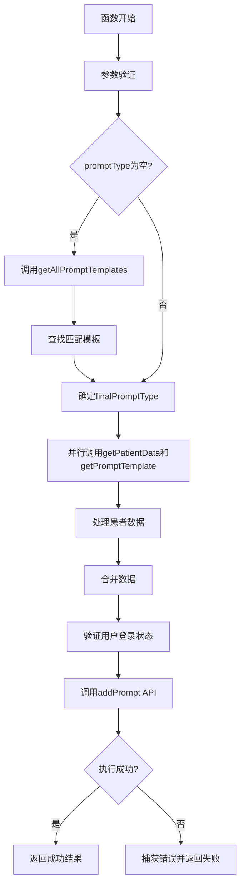
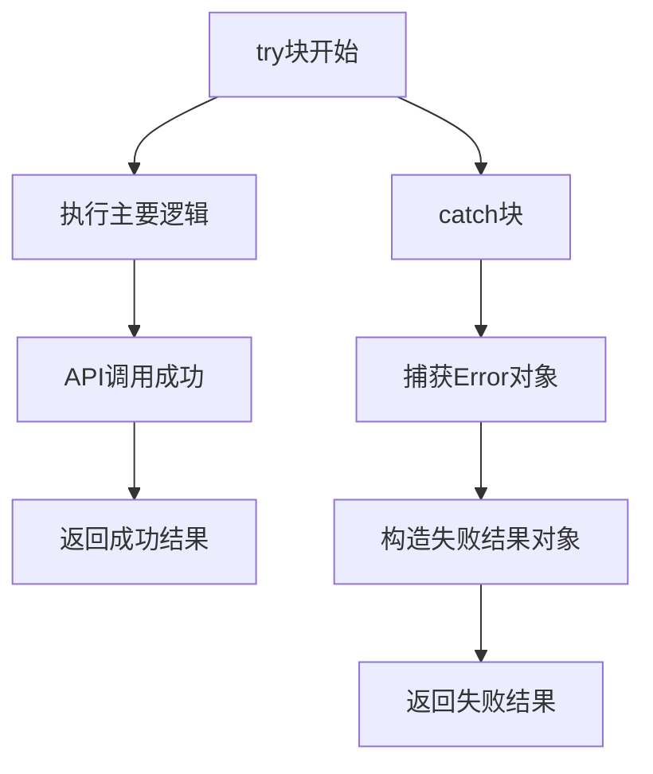

<cite>
**Referenced Files in This Document**   
- [promptUtils.js](file://src/utils/promptUtils.js)
- [AIView.vue](file://src/views/AIView.vue)
- [PromptList.vue](file://src/components/ai/PromptList.vue)
- [ai.js](file://src/store/modules/ai.js)
- [ai.js](file://src/api/ai.js)
</cite>

## 目录
1. [简介](#简介)
2. [核心功能分析](#核心功能分析)
3. [异步控制流与并行调用](#异步控制流与并行调用)
4. [错误捕获与异常处理](#错误捕获与异常处理)
5. [状态更新与Vuex交互](#状态更新与vuex交互)
6. [实际调用场景分析](#实际调用场景分析)
7. [设计意图与架构角色](#设计意图与架构角色)
8. [异常情况与处理策略](#异常情况与处理策略)

## 简介
`handlePromptExecution`函数是医疗AI助手系统中AI任务执行的核心中枢，负责协调患者数据获取、Prompt模板获取、数据合并与AI分析请求的发起。该函数作为系统中AI分析流程的启动点，实现了对复杂异步操作的统一管理，确保了AI分析任务的可靠执行。

**Section sources**
- [promptUtils.js](file://src/utils/promptUtils.js#L1-L191)

## 核心功能分析
`handlePromptExecution`函数实现了AI分析任务的完整执行流程，其核心功能包括参数验证、模板类型推断、并行数据获取、数据处理与合并、以及最终的AI分析请求发起。

该函数首先对输入参数进行严格验证，确保`promptName`为有效字符串。当`promptType`参数为空时，函数会通过`getAllPromptTemplates` API调用获取所有激活的模板，并根据`promptName`查找匹配的模板以确定其类型，若未找到则使用默认的"诊断分析"类型。

函数的核心是通过`Promise.all`实现的并行调用机制，同时发起`getPatientData`和`getPromptTemplate`两个API请求，显著提升了数据获取效率。获取到数据后，函数会对患者数据进行特殊格式处理，特别是针对数字键对象的情况，将其值合并为字符串。最终，处理后的患者数据与模板内容被合并，并通过`addPrompt` API发起AI分析请求。

**Section sources**
- [promptUtils.js](file://src/utils/promptUtils.js#L61-L190)

## 异步控制流与并行调用
`handlePromptExecution`函数采用了现代JavaScript的异步编程模式，通过`async/await`语法和`Promise.all`方法实现了高效的异步控制流。



**Diagram sources**
- [promptUtils.js](file://src/utils/promptUtils.js#L61-L190)

**Section sources**
- [promptUtils.js](file://src/utils/promptUtils.js#L61-L190)

## 错误捕获与异常处理
函数采用了全面的错误捕获机制，通过`try-catch`语句包裹整个执行流程，确保任何异常都能被捕获并以统一格式返回。

函数在多个关键点进行参数验证，包括`promptName`、用户登录状态、`patientId`等，一旦发现无效参数立即抛出带有明确信息的`Error`。对于API调用失败，函数在`catch`块中捕获异常，并返回包含错误消息的失败结果对象，而非直接抛出异常，这使得调用方能够优雅地处理错误情况。



**Diagram sources**
- [promptUtils.js](file://src/utils/promptUtils.js#L61-L190)

**Section sources**
- [promptUtils.js](file://src/utils/promptUtils.js#L61-L190)

## 状态更新与Vuex交互
虽然`handlePromptExecution`函数本身不直接操作Vuex store，但它返回的结果被上层组件用于更新应用状态。函数的执行结果（成功或失败）以及相关信息被传递给调用组件，由这些组件通过Vuex的`mutations`和`actions`来更新全局状态。

例如，在`AIView.vue`中，函数的返回结果被用于显示用户反馈消息，而`PromptList.vue`组件则通过store的`SET_CURRENT_PROMPT` mutation来更新当前选中的Prompt。

**Section sources**
- [ai.js](file://src/store/modules/ai.js#L1-L142)
- [AIView.vue](file://src/views/AIView.vue#L1-L173)
- [PromptList.vue](file://src/components/ai/PromptList.vue#L1-L354)

## 实际调用场景分析
`handlePromptExecution`函数在系统中有多个调用场景，其中最典型的是在`AIView.vue`中的`generateAdmissionSummary`方法中。

```mermaid
sequenceDiagram
    participant User as 用户
    participant AIView as AIView.vue
    participant PromptUtils as promptUtils.js
    participant API as 后端API
    
    User->>AIView: 触发生成入院记录总结
    AIView->>PromptUtils: 调用handlePromptExecution
    PromptUtils->>API: 并行调用getPatientData和getPromptTemplate
    API-->>PromptUtils: 返回患者数据和模板
    PromptUtils->>API: 调用addPrompt
    API-->>PromptUtils: 返回执行结果
    PromptUtils-->>AIView: 返回成功/