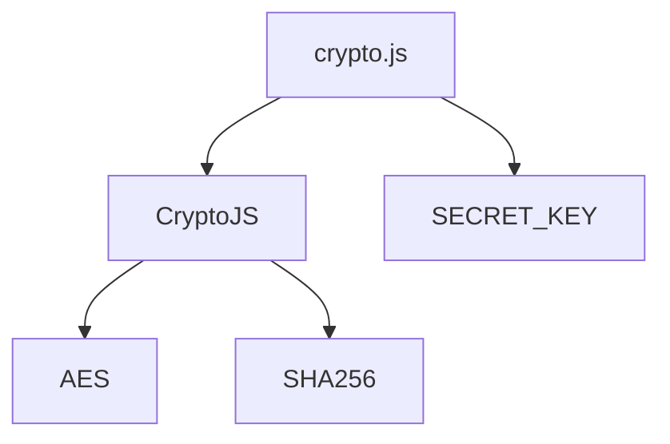
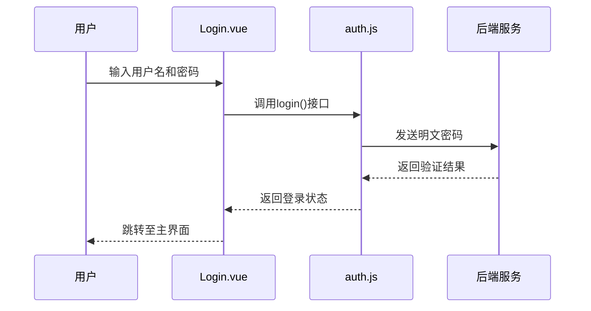

# 加密工具函数

<cite>
**Referenced Files in This Document**   
- [crypto.js](file://src/utils/crypto.js)
- [auth.js](file://src/api/auth.js)
- [Login.vue](file://src/views/Login.vue)
- [decryption.js](file://src/api/decryption.js)
</cite>

## 目录
1. [简介](#简介)
2. [核心功能与API](#核心功能与api)
3. [加密算法与依赖](#加密算法与依赖)
4. [当前用途分析](#当前用途分析)
5. [安全边界与风险防范](#安全边界与风险防范)
6. [未来集成点建议](#未来集成点建议)
7. [结论](#结论)

## 简介

`src/utils/crypto.js` 文件提供了前端应用中的基础加密工具函数，旨在处理敏感信息的加密、解密与哈希操作。尽管该文件在现有代码库中直接调用较少，但其设计目标是为医疗AI助手系统提供一个统一的密码学工具集，支持安全的数据处理需求。该模块封装了对 `crypto-js` 库的调用，实现了AES加密/解密和SHA256哈希功能，适用于前端环境下的轻量级安全操作。

**Section sources**
- [crypto.js](file://src/utils/crypto.js#L1-L35)

## 核心功能与API

该工具模块导出了三个主要函数，分别用于密码加密、解密和哈希处理。每个函数均具有明确的参数类型和返回值格式，便于在项目中复用。

### 函数签名与说明

| 函数名 | 参数 | 返回值 | 说明 |
|--------|------|--------|------|
| `encrypt(password)` | `password: string` | `string` | 使用AES算法对明文密码进行加密，返回Base64编码的密文字符串 |
| `decrypt(encrypted)` | `encrypted: string` | `string` | 对AES加密的密文进行解密，返回原始明文密码 |
| `hashPassword(password)` | `password: string` | `string` | 使用SHA256算法对密码进行单向哈希处理，返回十六进制哈希字符串 |

这些函数的设计遵循了前端安全实践的基本原则，但在实际使用中需注意密钥管理的安全性。

**Section sources**
- [crypto.js](file://src/utils/crypto.js#L10-L34)

## 加密算法与依赖

该工具依赖于第三方JavaScript库 `crypto-js`，该库提供了多种加密算法的纯JavaScript实现。具体使用的算法如下：

- **AES加密/解密**：采用AES-256-CBC模式，提供对称加密能力，适用于本地数据保护或临时传输加密。
- **SHA256哈希**：用于密码的单向散列处理，防止明文密码在日志或存储中暴露。

### 依赖关系图

**Diagram sources**
- [crypto.js](file://src/utils/crypto.js#L1-L35)

**Section sources**
- [crypto.js](file://src/utils/crypto.js#L1-L35)

## 当前用途分析

通过对代码库的全面搜索，发现 `crypto.js` 模块目前并未在核心业务流程中被直接调用。例如，在用户登录流程中（`Login.vue`），密码以明文形式通过API发送至后端进行验证，未经过前端加密处理。

### 登录流程分析

**Diagram sources**
- [Login.vue](file://src/views/Login.vue#L1-L198)
- [auth.js](file://src/api/auth.js#L1-L84)

尽管存在一个名为 `decryption.js` 的API模块，涉及加密解密服务器的通信，但其加密操作由后端服务完成，前端仅负责数据传输，未使用 `crypto.js` 中的工具函数。

**Section sources**
- [Login.vue](file://src/views/Login.vue#L1-L198)
- [auth.js](file://src/api/auth.js#L1-L84)
- [decryption.js](file://src/api/decryption.js#L1-L170)

## 安全边界与风险防范

虽然 `crypto.js` 提供了基本的加密能力，但在前端环境中使用这些工具存在固有的安全限制。

### 安全风险

1. **密钥硬编码**：当前实现中，`SECRET_KEY` 被直接定义在源码中（`med-ai-secret-key-2025`），任何用户均可通过查看页面源码获取该密钥，导致加密形同虚设。
2. **前端加密的局限性**：即使对密码进行前端加密，攻击者仍可截获加密后的密文并进行重放攻击，因此前端加密不能替代HTTPS和后端安全措施。
3. **缺乏密钥管理机制**：未集成环境变量或安全密钥服务，无法实现动态密钥轮换。

### 风险防范建议

- **禁止在前端存储或使用长期有效的加密密钥**。
- **敏感操作应在后端完成**：密码哈希、令牌生成等应由后端服务处理。
- **使用HTTPS确保传输安全**，避免中间人攻击。
- **考虑使用Web Crypto API** 替代 `crypto-js`，以获得浏览器原生支持的安全特性。

**Section sources**
- [crypto.js](file://src/utils/crypto.js#L5-L6)

## 未来集成点建议

尽管当前使用有限，`crypto.js` 模块具备扩展潜力，可在以下场景中发挥作用：

### 1. 本地数据保护

可用于加密存储在 `localStorage` 中的敏感信息（如用户偏好、临时令牌），防止XSS攻击导致的数据泄露。

### 2. API通信安全增强

在发送敏感数据前进行预加密，配合后端解密，形成双重保护机制。例如，在调用 `encryptAndSendPrompt` 前对提示内容进行本地加密。

### 3. 用户身份验证辅助

可结合挑战-响应机制，使用 `hashPassword` 对动态令牌进行处理，提升登录安全性。

### 4. 数据完整性校验

利用 `hashPassword` 生成数据指纹，用于检测本地缓存数据是否被篡改。

这些集成点需在确保密钥安全的前提下实施，建议结合后端密钥分发服务动态获取加密密钥。

**Section sources**
- [crypto.js](file://src/utils/crypto.js#L1-L35)
- [decryption.js](file://src/api/decryption.js#L1-L170)

## 结论

`src/utils/crypto.js` 是一个具备基础加密能力的前端工具模块，提供了AES加密/解密和SHA256哈希功能。然而，由于密钥硬编码和前端环境的固有局限，其当前安全性较低，且在现有代码中未被实际使用。建议在未来的开发中，若需前端加密功能，应重构该模块以支持动态密钥注入，并优先依赖后端安全机制。该工具的真正价值在于为特定场景（如本地数据保护）提供轻量级加密支持，而非替代标准的身份验证和通信安全协议。