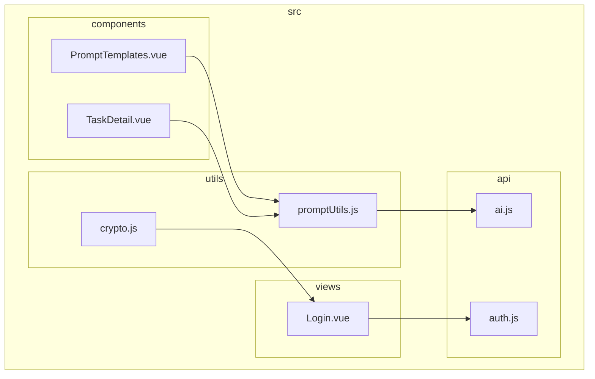
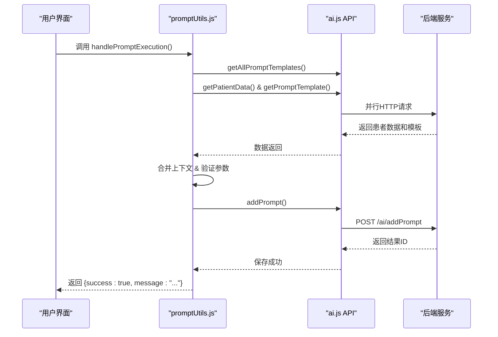
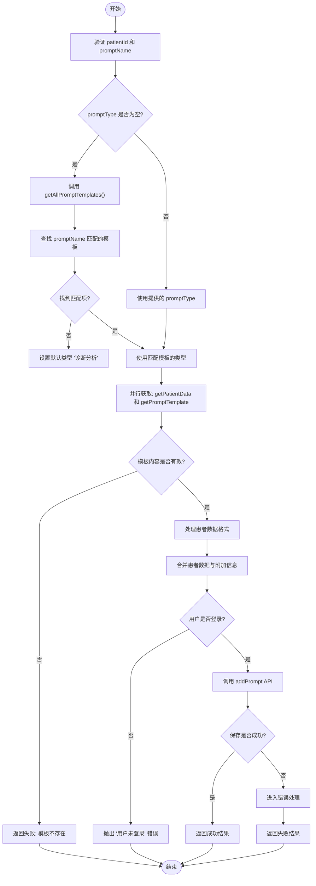
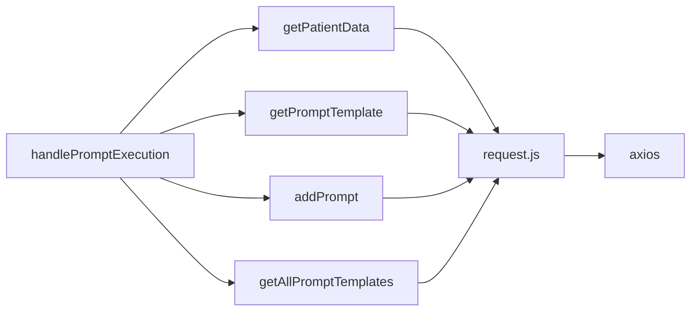

# 核心工具函数

<cite>
**本文档引用的文件**  
- [promptUtils.js](file://src/utils/promptUtils.js#L0-L191)
- [crypto.js](file://src/utils/crypto.js#L0-L35)
- [ai.js](file://src/api/ai.js#L0-L400)
- [Login.vue](file://src/views/Login.vue#L0-L197)
</cite>

## 目录
1. [简介](#简介)
2. [项目结构](#项目结构)
3. [核心组件](#核心组件)
4. [架构概览](#架构概览)
5. [详细组件分析](#详细组件分析)
6. [依赖分析](#依赖分析)
7. [性能考虑](#性能考虑)
8. [故障排除指南](#故障排除指南)
9. [结论](#结论)

## 简介
本文档旨在深入解析医疗AI助手项目中的核心工具函数，重点分析 `promptUtils.js` 中的 `handlePromptExecution` 函数执行流程，以及 `crypto.js` 中加密工具的设计意图与潜在用途。文档将详细说明这些工具函数在协调AI任务执行、处理敏感数据方面的关键作用，并提供函数签名、参数说明、返回值类型及异常处理机制。

## 项目结构
本项目采用典型的Vue.js前端架构，按功能模块组织文件。核心逻辑集中在 `src` 目录下，主要结构如下：

- `api/`：封装所有后端API请求
- `components/`：可复用的UI组件
- `store/`：Vuex状态管理
- `utils/`：通用工具函数（本文档重点）
- `views/`：页面级组件

`promptUtils.js` 和 `crypto.js` 位于 `src/utils/` 目录，分别负责AI提示词执行逻辑和加密功能。



**图示来源**
- [promptUtils.js](file://src/utils/promptUtils.js#L0-L191)
- [crypto.js](file://src/utils/crypto.js#L0-L35)
- [ai.js](file://src/api/ai.js#L0-L400)
- [Login.vue](file://src/views/Login.vue#L0-L197)

**本节来源**
- [promptUtils.js](file://src/utils/promptUtils.js#L0-L191)
- [crypto.js](file://src/utils/crypto.js#L0-L35)

## 核心组件
本文档的核心组件为 `promptUtils.js` 中的 `handlePromptExecution` 函数和 `crypto.js` 中的加密工具集。前者是AI任务执行的中枢，负责协调数据获取、上下文合并与请求触发；后者为潜在的敏感数据处理提供基础支持。

## 架构概览
系统采用前后端分离架构。前端通过API调用与后端交互。`handlePromptExecution` 函数作为前端业务逻辑的关键枢纽，串联了患者数据、Prompt模板与AI服务。



**图示来源**
- [promptUtils.js](file://src/utils/promptUtils.js#L0-L191)
- [ai.js](file://src/api/ai.js#L0-L400)

## 详细组件分析

### handlePromptExecution 函数分析
`handlePromptExecution` 是协调AI任务执行的核心函数，其主要职责是并行获取所需数据、构建上下文并触发AI分析。

#### 函数签名与参数说明
```javascript
/**
 * 执行Prompt模板
 * @param {string} patientId - 患者ID，必填
 * @param {string} promptType - 模板类型，可选
 * @param {string} promptName - 模板名称，必填
 * @param {object} [options] - 可选配置项
 * @returns {Promise<object>} 执行结果
 */
export async function handlePromptExecution(patientId, promptType, promptName, options = {})
```

**参数说明**:
- **patientId**: 患者的唯一标识符。
- **promptType**: 如“诊断分析”、“治疗建议”等，若为空则通过 `promptName` 查询。
- **promptName**: 具体的模板名称，如“鉴别诊断模板”。
- **options**: 包含 `UserId`, `Priority`, `AdditionalInfo` 等扩展信息的对象。

#### 执行流程图


**图示来源**
- [promptUtils.js](file://src/utils/promptUtils.js#L0-L191)

**本节来源**
- [promptUtils.js](file://src/utils/promptUtils.js#L0-L191)
- [ai.js](file://src/api/ai.js#L0-L400)

### crypto.js 加密工具分析
`crypto.js` 提供了一套基础的加密工具，主要用于敏感数据的处理，如密码加密和哈希。

#### 函数功能说明
```javascript
export default {
  /**
   * 使用AES算法加密密码
   * @param {string} password - 明文密码
   * @returns {string} Base64编码的密文
   */
  encrypt(password) { ... },

  /**
   * 解密由encrypt方法生成的密文
   * @param {string} encrypted - 密文
   * @returns {string} 明文密码
   */
  decrypt(encrypted) { ... },
  
  /**
   * 对密码进行SHA256哈希
   * @param {string} password - 明文密码
   * @returns {string} 哈希值
   */
  hashPassword(password) { ... }
}
```

#### 设计意图与潜在扩展点
该模块的设计意图是为前端提供数据加密能力。尽管当前代码中未直接调用，但其存在表明项目有处理敏感信息的规划。

**潜在使用场景**:
- **密码预处理**: 在发送到后端前对用户密码进行哈希或加密。
- **令牌生成**: 为API请求生成安全的令牌。
- **数据保护**: 对存储在 `localStorage` 中的敏感信息进行加密。

**安全风险**:
- **密钥硬编码**: `SECRET_KEY` 直接写在代码中 (`med-ai-secret-key-2025`)，存在严重安全风险。生产环境应通过环境变量或后端服务动态获取。
- **缺乏实际调用**: 当前项目中未发现对 `encrypt`, `decrypt`, `hashPassword` 的调用，可能为未来功能预留。

```mermaid
classDiagram
class CryptoUtils {
+string SECRET_KEY
+encrypt(password)
+decrypt(encrypted)
+hashPassword(password)
}
class LoginView {
-userid
-password
-department
-specialtyGroup
+handleLogin()
}
class AuthAPI {
+login(credentials)
+getUserById(id)
}
LoginView --> AuthAPI : "调用"
LoginView -.-> CryptoUtils : "潜在依赖"
AuthAPI -.-> CryptoUtils : "潜在依赖"
note right of CryptoUtils
当前未被直接调用
设计意图：为敏感数据
处理提供支持
end note
```

**图示来源**
- [crypto.js](file://src/utils/crypto.js#L0-L35)
- [Login.vue](file://src/views/Login.vue#L0-L197)

**本节来源**
- [crypto.js](file://src/utils/crypto.js#L0-L35)
- [Login.vue](file://src/views/Login.vue#L0-L197)

## 依赖分析
`handlePromptExecution` 函数依赖于 `ai.js` 中定义的多个API函数，形成了清晰的依赖链。



**图示来源**
- [promptUtils.js](file://src/utils/promptUtils.js#L0-L191)
- [ai.js](file://src/api/ai.js#L0-L400)

**本节来源**
- [promptUtils.js](file://src/utils/promptUtils.js#L0-L191)
- [ai.js](file://src/api/ai.js#L0-L400)

## 性能考虑
`handlePromptExecution` 通过 `Promise.all()` 并行获取患者数据和Prompt模板，显著减少了总的等待时间，这是关键的性能优化点。然而，`getAllPromptTemplates()` 在 `promptType` 为空时会被调用，这是一次额外的、可能不必要的网络请求，建议缓存其结果以提升性能。

## 故障排除指南
- **错误: "模板名称必须是有效字符串"**: 确保调用时 `promptName` 参数为非空字符串。
- **错误: "用户未登录或登录信息已过期"**: 检查 `localStorage` 中的 `userInfo` 是否存在且有效。
- **错误: "获取模板失败"**: 确认后端 `/ai/activePromptTemplates` 接口返回的数据中包含指定名称的模板。
- **加密模块无效果**: 当前 `crypto.js` 未被任何代码调用，其功能尚未启用。

**本节来源**
- [promptUtils.js](file://src/utils/promptUtils.js#L0-L191)
- [Login.vue](file://src/views/Login.vue#L0-L197)

## 结论
`handlePromptExecution` 函数是医疗AI助手前端逻辑的核心，它高效地协调了数据获取、上下文构建和AI请求的触发，体现了良好的异步编程实践。而 `crypto.js` 模块虽然当前未被使用，但其存在揭示了项目对数据安全的考量，其硬编码的密钥是亟待解决的安全隐患。建议在后续开发中，将 `crypto.js` 的功能与登录流程集成，并采用更安全的密钥管理方案。