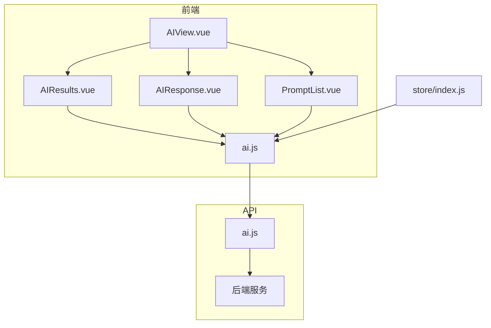
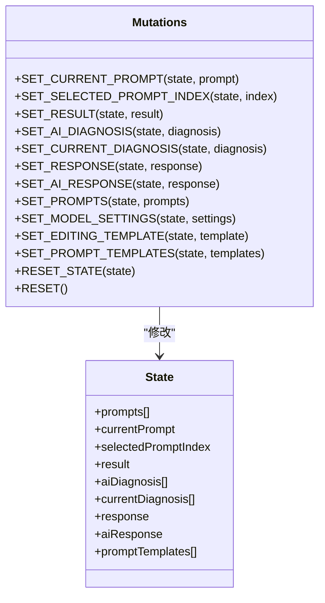
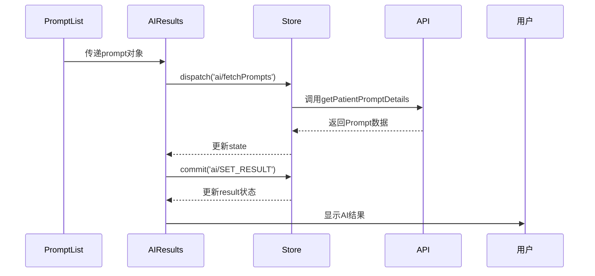
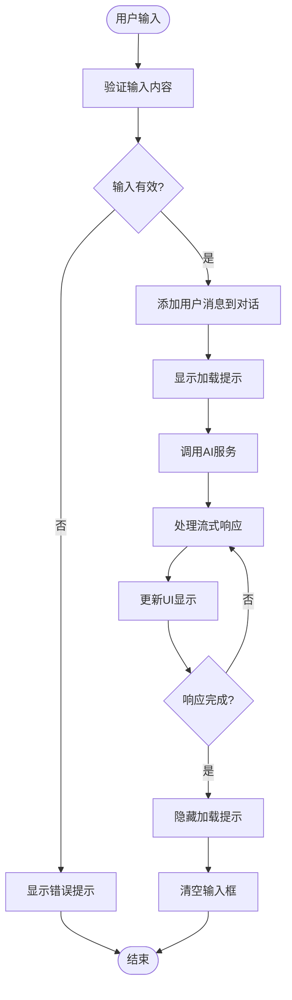
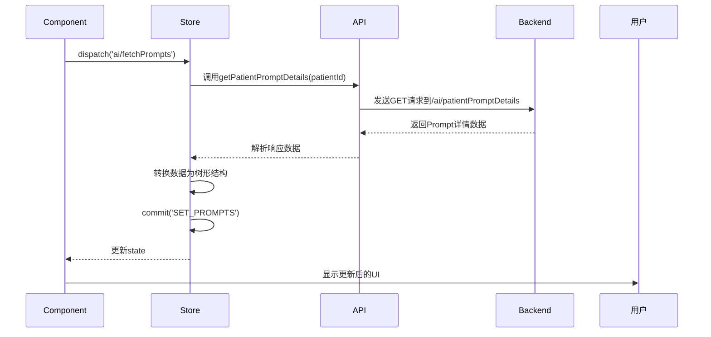

# AI状态管理模块

<cite>
**本文档引用的文件**  
- [ai.js](file://src/store/modules/ai.js#L1-L142)
- [AIResults.vue](file://src/components/ai/AIResults.vue#L1-L291)
- [AIResponse.vue](file://src/components/ai/AIResponse.vue#L1-L496)
- [ai.js](file://src/api/ai.js#L25-L398)
</cite>

## 目录
1. [项目结构](#项目结构)
2. [核心组件](#核心组件)
3. [AI状态管理模块详解](#ai状态管理模块详解)
4. [组件与状态管理的交互分析](#组件与状态管理的交互分析)
5. [API交互与后端依赖](#api交互与后端依赖)
6. [命名空间与最佳实践](#命名空间与最佳实践)

## 项目结构

项目采用典型的Vue.js单页应用架构，结合Vuex进行全局状态管理。核心AI功能集中在`src/components/ai`目录下，状态管理通过`src/store/modules/ai.js`模块实现。



**图示来源**  
- [ai.js](file://src/store/modules/ai.js#L1-L142)
- [AIResults.vue](file://src/components/ai/AIResults.vue#L1-L291)
- [AIResponse.vue](file://src/components/ai/AIResponse.vue#L1-L496)
- [ai.js](file://src/api/ai.js#L25-L398)

**本节来源**  
- [ai.js](file://src/store/modules/ai.js#L1-L142)
- [AIResults.vue](file://src/components/ai/AIResults.vue#L1-L291)
- [AIResponse.vue](file://src/components/ai/AIResponse.vue#L1-L496)

## 核心组件

AI功能的核心组件包括`AIResults.vue`和`AIResponse.vue`，分别负责展示AI生成结果和管理与大语言模型的对话交互。这些组件通过Vuex与`ai.js`状态管理模块紧密协作，实现数据的集中管理和响应式更新。

**本节来源**  
- [AIResults.vue](file://src/components/ai/AIResults.vue#L1-L291)
- [AIResponse.vue](file://src/components/ai/AIResponse.vue#L1-L496)

## AI状态管理模块详解

`ai.js`模块是AI功能的核心状态管理单元，采用Vuex的`namespaced: true`模式，确保状态的隔离性和可维护性。该模块完整管理了AI分析任务的生命周期状态。

### State状态定义

State定义了AI模块所需的所有状态数据：

```javascript
state: {
  prompts: [],
  currentPrompt: null,
  selectedPromptIndex: null,
  result: null,
  aiDiagnosis: [],
  currentDiagnosis: [],
  response: null,
  editingTemplate: null,
  modelSettings: null,
  aiResponse: null,
  promptTemplates: []
}
```

- **prompts**: 存储从后端获取的Prompt执行记录列表
- **currentPrompt**: 当前选中的Prompt模板
- **selectedPromptIndex**: 当前选中Prompt的索引，用于UI状态同步
- **result**: AI生成的最终结果内容
- **aiDiagnosis**: 从AI结果中提取的诊断建议
- **currentDiagnosis**: 当前患者的诊断列表
- **response**: 临时的AI响应内容
- **promptTemplates**: 从后端加载的Prompt模板数据

### Mutations突变方法

Mutations负责同步修改state，每个方法都有清晰的命名规范，采用大写蛇形命名法（SET_XXX）：



**图示来源**  
- [ai.js](file://src/store/modules/ai.js#L15-L89)

**本节来源**  
- [ai.js](file://src/store/modules/ai.js#L15-L89)

### Actions异步操作

Actions处理异步逻辑，主要包含两个核心方法：

```javascript
actions: {
  async fetchPrompts({ commit }, patientId) {
    try {
      const response = await getPatientPromptDetails(patientId);
      const prompts = Array.isArray(response.data) ? response.data : [];
      commit('SET_PROMPTS', prompts);
      return prompts;
    } catch (error) {
      console.error('获取病人Prompt详情失败:', error);
      throw error;
    }
  },
  async fetchPromptTemplates({ commit }) {
    try {
      const templates = await getAllPromptTemplates();
      
      // 将平铺数据转换为树形结构
      const treeData = templates.reduce((acc, template) => {
        const groupName = template.promptType;
        const promptName = template.promptName;
        const promptId = template.promptID;
        
        if (!groupName || !promptName || !promptId) {
          console.warn('无效的模板数据:', template);
          return acc;
        }
        
        const group = acc.find(g => g.name === groupName);
        if (group) {
          group.children.push({
            id: `${promptId}`,
            name: promptName
          });
        } else {
          acc.push({
            id: `group-${groupName}`,
            name: groupName,
            children: [{
              id: `${promptId}`,
              name: promptName
            }]
          });
        }
        return acc;
      }, []);
      
      commit('SET_PROMPT_TEMPLATES', treeData);
      return treeData;
    } catch (error) {
      console.error('加载模板数据失败:', error);
      throw error;
    }
  }
}
```

- **fetchPrompts**: 根据患者ID异步获取Prompt执行记录，成功后通过`commit`提交`SET_PROMPTS`突变
- **fetchPromptTemplates**: 获取所有Prompt模板数据，将其从平铺结构转换为树形结构后提交`SET_PROMPT_TEMPLATES`突变

### Getters计算属性

Getters提供对state的计算访问：

```javascript
getters: {
  prompts: state => state.prompts,
  currentPrompt: state => state.currentPrompt,
  selectedPromptIndex: state => state.selectedPromptIndex,
  result: state => state.result,
  aiDiagnosis: state => state.aiDiagnosis,
  currentDiagnosis: state => state.currentDiagnosis,
  response: state => state.response,
  aiResponse: state => state.aiResponse,
  modelSettings: state => state.modelSettings,
  editingTemplate: state => state.editingTemplate,
  promptTemplates: state => state.promptTemplates
}
```

**本节来源**  
- [ai.js](file://src/store/modules/ai.js#L90-L141)

## 组件与状态管理的交互分析

### AIResults.vue组件分析

`AIResults.vue`组件通过`mapState`和`mapMutations`与AI状态管理模块交互：

```javascript
computed: {
  ...mapState('ai', ['result', 'aiDiagnosis', 'currentDiagnosis']),
},
methods: {
  ...mapMutations('ai', ['SET_RESULT', 'SET_AI_DIAGNOSIS', 'SET_CURRENT_DIAGNOSIS']),
}
```

该组件在`watch`中监听`prompt`属性变化，自动更新结果状态：

```javascript
watch: {
  prompt: {
    immediate: true,
    handler(newPrompt) {
      if (newPrompt) {
        this.SET_RESULT({
          title: newPrompt.title + '结果',
          timestamp: new Date().toLocaleString(),
          content: newPrompt.modifiedContent || newPrompt.originalContent || ''
        })
      }
    }
  }
}
```



**图示来源**  
- [AIResults.vue](file://src/components/ai/AIResults.vue#L1-L291)
- [ai.js](file://src/store/modules/ai.js#L1-L142)

**本节来源**  
- [AIResults.vue](file://src/components/ai/AIResults.vue#L1-L291)

### AIResponse.vue组件分析

`AIResponse.vue`组件通过`dispatch`触发异步操作，并通过`mapState`访问状态：

```javascript
computed: {
  ...mapState('ai', ['response']),
  ...mapGetters('patient', ['currentPatientId'])
},
methods: {
  ...mapMutations('ai', ['SET_RESPONSE']),
}
```

在`sendMessage`方法中，组件处理用户输入并调用AI服务：

```javascript
async sendMessage() {
  const msg = this.inputMessage.trim()
  if (!msg) return
  
  // 添加用户消息
  const userMessage = {
    role: 'user',
    content: msg,
    time: new Date().toLocaleTimeString(),
    isCurrentSession: true
  }
  this.conversation.push(userMessage)
  this.currentSessionMessages.push(userMessage)
  
  this.loading = true
  try {
    // 显示加载消息
    const loadingMessage = this.$message({
      message: '正在获取AI回复...',
      type: 'info',
      duration: 0
    })

    try {
      // 格式化历史对话
      const history = this.conversation.map(c => `${c.role}: ${c.content}`).join('\n\n')
      // 组合历史对话和当前消息
      const fullPrompt = `${history}\n\nuser: ${msg}`
      
      // 创建AI消息占位
      const aiMessage = {
        role: 'AI',
        content: '',
        time: new Date().toLocaleTimeString(),
        isCurrentSession: true
      }
      this.conversation.push(aiMessage)
      this.currentSessionMessages.push(aiMessage)

      // 流式响应处理
      let accumulatedContent = ''
      const onData = (data) => {
        try {
          if (!data || typeof data !== 'object') return
          
          if (data.content) {
            accumulatedContent += data.content
            aiMessage.content = this.parseMarkdown(accumulatedContent)
          } else if (data.choices && data.choices[0].delta) {
            const delta = data.choices[0].delta
            if (delta.content) {
              accumulatedContent += delta.content
              aiMessage.content = this.parseMarkdown(accumulatedContent)
            }
          }
          
          this.$forceUpdate()
          this.scrollToBottom()
        } catch (error) {
          console.error('处理流式数据错误:', error)
        }
      }

      // 调用AI服务
      await getAIResponseWithParams(
        'deepseek-chat',
        0.7,
        fullPrompt,
        onData
      )
    } finally {
      loadingMessage.close()
    }
  } catch (error) {
    console.error('获取AI回复失败:', error)
    ElMessage.error(`获取AI回复失败: ${error.message}`)
  } finally {
    this.loading = false
    this.inputMessage = ''
  }
}
```



**图示来源**  
- [AIResponse.vue](file://src/components/ai/AIResponse.vue#L1-L496)

**本节来源**  
- [AIResponse.vue](file://src/components/ai/AIResponse.vue#L1-L496)

## API交互与后端依赖

AI状态管理模块通过`src/api/ai.js`文件与后端服务进行交互。

### 核心API函数

```javascript
// 获取病人的Prompt详情
export const getPatientPromptDetails = async (patientId) => {
  try {
    const response = await request({
      url: '/ai/patientPromptDetails',
      method: 'get',
      params: { patientId }
    });
    return response;
  } catch (error) {
    throw new Error(`获取病人Prompt详情失败: ${error.message}`);
  }
};

// 获取所有激活状态的Prompt模板
export const getAllPromptTemplates = async () => {
  try {
    const response = await request({
      url: '/ai/activePromptTemplates',
      method: 'get'
    });
    return response.data;
  } catch (error) {
    throw new Error(`获取激活Prompt模板列表失败: ${error.message}`);
  }
};

// 保存AI结果到数据库
export const saveAIResult = async (result) => {
  try {
    const response = await request({
      url: '/ai/saveResult',
      method: 'post',
      headers: { 'Content-Type': 'application/json' },
      data: result
    });
    return response.data;
  } catch (error) {
    throw new Error(`保存AI结果失败: ${error.message}`);
  }
};
```



**图示来源**  
- [ai.js](file://src/api/ai.js#L25-L398)
- [ai.js](file://src/store/modules/ai.js#L1-L142)

**本节来源**  
- [ai.js](file://src/api/ai.js#L25-L398)

## 命名空间与最佳实践

### 命名空间隔离优势

`ai.js`模块使用`namespaced: true`配置，带来以下优势：

1. **作用域隔离**：避免不同模块间的状态和方法命名冲突
2. **明确的模块边界**：通过`ai/SET_RESULT`这样的命名明确知道操作的是哪个模块
3. **更好的可维护性**：大型应用中易于定位和管理特定功能模块的状态

### 最佳实践

1. **避免直接提交Mutation**：应通过Actions进行状态变更，保持数据流的清晰
2. **使用map辅助函数**：在组件中使用`mapState`、`mapGetters`、`mapMutations`和`mapActions`简化代码
3. **错误处理**：在Actions中添加完善的try-catch错误处理机制
4. **数据转换**：在Actions中完成数据格式转换，保持state的纯净

```javascript
// 正确做法：通过Actions处理异步和数据转换
async fetchPromptTemplates({ commit }) {
  try {
    const templates = await getAllPromptTemplates();
    const treeData = convertToTree(templates); // 数据转换
    commit('SET_PROMPT_TEMPLATES', treeData); // 提交突变
  } catch (error) {
    // 错误处理
    console.error('加载模板数据失败:', error);
    throw error;
  }
}

// 错误做法：在组件中直接处理复杂逻辑
// this.$store.commit('ai/SET_PROMPT_TEMPLATES', convertToTree(data))
```

**本节来源**  
- [ai.js](file://src/store/modules/ai.js#L1-L142)
- [AIResults.vue](file://src/components/ai/AIResults.vue#L1-L291)
- [AIResponse.vue](file://src/components/ai/AIResponse.vue#L1-L496)