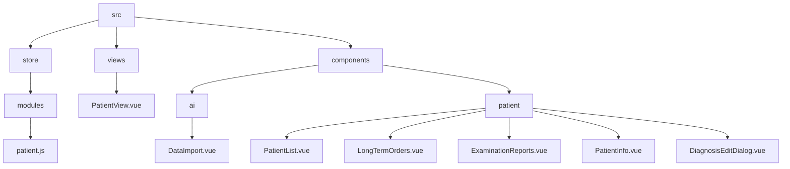
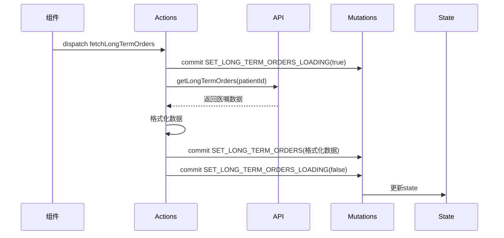
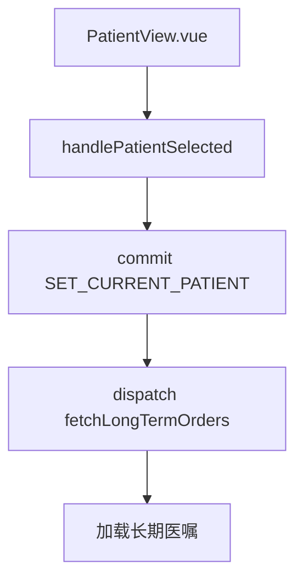

# 患者状态管理模块

<cite>
**本文档引用的文件**
- [patient.js](file://src/store/modules/patient.js)
- [PatientView.vue](file://src/views/PatientView.vue)
- [DataImport.vue](file://src/components/ai/DataImport.vue)
- [PatientList.vue](file://src/components/patient/PatientList.vue)
- [LongTermOrders.vue](file://src/components/patient/LongTermOrders.vue)
- [ExaminationReports.vue](file://src/components/patient/ExaminationReports.vue)
- [PatientInfo.vue](file://src/components/patient/PatientInfo.vue)
- [DiagnosisEditDialog.vue](file://src/components/patient/DiagnosisEditDialog.vue)
- [patient.js](file://src/api/patient.js)
</cite>

## 目录
1. [项目结构](#项目结构)
2. [核心组件](#核心组件)
3. [状态管理设计](#状态管理设计)
4. [数据加载与缓存机制](#数据加载与缓存机制)
5. [关键字段说明](#关键字段说明)
6. [计算属性分析](#计算属性分析)
7. [异步操作流程](#异步操作流程)
8. [实际调用场景](#实际调用场景)
9. [数据一致性保障](#数据一致性保障)
10. [优化策略](#优化策略)

## 项目结构



**图示来源**
- [patient.js](file://src/store/modules/patient.js#L1-L407)
- [PatientView.vue](file://src/views/PatientView.vue#L1-L42)
- [DataImport.vue](file://src/components/ai/DataImport.vue#L1-L182)

## 核心组件

**本节来源**
- [patient.js](file://src/store/modules/patient.js#L1-L407)
- [PatientView.vue](file://src/views/PatientView.vue#L1-L42)

## 状态管理设计

患者状态管理模块采用Vuex进行全局状态管理，通过模块化设计实现了患者相关信息的集中存储与管理。该模块以`patient.js`为核心，定义了患者基本信息、诊断记录、检验报告、医嘱数据等关键信息的状态结构。

状态管理模块通过`namespaced: true`启用了命名空间，确保了状态的隔离性与可维护性。模块设计遵循单一职责原则，将患者相关的所有状态集中管理，避免了状态分散带来的维护困难。

**本节来源**
- [patient.js](file://src/store/modules/patient.js#L1-L407)

## 数据加载与缓存机制

状态管理模块实现了完整的数据加载与缓存机制。当患者切换时，通过`SET_CURRENT_PATIENT`突变方法更新当前患者信息，并自动重置AI状态和内存医嘱数据，确保状态的一致性。

数据缓存主要通过Vuex的state实现，所有患者相关数据在首次加载后即保留在内存中，避免了重复请求。对于频繁访问的数据，如长期医嘱、临时医嘱、检查结果等，均设置了独立的缓存字段，实现了细粒度的缓存控制。

**本节来源**
- [patient.js](file://src/store/modules/patient.js#L31-L39)
- [patient.js](file://src/store/modules/patient.js#L46-L48)

## 关键字段说明

状态管理模块中的关键字段设计如下：

- `currentPatient`: 存储当前选中的患者对象，包含患者ID、姓名、性别、年龄等基本信息
- `longTermOrders`: 缓存长期医嘱数据数组
- `isLongTermOrdersLoading`: 标识长期医嘱数据的加载状态
- `temporaryOrders`: 缓存临时医嘱数据数组
- `isTemporaryOrdersLoading`: 标识临时医嘱数据的加载状态
- `examinationReports`: 缓存检查结果数据数组
- `isExaminationReportsLoading`: 标识检查结果数据的加载状态
- `diagnoses`: 缓存诊断数据数组
- `isDiagnosesLoading`: 标识诊断数据的加载状态
- `surgeries`: 缓存手术数据数组
- `isSurgeriesLoading`: 标识手术数据的加载状态
- `memoryOrders`: 存储内存医嘱数据，用于临时存储待处理的医嘱信息

这些字段通过对应的突变方法进行更新，确保了状态变更的可追踪性和可预测性。

**本节来源**
- [patient.js](file://src/store/modules/patient.js#L5-L30)
- [patient.js](file://src/store/modules/patient.js#L46-L100)

## 计算属性分析

计算属性（getters）用于数据聚合与筛选，提供了格式化后的视图模型：

- `currentPatient`: 获取当前患者对象
- `currentPatientId`: 获取当前患者ID
- `selectedPatientId`: 获取选中患者ID
- `longTermOrders`: 获取长期医嘱数据
- `isLongTermOrdersLoading`: 获取长期医嘱加载状态
- `temporaryOrders`: 获取临时医嘱数据
- `isTemporaryOrdersLoading`: 获取临时医嘱加载状态
- `examinationReports`: 获取检查结果数据
- `isExaminationReportsLoading`: 获取检查结果加载状态
- `diagnoses`: 获取诊断数据
- `isDiagnosesLoading`: 获取诊断数据加载状态
- `surgeries`: 获取手术数据
- `isSurgeriesLoading`: 获取手术数据加载状态
- `patients`: 获取患者列表数据

这些计算属性通过`mapGetters`在组件中使用，实现了数据的高效访问与复用。

**本节来源**
- [patient.js](file://src/store/modules/patient.js#L180-L220)

## 异步操作流程

异步操作（actions）实现了数据的加载与更新流程：



以`fetchLongTermOrders`为例，其执行流程如下：
1. 获取当前患者ID
2. 提交`SET_LONG_TERM_ORDERS_LOADING`突变，设置加载状态为true
3. 调用API接口`getLongTermOrders`获取数据
4. 对返回的数据进行格式化处理
5. 提交`SET_LONG_TERM_ORDERS`突变，更新长期医嘱数据
6. 提交`SET_LONG_TERM_ORDERS_LOADING`突变，设置加载状态为false
7. 在`finally`块中确保加载状态被正确重置

错误处理机制通过try-catch实现，当请求失败时，会提交空数组突变，并在finally块中重置加载状态，确保了状态的完整性。

**图示来源**
- [patient.js](file://src/store/modules/patient.js#L112-L150)
- [patient.js](file://src/api/patient.js#L15-L22)

**本节来源**
- [patient.js](file://src/store/modules/patient.js#L112-L150)

## 实际调用场景

### PatientView.vue中的调用



在`PatientView.vue`中，当患者被选中时，通过`handlePatientSelected`方法：
1. 提交`SET_CURRENT_PATIENT`突变，设置当前患者
2. 分发`fetchLongTermOrders`动作，加载长期医嘱数据

**图示来源**
- [PatientView.vue](file://src/views/PatientView.vue#L25-L35)

**本节来源**
- [PatientView.vue](file://src/views/PatientView.vue#L25-L35)

### DataImport.vue中的调用

在`DataImport.vue`中，通过`mapGetters`获取`currentPatientId`，并在`importAllData`方法中使用：

```mermaid
flowchart TD
A[DataImport.vue] --> B[computed]
B --> C[...mapGetters('patient', ['currentPatientId'])]
A --> D[importAllData]
D --> E[检查currentPatientId]
E --> F[调用getPatientData]
```

组件通过计算属性获取当前患者ID，并在导入数据时进行验证，确保操作的正确性。

**图示来源**
- [DataImport.vue](file://src/components/ai/DataImport.vue#L50-L55)
- [DataImport.vue](file://src/components/ai/DataImport.vue#L75-L85)

**本节来源**
- [DataImport.vue](file://src/components/ai/DataImport.vue#L50-L95)

## 数据一致性保障

状态管理模块通过多种机制保障数据一致性：

1. **状态重置机制**：当患者切换时，`SET_CURRENT_PATIENT`突变会重置AI状态和内存医嘱数据，确保新患者的数据环境干净
2. **加载状态管理**：每个数据类型都有对应的加载状态字段，避免了重复请求和界面闪烁
3. **错误处理机制**：所有异步操作都包含try-catch错误处理，在失败时提交空数据并重置加载状态
4. **数据格式化**：在提交数据前进行格式化处理，确保数据结构的一致性
5. **事务性操作**：相关数据的更新通过多个突变按顺序提交，保证了操作的原子性

**本节来源**
- [patient.js](file://src/store/modules/patient.js#L31-L39)
- [patient.js](file://src/store/modules/patient.js#L112-L150)

## 优化策略

状态管理模块采用了多种优化策略：

1. **避免重复请求**：通过加载状态字段控制，确保同一数据不会被重复请求
2. **智能缓存**：数据一旦加载即缓存在state中，后续访问直接从内存获取
3. **按需加载**：不同类型的患者数据通过独立的action加载，实现了按需加载
4. **批量操作**：在`selectPatient`方法中，使用`Promise.all`并行加载诊断和手术数据，提高了加载效率
5. **内存优化**：通过`memoryOrders`字段实现临时数据存储，避免了不必要的API调用
6. **事件驱动更新**：当诊断数据发生变化时，通过分发`fetchDiagnoses`动作自动刷新列表，确保数据实时性

这些优化策略共同作用，确保了患者状态管理的高效性与可靠性。

**本节来源**
- [patient.js](file://src/store/modules/patient.js#L112-L150)
- [PatientList.vue](file://src/components/patient/PatientList.vue#L130-L145)
- [DiagnosisEditDialog.vue](file://src/components/patient/DiagnosisEditDialog.vue#L200-L215)