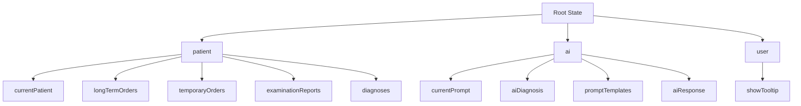

# 根状态仓库配置

<cite>
**Referenced Files in This Document**   
- [index.js](file://src/store/index.js)
- [ai.js](file://src/store/modules/ai.js)
- [patient.js](file://src/store/modules/patient.js)
- [user.js](file://src/store/modules/user.js)
- [main.js](file://src/main.js)
</cite>

## 目录
1. [Vuex初始化与注册](#vuex初始化与注册)
2. [模块化架构与命名空间](#模块化架构与命名空间)
3. [全局状态结构](#全局状态结构)
4. [组件中访问状态](#组件中访问状态)
5. [根实例注入](#根实例注入)
6. [生产环境优化](#生产环境优化)

## Vuex初始化与注册

在Vue 3项目中，Vuex状态管理库通过`createStore`函数进行初始化。项目在`src/store/index.js`文件中创建了全局唯一的store实例。与Vue 2中使用`Vue.use(Vuex)`不同，Vue 3采用组合式API方式，通过`app.use(store)`将store注入到应用实例中。

store的创建过程包含模块注册和全局actions定义。通过导入`./modules/`目录下的`patient`、`ai`和`user`三个模块，并在`createStore`配置对象的`modules`字段中注册，实现了功能模块的分离与整合。这种模块化设计使得状态管理更加清晰和可维护。

**Section sources**
- [index.js](file://src/store/index.js#L1-L20)
- [main.js](file://src/main.js#L1-L20)

## 模块化架构与命名空间

本项目采用模块化架构，将应用状态划分为三个独立的命名空间模块：`patient`（患者管理）、`ai`（AI助手）和`user`（用户设置）。每个模块在各自的定义文件中通过`namespaced: true`配置启用命名空间，确保了模块内状态、mutations、actions和getters的唯一性，避免了不同模块间的命名冲突。

例如，在`ai.js`模块中，`namespaced: true`的设置使得该模块的所有操作都必须通过`ai/`前缀进行访问。这种命名空间机制不仅提高了代码的可读性，还增强了模块的封装性，使得每个功能模块可以独立开发和测试。

**Section sources**
- [ai.js](file://src/store/modules/ai.js#L2-L5)
- [patient.js](file://src/store/modules/patient.js#L2-L5)
- [user.js](file://src/store/modules/user.js#L2-L5)

## 全局状态结构

合并后的全局state呈现出清晰的层次结构，根状态对象包含三个顶级命名空间：`patient`、`ai`和`user`。每个命名空间对应其模块定义文件中的`state`对象。

`ai`模块的状态包含AI诊断相关数据，如`currentPrompt`（当前提示）、`aiDiagnosis`（AI诊断结果）、`promptTemplates`（提示模板）等。`patient`模块管理患者相关信息，包括`currentPatient`（当前患者）、`longTermOrders`（长期医嘱）、`temporaryOrders`（临时医嘱）等。`user`模块则维护用户界面状态，如`showTooltip`（工具提示显示状态）。

这种分层结构使得应用状态一目了然，便于开发者理解和维护。

**Diagram sources**
- [index.js](file://src/store/index.js#L6-L12)
- [ai.js](file://src/store/modules/ai.js#L4-L20)
- [patient.js](file://src/store/modules/patient.js#L4-L20)
- [user.js](file://src/store/modules/user.js#L4-L6)

## 组件中访问状态

在Vue组件中，可以通过`this.$store.state`访问全局状态。由于启用了命名空间，访问模块内的状态需要包含模块名称作为路径前缀。

例如，要访问AI模块中的当前提示，应使用`this.$store.state.ai.currentPrompt`；访问患者模块中的当前患者信息，则使用`this.$store.state.patient.currentPatient`。同样，提交mutations或调用actions时也需要包含命名空间，如`this.$store.commit('ai/SET_CURRENT_PROMPT', prompt)`或`this.$store.dispatch('patient/fetchDiagnoses')`。

这种完整的路径访问方式虽然略显冗长，但极大地提高了代码的可读性和可维护性，明确指出了状态的来源和作用域。

**Section sources**
- [ai.js](file://src/store/modules/ai.js#L4-L20)
- [patient.js](file://src/store/modules/patient.js#L4-L20)

## 根实例注入

store实例通过`main.js`文件注入到Vue根实例中。在应用初始化时，首先通过`createApp(App)`创建应用实例，然后使用`app.use(store)`将store注册为应用的插件。这一过程确保了store能够被所有子组件通过`this.$store`访问。

此外，`main.js`中还执行了其他重要的初始化操作，如注册路由、Element Plus UI库，并在应用启动时通过`store.dispatch('patient/fetchDicInputData')`预加载字典数据，为应用的正常运行做好准备。

**Section sources**
- [main.js](file://src/main.js#L1-L20)
- [index.js](file://src/store/index.js#L1-L20)

## 生产环境优化

在生产环境下，为了优化性能，应确保`strict`模式被禁用。`strict`模式主要用于开发阶段，它会对state的直接修改进行检测并抛出错误，有助于发现状态管理中的问题。但在生产环境中，这种检测会带来额外的性能开销，因此应在构建时移除。

本项目中未显式配置`strict`模式，Vuex默认在开发环境下启用严格模式，在生产环境下自动禁用，这是一种推荐的做法。此外，应避免在生产环境中使用可能影响性能的插件，如详细的日志记录插件。对于需要持久化的状态，应采用高效的存储策略，如localStorage的批量操作或IndexedDB，以减少I/O开销。

**Section sources**
- [index.js](file://src/store/index.js#L1-L20)