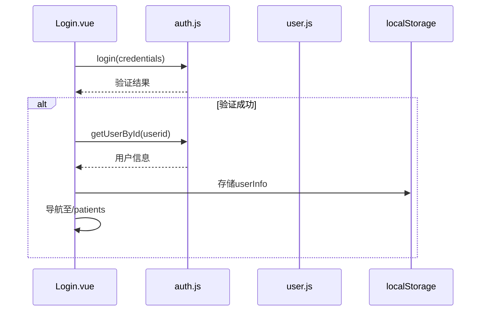
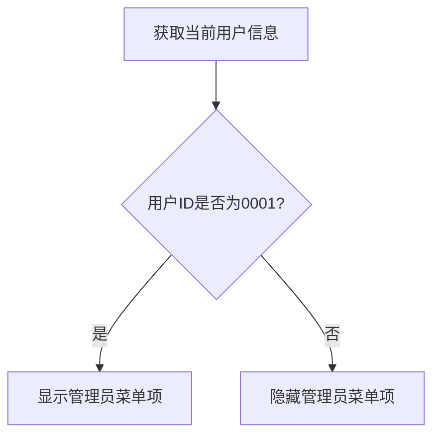

<cite>
**本文档中引用的文件**
- [user.js](file://src/store/modules/user.js)
- [auth.js](file://src/api/auth.js)
- [Login.vue](file://src/views/Login.vue)
- [TopMenu.vue](file://src/components/TopMenu.vue)
- [UserInfoEditDialog.vue](file://src/components/user/UserInfoEditDialog.vue)
</cite>

# 用户状态管理模块

## 目录
1. [模块概述](#模块概述)
2. [状态结构与数据持久化](#状态结构与数据持久化)
3. [核心操作流程分析](#核心操作流程分析)
4. [权限与UI控制机制](#权限与UI控制机制)
5. [模块协同与安全建议](#模块协同与安全建议)

## 模块概述

用户状态管理模块是医疗AI助手前端应用的核心组件之一，负责集中管理用户的身份验证状态、基本信息、个性化设置等关键数据。该模块采用Vuex作为状态管理库，通过`user.js`文件定义了独立的命名空间模块，实现了用户相关状态的封装与管理。

本模块与API服务层、UI组件层紧密协作，确保了用户登录状态的全局一致性。其主要职责包括：处理用户登录/登出流程、存储和同步用户信息、管理界面偏好设置，并为其他组件提供权限校验和状态查询服务。

**Section sources**
- [user.js](file://src/store/modules/user.js#L1-L20)

## 状态结构与数据持久化

### 状态字段结构

用户状态模块定义了多个关键状态字段，用于存储用户的不同类型信息：

- `showTooltip`: 布尔值，表示是否显示界面提示信息，属于用户的个性化设置范畴。

**Section sources**
- [user.js](file://src/store/modules/user.js#L3-L5)

### 本地存储同步机制

本模块通过与`localStorage`的协同工作，实现了用户状态的持久化存储。当用户完成登录操作后，系统会将用户的关键信息（如用户ID、用户名、科室信息、专业组等）以JSON格式序列化后存储到`localStorage`中，键名为`userInfo`。

这种设计确保了用户在刷新页面或重新打开应用时，能够保持登录状态和个性化设置。同时，通过监听`storage`事件，当`localStorage`中的`userInfo`发生变化时，相关组件（如TopMenu.vue）能够及时更新其显示内容，保证了UI与状态的一致性。

**Section sources**
- [Login.vue](file://src/views/Login.vue#L135-L145)
- [TopMenu.vue](file://src/components/TopMenu.vue#L245-L255)

## 核心操作流程分析

### 登录流程

用户登录流程始于`Login.vue`组件，当用户输入凭证并点击登录按钮后，系统执行以下步骤：

1. 验证用户输入的科室选择
2. 调用`auth.js`中的`login` API，使用用户ID和密码进行身份验证
3. 验证通过后，调用`getUserById`获取用户详细信息
4. 将用户信息（包括用户ID、用户名、科室ID、科室名称、专业组）序列化后存储到`localStorage`
5. 导航至病人列表页面

**Diagram sources**
- [Login.vue](file://src/views/Login.vue#L150-L190)
- [auth.js](file://src/api/auth.js#L9-L18)

### 登出流程

登出流程由`TopMenu.vue`组件触发，执行以下操作：

1. 显示确认对话框，确保用户意图
2. 清除`localStorage`中的`token`和`userInfo`
3. 重置应用状态
4. 重定向至登录页面

此流程确保了用户敏感信息的及时清除，符合安全最佳实践。

**Section sources**
- [TopMenu.vue](file://src/components/TopMenu.vue#L370-L385)

## 权限与UI控制机制

### 权限校验实现

系统通过计算属性`isAdminUser`实现管理员权限校验。该属性检查当前用户的ID是否为`0001`，若是则赋予管理员权限，从而控制特定功能菜单的可见性。

**Diagram sources**
- [TopMenu.vue](file://src/components/TopMenu.vue#L185-L195)

### UI元素动态控制

用户状态模块通过多种机制实现UI元素的动态控制：

1. **菜单项控制**：根据用户权限动态显示或隐藏特定菜单项，如AI设置、DIC修改、服务器维护等管理员专属功能。
2. **提示信息控制**：通过`showTooltip`状态和`updateShowTooltip`动作，允许用户在"修改用户信息"对话框中启用或禁用界面提示信息。
3. **用户信息显示**：在顶部菜单栏实时显示当前用户的基本信息，包括用户名、专业组和科室名称。

这些机制共同实现了基于用户状态的个性化用户体验。

**Section sources**
- [TopMenu.vue](file://src/components/TopMenu.vue#L100-L130)
- [UserInfoEditDialog.vue](file://src/components/user/UserInfoEditDialog.vue#L55-L60)

## 模块协同与安全建议

### 模块间协同

用户状态管理模块与其他模块的协同工作主要体现在：

1. **与API拦截器协同**：虽然当前代码未直接展示，但通常此类系统会配置API拦截器，在每次请求时自动添加认证令牌（token），并在令牌过期时触发重新登录。
2. **与路由系统协同**：通过Vuex状态与Vue Router的结合，实现基于用户权限的路由守卫，防止未授权访问。
3. **与事件总线协同**：使用全局事件总线（eventBus）进行跨组件通信，如警告状态的更新通知。

### 安全存储建议

尽管当前实现已将用户信息存储在`localStorage`中，但针对敏感信息的安全存储，建议：

1. **避免存储敏感凭证**：不应在客户端存储明文密码或长期有效的认证令牌。
2. **使用HttpOnly Cookie**：对于认证令牌，建议使用HttpOnly Cookie进行存储，以防止XSS攻击窃取。
3. **实施令牌刷新机制**：结合短期访问令牌和长期刷新令牌，定期更新访问令牌，降低令牌泄露风险。
4. **加密本地存储**：对存储在`localStorage`中的敏感信息进行加密处理，增加数据安全性。

当前实现中，用户密码仅在登录时临时使用，未在本地持久化存储，符合基本安全要求。但建议进一步优化认证令牌的管理方式，提升整体安全性。

**Section sources**
- [Login.vue](file://src/views/Login.vue#L135-L145)
- [TopMenu.vue](file://src/components/TopMenu.vue#L370-L385)