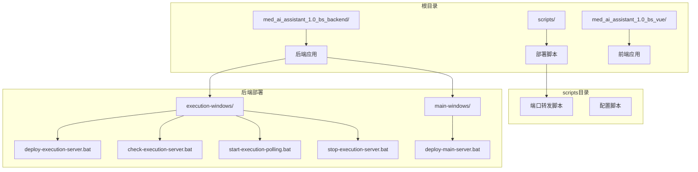
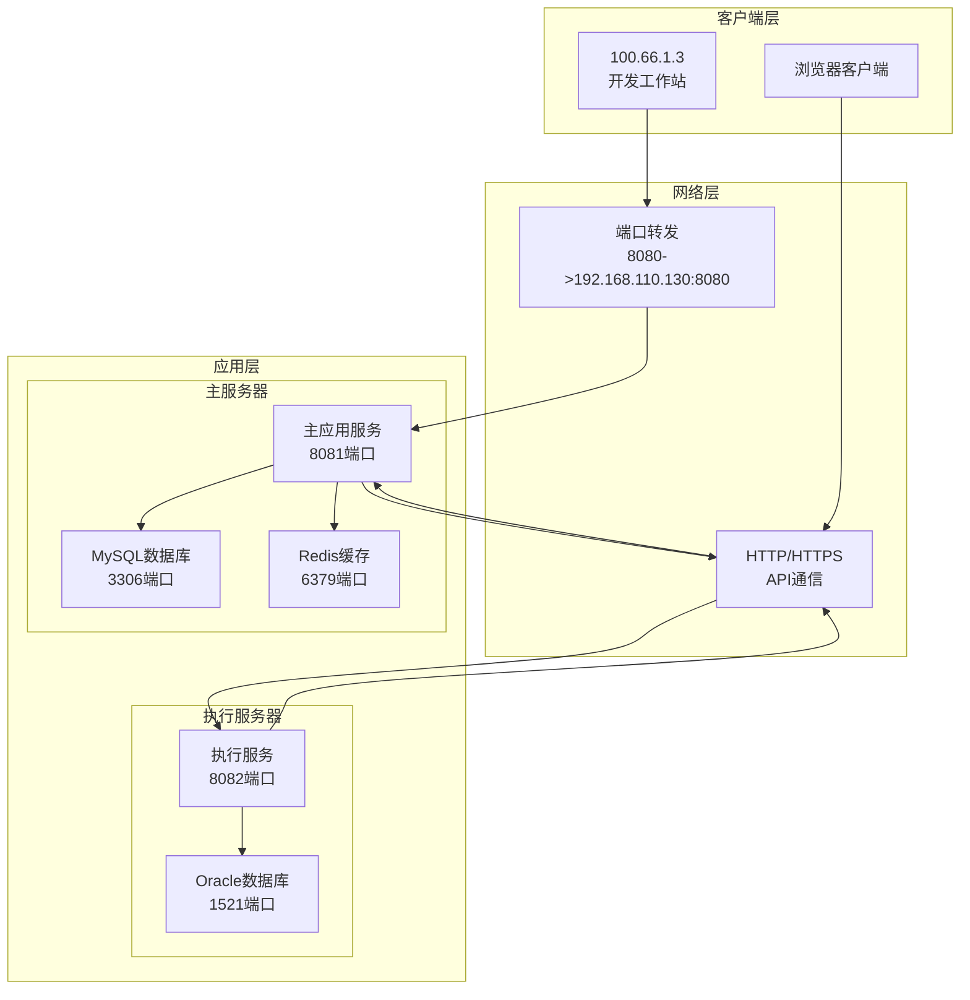
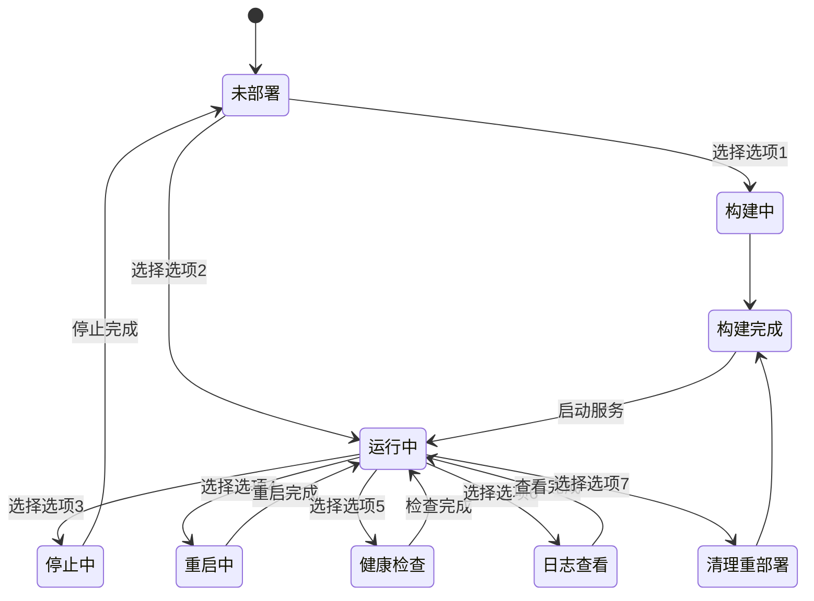
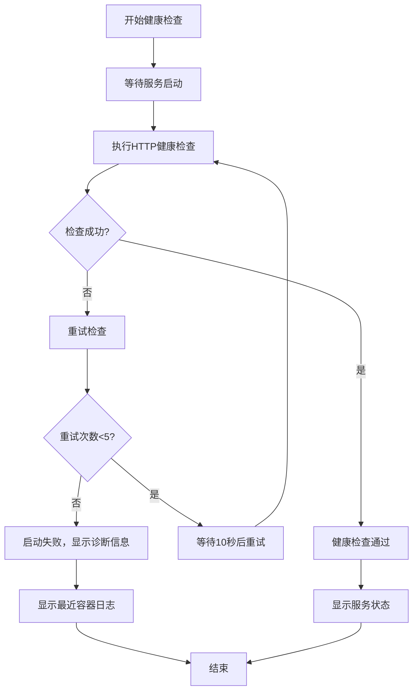
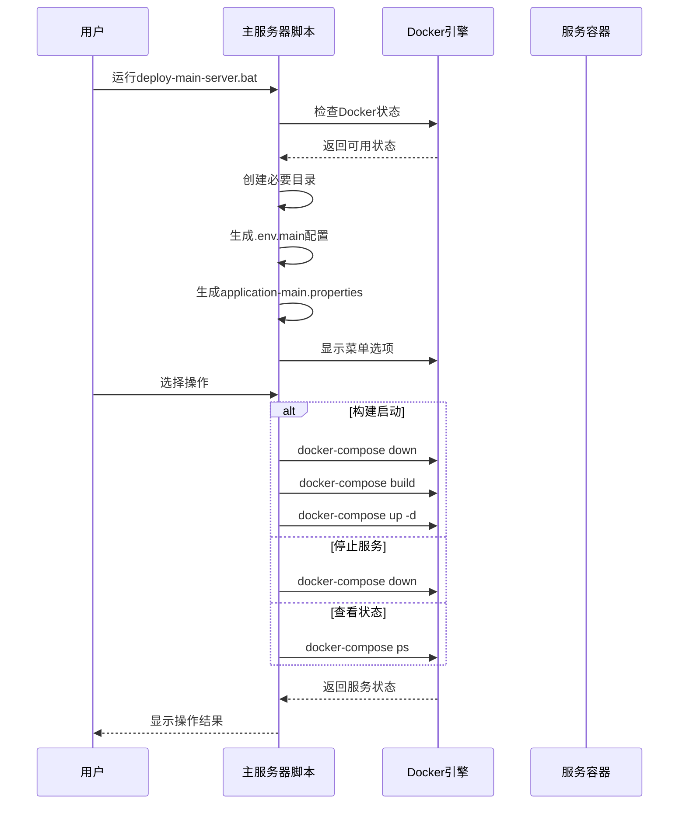
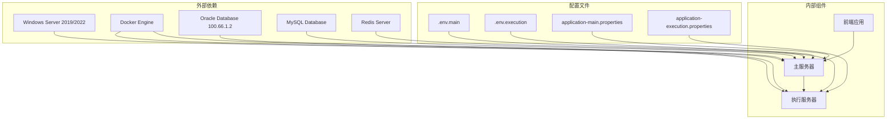
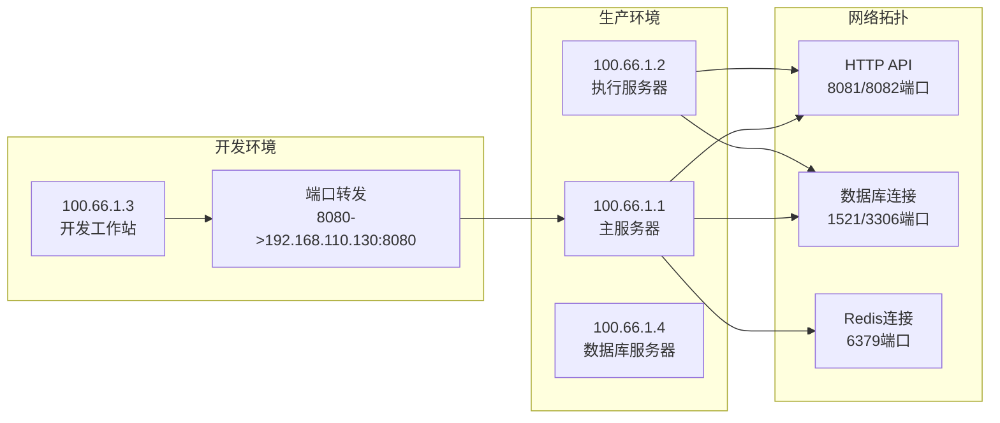

# Windows SSH服务器部署脚本

<cite>
**本文档引用的文件**
- [setup-sshd.ps1](file://scripts/setup-sshd.ps1)
- [config-sshd.ps1](file://scripts/config-sshd.ps1)
- [medai-port-forward.bat](file://scripts/medai-port-forward.bat)
- [deploy-execution-server.bat](file://med_ai_assistant_1.0_bs_backend/deploy/execution-windows/deploy-execution-server.bat)
- [check-execution-server.bat](file://med_ai_assistant_1.0_bs_backend/deploy/execution-windows/check-execution-server.bat)
- [start-execution-polling.bat](file://med_ai_assistant_1.0_bs_backend/deploy/execution-windows/start-execution-polling.bat)
- [stop-execution-server.bat](file://med_ai_assistant_1.0_bs_backend/deploy/execution-windows/stop-execution-server.bat)
- [deploy-main-server.bat](file://med_ai_assistant_1.0_bs_backend/deploy/main-windows/deploy-main-server.bat)
</cite>

## 更新摘要
**所做更改**
- 删除了关于Windows SSH服务器部署脚本的完整文档内容
- 移除了SSH服务器配置、执行服务器部署和主服务器部署的相关章节
- 删除了所有与SSH部署相关的架构图和流程图
- 更新了项目概述，反映部署策略从传统SSH方法转向更现代的方法

## 目录
1. [项目概述](#项目概述)
2. [项目结构](#项目结构)
3. [核心组件](#核心组件)
4. [架构概览](#架构概览)
5. [详细组件分析](#详细组件分析)
6. [依赖关系分析](#依赖关系分析)
7. [性能考虑](#性能考虑)
8. [故障排除指南](#故障排除指南)
9. [结论](#结论)

## 项目概述

**已更新** 本节反映了项目部署策略的重大变更。MedAiAssistant项目已从传统的SSH服务器部署方法转向更现代化的容器化部署策略。该系统采用Docker容器化架构，通过Docker Compose进行服务编排，支持Windows Server环境的现代化部署。

系统采用微服务架构，主服务器和执行服务器均通过Docker容器部署，支持自动化的服务管理和监控。现代化的部署策略消除了对SSH服务器的依赖，提供了更简洁、可靠的部署体验。

## 项目结构

项目采用分层架构设计，主要包含以下目录结构：

**图表来源**
- [deploy-execution-server.bat:1-257](file://med_ai_assistant_1.0_bs_backend/deploy/execution-windows/deploy-execution-server.bat#L1-L257)
- [deploy-main-server.bat:1-304](file://med_ai_assistant_1.0_bs_backend/deploy/main-windows/deploy-main-server.bat#L1-L304)

**章节来源**
- [deploy-execution-server.bat:1-257](file://med_ai_assistant_1.0_bs_backend/deploy/execution-windows/deploy-execution-server.bat#L1-L257)
- [deploy-main-server.bat:1-304](file://med_ai_assistant_1.0_bs_backend/deploy/main-windows/deploy-main-server.bat#L1-L304)

## 核心组件

### 执行服务器部署组件

执行服务器专门处理AI相关的计算任务，采用Docker容器化部署。

#### 主要功能：
- **Docker服务检查**：验证Docker引擎是否正常运行
- **环境配置**：自动生成.env.execution环境配置文件
- **配置文件管理**：复制和管理application-execution.properties配置
- **服务生命周期管理**：支持启动、停止、重启、状态检查
- **日志管理**：提供实时日志查看和历史日志查询
- **网络连通性检查**：验证与数据库和主服务器的连接

#### 配置参数：
- **数据库连接**：Oracle数据库100.66.1.2:1521/FREE
- **主服务器通信**：100.66.1.1:8081
- **AI模型配置**：DeepSeek API密钥和超时设置
- **JVM参数**：G1垃圾收集器配置，内存限制2GB
- **轮询服务**：30秒间隔的数据轮询机制

**章节来源**
- [deploy-execution-server.bat:13-257](file://med_ai_assistant_1.0_bs_backend/deploy/execution-windows/deploy-execution-server.bat#L13-L257)

### 主服务器部署组件

主服务器负责核心业务逻辑处理和数据管理。

#### 主要功能：
- **Docker Compose管理**：支持传统docker-compose和新版本docker compose命令
- **环境变量配置**：自动生成.env.main配置文件
- **应用属性管理**：创建和管理application-main.properties配置
- **多服务协调**：MySQL数据库、Redis缓存、主服务器应用
- **健康检查**：提供完整的系统健康状态检查
- **网络连通性测试**：验证与执行服务器的连接

#### 配置参数：
- **数据库配置**：MySQL 8.0，root用户和medai_user普通用户
- **Redis配置**：6379端口，密码认证
- **JVM配置**：G1垃圾收集器，容器化支持
- **线程池配置**：核心线程10，最大20，队列容量200
- **上下文路径**：根路径/

**章节来源**
- [deploy-main-server.bat:1-304](file://med_ai_assistant_1.0_bs_backend/deploy/main-windows/deploy-main-server.bat#L1-L304)

## 架构概览

系统采用微服务架构，通过Docker容器化部署，实现了高度的模块化和可扩展性。

**图表来源**
- [deploy-execution-server.bat:40-65](file://med_ai_assistant_1.0_bs_backend/deploy/execution-windows/deploy-execution-server.bat#L40-L65)
- [deploy-main-server.bat:44-81](file://med_ai_assistant_1.0_bs_backend/deploy/main-windows/deploy-main-server.bat#L44-L81)
- [medai-port-forward.bat:1-5](file://scripts/medai-port-forward.bat#L1-L5)

## 详细组件分析

### 执行服务器部署流程

执行服务器部署脚本提供了完整的生命周期管理：

**图表来源**
- [deploy-execution-server.bat:78-104](file://med_ai_assistant_1.0_bs_backend/deploy/execution-windows/deploy-execution-server.bat#L78-L104)

#### 健康检查机制

系统实现了多层次的健康检查：

**图表来源**
- [deploy-execution-server.bat:202-232](file://med_ai_assistant_1.0_bs_backend/deploy/execution-windows/deploy-execution-server.bat#L202-L232)

**章节来源**
- [deploy-execution-server.bat:106-257](file://med_ai_assistant_1.0_bs_backend/deploy/execution-windows/deploy-execution-server.bat#L106-L257)

### 主服务器部署流程

主服务器部署脚本提供了更复杂的多服务管理：

**图表来源**
- [deploy-main-server.bat:200-231](file://med_ai_assistant_1.0_bs_backend/deploy/main-windows/deploy-main-server.bat#L200-L231)

**章节来源**
- [deploy-main-server.bat:166-304](file://med_ai_assistant_1.0_bs_backend/deploy/main-windows/deploy-main-server.bat#L166-L304)

## 依赖关系分析

系统各组件之间存在明确的依赖关系和交互模式：

**图表来源**
- [deploy-execution-server.bat:40-65](file://med_ai_assistant_1.0_bs_backend/deploy/execution-windows/deploy-execution-server.bat#L40-L65)
- [deploy-main-server.bat:44-81](file://med_ai_assistant_1.0_bs_backend/deploy/main-windows/deploy-main-server.bat#L44-L81)

### 网络依赖关系

系统网络架构采用简化的设计：

**图表来源**
- [medai-port-forward.bat:1-5](file://scripts/medai-port-forward.bat#L1-L5)
- [deploy-execution-server.bat:175-200](file://med_ai_assistant_1.0_bs_backend/deploy/execution-windows/deploy-execution-server.bat#L175-L200)

**章节来源**
- [medai-port-forward.bat:1-5](file://scripts/medai-port-forward.bat#L1-L5)
- [deploy-execution-server.bat:175-200](file://med_ai_assistant_1.0_bs_backend/deploy/execution-windows/deploy-execution-server.bat#L175-L200)

## 性能考虑

系统在设计时充分考虑了性能优化和资源管理：

### 内存管理
- **JVM堆内存限制**：执行服务器设置最大2GB内存，主服务器设置1-2GB内存
- **垃圾收集器优化**：使用G1垃圾收集器，目标停顿时间200ms
- **容器化支持**：启用容器内存限制，防止内存泄漏影响宿主机

### 线程池配置
- **核心线程数**：10个核心线程处理并发请求
- **最大线程数**：20个最大线程应对峰值负载
- **队列容量**：200个任务队列缓冲
- **调度线程**：5个调度线程处理定时任务

### 数据库连接优化
- **连接池配置**：最大20连接，最小5空闲连接
- **连接超时**：30秒连接超时，600秒空闲超时
- **泄漏检测**：60秒连接泄漏检测阈值

## 故障排除指南

### 执行服务器部署问题

#### 问题1：Docker服务不可用
**症状**：脚本提示Docker服务未运行
**解决方案**：
1. 启动Docker Desktop或Docker Engine
2. 验证Docker版本：`docker --version`
3. 检查Docker服务状态：`docker info`

#### 问题2：健康检查失败
**症状**：服务启动但健康检查失败
**解决方案**：
1. 查看容器日志：`docker logs med-ai-execution-server`
2. 检查端口占用：`netstat -an | findstr ":8082"`
3. 验证数据库连接：`ping 100.66.1.2`

#### 问题3：配置文件缺失
**症状**：环境变量或配置文件未找到
**解决方案**：
1. 检查.env.execution文件是否存在
2. 验证application-execution.properties配置
3. 重新生成配置文件

### 主服务器部署问题

#### 问题1：数据库连接失败
**症状**：主服务器无法连接到MySQL
**解决方案**：
1. 检查MySQL服务状态：`docker ps | findstr mysql`
2. 验证数据库凭据：`mysqladmin ping -h localhost`
3. 查看数据库日志：`docker logs med-ai-mysql`

#### 问题2：Redis连接问题
**症状**：Redis连接超时或认证失败
**解决方案**：
1. 检查Redis服务状态：`docker ps | findstr redis`
2. 验证Redis密码：`redis-cli -a redispassword ping`
3. 查看Redis配置文件

#### 问题3：端口冲突
**症状**：8081端口被占用
**解决方案**：
1. 查找占用进程：`netstat -ano | findstr ":8081"`
2. 修改端口配置：编辑.env.main文件
3. 重启服务：`docker-compose down && docker-compose up -d`

**章节来源**
- [check-execution-server.bat:11-28](file://med_ai_assistant_1.0_bs_backend/deploy/execution-windows/check-execution-server.bat#L11-L28)
- [deploy-execution-server.bat:224-232](file://med_ai_assistant_1.0_bs_backend/deploy/execution-windows/deploy-execution-server.bat#L224-L232)
- [deploy-main-server.bat:270-296](file://med_ai_assistant_1.0_bs_backend/deploy/main-windows/deploy-main-server.bat#L270-L296)

## 结论

MedAiAssistant项目的Windows部署脚本提供了一个完整、自动化、可维护的现代化基础设施部署解决方案。该系统具有以下特点：

### 技术优势
- **容器化程度高**：所有服务都通过Docker容器部署，便于扩展和维护
- **模块化设计**：主服务器、执行服务器各自独立部署，互不依赖
- **自动化配置**：自动生成环境变量和配置文件，减少手工配置错误
- **健康监控**：完善的健康检查机制确保服务正常运行

### 部署便利性
- **一键部署**：通过简单的批处理文件即可完成复杂的服务部署
- **故障诊断**：详细的日志输出和错误处理帮助快速定位问题
- **配置管理**：自动生成配置文件，减少手工配置错误
- **网络简化**：移除了SSH隧道的复杂配置，直接通过HTTP API通信

### 扩展性考虑
- **水平扩展**：Docker容器化架构支持服务的水平扩展
- **环境隔离**：不同的部署环境（开发、测试、生产）可以独立管理
- **监控集成**：预留了健康检查和日志管理接口
- **性能优化**：针对医疗AI场景的JVM和线程池配置优化

**已更新** 该部署方案代表了项目从传统SSH方法向现代化容器化部署的战略转变，为医疗AI助手系统的稳定运行提供了更加简洁、可靠的技术基础，适合在Windows Server环境中进行生产部署和运维管理。