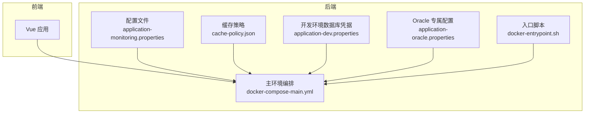
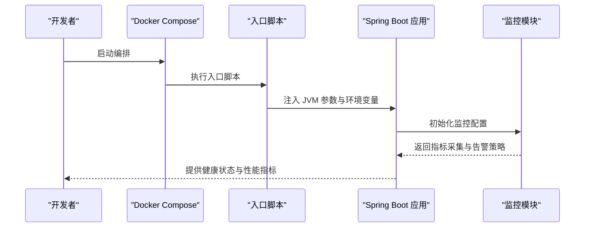
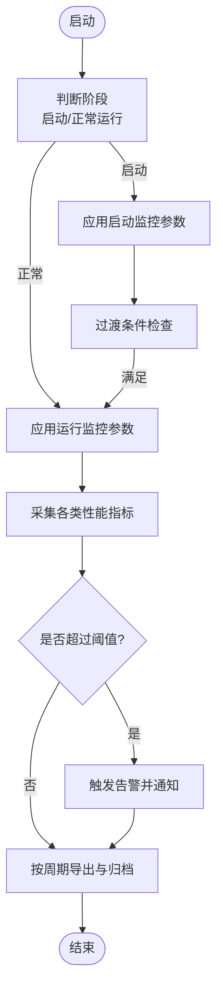
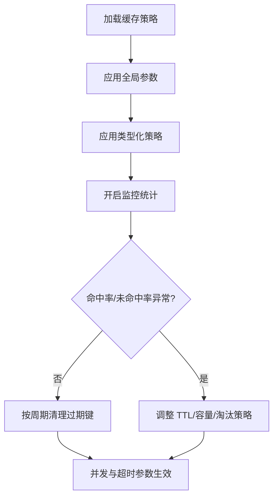
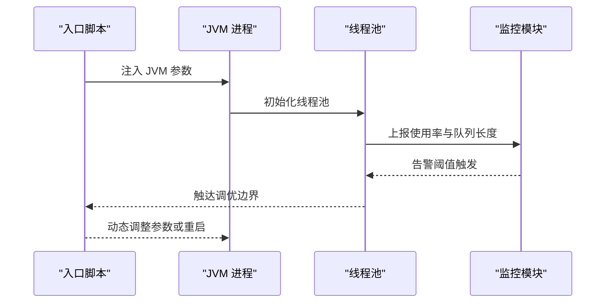
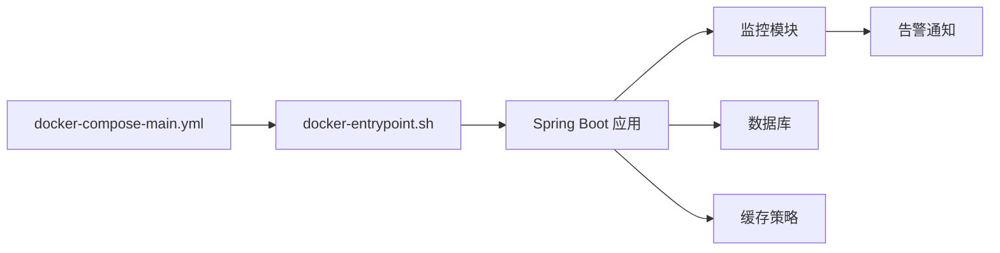

# 性能调优

<cite>
**本文引用的文件**
- [.gitignore](file://.gitignore)
- [application-monitoring.properties](file://med_ai_assistant_1.0_bs_backend/config/application-monitoring.properties)
- [cache-policy.json](file://med_ai_assistant_1.0_bs_backend/memory-bank/config/cache-policy.json)
- [application-dev.properties](file://med_ai_assistant_1.0_bs_backend/src/main/resources/application-dev.properties)
- [application-oracle.properties](file://med_ai_assistant_1.0_bs_backend/src/main/resources/application-oracle.properties)
- [docker-compose-main.yml](file://med_ai_assistant_1.0_bs_backend/deploy/main-linux-oracle/docker-compose-main.yml)
- [docker-entrypoint.sh](file://med_ai_assistant_1.0_bs_backend/deploy/main-linux-oracle/docker-entrypoint.sh)
</cite>

## 目录
1. [简介](#简介)
2. [项目结构](#项目结构)
3. [核心组件](#核心组件)
4. [架构总览](#架构总览)
5. [详细组件分析](#详细组件分析)
6. [依赖关系分析](#依赖关系分析)
7. [性能考量](#性能考量)
8. [故障排查指南](#故障排查指南)
9. [结论](#结论)
10. [附录](#附录)

## 简介
本文件面向 MedAiAssistant 1.0 BS 的性能调优工作，聚焦于系统运行期的性能监控与优化实践。内容涵盖：
- 性能监控指标的识别与分析：CPU、内存、数据库连接池、网络延迟等
- JVM 性能调优参数：堆内存、GC、线程池等
- 数据库性能优化：连接池配置、查询与索引优化建议
- AI 模型调用与缓存策略：缓存 TTL、淘汰策略、并发控制与清理策略
- 可操作的配置项与部署脚本参考路径

## 项目结构
该项目采用前后端分离架构，后端通过 Docker Compose 进行编排部署。前端 Vue 应用与后端 Spring Boot 应用分别位于独立子仓库中，当前仓库通过 .gitignore 将其排除在版本控制之外。

图表来源
- [docker-compose-main.yml](file://med_ai_assistant_1.0_bs_backend/deploy/main-linux-oracle/docker-compose-main.yml#L1-L200)
- [docker-entrypoint.sh](file://med_ai_assistant_1.0_bs_backend/deploy/main-linux-oracle/docker-entrypoint.sh#L1-L200)
- [application-monitoring.properties](file://med_ai_assistant_1.0_bs_backend/config/application-monitoring.properties#L1-L196)
- [cache-policy.json](file://med_ai_assistant_1.0_bs_backend/memory-bank/config/cache-policy.json#L1-L46)
- [application-dev.properties](file://med_ai_assistant_1.0_bs_backend/src/main/resources/application-dev.properties#L1-L2)
- [application-oracle.properties](file://med_ai_assistant_1.0_bs_backend/src/main/resources/application-oracle.properties#L1-L11)

章节来源
- [.gitignore](file://.gitignore#L1-L7)
- [docker-compose-main.yml](file://med_ai_assistant_1.0_bs_backend/deploy/main-linux-oracle/docker-compose-main.yml#L1-L200)

## 核心组件
- 性能监控配置中心：集中定义启动/运行阶段的监控阈值、采集间隔、告警策略与导出格式
- 缓存策略引擎：定义全局与分类型缓存的 TTL、容量、淘汰策略、并发与清理策略
- 数据库配置层：区分开发与生产环境的数据库方言、DDL 行为与连接池参数
- 部署编排与入口：通过 docker-compose 与入口脚本统一注入 JVM 参数与运行环境

章节来源
- [application-monitoring.properties](file://med_ai_assistant_1.0_bs_backend/config/application-monitoring.properties#L1-L196)
- [cache-policy.json](file://med_ai_assistant_1.0_bs_backend/memory-bank/config/cache-policy.json#L1-L46)
- [application-dev.properties](file://med_ai_assistant_1.0_bs_backend/src/main/resources/application-dev.properties#L1-L2)
- [application-oracle.properties](file://med_ai_assistant_1.0_bs_backend/src/main/resources/application-oracle.properties#L1-L11)
- [docker-compose-main.yml](file://med_ai_assistant_1.0_bs_backend/deploy/main-linux-oracle/docker-compose-main.yml#L1-L200)
- [docker-entrypoint.sh](file://med_ai_assistant_1.0_bs_backend/deploy/main-linux-oracle/docker-entrypoint.sh#L1-L200)

## 架构总览
下图展示后端服务在容器中的运行流程与关键性能相关配置注入点：

图表来源
- [docker-compose-main.yml](file://med_ai_assistant_1.0_bs_backend/deploy/main-linux-oracle/docker-compose-main.yml#L1-L200)
- [docker-entrypoint.sh](file://med_ai_assistant_1.0_bs_backend/deploy/main-linux-oracle/docker-entrypoint.sh#L1-L200)
- [application-monitoring.properties](file://med_ai_assistant_1.0_bs_backend/config/application-monitoring.properties#L1-L196)

## 详细组件分析

### 组件一：性能监控指标体系
- 监控阶段与阈值
  - 启动阶段：连接泄漏检测阈值、健康检查超时、监控持续时间、组件就绪检查间隔
  - 正常运行阶段：连接泄漏检测阈值、健康检查超时、监控间隔、组件健康检查间隔
  - 过渡条件：系统运行时间阈值与缓冲时间
  - 告警阈值：连接泄漏连续告警次数、系统健康度阈值、日志错误率阈值
- 指标采集与保留
  - 性能指标采集间隔、保留时间、基线周期
  - 日志监控间隔与级别切换
  - 数据库连接池与查询性能阈值
  - 线程池使用率与队列长度阈值
  - 内存使用率与 GC 时间阈值
  - API 响应时间与错误率阈值
- 导出与通知
  - 监控数据导出间隔、保留天数、压缩与格式
  - 告警通知方式、重试次数与静默期

图表来源
- [application-monitoring.properties](file://med_ai_assistant_1.0_bs_backend/config/application-monitoring.properties#L1-L196)

章节来源
- [application-monitoring.properties](file://med_ai_assistant_1.0_bs_backend/config/application-monitoring.properties#L1-L196)

### 组件二：缓存策略与性能参数
- 全局策略
  - 默认 TTL、最大缓存大小、淘汰策略（LRU）、压缩与加密开关
  - 监控统计间隔、命中率与未命中率阈值
  - 清理策略：周期、批量大小
  - 并发读写上限、读写超时
- 类型化缓存
  - 病人数据：高优先级、较长 TTL、较大容量
  - AI 响应：中优先级、较短 TTL、适中容量
  - 会话数据：低优先级、短 TTL、较小容量

图表来源
- [cache-policy.json](file://med_ai_assistant_1.0_bs_backend/memory-bank/config/cache-policy.json#L1-L46)

章节来源
- [cache-policy.json](file://med_ai_assistant_1.0_bs_backend/memory-bank/config/cache-policy.json#L1-L46)

### 组件三：数据库配置与优化要点
- 开发环境凭据
  - 用户名占位符，便于在部署时注入真实凭据
- Oracle 专属配置
  - 数据源类型、禁用 Hibernate DDL 自动更新、指定 Oracle 方言
  - 其他配置继承主配置文件
- 连接池与查询优化建议
  - 在运行期结合“数据库连接池使用率”与“查询性能阈值”进行调参
  - 建议配合慢查询日志与索引扫描分析定位热点 SQL

章节来源
- [application-dev.properties](file://med_ai_assistant_1.0_bs_backend/src/main/resources/application-dev.properties#L1-L2)
- [application-oracle.properties](file://med_ai_assistant_1.0_bs_backend/src/main/resources/application-oracle.properties#L1-L11)
- [application-monitoring.properties](file://med_ai_assistant_1.0_bs_backend/config/application-monitoring.properties#L92-L103)

### 组件四：JVM 性能调优参数与线程池优化
- JVM 参数注入位置
  - 通过入口脚本向应用进程注入 JVM 参数（如堆大小、GC 策略、线程池相关参数）
- 调优方向
  - 堆内存设置：根据缓存与业务峰值内存需求设定初始与最大堆
  - 垃圾回收器选择：结合延迟目标选择合适 GC，并关注单次 GC 时间阈值
  - 线程池优化：结合“线程池使用率”与“队列长度”阈值，动态调整核心/最大线程数与队列容量

图表来源
- [docker-entrypoint.sh](file://med_ai_assistant_1.0_bs_backend/deploy/main-linux-oracle/docker-entrypoint.sh#L1-L200)
- [application-monitoring.properties](file://med_ai_assistant_1.0_bs_backend/config/application-monitoring.properties#L105-L116)

章节来源
- [docker-entrypoint.sh](file://med_ai_assistant_1.0_bs_backend/deploy/main-linux-oracle/docker-entrypoint.sh#L1-L200)
- [application-monitoring.properties](file://med_ai_assistant_1.0_bs_backend/config/application-monitoring.properties#L105-L116)

## 依赖关系分析
- 配置依赖
  - 性能监控配置依赖于部署编排与入口脚本注入的运行时参数
  - 缓存策略由应用在启动时加载，影响内存与 IO 压力
  - 数据库配置影响连接池与查询性能，进而影响整体吞吐
- 外部依赖
  - 容器化运行环境与镜像版本
  - 监控与告警系统的集成（邮件、Webhook）

图表来源
- [docker-compose-main.yml](file://med_ai_assistant_1.0_bs_backend/deploy/main-linux-oracle/docker-compose-main.yml#L1-L200)
- [docker-entrypoint.sh](file://med_ai_assistant_1.0_bs_backend/deploy/main-linux-oracle/docker-entrypoint.sh#L1-L200)
- [application-monitoring.properties](file://med_ai_assistant_1.0_bs_backend/config/application-monitoring.properties#L179-L196)
- [cache-policy.json](file://med_ai_assistant_1.0_bs_backend/memory-bank/config/cache-policy.json#L1-L46)

章节来源
- [docker-compose-main.yml](file://med_ai_assistant_1.0_bs_backend/deploy/main-linux-oracle/docker-compose-main.yml#L1-L200)
- [docker-entrypoint.sh](file://med_ai_assistant_1.0_bs_backend/deploy/main-linux-oracle/docker-entrypoint.sh#L1-L200)
- [application-monitoring.properties](file://med_ai_assistant_1.0_bs_backend/config/application-monitoring.properties#L179-L196)
- [cache-policy.json](file://med_ai_assistant_1.0_bs_backend/memory-bank/config/cache-policy.json#L1-L46)

## 性能考量
- CPU 使用率
  - 关注线程池使用率与队列长度，避免长时间高排队导致 CPU 等待放大
  - 结合 API 响应时间阈值，定位慢接口与阻塞点
- 内存占用
  - 控制缓存 TTL 与容量，避免内存抖动与 GC 压力
  - 监控内存使用率与 GC 时间，防止 Full GC 频繁发生
- 数据库连接池
  - 使用率高于阈值时，优先扩容连接池或优化慢查询
  - 配合查询性能阈值，定期审查执行计划与索引
- 网络延迟
  - API 响应时间与错误率阈值用于衡量外部依赖与网络质量
  - 对外调用链路建议增加超时与重试策略

## 故障排查指南
- 连接泄漏与健康度告警
  - 启动阶段与正常阶段的健康检查超时与监控间隔不同，需按阶段分别排查
  - 连续多次连接泄漏告警需检查资源释放与连接池配置
- 线程池问题
  - 使用率与队列长度同时升高，优先扩容或优化任务类型
  - 队列积压严重时，考虑引入限流或异步化改造
- 内存与 GC
  - GC 时间过长时，检查对象生命周期与大对象分配
  - 内存使用率持续偏高，核对缓存策略与淘汰机制
- 数据库性能
  - 查询时间超过阈值时，结合慢查询日志与索引扫描分析
  - 连接池使用率过高时，评估并发与批处理策略
- API 网络问题
  - 响应时间与错误率超过阈值，检查上游依赖与网络连通性

章节来源
- [application-monitoring.properties](file://med_ai_assistant_1.0_bs_backend/config/application-monitoring.properties#L47-L147)

## 结论
通过集中化的监控配置、可调的缓存策略与规范的数据库配置，MedAiAssistant 1.0 BS 在运行期具备了完善的性能可观测性与可调优空间。建议以“指标驱动 + 配置治理 + 运行时调优”的闭环方式，持续迭代 JVM 参数、线程池与缓存策略，确保在高并发场景下的稳定性与低延迟。

## 附录
- 配置文件路径参考
  - 性能监控配置：[application-monitoring.properties](file://med_ai_assistant_1.0_bs_backend/config/application-monitoring.properties#L1-L196)
  - 缓存策略：[cache-policy.json](file://med_ai_assistant_1.0_bs_backend/memory-bank/config/cache-policy.json#L1-L46)
  - 开发数据库凭据：[application-dev.properties](file://med_ai_assistant_1.0_bs_backend/src/main/resources/application-dev.properties#L1-L2)
  - Oracle 专属配置：[application-oracle.properties](file://med_ai_assistant_1.0_bs_backend/src/main/resources/application-oracle.properties#L1-L11)
  - 主环境编排：[docker-compose-main.yml](file://med_ai_assistant_1.0_bs_backend/deploy/main-linux-oracle/docker-compose-main.yml#L1-L200)
  - 入口脚本（JVM 参数注入）：[docker-entrypoint.sh](file://med_ai_assistant_1.0_bs_backend/deploy/main-linux-oracle/docker-entrypoint.sh#L1-L200)