# 故障排查

<cite>
**本文引用的文件**
- [docker-compose.yml](file://med_ai_assistant_1.0_bs_backend/docker-compose.yml)
- [docker-compose-main.yml](file://med_ai_assistant_1.0_bs_backend/deploy/main-linux-oracle/docker-compose-main.yml)
- [hospital-Local.yaml](file://med_ai_assistant_1.0_bs_backend/config/hospitals/hospital-Local.yaml)
- [init.sql](file://med_ai_assistant_1.0_bs_backend/init.sql)
- [test-ai-api.bat](file://med_ai_assistant_1.0_bs_backend/test-scripts/test-ai-api.bat)
- [check-network-connectivity.bat](file://med_ai_assistant_1.0_bs_backend/test-scripts/check-network-connectivity.bat)
- [run-http-tests.bat](file://med_ai_assistant_1.0_bs_backend/test-scripts/run-http-tests.bat)
- [run-integration-tests.bat](file://med_ai_assistant_1.0_bs_backend/test-scripts/run-integration-tests.bat)
- [deploy-main-server.bat](file://med_ai_assistant_1.0_bs_backend/deploy/main-windows/deploy-main-server.bat)
- [deploy-execution-server.bat](file://med_ai_assistant_1.0_bs_backend/deploy/execution-windows/deploy-execution-server.bat)
- [RestTemplateConfig.java](file://med_ai_assistant_1.0_bs_backend/src/main/java/com/example/medaiassistant/config/RestTemplateConfig.java)
- [WebConfig.java](file://med_ai_assistant_1.0_bs_backend/src/main/java/com/example/medaiassistant/config/WebConfig.java)
- [DrgAiAnalysisService.java](file://med_ai_assistant_1.0_bs_backend/src/main/java/com/example/medaiassistant/service/DrgAiAnalysisService.java)
- [mvn.bat](file://mvn.bat)
- [常用.txt](file://项目相关/常用.txt)
- [Mermaid 代码修复 Prompt 模板.txt](file://项目相关/Mermaid 代码修复 Prompt 模板.txt)
- [神级Prompt.txt](file://项目相关/神级Prompt.txt)
- [更新小结.md](file://更新小结.md)
</cite>

## 更新摘要
**所做更改**
- 新增数据库完整性修复章节，详细说明DRG AI分析保存Prompt时ORA-01400错误的修复方案
- 新增编码问题修复章节，介绍全局JSON响应中文编码问题的UTF-8 MessageConverter配置修复案例
- 更新故障排查指南，增加数据库完整性约束和编码问题的专门诊断流程
- 新增编码问题预防措施和最佳实践建议

## 目录
1. [简介](#简介)
2. [项目结构](#项目结构)
3. [核心组件](#核心组件)
4. [架构总览](#架构总览)
5. [详细组件分析](#详细组件分析)
6. [依赖关系分析](#依赖关系分析)
7. [性能考量](#性能考量)
8. [故障排查指南](#故障排查指南)
9. [数据库完整性修复](#数据库完整性修复)
10. [编码问题修复](#编码问题修复)
11. [结论](#结论)
12. [附录](#附录)

## 简介
本指南面向MedAiAssistant 1.0 BS的运维与开发人员，提供系统常见故障的诊断流程与解决方案，覆盖服务启动失败、数据库连接异常、AI模型调用错误以及性能下降等问题。文档同时给出故障排查工具使用方法（系统监控数据解读、日志分析技巧、网络连通性测试），并解释紧急处理流程与恢复策略（数据回滚、服务降级、灾难恢复预案），最后提供故障预防与系统加固建议。

**更新** 本次更新特别增加了数据库完整性修复和编码问题修复的专门章节，为开发团队提供完整的故障排查参考。

## 项目结构
MedAiAssistant 1.0 BS采用前后端分离与容器化部署方案，后端通过Docker Compose编排，包含主服务、执行服务、MySQL数据库与Redis缓存等组件。配置文件位于config目录，测试脚本位于test-scripts目录，部署脚本位于deploy目录。

```mermaid
graph TB
subgraph "后端容器编排"
A["med-ai-backend<br/>端口:8081"]
B["mysql:8.0<br/>端口:3306"]
C["redis:7-alpine<br/>端口:6379"]
end
subgraph "主服务编排(main)"
M["med-ai-main<br/>端口:8081"]
R["redis:7-alpine<br/>端口:6379"]
end
subgraph "配置与脚本"
CFG["config/hospitals/*.yaml"]
TEST["test-scripts/*.bat"]
DEP["deploy/*/*.bat"]
END
A --> B
A --> C
M --> R
A -.-> CFG
M -.-> CFG
A -.-> TEST
M -.-> TEST
A -.-> DEP
M -.-> DEP
```

**图表来源**
- [docker-compose.yml:1-97](file://med_ai_assistant_1.0_bs_backend/docker-compose.yml#L1-L97)
- [docker-compose-main.yml:1-108](file://med_ai_assistant_1.0_bs_backend/deploy/main-linux-oracle/docker-compose-main.yml#L1-L108)

**章节来源**
- [docker-compose.yml:1-97](file://med_ai_assistant_1.0_bs_backend/docker-compose.yml#L1-L97)
- [docker-compose-main.yml:1-108](file://med_ai_assistant_1.0_bs_backend/deploy/main-linux-oracle/docker-compose-main.yml#L1-L108)

## 核心组件
- 主服务容器（med-ai-main）
  - 通过环境变量配置Redis、执行服务、AI模型超时、线程池大小、JVM参数等。
  - 健康检查端点为/api/health。
- 执行服务容器（med-ai-backend）
  - 通过环境变量配置数据源URL、用户名、密码、执行服务地址等。
  - 健康检查端点为/api/health。
- 数据库（MySQL 8.0）
  - 初始化脚本创建数据库、用户与系统配置表，并提供数据库状态与连接状态视图。
- 缓存（Redis）
  - 提供健康检查与资源限制配置。
- 配置文件（hospital-Local.yaml）
  - 定义HIS/LIS集成参数、同步策略与字段映射。
- 测试与部署脚本
  - 提供AI接口测试、网络连通性测试、HTTP测试、集成测试以及部署脚本。

**章节来源**
- [docker-compose.yml:5-35](file://med_ai_assistant_1.0_bs_backend/docker-compose.yml#L5-L35)
- [docker-compose-main.yml:5-66](file://med_ai_assistant_1.0_bs_backend/deploy/main-linux-oracle/docker-compose-main.yml#L5-L66)
- [hospital-Local.yaml:1-38](file://med_ai_assistant_1.0_bs_backend/config/hospitals/hospital-Local.yaml#L1-L38)
- [init.sql:1-119](file://med_ai_assistant_1.0_bs_backend/init.sql#L1-L119)

## 架构总览
系统采用微服务式容器编排，后端主服务负责业务处理与调度，执行服务负责具体任务轮询与处理，MySQL提供持久化存储，Redis提供缓存与会话支持。各组件通过独立网络隔离，便于故障定位与恢复。

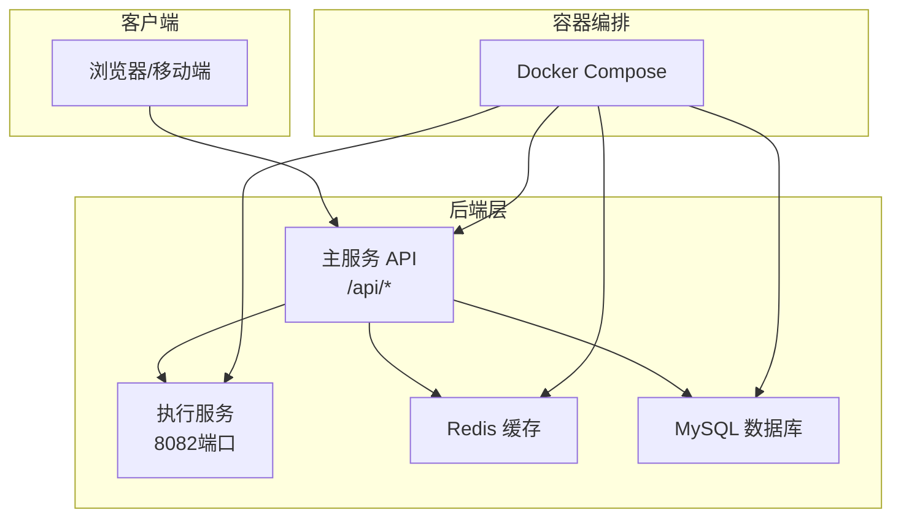

**图表来源**
- [docker-compose.yml:1-97](file://med_ai_assistant_1.0_bs_backend/docker-compose.yml#L1-L97)
- [docker-compose-main.yml:1-108](file://med_ai_assistant_1.0_bs_backend/deploy/main-linux-oracle/docker-compose-main.yml#L1-L108)

## 详细组件分析

### 组件A：主服务（med-ai-main）
- 关键职责
  - 对外提供API服务，内部协调Redis、执行服务与AI模型调用。
  - 通过环境变量控制线程池、JVM内存、AI模型超时与执行服务地址。
- 健康检查
  - 健康检查端点为/api/health，失败时触发重启策略。
- 资源限制
  - 限制内存与CPU配额，避免资源争用导致性能抖动。

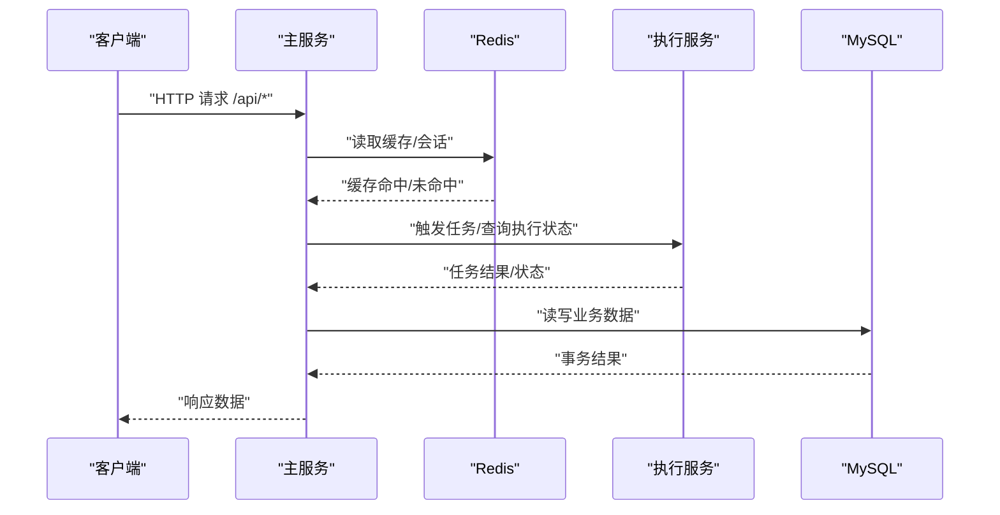

**图表来源**
- [docker-compose-main.yml:52-57](file://med_ai_assistant_1.0_bs_backend/deploy/main-linux-oracle/docker-compose-main.yml#L52-L57)
- [docker-compose.yml:29-35](file://med_ai_assistant_1.0_bs_backend/docker-compose.yml#L29-L35)

**章节来源**
- [docker-compose-main.yml:5-66](file://med_ai_assistant_1.0_bs_backend/deploy/main-linux-oracle/docker-compose-main.yml#L5-L66)
- [docker-compose-main.yml:52-57](file://med_ai_assistant_1.0_bs_backend/deploy/main-linux-oracle/docker-compose-main.yml#L52-L57)

### 组件B：执行服务（med-ai-backend）
- 关键职责
  - 处理轮询任务与业务执行，依赖MySQL与Redis。
- 健康检查
  - 健康检查端点为/api/health，失败时触发重启策略。
- 环境变量
  - 数据源URL、用户名、密码、执行服务地址等。

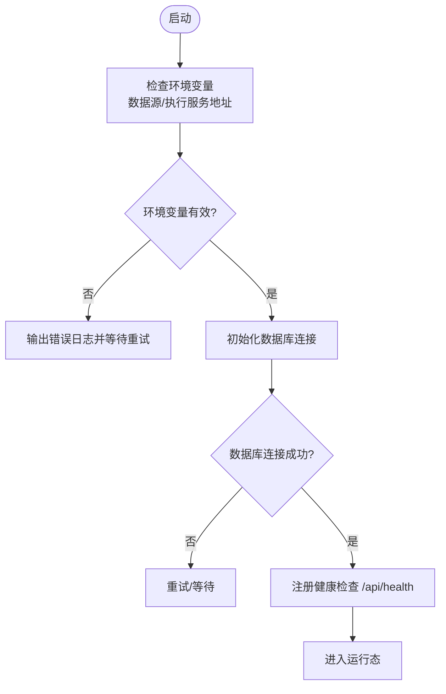

**图表来源**
- [docker-compose.yml:10-28](file://med_ai_assistant_1.0_bs_backend/docker-compose.yml#L10-L28)

**章节来源**
- [docker-compose.yml:1-97](file://med_ai_assistant_1.0_bs_backend/docker-compose.yml#L1-L97)

### 组件C：数据库（MySQL）
- 初始化脚本
  - 创建数据库、用户与系统配置表；插入初始配置；创建数据库状态与连接状态视图。
- 监控视图
  - database_status：按表大小排序展示数据库对象统计。
  - connection_status：展示当前连接与查询状态，便于定位慢查询与阻塞。

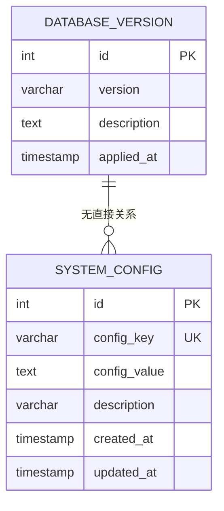

**图表来源**
- [init.sql:37-119](file://med_ai_assistant_1.0_bs_backend/init.sql#L37-L119)

**章节来源**
- [init.sql:1-119](file://med_ai_assistant_1.0_bs_backend/init.sql#L1-L119)

### 组件D：缓存（Redis）
- 配置要点
  - 密码认证、持久化策略、最大内存与淘汰策略。
- 健康检查
  - 通过ping命令检测可用性。

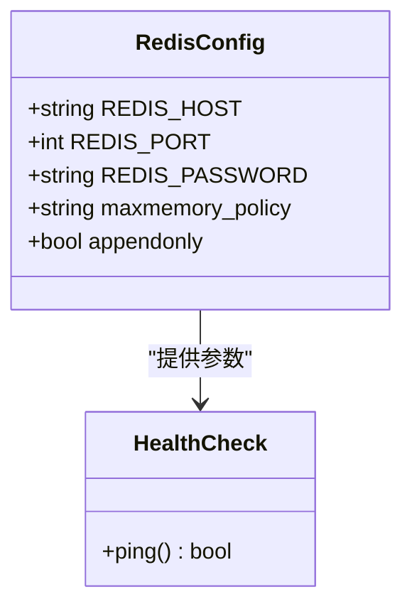

**图表来源**
- [docker-compose-main.yml:70-88](file://med_ai_assistant_1.0_bs_backend/deploy/main-linux-oracle/docker-compose-main.yml#L70-L88)

**章节来源**
- [docker-compose-main.yml:70-88](file://med_ai_assistant_1.0_bs_backend/deploy/main-linux-oracle/docker-compose-main.yml#L70-L88)

### 组件E：配置（hospital-Local.yaml）
- HIS/LIS集成参数
  - JDBC URL、用户名、密码、表前缀。
- 同步策略
  - Cron表达式、开关、最大重试次数与重试间隔。
- 字段映射
  - 患者ID、姓名、性别、出生日期、科室、入院/出院时间等字段映射。
- SQL模板
  - 指定SQL模板基础路径与覆盖文件列表。

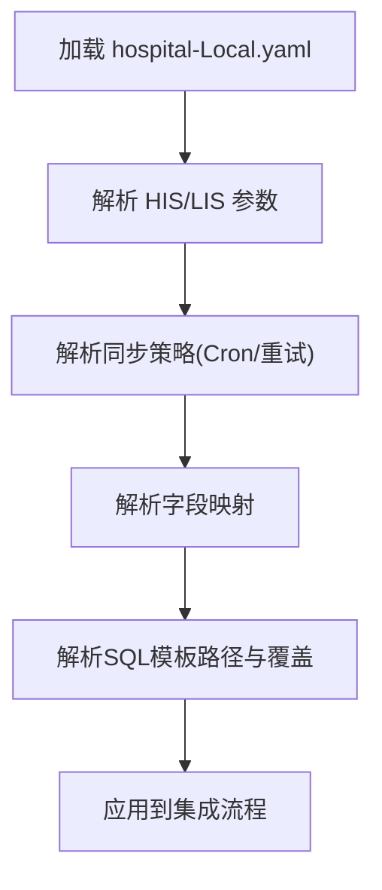

**图表来源**
- [hospital-Local.yaml:6-38](file://med_ai_assistant_1.0_bs_backend/config/hospitals/hospital-Local.yaml#L6-L38)

**章节来源**
- [hospital-Local.yaml:1-38](file://med_ai_assistant_1.0_bs_backend/config/hospitals/hospital-Local.yaml#L1-L38)

## 依赖关系分析
- 组件耦合
  - 主服务依赖Redis与MySQL；执行服务依赖MySQL；两者均依赖健康检查机制。
- 外部依赖
  - 执行服务访问外部执行服务器（IP:100.66.1.2，端口8082）。
  - AI模型调用通过API密钥与超时配置控制。
- 网络拓扑
  - 主服务与执行服务分别运行在不同子网，通过容器网络互通。

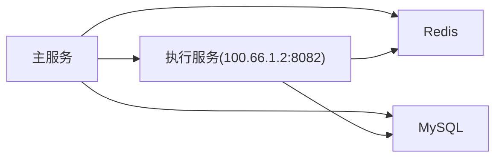

**图表来源**
- [docker-compose.yml:15-16](file://med_ai_assistant_1.0_bs_backend/docker-compose.yml#L15-L16)
- [docker-compose-main.yml:19-22](file://med_ai_assistant_1.0_bs_backend/deploy/main-linux-oracle/docker-compose-main.yml#L19-L22)

**章节来源**
- [docker-compose.yml:1-97](file://med_ai_assistant_1.0_bs_backend/docker-compose.yml#L1-L97)
- [docker-compose-main.yml:1-108](file://med_ai_assistant_1.0_bs_backend/deploy/main-linux-oracle/docker-compose-main.yml#L1-L108)

## 性能考量
- 线程池与JVM
  - 线程池核心/最大大小、队列容量与调度器大小影响并发处理能力。
  - JVM GC参数与内存上限决定系统吞吐与延迟表现。
- 缓存策略
  - Redis最大内存与淘汰策略影响热点数据命中率与内存压力。
- 数据库参数
  - 连接数、超时、缓冲池大小与日志文件大小影响数据库稳定性与性能。
- 网络与外部服务
  - AI模型超时与执行服务网络延迟直接影响整体响应时间。

**章节来源**
- [docker-compose-main.yml:30-35](file://med_ai_assistant_1.0_bs_backend/deploy/main-linux-oracle/docker-compose-main.yml#L30-L35)
- [init.sql:27-33](file://med_ai_assistant_1.0_bs_backend/init.sql#L27-L33)

## 故障排查指南

### 一、服务启动失败
- 排查步骤
  - 查看容器健康检查状态与日志输出。
  - 检查环境变量是否完整（如数据库URL、用户名、密码、执行服务地址、AI密钥等）。
  - 确认端口占用与防火墙放行。
- 常见原因
  - 环境变量缺失或拼写错误。
  - 数据库未就绪（健康检查未通过）。
  - 执行服务不可达（网络连通性问题）。
- 解决方案
  - 使用部署脚本进行一键部署与检查。
  - 通过健康检查端点确认服务可用性。
  - 修正环境变量后重启容器。

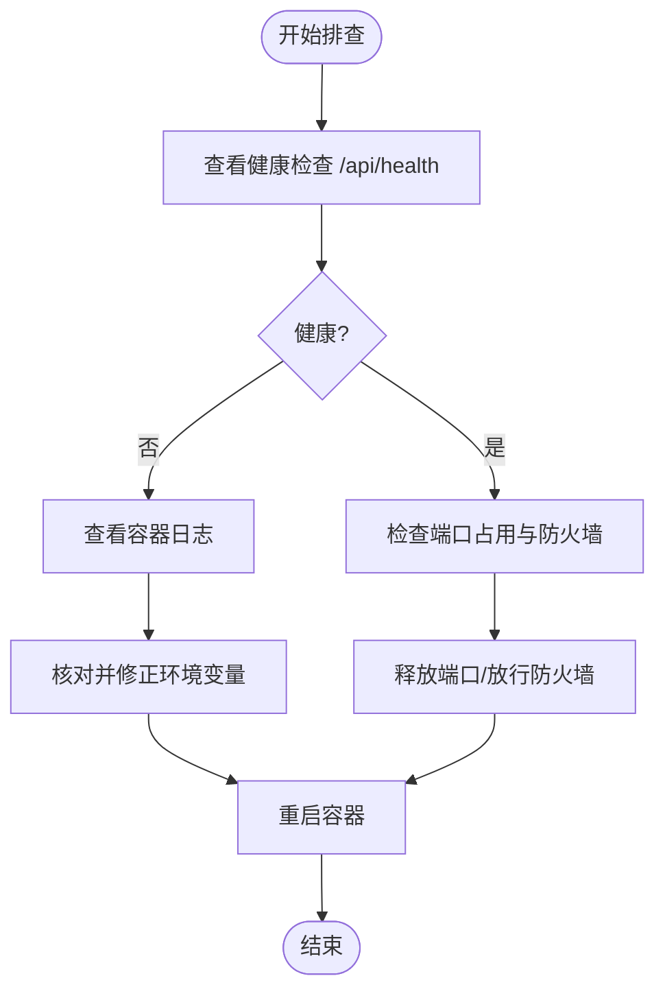

**章节来源**
- [docker-compose.yml:29-35](file://med_ai_assistant_1.0_bs_backend/docker-compose.yml#L29-L35)
- [docker-compose-main.yml:52-57](file://med_ai_assistant_1.0_bs_backend/deploy/main-linux-oracle/docker-compose-main.yml#L52-L57)
- [deploy-main-server.bat](file://med_ai_assistant_1.0_bs_backend/deploy/main-windows/deploy-main-server.bat)
- [deploy-execution-server.bat](file://med_ai_assistant_1.0_bs_backend/deploy/execution-windows/deploy-execution-server.bat)

### 二、数据库连接异常
- 排查步骤
  - 使用数据库初始化脚本中的视图与状态信息定位连接与查询问题。
  - 检查数据库健康检查命令与凭据。
  - 核对初始化脚本中的用户权限与连接参数。
- 常见原因
  - 用户权限不足或凭据错误。
  - 连接数超限或超时设置不当。
  - 数据库未初始化或版本不匹配。
- 解决方案
  - 重新执行初始化脚本，确保数据库与用户创建成功。
  - 调整连接数与超时参数。
  - 清理无效连接并重建会话。

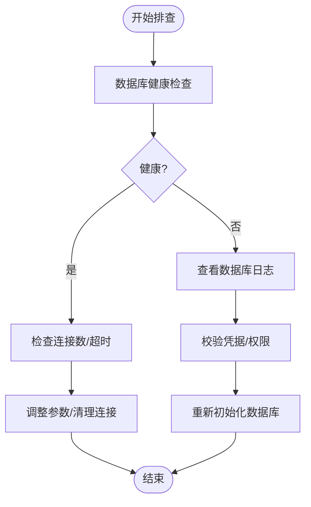

**图表来源**
- [init.sql:71-98](file://med_ai_assistant_1.0_bs_backend/init.sql#L71-L98)
- [docker-compose.yml:57-62](file://med_ai_assistant_1.0_bs_backend/docker-compose.yml#L57-L62)

**章节来源**
- [init.sql:1-119](file://med_ai_assistant_1.0_bs_backend/init.sql#L1-L119)
- [docker-compose.yml:36-62](file://med_ai_assistant_1.0_bs_backend/docker-compose.yml#L36-L62)

### 三、AI模型调用错误
- 排查步骤
  - 使用AI接口测试脚本验证模型可用性与超时设置。
  - 检查AI模型超时与API密钥配置。
  - 观察执行服务与主服务之间的通信链路。
- 常见原因
  - API密钥过期或错误。
  - 超时设置过短导致频繁失败。
  - 网络不稳定或外部服务限流。
- 解决方案
  - 更新API密钥并验证连通性。
  - 适当提高超时阈值。
  - 在执行服务侧增加重试与熔断策略。

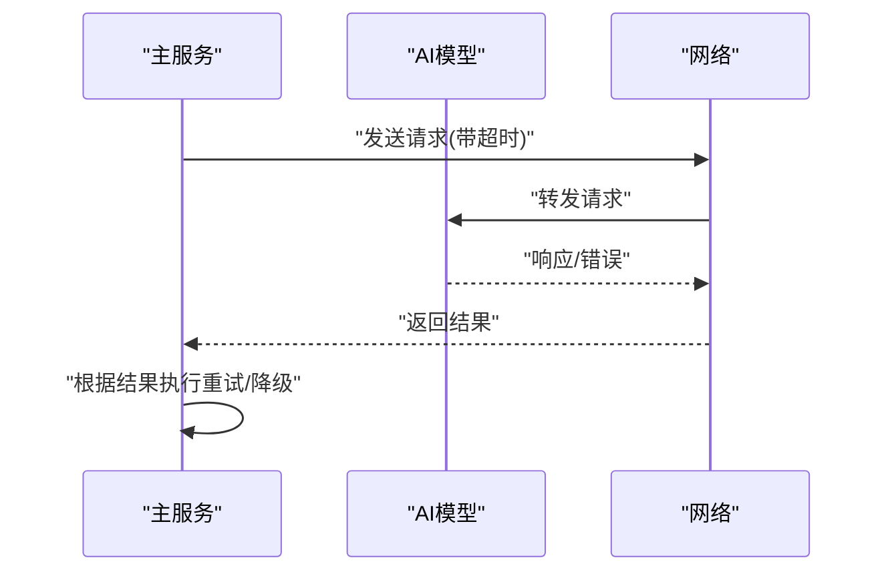

**图表来源**
- [docker-compose-main.yml:24-25](file://med_ai_assistant_1.0_bs_backend/deploy/main-linux-oracle/docker-compose-main.yml#L24-L25)
- [test-ai-api.bat](file://med_ai_assistant_1.0_bs_backend/test-scripts/test-ai-api.bat)

**章节来源**
- [docker-compose-main.yml:24-25](file://med_ai_assistant_1.0_bs_backend/deploy/main-linux-oracle/docker-compose-main.yml#L24-L25)
- [test-ai-api.bat](file://med_ai_assistant_1.0_bs_backend/test-scripts/test-ai-api.bat)

### 四、性能下降
- 排查步骤
  - 检查Redis内存使用与淘汰策略，确认热点数据命中率。
  - 分析数据库连接状态视图，识别慢查询与阻塞连接。
  - 评估线程池与JVM参数，观察GC停顿与内存占用。
- 常见原因
  - 缓存命中率低导致数据库压力增大。
  - 线程池配置不足或队列积压。
  - 数据库参数不合理导致连接争用。
- 解决方案
  - 调整Redis最大内存与淘汰策略。
  - 优化线程池大小与队列容量。
  - 调整数据库缓冲池与连接参数。

**章节来源**
- [docker-compose-main.yml:77-88](file://med_ai_assistant_1.0_bs_backend/deploy/main-linux-oracle/docker-compose-main.yml#L77-L88)
- [init.sql:27-33](file://med_ai_assistant_1.0_bs_backend/init.sql#L27-L33)

### 五、日志分析与监控
- 日志位置
  - 后端容器日志挂载至/logs目录，便于离线分析。
- 监控指标
  - 健康检查端点、数据库状态视图、连接状态视图。
- 分析技巧
  - 结合时间戳定位异常峰值。
  - 关注错误堆栈与超时信息。
  - 对比正常时段与异常时段的指标变化。

**章节来源**
- [docker-compose.yml:20-22](file://med_ai_assistant_1.0_bs_backend/docker-compose.yml#L20-L22)
- [init.sql:71-98](file://med_ai_assistant_1.0_bs_backend/init.sql#L71-L98)

### 六、网络连通性测试
- 工具与脚本
  - 使用网络连通性测试脚本验证主机间可达性。
  - 使用HTTP测试脚本验证API端点可用性。
- 流程
  - 先测试本地环回，再测试跨主机与跨网络。
  - 验证DNS解析与端口开放情况。
  - 记录往返时间与丢包率。

**章节来源**
- [check-network-connectivity.bat](file://med_ai_assistant_1.0_bs_backend/test-scripts/check-network-connectivity.bat)
- [run-http-tests.bat](file://med_ai_assistant_1.0_bs_backend/test-scripts/run-http-tests.bat)

### 七、紧急处理与恢复策略
- 数据回滚
  - 基于数据库版本管理表与备份策略进行回滚。
- 服务降级
  - 临时关闭非关键功能（如回调、部分AI能力），优先保障核心流程。
- 灾难恢复
  - 快速拉起备用实例，切换流量并验证数据一致性。
- 服务降级与熔断
  - 在执行服务侧增加重试与熔断策略，防止级联故障。

**章节来源**
- [init.sql:37-49](file://med_ai_assistant_1.0_bs_backend/init.sql#L37-L49)

### 八、故障预防与系统加固
- 预防措施
  - 定期执行集成测试与HTTP测试，确保端到端可用。
  - 强化环境变量校验与默认值保护。
  - 建立数据库初始化与升级的自动化流程。
- 系统加固
  - 限制容器资源配额，避免资源争用。
  - 启用健康检查与自动重启策略。
  - 加强日志采集与告警联动。

**章节来源**
- [run-integration-tests.bat](file://med_ai_assistant_1.0_bs_backend/test-scripts/run-integration-tests.bat)
- [常用.txt:66-78](file://项目相关/常用.txt#L66-L78)

## 数据库完整性修复

### DRG AI分析保存Prompt时ORA-01400错误

**问题描述**
在DRG AI分析保存Prompt时，由于userId和sortNumber字段为空，导致Oracle数据库抛出ORA-01400错误："cannot insert NULL into (USERID/SORTNUMBER)"。这是典型的数据库完整性约束违反问题。

**根本原因分析**
1. PROMPTS表的userId和sortNumber字段设置为NOT NULL约束
2. 保存Prompt时未正确设置这些必填字段的默认值
3. DrgAiAnalysisService在创建Prompt实体时遗漏了关键字段赋值

**修复方案**
通过修改DrgAiAnalysisService的savePrompt方法，确保所有PROMPTS表的NOT NULL字段都设置默认值：

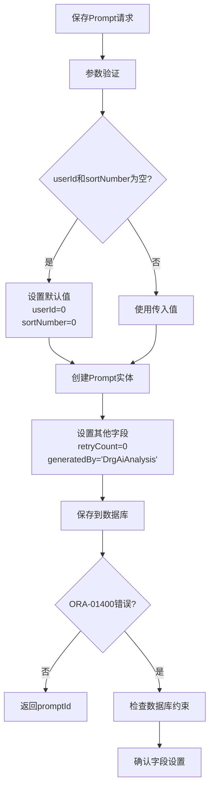

**修复实现细节**
- userId设置为0：表示系统自动生成的Prompt（非用户手动创建）
- sortNumber设置为0：默认排序号
- retryCount设置为0：初始重试次数
- generatedBy设置为"DrgAiAnalysis"：标识Prompt来源便于追踪

**预防措施**
1. 在服务层统一设置所有必填字段的默认值
2. 添加字段完整性检查
3. 实现幂等性检查避免重复创建

**章节来源**
- [DrgAiAnalysisService.java:179-191](file://med_ai_assistant_1.0_bs_backend/src/main/java/com/example/medaiassistant/service/DrgAiAnalysisService.java#L179-L191)
- [更新小结.md:1-6](file://更新小结.md#L1-L6)

### 数据库完整性约束最佳实践

**字段完整性检查**
- 在DAO层添加字段验证
- 使用@NotNull注解进行编译时检查
- 实现统一的实体验证器

**事务管理**
- 为关键操作添加@Transactional注解
- 实现适当的异常处理和回滚策略
- 确保数据库约束的一致性

**监控与告警**
- 监控数据库约束违反事件
- 记录详细的错误日志
- 设置相应的告警机制

**章节来源**
- [DrgAiAnalysisService.java:118-191](file://med_ai_assistant_1.0_bs_backend/src/main/java/com/example/medaiassistant/service/DrgAiAnalysisService.java#L118-L191)

## 编码问题修复

### 全局JSON响应中文编码问题

**问题描述**
系统出现全局JSON响应中文编码问题，响应中的中文字符显示为乱码（如"å† åŠ¨è„‰çƒå›Šæ‰©å¼ ç‰‡æ¤å…¥æœ¯"）。这是由于Spring Boot默认的Jackson转换器在某些情况下没有正确设置Content-Type头的charset参数。

**根本原因分析**
1. Spring Boot默认的MappingJackson2HttpMessageConverter可能不会正确设置charset参数
2. Content-Type头缺少charset=UTF-8声明
3. 客户端使用错误的编码解析响应体

**修复方案**
通过WebConfig配置类添加UTF-8 MessageConverter配置：

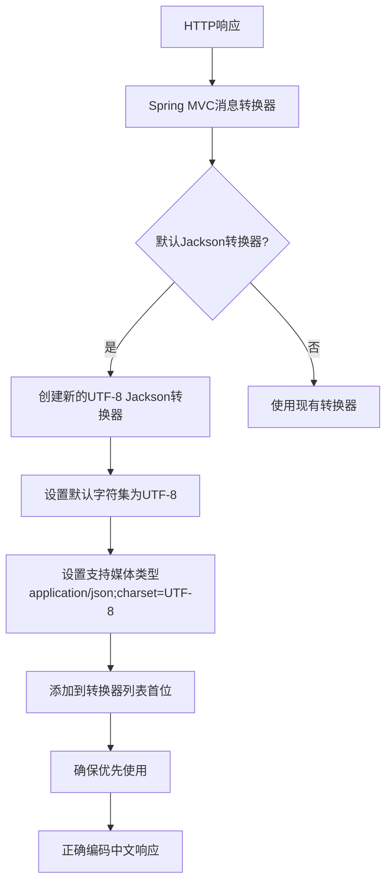

**修复实现细节**

**配置MessageConverters**
```java
@Override
public void configureMessageConverters(List<HttpMessageConverter<?>> converters) {
    // 创建Jackson JSON转换器，显式配置UTF-8编码
    MappingJackson2HttpMessageConverter jsonConverter = new MappingJackson2HttpMessageConverter();
    jsonConverter.setDefaultCharset(StandardCharsets.UTF_8);
    
    // 设置支持的媒体类型，明确指定charset=UTF-8
    jsonConverter.setSupportedMediaTypes(List.of(
        new MediaType(MediaType.APPLICATION_JSON, StandardCharsets.UTF_8),
        new MediaType("application", "*+json", StandardCharsets.UTF-8)
    ));
    
    // 添加到转换器列表的最前面（索引位置0）
    converters.add(0, jsonConverter);
}
```

**配置RestTemplate编码**
```java
@Bean
public RestTemplate restTemplate() {
    RestTemplate restTemplate = new RestTemplate();
    
    // 配置StringHttpMessageConverter使用UTF-8编码
    List<?> messageConverters = restTemplate.getMessageConverters();
    for (Object converter : messageConverters) {
        if (converter instanceof StringHttpMessageConverter) {
            ((StringHttpMessageConverter) converter).setDefaultCharset(StandardCharsets.UTF_8);
            break;
        }
    }
    
    return restTemplate;
}
```

**章节来源**
- [WebConfig.java:52-68](file://med_ai_assistant_1.0_bs_backend/src/main/java/com/example/medaiassistant/config/WebConfig.java#L52-L68)
- [RestTemplateConfig.java:70-84](file://med_ai_assistant_1.0_bs_backend/src/main/java/com/example/medaiassistant/config/RestTemplateConfig.java#L70-L84)
- [更新小结.md:1-6](file://更新小结.md#L1-L6)

### 编码问题预防措施

**JVM层面**
- 设置系统属性：-Dfile.encoding=UTF-8
- 在启动脚本中添加chcp 65001命令
- 确保IDE和终端使用UTF-8编码

**Spring Boot配置**
- 配置server.tomcat.uri-encoding=UTF-8
- 设置spring.http.encoding.charset=UTF-8
- 配置spring.http.converters.preferred-json-mapper=jackson

**数据库连接**
- 设置连接字符串参数characterEncoding=utf8
- 配置MySQL连接参数useUnicode=true&characterEncoding=utf8
- 确保数据库字符集为utf8mb4

**前端处理**
- 设置meta charset为UTF-8
- 配置Content-Type为text/html; charset=UTF-8
- 使用正确的字符编码处理API响应

**章节来源**
- [mvn.bat:1-4](file://mvn.bat#L1-L4)
- [WebConfig.java:19-68](file://med_ai_assistant_1.0_bs_backend/src/main/java/com/example/medaiassistant/config/WebConfig.java#L19-L68)

## 结论
通过容器化编排与完善的健康检查机制，MedAiAssistant 1.0 BS具备良好的可观测性与可恢复性。结合本文提供的诊断流程、工具使用方法与恢复策略，可快速定位并解决服务启动失败、数据库连接异常、AI模型调用错误与性能下降等常见问题。

**更新** 本次更新特别增加了数据库完整性修复和编码问题修复的专门章节，为开发团队提供了完整的故障排查参考。通过DRG AI分析保存Prompt时ORA-01400错误的修复方案和全局JSON响应中文编码问题的UTF-8 MessageConverter配置修复案例，进一步提升了系统的稳定性和可靠性。

同时，通过预防与加固措施提升系统稳定性与韧性，包括数据库完整性约束的最佳实践、编码问题的预防措施和系统加固建议。

## 附录
- 常用命令与脚本
  - 后端构建与运行：使用构建与导出脚本及Spring Boot运行命令。
  - 前端部署：使用压缩包复制与解压流程。
  - 实时日志：通过Docker Compose日志命令查看最新日志。
- 文档与提示
  - 接口文档与更新日志规范，确保变更可追溯。
  - Prompt模板与思维框架，辅助复杂问题的系统化分析。
- 故障排查工具
  - 数据库完整性检查工具
  - 编码问题诊断工具
  - 性能监控与分析工具

**章节来源**
- [常用.txt:66-92](file://项目相关/常用.txt#L66-L92)
- [Mermaid 代码修复 Prompt 模板.txt](file://项目相关/Mermaid 代码修复 Prompt 模板.txt)
- [神级Prompt.txt](file://项目相关/神级Prompt.txt)