# 日志管理

<cite>
**本文引用的文件**
- [application-monitoring.properties](file://med_ai_assistant_1.0_bs_backend/config/application-monitoring.properties)
- [application.properties（主服务器-Oracle）](file://med_ai_assistant_1.0_bs_backend/deploy/main-linux-oracle/config/application.properties)
- [application.properties（执行服务器）](file://med_ai_assistant_1.0_bs_backend/deploy/execution-linux/config/execution/application-execution.properties)
- [application-monitoring.properties（测试环境）](file://med_ai_assistant_1.0_bs_backend/deploy/main-linux-testServer/config/application-monitoring.properties)
- [application.properties（测试环境）](file://med_ai_assistant_1.0_bs_backend/deploy/main-linux-testServer/config/application.properties)
- [application.log](file://med_ai_assistant_1.0_bs_backend/logs/application.log)
- [application.2026-03-01.0.log](file://med_ai_assistant_1.0_bs_backend/logs/application.2026-03-01.0.log)
</cite>

## 目录
1. [简介](#简介)
2. [项目结构](#项目结构)
3. [核心组件](#核心组件)
4. [架构总览](#架构总览)
5. [详细组件分析](#详细组件分析)
6. [依赖关系分析](#依赖关系分析)
7. [性能考量](#性能考量)
8. [故障排查指南](#故障排查指南)
9. [结论](#结论)
10. [附录](#附录)

## 简介
本文件面向MedAiAssistant 1.0 BS项目的日志管理，围绕日志级别配置、输出格式与轮转策略展开；解释主服务器、执行服务器与数据库连接的日志分类与重要性排序；提供日志分析工具使用方法（ELK Stack集成、日志聚合与搜索技巧）；给出错误日志识别与处理流程，以及日志备份与归档策略。

## 项目结构
- 日志文件位于后端工程的logs目录，采用按日期命名的滚动文件形式，便于按天检索与归档。
- 日志配置分散在各环境的application.properties中，并通过application-monitoring.properties集中定义日志监控策略（级别、告警阈值等）。

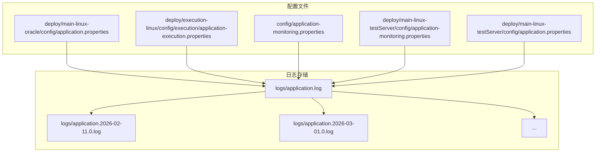

图表来源
- [application.log](file://med_ai_assistant_1.0_bs_backend/logs/application.log#L1-L200)
- [application.2026-03-01.0.log](file://med_ai_assistant_1.0_bs_backend/logs/application.2026-03-01.0.log#L1-L200)
- [application-monitoring.properties](file://med_ai_assistant_1.0_bs_backend/config/application-monitoring.properties#L76-L90)
- [application.properties（主服务器-Oracle）](file://med_ai_assistant_1.0_bs_backend/deploy/main-linux-oracle/config/application.properties#L150-L181)
- [application.properties（执行服务器）](file://med_ai_assistant_1.0_bs_backend/deploy/execution-linux/config/execution/application-execution.properties#L68-L81)

章节来源
- [application.log](file://med_ai_assistant_1.0_bs_backend/logs/application.log#L1-L200)
- [application.2026-03-01.0.log](file://med_ai_assistant_1.0_bs_backend/logs/application.2026-03-01.0.log#L1-L200)

## 核心组件
- 日志级别与阶段切换
  - 启动阶段：日志级别为INFO，便于诊断初始化过程。
  - 正常运行阶段：日志级别降为WARN，降低冗余，聚焦关键问题。
- 错误日志监控
  - 错误日志监控间隔为10秒，阈值为每分钟10条错误，超过阈值触发告警。
- 数据库诊断日志
  - HikariCP连接池、Oracle JDBC驱动、Spring JDBC/事务、数据库监控服务均开启DEBUG级别日志，便于定位连接泄漏、慢查询与事务问题。
- 输出格式
  - 时间戳、日志级别、线程名、Logger名称与消息正文，遵循标准日志格式，便于解析与检索。

章节来源
- [application-monitoring.properties](file://med_ai_assistant_1.0_bs_backend/config/application-monitoring.properties#L76-L90)
- [application.properties（主服务器-Oracle）](file://med_ai_assistant_1.0_bs_backend/deploy/main-linux-oracle/config/application.properties#L150-L181)
- [application.properties（执行服务器）](file://med_ai_assistant_1.0_bs_backend/deploy/execution-linux/config/execution/application-execution.properties#L68-L81)

## 架构总览
日志管理贯穿主服务器与执行服务器，主服务器负责业务调度、监控与告警，执行服务器负责具体推理任务与数据库交互。数据库连接池日志与诊断日志在两处均有配置，确保跨模块可观测性。

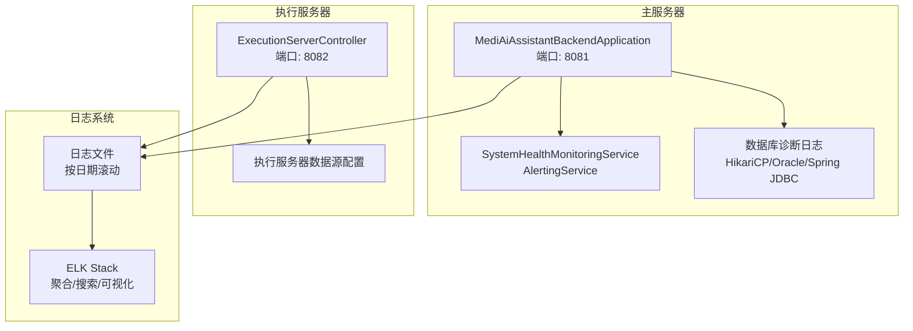

图表来源
- [application.properties（主服务器-Oracle）](file://med_ai_assistant_1.0_bs_backend/deploy/main-linux-oracle/config/application.properties#L75-L95)
- [application.properties（执行服务器）](file://med_ai_assistant_1.0_bs_backend/deploy/execution-linux/config/execution/application-execution.properties#L1-L18)
- [application-monitoring.properties](file://med_ai_assistant_1.0_bs_backend/config/application-monitoring.properties#L76-L90)

## 详细组件分析

### 日志级别与阶段切换
- 启动阶段：INFO级别，便于观察组件初始化顺序与依赖加载。
- 正常运行阶段：WARN级别，减少常规SQL与调试信息，突出异常与关键事件。
- 阶段切换条件：系统运行时间超过5分钟后，从启动阶段进入正常运行阶段。

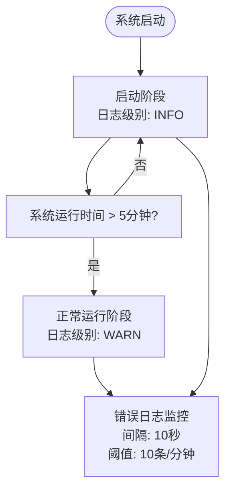

图表来源
- [application-monitoring.properties](file://med_ai_assistant_1.0_bs_backend/config/application-monitoring.properties#L76-L90)
- [application-monitoring.properties](file://med_ai_assistant_1.0_bs_backend/config/application-monitoring.properties#L40-L44)

章节来源
- [application-monitoring.properties](file://med_ai_assistant_1.0_bs_backend/config/application-monitoring.properties#L76-L90)
- [application-monitoring.properties](file://med_ai_assistant_1.0_bs_backend/config/application-monitoring.properties#L40-L44)

### 日志输出格式
- 格式要素：时间戳、日志级别、线程名、Logger名称、消息正文。
- 示例片段展示标准格式，便于日志采集器解析与字段提取。

图表来源
- [application.log](file://med_ai_assistant_1.0_bs_backend/logs/application.log#L1-L20)

章节来源
- [application.log](file://med_ai_assistant_1.0_bs_backend/logs/application.log#L1-L200)

### 日志轮转策略
- 按日期滚动：现有日志文件以“application.年-月-日.序号.log”命名，每日生成新文件。
- 建议补充：在应用或系统层面配置基于大小的滚动（如最大128MB），并设置保留天数（如30天），结合压缩与清理策略，避免磁盘占用增长。

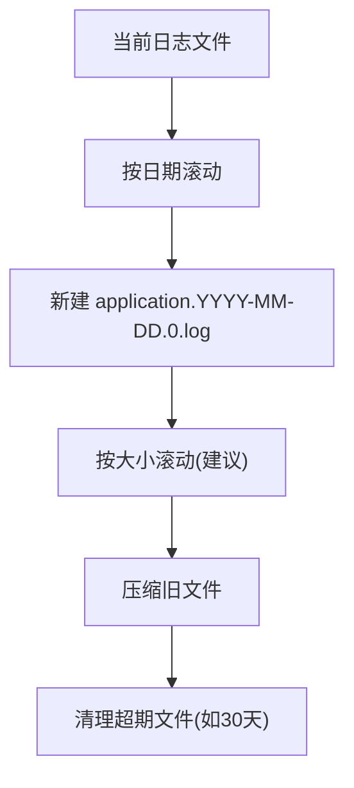

图表来源
- [application.2026-03-01.0.log](file://med_ai_assistant_1.0_bs_backend/logs/application.2026-03-01.0.log#L1-L200)

章节来源
- [application.2026-03-01.0.log](file://med_ai_assistant_1.0_bs_backend/logs/application.2026-03-01.0.log#L1-L200)

### 主服务器日志管理
- 关键模块日志
  - 系统健康监控与告警：SystemHealthMonitoringService、AlertingService，包含内存、磁盘、吞吐量、成功率、响应时间、数据库连接等告警规则。
  - 数据库连接池：HikariCP连接池、Oracle驱动、Spring JDBC/事务日志开启DEBUG，便于诊断连接泄漏与慢查询。
  - 定时任务与同步：提示定时器、夜间同步、一致性检查等关键流程。
- 重要性排序
  1) 健康监控与告警（Critical）
  2) 数据库诊断日志（High）
  3) 定时任务与同步（Medium）
  4) 业务接口访问（Low）

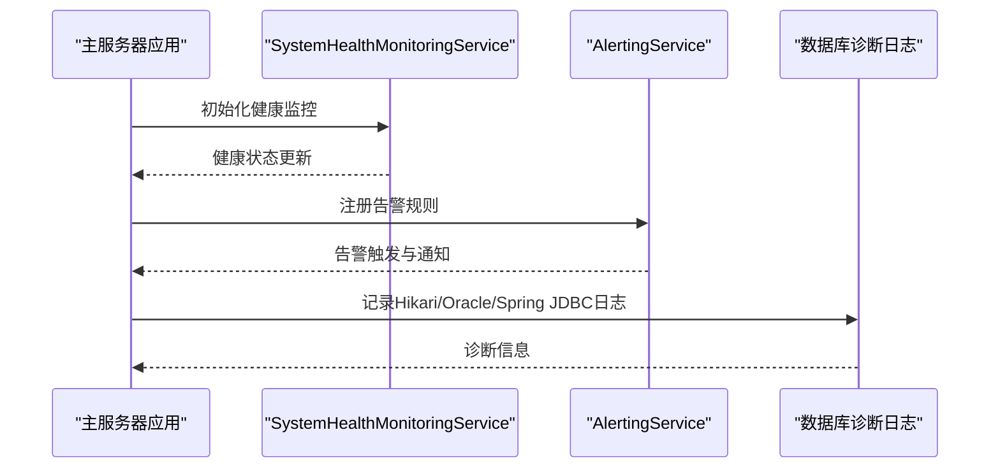

图表来源
- [application.properties（主服务器-Oracle）](file://med_ai_assistant_1.0_bs_backend/deploy/main-linux-oracle/config/application.properties#L150-L181)
- [application.log](file://med_ai_assistant_1.0_bs_backend/logs/application.log#L90-L140)

章节来源
- [application.properties（主服务器-Oracle）](file://med_ai_assistant_1.0_bs_backend/deploy/main-linux-oracle/config/application.properties#L150-L181)
- [application.log](file://med_ai_assistant_1.0_bs_backend/logs/application.log#L90-L140)

### 执行服务器日志管理
- 关键模块日志
  - 执行服务器数据源配置与连接池日志。
  - 推理任务与回调配置，便于追踪任务执行状态。
- 重要性排序
  1) 执行服务器数据源与连接池（High）
  2) 推理任务与回调（Medium）
  3) Web层访问日志（Low）

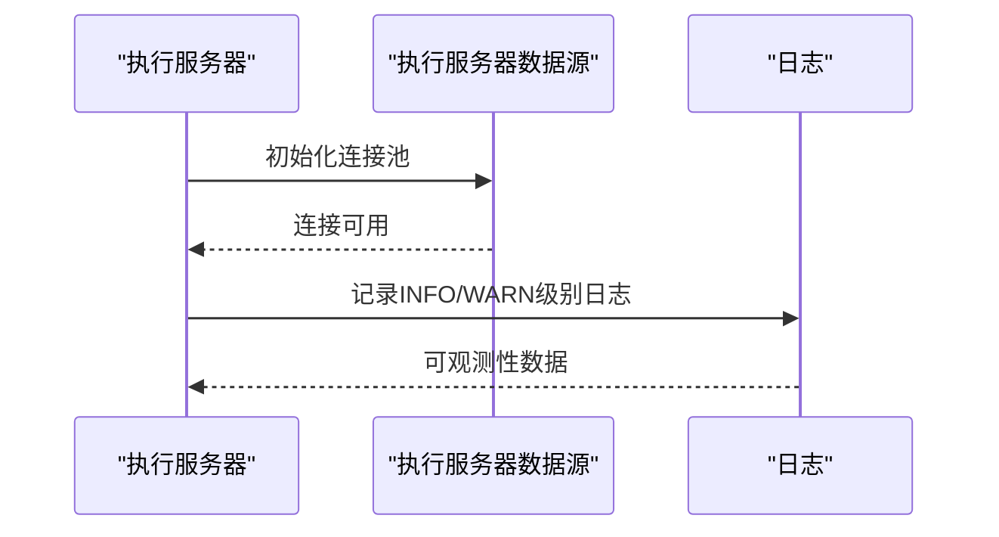

图表来源
- [application.properties（执行服务器）](file://med_ai_assistant_1.0_bs_backend/deploy/execution-linux/config/execution/application-execution.properties#L1-L18)
- [application.properties（执行服务器）](file://med_ai_assistant_1.0_bs_backend/deploy/execution-linux/config/execution/application-execution.properties#L68-L81)

章节来源
- [application.properties（执行服务器）](file://med_ai_assistant_1.0_bs_backend/deploy/execution-linux/config/execution/application-execution.properties#L68-L81)

### 数据库连接日志管理
- 主服务器与测试环境均开启HikariCP、Oracle JDBC、Spring JDBC/事务的DEBUG日志，便于诊断连接泄漏、慢查询与事务问题。
- 建议：在生产环境中，将这些日志级别调整为WARN/ERROR，并配合采样与限流，避免对性能造成影响。

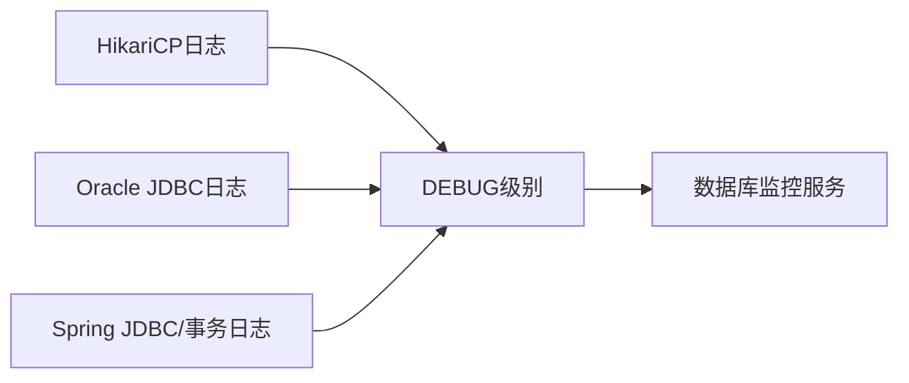

图表来源
- [application.properties（主服务器-Oracle）](file://med_ai_assistant_1.0_bs_backend/deploy/main-linux-oracle/config/application.properties#L162-L181)
- [application-monitoring.properties（测试环境）](file://med_ai_assistant_1.0_bs_backend/deploy/main-linux-testServer/config/application-monitoring.properties#L91-L102)

章节来源
- [application.properties（主服务器-Oracle）](file://med_ai_assistant_1.0_bs_backend/deploy/main-linux-oracle/config/application.properties#L162-L181)
- [application-monitoring.properties（测试环境）](file://med_ai_assistant_1.0_bs_backend/deploy/main-linux-testServer/config/application-monitoring.properties#L91-L102)

### 日志分析工具与ELK集成
- 结构化字段提取
  - 时间戳、日志级别、线程名、Logger名称、消息正文。
- ELK工作流
  - Logstash/Fluentd/Beats采集日志文件，解析字段，写入Elasticsearch。
  - Kibana构建仪表板，按日/小时/模块聚合，设置告警规则（错误率、响应时间、数据库慢查询）。
- 搜索技巧
  - 使用通配符匹配关键模块（如“SystemHealthMonitoringService”、“AlertingService”）。
  - 使用聚合查询统计错误日志趋势与来源模块分布。

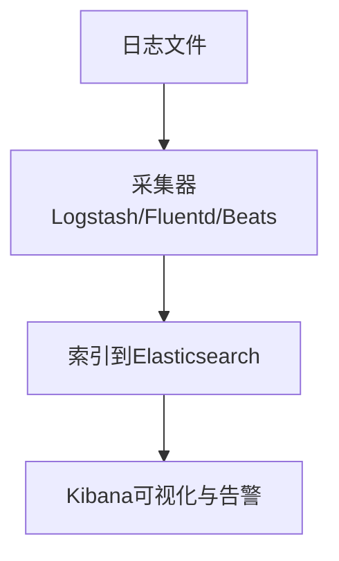

图表来源
- [application.log](file://med_ai_assistant_1.0_bs_backend/logs/application.log#L1-L200)

章节来源
- [application.log](file://med_ai_assistant_1.0_bs_backend/logs/application.log#L1-L200)

### 错误日志识别与处理流程
- 识别
  - 错误日志监控：每10秒扫描一次，阈值为每分钟10条错误。
  - 关键错误类别：数据库连接失败、响应时间过长、成功率过低、吞吐量过低、磁盘使用率过高、自动恢复异常（如空指针）。
- 处理
  - 即时：告警通知（邮件/Webhook），定位最近10分钟日志，确认错误堆栈与上下文。
  - 复盘：按模块聚合错误趋势，制定修复计划与回归测试。
  - 预防：优化连接池参数、增加重试与熔断、提升日志采样与告警阈值精度。

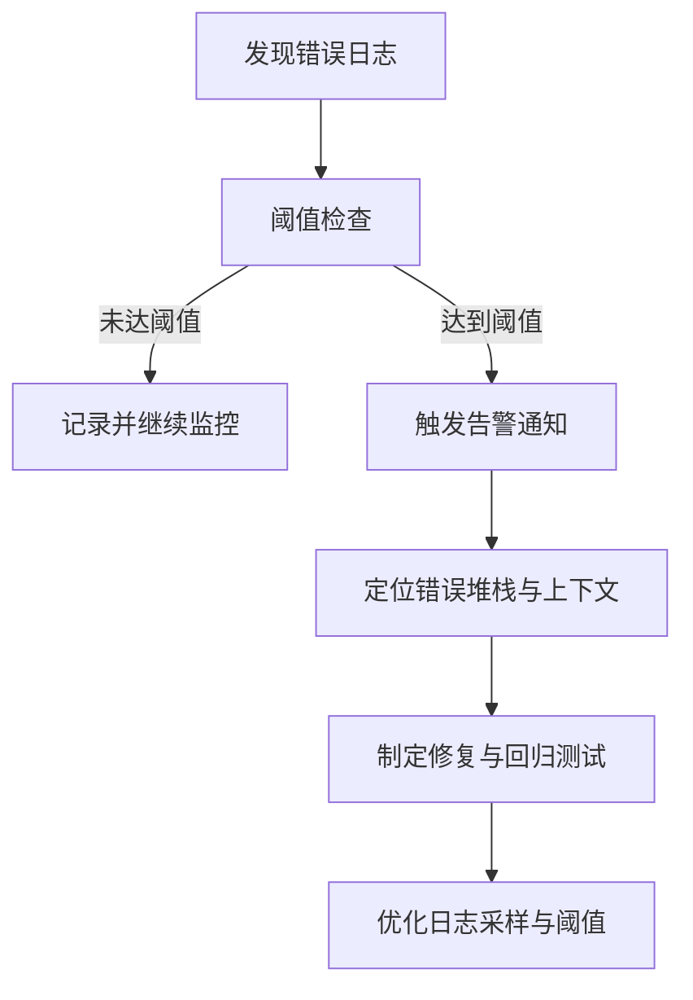

图表来源
- [application-monitoring.properties](file://med_ai_assistant_1.0_bs_backend/config/application-monitoring.properties#L85-L89)
- [application.2026-03-01.0.log](file://med_ai_assistant_1.0_bs_backend/logs/application.2026-03-01.0.log#L140-L171)

章节来源
- [application-monitoring.properties](file://med_ai_assistant_1.0_bs_backend/config/application-monitoring.properties#L85-L89)
- [application.2026-03-01.0.log](file://med_ai_assistant_1.0_bs_backend/logs/application.2026-03-01.0.log#L140-L171)

### 日志备份与归档策略
- 备份
  - 建议：每日备份application.log与application.年-月-日.0.log，保留30天。
  - 压缩：对历史日志进行gzip压缩，降低存储成本。
- 归档
  - 月度归档：将上月日志移至长期归档目录，保留索引元数据以便检索。
  - 清理：删除超过保留期的日志文件，释放磁盘空间。

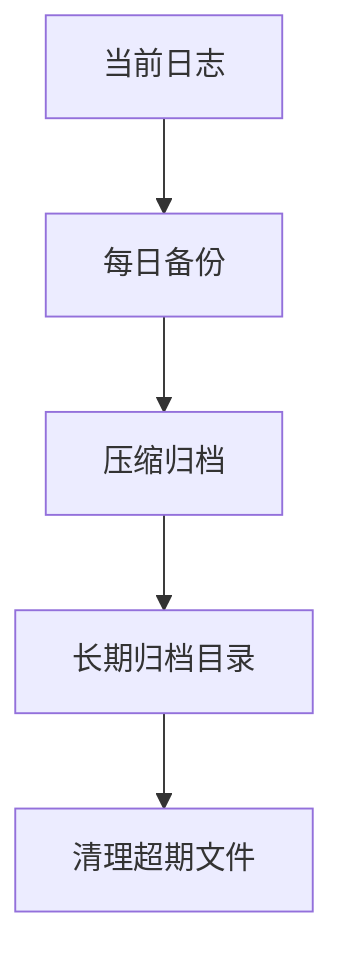

图表来源
- [application-monitoring.properties（测试环境）](file://med_ai_assistant_1.0_bs_backend/deploy/main-linux-testServer/config/application-monitoring.properties#L163-L176)

章节来源
- [application-monitoring.properties（测试环境）](file://med_ai_assistant_1.0_bs_backend/deploy/main-linux-testServer/config/application-monitoring.properties#L163-L176)

## 依赖关系分析
- 配置依赖
  - application-monitoring.properties集中定义日志监控策略，被主服务器与测试环境共享。
  - 各环境的application.properties分别控制日志级别与数据库诊断日志的开启。
- 模块依赖
  - 主服务器：SystemHealthMonitoringService、AlertingService依赖日志输出进行可观测性与告警。
  - 执行服务器：执行服务器数据源配置依赖application-execution.properties中的连接参数。

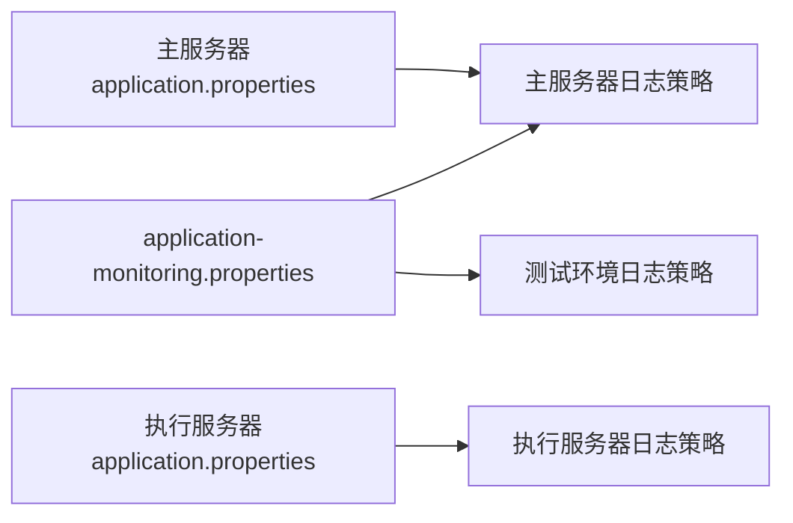

图表来源
- [application-monitoring.properties](file://med_ai_assistant_1.0_bs_backend/config/application-monitoring.properties#L76-L90)
- [application.properties（主服务器-Oracle）](file://med_ai_assistant_1.0_bs_backend/deploy/main-linux-oracle/config/application.properties#L150-L181)
- [application.properties（执行服务器）](file://med_ai_assistant_1.0_bs_backend/deploy/execution-linux/config/execution/application-execution.properties#L68-L81)

章节来源
- [application-monitoring.properties](file://med_ai_assistant_1.0_bs_backend/config/application-monitoring.properties#L76-L90)
- [application.properties（主服务器-Oracle）](file://med_ai_assistant_1.0_bs_backend/deploy/main-linux-oracle/config/application.properties#L150-L181)
- [application.properties（执行服务器）](file://med_ai_assistant_1.0_bs_backend/deploy/execution-linux/config/execution/application-execution.properties#L68-L81)

## 性能考量
- 日志级别
  - 启动阶段INFO便于诊断，正常运行阶段WARN降低I/O与CPU开销。
- 采样与限流
  - 对高频模块（如数据库诊断日志）进行采样与限流，避免在高负载下放大日志风暴。
- 存储与轮转
  - 建议引入基于大小的滚动与压缩，控制单文件大小与保留期，平衡检索效率与存储成本。

## 故障排查指南
- 快速定位
  - 使用时间范围与关键字（如“ERROR”、“CRITICAL”、“NullPointerException”）筛选日志。
  - 关注最近10分钟内的错误日志，结合错误日志监控阈值判断是否触发告警。
- 常见问题
  - 数据库连接失败：检查HikariCP连接池日志与Oracle驱动日志，核对连接参数与网络连通性。
  - 响应时间过长：结合API响应时间监控阈值，定位慢查询与线程池瓶颈。
  - 成功率过低：检查告警规则与自动恢复机制，确认是否存在空指针等异常。

章节来源
- [application.2026-03-01.0.log](file://med_ai_assistant_1.0_bs_backend/logs/application.2026-03-01.0.log#L140-L171)
- [application-monitoring.properties](file://med_ai_assistant_1.0_bs_backend/config/application-monitoring.properties#L137-L147)

## 结论
本项目通过分级日志策略、明确的错误日志监控与数据库诊断日志配置，实现了主服务器与执行服务器的可观测性。建议进一步完善日志轮转（大小滚动）、备份与归档策略，并在ELK中建立标准化的字段提取与告警规则，以提升日志分析效率与问题定位速度。

## 附录
- 关键配置要点
  - 日志级别：启动阶段INFO，正常运行阶段WARN。
  - 错误日志监控：间隔10秒，阈值每分钟10条。
  - 数据库诊断日志：HikariCP、Oracle JDBC、Spring JDBC/事务DEBUG级别。
- 建议的改进
  - 引入基于大小的滚动与压缩，设置合理的保留期。
  - 在生产环境对高频日志进行采样与限流。
  - 在ELK中建立模块化仪表板与告警规则，提升可运维性。