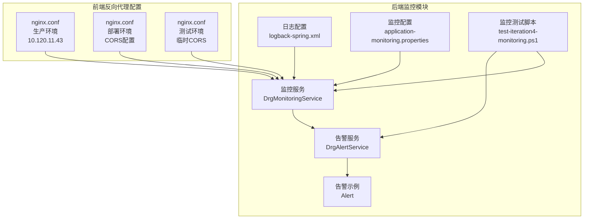
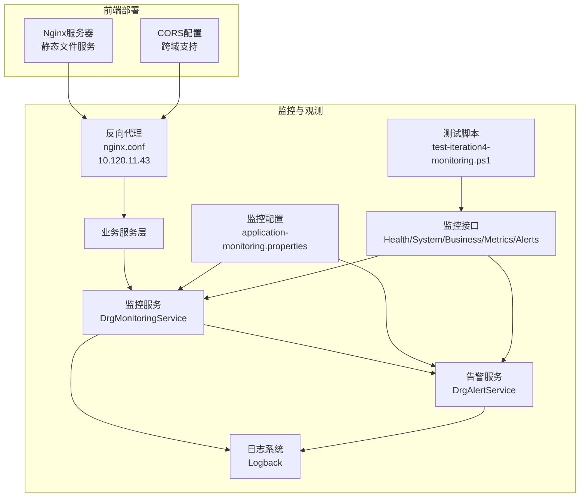
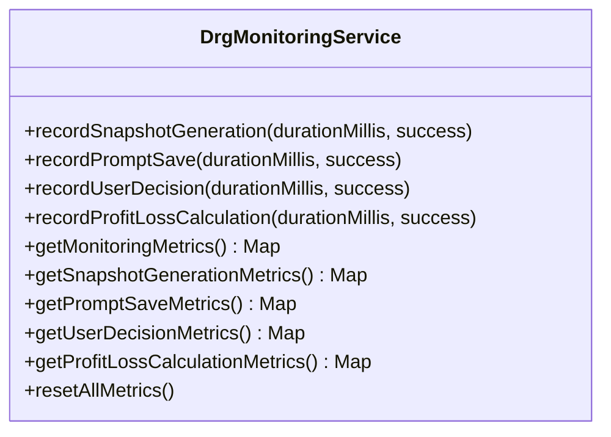
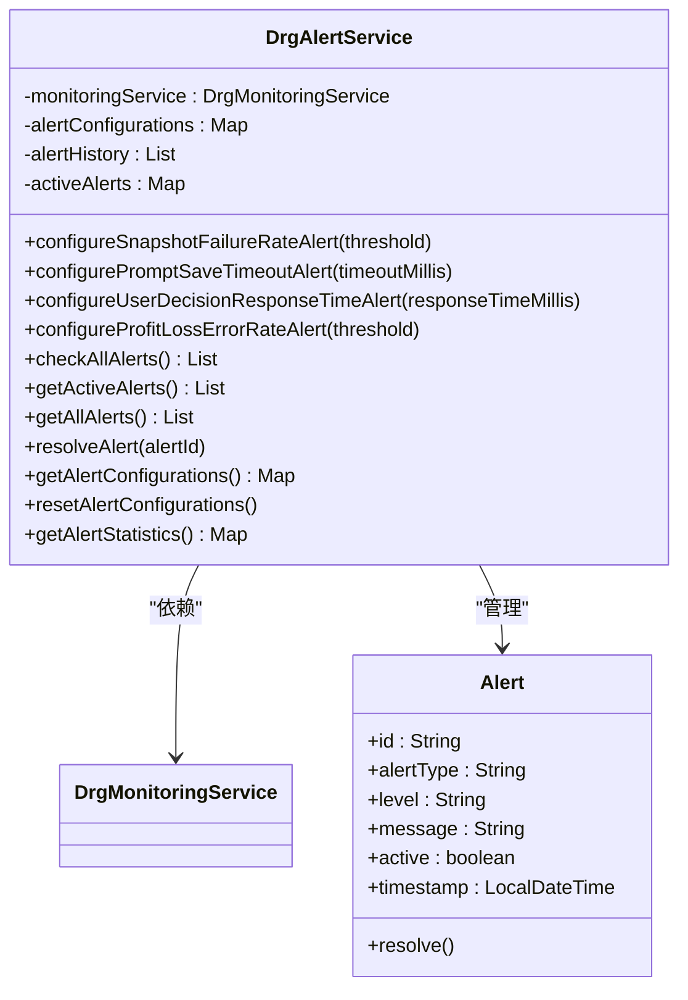
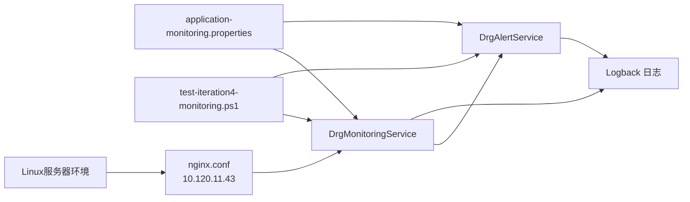

# 监控运维

<cite>
**本文引用的文件**
- [logback-spring.xml](file://med_ai_assistant_1.0_bs_backend/src/main/resources/logback-spring.xml)
- [application-monitoring.properties](file://med_ai_assistant_1.0_bs_backend/config/application-monitoring.properties)
- [DrgMonitoringService.java](file://med_ai_assistant_1.0_bs_backend/src/main/java/com/example/medaiassistant/service/monitoring/DrgMonitoringService.java)
- [DrgAlertService.java](file://med_ai_assistant_1.0_bs_backend/src/main/java/com/example/medaiassistant/service/monitoring/DrgAlertService.java)
- [Alert.java](file://med_ai_assistant_1.0_bs_backend/src/main/java/com/example/medaiassistant/service/monitoring/Alert.java)
- [test-iteration4-monitoring.ps1](file://med_ai_assistant_1.0_bs_backend/test-scripts/test-iteration4-monitoring.ps1)
- [nginx.conf](file://med_ai_assistant_1.0_bs_vue/nginx.conf)
- [nginx.conf](file://med_ai_assistant_1.0_bs_vue/deploy/med_ai_assistant_1.0_bs_vue/nginx.conf)
- [nginx.conf](file://med_ai_assistant_1.0_bs_vue/deploy/med_ai_assistant_1.0_bs_vue_test/nginx.conf)
- [更新小结.md](file://更新小结.md)
</cite>

## 更新摘要
**所做更改**
- 更新了构建系统监控部分，反映GitHub Actions构建修复中nginx.conf中host.docker.internal解析问题的解决方案
- 新增了Linux服务器部署相关的监控和故障排查指南
- 补充了反向代理配置变更对监控的影响分析
- 更新了监控仪表板使用说明，包含新的反向代理配置

## 目录
1. [简介](#简介)
2. [项目结构](#项目结构)
3. [核心组件](#核心组件)
4. [架构总览](#架构总览)
5. [详细组件分析](#详细组件分析)
6. [依赖关系分析](#依赖关系分析)
7. [性能考虑](#性能考虑)
8. [故障排查指南](#故障排查指南)
9. [结论](#结论)
10. [附录](#附录)

## 简介
本文件面向 MedAiAssistant 1.0 BS 的监控与运维场景，围绕系统监控指标采集与展示、日志管理策略、性能监控方法、告警机制配置与故障排查流程进行系统化说明。文档同时提供健康检查、性能调优、容量规划与灾难恢复的实践建议，并结合现有测试脚本给出运维自动化与监控仪表板使用要点。

**更新** 本次更新重点关注GitHub Actions构建修复中nginx.conf中host.docker.internal在Linux服务器无法解析的问题，以及由此带来的监控和故障排查指南的相应调整。

## 项目结构
- 后端监控相关的关键文件集中在后端模块中：
  - 日志配置：logback-spring.xml
  - 监控配置：application-monitoring.properties
  - 监控与告警业务实现：DrgMonitoringService、DrgAlertService、Alert
  - 监控可观测性测试脚本：test-iteration4-monitoring.ps1
- 前端反向代理配置：
  - nginx.conf（生产环境）- 已修复host.docker.internal问题
  - deploy/nginx.conf（部署环境）- 包含CORS配置
  - test/nginx.conf（测试环境）- 包含临时CORS解决方案

**图表来源**
- [logback-spring.xml:1-116](file://med_ai_assistant_1.0_bs_backend/src/main/resources/logback-spring.xml#L1-L116)
- [application-monitoring.properties:1-196](file://med_ai_assistant_1.0_bs_backend/config/application-monitoring.properties#L1-L196)
- [DrgMonitoringService.java:1-279](file://med_ai_assistant_1.0_bs_backend/src/main/java/com/example/medaiassistant/service/monitoring/DrgMonitoringService.java#L1-L279)
- [DrgAlertService.java:1-391](file://med_ai_assistant_1.0_bs_backend/src/main/java/com/example/medaiassistant/service/monitoring/DrgAlertService.java#L1-L391)
- [Alert.java:1-200](file://med_ai_assistant_1.0_bs_backend/src/main/java/com/example/medaiassistant/service/monitoring/Alert.java#L1-L200)
- [test-iteration4-monitoring.ps1:1-176](file://med_ai_assistant_1.0_bs_backend/test-scripts/test-iteration4-monitoring.ps1#L1-L176)
- [nginx.conf:40-49](file://med_ai_assistant_1.0_bs_vue/nginx.conf#L40-L49)
- [nginx.conf:46-69](file://med_ai_assistant_1.0_bs_vue/deploy/med_ai_assistant_1.0_bs_vue/nginx.conf#L46-L69)
- [nginx.conf:46-72](file://med_ai_assistant_1.0_bs_vue/deploy/med_ai_assistant_1.0_bs_vue_test/nginx.conf#L46-L72)

**章节来源**
- [logback-spring.xml:1-116](file://med_ai_assistant_1.0_bs_backend/src/main/resources/logback-spring.xml#L1-L116)
- [application-monitoring.properties:1-196](file://med_ai_assistant_1.0_bs_backend/config/application-monitoring.properties#L1-L196)
- [DrgMonitoringService.java:1-279](file://med_ai_assistant_1.0_bs_backend/src/main/java/com/example/medaiassistant/service/monitoring/DrgMonitoringService.java#L1-L279)
- [DrgAlertService.java:1-391](file://med_ai_assistant_1.0_bs_backend/src/main/java/com/example/medaiassistant/service/monitoring/DrgAlertService.java#L1-L391)
- [Alert.java:1-200](file://med_ai_assistant_1.0_bs_backend/src/main/java/com/example/medaiassistant/service/monitoring/Alert.java#L1-L200)
- [test-iteration4-monitoring.ps1:1-176](file://med_ai_assistant_1.0_bs_backend/test-scripts/test-iteration4-monitoring.ps1#L1-L176)

## 核心组件
- 日志管理：通过 Logback 配置实现多 appender 的滚动日志策略，区分应用日志、Prompt 生成日志、数据库诊断日志等，支持按大小与时间滚动、总量上限控制与清理策略。
- 监控指标：DrgMonitoringService 提供 DRG 分析关键环节的指标采集（快照生成、Prompt 保存、用户决策、盈亏计算）及统计查询接口。
- 告警机制：DrgAlertService 基于配置阈值对关键指标进行规则检查，支持活动告警管理、历史记录与统计查询，并具备自动恢复能力。
- 测试与验证：PowerShell 测试脚本覆盖健康检查、系统健康、业务指标、指标采集、告警管理、配置更新与告警级别过滤等端到端场景。
- **反向代理配置**：nginx.conf 已修复 host.docker.internal 在 Linux 服务器无法解析的问题，使用固定后端服务器地址 10.120.11.43，确保 GitHub Actions 构建稳定运行。

**更新** 核心组件现在包含了修复后的反向代理配置，这是本次构建修复的关键部分。

**章节来源**
- [logback-spring.xml:1-116](file://med_ai_assistant_1.0_bs_backend/src/main/resources/logback-spring.xml#L1-L116)
- [DrgMonitoringService.java:1-279](file://med_ai_assistant_1.0_bs_backend/src/main/java/com/example/medaiassistant/service/monitoring/DrgMonitoringService.java#L1-L279)
- [DrgAlertService.java:1-391](file://med_ai_assistant_1.0_bs_backend/src/main/java/com/example/medaiassistant/service/monitoring/DrgAlertService.java#L1-L391)
- [test-iteration4-monitoring.ps1:1-176](file://med_ai_assistant_1.0_bs_backend/test-scripts/test-iteration4-monitoring.ps1#L1-L176)
- [nginx.conf:40-49](file://med_ai_assistant_1.0_bs_vue/nginx.conf#L40-L49)

## 架构总览
下图展示了监控与告警在系统中的位置与交互关系，包括修复后的反向代理配置：

**图表来源**
- [DrgMonitoringService.java:1-279](file://med_ai_assistant_1.0_bs_backend/src/main/java/com/example/medaiassistant/service/monitoring/DrgMonitoringService.java#L1-L279)
- [DrgAlertService.java:1-391](file://med_ai_assistant_1.0_bs_backend/src/main/java/com/example/medaiassistant/service/monitoring/DrgAlertService.java#L1-L391)
- [logback-spring.xml:1-116](file://med_ai_assistant_1.0_bs_backend/src/main/resources/logback-spring.xml#L1-L116)
- [application-monitoring.properties:1-196](file://med_ai_assistant_1.0_bs_backend/config/application-monitoring.properties#L1-L196)
- [test-iteration4-monitoring.ps1:1-176](file://med_ai_assistant_1.0_bs_backend/test-scripts/test-iteration4-monitoring.ps1#L1-L176)
- [nginx.conf:40-49](file://med_ai_assistant_1.0_bs_vue/nginx.conf#L40-L49)

## 详细组件分析

### 日志管理策略
- 多通道日志：
  - 应用主日志：控制台与按日期/大小滚动的文件日志。
  - Prompt 生成日志：独立文件，按日期与大小滚动，保留周期较短以降低存储压力。
  - 数据库诊断日志：专门记录连接池、JDBC、事务等诊断信息，便于定位数据库问题。
- 日志级别与输出：
  - 关闭 Hibernate SQL 的冗余日志，仅保留错误级别，减少噪声。
  - 对 HikariCP、Oracle JDBC、Spring JDBC/事务等开启 DEBUG 级别输出至诊断日志。
- 滚动策略：
  - 文件大小上限、历史保留天数、总量上限与启动时清理策略，确保磁盘空间可控。

**章节来源**
- [logback-spring.xml:1-116](file://med_ai_assistant_1.0_bs_backend/src/main/resources/logback-spring.xml#L1-L116)

### 监控指标采集与展示
- 指标维度：
  - 快照生成：总次数、成功/失败次数、成功率、平均耗时。
  - Prompt 保存：总次数、成功/失败次数、成功率、平均耗时。
  - 用户决策：总次数、成功/失败次数、成功率、平均耗时。
  - 盈亏计算：总次数、成功/失败次数、成功率、平均耗时。
- 统计与查询：
  - 支持获取全部指标、按类别查询、重置指标等操作，便于运维侧进行趋势分析与异常定位。

**图表来源**
- [DrgMonitoringService.java:1-279](file://med_ai_assistant_1.0_bs_backend/src/main/java/com/example/medaiassistant/service/monitoring/DrgMonitoringService.java#L1-L279)

**章节来源**
- [DrgMonitoringService.java:1-279](file://med_ai_assistant_1.0_bs_backend/src/main/java/com/example/medaiassistant/service/monitoring/DrgMonitoringService.java#L1-L279)

### 告警机制与通知
- 阈值配置：
  - 快照生成失败率、Prompt 保存超时、用户决策响应时间、盈亏计算错误率等阈值可配置。
- 规则检查：
  - 周期性检查各指标是否越界；当条件改善时支持自动恢复。
- 告警状态：
  - 活动告警与历史记录分离管理；支持查询统计信息（总数、活动数、已解决数、按类型分布）。
- 通知策略：
  - 配置文件中定义通知方式、重试次数、重试间隔与静默周期，便于与外部告警平台集成。

**图表来源**
- [DrgAlertService.java:1-391](file://med_ai_assistant_1.0_bs_backend/src/main/java/com/example/medaiassistant/service/monitoring/DrgAlertService.java#L1-L391)
- [Alert.java:1-200](file://med_ai_assistant_1.0_bs_backend/src/main/java/com/example/medaiassistant/service/monitoring/Alert.java#L1-L200)

**章节来源**
- [DrgAlertService.java:1-391](file://med_ai_assistant_1.0_bs_backend/src/main/java/com/example/medaiassistant/service/monitoring/DrgAlertService.java#L1-L391)
- [Alert.java:1-200](file://med_ai_assistant_1.0_bs_backend/src/main/java/com/example/medaiassistant/service/monitoring/Alert.java#L1-L200)

### 性能监控与调优
- 指标采集周期与保留：
  - 性能指标采集间隔、保留时间、基线计算周期等参数集中配置，便于平衡数据粒度与存储成本。
- 关键阈值：
  - 数据库连接池使用率、查询耗时；线程池使用率与队列长度；内存使用率与 GC 时间；API 响应时间与错误率等。
- 调优建议：
  - 基于监控指标识别瓶颈（CPU/IO/网络/数据库），结合日志诊断定位根因；调整线程池大小、连接池参数、缓存策略与查询优化。

**章节来源**
- [application-monitoring.properties:66-147](file://med_ai_assistant_1.0_bs_backend/config/application-monitoring.properties#L66-L147)

### 健康检查与可用性
- 健康检查接口：
  - 测试脚本覆盖"监控服务健康""系统健康详情/汇总""业务KPI与趋势"等端点，确保健康检查链路可用。
- 阈值动态配置：
  - 支持通过接口动态更新系统健康与业务指标阈值，满足不同环境与业务阶段的需求。

**章节来源**
- [test-iteration4-monitoring.ps1:75-118](file://med_ai_assistant_1.0_bs_backend/test-scripts/test-iteration4-monitoring.ps1#L75-L118)

### 告警管理与通知
- 告警查询与统计：
  - 支持获取活动告警、历史记录、告警统计与按级别过滤，便于运维排障与报表。
- 告警抑制与静默：
  - 通过配置项设置通知静默周期，避免重复告警干扰。

**章节来源**
- [DrgAlertService.java:296-389](file://med_ai_assistant_1.0_bs_backend/src/main/java/com/example/medaiassistant/service/monitoring/DrgAlertService.java#L296-L389)
- [application-monitoring.properties:179-196](file://med_ai_assistant_1.0_bs_backend/config/application-monitoring.properties#L179-L196)

### 监控数据导出与保留
- 导出策略：
  - 定义导出间隔、保留天数、压缩与格式（JSON），便于归档与离线分析。
- 与外部系统对接：
  - 可将导出数据接入 Prometheus 或其他监控平台进行可视化与长期存储。

**章节来源**
- [application-monitoring.properties:163-176](file://med_ai_assistant_1.0_bs_backend/config/application-monitoring.properties#L163-L176)

### 反向代理配置与构建系统监控
- **修复内容**：GitHub Actions 构建修复中，将 nginx.conf 中的 `host.docker.internal` 替换为实际后端服务器地址 `10.120.11.43`，解决了 Linux 服务器无法解析该主机名的问题。
- **配置差异**：
  - 生产环境 nginx.conf：使用固定 IP 地址 10.120.11.43:8081
  - 部署环境 nginx.conf：同样使用固定地址 10.120.11.43:8081/api/
  - 测试环境 nginx.conf：使用 192.168.5.11:8081/api/（临时配置）
- **监控影响**：
  - 反向代理配置变更不影响后端监控指标采集
  - 但影响前端到后端的网络连通性监控
  - GitHub Actions 构建稳定性得到提升

**更新** 新增了反向代理配置变更对监控系统的影响分析。

**章节来源**
- [nginx.conf:40-49](file://med_ai_assistant_1.0_bs_vue/nginx.conf#L40-L49)
- [nginx.conf:46-69](file://med_ai_assistant_1.0_bs_vue/deploy/med_ai_assistant_1.0_bs_vue/nginx.conf#L46-L69)
- [nginx.conf:46-72](file://med_ai_assistant_1.0_bs_vue/deploy/med_ai_assistant_1.0_bs_vue_test/nginx.conf#L46-L72)
- [更新小结.md:6-9](file://更新小结.md#L6-L9)

## 依赖关系分析
- 组件耦合：
  - DrgAlertService 依赖 DrgMonitoringService 获取指标数据；两者通过配置文件共同驱动告警行为。
  - 日志系统为监控与告警提供可观测性基础，数据库诊断日志有助于快速定位连接池与 SQL 性能问题。
  - **反向代理配置**：nginx.conf 作为前端到后端的网络桥梁，其配置变更直接影响构建系统的稳定性。
- 外部依赖：
  - 测试脚本依赖后端提供的监控接口，形成闭环验证。
  - **Linux 服务器环境**：反向代理配置已针对 Linux 服务器环境进行了优化。

**图表来源**
- [DrgMonitoringService.java:1-279](file://med_ai_assistant_1.0_bs_backend/src/main/java/com/example/medaiassistant/service/monitoring/DrgMonitoringService.java#L1-L279)
- [DrgAlertService.java:1-391](file://med_ai_assistant_1.0_bs_backend/src/main/java/com/example/medaiassistant/service/monitoring/DrgAlertService.java#L1-L391)
- [logback-spring.xml:1-116](file://med_ai_assistant_1.0_bs_backend/src/main/resources/logback-spring.xml#L1-L116)
- [application-monitoring.properties:1-196](file://med_ai_assistant_1.0_bs_backend/config/application-monitoring.properties#L1-L196)
- [test-iteration4-monitoring.ps1:1-176](file://med_ai_assistant_1.0_bs_backend/test-scripts/test-iteration4-monitoring.ps1#L1-L176)
- [nginx.conf:40-49](file://med_ai_assistant_1.0_bs_vue/nginx.conf#L40-L49)

**章节来源**
- [DrgMonitoringService.java:1-279](file://med_ai_assistant_1.0_bs_backend/src/main/java/com/example/medaiassistant/service/monitoring/DrgMonitoringService.java#L1-L279)
- [DrgAlertService.java:1-391](file://med_ai_assistant_1.0_bs_backend/src/main/java/com/example/medaiassistant/service/monitoring/DrgAlertService.java#L1-L391)
- [logback-spring.xml:1-116](file://med_ai_assistant_1.0_bs_backend/src/main/resources/logback-spring.xml#L1-L116)
- [application-monitoring.properties:1-196](file://med_ai_assistant_1.0_bs_backend/config/application-monitoring.properties#L1-L196)
- [test-iteration4-monitoring.ps1:1-176](file://med_ai_assistant_1.0_bs_backend/test-scripts/test-iteration4-monitoring.ps1#L1-L176)

## 性能考虑
- 指标采集与存储：
  - 合理设置采集间隔与保留周期，避免高基数标签导致指标风暴；对热点指标进行采样或降维。
- 日志滚动与磁盘：
  - 严格控制单文件大小与总量上限，定期清理过期日志，防止磁盘打满影响业务。
- 数据库与线程池：
  - 结合数据库诊断日志与连接池监控阈值，动态调整连接池大小与查询超时；对慢查询进行索引优化与 SQL 重构。
- API 与 GC：
  - 监控 API 响应时间与错误率，结合 GC 时间阈值优化 JVM 参数与堆大小，减少 Full GC 频率。
- **反向代理性能**：
  - 固定 IP 地址替代 DNS 解析，减少网络延迟不确定性。
  - CORS 配置优化，避免跨域请求对性能的影响。

**更新** 新增了反向代理配置对性能的影响分析。

## 故障排查指南
- 快速定位步骤：
  - 查看系统健康接口与摘要，确认整体可用性与关键组件状态。
  - 检查数据库诊断日志，关注连接池状态、SQL 执行时间与事务异常。
  - 对照告警历史与活动告警，优先处理高优先级告警。
  - 使用监控指标趋势对比异常发生前后的时间窗口，缩小问题范围。
  - **网络连接排查**：检查反向代理配置，确认后端服务器地址可达性。
- 常见问题与处置：
  - 连接池使用率过高：扩容连接池或优化慢查询；检查连接泄漏（参考启动阶段连接泄漏检测阈值配置）。
  - 线程池队列积压：提升线程池并发或优化阻塞操作；检查任务执行耗时。
  - 内存占用飙升：检查 GC 时间与频率，优化对象生命周期与缓存策略。
  - API 响应时间增长：定位慢接口与下游依赖，必要时引入熔断与限流。
  - **反向代理问题**：确认 nginx.conf 中的后端服务器地址配置正确，检查网络连通性。
  - **Linux 服务器兼容性**：验证 host.docker.internal 替换为固定 IP 地址后的功能正常。

**更新** 新增了反向代理和Linux服务器兼容性的故障排查指导。

**章节来源**
- [logback-spring.xml:68-107](file://med_ai_assistant_1.0_bs_backend/src/main/resources/logback-spring.xml#L68-L107)
- [application-monitoring.properties:95-147](file://med_ai_assistant_1.0_bs_backend/config/application-monitoring.properties#L95-L147)
- [DrgAlertService.java:103-142](file://med_ai_assistant_1.0_bs_backend/src/main/java/com/example/medaiassistant/service/monitoring/DrgAlertService.java#L103-L142)

## 结论
本项目已建立完善的日志体系、监控指标与告警机制，并配套自动化测试脚本验证关键接口的可用性。通过合理配置监控参数、规范日志滚动策略与告警通知方式，可有效支撑系统的健康运行与快速排障。

**更新** 最近的 GitHub Actions 构建修复解决了 nginx.conf 中 host.docker.internal 在 Linux 服务器无法解析的问题，通过使用固定后端服务器地址 10.120.11.43，显著提升了构建系统的稳定性和可靠性。建议在生产环境中进一步完善与 Prometheus/Micrometer 的集成方案，以实现统一的指标导出与可视化展示。

## 附录

### Prometheus 指标导出与 Micrometer 集成建议
- 指标导出：
  - 在现有监控配置基础上，增加 Micrometer 与 Prometheus 导出器依赖，暴露标准指标端点，便于 Prometheus 抓取。
- 指标命名与标签：
  - 统一指标命名规范与标签结构，确保与现有 DrgMonitoringService 指标语义一致，便于关联分析。
- 监控面板：
  - 基于 Grafana 创建仪表板，展示关键指标（成功率、平均耗时、连接池使用率、线程池队列长度、内存与 GC、API 响应时间与错误率）的趋势与告警状态。

### 运维自动化脚本使用说明
- 脚本用途：
  - 全面验证监控与可观测性接口，包括健康检查、系统健康、业务指标、指标采集、告警管理与配置更新等。
- 使用方式：
  - 在本地或 CI 环境中执行 PowerShell 脚本，根据返回结果判断各项功能是否通过；支持详细输出与颜色提示，便于快速定位失败用例。

**章节来源**
- [test-iteration4-monitoring.ps1:1-176](file://med_ai_assistant_1.0_bs_backend/test-scripts/test-iteration4-monitoring.ps1#L1-L176)

### Linux 服务器部署监控指南
- **反向代理配置验证**：
  - 确认 nginx.conf 中的后端服务器地址为 10.120.11.43:8081
  - 验证 /api/ 路径的代理配置正确
  - 检查 CORS 配置在不同环境下的适用性
- **构建系统监控**：
  - 监控 GitHub Actions 构建成功率
  - 跟踪构建时间变化趋势
  - 验证构建产物与本地构建的一致性
- **网络连通性监控**：
  - 定期检查 10.120.11.43:8081 的可达性
  - 监控反向代理的健康检查端点 /health
  - 跟踪 API 请求的响应时间和错误率

**更新** 新增了Linux服务器部署监控的具体指导。

**章节来源**
- [nginx.conf:40-49](file://med_ai_assistant_1.0_bs_vue/nginx.conf#L40-L49)
- [nginx.conf:46-69](file://med_ai_assistant_1.0_bs_vue/deploy/med_ai_assistant_1.0_bs_vue/nginx.conf#L46-L69)
- [nginx.conf:46-72](file://med_ai_assistant_1.0_bs_vue/deploy/med_ai_assistant_1.0_bs_vue_test/nginx.conf#L46-L72)
- [更新小结.md:6-9](file://更新小结.md#L6-L9)