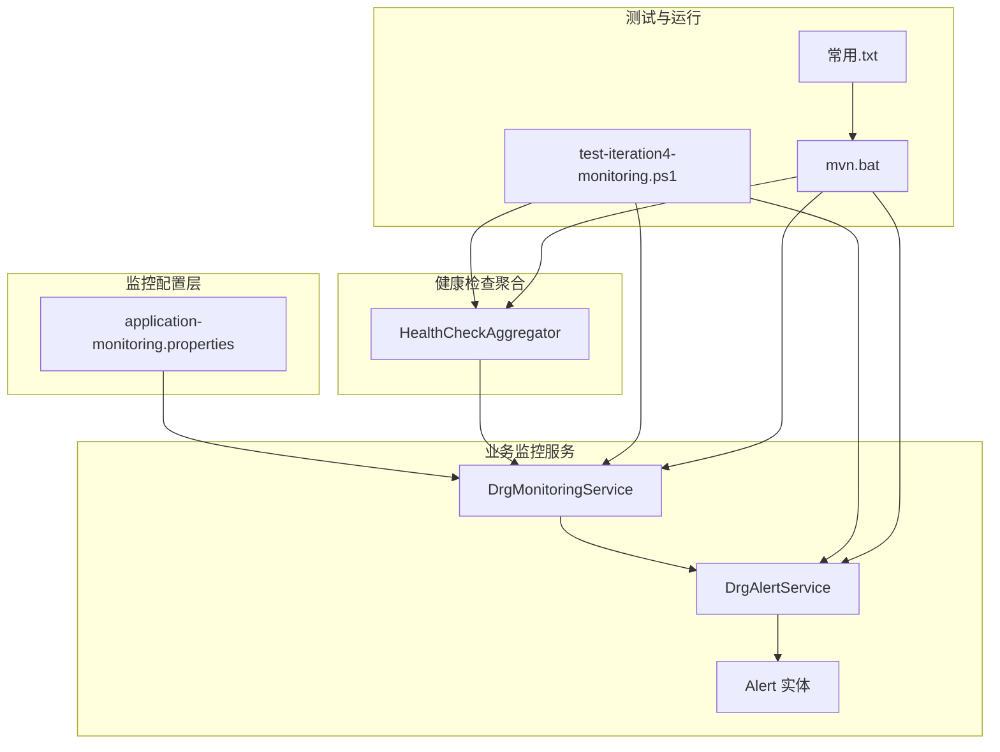
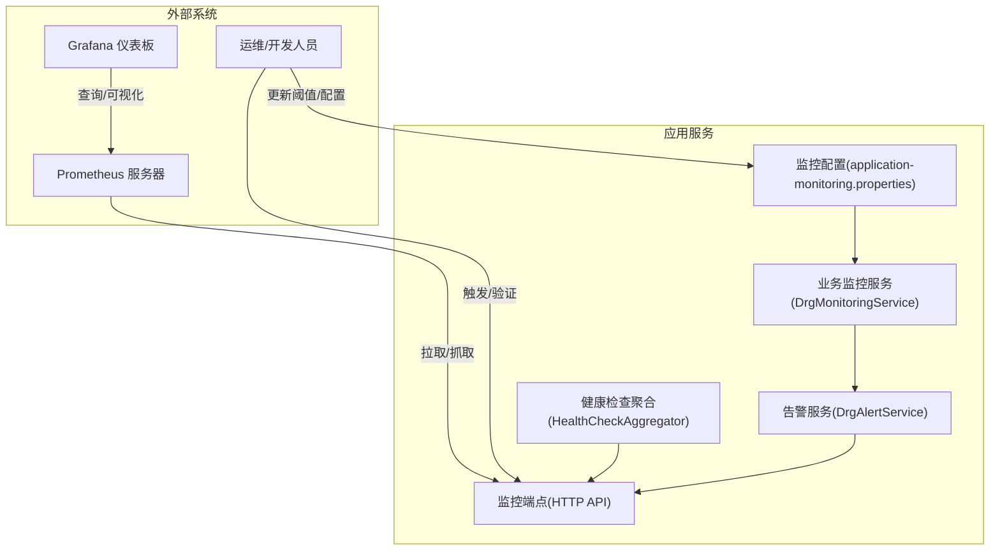
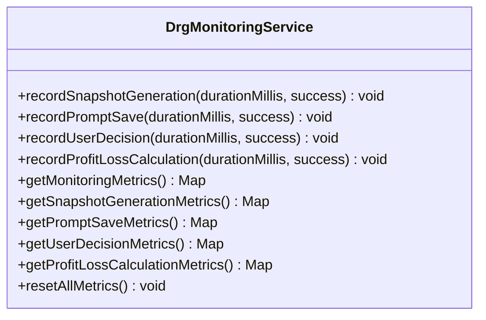
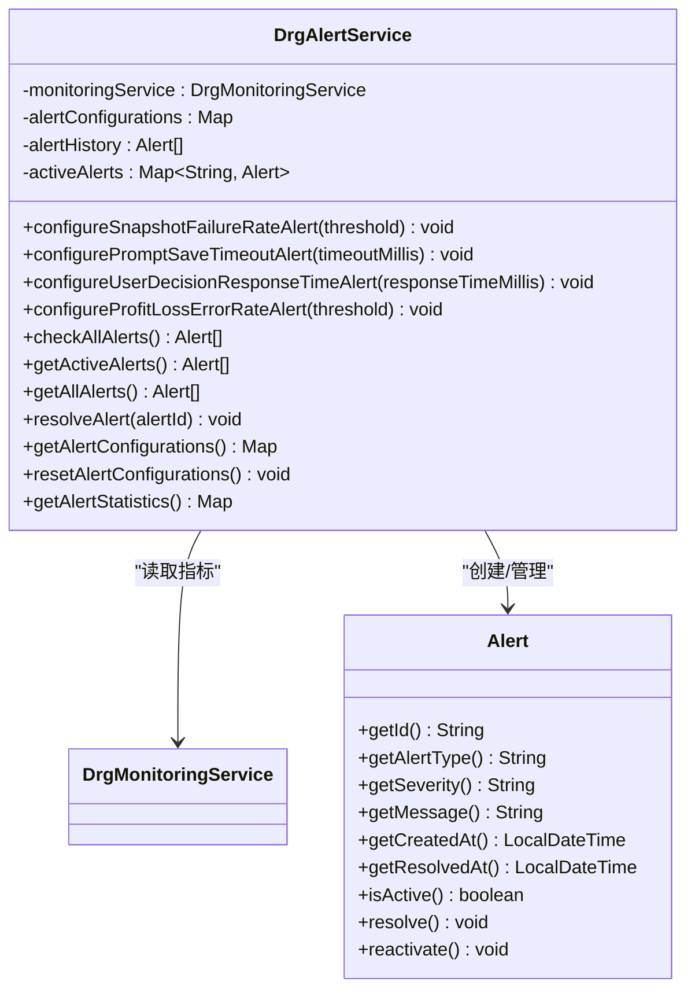
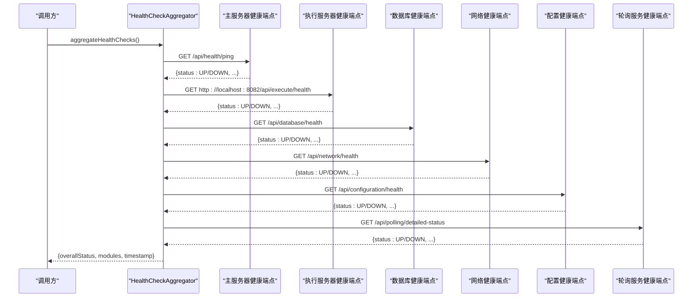
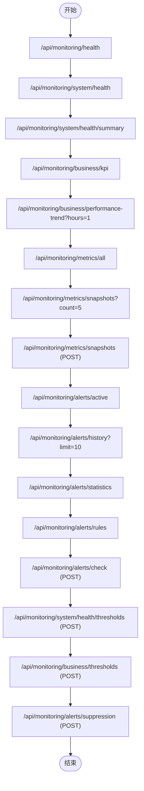
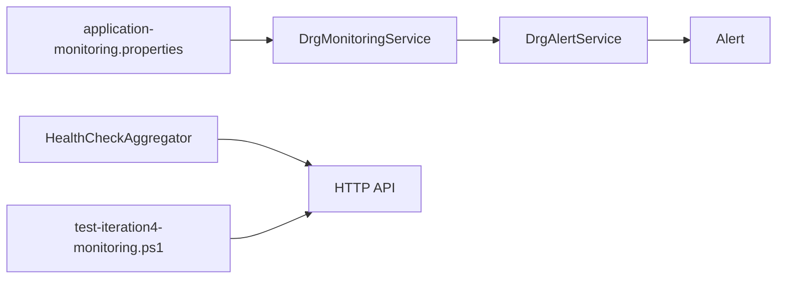

# 系统监控

<cite>
**本文引用的文件**
- [application-monitoring.properties](file://med_ai_assistant_1.0_bs_backend/config/application-monitoring.properties)
- [DrgAlertService.java](file://med_ai_assistant_1.0_bs_backend/src/main/java/com/example/medaiassistant/service/monitoring/DrgAlertService.java)
- [DrgMonitoringService.java](file://med_ai_assistant_1.0_bs_backend/src/main/java/com/example/medaiassistant/service/monitoring/DrgMonitoringService.java)
- [Alert.java](file://med_ai_assistant_1.0_bs_backend/src/main/java/com/example/medaiassistant/service/monitoring/Alert.java)
- [HealthCheckAggregator.java](file://med_ai_assistant_1.0_bs_backend/src/main/java/com/example/medaiassistant/healthcheck/aggregator/HealthCheckAggregator.java)
- [test-iteration4-monitoring.ps1](file://med_ai_assistant_1.0_bs_backend/test-scripts/test-iteration4-monitoring.ps1)
- [常用.txt](file://项目相关/常用.txt)
- [mvn.bat](file://mvn.bat)
</cite>

## 目录
1. [简介](#简介)
2. [项目结构](#项目结构)
3. [核心组件](#核心组件)
4. [架构总览](#架构总览)
5. [详细组件分析](#详细组件分析)
6. [依赖分析](#依赖分析)
7. [性能考虑](#性能考虑)
8. [故障排查指南](#故障排查指南)
9. [结论](#结论)
10. [附录](#附录)

## 简介
本文件面向 MedAiAssistant 1.0 BS 系统的监控与可观测性，围绕 Prometheus 指标导出、Micrometer 监控框架使用、自定义指标定义、监控端点配置、指标数据收集、健康检查端点（主服务器与执行服务器）以及告警与阈值策略展开。同时提供监控仪表板配置建议、实时监控、历史数据分析与趋势预测方法，帮助运维与开发团队建立完善的系统监控体系。

## 项目结构
本项目后端采用 Spring Boot 技术栈，监控相关能力主要由以下模块构成：
- 监控配置：集中于 application-monitoring.properties，定义启动阶段与正常运行阶段的监控策略、阈值与导出行为。
- 业务监控服务：DrgMonitoringService 提供 DRG 分析过程的关键指标采集与统计。
- 告警服务：DrgAlertService 基于监控指标与阈值配置触发告警，并维护活动告警与历史记录。
- 健康检查聚合器：HealthCheckAggregator 聚合主/执行/数据库/网络/配置/轮询服务等模块健康状态。
- 测试脚本：test-iteration4-monitoring.ps1 提供端到端监控与可观测性测试用例，覆盖健康检查、业务指标、告警管理、配置更新等场景。

**图示来源**
- [application-monitoring.properties](file://med_ai_assistant_1.0_bs_backend/config/application-monitoring.properties#L1-L196)
- [DrgMonitoringService.java](file://med_ai_assistant_1.0_bs_backend/src/main/java/com/example/medaiassistant/service/monitoring/DrgMonitoringService.java#L1-L279)
- [DrgAlertService.java](file://med_ai_assistant_1.0_bs_backend/src/main/java/com/example/medaiassistant/service/monitoring/DrgAlertService.java#L1-L391)
- [Alert.java](file://med_ai_assistant_1.0_bs_backend/src/main/java/com/example/medaiassistant/service/monitoring/Alert.java#L1-L139)
- [HealthCheckAggregator.java](file://med_ai_assistant_1.0_bs_backend/src/main/java/com/example/medaiassistant/healthcheck/aggregator/HealthCheckAggregator.java#L1-L108)
- [test-iteration4-monitoring.ps1](file://med_ai_assistant_1.0_bs_backend/test-scripts/test-iteration4-monitoring.ps1#L1-L176)
- [mvn.bat](file://mvn.bat#L1-L4)
- [常用.txt](file://项目相关/常用.txt#L1-L91)

**章节来源**
- [application-monitoring.properties](file://med_ai_assistant_1.0_bs_backend/config/application-monitoring.properties#L1-L196)
- [DrgMonitoringService.java](file://med_ai_assistant_1.0_bs_backend/src/main/java/com/example/medaiassistant/service/monitoring/DrgMonitoringService.java#L1-L279)
- [DrgAlertService.java](file://med_ai_assistant_1.0_bs_backend/src/main/java/com/example/medaiassistant/service/monitoring/DrgAlertService.java#L1-L391)
- [Alert.java](file://med_ai_assistant_1.0_bs_backend/src/main/java/com/example/medaiassistant/service/monitoring/Alert.java#L1-L139)
- [HealthCheckAggregator.java](file://med_ai_assistant_1.0_bs_backend/src/main/java/com/example/medaiassistant/healthcheck/aggregator/HealthCheckAggregator.java#L1-L108)
- [test-iteration4-monitoring.ps1](file://med_ai_assistant_1.0_bs_backend/test-scripts/test-iteration4-monitoring.ps1#L1-L176)
- [mvn.bat](file://mvn.bat#L1-L4)
- [常用.txt](file://项目相关/常用.txt#L1-L91)

## 核心组件
- 监控配置中心：集中定义启动阶段与正常运行阶段的阈值、间隔、超时、导出策略等，便于动态调整与灰度发布。
- 业务指标采集：基于原子计数器与并发容器，统计快照生成、Prompt 保存、用户决策、盈亏计算等关键路径的成功率与平均耗时。
- 告警引擎：按阈值规则检查指标，支持活动告警与历史记录管理，具备自动恢复与手动解决能力。
- 健康检查聚合：统一调用主/执行/数据库/网络/配置/轮询服务等模块健康端点，汇总整体状态。
- 测试与运行：提供 PowerShell 端到端测试脚本与 Maven 启动批处理，保障监控功能可用性与可验证性。

**章节来源**
- [application-monitoring.properties](file://med_ai_assistant_1.0_bs_backend/config/application-monitoring.properties#L1-L196)
- [DrgMonitoringService.java](file://med_ai_assistant_1.0_bs_backend/src/main/java/com/example/medaiassistant/service/monitoring/DrgMonitoringService.java#L1-L279)
- [DrgAlertService.java](file://med_ai_assistant_1.0_bs_backend/src/main/java/com/example/medaiassistant/service/monitoring/DrgAlertService.java#L1-L391)
- [Alert.java](file://med_ai_assistant_1.0_bs_backend/src/main/java/com/example/medaiassistant/service/monitoring/Alert.java#L1-L139)
- [HealthCheckAggregator.java](file://med_ai_assistant_1.0_bs_backend/src/main/java/com/example/medaiassistant/healthcheck/aggregator/HealthCheckAggregator.java#L1-L108)
- [test-iteration4-monitoring.ps1](file://med_ai_assistant_1.0_bs_backend/test-scripts/test-iteration4-monitoring.ps1#L1-L176)
- [mvn.bat](file://mvn.bat#L1-L4)

## 架构总览
下图展示监控子系统在系统中的位置与交互关系，包括配置、采集、告警、健康检查与测试验证。

**图示来源**
- [application-monitoring.properties](file://med_ai_assistant_1.0_bs_backend/config/application-monitoring.properties#L1-L196)
- [DrgMonitoringService.java](file://med_ai_assistant_1.0_bs_backend/src/main/java/com/example/medaiassistant/service/monitoring/DrgMonitoringService.java#L1-L279)
- [DrgAlertService.java](file://med_ai_assistant_1.0_bs_backend/src/main/java/com/example/medaiassistant/service/monitoring/DrgAlertService.java#L1-L391)
- [HealthCheckAggregator.java](file://med_ai_assistant_1.0_bs_backend/src/main/java/com/example/medaiassistant/healthcheck/aggregator/HealthCheckAggregator.java#L1-L108)
- [test-iteration4-monitoring.ps1](file://med_ai_assistant_1.0_bs_backend/test-scripts/test-iteration4-monitoring.ps1#L1-L176)

## 详细组件分析

### 监控配置中心（application-monitoring.properties）
- 阶段化配置：区分启动阶段与正常运行阶段，分别设定连接泄漏检测、健康检查超时、监控间隔、组件健康检查间隔等。
- 过渡条件：定义从启动阶段到正常运行阶段的切换条件与缓冲时间，避免频繁抖动。
- 告警阈值：连接泄漏、系统健康度、错误日志、数据库连接池、线程池、内存、GC、API 响应时间与错误率等阈值。
- 性能与日志：性能指标收集间隔、保留时间、基线周期；启动/正常阶段日志级别与错误日志监控策略。
- 自定义监控与导出：自定义监控开关、间隔与超时；监控数据导出间隔、保留天数、压缩与格式；告警通知方式、重试与静默周期。

建议：
- 将该配置文件纳入版本管理与灰度发布流程，配合环境变量覆盖关键阈值。
- 在生产环境启用压缩与合理的保留策略，平衡存储成本与可追溯性。

**章节来源**
- [application-monitoring.properties](file://med_ai_assistant_1.0_bs_backend/config/application-monitoring.properties#L1-L196)

### 业务监控服务（DrgMonitoringService）
职责：
- 统计四类关键路径的总量、成功/失败次数、成功率与平均耗时。
- 提供聚合与分项指标查询接口，支持重置指标。

关键点：
- 使用原子计数器与并发容器保证多线程安全。
- 指标计算采用无锁累加与平均值计算，复杂度 O(1)。

**图示来源**
- [DrgMonitoringService.java](file://med_ai_assistant_1.0_bs_backend/src/main/java/com/example/medaiassistant/service/monitoring/DrgMonitoringService.java#L1-L279)

**章节来源**
- [DrgMonitoringService.java](file://med_ai_assistant_1.0_bs_backend/src/main/java/com/example/medaiassistant/service/monitoring/DrgMonitoringService.java#L1-L279)

### 告警服务（DrgAlertService）
职责：
- 管理告警阈值配置（快照生成失败率、Prompt 保存超时、用户决策响应时间、盈亏计算错误率）。
- 检查所有规则并触发/解决告警，维护活动告警与历史记录。
- 提供告警统计与查询接口。

**图示来源**
- [DrgAlertService.java](file://med_ai_assistant_1.0_bs_backend/src/main/java/com/example/medaiassistant/service/monitoring/DrgAlertService.java#L1-L391)
- [Alert.java](file://med_ai_assistant_1.0_bs_backend/src/main/java/com/example/medaiassistant/service/monitoring/Alert.java#L1-L139)

**章节来源**
- [DrgAlertService.java](file://med_ai_assistant_1.0_bs_backend/src/main/java/com/example/medaiassistant/service/monitoring/DrgAlertService.java#L1-L391)
- [Alert.java](file://med_ai_assistant_1.0_bs_backend/src/main/java/com/example/medaiassistant/service/monitoring/Alert.java#L1-L139)

### 健康检查聚合器（HealthCheckAggregator）
职责：
- 聚合主服务器、执行服务器、数据库、网络、配置、轮询服务等模块健康状态。
- 返回整体状态、时间戳与模块详情，异常时返回 DOWN 并记录错误信息。

**图示来源**
- [HealthCheckAggregator.java](file://med_ai_assistant_1.0_bs_backend/src/main/java/com/example/medaiassistant/healthcheck/aggregator/HealthCheckAggregator.java#L1-L108)

**章节来源**
- [HealthCheckAggregator.java](file://med_ai_assistant_1.0_bs_backend/src/main/java/com/example/medaiassistant/healthcheck/aggregator/HealthCheckAggregator.java#L1-L108)

### 监控端点与测试脚本（test-iteration4-monitoring.ps1）
- 端点覆盖：监控服务健康、系统健康明细/摘要、业务 KPI 与趋势、指标采集与快照、告警管理（活动/历史/统计/规则/触发检查）、配置管理（阈值更新、告警抑制）。
- 验收标准：至少通过上述五项核心能力测试，确保性能指标监控、系统健康监控与告警、业务指标与 KPI、告警管理与通知、指标采集与分析均可用。

**图示来源**
- [test-iteration4-monitoring.ps1](file://med_ai_assistant_1.0_bs_backend/test-scripts/test-iteration4-monitoring.ps1#L1-L176)

**章节来源**
- [test-iteration4-monitoring.ps1](file://med_ai_assistant_1.0_bs_backend/test-scripts/test-iteration4-monitoring.ps1#L1-L176)

## 依赖分析
- 组件内聚：监控服务与告警服务紧密耦合，通过共享指标数据驱动告警判断。
- 外部依赖：健康检查聚合器依赖 HTTP 客户端访问各模块健康端点；测试脚本依赖本地端口与 API 路径。
- 配置依赖：业务阈值与导出策略由配置文件集中管理，影响采集频率与告警行为。

**图示来源**
- [application-monitoring.properties](file://med_ai_assistant_1.0_bs_backend/config/application-monitoring.properties#L1-L196)
- [DrgMonitoringService.java](file://med_ai_assistant_1.0_bs_backend/src/main/java/com/example/medaiassistant/service/monitoring/DrgMonitoringService.java#L1-L279)
- [DrgAlertService.java](file://med_ai_assistant_1.0_bs_backend/src/main/java/com/example/medaiassistant/service/monitoring/DrgAlertService.java#L1-L391)
- [Alert.java](file://med_ai_assistant_1.0_bs_backend/src/main/java/com/example/medaiassistant/service/monitoring/Alert.java#L1-L139)
- [HealthCheckAggregator.java](file://med_ai_assistant_1.0_bs_backend/src/main/java/com/example/medaiassistant/healthcheck/aggregator/HealthCheckAggregator.java#L1-L108)
- [test-iteration4-monitoring.ps1](file://med_ai_assistant_1.0_bs_backend/test-scripts/test-iteration4-monitoring.ps1#L1-L176)

**章节来源**
- [application-monitoring.properties](file://med_ai_assistant_1.0_bs_backend/config/application-monitoring.properties#L1-L196)
- [DrgMonitoringService.java](file://med_ai_assistant_1.0_bs_backend/src/main/java/com/example/medaiassistant/service/monitoring/DrgMonitoringService.java#L1-L279)
- [DrgAlertService.java](file://med_ai_assistant_1.0_bs_backend/src/main/java/com/example/medaiassistant/service/monitoring/DrgAlertService.java#L1-L391)
- [Alert.java](file://med_ai_assistant_1.0_bs_backend/src/main/java/com/example/medaiassistant/service/monitoring/Alert.java#L1-L139)
- [HealthCheckAggregator.java](file://med_ai_assistant_1.0_bs_backend/src/main/java/com/example/medaiassistant/healthcheck/aggregator/HealthCheckAggregator.java#L1-L108)
- [test-iteration4-monitoring.ps1](file://med_ai_assistant_1.0_bs_backend/test-scripts/test-iteration4-monitoring.ps1#L1-L176)

## 性能考虑
- 指标采集：使用原子计数器与并发容器，降低锁竞争；合理设置采集间隔与保留时间，避免内存膨胀。
- 告警频率：通过告警静默与重试机制减少噪声；阈值与间隔需结合业务峰值与SLA设定。
- 导出与存储：启用压缩与合理的保留策略，平衡查询性能与存储成本。
- 健康检查：统一超时与重试策略，避免健康检查本身成为瓶颈。

[本节为通用指导，无需特定文件来源]

## 故障排查指南
- 健康检查聚合失败：检查各模块健康端点可达性与返回格式，关注异常分支返回 DOWN 与错误信息。
- 告警未触发或误报：核对阈值配置与指标数据，确认采集间隔与统计口径一致。
- 指标缺失或异常：检查监控服务是否正常记录指标，必要时重置指标并观察恢复情况。
- 端到端验证：使用测试脚本逐项验证监控端点可用性，定位失败用例并复现问题。

**章节来源**
- [HealthCheckAggregator.java](file://med_ai_assistant_1.0_bs_backend/src/main/java/com/example/medaiassistant/healthcheck/aggregator/HealthCheckAggregator.java#L1-L108)
- [DrgAlertService.java](file://med_ai_assistant_1.0_bs_backend/src/main/java/com/example/medaiassistant/service/monitoring/DrgAlertService.java#L1-L391)
- [DrgMonitoringService.java](file://med_ai_assistant_1.0_bs_backend/src/main/java/com/example/medaiassistant/service/monitoring/DrgMonitoringService.java#L1-L279)
- [test-iteration4-monitoring.ps1](file://med_ai_assistant_1.0_bs_backend/test-scripts/test-iteration4-monitoring.ps1#L1-L176)

## 结论
通过集中式监控配置、细粒度业务指标采集、智能告警与健康检查聚合，以及完备的端到端测试脚本，MedAiAssistant 1.0 BS 已具备完善的监控与可观测性能力。建议在生产环境中结合 Prometheus/Grafana 实现指标导出与可视化，并持续优化阈值与采集策略以匹配业务增长与负载变化。

[本节为总结性内容，无需特定文件来源]

## 附录

### Prometheus 指标导出与 Micrometer 使用建议
- 指标导出：在应用中暴露 /actuator/prometheus 或 /metrics 端点，由 Prometheus 抓取。
- Micrometer 集成：使用 MeterRegistry 注册自定义计数器/定时器/分布直方图，命名规范与标签设计遵循统一约定。
- 自定义指标：基于 DrgMonitoringService 的指标口径，补充业务维度（如模块、操作类型），便于多维分析。
- 监控端点：结合测试脚本中的端点清单，确保关键监控 API 可用且返回稳定格式。

[本节为通用实践建议，无需特定文件来源]

### 监控仪表板配置与使用指南
- 数据源：配置 Prometheus 为 Grafana 数据源，设置合适的查询窗口与刷新频率。
- 关键面板：系统健康概览、CPU/内存/磁盘/线程池使用率、数据库连接池与查询延迟、API 响应时间与错误率、告警统计与趋势、业务 KPI 与趋势。
- 仪表板模板：以测试脚本中的端点为依据，建立固定视图与告警联动，支持实时告警弹窗与静默。

[本节为通用实践建议，无需特定文件来源]

### 实时监控、历史数据分析与趋势预测
- 实时监控：通过健康检查聚合与告警服务实时掌握系统状态，结合业务指标面板快速定位异常。
- 历史分析：利用指标保留策略与导出配置，定期归档历史数据，支持同比/环比分析与容量规划。
- 趋势预测：基于历史指标与基线周期，采用移动平均、指数平滑等方法进行短期预测，提前预警潜在风险。

[本节为通用实践建议，无需特定文件来源]