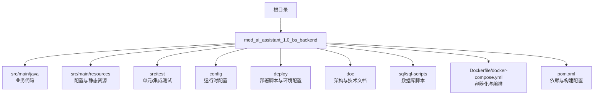
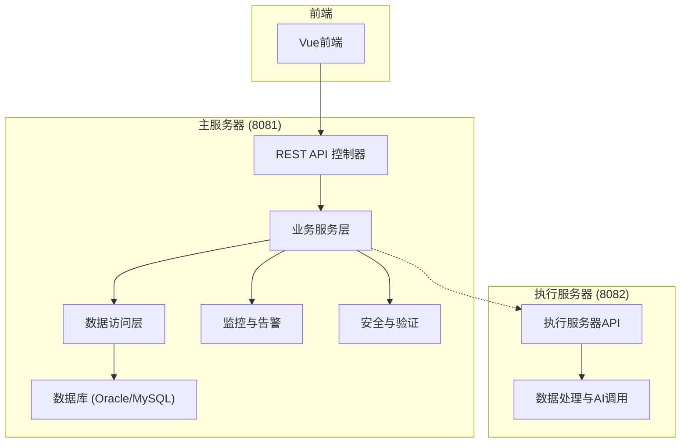
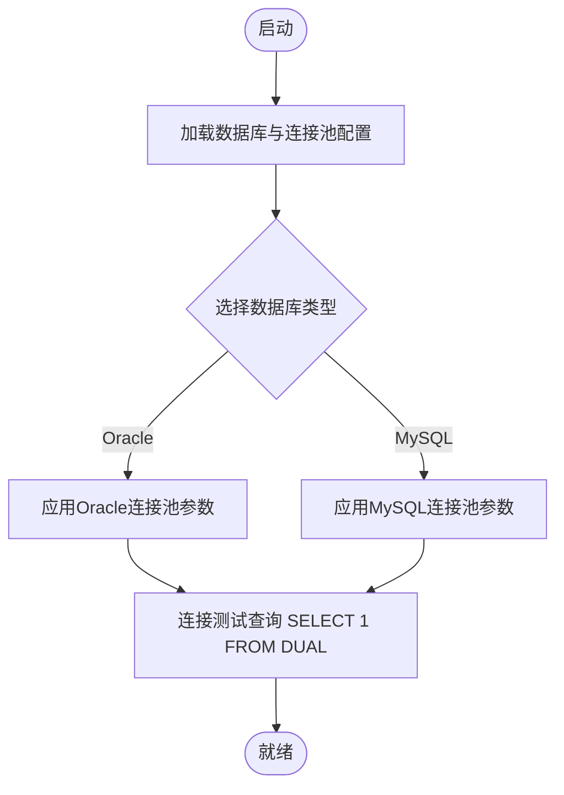
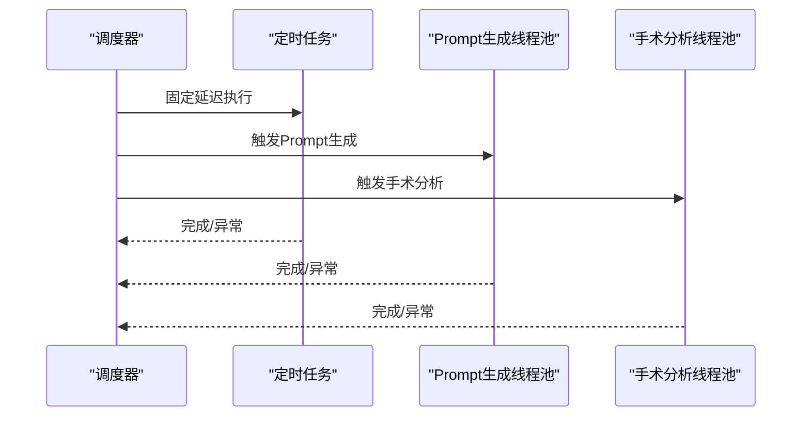
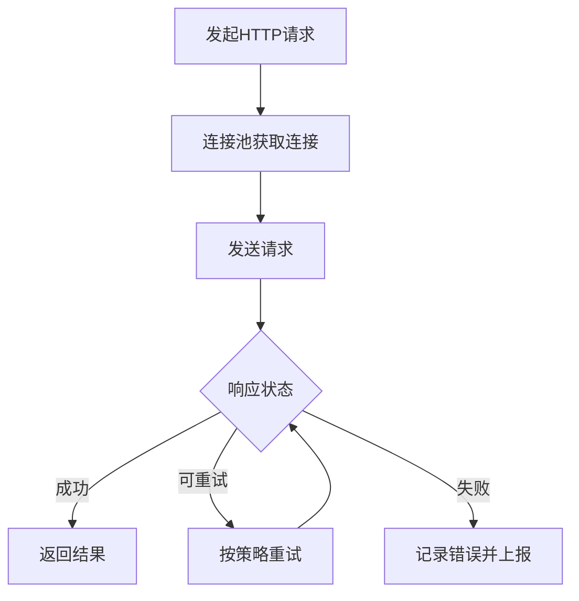
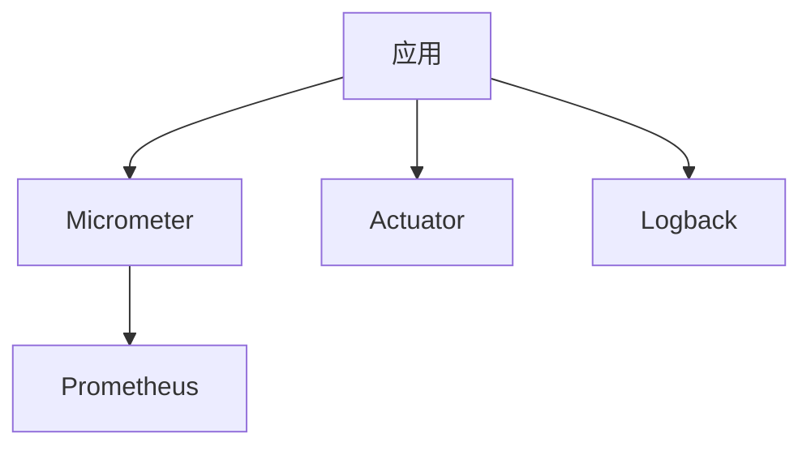
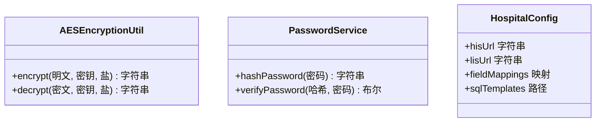
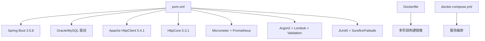

# 后端架构更新

<cite>
**本文引用的文件**
- [pom.xml](file://med_ai_assistant_1.0_bs_backend/pom.xml)
- [application.properties](file://med_ai_assistant_1.0_bs_backend/src/main/resources/application.properties)
- [Dockerfile](file://med_ai_assistant_1.0_bs_backend/Dockerfile)
- [docker-compose.yml](file://med_ai_assistant_1.0_bs_backend/docker-compose.yml)
- [主服务器架构总览.md](file://med_ai_assistant_1.0_bs_backend/doc/其他/主服务器架构总览.md)
- [主服务器技术栈与配置规范.md](file://med_ai_assistant_1.0_bs_backend/doc/其他/主服务器技术栈与配置规范.md)
- [主服务器深度分析报告.md](file://med_ai_assistant_1.0_bs_backend/doc/其他/主服务器深度分析报告.md)
- [主服务器业务功能模块分析.md](file://med_ai_assistant_1.0_bs_backend/doc/其他/主服务器业务功能模块分析.md)
- [hospital-Local.yaml](file://med_ai_assistant_1.0_bs_backend/config/hospitals/hospital-Local.yaml)
- [ai-models.properties](file://med_ai_assistant_1.0_bs_backend/src/main/resources/ai-models.properties)
- [application-execution.properties](file://med_ai_assistant_1.0_bs_backend/src/main/resources/application-execution.properties)
</cite>

## 更新摘要
**所做更改**
- 更新了Spring Boot版本至3.5.8，JDK升级至21
- 新增了Apache HttpClient 5.4.1和HttpCore 5.3.1依赖
- 增强了DevTools热重载功能配置
- 优化了连接池参数和超时设置
- 更新了监控和可观测性配置
- 完善了执行服务器配置和回调机制
- 增强了测试配置和并行执行能力

## 目录
1. [简介](#简介)
2. [项目结构](#项目结构)
3. [核心组件](#核心组件)
4. [架构总览](#架构总览)
5. [详细组件分析](#详细组件分析)
6. [依赖关系分析](#依赖关系分析)
7. [性能考量](#性能考量)
8. [故障排查指南](#故障排查指南)
9. [结论](#结论)
10. [附录](#附录)

## 简介
本文件系统性梳理并更新了医疗AI助手后端架构，围绕Spring Boot 3.5.8 + JDK 21的现代化技术栈，结合Oracle/MySQL双数据库支持、HikariCP连接池、Apache HttpClient 5.x、Micrometer + Prometheus + Actuator监控体系，以及主-执行服务器协作模式，形成高并发、高可用、高安全性的企业级后端架构。本文档既面向技术读者，也兼顾非技术读者的理解需求。

**更新** 本次更新反映了从提交8e3cabf1619d39155e931b8f1d326ffb39d190ab到f0e09947cf5e548242f13a48468595ea28d74ec6的变更，包括依赖更新、维护性改进和配置优化。

## 项目结构
后端项目采用标准Maven多模块布局，核心目录与职责如下：
- 配置与部署：config、deploy、doc、memory-bank、sql、sql-scripts
- 源码：src/main/java、src/main/resources
- 测试：src/test
- 构建与打包：pom.xml、Dockerfile、docker-compose.yml、run-backend.bat、build-and-export.bat

**章节来源**
- [pom.xml:1-309](file://med_ai_assistant_1.0_bs_backend/pom.xml#L1-L309)
- [application.properties:1-312](file://med_ai_assistant_1.0_bs_backend/src/main/resources/application.properties#L1-L312)

## 核心组件
- 应用框架与运行时
  - Spring Boot 3.5.8 + JDK 21，内嵌Tomcat，端口8081
  - 多环境Profile：main（主服务器）、execution（执行服务器）
- 数据库与连接池
  - Oracle/MySQL双支持，HikariCP连接池优化，禁用DDL自动管理
  - Oracle连接池关键参数：最大池大小、空闲超时、最大生命周期、泄漏检测阈值等
- 网络与HTTP
  - Apache HttpClient 5.4.1 + HttpCore 5.3.1 + 连接池，支持Keep-Alive与重试拦截器
  - Jackson时区与编码配置，UTF-8强制
- 监控与可观测性
  - Micrometer + Prometheus + Actuator，暴露健康、指标、Prometheus端点
  - JVM/G1GC参数、日志级别与文件滚动策略
- 安全与验证
  - AES-256-CBC加密、Argon2密码散列、Jakarta Bean Validation
- 任务调度与并发
  - ThreadPoolTaskScheduler + 多线程池（定时任务、Prompt生成、手术分析）
  - 限流与重试策略配置

**章节来源**
- [主服务器架构总览.md:7-326](file://med_ai_assistant_1.0_bs_backend/doc/其他/主服务器架构总览.md#L7-L326)
- [主服务器技术栈与配置规范.md:78-700](file://med_ai_assistant_1.0_bs_backend/doc/其他/主服务器技术栈与配置规范.md#L78-L700)
- [application.properties:1-312](file://med_ai_assistant_1.0_bs_backend/src/main/resources/application.properties#L1-L312)

## 架构总览
后端采用"主服务器 + 执行服务器"的分离式架构，主服务器负责业务逻辑、用户交互、数据管理与监控，执行服务器专注于AI计算与数据处理。二者通过HTTP REST API协作，配合加密数据临时表与状态机实现可靠的数据流转。

**章节来源**
- [主服务器架构总览.md:1-326](file://med_ai_assistant_1.0_bs_backend/doc/其他/主服务器架构总览.md#L1-L326)
- [主服务器业务功能模块分析.md:1-410](file://med_ai_assistant_1.0_bs_backend/doc/其他/主服务器业务功能模块分析.md#L1-L410)

## 详细组件分析

### 数据库与连接池配置
- 多数据库支持：通过动态属性选择Oracle或MySQL，HikariCP参数针对Oracle优化（ReadTimeout、CONNECT_TIMEOUT、NLS_DATE_FORMAT）
- DDL禁用：避免Hibernate自动DDL导致的Oracle方言与约束冲突
- 连接池参数：最大池大小、最小空闲、连接超时、空闲超时、最大生命周期、保活时间、验证超时、泄漏检测阈值、连接测试查询

**章节来源**
- [application.properties:30-78](file://med_ai_assistant_1.0_bs_backend/src/main/resources/application.properties#L30-L78)
- [主服务器技术栈与配置规范.md:155-211](file://med_ai_assistant_1.0_bs_backend/doc/其他/主服务器技术栈与配置规范.md#L155-L211)

### 任务调度与线程池
- 调度器：ThreadPoolTaskScheduler，支持固定延迟与Cron表达式
- 专用线程池：定时任务、Prompt生成、手术分析、通用执行器
- 调度配置：自动执行开关、间隔、最大线程数、队列容量、线程名前缀
- 监控：启用指标收集与告警邮件配置

**章节来源**
- [主服务器架构总览.md:116-140](file://med_ai_assistant_1.0_bs_backend/doc/其他/主服务器架构总览.md#L116-L140)
- [主服务器技术栈与配置规范.md:258-297](file://med_ai_assistant_1.0_bs_backend/doc/其他/主服务器技术栈与配置规范.md#L258-L297)
- [application.properties:139-172](file://med_ai_assistant_1.0_bs_backend/src/main/resources/application.properties#L139-L172)

### HTTP连接池与重试策略
- Apache HttpClient 5.4.1连接池：最大总连接、每路由最大连接、请求/连接/Socket超时、Keep-Alive
- 重试策略：最大重试次数、初始间隔、指数退避、可重试状态码
- 限流：并发请求数、队列容量、超时时间

**章节来源**
- [主服务器技术栈与配置规范.md:212-257](file://med_ai_assistant_1.0_bs_backend/doc/其他/主服务器技术栈与配置规范.md#L212-L257)
- [application.properties:196-222](file://med_ai_assistant_1.0_bs_backend/src/main/resources/application.properties#L196-L222)

### 监控与可观测性
- 指标导出：Micrometer + Prometheus，暴露Prometheus端点
- 健康检查：Actuator健康端点，容器健康检查
- JVM参数：G1GC、最大暂停时间、内存百分比、编码
- 日志：控制台与文件滚动，按天分割，最大历史

**章节来源**
- [主服务器技术栈与配置规范.md:355-404](file://med_ai_assistant_1.0_bs_backend/doc/其他/主服务器技术栈与配置规范.md#L355-L404)
- [Dockerfile:52-65](file://med_ai_assistant_1.0_bs_backend/Dockerfile#L52-L65)

### 安全与验证
- 加密：AES-256-CBC，Base64编码传输
- 密码：Argon2散列，支持校验
- 输入验证：Jakarta Bean Validation，实体级约束
- 医院配置：YAML配置文件，字段映射与SQL模板路径

**章节来源**
- [主服务器技术栈与配置规范.md:298-354](file://med_ai_assistant_1.0_bs_backend/doc/其他/主服务器技术栈与配置规范.md#L298-L354)
- [hospital-Local.yaml:1-38](file://med_ai_assistant_1.0_bs_backend/config/hospitals/hospital-Local.yaml#L1-L38)

### 业务模块与API设计
- 患者管理：按科室查询、基本信息、诊断、医嘱、状态更新
- 病历管理：记录创建、查询、格式化展示、软删除
- AI服务：提示词模板管理、患者数据整合、AI结果保存、对话历史
- 加密解密：加密配置获取、加密并发送、临时数据状态机
- 系统管控：自动执行控制、任务调度、性能监控、告警系统
- 手术管理：手术安排、进度跟踪、结果记录、数据分析

**章节来源**
- [主服务器业务功能模块分析.md:85-410](file://med_ai_assistant_1.0_bs_backend/doc/其他/主服务器业务功能模块分析.md#L85-L410)

### 执行服务器配置与协作
- 执行服务器专用配置：端口8082，增强超时设置支持长时间处理
- 回调机制：支持异步回调到主服务器，配置默认回调URL
- GitHub Release集成：执行服务器从GitHub下载构建产物
- 夜间同步：禁用启动时夜间同步，避免重复执行

**章节来源**
- [application-execution.properties:1-64](file://med_ai_assistant_1.0_bs_backend/src/main/resources/application-execution.properties#L1-L64)

## 依赖关系分析
- 构建与打包：Maven聚合POM，Profile切换主/执行环境，Surefire/Failsafe并行测试配置
- 运行时依赖：Spring Boot Starter（WebFlux、Data JPA、Actuator、Validation），Oracle/MySQL驱动，Micrometer/Prometheus，Argon2，Lombok，Apache HttpClient 5.4.1
- 容器化：多阶段构建，JRE基础镜像，健康检查，JVM参数注入

**章节来源**
- [pom.xml:53-214](file://med_ai_assistant_1.0_bs_backend/pom.xml#L53-L214)
- [Dockerfile:1-65](file://med_ai_assistant_1.0_bs_backend/Dockerfile#L1-L65)
- [docker-compose.yml:1-97](file://med_ai_assistant_1.0_bs_backend/docker-compose.yml#L1-L97)

## 性能考量
- 连接池优化：HikariCP参数调优，避免连接泄漏与超时；Oracle特定超时参数
- 并发控制：线程池大小与队列容量平衡吞吐与延迟；限流保护
- 序列化与时区：Jackson时区与日期格式配置，避免跨时区问题
- JVM调优：G1GC、最大暂停时间、内存百分比、编码
- 监控指标：系统资源、业务指标、网络连通性、数据库连接池状态

**章节来源**
- [主服务器技术栈与配置规范.md:484-514](file://med_ai_assistant_1.0_bs_backend/doc/其他/主服务器技术栈与配置规范.md#L484-L514)
- [application.properties:234-268](file://med_ai_assistant_1.0_bs_backend/src/main/resources/application.properties#L234-L268)

## 故障排查指南
- 启动失败
  - 检查数据库连接参数与网络连通性
  - 确认HikariCP连接池参数与Oracle超时设置
  - 查看容器健康检查与Actuator健康端点
- 数据库约束冲突
  - 禁用DDL自动管理，确保表结构由脚本管理
  - 检查序列/IDENTITY策略与唯一约束
- 连接池与超时
  - 调整连接池最大连接、空闲超时、最大生命周期
  - 增加HTTP连接池Socket超时与Keep-Alive
- 监控告警
  - 检查Prometheus指标与告警阈值
  - 关注内存使用率、磁盘使用率、响应时间、成功率
- 加密与安全
  - 确认AES密钥与盐值配置
  - 检查Argon2散列与输入验证

**章节来源**
- [主服务器深度分析报告.md:153-341](file://med_ai_assistant_1.0_bs_backend/doc/其他/主服务器深度分析报告.md#L153-L341)
- [application.properties:247-268](file://med_ai_assistant_1.0_bs_backend/src/main/resources/application.properties#L247-L268)

## 结论
后端架构以Spring Boot 3.5.8 + JDK 21为核心，结合HikariCP、Apache HttpClient 5.4.1、Micrometer/Prometheus/Actuator，形成高并发、高可用、高安全的现代化企业级后端。通过主-执行服务器分离、状态机数据流与完善的监控告警体系，系统在医疗场景下具备良好的稳定性与可维护性。建议持续引入Redis缓存、容器化部署、微服务化演进与分布式追踪，进一步提升性能与可观测性。

## 附录
- 端口与服务
  - 主服务器：8081
  - 执行服务器：8082
  - 数据库：Oracle 1521/FREE 或 MySQL 3306
- 部署与运行
  - Dockerfile多阶段构建，容器健康检查
  - docker-compose编排，MySQL/Redis可选
- 配置与环境
  - application.properties集中配置，Profile切换
  - 医院配置：hospital-Local.yaml，字段映射与SQL模板路径
  - AI模型配置：ai-models.properties，支持多种大语言模型

**章节来源**
- [主服务器架构总览.md:243-258](file://med_ai_assistant_1.0_bs_backend/doc/其他/主服务器架构总览.md#L243-L258)
- [Dockerfile:1-65](file://med_ai_assistant_1.0_bs_backend/Dockerfile#L1-L65)
- [docker-compose.yml:1-97](file://med_ai_assistant_1.0_bs_backend/docker-compose.yml#L1-L97)
- [hospital-Local.yaml:1-38](file://med_ai_assistant_1.0_bs_backend/config/hospitals/hospital-Local.yaml#L1-L38)
- [ai-models.properties:1-27](file://med_ai_assistant_1.0_bs_backend/src/main/resources/ai-models.properties#L1-L27)