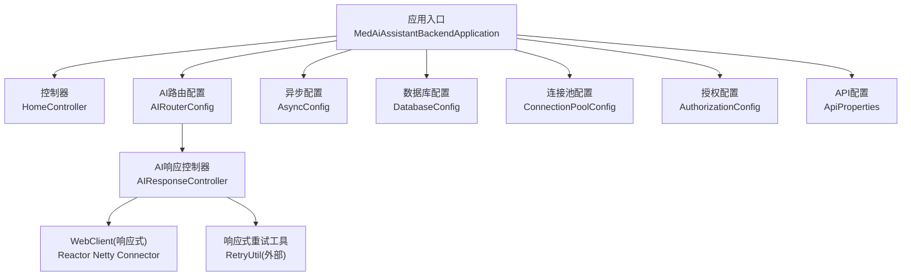
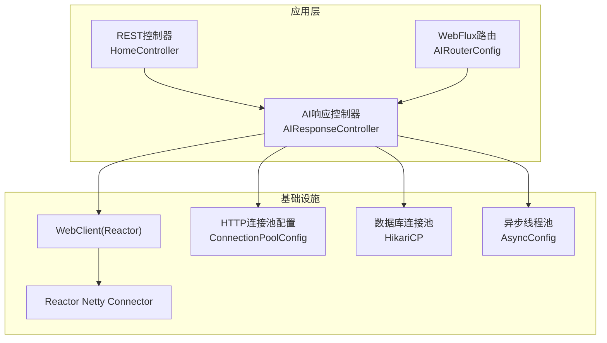
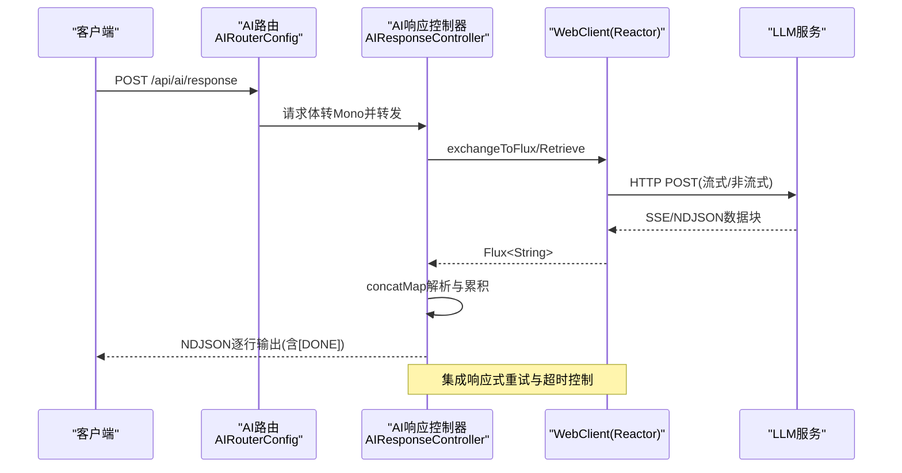
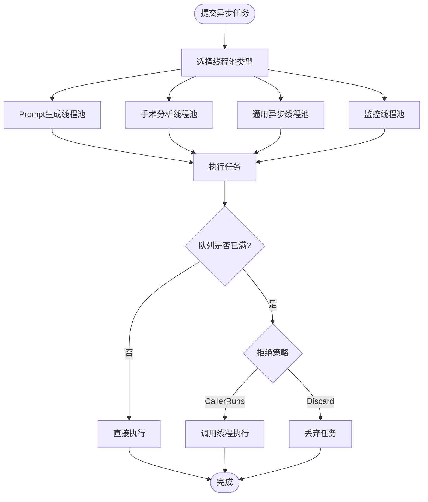
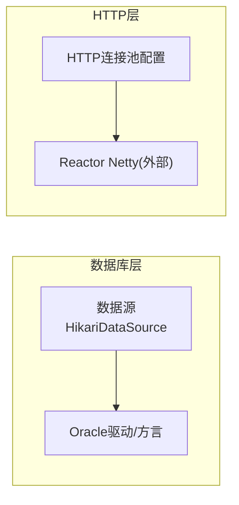
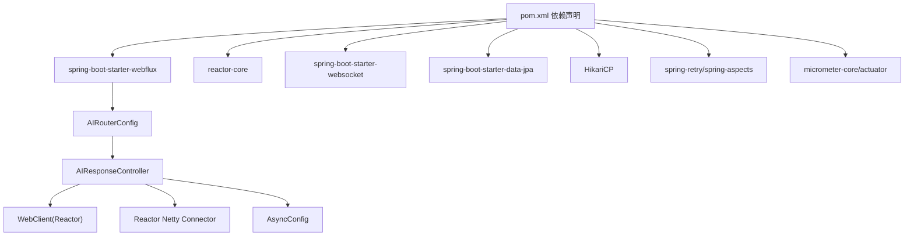

# 响应式编程架构

<cite>
**本文引用的文件**
- [MedAiAssistantBackendApplication.java](file://med_ai_assistant_1.0_bs_backend/src/main/java/com/example/medaiassistant/MedAiAssistantBackendApplication.java)
- [HomeController.java](file://med_ai_assistant_1.0_bs_backend/src/main/java/com/example/medaiassistant/HomeController.java)
- [pom.xml](file://med_ai_assistant_1.0_bs_backend/pom.xml)
- [AsyncConfig.java](file://med_ai_assistant_1.0_bs_backend/src/main/java/com/example/medaiassistant/config/AsyncConfig.java)
- [AIRouterConfig.java](file://med_ai_assistant_1.0_bs_backend/src/main/java/com/example/medaiassistant/config/AIRouterConfig.java)
- [CallbackConfig.java](file://med_ai_assistant_1.0_bs_backend/src/main/java/com/example/medaiassistant/config/CallbackConfig.java)
- [AIResponseController.java](file://med_ai_assistant_1.0_bs_backend/src/main/java/com/example/medaiassistant/controller/AIResponseController.java)
- [SchedulingProperties.java](file://med_ai_assistant_1.0_bs_backend/src/main/java/com/example/medaiassistant/config/SchedulingProperties.java)
- [DatabaseConfig.java](file://med_ai_assistant_1.0_bs_backend/src/main/java/com/example/medaiassistant/config/DatabaseConfig.java)
- [ConnectionPoolConfig.java](file://med_ai_assistant_1.0_bs_backend/src/main/java/com/example/medaiassistant/config/ConnectionPoolConfig.java)
- [AuthorizationConfig.java](file://med_ai_assistant_1.0_bs_backend/src/main/java/com/example/medaiassistant/config/AuthorizationConfig.java)
- [ApiProperties.java](file://med_ai_assistant_1.0_bs_backend/src/main/java/com/example/medaiassistant/config/ApiProperties.java)
</cite>

## 目录
1. [引言](#引言)
2. [项目结构](#项目结构)
3. [核心组件](#核心组件)
4. [架构总览](#架构总览)
5. [详细组件分析](#详细组件分析)
6. [依赖关系分析](#依赖关系分析)
7. [性能考量](#性能考量)
8. [故障排查指南](#故障排查指南)
9. [结论](#结论)
10. [附录](#附录)

## 引言
本文件面向MedAiAssistant 1.0 BS后端，系统化梳理其响应式编程架构与实现要点。项目基于Spring Boot 3.5.8与Spring WebFlux，结合Reactor核心库，构建了以非阻塞I/O、响应式数据流与异步事件处理为核心的后端服务。文档将从架构设计、组件职责、数据流与处理逻辑、背压与资源利用、以及可扩展性与运维角度进行深入解读，并提供与源码路径对应的“章节来源”和“图表来源”，便于读者定位实现细节。

## 项目结构
后端工程位于med_ai_assistant_1.0_bs_backend目录，采用标准Spring Boot分层组织，关键模块如下：
- 应用入口与装配：主类负责组件扫描与JPA仓库启用
- 控制器层：REST控制器与WebFlux路由控制器
- 配置层：异步线程池、数据库连接池、授权与API配置等
- 业务层：AI响应控制器封装外部LLM调用，集成响应式重试与流式输出
- 依赖声明：明确引入WebFlux与Reactor核心库

图表来源
- [MedAiAssistantBackendApplication.java](file://med_ai_assistant_1.0_bs_backend/src/main/java/com/example/medaiassistant/MedAiAssistantBackendApplication.java#L26-L47)
- [HomeController.java](file://med_ai_assistant_1.0_bs_backend/src/main/java/com/example/medaiassistant/HomeController.java#L9-L50)
- [AIRouterConfig.java](file://med_ai_assistant_1.0_bs_backend/src/main/java/com/example/medaiassistant/config/AIRouterConfig.java#L14-L35)
- [AIResponseController.java](file://med_ai_assistant_1.0_bs_backend/src/main/java/com/example/medaiassistant/controller/AIResponseController.java#L28-L87)
- [AsyncConfig.java](file://med_ai_assistant_1.0_bs_backend/src/main/java/com/example/medaiassistant/config/AsyncConfig.java#L20-L143)
- [DatabaseConfig.java](file://med_ai_assistant_1.0_bs_backend/src/main/java/com/example/medaiassistant/config/DatabaseConfig.java#L31-L268)
- [ConnectionPoolConfig.java](file://med_ai_assistant_1.0_bs_backend/src/main/java/com/example/medaiassistant/config/ConnectionPoolConfig.java#L10-L119)
- [AuthorizationConfig.java](file://med_ai_assistant_1.0_bs_backend/src/main/java/com/example/medaiassistant/config/AuthorizationConfig.java#L26-L260)
- [ApiProperties.java](file://med_ai_assistant_1.0_bs_backend/src/main/java/com/example/medaiassistant/config/ApiProperties.java#L10-L107)

章节来源
- [MedAiAssistantBackendApplication.java](file://med_ai_assistant_1.0_bs_backend/src/main/java/com/example/medaiassistant/MedAiAssistantBackendApplication.java#L26-L47)
- [pom.xml](file://med_ai_assistant_1.0_bs_backend/pom.xml#L53-L91)

## 核心组件
- 应用入口与装配
  - 启用Spring Boot自动装配、定时任务与JPA仓库扫描，排除执行服务器专用包，确保主应用聚焦核心业务。
- WebFlux路由与控制器
  - 通过RouterFunction定义AI响应路由，结合WebFlux的ServerResponse实现非阻塞请求处理。
  - AIResponseController使用WebClient与Reactor Netty Connector，实现响应式HTTP客户端与流式数据处理。
- 异步与线程池
  - AsyncConfig提供多套专用线程池，隔离不同业务任务，避免相互影响；采用拒绝策略与优雅停机配置，保障稳定性。
- 数据库与连接池
  - DatabaseConfig采用HikariCP连接池，针对Oracle进行专项优化；ConnectionPoolConfig提供HTTP连接池参数，支持连接复用与资源管理。
- 授权与API配置
  - AuthorizationConfig与ApiProperties分别负责权限控制与API参数管理，支持环境变量覆盖与运行期校验。

章节来源
- [MedAiAssistantBackendApplication.java](file://med_ai_assistant_1.0_bs_backend/src/main/java/com/example/medaiassistant/MedAiAssistantBackendApplication.java#L26-L47)
- [AIRouterConfig.java](file://med_ai_assistant_1.0_bs_backend/src/main/java/com/example/medaiassistant/config/AIRouterConfig.java#L14-L35)
- [AIResponseController.java](file://med_ai_assistant_1.0_bs_backend/src/main/java/com/example/medaiassistant/controller/AIResponseController.java#L28-L87)
- [AsyncConfig.java](file://med_ai_assistant_1.0_bs_backend/src/main/java/com/example/medaiassistant/config/AsyncConfig.java#L20-L143)
- [DatabaseConfig.java](file://med_ai_assistant_1.0_bs_backend/src/main/java/com/example/medaiassistant/config/DatabaseConfig.java#L31-L268)
- [ConnectionPoolConfig.java](file://med_ai_assistant_1.0_bs_backend/src/main/java/com/example/medaiassistant/config/ConnectionPoolConfig.java#L10-L119)
- [AuthorizationConfig.java](file://med_ai_assistant_1.0_bs_backend/src/main/java/com/example/medaiassistant/config/AuthorizationConfig.java#L26-L260)
- [ApiProperties.java](file://med_ai_assistant_1.0_bs_backend/src/main/java/com/example/medaiassistant/config/ApiProperties.java#L10-L107)

## 架构总览
MedAiAssistant 1.0 BS后端采用“主应用+WebFlux子路由”的混合模式：WebMVC负责常规REST接口，WebFlux路由独立处理AI响应的高并发与长时流式输出。AIResponseController通过WebClient与Reactor Netty Connector建立非阻塞HTTP通道，结合响应式重试与超时控制，实现对上游LLM服务的稳定调用。

图表来源
- [HomeController.java](file://med_ai_assistant_1.0_bs_backend/src/main/java/com/example/medaiassistant/HomeController.java#L9-L50)
- [AIRouterConfig.java](file://med_ai_assistant_1.0_bs_backend/src/main/java/com/example/medaiassistant/config/AIRouterConfig.java#L14-L35)
- [AIResponseController.java](file://med_ai_assistant_1.0_bs_backend/src/main/java/com/example/medaiassistant/controller/AIResponseController.java#L28-L87)
- [ConnectionPoolConfig.java](file://med_ai_assistant_1.0_bs_backend/src/main/java/com/example/medaiassistant/config/ConnectionPoolConfig.java#L10-L119)
- [DatabaseConfig.java](file://med_ai_assistant_1.0_bs_backend/src/main/java/com/example/medaiassistant/config/DatabaseConfig.java#L31-L268)
- [AsyncConfig.java](file://med_ai_assistant_1.0_bs_backend/src/main/java/com/example/medaiassistant/config/AsyncConfig.java#L20-L143)

## 详细组件分析

### WebFlux路由与AI响应控制器
- 路由定义
  - AIRouterConfig通过RouterFunctions定义POST /api/ai/response，绑定到AIResponseController的响应方法，形成独立的WebFlux处理链。
- 响应式处理
  - AIResponseController使用WebClient与Reactor Netty Connector，实现非阻塞HTTP调用；根据请求是否流式，选择Flux或Mono路径。
  - 流式响应通过concatMap逐块解析SSE/NDJSON数据，累积content与reasoning_content，最终以NDJSON逐行输出，末尾发送[DONE]标记。
- 重试与超时
  - 集成响应式重试（retryWhen），指数退避策略；设置读取超时与连接超时，避免长尾请求占用资源。
- 错误处理
  - 对HTTP 4xx/5xx与ResourceAccessException进行分类处理与降级返回；在所有重试失败后返回统一错误结构。

图表来源
- [AIRouterConfig.java](file://med_ai_assistant_1.0_bs_backend/src/main/java/com/example/medaiassistant/config/AIRouterConfig.java#L23-L34)
- [AIResponseController.java](file://med_ai_assistant_1.0_bs_backend/src/main/java/com/example/medaiassistant/controller/AIResponseController.java#L89-L182)
- [AIResponseController.java](file://med_ai_assistant_1.0_bs_backend/src/main/java/com/example/medaiassistant/controller/AIResponseController.java#L292-L402)
- [AIResponseController.java](file://med_ai_assistant_1.0_bs_backend/src/main/java/com/example/medaiassistant/controller/AIResponseController.java#L455-L526)

章节来源
- [AIRouterConfig.java](file://med_ai_assistant_1.0_bs_backend/src/main/java/com/example/medaiassistant/config/AIRouterConfig.java#L14-L35)
- [AIResponseController.java](file://med_ai_assistant_1.0_bs_backend/src/main/java/com/example/medaiassistant/controller/AIResponseController.java#L28-L87)
- [AIResponseController.java](file://med_ai_assistant_1.0_bs_backend/src/main/java/com/example/medaiassistant/controller/AIResponseController.java#L89-L182)
- [AIResponseController.java](file://med_ai_assistant_1.0_bs_backend/src/main/java/com/example/medaiassistant/controller/AIResponseController.java#L292-L402)
- [AIResponseController.java](file://med_ai_assistant_1.0_bs_backend/src/main/java/com/example/medaiassistant/controller/AIResponseController.java#L455-L526)

### 异步任务与线程池隔离
- 多线程池设计
  - Prompt生成专用线程池、手术分析专用线程池、通用异步执行线程池、监控线程池，均通过ThreadPoolTaskExecutor配置，支持核心/最大线程数、队列容量、拒绝策略与优雅停机。
- 拒绝策略
  - CallerRunsPolicy：当队列满时由调用线程执行，避免任务丢失；DiscardPolicy：监控线程池在极端情况下可容忍丢弃。
- 适用场景
  - 将高负载的AI推理与数据分析任务与Web请求线程隔离，提升整体吞吐与稳定性。

图表来源
- [AsyncConfig.java](file://med_ai_assistant_1.0_bs_backend/src/main/java/com/example/medaiassistant/config/AsyncConfig.java#L37-L59)
- [AsyncConfig.java](file://med_ai_assistant_1.0_bs_backend/src/main/java/com/example/medaiassistant/config/AsyncConfig.java#L68-L90)
- [AsyncConfig.java](file://med_ai_assistant_1.0_bs_backend/src/main/java/com/example/medaiassistant/config/AsyncConfig.java#L98-L116)
- [AsyncConfig.java](file://med_ai_assistant_1.0_bs_backend/src/main/java/com/example/medaiassistant/config/AsyncConfig.java#L124-L142)

章节来源
- [AsyncConfig.java](file://med_ai_assistant_1.0_bs_backend/src/main/java/com/example/medaiassistant/config/AsyncConfig.java#L20-L143)

### 数据库连接池与HTTP连接池
- 数据库连接池（HikariCP）
  - 针对Oracle进行专项优化，包括连接超时、空闲超时、最大生命周期、保活时间、泄漏检测与验证查询；支持多属性命名回退，增强主/执行服务器配置兼容性。
- HTTP连接池
  - ConnectionPoolConfig提供最大总连接数、每路由最大连接数、连接请求/连接/Socket超时、连接保持与保活时间等参数，支撑高并发外部调用。

图表来源
- [DatabaseConfig.java](file://med_ai_assistant_1.0_bs_backend/src/main/java/com/example/medaiassistant/config/DatabaseConfig.java#L103-L210)
- [ConnectionPoolConfig.java](file://med_ai_assistant_1.0_bs_backend/src/main/java/com/example/medaiassistant/config/ConnectionPoolConfig.java#L10-L119)

章节来源
- [DatabaseConfig.java](file://med_ai_assistant_1.0_bs_backend/src/main/java/com/example/medaiassistant/config/DatabaseConfig.java#L31-L268)
- [ConnectionPoolConfig.java](file://med_ai_assistant_1.0_bs_backend/src/main/java/com/example/medaiassistant/config/ConnectionPoolConfig.java#L10-L119)

### 授权与API配置
- 授权配置（AuthorizationConfig）
  - 支持RBAC与PBAC、默认角色与权限映射、访问控制规则、审计与权限验证开关，以及环境变量覆盖与运行期校验。
- API配置（ApiProperties）
  - 统一管理API基础URL、连接/读取超时与重试次数，便于集中治理与动态调整。

章节来源
- [AuthorizationConfig.java](file://med_ai_assistant_1.0_bs_backend/src/main/java/com/example/medaiassistant/config/AuthorizationConfig.java#L26-L260)
- [ApiProperties.java](file://med_ai_assistant_1.0_bs_backend/src/main/java/com/example/medaiassistant/config/ApiProperties.java#L10-L107)

## 依赖关系分析
- 核心依赖
  - spring-boot-starter-webflux与reactor-core：提供响应式Web与反应式核心能力
  - spring-boot-starter-websocket：支持WebSocket场景（如实时通知）
  - spring-boot-starter-data-jpa与HikariCP：数据库访问与高性能连接池
  - spring-retry与spring-aspects：异步回调重试与切面能力
  - micrometer与actuator：指标采集与监控端点
- 项目内依赖
  - AIRouterConfig依赖AIResponseController；AIResponseController依赖WebClient与Reactor Netty Connector；AsyncConfig为各业务线程池提供统一配置。

图表来源
- [pom.xml](file://med_ai_assistant_1.0_bs_backend/pom.xml#L53-L191)
- [AIRouterConfig.java](file://med_ai_assistant_1.0_bs_backend/src/main/java/com/example/medaiassistant/config/AIRouterConfig.java#L14-L35)
- [AIResponseController.java](file://med_ai_assistant_1.0_bs_backend/src/main/java/com/example/medaiassistant/controller/AIResponseController.java#L28-L87)
- [AsyncConfig.java](file://med_ai_assistant_1.0_bs_backend/src/main/java/com/example/medaiassistant/config/AsyncConfig.java#L20-L143)

章节来源
- [pom.xml](file://med_ai_assistant_1.0_bs_backend/pom.xml#L53-L191)

## 性能考量
- 资源利用率提升
  - WebFlux与Reactor Netty在高并发I/O密集场景下显著减少线程切换与上下文切换开销，提升CPU与内存使用效率。
- 延迟降低
  - 非阻塞I/O与连接池复用缩短请求等待时间；响应式重试与超时控制避免长尾请求拖累整体延迟。
- 吞吐量增加
  - 通过多线程池隔离与连接池参数调优，最大化利用系统资源，提升并发处理能力。
- 背压与流控
  - 响应式流在上游压力过大时，可通过背压策略（如限速、缓冲与降级）保护下游系统，避免雪崩效应。

## 故障排查指南
- AI响应流式输出异常
  - 检查SSE/NDJSON解析逻辑与[DONE]标记处理；确认响应式重试与超时配置是否合理。
- 外部服务不可用
  - 查看HTTP状态码分类处理与降级返回；核对连接超时、读取超时与重试次数。
- 数据库连接问题
  - 检查HikariCP参数（最大池大小、空闲超时、最大生命周期、保活时间）与验证查询；确认Oracle方言与会话参数。
- 线程池饱和
  - 根据拒绝策略与队列容量评估任务负载；必要时调整线程池参数或拆分任务类型。

章节来源
- [AIResponseController.java](file://med_ai_assistant_1.0_bs_backend/src/main/java/com/example/medaiassistant/controller/AIResponseController.java#L184-L290)
- [AIResponseController.java](file://med_ai_assistant_1.0_bs_backend/src/main/java/com/example/medaiassistant/controller/AIResponseController.java#L292-L402)
- [AIResponseController.java](file://med_ai_assistant_1.0_bs_backend/src/main/java/com/example/medaiassistant/controller/AIResponseController.java#L455-L526)
- [DatabaseConfig.java](file://med_ai_assistant_1.0_bs_backend/src/main/java/com/example/medaiassistant/config/DatabaseConfig.java#L173-L210)
- [AsyncConfig.java](file://med_ai_assistant_1.0_bs_backend/src/main/java/com/example/medaiassistant/config/AsyncConfig.java#L37-L59)

## 结论
MedAiAssistant 1.0 BS后端通过WebFlux与Reactor实现了高并发、低延迟的响应式架构，结合专用线程池、连接池与完善的错误处理机制，在AI推理与数据库访问场景下显著提升了资源利用率与吞吐量。建议在生产环境中持续优化连接池与线程池参数，完善监控与告警体系，并通过灰度发布逐步扩大WebFlux路由范围，以获得更稳健的长期演进。

## 附录
- 代码片段路径示例（请参考对应源码文件定位实现）
  - WebFlux路由定义：[AI路由配置](file://med_ai_assistant_1.0_bs_backend/src/main/java/com/example/medaiassistant/config/AIRouterConfig.java#L23-L34)
  - 响应式AI响应处理：[AI响应控制器](file://med_ai_assistant_1.0_bs_backend/src/main/java/com/example/medaiassistant/controller/AIResponseController.java#L89-L182)
  - 流式数据解析与累积：[AI响应控制器](file://med_ai_assistant_1.0_bs_backend/src/main/java/com/example/medaiassistant/controller/AIResponseController.java#L292-L402)
  - 非流式响应处理：[AI响应控制器](file://med_ai_assistant_1.0_bs_backend/src/main/java/com/example/medaiassistant/controller/AIResponseController.java#L455-L526)
  - 异步线程池配置：[异步配置](file://med_ai_assistant_1.0_bs_backend/src/main/java/com/example/medaiassistant/config/AsyncConfig.java#L98-L116)
  - 数据库连接池优化：[数据库配置](file://med_ai_assistant_1.0_bs_backend/src/main/java/com/example/medaiassistant/config/DatabaseConfig.java#L173-L210)
  - HTTP连接池参数：[连接池配置](file://med_ai_assistant_1.0_bs_backend/src/main/java/com/example/medaiassistant/config/ConnectionPoolConfig.java#L10-L119)
  - 授权与API配置：[授权配置](file://med_ai_assistant_1.0_bs_backend/src/main/java/com/example/medaiassistant/config/AuthorizationConfig.java#L122-L150), [API配置](file://med_ai_assistant_1.0_bs_backend/src/main/java/com/example/medaiassistant/config/ApiProperties.java#L79-L85)