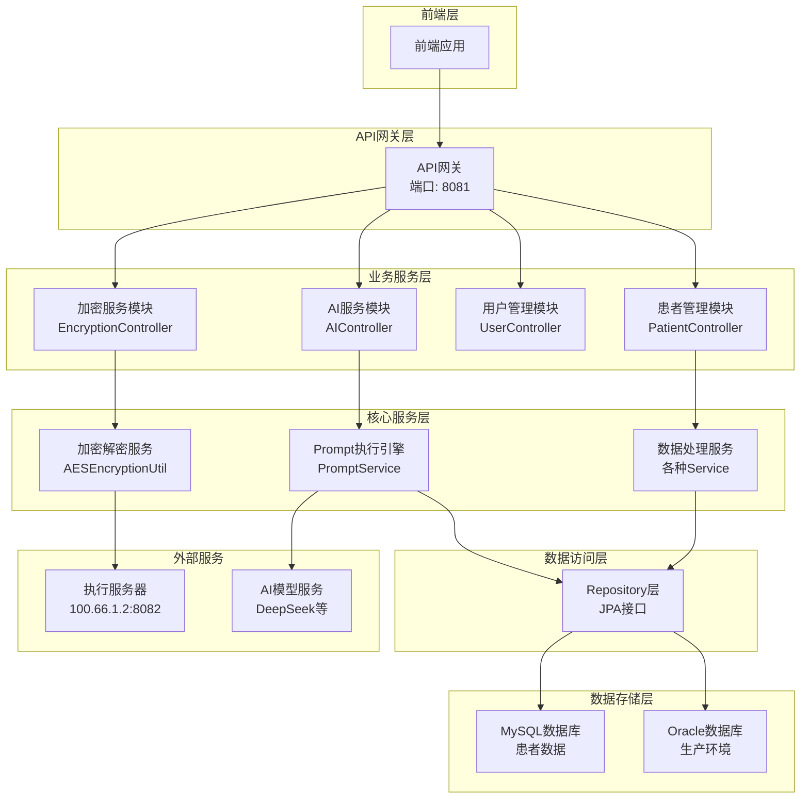
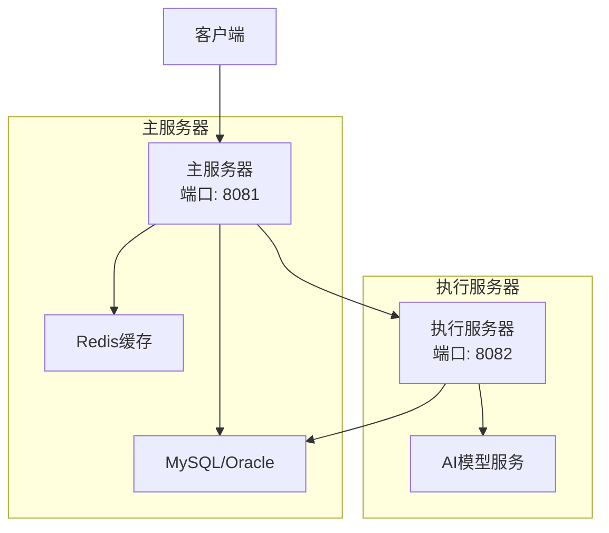
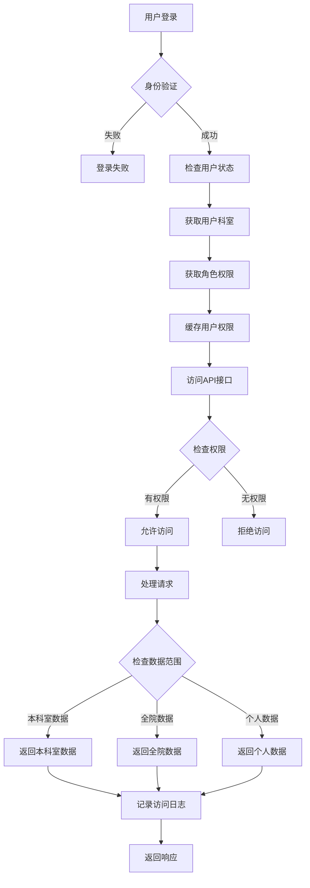
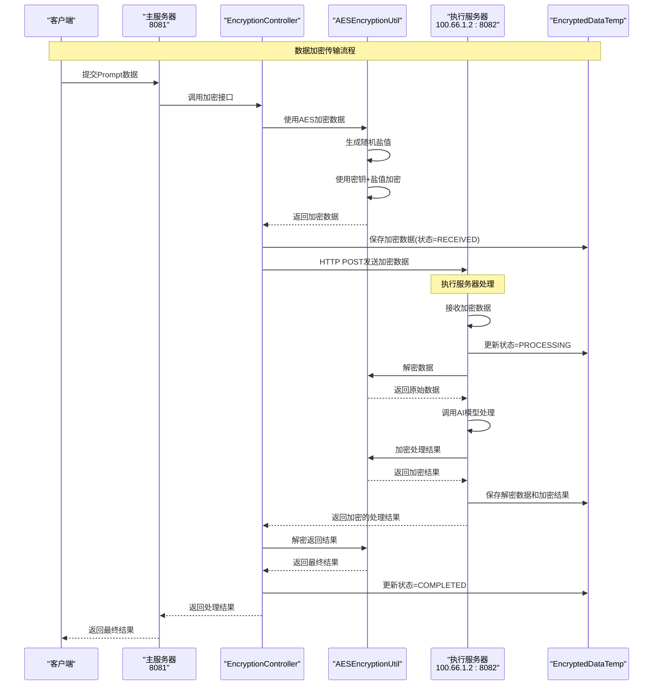
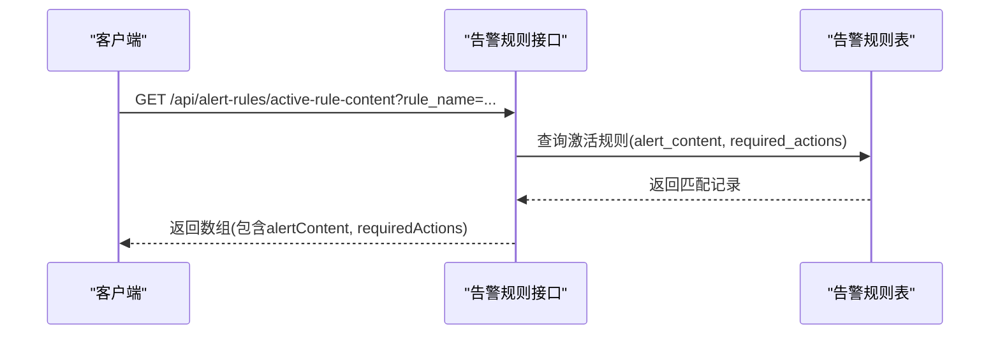
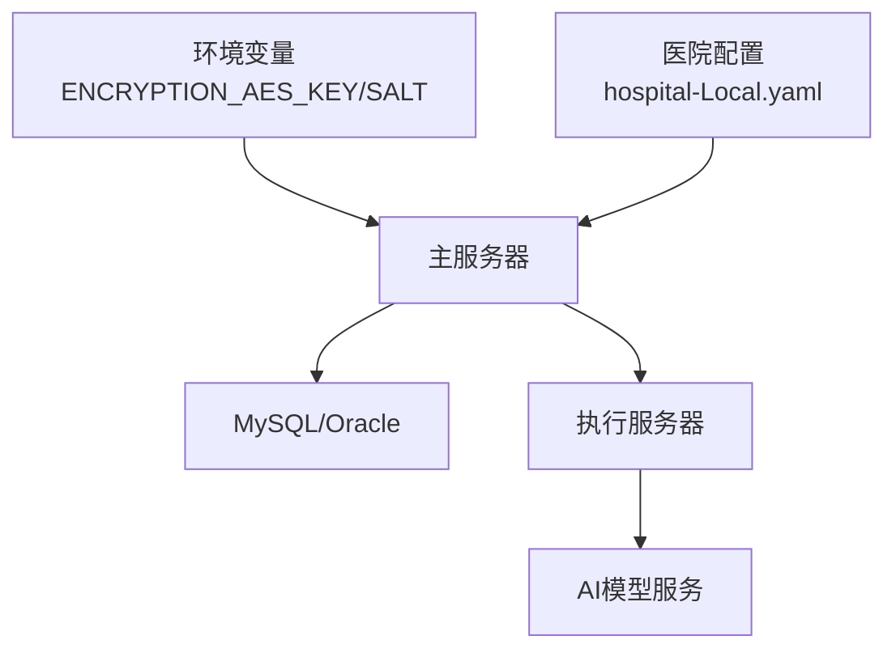

# 安全架构设计

<cite>
**本文引用的文件**
- [AES_ENCRYPTION_IMPLEMENTATION.md](file://med_ai_assistant_1.0_bs_backend/doc/其他/AES_ENCRYPTION_IMPLEMENTATION.md)
- [ARCHITECTURE_DIAGRAMS.md](file://med_ai_assistant_1.0_bs_backend/doc/其他/ARCHITECTURE_DIAGRAMS.md)
- [API_ALERT_RULES.md](file://med_ai_assistant_1.0_bs_backend/doc/其他/API_ALERT_RULES.md)
- [README.md（部署指南）](file://med_ai_assistant_1.0_bs_backend/deploy/README.md)
- [docker-compose.yml](file://med_ai_assistant_1.0_bs_backend/docker-compose.yml)
- [hospital-Local.yaml](file://med_ai_assistant_1.0_bs_backend/config/hospitals/hospital-Local.yaml)
- [cdwyy.yaml](file://med_ai_assistant_1.0_bs_backend/deploy/main-linux-oracle/config/hospitals/cdwyy.yaml)
- [testserver.yaml](file://med_ai_assistant_1.0_bs_backend/deploy/main-linux-testServer/config/hospitals/testserver.yaml)
</cite>

## 目录
1. [引言](#引言)
2. [项目结构](#项目结构)
3. [核心组件](#核心组件)
4. [架构总览](#架构总览)
5. [详细组件分析](#详细组件分析)
6. [依赖分析](#依赖分析)
7. [性能考量](#性能考量)
8. [故障排查指南](#故障排查指南)
9. [结论](#结论)
10. [附录](#附录)

## 引言
本文件面向安全工程师与合规专员，围绕 MedAiAssistant 1.0 BS 的后端系统，构建一套系统化的安全架构设计文档。重点覆盖身份认证与访问控制、数据加密与传输安全、API 安全防护、医疗数据隐私与审计追踪、威胁建模与应急响应等内容。同时结合项目现有文档与部署配置，给出可落地的实施建议与风险缓解策略。

## 项目结构
后端系统采用多模块分层架构，包含前端、API 网关、业务服务、核心服务、数据访问与存储、以及外部 AI 与执行服务器。系统通过 Docker Compose 编排，支持主服务器与执行服务器分离部署，满足高可用与职责分离的要求。

图表来源
- [ARCHITECTURE_DIAGRAMS.md](file://med_ai_assistant_1.0_bs_backend/doc/其他/ARCHITECTURE_DIAGRAMS.md#L5-L60)

章节来源
- [ARCHITECTURE_DIAGRAMS.md](file://med_ai_assistant_1.0_bs_backend/doc/其他/ARCHITECTURE_DIAGRAMS.md#L3-L60)
- [README.md（部署指南）](file://med_ai_assistant_1.0_bs_backend/deploy/README.md#L42-L62)

## 核心组件
- 身份认证与访问控制：基于用户模块与部门/角色映射，结合权限缓存与数据范围校验，形成“登录—权限—数据域”的闭环。
- 数据加密与传输：采用 AES-256-CBC（PBKDF2 派生密钥）对敏感 Prompt 数据进行端到端加密，主服务器与执行服务器之间通过加密通道传输。
- API 安全：通过健康检查端点、限流与速率控制、最小权限暴露、错误码规范与告警规则接口，降低 API 风险面。
- 医疗数据隐私与审计：通过数据脱敏、最小化采集、访问日志与审计追踪，满足 HIPAA 隐私保护与可追溯性要求。
- 威胁建模与应急响应：识别外部传输、内部越权、凭证泄露、中间人攻击等威胁，制定检测、阻断与恢复流程。

章节来源
- [ARCHITECTURE_DIAGRAMS.md](file://med_ai_assistant_1.0_bs_backend/doc/其他/ARCHITECTURE_DIAGRAMS.md#L308-L338)
- [AES_ENCRYPTION_IMPLEMENTATION.md](file://med_ai_assistant_1.0_bs_backend/doc/其他/AES_ENCRYPTION_IMPLEMENTATION.md#L1-L100)
- [README.md（部署指南）](file://med_ai_assistant_1.0_bs_backend/deploy/README.md#L135-L155)

## 架构总览
系统采用“主服务器 + 执行服务器”的双节点架构，主服务器负责 API 网关、调度与加密前置，执行服务器负责 AI 模型调用与耗时任务处理。数据在跨节点传输时采用加密通道，数据库支持 MySQL/Oracle 双栈，通过配置文件实现环境隔离与字段映射。

图表来源
- [README.md（部署指南）](file://med_ai_assistant_1.0_bs_backend/deploy/README.md#L42-L62)
- [docker-compose.yml](file://med_ai_assistant_1.0_bs_backend/docker-compose.yml#L1-L97)

章节来源
- [README.md（部署指南）](file://med_ai_assistant_1.0_bs_backend/deploy/README.md#L42-L62)
- [docker-compose.yml](file://med_ai_assistant_1.0_bs_backend/docker-compose.yml#L1-L97)

## 详细组件分析

### 身份认证与访问控制
- 登录与权限：用户登录后获取角色与科室信息，缓存权限，后续请求按权限与数据范围进行校验。
- 数据域控制：支持“本科室数据”“全院数据”“个人数据”三种范围，按用户角色与科室绑定决定可见范围。
- 审计与日志：每次授权访问均记录访问日志，便于审计与追溯。

图表来源
- [ARCHITECTURE_DIAGRAMS.md](file://med_ai_assistant_1.0_bs_backend/doc/其他/ARCHITECTURE_DIAGRAMS.md#L308-L338)

章节来源
- [ARCHITECTURE_DIAGRAMS.md](file://med_ai_assistant_1.0_bs_backend/doc/其他/ARCHITECTURE_DIAGRAMS.md#L308-L338)

### 数据加密与传输安全（AES-256）
- 加密算法：AES-256-CBC，填充方式 PKCS5Padding；密钥由 PBKDF2WithHmacSHA256 从密码与盐值派生，迭代次数 65536。
- 随机性：每次加密生成随机 IV，加密输出格式为“16字节随机IV + 加密数据”，并进行 Base64 编码。
- 密钥管理：密钥与盐值存储于数据库配置表，不同环境（开发/生产）隔离；支持密钥轮换与随机生成。
- 性能：单次加解密平均耗时约 2-3ms，支持并发处理；注意内存与日志中不记录敏感数据。
- 集成：在 Prompt 创建与执行流程中，敏感数据经加密后再传输至执行服务器，执行服务器解密后调用 AI 模型，再将结果加密返回。

图表来源
- [ARCHITECTURE_DIAGRAMS.md](file://med_ai_assistant_1.0_bs_backend/doc/其他/ARCHITECTURE_DIAGRAMS.md#L266-L306)
- [AES_ENCRYPTION_IMPLEMENTATION.md](file://med_ai_assistant_1.0_bs_backend/doc/其他/AES_ENCRYPTION_IMPLEMENTATION.md#L1-L100)

章节来源
- [AES_ENCRYPTION_IMPLEMENTATION.md](file://med_ai_assistant_1.0_bs_backend/doc/其他/AES_ENCRYPTION_IMPLEMENTATION.md#L1-L100)
- [ARCHITECTURE_DIAGRAMS.md](file://med_ai_assistant_1.0_bs_backend/doc/其他/ARCHITECTURE_DIAGRAMS.md#L266-L306)

### API 安全与告警规则
- 健康检查：主服务器与执行服务器均提供健康检查端点，便于运维快速定位服务状态。
- 告警规则接口：提供按规则名称查询激活告警规则内容与所需操作的接口，返回字段包含告警内容与 JSON 格式的所需操作。
- 错误码：定义标准错误码，便于前端与集成方统一处理异常。

图表来源
- [API_ALERT_RULES.md](file://med_ai_assistant_1.0_bs_backend/doc/其他/API_ALERT_RULES.md#L1-L59)

章节来源
- [API_ALERT_RULES.md](file://med_ai_assistant_1.0_bs_backend/doc/其他/API_ALERT_RULES.md#L1-L59)
- [README.md（部署指南）](file://med_ai_assistant_1.0_bs_backend/deploy/README.md#L135-L155)

### 医疗数据隐私与审计追踪
- 数据脱敏：在聚合患者数据与生成 Prompt 前进行必要的脱敏处理，降低敏感信息泄露风险。
- 最小化采集：仅采集与 AI 分析相关的必要字段，缩短数据生命周期。
- 审计日志：记录用户访问、数据范围、操作行为等，确保可追溯性。
- HIPAA 合规要点：明确数据分类、访问控制、传输加密、日志保留与删除策略，建立数据主体权利响应机制。

章节来源
- [ARCHITECTURE_DIAGRAMS.md](file://med_ai_assistant_1.0_bs_backend/doc/other/ARCHITECTURE_DIAGRAMS.md#L183-L232)

### 威胁建模与漏洞防护
- 外部传输威胁：中间人攻击、数据窃听、篡改。防护：端到端加密、证书校验、HTTPS（建议）、TLS 版本与密码套件加固。
- 内部越权威胁：角色绕过、横向移动。防护：最小权限、强制访问控制、细粒度数据域校验、会话与令牌管理。
- 凭证与密钥泄露：密钥明文存储、弱口令、默认配置未修改。防护：密钥轮换、环境变量注入、只读权限、定期审计。
- API 滥用：高频请求、暴力破解、参数注入。防护：速率限制、WAF/网关限流、参数校验、错误信息脱敏。
- 存储与备份：数据库凭据泄露、备份介质丢失。防护：数据库加密、备份加密、访问控制、异地容灾。

章节来源
- [README.md（部署指南）](file://med_ai_assistant_1.0_bs_backend/deploy/README.md#L239-L245)
- [AES_ENCRYPTION_IMPLEMENTATION.md](file://med_ai_assistant_1.0_bs_backend/doc/其他/AES_ENCRYPTION_IMPLEMENTATION.md#L136-L148)

### 应急响应预案
- 事件分级：根据影响范围与严重程度划分等级，明确处置时限与升级流程。
- 快速处置：隔离受影响服务、回滚可疑变更、清理临时凭证、恢复备份。
- 证据保全：保留日志、抓包、配置快照，配合合规审计。
- 恢复验证：验证业务可用性、数据一致性、安全策略有效性。
- 持续改进：复盘会议、补丁与策略更新、演练与培训。

章节来源
- [README.md（部署指南）](file://med_ai_assistant_1.0_bs_backend/deploy/README.md#L209-L230)

## 依赖分析
- 配置与密钥：主服务器通过环境变量注入加密密钥与盐值，建议使用密钥管理服务（KMS）或安全配置中心，避免硬编码。
- 数据源：支持 MySQL/Oracle 双栈，通过配置文件指定 HIS/LIS 字段映射与同步策略，确保不同医院的字段差异得到适配。
- 外部服务：执行服务器与 AI 模型服务通过 HTTP 通信，建议启用双向 TLS 与服务端证书校验。

图表来源
- [docker-compose.yml](file://med_ai_assistant_1.0_bs_backend/docker-compose.yml#L10-L18)
- [hospital-Local.yaml](file://med_ai_assistant_1.0_bs_backend/config/hospitals/hospital-Local.yaml#L1-L38)
- [cdwyy.yaml](file://med_ai_assistant_1.0_bs_backend/deploy/main-linux-oracle/config/hospitals/cdwyy.yaml#L1-L42)
- [testserver.yaml](file://med_ai_assistant_1.0_bs_backend/deploy/main-linux-testServer/config/hospitals/testserver.yaml#L1-L42)

章节来源
- [docker-compose.yml](file://med_ai_assistant_1.0_bs_backend/docker-compose.yml#L10-L18)
- [hospital-Local.yaml](file://med_ai_assistant_1.0_bs_backend/config/hospitals/hospital-Local.yaml#L1-L38)
- [cdwyy.yaml](file://med_ai_assistant_1.0_bs_backend/deploy/main-linux-oracle/config/hospitals/cdwyy.yaml#L1-L42)
- [testserver.yaml](file://med_ai_assistant_1.0_bs_backend/deploy/main-linux-testServer/config/hospitals/testserver.yaml#L1-L42)

## 性能考量
- 加密性能：单次加解密耗时约 2-3ms，支持并发处理；建议在批量场景中合并请求，减少握手开销。
- 数据库连接：根据环境选择 MySQL 或 Oracle，合理设置连接池大小与超时参数，避免资源争用。
- 缓存与队列：利用 Redis 缓存热点数据与权限信息，结合任务队列与线程池，提升吞吐能力。
- 监控与告警：通过健康检查端点与日志采集，持续监控延迟、错误率与资源使用情况。

章节来源
- [AES_ENCRYPTION_IMPLEMENTATION.md](file://med_ai_assistant_1.0_bs_backend/doc/其他/AES_ENCRYPTION_IMPLEMENTATION.md#L123-L135)
- [README.md（部署指南）](file://med_ai_assistant_1.0_bs_backend/deploy/README.md#L135-L172)

## 故障排查指南
- 容器启动失败：检查端口占用、环境变量配置、日志输出；确认数据库连通性与凭据正确。
- 数据库连接失败：验证主机可达性、用户名/密码、防火墙规则与网络策略。
- 内存不足：调整 JVM 参数（JAVA_OPTS）、增加容器资源限制、观察容器资源使用情况。
- 健康检查：主服务器与执行服务器分别通过健康端点检查服务状态，定位异常服务。

章节来源
- [README.md（部署指南）](file://med_ai_assistant_1.0_bs_backend/deploy/README.md#L209-L230)
- [README.md（部署指南）](file://med_ai_assistant_1.0_bs_backend/deploy/README.md#L135-L155)

## 结论
本安全架构设计以“加密前置、最小权限、可观测性”为核心原则，结合 AES-256 端到端加密、严格的访问控制与审计追踪，满足医疗数据隐私与合规要求。建议在生产环境中进一步强化传输层安全（HTTPS/TLS）、密钥管理与变更审计，并完善应急响应与演练机制，持续提升系统的整体韧性与合规水平。

## 附录
- 关键接口与端点
  - 健康检查：主服务器健康端点、执行服务器健康端点
  - 告警规则：按规则名称获取激活告警规则内容与所需操作
- 配置要点
  - 环境变量：加密密钥、盐值、数据库连接、执行服务器地址
  - 医院配置：字段映射、同步策略、表前缀
- 建议清单
  - 修改默认密码与密钥
  - 配置 HTTPS 与 TLS
  - 限制网络访问与最小暴露
  - 定期备份与密钥轮换
  - 建立安全运营与应急响应流程

章节来源
- [README.md（部署指南）](file://med_ai_assistant_1.0_bs_backend/deploy/README.md#L80-L100)
- [hospital-Local.yaml](file://med_ai_assistant_1.0_bs_backend/config/hospitals/hospital-Local.yaml#L18-L38)
- [API_ALERT_RULES.md](file://med_ai_assistant_1.0_bs_backend/doc/其他/API_ALERT_RULES.md#L1-L59)