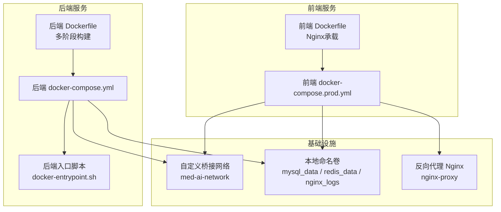
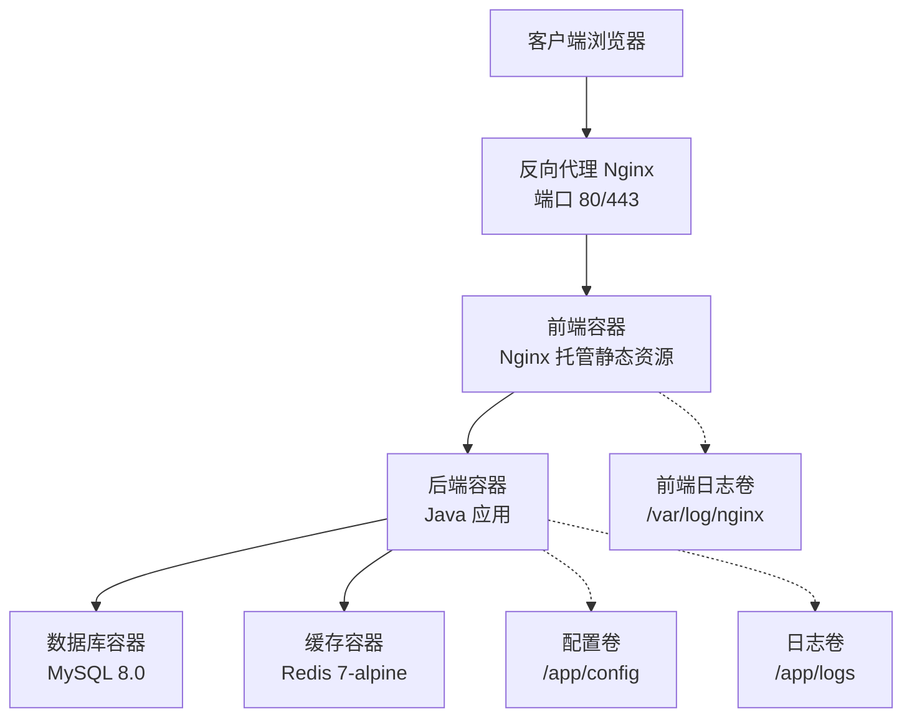
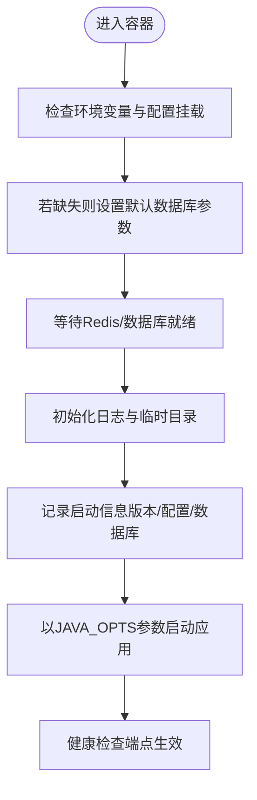
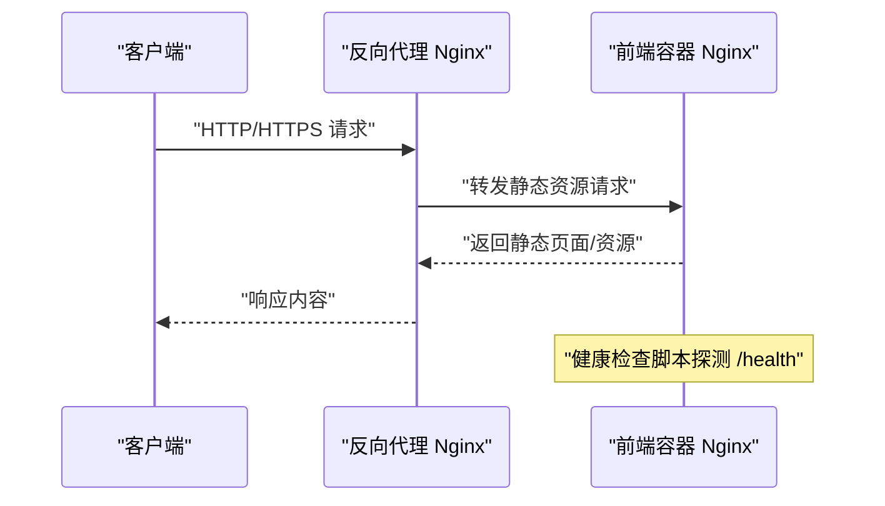
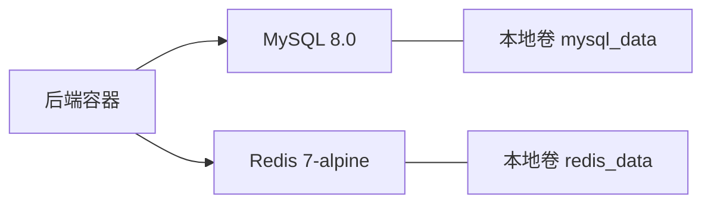
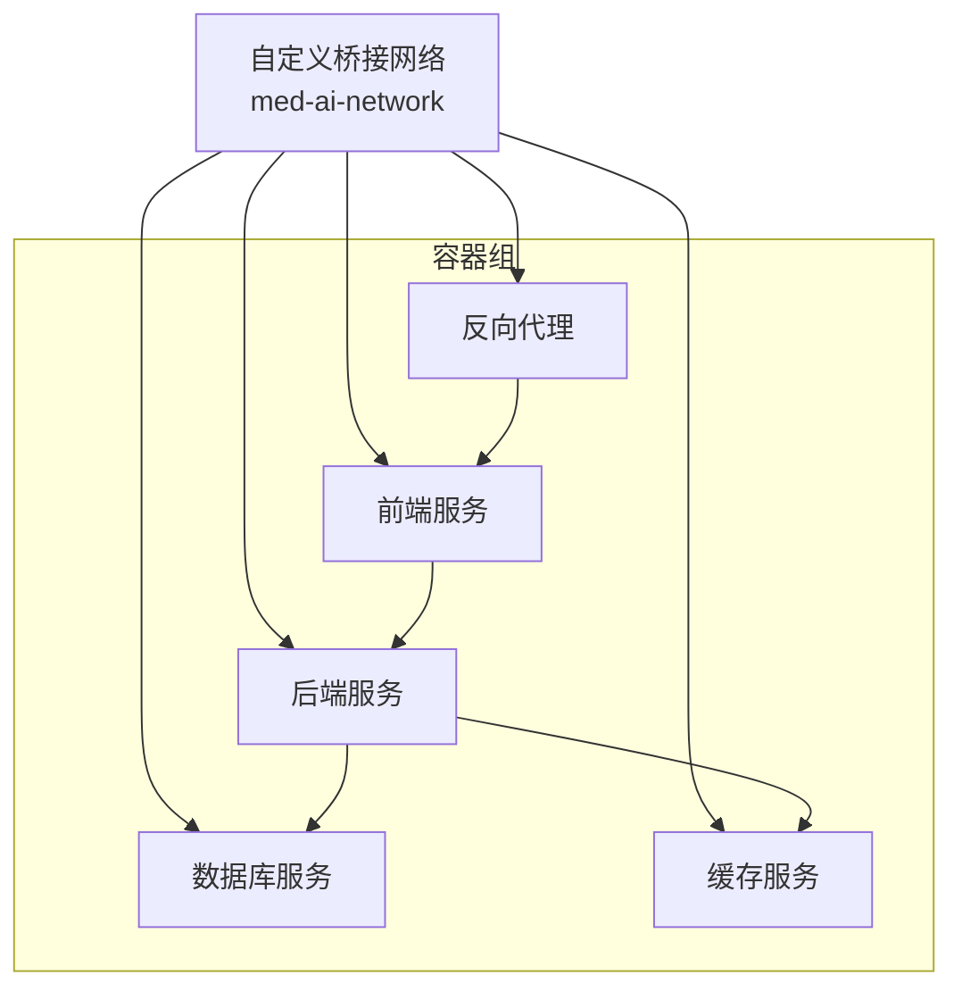
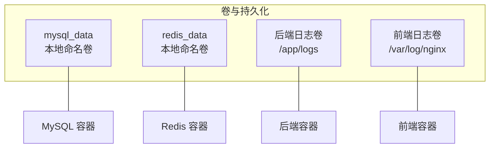
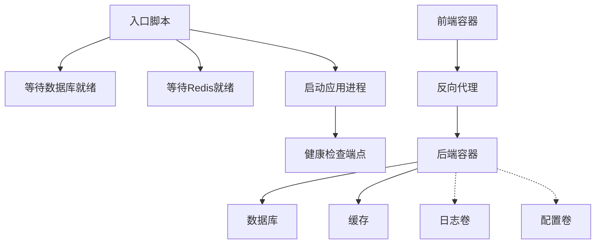

# 容器化部署架构

<cite>
**本文引用的文件**
- [med_ai_assistant_1.0_bs_backend/Dockerfile](file://med_ai_assistant_1.0_bs_backend/Dockerfile)
- [med_ai_assistant_1.0_bs_backend/Dockerfile.local](file://med_ai_assistant_1.0_bs_backend/Dockerfile.local)
- [med_ai_assistant_1.0_bs_backend/docker-compose.yml](file://med_ai_assistant_1.0_bs_backend/docker-compose.yml)
- [med_ai_assistant_1.0_bs_backend/deploy/main-linux-oracle/docker-entrypoint.sh](file://med_ai_assistant_1.0_bs_backend/deploy/main-linux-oracle/docker-entrypoint.sh)
- [med_ai_assistant_1.0_bs_backend/deploy/README.md](file://med_ai_assistant_1.0_bs_backend/deploy/README.md)
- [med_ai_assistant_1.0_bs_vue/Dockerfile](file://med_ai_assistant_1.0_bs_vue/Dockerfile)
- [med_ai_assistant_1.0_bs_vue/docker-compose.prod.yml](file://med_ai_assistant_1.0_bs_vue/docker-compose.prod.yml)
- [.gitignore](file://.gitignore)
</cite>

## 目录
1. [简介](#简介)
2. [项目结构](#项目结构)
3. [核心组件](#核心组件)
4. [架构总览](#架构总览)
5. [详细组件分析](#详细组件分析)
6. [依赖关系分析](#依赖关系分析)
7. [性能考量](#性能考量)
8. [故障排查指南](#故障排查指南)
9. [结论](#结论)
10. [附录](#附录)

## 简介
本文件面向MedAiAssistant 1.0 BS的容器化部署，系统化阐述后端与前端的Docker多阶段构建策略、镜像优化与安全配置、容器编排方案、服务发现与网络配置、存储管理、以及对比传统部署的优势。同时提供监控、日志与故障恢复的实施方案，并给出DevOps与系统管理员的最佳实践。

## 项目结构
项目采用前后端分离的容器化架构，后端基于多阶段构建，前端使用Nginx直接承载静态资源。通过Docker Compose进行本地开发与生产环境编排，统一桥接网络与共享卷，便于快速部署与弹性扩展。

图表来源
- [med_ai_assistant_1.0_bs_backend/Dockerfile](file://med_ai_assistant_1.0_bs_backend/Dockerfile#L1-L71)
- [med_ai_assistant_1.0_bs_backend/docker-compose.yml](file://med_ai_assistant_1.0_bs_backend/docker-compose.yml#L1-L97)
- [med_ai_assistant_1.0_bs_backend/deploy/main-linux-oracle/docker-entrypoint.sh](file://med_ai_assistant_1.0_bs_backend/deploy/main-linux-oracle/docker-entrypoint.sh#L1-L108)
- [med_ai_assistant_1.0_bs_vue/Dockerfile](file://med_ai_assistant_1.0_bs_vue/Dockerfile#L1-L30)
- [med_ai_assistant_1.0_bs_vue/docker-compose.prod.yml](file://med_ai_assistant_1.0_bs_vue/docker-compose.prod.yml#L1-L86)

章节来源
- [med_ai_assistant_1.0_bs_backend/Dockerfile](file://med_ai_assistant_1.0_bs_backend/Dockerfile#L1-L71)
- [med_ai_assistant_1.0_bs_backend/docker-compose.yml](file://med_ai_assistant_1.0_bs_backend/docker-compose.yml#L1-L97)
- [med_ai_assistant_1.0_bs_vue/Dockerfile](file://med_ai_assistant_1.0_bs_vue/Dockerfile#L1-L30)
- [med_ai_assistant_1.0_bs_vue/docker-compose.prod.yml](file://med_ai_assistant_1.0_bs_vue/docker-compose.prod.yml#L1-L86)

## 核心组件
- 后端容器（Java 21/JRE）：多阶段构建，第一阶段使用Maven构建产物，第二阶段仅保留运行时JRE，显著减小镜像体积；内置健康检查与入口脚本，支持外部配置挂载与数据库/缓存依赖等待。
- 前端容器（Nginx）：直接承载预构建静态资源，内置健康检查脚本，配合反向代理统一对外提供HTTP/HTTPS服务。
- 数据库与缓存：MySQL与Redis以独立容器运行，通过自定义桥接网络互联，使用本地命名卷持久化数据。
- 反向代理：独立Nginx容器作为入口，负责路由、TLS终止与日志输出，便于集中管理与扩展。

章节来源
- [med_ai_assistant_1.0_bs_backend/Dockerfile](file://med_ai_assistant_1.0_bs_backend/Dockerfile#L1-L71)
- [med_ai_assistant_1.0_bs_backend/Dockerfile.local](file://med_ai_assistant_1.0_bs_backend/Dockerfile.local#L1-L53)
- [med_ai_assistant_1.0_bs_backend/docker-compose.yml](file://med_ai_assistant_1.0_bs_backend/docker-compose.yml#L1-L97)
- [med_ai_assistant_1.0_bs_vue/Dockerfile](file://med_ai_assistant_1.0_bs_vue/Dockerfile#L1-L30)
- [med_ai_assistant_1.0_bs_vue/docker-compose.prod.yml](file://med_ai_assistant_1.0_bs_vue/docker-compose.prod.yml#L1-L86)

## 架构总览
下图展示容器化部署的整体交互：前端Nginx反向代理将请求转发至后端服务，后端通过入口脚本完成依赖等待与配置加载，数据库与缓存通过自定义网络互通，日志与配置通过卷持久化。

图表来源
- [med_ai_assistant_1.0_bs_vue/docker-compose.prod.yml](file://med_ai_assistant_1.0_bs_vue/docker-compose.prod.yml#L1-L86)
- [med_ai_assistant_1.0_bs_backend/docker-compose.yml](file://med_ai_assistant_1.0_bs_backend/docker-compose.yml#L1-L97)

## 详细组件分析

### 后端容器（多阶段构建与运行优化）
- 多阶段构建优势
  - 构建阶段使用完整JDK与Maven，预取并缓存依赖，提升重复构建效率；仅复制最终产物至运行阶段。
  - 运行阶段基于精简JRE镜像，显著降低镜像体积与攻击面，减少漏洞暴露面。
- 镜像优化策略
  - 国内镜像源替换与网络工具安装前置，确保健康检查可用且网络稳定。
  - 显式设置时区与JVM参数，保证运行一致性与性能。
  - 暴露应用端口并配置健康检查，便于编排系统进行存活/就绪探测。
- 安全配置
  - 入口脚本支持外部配置挂载与默认数据库参数回退，避免硬编码敏感信息。
  - 健康检查与依赖等待逻辑，降低冷启动失败率与级联异常风险。
- 关键实现路径
  - 多阶段构建与JVM参数设置：[Dockerfile](file://med_ai_assistant_1.0_bs_backend/Dockerfile#L1-L71)
  - 本地构建简化版镜像（仅运行阶段）：[Dockerfile.local](file://med_ai_assistant_1.0_bs_backend/Dockerfile.local#L1-L53)
  - 入口脚本的依赖等待与配置加载：[docker-entrypoint.sh](file://med_ai_assistant_1.0_bs_backend/deploy/main-linux-oracle/docker-entrypoint.sh#L1-L108)

图表来源
- [med_ai_assistant_1.0_bs_backend/deploy/main-linux-oracle/docker-entrypoint.sh](file://med_ai_assistant_1.0_bs_backend/deploy/main-linux-oracle/docker-entrypoint.sh#L1-L108)

章节来源
- [med_ai_assistant_1.0_bs_backend/Dockerfile](file://med_ai_assistant_1.0_bs_backend/Dockerfile#L1-L71)
- [med_ai_assistant_1.0_bs_backend/Dockerfile.local](file://med_ai_assistant_1.0_bs_backend/Dockerfile.local#L1-L53)
- [med_ai_assistant_1.0_bs_backend/deploy/main-linux-oracle/docker-entrypoint.sh](file://med_ai_assistant_1.0_bs_backend/deploy/main-linux-oracle/docker-entrypoint.sh#L1-L108)

### 前端容器（Nginx承载与健康检查）
- 静态资源承载：直接复制预构建dist目录至Nginx默认站点目录，配合主配置与站点配置文件。
- 健康检查：内置轻量健康检查脚本，通过HTTP探测确认服务可用。
- 反向代理：独立Nginx容器作为入口，支持TLS终止与日志落盘，便于集中运维。

图表来源
- [med_ai_assistant_1.0_bs_vue/Dockerfile](file://med_ai_assistant_1.0_bs_vue/Dockerfile#L1-L30)
- [med_ai_assistant_1.0_bs_vue/docker-compose.prod.yml](file://med_ai_assistant_1.0_bs_vue/docker-compose.prod.yml#L1-L86)

章节来源
- [med_ai_assistant_1.0_bs_vue/Dockerfile](file://med_ai_assistant_1.0_bs_vue/Dockerfile#L1-L30)
- [med_ai_assistant_1.0_bs_vue/docker-compose.prod.yml](file://med_ai_assistant_1.0_bs_vue/docker-compose.prod.yml#L1-L86)

### 数据库与缓存（MySQL/Redis）
- MySQL：使用官方8.0镜像，设置字符集与时区，挂载数据卷与初始化SQL，启用健康检查。
- Redis：使用Alpine精简镜像，开启AOF持久化与密码认证，挂载数据卷。

图表来源
- [med_ai_assistant_1.0_bs_backend/docker-compose.yml](file://med_ai_assistant_1.0_bs_backend/docker-compose.yml#L1-L97)

章节来源
- [med_ai_assistant_1.0_bs_backend/docker-compose.yml](file://med_ai_assistant_1.0_bs_backend/docker-compose.yml#L1-L97)

### 自定义网络与服务发现
- 自定义桥接网络med-ai-network，统一子网与网关，便于容器间通过服务名互访。
- 服务发现：后端通过服务名访问MySQL/Redis，无需硬编码IP；前端通过反向代理统一入口。

图表来源
- [med_ai_assistant_1.0_bs_backend/docker-compose.yml](file://med_ai_assistant_1.0_bs_backend/docker-compose.yml#L90-L97)
- [med_ai_assistant_1.0_bs_vue/docker-compose.prod.yml](file://med_ai_assistant_1.0_bs_vue/docker-compose.prod.yml#L81-L86)

章节来源
- [med_ai_assistant_1.0_bs_backend/docker-compose.yml](file://med_ai_assistant_1.0_bs_backend/docker-compose.yml#L90-L97)
- [med_ai_assistant_1.0_bs_vue/docker-compose.prod.yml](file://med_ai_assistant_1.0_bs_vue/docker-compose.prod.yml#L81-L86)

### 存储管理（卷与持久化）
- 本地命名卷：mysql_data、redis_data用于数据库与缓存持久化。
- 绑定挂载：后端日志卷映射至宿主机，前端Nginx日志卷映射至宿主机logs目录，便于审计与巡检。
- 卷驱动：本地驱动，支持绑定挂载与默认驱动。

图表来源
- [med_ai_assistant_1.0_bs_backend/docker-compose.yml](file://med_ai_assistant_1.0_bs_backend/docker-compose.yml#L84-L88)
- [med_ai_assistant_1.0_bs_vue/docker-compose.prod.yml](file://med_ai_assistant_1.0_bs_vue/docker-compose.prod.yml#L67-L79)

章节来源
- [med_ai_assistant_1.0_bs_backend/docker-compose.yml](file://med_ai_assistant_1.0_bs_backend/docker-compose.yml#L84-L88)
- [med_ai_assistant_1.0_bs_vue/docker-compose.prod.yml](file://med_ai_assistant_1.0_bs_vue/docker-compose.prod.yml#L67-L79)

### 容器编排与弹性伸缩
- Compose编排：通过服务定义端口映射、环境变量、依赖关系与重启策略，实现一键拉起与自愈。
- 弹性伸缩：后端服务可通过编排工具横向扩展副本数，前端反向代理可结合负载均衡实现高可用。
- 环境一致性：镜像与配置分离，不同环境复用同一Compose文件，仅调整环境变量与挂载路径。

章节来源
- [med_ai_assistant_1.0_bs_backend/docker-compose.yml](file://med_ai_assistant_1.0_bs_backend/docker-compose.yml#L1-L97)
- [med_ai_assistant_1.0_bs_vue/docker-compose.prod.yml](file://med_ai_assistant_1.0_bs_vue/docker-compose.prod.yml#L1-L86)

### 安全配置与合规
- 最小权限与最小镜像：运行阶段使用JRE与Alpine基础镜像，减少攻击面。
- 环境变量与密钥：通过环境变量注入数据库与加密密钥，避免硬编码；建议生产环境使用密钥管理服务。
- 网络隔离：自定义桥接网络与端口控制，限制不必要的暴露。
- 健康检查与依赖等待：降低启动失败与级联异常风险，提升整体安全性。

章节来源
- [med_ai_assistant_1.0_bs_backend/Dockerfile](file://med_ai_assistant_1.0_bs_backend/Dockerfile#L1-L71)
- [med_ai_assistant_1.0_bs_backend/Dockerfile.local](file://med_ai_assistant_1.0_bs_backend/Dockerfile.local#L1-L53)
- [med_ai_assistant_1.0_bs_backend/deploy/main-linux-oracle/docker-entrypoint.sh](file://med_ai_assistant_1.0_bs_backend/deploy/main-linux-oracle/docker-entrypoint.sh#L1-L108)
- [med_ai_assistant_1.0_bs_vue/docker-compose.prod.yml](file://med_ai_assistant_1.0_bs_vue/docker-compose.prod.yml#L1-L86)

## 依赖关系分析
后端容器对数据库与缓存存在强依赖，通过入口脚本实现等待与容错；前端通过反向代理统一接入，后端通过服务名访问数据库与缓存；日志与配置通过卷持久化，便于审计与升级。

图表来源
- [med_ai_assistant_1.0_bs_backend/deploy/main-linux-oracle/docker-entrypoint.sh](file://med_ai_assistant_1.0_bs_backend/deploy/main-linux-oracle/docker-entrypoint.sh#L1-L108)
- [med_ai_assistant_1.0_bs_backend/docker-compose.yml](file://med_ai_assistant_1.0_bs_backend/docker-compose.yml#L1-L97)
- [med_ai_assistant_1.0_bs_vue/docker-compose.prod.yml](file://med_ai_assistant_1.0_bs_vue/docker-compose.prod.yml#L1-L86)

章节来源
- [med_ai_assistant_1.0_bs_backend/deploy/main-linux-oracle/docker-entrypoint.sh](file://med_ai_assistant_1.0_bs_backend/deploy/main-linux-oracle/docker-entrypoint.sh#L1-L108)
- [med_ai_assistant_1.0_bs_backend/docker-compose.yml](file://med_ai_assistant_1.0_bs_backend/docker-compose.yml#L1-L97)
- [med_ai_assistant_1.0_bs_vue/docker-compose.prod.yml](file://med_ai_assistant_1.0_bs_vue/docker-compose.prod.yml#L1-L86)

## 性能考量
- 镜像体积与启动速度：多阶段构建显著缩小运行镜像，缩短拉取与启动时间。
- JVM参数与GC：合理设置堆大小与G1GC参数，降低停顿与OOM风险。
- 网络与I/O：国内镜像源与网络工具前置，减少启动期网络阻塞；日志与数据卷分离，避免I/O争用。
- 资源限制：建议在编排中设置CPU/内存限制，结合HPA实现弹性伸缩。

## 故障排查指南
- 健康检查端点
  - 后端：通过容器内健康检查端点验证服务状态。
  - 前端：通过健康检查脚本探测静态页面可用性。
- 常见问题定位
  - 端口占用与冲突：检查宿主机端口映射与容器端口。
  - 数据库连接：验证网络连通、凭据与防火墙策略。
  - 内存不足：调整JVM参数或增加容器资源限制。
- 日志查看
  - Docker日志：通过容器名称查看实时日志。
  - 应用日志：查看挂载的日志卷文件，定位错误堆栈。

章节来源
- [med_ai_assistant_1.0_bs_backend/deploy/README.md](file://med_ai_assistant_1.0_bs_backend/deploy/README.md#L135-L227)

## 结论
通过多阶段构建与精简运行镜像，MedAiAssistant实现了更小的镜像体积与更强的安全性；借助Docker Compose与自定义网络，实现了环境一致性、快速部署与弹性伸缩；结合卷持久化与健康检查，提供了可靠的监控、日志与故障恢复能力。该方案相较传统部署方式，在可移植性、可维护性与可观测性方面具有显著优势。

## 附录
- 开发与生产差异
  - 开发环境可使用本地构建简化镜像；生产环境优先使用多阶段构建镜像，确保最小化与可追溯性。
- 版本与标签
  - Dockerfile中包含版本标签与元数据，便于发布与审计。
- 仓库忽略
  - .gitignore排除IDE配置与子模块仓库，避免无关文件进入版本控制。

章节来源
- [.gitignore](file://.gitignore#L1-L7)
- [med_ai_assistant_1.0_bs_backend/Dockerfile](file://med_ai_assistant_1.0_bs_backend/Dockerfile#L20-L26)
- [med_ai_assistant_1.0_bs_backend/Dockerfile.local](file://med_ai_assistant_1.0_bs_backend/Dockerfile.local#L7-L11)