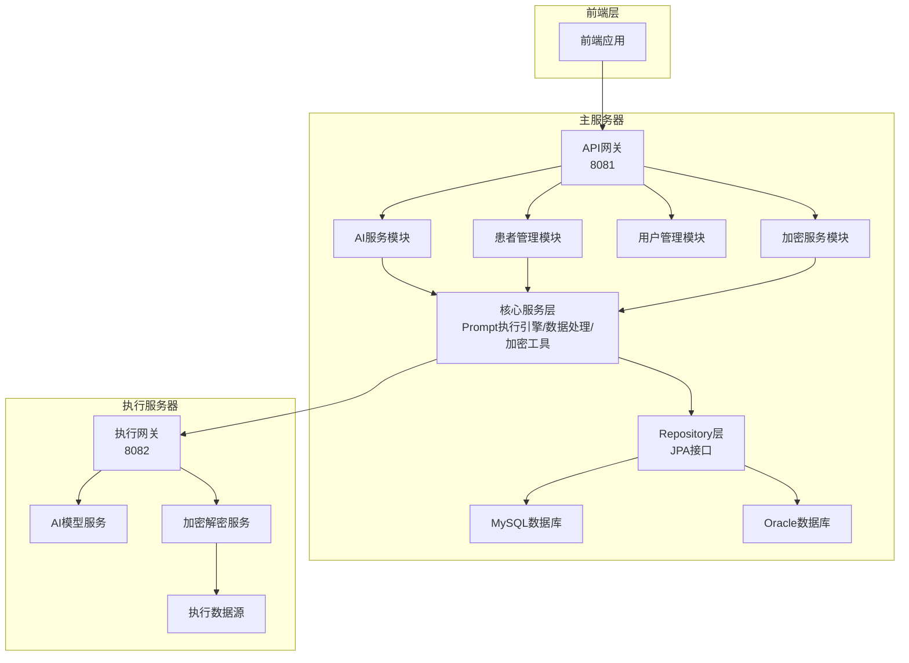
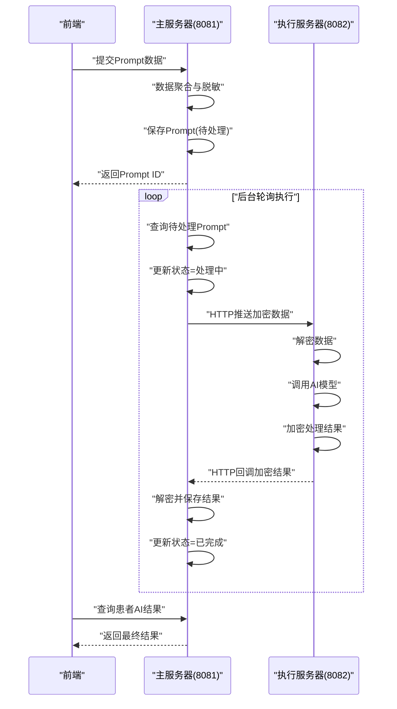
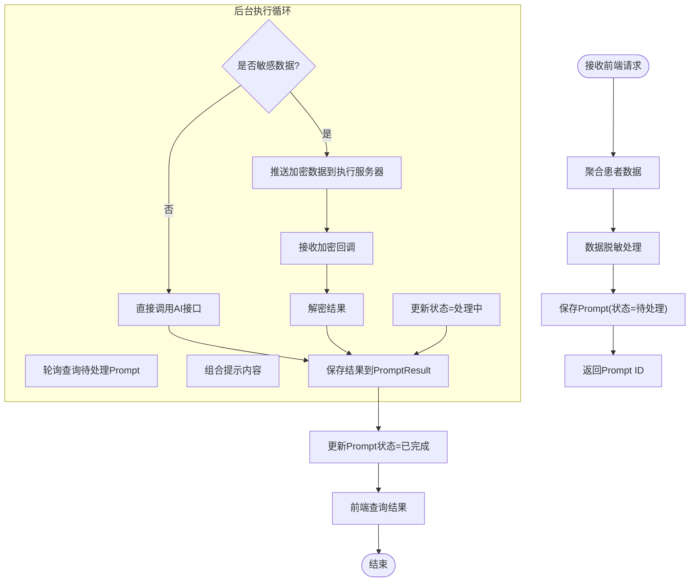
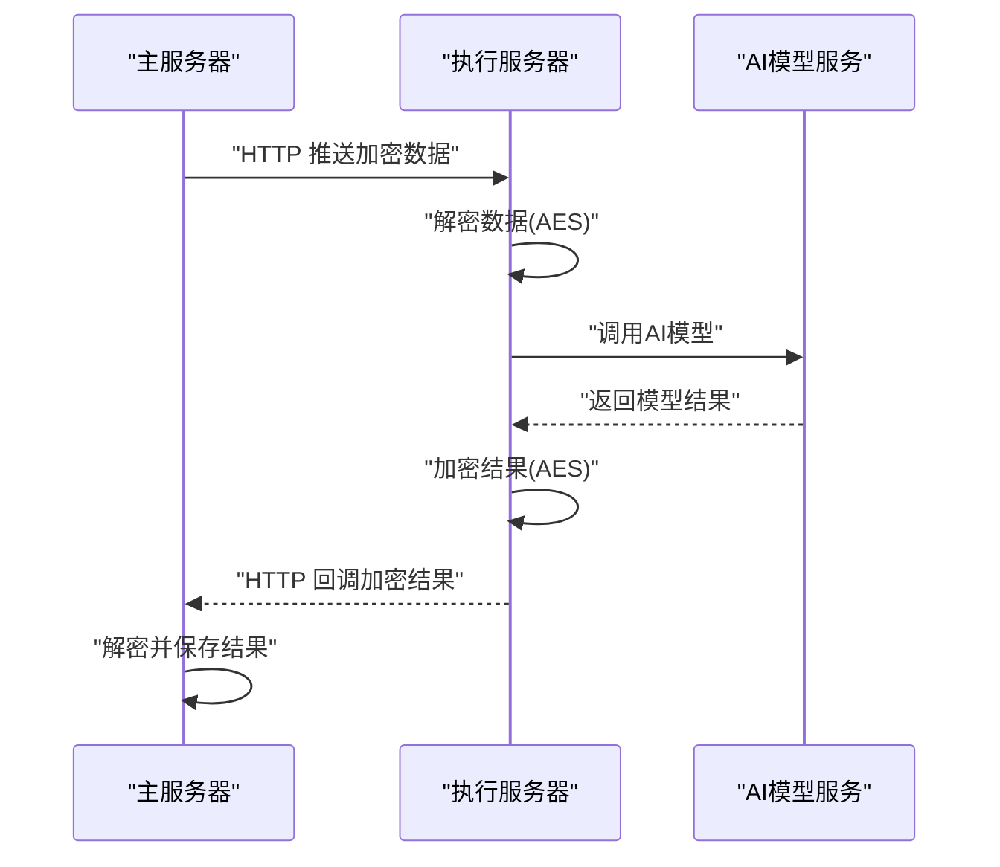
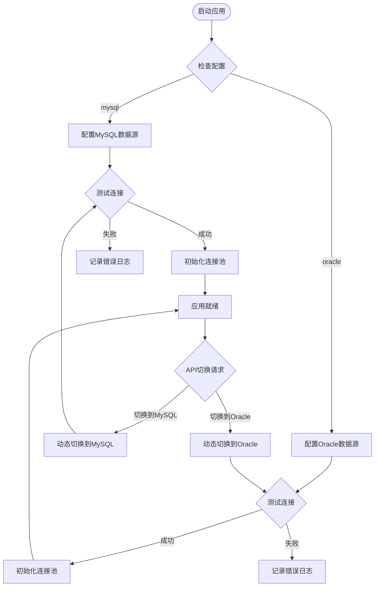
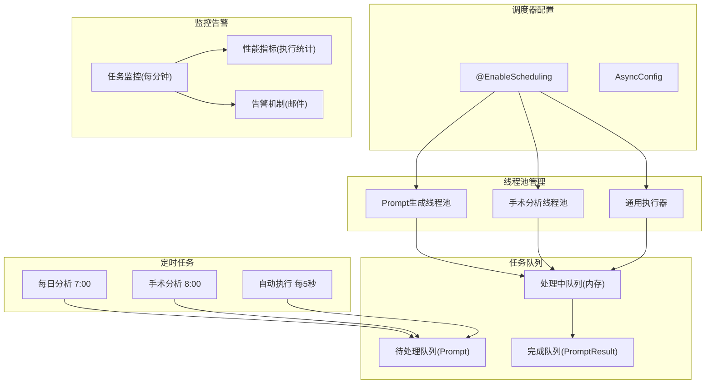
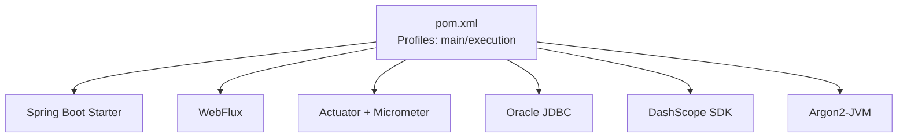

# 微服务架构设计

<cite>
**本文引用的文件**
- [架构图与业务流程图](file://med_ai_assistant_1.0_bs_backend/doc/其他/ARCHITECTURE_DIAGRAMS.md)
- [API接口文档](file://med_ai_assistant_1.0_bs_backend/doc/其他/API_DOCUMENTATION.md)
- [部署总览](file://med_ai_assistant_1.0_bs_backend/deploy/README.md)
- [主服务器 Linux+Oracle 部署说明](file://med_ai_assistant_1.0_bs_backend/deploy/main-linux-oracle/README.md)
- [主服务器 Windows 部署说明](file://med_ai_assistant_1.0_bs_backend/deploy/main-windows/README.md)
- [执行服务器 Windows 部署说明](file://med_ai_assistant_1.0_bs_backend/deploy/execution-windows/README.md)
- [POM 构建配置](file://med_ai_assistant_1.0_bs_backend/pom.xml)
- [内存配置](file://med_ai_assistant_1.0_bs_backend/memory-bank/config/memory-config.json)
- [缓存策略](file://med_ai_assistant_1.0_bs_backend/memory-bank/config/cache-policy.json)
- [模型知识库](file://med_ai_assistant_1.0_bs_backend/memory-bank/knowledge-base/ai-models/model-knowledge-base.json)
</cite>

## 目录
1. [引言](#引言)
2. [项目结构](#项目结构)
3. [核心组件](#核心组件)
4. [架构总览](#架构总览)
5. [详细组件分析](#详细组件分析)
6. [依赖分析](#依赖分析)
7. [性能考虑](#性能考虑)
8. [故障排查指南](#故障排查指南)
9. [结论](#结论)
10. [附录](#附录)

## 引言
本设计文档面向 MedAiAssistant 1.0 BS 的微服务化演进，围绕“主服务器”与“执行服务器”的职责分离展开，阐述微服务架构的设计理念、服务边界划分原则、服务间通信机制、负载均衡与故障隔离策略，以及主服务器的 API 网关与任务调度能力、执行服务器的 AI 模型处理能力。同时提供部署拓扑图、服务依赖关系图与最佳实践指导，帮助架构师与系统设计人员高效落地。

## 项目结构
后端工程采用多模块/多角色部署形态，主要包含：
- 主服务器（Main Server）
  - 角色定位：统一入口、API 网关、任务编排、权限与数据范围校验、健康检查与告警规则查询等。
  - 端口：8081
- 执行服务器（Execution Server）
  - 角色定位：AI 模型调用、敏感数据加密/解密、异步回调处理、耗时任务执行。
  - 端口：8082
- 共享基础设施
  - Redis 缓存
  - Oracle/MySQL 数据库
  - Docker Compose 编排与日志采集

图表来源
- [架构图与业务流程图](file://med_ai_assistant_1.0_bs_backend/doc/其他/ARCHITECTURE_DIAGRAMS.md#L5-L60)
- [部署总览](file://med_ai_assistant_1.0_bs_backend/deploy/README.md#L42-L62)

章节来源
- [部署总览](file://med_ai_assistant_1.0_bs_backend/deploy/README.md#L1-L250)
- [架构图与业务流程图](file://med_ai_assistant_1.0_bs_backend/doc/其他/ARCHITECTURE_DIAGRAMS.md#L1-L391)

## 核心组件
- API 网关与路由
  - 主服务器对外统一入口，聚合各业务模块（AI、患者、用户、加密），负责鉴权、限流、熔断与转发。
- AI 服务模块
  - 负责 Prompt 管理、AI 调用、流式响应、结果持久化与查询。
- 患者管理模块
  - 提供病历、化验、检查、医嘱、诊断等数据的查询与格式化输出。
- 用户管理模块
  - 登录认证、权限校验、数据范围控制（本科室/全院/个人）。
- 加密服务模块
  - 负责敏感数据的 AES 加密/解密、与执行服务器的加密数据交互。
- 核心服务层
  - Prompt 执行引擎：定时/自动执行、状态机推进、结果落库。
  - 数据处理服务：数据聚合、脱敏、格式化。
  - 加密解密服务：AESEncryptionUtil。
- 数据访问层与存储
  - JPA Repository 访问 MySQL/Oracle。
- 执行服务器
  - AI 模型服务：对接 DeepSeek 等外部模型。
  - 异步回调处理：接收主服务器推送的加密数据，解密后调用模型，再加密返回。

章节来源
- [架构图与业务流程图](file://med_ai_assistant_1.0_bs_backend/doc/其他/ARCHITECTURE_DIAGRAMS.md#L11-L60)
- [API接口文档](file://med_ai_assistant_1.0_bs_backend/doc/其他/API_DOCUMENTATION.md#L192-L464)

## 架构总览
微服务拆分遵循“主服务器-执行服务器”双节点分离：
- 主服务器专注业务编排与安全边界，不直接承载重型 AI 计算。
- 执行服务器专注模型推理与敏感数据处理，具备独立的缓存与数据库连接池。
- 两者通过 HTTP 推送/回调模式通信，主服务器向执行服务器推送加密数据，执行服务器处理完成后回传加密结果，主服务器再解密返回给前端。

图表来源
- [架构图与业务流程图](file://med_ai_assistant_1.0_bs_backend/doc/其他/ARCHITECTURE_DIAGRAMS.md#L185-L232)

章节来源
- [架构图与业务流程图](file://med_ai_assistant_1.0_bs_backend/doc/其他/ARCHITECTURE_DIAGRAMS.md#L183-L232)

## 详细组件分析

### 主服务器（API 网关与任务编排）
- 职责边界
  - 统一入口、权限与数据范围校验、任务状态推进、结果查询。
  - 不直接暴露 AI 模型密钥与敏感数据。
- 关键流程
  - Prompt 创建与保存：接收前端请求，聚合患者数据，保存到 Prompt 表，状态=待处理。
  - 后台自动执行：定时/轮询查询待处理 Prompt，更新状态=处理中，组合提示内容。
  - 加密传输模式：若涉及敏感数据，走加密服务模块，主服务器仅持有密文。
  - 结果落库与查询：将 AI 结果写入 PromptResult 表，前端查询时返回。
- 通信机制
  - 内部模块间：Spring MVC 控制器 -> 服务层 -> Repository -> 数据库。
  - 与执行服务器：HTTP 推送/回调，主服务器作为发起方与结果聚合者。

图表来源
- [架构图与业务流程图](file://med_ai_assistant_1.0_bs_backend/doc/其他/ARCHITECTURE_DIAGRAMS.md#L205-L227)
- [API接口文档](file://med_ai_assistant_1.0_bs_backend/doc/其他/API_DOCUMENTATION.md#L268-L398)

章节来源
- [架构图与业务流程图](file://med_ai_assistant_1.0_bs_backend/doc/其他/ARCHITECTURE_DIAGRAMS.md#L183-L232)
- [API接口文档](file://med_ai_assistant_1.0_bs_backend/doc/其他/API_DOCUMENTATION.md#L192-L464)

### 执行服务器（AI 模型处理与加密）
- 职责边界
  - 承载 AI 模型调用、敏感数据的加密/解密、异步回调处理。
  - 与主服务器通过 HTTP 推送/回调协作，不直接暴露给前端。
- 关键流程
  - 接收主服务器推送的加密数据，解密后调用模型，再加密返回。
  - 支持多种模型（如 DeepSeek Chat/Reasoner），具备温度、最大 token 等参数配置。
  - 异步回调控制器：接收回调、解密、处理、返回结构化响应。
- 通信机制
  - 主服务器 -> 执行服务器：HTTP 推送加密数据。
  - 执行服务器 -> 主服务器：HTTP 回调加密结果。

图表来源
- [架构图与业务流程图](file://med_ai_assistant_1.0_bs_backend/doc/其他/ARCHITECTURE_DIAGRAMS.md#L269-L306)
- [模型知识库](file://med_ai_assistant_1.0_bs_backend/memory-bank/knowledge-base/ai-models/model-knowledge-base.json#L1-L121)

章节来源
- [架构图与业务流程图](file://med_ai_assistant_1.0_bs_backend/doc/其他/ARCHITECTURE_DIAGRAMS.md#L266-L306)
- [模型知识库](file://med_ai_assistant_1.0_bs_backend/memory-bank/knowledge-base/ai-models/model-knowledge-base.json#L1-L121)

### 数据库与缓存策略
- 数据库
  - 支持 MySQL/Oracle 切换，启动时动态检测并初始化连接池；提供 API 动态切换。
- 缓存与内存
  - 内存配置：最大内存、清理阈值、保留周期、监控与备份策略。
  - 缓存策略：按类型（患者数据/AI响应/会话）设定 TTL、大小上限、淘汰策略与压缩/加密开关。
- 监控与告警
  - 健康检查端点、指标导出（Prometheus）、告警规则查询接口。

图表来源
- [架构图与业务流程图](file://med_ai_assistant_1.0_bs_backend/doc/其他/ARCHITECTURE_DIAGRAMS.md#L234-L264)
- [内存配置](file://med_ai_assistant_1.0_bs_backend/memory-bank/config/memory-config.json#L1-L32)
- [缓存策略](file://med_ai_assistant_1.0_bs_backend/memory-bank/config/cache-policy.json#L1-L46)

章节来源
- [架构图与业务流程图](file://med_ai_assistant_1.0_bs_backend/doc/其他/ARCHITECTURE_DIAGRAMS.md#L234-L264)
- [内存配置](file://med_ai_assistant_1.0_bs_backend/memory-bank/config/memory-config.json#L1-L32)
- [缓存策略](file://med_ai_assistant_1.0_bs_backend/memory-bank/config/cache-policy.json#L1-L46)

### 服务间通信与负载均衡
- 通信模式
  - 主服务器与执行服务器之间采用 HTTP 推送/回调，避免长连接与复杂协议。
  - 前端与主服务器之间采用 REST/SSE（流式响应）。
- 负载均衡
  - 建议在主服务器前部署反向代理/负载均衡器，实现多实例横向扩展。
  - 执行服务器可多实例部署，通过主服务器的回调地址进行结果回传。
- 故障隔离
  - 执行服务器故障不影响主服务器对外服务能力；主服务器对执行服务器进行健康检查与超时控制。
  - 异步回调具备重试与错误处理，避免单点失败影响全局。

章节来源
- [部署总览](file://med_ai_assistant_1.0_bs_backend/deploy/README.md#L42-L62)
- [API接口文档](file://med_ai_assistant_1.0_bs_backend/doc/其他/API_DOCUMENTATION.md#L271-L336)

### 任务调度与异步处理
- 调度器配置
  - @EnableScheduling + AsyncConfig，定义不同任务线程池（Prompt生成、手术分析、通用执行器）。
- 任务队列
  - 待处理队列（Prompt表）、处理中队列（内存管理）、完成队列（PromptResult表）。
- 监控与告警
  - 每分钟任务监控、邮件告警、性能指标统计。

图表来源
- [架构图与业务流程图](file://med_ai_assistant_1.0_bs_backend/doc/其他/ARCHITECTURE_DIAGRAMS.md#L340-L391)

章节来源
- [架构图与业务流程图](file://med_ai_assistant_1.0_bs_backend/doc/other/ASYNC_CALLBACK_FRAMEWORK.md#L1-L200)

## 依赖分析
- 外部依赖
  - Spring Boot 3.x、Spring WebFlux、Micrometer+Prometheus、Actuator、Argon2-JVM、DashScope SDK、Oracle JDBC。
- 内部模块耦合
  - 主服务器模块内聚，核心服务层与数据访问层解耦；与执行服务器通过 HTTP 协议弱耦合。
- 配置与构建
  - POM 中定义 main/execution 两套 profile，分别对应主/执行服务器部署。

图表来源
- [POM 构建配置](file://med_ai_assistant_1.0_bs_backend/pom.xml#L33-L52)
- [POM 构建配置](file://med_ai_assistant_1.0_bs_backend/pom.xml#L53-L214)

章节来源
- [POM 构建配置](file://med_ai_assistant_1.0_bs_backend/pom.xml#L1-L309)

## 性能考虑
- 线程池与并发
  - 为不同任务类型配置专用线程池，避免相互干扰；合理设置最大并发与超时。
- 缓存与内存
  - 依据缓存策略与内存配置，控制 TTL、大小上限与压缩/加密开关，避免内存抖动。
- 数据库连接池
  - 启动阶段动态检测与初始化，提供运行时切换能力，确保高可用。
- 监控与可观测性
  - 开启 Actuator 与 Prometheus 指标导出，结合告警规则实现主动运维。

章节来源
- [架构图与业务流程图](file://med_ai_assistant_1.0_bs_backend/doc/其他/ARCHITECTURE_DIAGRAMS.md#L340-L391)
- [内存配置](file://med_ai_assistant_1.0_bs_backend/memory-bank/config/memory-config.json#L1-L32)
- [缓存策略](file://med_ai_assistant_1.0_bs_backend/memory-bank/config/cache-policy.json#L1-L46)

## 故障排查指南
- 常见问题
  - 容器启动失败：检查端口占用、查看容器日志、核对环境变量。
  - 数据库连接失败：验证可达性、用户名密码、防火墙规则。
  - 内存不足：调整 JVM 参数、增加资源限制、查看容器资源使用。
- 健康检查
  - 主服务器：/api/health
  - 执行服务器：/api/execute/health、/api/execute/service-status
- 部署更新
  - 重新加载镜像、停止旧服务、启动新服务、重启容器。

章节来源
- [部署总览](file://med_ai_assistant_1.0_bs_backend/deploy/README.md#L135-L231)

## 结论
通过“主服务器-执行服务器”的微服务分离，MedAiAssistant 实现了业务编排与模型推理的职责清晰划分，提升了安全性、可扩展性与可维护性。配合完善的任务调度、缓存与监控体系，可在生产环境中稳定支撑 AI 辅诊与数据处理需求。建议在上线前完成端到端演练与压测，并持续优化线程池与缓存策略。

## 附录
- 部署拓扑
  - 主服务器与执行服务器分别部署在独立容器中，通过反向代理/负载均衡对外提供服务。
- 服务依赖关系
  - 主服务器依赖：JPA、Actuator、Micrometer、Oracle JDBC、DashScope SDK、Argon2-JVM。
  - 执行服务器依赖：与主服务器一致，额外承担模型调用与加密处理。

章节来源
- [部署总览](file://med_ai_assistant_1.0_bs_backend/deploy/README.md#L1-L250)
- [POM 构建配置](file://med_ai_assistant_1.0_bs_backend/pom.xml#L53-L214)