# 系统架构

<cite>
**本文引用的文件**
- [ARCHITECTURE_DIAGRAMS.md](file://med_ai_assistant_1.0_bs_backend/doc/其他/ARCHITECTURE_DIAGRAMS.md)
- [API_DOCUMENTATION.md](file://med_ai_assistant_1.0_bs_backend/doc/其他/API_DOCUMENTATION.md)
- [AES_ENCRYPTION_IMPLEMENTATION.md](file://med_ai_assistant_1.0_bs_backend/doc/其他/AES_ENCRYPTION_IMPLEMENTATION.md)
- [README.md（主服务器 Linux + Oracle 部署指南）](file://med_ai_assistant_1.0_bs_backend/deploy/main-linux-oracle/README.md)
- [README.md（执行服务器 Linux 部署指南）](file://med_ai_assistant_1.0_bs_backend/deploy/execution-linux/README.md)
- [application.properties（主服务器配置）](file://med_ai_assistant_1.0_bs_backend/deploy/main-linux-oracle/config/application.properties)
- [application-execution.properties（执行服务器配置）](file://med_ai_assistant_1.0_bs_backend/deploy/execution-linux/config/execution/application-execution.properties)
- [docker-compose-main.yml（主服务器编排）](file://med_ai_assistant_1.0_bs_backend/deploy/main-linux-oracle/docker-compose-main.yml)
- [nginx.conf](file://med_ai_assistant_1.0_bs_vue/nginx.conf)
- [nginx.main.conf](file://med_ai_assistant_1.0_bs_vue/nginx.main.conf)
- [docker-compose.yml](file://med_ai_assistant_1.0_bs_vue/docker-compose.yml)
- [request.js](file://med_ai_assistant_1.0_bs_vue/src/api/request.js)
- [ai.js](file://med_ai_assistant_1.0_bs_vue/src/api/ai.js)
- [.env.production](file://med_ai_assistant_1.0_bs_vue/.env.production)
- [2026-04-26.md](file://med_ai_assistant_1.0_bs_vue/docs/更新日志/2026-04-26.md)
- [虚拟测试主服务器部署与数据库同步.md](file://med_ai_assistant_1.0_bs_backend/doc/测试/测试服务器/主服务器/虚拟测试主服务器部署与数据库同步.md)
</cite>

## 更新摘要
**所做更改**
- 新增反向代理架构章节，详细说明nginx反向代理在系统架构中的作用
- 更新部署拓扑图，展示nginx作为统一入口的架构模式
- 新增API网关层概念，说明nginx如何抽象后端服务IP地址
- 更新前端API配置，展示相对路径配置的优势
- 新增部署灵活性和环境可移植性的技术分析

## 目录
1. [引言](#引言)
2. [项目结构](#项目结构)
3. [核心组件](#核心组件)
4. [架构总览](#架构总览)
5. [详细组件分析](#详细组件分析)
6. [反向代理架构优化](#反向代理架构优化)
7. [依赖分析](#依赖分析)
8. [性能考量](#性能考量)
9. [故障排查指南](#故障排查指南)
10. [结论](#结论)
11. [附录](#附录)

## 引言
本文件面向系统管理员与架构师，系统性阐述 MedAiAssistant 1.0 BS 的整体架构设计与实现要点。重点包括：
- 主服务器与执行服务器的分离架构模式及其职责划分
- 基于响应式编程（Spring WebFlux）的流式接口与异步处理能力
- 微服务化拆分与容器化部署优势
- **新增：nginx反向代理抽象后端服务IP，提升部署灵活性和环境可移植性**
- 数据流向与安全传输机制
- 基础设施要求、可扩展性设计与安全架构

## 项目结构
仓库采用"后端文档与部署"与"前端部署"双轨并行的组织方式。后端侧包含：
- doc/其他：系统架构图、API 文档、加密实现、异步回调框架等技术文档
- deploy：主服务器与执行服务器的多环境部署包，含 Docker Compose、环境变量与配置文件
- src/main/resources：开发/测试/集成/Oracle 等多套应用配置

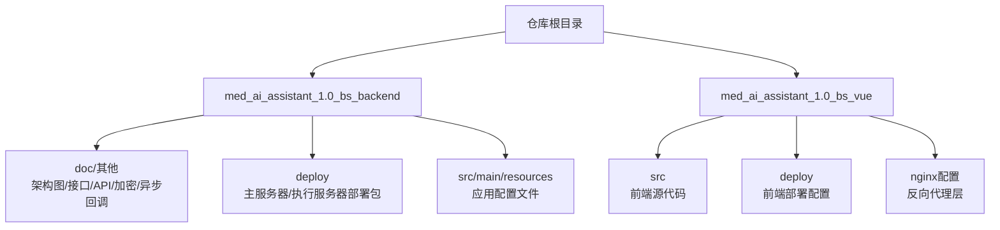

**章节来源**
- file://med_ai_assistant_1.0_bs_backend/doc/其他/ARCHITECTURE_DIAGRAMS.md#L1-L391
- file://med_ai_assistant_1.0_bs_backend/deploy/main-linux-oracle/README.md#L1-L396
- file://med_ai_assistant_1.0_bs_backend/deploy/execution-linux/README.md#L1-L138

## 核心组件
- 前端应用：负责用户交互与展示
- **API网关层（新增）**：nginx反向代理统一入口，抽象后端服务IP地址，提供负载均衡与SSL终止
- 业务服务层：AI 分析、患者管理、用户管理、加密服务等模块
- 核心服务层：Prompt 执行引擎、数据处理服务、加密解密服务
- 数据访问层：JPA Repository 层
- 数据存储层：MySQL（开发/测试）、Oracle（生产）
- 外部服务：执行服务器（独立容器）、AI 模型服务（DeepSeek 等）

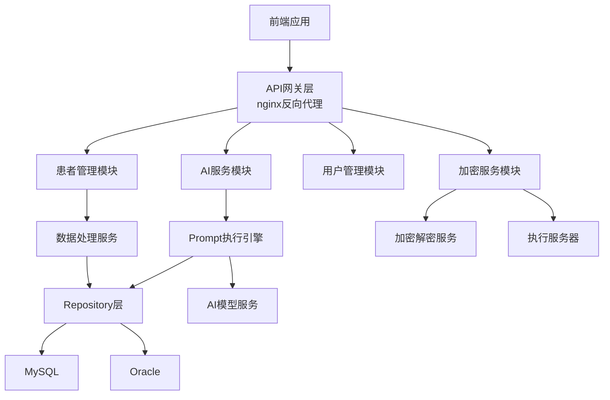

**图表来源**
- file://med_ai_assistant_1.0_bs_backend/doc/其他/ARCHITECTURE_DIAGRAMS.md#L5-L60

**章节来源**
- file://med_ai_assistant_1.0_bs_backend/doc/其他/ARCHITECTURE_DIAGRAMS.md#L3-L60

## 架构总览
系统采用"主-执行"双服务器分离架构，**新增nginx反向代理层**：
- 主服务器（端口 8081）：负责 API 网关、业务编排、调度、缓存与部分数据处理；对外暴露 REST/SSE 接口；与执行服务器通过 HTTP 通信
- 执行服务器（端口 8082）：负责与 Oracle 数据库交互、AI 模型调用、敏感数据的加解密与处理；独立容器化部署，具备轮询与回调能力
- **nginx反向代理**：统一前端入口，抽象后端服务IP地址，提供SSL终止、负载均衡和健康检查

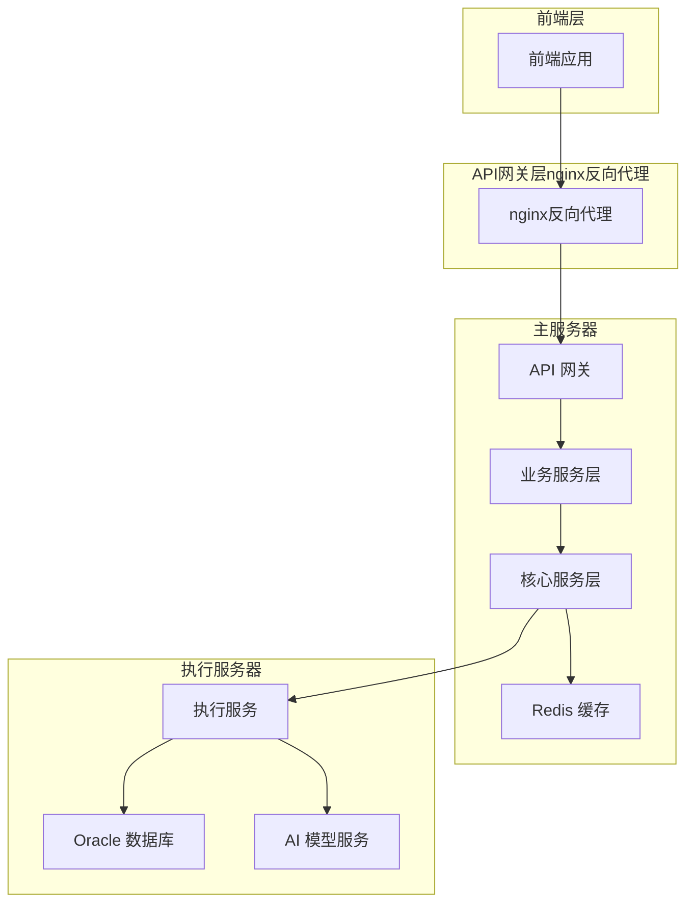

**图表来源**
- file://med_ai_assistant_1.0_bs_backend/doc/其他/ARCHITECTURE_DIAGRAMS.md#L5-L60
- file://med_ai_assistant_1.0_bs_backend/deploy/main-linux-oracle/docker-compose-main.yml#L3-L66
- file://med_ai_assistant_1.0_bs_vue/nginx.conf#L40-L50

**章节来源**
- file://med_ai_assistant_1.0_bs_backend/deploy/main-linux-oracle/README.md#L1-L396
- file://med_ai_assistant_1.0_bs_backend/deploy/execution-linux/README.md#L1-L138
- file://med_ai_assistant_1.0_bs_backend/deploy/main-linux-oracle/docker-compose-main.yml#L1-L108

## 详细组件分析

### 响应式编程与流式接口（Spring WebFlux）
- SSE 流式响应：后端通过服务器推送事件（SSE）实现实时流式输出，适用于需要即时显示的场景
- 异步处理：基于线程池与调度器的异步任务执行，结合连接池与超时控制，提升高并发下的吞吐与稳定性
- 参数校验与重试：对 AI 请求参数进行范围校验，并内置指数退避重试策略，保障网络波动下的可靠性

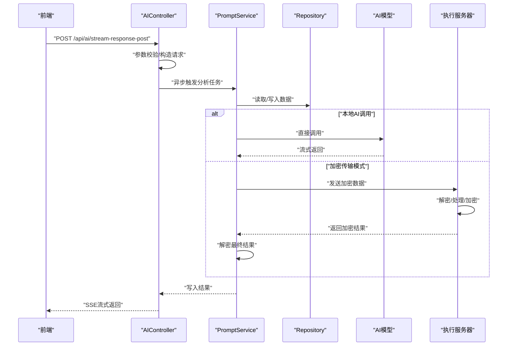

**图表来源**
- file://med_ai_assistant_1.0_bs_backend/doc/其他/ARCHITECTURE_DIAGRAMS.md#L185-L232
- file://med_ai_assistant_1.0_bs_backend/doc/其他/API_DOCUMENTATION.md#L271-L337

**章节来源**
- file://med_ai_assistant_1.0_bs_backend/doc/其他/API_DOCUMENTATION.md#L271-L337
- file://med_ai_assistant_1.0_bs_backend/deploy/main-linux-oracle/config/application.properties#L46-L74

### Prompt 执行与数据处理
- Prompt 生命周期：创建、状态流转（待处理/处理中/已完成）、结果持久化
- 数据聚合与脱敏：在主服务器聚合患者数据并进行脱敏处理，再进入执行阶段
- 轮询与调度：定时任务与自动轮询相结合，保证任务及时执行与结果回写

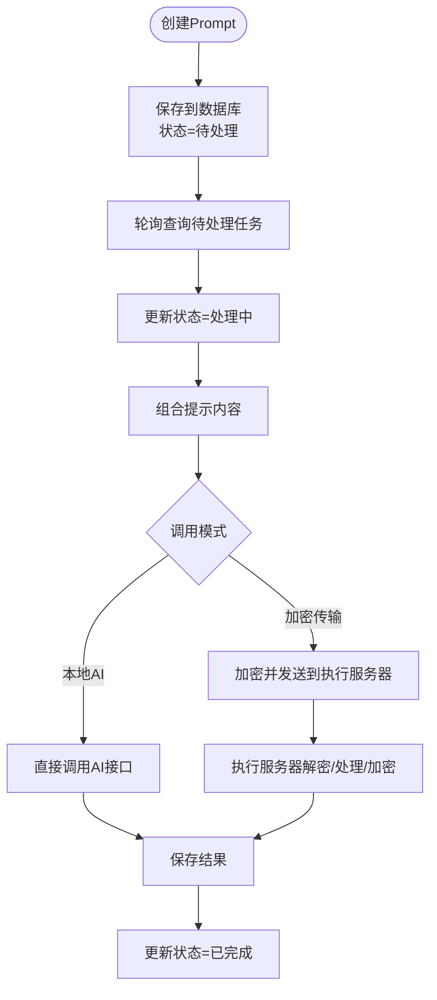

**图表来源**
- file://med_ai_assistant_1.0_bs_backend/doc/其他/ARCHITECTURE_DIAGRAMS.md#L234-L264

**章节来源**
- file://med_ai_assistant_1.0_bs_backend/doc/其他/ARCHITECTURE_DIAGRAMS.md#L205-L227

### 加密与安全传输
- AES-256-CBC 加密：采用 PBKDF2WithHmacSHA256 派生密钥，每次加密生成随机 IV，确保传输安全
- 主-执行服务器协同：主服务器负责加密与调度，执行服务器负责解密、AI 处理与结果加密，形成端到端安全链路
- 配置管理：密钥与盐值通过环境变量注入，避免硬编码

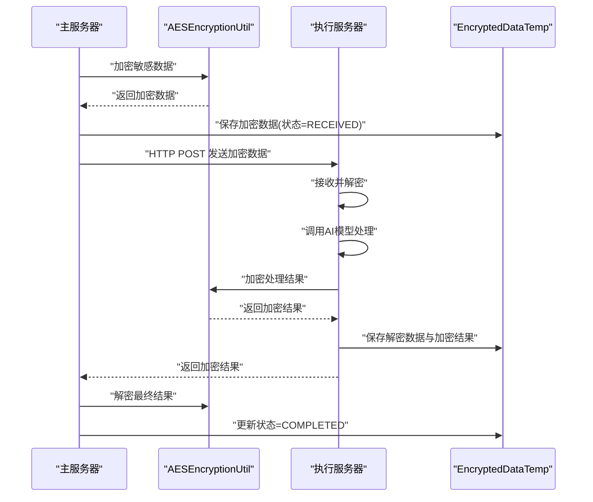

**图表来源**
- file://med_ai_assistant_1.0_bs_backend/doc/其他/ARCHITECTURE_DIAGRAMS.md#L266-L306
- file://med_ai_assistant_1.0_bs_backend/doc/其他/AES_ENCRYPTION_IMPLEMENTATION.md#L1-L222

**章节来源**
- file://med_ai_assistant_1.0_bs_backend/doc/other/AES_ENCRYPTION_IMPLEMENTATION.md#L67-L101
- file://med_ai_assistant_1.0_bs_backend/deploy/main-linux-oracle/README.md#L74-L95

### 数据库与连接池
- 主服务器：HikariCP 连接池优化（最大池大小、连接超时、泄漏检测阈值等），针对老旧硬件进行资源竞争优化
- 执行服务器：独立 Oracle 数据源配置，连接池参数偏向稳定性与容错
- 动态切换：支持在运行时通过 API 切换数据源类型（MySQL/Oracle），并进行连接测试与回退

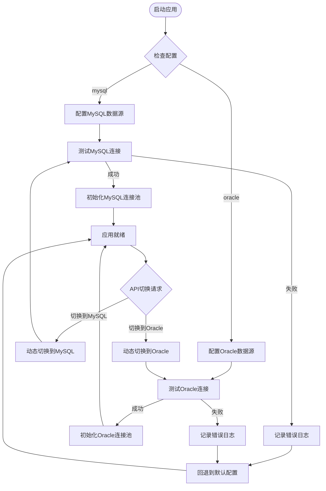

**图表来源**
- file://med_ai_assistant_1.0_bs_backend/doc/其他/ARCHITECTURE_DIAGRAMS.md#L234-L264
- file://med_ai_assistant_1.0_bs_backend/deploy/main-linux-oracle/config/application.properties#L25-L45

**章节来源**
- file://med_ai_assistant_1.0_bs_backend/deploy/main-linux-oracle/config/application.properties#L25-L45
- file://med_ai_assistant_1.0_bs_backend/deploy/execution-linux/config/execution/application-execution.properties#L48-L66

### 容器化与部署拓扑
- 主服务器：容器内暴露 8081 端口，挂载配置与日志目录，依赖 Redis 健康检查后启动
- 执行服务器：独立容器，端口 8082，独立配置 Oracle 数据源与 AI 超时
- **nginx反向代理**：独立容器，端口 80/443，统一处理前端静态资源与API代理
- 网络与资源：通过 Docker Compose 指定子网、健康检查与资源限制，确保稳定运行

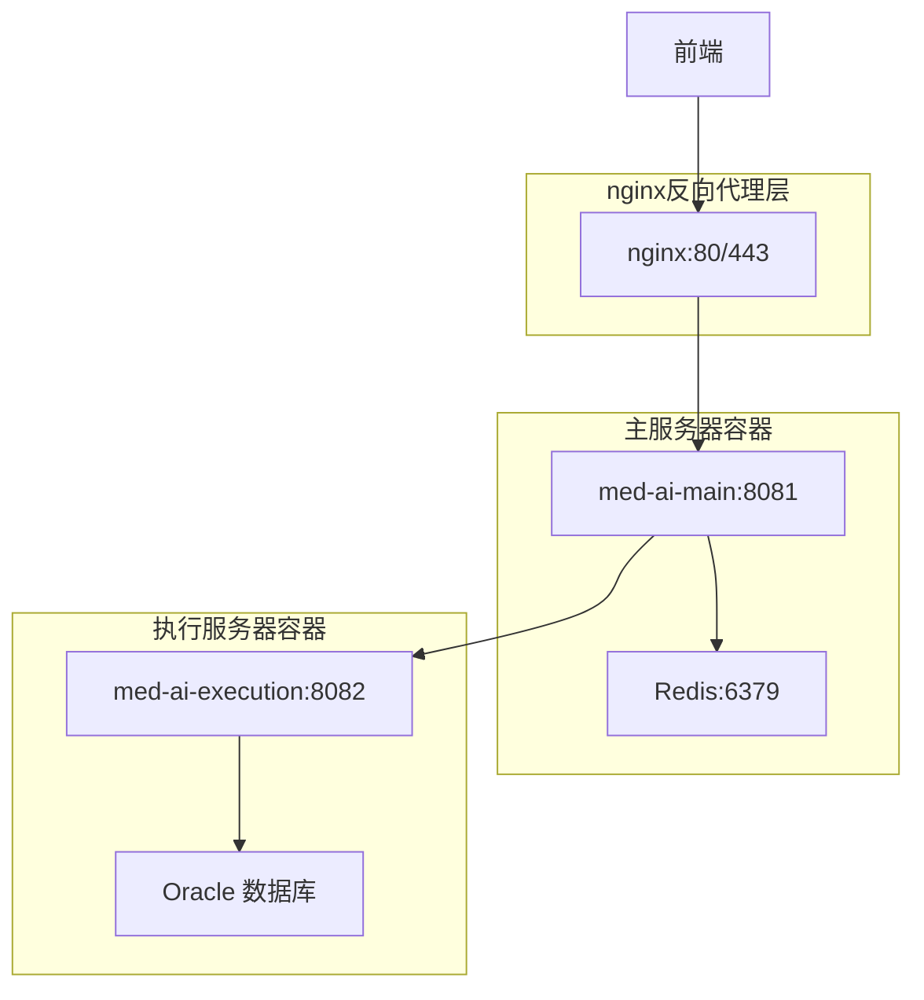

**图表来源**
- file://med_ai_assistant_1.0_bs_backend/deploy/main-linux-oracle/docker-compose-main.yml#L3-L108
- file://med_ai_assistant_1.0_bs_backend/deploy/execution-linux/README.md#L1-L138
- file://med_ai_assistant_1.0_bs_vue/docker-compose.yml#L59-L77

**章节来源**
- file://med_ai_assistant_1.0_bs_backend/deploy/main-linux-oracle/docker-compose-main.yml#L1-L108
- file://med_ai_assistant_1.0_bs_backend/deploy/main-linux-oracle/README.md#L124-L164

## 反向代理架构优化

### nginx反向代理的核心作用
**新增** nginx反向代理作为系统架构的重要组成部分，主要承担以下职责：

- **IP地址抽象**：通过服务名（如`med-ai-main-server`）而非硬编码IP地址，实现环境无关的部署
- **统一入口管理**：集中处理静态资源、API路由、CORS跨域和SSL终止
- **负载均衡与高可用**：支持多实例部署和健康检查
- **安全防护**：提供WAF功能、请求限制和访问控制

### API网关层架构
**新增** 前端通过相对路径`/api`访问后端服务，nginx统一进行反向代理：

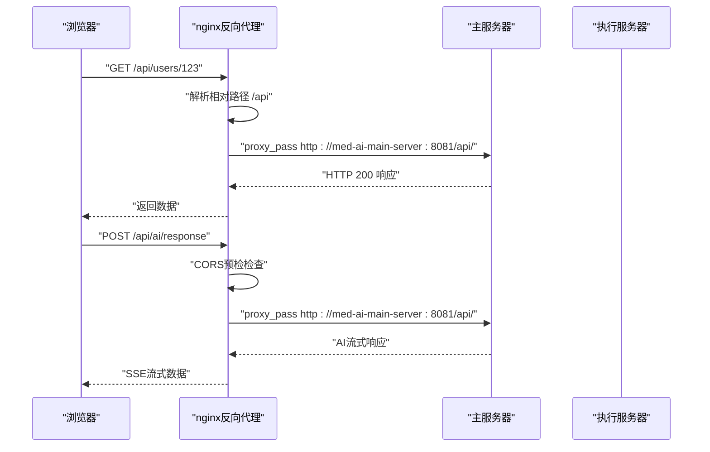

**图表来源**
- file://med_ai_assistant_1.0_bs_vue/nginx.conf#L40-L50
- file://med_ai_assistant_1.0_bs_vue/src/api/request.js#L27-L33

### 部署灵活性提升
**新增** 通过nginx反向代理实现的部署优化：

- **环境无关性**：前端配置使用相对路径`/api`，无需关心后端IP地址
- **容器网络适配**：Docker环境下使用服务名`med-ai-main-server`进行服务发现
- **多环境支持**：开发、测试、生产环境可独立配置，不影响前端代码
- **热部署友好**：后端服务IP变更时无需修改前端代码

### 前端API配置优化
**新增** 前端通过环境变量配置API基地址：

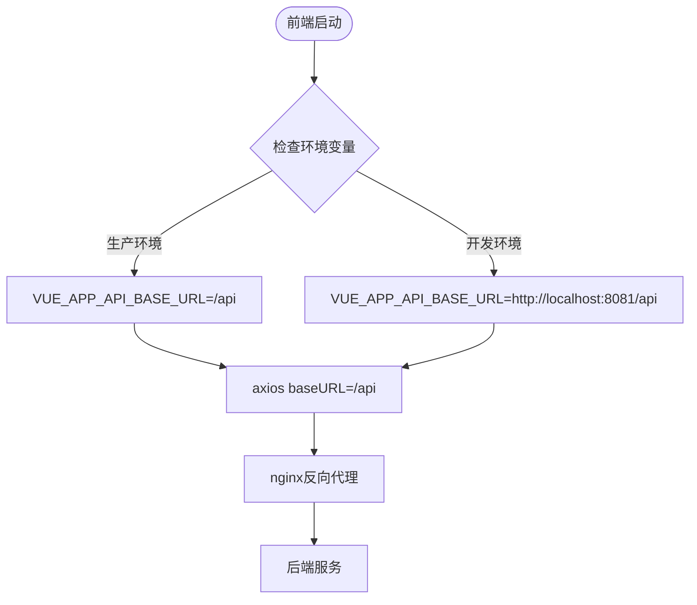

**图表来源**
- file://med_ai_assistant_1.0_bs_vue/src/api/request.js#L27-L33
- file://med_ai_assistant_1.0_bs_vue/.env.production#L7-L8

**章节来源**
- file://med_ai_assistant_1.0_bs_vue/nginx.conf#L40-L50
- file://med_ai_assistant_1.0_bs_vue/src/api/request.js#L27-L33
- file://med_ai_assistant_1.0_bs_vue/.env.production#L7-L8
- file://med_ai_assistant_1.0_bs_vue/docs/更新日志/2026-04-26.md#L24-L28

## 依赖分析
- 组件耦合：主服务器与执行服务器通过 HTTP 通信，耦合点集中在加密服务与 Prompt 执行链路
- **新增API网关层**：前端与后端通过nginx反向代理解耦，降低IP地址硬编码依赖
- 外部依赖：Redis 缓存、Oracle 数据库、AI 模型服务（DeepSeek）
- 配置依赖：主服务器通过环境变量注入执行服务器地址与密钥；执行服务器通过自身配置文件管理 Oracle 连接

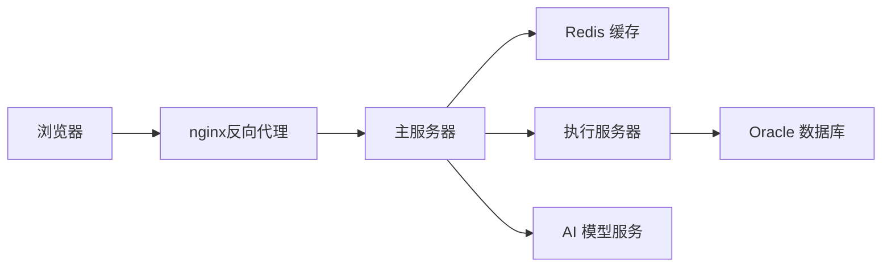

**图表来源**
- file://med_ai_assistant_1.0_bs_backend/doc/其他/ARCHITECTURE_DIAGRAMS.md#L5-L60
- file://med_ai_assistant_1.0_bs_backend/deploy/main-linux-oracle/config/application.properties#L87-L96
- file://med_ai_assistant_1.0_bs_vue/nginx.conf#L40-L50

**章节来源**
- file://med_ai_assistant_1.0_bs_backend/deploy/main-linux-oracle/config/application.properties#L87-L96
- file://med_ai_assistant_1.0_bs_backend/deploy/execution-linux/config/execution/application-execution.properties#L10-L19

## 性能考量
- 连接池优化：主服务器 HikariCP 参数针对高并发与老旧硬件进行调优，降低连接超时与泄漏风险
- 线程池与调度：专用线程池（Prompt 生成、手术分析、通用执行器）配合调度器，提升并发处理能力
- 超时与重试：AI 调用设置连接/读取超时与指数退避重试，增强网络波动下的稳定性
- **nginx性能优化**：启用gzip压缩、keepalive连接、请求缓冲区优化
- 资源限制：容器层面设置 CPU/内存上限与保留，避免资源争抢

**章节来源**
- file://med_ai_assistant_1.0_bs_backend/deploy/main-linux-oracle/config/application.properties#L25-L74
- file://med_ai_assistant_1.0_bs_backend/deploy/execution-linux/config/execution/application-execution.properties#L48-L66
- file://med_ai_assistant_1.0_bs_backend/doc/其他/API_DOCUMENTATION.md#L425-L431
- file://med_ai_assistant_1.0_bs_vue/nginx.main.conf#L23-L50

## 故障排查指南
- 容器无法启动：检查端口占用、容器日志与磁盘空间
- 健康检查失败：确认服务启动、防火墙与 SELinux 策略
- **nginx反向代理问题**：检查proxy_pass配置、服务名解析和Docker网络连接
- 连接执行服务器失败：验证网络连通性与环境变量配置
- 内存不足：调整 JVM 参数并重启服务
- Oracle 连接失败：使用 nc 检测端口连通，查看执行服务器日志
- AI 调用失败：核对 API 密钥与日志

**章节来源**
- file://med_ai_assistant_1.0_bs_backend/deploy/main-linux-oracle/README.md#L282-L346
- file://med_ai_assistant_1.0_bs_backend/deploy/execution-linux/README.md#L114-L132
- file://med_ai_assistant_1.0_bs_vue/docs/更新日志/2026-04-26.md#L24-L28

## 结论
MedAiAssistant 1.0 BS 通过"主-执行"分离架构实现了业务与计算的解耦，结合响应式编程与容器化部署，兼顾了实时性、可扩展性与安全性。**新增的nginx反向代理层进一步提升了系统的部署灵活性和环境可移植性**，通过IP地址抽象和统一入口管理，降低了环境依赖和维护成本。主服务器专注 API 编排与调度，执行服务器专注数据与 AI 处理，nginx反向代理负责流量分发与安全防护，三者协同工作，满足医疗场景对数据安全与性能的双重需求。

## 附录
- API 参考：参阅接口文档，了解 SSE 流式响应、AI 参数与重试机制
- 加密实现：参阅 AES 加密工具类文档，掌握密钥管理与安全最佳实践
- 部署参考：主/执行服务器部署指南与 Docker Compose 配置
- **新增nginx配置**：反向代理配置文件与Docker编排方案

**章节来源**
- file://med_ai_assistant_1.0_bs_backend/doc/其他/API_DOCUMENTATION.md#L1-L800
- file://med_ai_assistant_1.0_bs_backend/doc/other/AES_ENCRYPTION_IMPLEMENTATION.md#L1-L222
- file://med_ai_assistant_1.0_bs_backend/deploy/main-linux-oracle/README.md#L1-L396
- file://med_ai_assistant_1.0_bs_backend/deploy/execution-linux/README.md#L1-L138
- file://med_ai_assistant_1.0_bs_vue/nginx.conf#L1-L73
- file://med_ai_assistant_1.0_bs_vue/docker-compose.yml#L59-L77