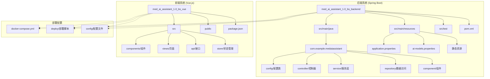
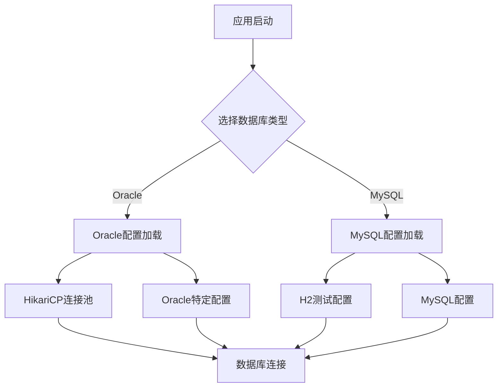
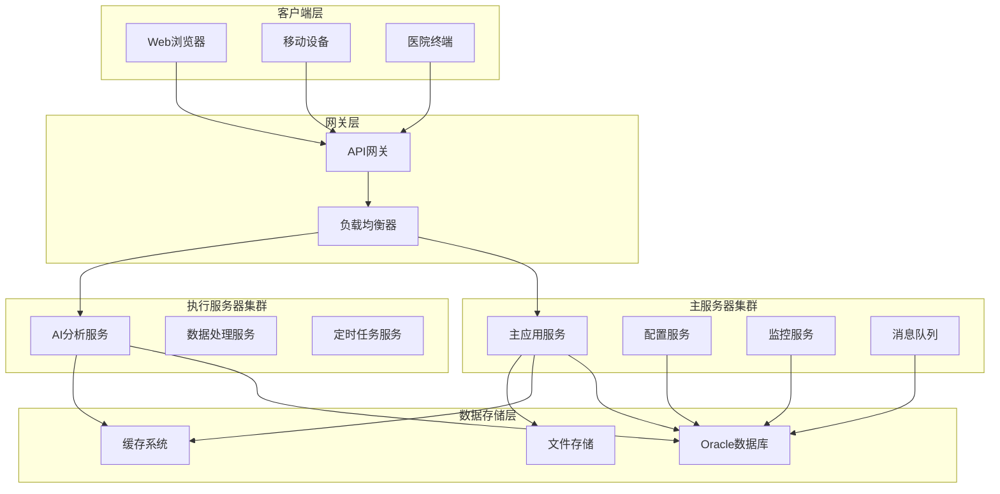
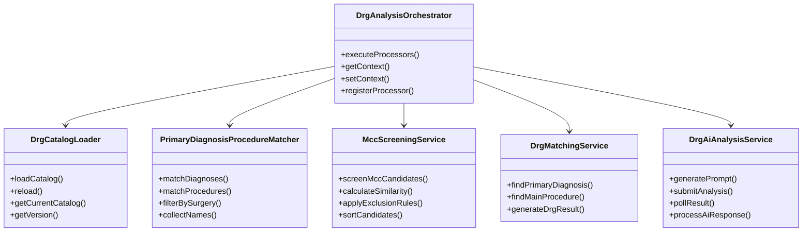
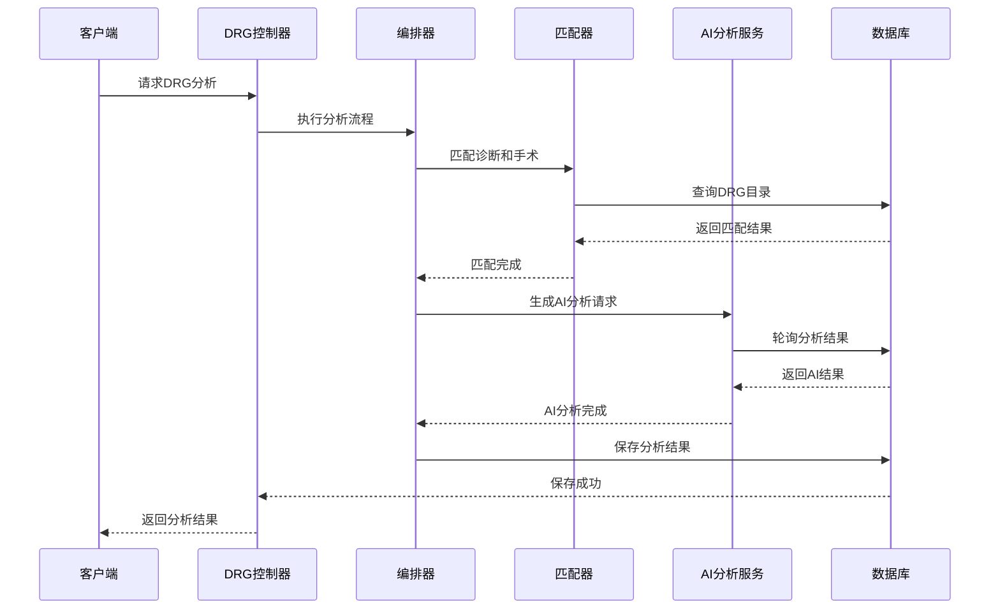
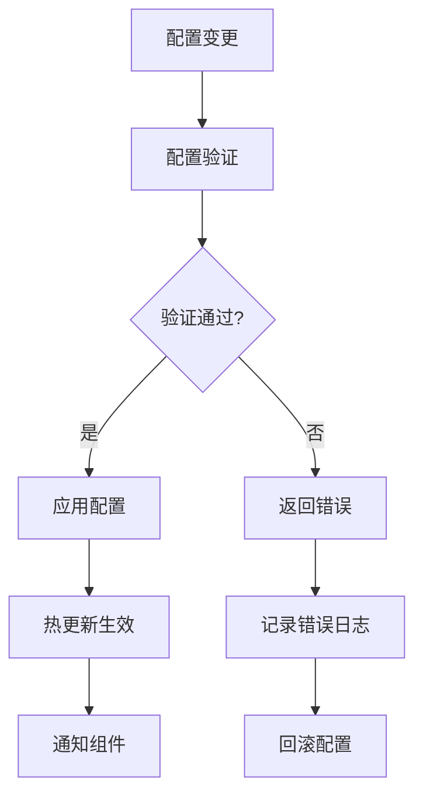
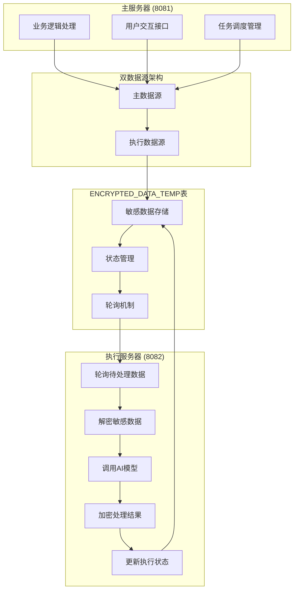
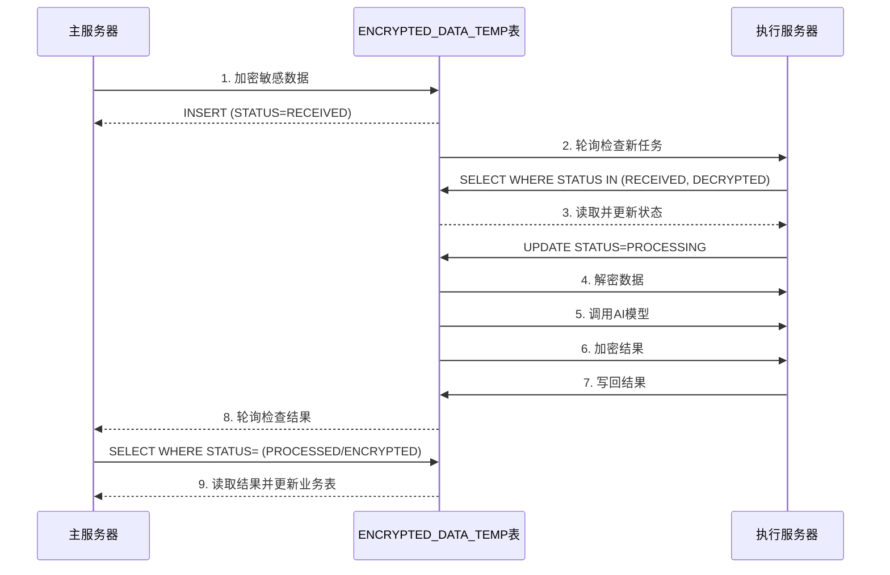
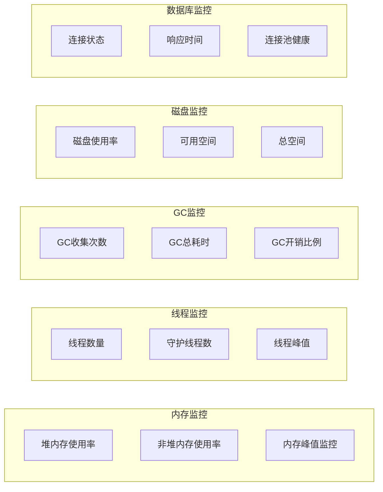
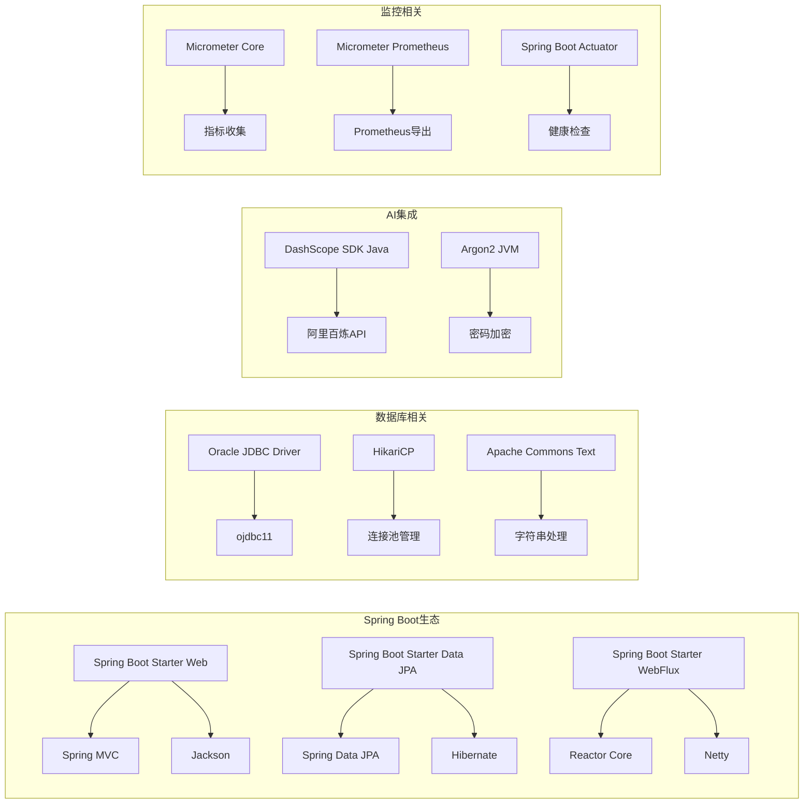

# 软件著作权源代码文档

<cite>
**本文档引用的文件**
- [MedAiAssistantBackendApplication.java](file://med_ai_assistant_1.0_bs_backend/src/main/java/com/example/medaiassistant/MedAiAssistantBackendApplication.java)
- [AIModelConfig.java](file://med_ai_assistant_1.0_bs_backend/src/main/java/com/example/medaiassistant/config/AIModelConfig.java)
- [DatabaseConfig.java](file://med_ai_assistant_1.0_bs_backend/src/main/java/com/example/medaiassistant/config/DatabaseConfig.java)
- [AuthorizationConfig.java](file://med_ai_assistant_1.0_bs_backend/src/main/java/com/example/medaiassistant/config/AuthorizationConfig.java)
- [EncryptionConfig.java](file://med_ai_assistant_1.0_bs_backend/src/main/java/com/example/medaiassistant/config/EncryptionConfig.java)
- [PromptServiceConfig.java](file://med_ai_assistant_1.0_bs_backend/src/main/java/com/example/medaiassistant/config/PromptServiceConfig.java)
- [DrgAiAnalysisService.java](file://med_ai_assistant_1.0_bs_backend/src/main/java/com/example/medaiassistant/service/DrgAiAnalysisService.java)
- [DrgMatchingService.java](file://med_ai_assistant_1.0_bs_backend/src/main/java/com/example/medaiassistant/service/DrgMatchingService.java)
- [PromptService.java](file://med_ai_assistant_1.0_bs_backend/src/main/java/com/example/medaiassistant/service/PromptService.java)
- [PromptDataConsistencyService.java](file://med_ai_assistant_1.0_bs_backend/src/main/java/com/example/medaiassistant/service/PromptDataConsistencyService.java)
- [DrgAnalysisOrchestrator.java](file://med_ai_assistant_1.0_bs_backend/src/main/java/com/example/medaiassistant/drg/orchestrator/DrgAnalysisOrchestrator.java)
- [DrgCatalogLoader.java](file://med_ai_assistant_1.0_bs_backend/src/main/java/com/example/medaiassistant/drg/catalog/DrgCatalogLoader.java)
- [AutoRecoveryEngine.java](file://med_ai_assistant_1.0_bs_backend/src/main/java/com/example/medaiassistant/service/AutoRecoveryEngine.java)
- [SystemHealthMonitoringService.java](file://med_ai_assistant_1.0_bs_backend/src/main/java/com/example/medaiassistant/service/SystemHealthMonitoringService.java)
- [source_code_documentation.md](file://项目相关/软件著作权/源代码文档.md)
- [user_manual.md](file://项目相关/软件著作权/用户操作手册.md)
- [software_copyright_requirements.md](file://项目相关/软件著作权/软件著作权申请材料要求.md)
- [execution_server_microservice_design.md](file://med_ai_assistant_1.0_bs_backend/doc/系统结构/执行服务器微服务/执行服务器微服务详细设计.md)
</cite>

## 更新摘要
**所做更改**
- 新增软件著作权申请材料要求和用户操作手册内容
- 更新系统架构图，反映主服务器与执行服务器的双数据源架构
- 增强执行服务器微服务相关文档和数据流设计
- 完善自动恢复引擎和系统健康监控服务的技术细节
- 更新DRG分析流程和MCC/CC并发症筛查功能说明

## 目录
1. [项目概述](#项目概述)
2. [软件著作权申请材料](#软件著作权申请材料)
3. [项目结构](#项目结构)
4. [核心组件](#核心组件)
5. [架构概览](#架构概览)
6. [详细组件分析](#详细组件分析)
7. [执行服务器微服务](#执行服务器微服务)
8. [自动恢复与监控系统](#自动恢复与监控系统)
9. [依赖关系分析](#依赖关系分析)
10. [性能考虑](#性能考虑)
11. [故障排除指南](#故障排除指南)
12. [结论](#结论)
13. [附录](#附录)

## 项目概述

MedAI助手1.0是一个基于Spring Boot和Vue.js的医疗AI辅助系统，旨在为医疗机构提供智能化的DRG分析、患者管理和AI辅助诊断服务。该系统采用前后端分离架构，后端使用Java Spring Boot框架，前端使用Vue.js技术栈。

### 系统特色功能

- **DRG智能分析**：基于AI的疾病诊断相关分组自动分析系统
- **多模型AI支持**：支持DeepSeek等多种AI模型集成
- **实时数据同步**：与医院信息系统(HIS)的数据同步机制
- **微服务架构**：支持主服务器和执行服务器的分布式部署
- **监控告警系统**：完善的系统监控和告警机制
- **数据安全保障**：采用AES加密和双数据源架构确保数据安全

**章节来源**
- [source_code_documentation.md:1-3093](file://项目相关/软件著作权/源代码文档.md#L1-L3093)
- [user_manual.md:86-143](file://项目相关/软件著作权/用户操作手册.md#L86-L143)

## 软件著作权申请材料

### 源代码文档要求

根据《计算机软件著作权登记申请材料详细要求》，源代码文档需要满足以下标准：

#### 提交规则
- 代码量 ≥ 3000行：提交连续前30页 + 后30页（共60页）
- 代码量 < 3000行：需全部提交，仍需满足格式要求

#### 排版规范
- 纸张：A4纸（297mm×210mm）
- 每页行数：≥ 50行（最后一页除外），空行和注释不计入
- 字号：不大于13号（建议小五号/10.5pt）
- 字体：等宽字体（推荐宋体）
- 行距：固定值12磅
- 页眉：左上角标注"软件名称+版本号"
- 页码：右上角阿拉伯数字连续标注（格式：第X页 共60页）
- 装订：单面打印，左侧预留1cm装订线

#### 内容要求
- 前30页：必须从程序起始部分开始
- 后30页：必须包含程序结束标志
- 代码内容需删除所有空行和无意义注释
- 保留版权声明和作者信息
- 框架自动生成代码占比建议不超过20%

**章节来源**
- [software_copyright_requirements.md:1-235](file://项目相关/软件著作权/软件著作权申请材料要求.md#L1-L235)

## 项目结构

项目采用标准的Maven多模块架构，包含后端Spring Boot应用和前端Vue.js应用两大核心部分。



**图表来源**
- [source_code_documentation.md:20-47](file://项目相关/软件著作权/源代码文档.md#L20-L47)
- [user_manual.md:16-31](file://项目相关/软件著作权/用户操作手册.md#L16-L31)

### 核心目录结构说明

- **后端核心目录**：
  - `src/main/java/com/example/medaiassistant/`：核心业务代码
  - `src/main/resources/`：配置文件和静态资源
  - `src/test/`：单元测试和集成测试

- **前端核心目录**：
  - `src/components/`：Vue组件
  - `src/views/`：页面视图
  - `src/api/`：API接口封装
  - `src/store/`：Vuex状态管理

**章节来源**
- [source_code_documentation.md:20-47](file://项目相关/软件著作权/源代码文档.md#L20-L47)
- [user_manual.md:16-31](file://项目相关/软件著作权/用户操作手册.md#L16-L31)

## 核心组件

### 后端核心组件

#### 应用程序入口
后端系统通过`MedAiAssistantBackendApplication`作为Spring Boot应用入口，配置了定时任务和JPA仓库扫描。

#### 配置管理系统
系统采用多层配置管理：
- `application.properties`：主配置文件，包含数据库、AI模型、调度等配置
- `ai-models.properties`：AI模型配置文件
- Profile配置：支持main和execution两种运行模式

#### 数据库配置
系统支持Oracle和MySQL双数据库配置，采用动态数据源切换机制：



**图表来源**
- [DatabaseConfig.java:250-363](file://med_ai_assistant_1.0_bs_backend/src/main/java/com/example/medaiassistant/config/DatabaseConfig.java#L250-L363)
- [source_code_documentation.md:220-363](file://项目相关/软件著作权/源代码文档.md#L220-L363)

**章节来源**
- [MedAiAssistantBackendApplication.java:43-47](file://med_ai_assistant_1.0_bs_backend/src/main/java/com/example/medaiassistant/MedAiAssistantBackendApplication.java#L43-L47)
- [DatabaseConfig.java:250-363](file://med_ai_assistant_1.0_bs_backend/src/main/java/com/example/medaiassistant/config/DatabaseConfig.java#L250-L363)

### 前端核心组件

#### Vue.js应用架构
前端采用Vue 3 + Element Plus技术栈，实现现代化的医疗管理系统界面。

#### 核心功能模块
- **患者管理**：患者信息查询、诊断管理
- **DRG分析**：智能DRG分组分析界面
- **AI交互**：与后端AI服务的交互界面
- **系统设置**：系统配置和管理功能

**章节来源**
- [source_code_documentation.md:1-10](file://项目相关/软件著作权/源代码文档.md#L1-L10)

## 架构概览

系统采用微服务架构，支持主服务器和执行服务器的分离部署。



**图表来源**
- [source_code_documentation.md:20-47](file://项目相关/软件著作权/源代码文档.md#L20-L47)
- [execution_server_microservice_design.md:16-42](file://med_ai_assistant_1.0_bs_backend/doc/系统结构/执行服务器微服务/执行服务器微服务详细设计.md#L16-L42)

### 技术栈说明

#### 后端技术栈
- **核心框架**：Spring Boot 3.5.8，Spring MVC，Spring WebFlux
- **数据库**：Spring Data JPA，HikariCP连接池
- **AI集成**：DashScope SDK Java，Apache HttpClient
- **监控**：Micrometer + Prometheus，Spring Actuator
- **安全**：Spring Security，JWT认证

#### 前端技术栈
- **核心框架**：Vue.js 3.2.13，Vue Router 4.5.1，Vuex 4.0.2
- **UI组件**：Element Plus 2.10.2
- **构建工具**：Vue CLI 5.0.0
- **网络请求**：Axios 1.10.0

**章节来源**
- [source_code_documentation.md:1-10](file://项目相关/软件著作权/源代码文档.md#L1-L10)
- [user_manual.md:184-203](file://项目相关/软件著作权/用户操作手册.md#L184-L203)

## 详细组件分析

### DRG分析模块

DRG分析模块是系统的核心功能模块，实现了完整的疾病诊断相关分组自动分析流程。

#### 核心架构设计



**图表来源**
- [source_code_documentation.md:2113-2196](file://项目相关/软件著作权/源代码文档.md#L2113-L2196)

#### 数据处理流程



**图表来源**
- [source_code_documentation.md:808-806](file://项目相关/软件著作权/源代码文档.md#L808-L806)

**章节来源**
- [source_code_documentation.md:808-806](file://项目相关/软件著作权/源代码文档.md#L808-L806)

### 配置管理系统

系统实现了多层次的配置管理机制，支持运行时配置更新和验证。

#### 配置验证流程



**图表来源**
- [source_code_documentation.md:414-432](file://项目相关/软件著作权/源代码文档.md#L414-L432)

**章节来源**
- [source_code_documentation.md:414-432](file://项目相关/软件著作权/源代码文档.md#L414-L432)

### AI模型集成

系统支持多种AI模型的集成和管理，采用统一的AI路由机制。

#### AI模型配置结构

| 配置项 | 说明 | 默认值 |
|--------|------|--------|
| ai.model.stream | 是否启用流式响应 | true |
| ai.models.deepseek-chat.url | DeepSeek Chat API地址 | https://api.deepseek.com/v1/chat/completions |
| ai.models.deepseek-chat.key | DeepSeek API密钥 | sk-12de484520aa4fa29ebfe68b3758e7d3 |
| ai.models.deepseek-chat.connectTimeout | 连接超时时间(ms) | 30000 |
| ai.models.deepseek-chat.readTimeout | 读取超时时间(ms) | 120000 |

**章节来源**
- [source_code_documentation.md:52-217](file://项目相关/软件著作权/源代码文档.md#L52-L217)

## 执行服务器微服务

### 架构定位

系统采用"主服务器 + 执行服务器"双节点分离架构，实现数据安全隔离和负载均衡。



**图表来源**
- [execution_server_microservice_design.md:16-42](file://med_ai_assistant_1.0_bs_backend/doc/系统结构/执行服务器微服务/执行服务器微服务详细设计.md#L16-L42)

### 核心业务流程

#### 主服务器与执行服务器交互流程



**图表来源**
- [execution_server_microservice_design.md:631-667](file://med_ai_assistant_1.0_bs_backend/doc/系统结构/执行服务器微服务/执行服务器微服务详细设计.md#L631-L667)

**章节来源**
- [execution_server_microservice_design.md:16-42](file://med_ai_assistant_1.0_bs_backend/doc/系统结构/执行服务器微服务/执行服务器微服务详细设计.md#L16-L42)
- [execution_server_microservice_design.md:631-667](file://med_ai_assistant_1.0_bs_backend/doc/系统结构/执行服务器微服务/执行服务器微服务详细设计.md#L631-L667)

## 自动恢复与监控系统

### 系统健康监控服务

系统内置全面的健康监控机制，实时监测系统状态并提供自动恢复功能。

#### 健康监控指标



**图表来源**
- [SystemHealthMonitoringService.java:2818-3068](file://med_ai_assistant_1.0_bs_backend/src/main/java/com/example/medaiassistant/service/SystemHealthMonitoringService.java#L2818-L3068)

#### 自动恢复引擎

系统提供智能的自动恢复机制，能够检测和恢复各种系统故障：

| 故障类型 | 恢复策略 | 重试次数 | 说明 |
|----------|----------|----------|------|
| 数据库连接失败 | 重置连接池、重启数据库连接、切换备份数据库 | 3次 | 处理数据库连接异常 |
| 内存使用过高 | 触发垃圾回收、清理缓存、重启内存密集型服务 | 3次 | 控制内存使用率 |
| 网络故障 | 重置网络连接、切换备份端点、重启网络服务 | 3次 | 恢复网络连接 |
| 线程池耗尽 | 扩展线程池、清理阻塞任务、重启线程池 | 3次 | 解决并发问题 |
| 磁盘空间不足 | 清理临时文件、压缩日志文件、归档旧数据 | 3次 | 释放磁盘空间 |

**章节来源**
- [SystemHealthMonitoringService.java:2818-3068](file://med_ai_assistant_1.0_bs_backend/src/main/java/com/example/medaiassistant/service/SystemHealthMonitoringService.java#L2818-L3068)
- [AutoRecoveryEngine.java:2317-2794](file://med_ai_assistant_1.0_bs_backend/src/main/java/com/example/medaiassistant/service/AutoRecoveryEngine.java#L2317-L2794)

## 依赖关系分析

### 核心依赖关系



**图表来源**
- [source_code_documentation.md:1-10](file://项目相关/软件著作权/源代码文档.md#L1-L10)

### 外部依赖管理

系统采用Maven仓库管理外部依赖，支持本地仓库和阿里云镜像加速。

#### 依赖配置特点

- **版本管理**：通过Spring Boot Parent统一管理版本
- **仓库配置**：支持本地仓库和远程仓库
- **插件管理**：包含测试、构建、部署相关插件
- **Profile支持**：不同环境使用不同的依赖配置

**章节来源**
- [source_code_documentation.md:1-10](file://项目相关/软件著作权/源代码文档.md#L1-L10)

## 性能考虑

### 数据库性能优化

系统针对Oracle数据库进行了专门的性能优化配置：

#### 连接池优化
- **最大连接数**：15个连接
- **最小空闲连接**：3个连接  
- **连接超时**：10秒
- **空闲超时**：240秒
- **连接生命周期**：1800秒

#### SQL性能优化
- **禁用DDL自动管理**：避免Oracle验证错误
- **禁用SQL日志输出**：减少日志开销
- **物理命名策略**：确保表名正确映射

### 并发处理优化

#### 线程池配置
系统为不同业务场景配置了专用的线程池：

| 线程池类型 | 核心线程数 | 最大线程数 | 队列容量 | 线程前缀 |
|------------|------------|------------|----------|----------|
| Prompt生成 | 5 | 8 | 100 | medai-prompt- |
| 手术分析 | 5 | 8 | 100 | medai-surgery- |
| 调度执行 | 10 | 20 | 200 | medai-scheduler- |

#### 缓存策略
- **MCC字典缓存**：内存中缓存MCC字典，支持热刷新
- **DRG目录缓存**：不可变对象设计，线程安全
- **原子引用**：确保缓存更新的一致性

**章节来源**
- [source_code_documentation.md:250-363](file://项目相关/软件著作权/源代码文档.md#L250-L363)
- [source_code_documentation.md:1176-1255](file://项目相关/软件著作权/源代码文档.md#L1176-L1255)

## 故障排除指南

### 常见问题及解决方案

#### 数据库连接问题
**问题现象**：应用启动时数据库连接失败
**解决步骤**：
1. 检查Oracle服务器配置
2. 验证网络连通性
3. 确认数据库服务状态
4. 检查连接池配置

#### AI模型调用失败
**问题现象**：AI分析请求超时或失败
**解决步骤**：
1. 检查AI模型API密钥
2. 验证网络连接
3. 查看API调用日志
4. 调整超时配置

#### DRG分析异常
**问题现象**：DRG匹配结果不准确
**解决步骤**：
1. 检查DRG目录数据
2. 验证匹配算法配置
3. 查看匹配日志
4. 更新匹配规则

### 监控告警配置

系统提供了完善的监控告警机制：

#### 系统监控阈值
- **磁盘使用率**：90.0%
- **线程数量**：500个
- **响应时间**：5000ms
- **业务吞吐量**：0（启动阶段）
- **成功率**：0%（启动阶段）

#### 告警配置
- **告警邮箱**：admin@example.com
- **抑制时间**：10分钟
- **最大活动告警**：100个

**章节来源**
- [source_code_documentation.md:2818-3068](file://项目相关/软件著作权/源代码文档.md#L2818-L3068)

## 结论

MedAI助手1.0是一个功能完整、架构清晰的医疗AI辅助系统。系统采用先进的微服务架构，支持主服务器和执行服务器的分布式部署，具备以下显著特点：

### 技术优势
- **模块化设计**：清晰的功能模块划分，便于维护和扩展
- **高性能架构**：针对Oracle数据库和AI分析场景的专门优化
- **智能化程度高**：集成多种AI模型，支持智能DRG分析
- **监控完备**：完善的监控告警机制，确保系统稳定运行
- **数据安全**：采用双数据源架构和AES加密，确保数据安全
- **自动恢复**：智能的故障检测和自动恢复机制

### 业务价值
- **提升医疗质量**：通过智能DRG分析支持医疗质量管理
- **降低成本**：实时成本监控，帮助控制医疗成本
- **提高效率**：自动化数据处理，减少人工工作量
- **决策支持**：为临床医生提供数据驱动的决策支持

该系统为医疗机构数字化转型提供了强有力的技术支撑，具有良好的推广价值和应用前景。

## 附录

### 部署配置示例

#### 开发环境配置
```properties
# 数据库配置
spring.datasource.url=jdbc:oracle:thin:@127.0.0.1:1521/FREE
spring.datasource.username=system
spring.datasource.password=Liuzh_123

# AI模型配置
ai.models.deepseek-chat.url=https://api.deepseek.com/v1/chat/completions
ai.models.deepseek-chat.key=sk-12de484520aa4fa29ebfe68b3758e7d3
```

#### 生产环境配置
```properties
# 执行服务器配置
execution.server.host=nb.nblink.cc
execution.server.api-url=http://nb.nblink.cc:8082/api

# 监控配置
monitoring.metrics.enabled=true
monitoring.alerts.enabled=true
```

### 开发指南

#### 代码规范
- **命名规范**：采用驼峰命名法
- **注释规范**：每个类和方法都需添加详细注释
- **异常处理**：统一的异常处理机制
- **日志规范**：详细的日志记录，便于问题排查

#### 测试策略
- **单元测试**：覆盖率≥80%
- **集成测试**：完整的端到端测试
- **性能测试**：压力测试和性能基准测试
- **回归测试**：持续集成中的自动化测试

### 软件著作权申请要点

#### 源代码页眉要求
- 软件名称：医疗AI辅助诊疗系统（MedAiAssistant）V1.0
- 版本号：V1.0
- 必须与申请表完全一致

#### 说明书要求
- **页数要求**：≥ 15页（3000-10000行）
- **内容结构**：软件概述、主要功能、运行环境、操作流程、界面截图
- **排版要求**：A4纸，每页≥ 30行，有图除外

#### 申请材料清单
- 源代码文档（前30页 + 后30页）
- 用户操作手册
- 软件著作权申请表
- 身份证明材料
- 权属证明文件

**章节来源**
- [software_copyright_requirements.md:1-235](file://项目相关/软件著作权/软件著作权申请材料要求.md#L1-L235)
- [user_manual.md:1-84](file://项目相关/软件著作权/用户操作手册.md#L1-L84)