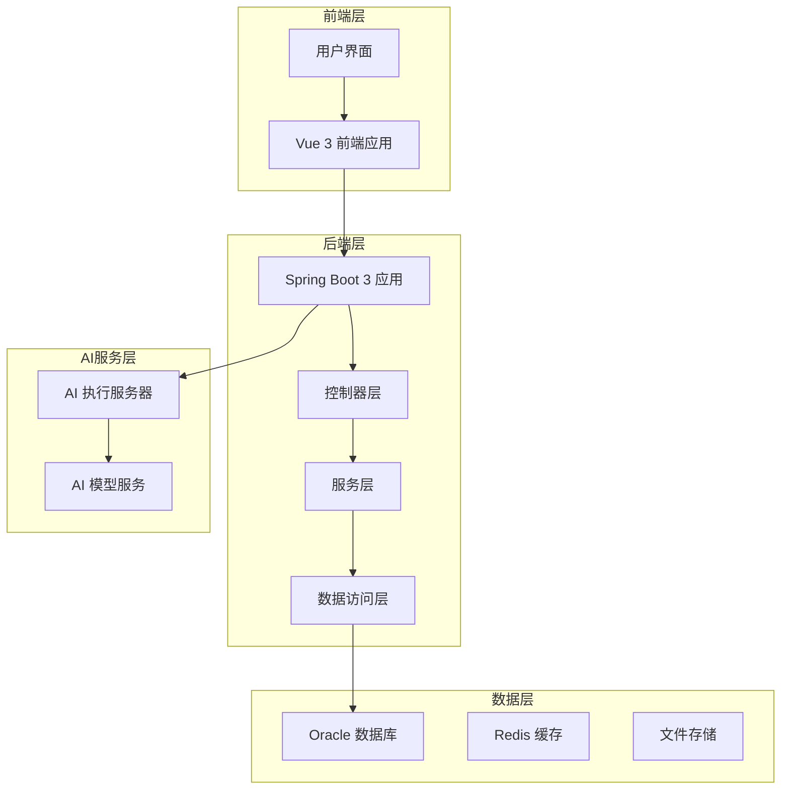

# 软件著作权用户操作手册

<cite>
**本文档引用的文件**
- [用户操作手册.md](file://项目相关/软件著作权/用户操作手册.md)
- [源代码文档.md](file://项目相关/软件著作权/源代码文档.md)
- [软件著作权申请材料要求.md](file://项目相关/软件著作权/软件著作权申请材料要求.md)
- [README.md](file://med_ai_assistant_1.0_bs_backend/doc/其他/README.md)
- [AI辅助界面操作指南.md](file://med_ai_assistant_1.0_bs_vue/public/docs/AI辅助界面操作指南.md)
- [患者管理界面操作指南.md](file://med_ai_assistant_1.0_bs_vue/public/docs/患者管理界面操作指南.md)
- [DRG分析接口.md](file://med_ai_assistant_1.0_bs_backend/doc/接口/DRG分析/DRG分析接口.md)
- [患者数据接口.md](file://med_ai_assistant_1.0_bs_backend/doc/接口/患者管理/患者数据接口.md)
- [AI服务接口.md](file://med_ai_assistant_1.0_bs_backend/doc/接口/AI服务/AI服务接口.md)
- [DRG分析模块概述.md](file://med_ai_assistant_1.0_bs_backend/doc/系统结构/DRG分析/DRG分析模块概述.md)
- [DRG分析数据流.md](file://med_ai_assistant_1.0_bs_backend/doc/系统结构/DRG分析/DRG分析数据流.md)
</cite>

## 更新摘要
**所做更改**
- 新增软件著作权申请材料要求章节，详细说明源代码文档和用户操作手册的格式规范
- 更新软件概述部分，反映新增的软件著作权相关文档要求
- 完善系统架构说明，增加软件著作权申请的技术要求
- 更新运行环境要求，增加软件著作权申请的硬件和软件环境要求
- 新增软件著作权申请流程和注意事项章节
- 完善常见问题与故障排除，增加软件著作权申请相关的常见问题

## 目录
1. [软件概述](#软件概述)
2. [软件著作权申请要求](#软件著作权申请要求)
3. [系统架构](#系统架构)
4. [运行环境](#运行环境)
5. [用户界面操作指南](#用户界面操作指南)
6. [AI辅助诊断功能](#ai辅助诊断功能)
7. [DRG分析功能](#drg分析功能)
8. [患者信息管理](#患者信息管理)
9. [系统配置与管理](#系统配置与管理)
10. [常见问题与故障排除](#常见问题与故障排除)
11. [软件著作权申请流程](#软件著作权申请流程)
12. [技术架构说明](#技术架构说明)

## 软件概述

### 软件简介

医疗AI辅助诊疗系统（MedAiAssistant）V1.0是一款集患者管理、AI辅助诊断、DRG分析、MCC筛查等功能于一体的医疗信息化平台。本系统采用先进的人工智能技术，结合临床医疗知识，为临床医生提供智能化的辅助诊疗服务，有效提升医疗工作效率和诊疗质量。

**系统架构**：本系统采用前后端分离架构，前端基于Vue 3框架开发，提供响应式用户界面；后端采用Spring Boot 3框架，提供稳定高效的业务处理能力。系统支持与医院HIS（医院信息系统）、PACS（影像归档和通信系统）、LIS（实验室信息管理系统）等医疗信息系统进行数据对接，实现医疗数据的无缝同步。

**AI能力支持**：系统集成多种主流AI大语言模型，包括DeepSeek、阿里百炼等，可根据医院实际情况灵活配置，为临床诊断提供智能化支持。

**数据安全**：系统采用企业级安全架构，支持数据加密存储、访问权限控制、操作日志审计等安全机制，确保患者隐私数据和医疗业务数据的安全性。

### 主要功能特点

本系统提供以下核心功能特点：

**1. AI辅助诊断分析**
基于大语言模型技术，系统可自动分析患者的病历信息、检验结果、检查报告等医疗数据，为临床医生提供诊断建议、鉴别诊断、治疗方案等参考信息，辅助医生做出更准确、更全面的临床决策。

**2. DRG智能分组与盈亏分析**
系统支持DRG（疾病诊断相关分组）智能匹配功能，根据患者的诊断和手术信息，自动进行DRG分组计算。同时提供盈亏分析功能，帮助医院管理者了解各病组的费用结构，优化医保结算策略。

**3. MCC/CC严重并发症智能预筛选**
系统内置MCC（严重并发症或合并症）和CC（一般并发症或合并症）筛查功能，采用ICD编码精确匹配和名称相似度算法（Levenshtein距离算法），智能识别可能影响DRG分组的并发症，提高诊断完整性。

**4. 患者全景信息管理**
系统提供患者全景信息视图，整合患者基本信息、诊断信息、病历记录、检查报告、医嘱信息、化验结果等多维度数据，支持医生快速浏览和掌握患者病情全貌。

**5. Prompt模板化管理**
系统采用Prompt模板化管理机制，支持多种诊疗场景的AI分析模板，如入院记录总结、病情小结、DRG分析等。管理员可灵活配置和修改模板内容，满足不同科室和病种的个性化需求。

**6. 医疗记录管理与病历同步**
系统支持病历记录的全生命周期管理，包括新增、编辑、查看、删除等功能。同时支持与医院EMR（电子病历系统）数据同步，确保病历信息的完整性和一致性。

**7. 待办事项智能管理**
系统可根据病历内容自动生成待办事项，帮助医生追踪患者诊疗进度。支持任务状态管理（待处理、进行中、已完成），提升工作效率。

**8. 分布式执行服务器架构**
系统采用"主服务器 + 执行服务器"双节点分离架构，主服务器负责对外服务与调度，执行服务器专注AI与重任务处理，确保系统的高可用性和负载均衡。

**9. 系统健康监控与自动恢复**
系统内置健康监控服务，实时监测AI模型连接状态、数据库连接状态、服务器资源使用情况等。支持自动故障检测和恢复机制，保障系统稳定运行。

**10. 数据安全与加密保护**
系统采用多层安全防护机制，包括用户身份认证、访问权限控制、敏感数据加密存储、操作日志审计等，全面保障患者隐私和医疗数据安全。

### 适用范围

**适用对象**：
- **临床医生**：可使用AI辅助诊断、患者信息管理、病历管理、待办事项等功能，提升日常诊疗工作效率。
- **科室管理者**：可使用DRG分析、盈亏计算、质控分析等功能，进行科室运营管理和质量控制。
- **医保管理人员**：可使用DRG分组分析功能，支持医保付费管理和费用审核工作。
- **系统管理员**：可使用系统监控、服务器维护、数据字典维护等管理功能，保障系统正常运行。

**适用机构**：
- 各级综合医院、专科医院
- 社区卫生服务中心
- 其他医疗机构

## 软件著作权申请要求

### 源代码文档要求

根据《计算机软件著作权登记申请材料详细要求》，源代码文档需满足以下标准：

**提交规则**
- 代码量 ≥ 3000行：提交连续前30页 + 后30页（共60页）
- 代码量 < 3000行：需全部提交，仍需满足格式要求

**排版规范**
- 纸张：A4纸（297mm×210mm）
- 每页行数：≥ 50行（最后一页除外），空行和注释不计入
- 字号：不大于13号（建议小五号/10.5pt）
- 字体：等宽字体（推荐宋体）
- 行距：固定值12磅
- 页眉：左上角标注"软件名称+版本号"（须与申请表完全一致）
- 页码：右上角阿拉伯数字连续标注（格式：第X页 共60页）
- 装订：单面打印，左侧预留1cm装订线

**内容要求**
- 前30页：必须从程序起始部分开始（如 main() 方法、程序入口、登录模块起始代码）
- 后30页：必须包含程序结束标志（如 return 语句、持久化代码、程序退出语句）
- 代码量：建议包含3000-6000行有效代码
- 注释：保留版权声明和作者信息
- 框架代码：自动生成代码占比建议不超过20%

### 用户操作手册要求

**页数要求**
- 源代码行数 ≤ 3000行：说明书最低页数5页以上
- 源代码行数 3000 ~ 10000行：说明书最低页数15页以上
- 源代码行数 > 10000行：说明书最低页数20页以上

**内容结构**
- 软件概述：功能介绍、开发背景
- 主要功能描述：核心功能清单
- 运行环境说明：操作系统、硬件要求、依赖环境
- 操作流程说明：用户操作步骤
- 功能界面截图：间隔2-3页至少出现一次截图，须清晰完整，配文字说明
- 常见问题解答（可选）

**排版要求**
- A4纸，每页 ≥ 30行（有图除外）
- 页眉标注软件名称和版本号，须与申请表完全一致
- 需有封面和目录（不计入页数）
- 不能有水印、大段空白
- 超过60页时提交前30页和后30页

### 申请材料清单

**必需材料**
1. 软件著作权登记申请表（一式两份）
2. 软件说明书（用户操作手册）（一式两份）
3. 源代码（前30页 + 后30页，共60页）
4. 软件著作权权属证明文件
5. 申请人身份证明材料

**身份证明材料**
- 个人申请：身份证正反面复印件 + 申请人签字（原件）
- 企业申请：营业执照副本复印件 + 加盖公司鲜章（红章）+ 企业法人或授权代表签名

## 系统架构

### 整体架构设计



**架构特点**：
- 前后端分离：采用Vue 3 + Spring Boot的现代化技术栈
- 微服务架构：支持分布式部署和弹性扩展
- AI集成：内置AI模型服务和执行服务器
- 数据安全：多层安全防护和数据加密机制

### 技术栈组成

**前端技术栈**：
- Vue 3 + Vue Router + Vuex
- Element Plus UI框架
- Axios HTTP客户端
- Webpack构建工具

**后端技术栈**：
- Spring Boot 3.5.3
- Spring MVC + Spring WebFlux
- Spring Data JPA + Hibernate
- MySQL + Oracle数据库支持
- HikariCP连接池
- Lombok简化代码

**AI集成技术**：
- 多模型AI服务支持
- 流式响应处理
- 异步任务队列
- 执行服务器分离

## 运行环境

### 硬件环境要求

**客户端硬件要求**：

| 配置项 | 最低配置 | 推荐配置 |
|--------|----------|----------|
| CPU | 双核处理器 | 四核及以上处理器 |
| 内存 | 4GB | 8GB及以上 |
| 硬盘 | 50GB可用空间 | 100GB及以上 |
| 显示器 | 1366×768分辨率 | 1920×1080或以上分辨率 |
| 网络 | 10Mbps网络连接 | 100Mbps及以上网络连接 |

**服务端硬件要求**：

| 配置项 | 最低配置 | 推荐配置 |
|--------|----------|----------|
| CPU | 4核处理器 | 8核及以上处理器 |
| 内存 | 8GB | 16-32GB |
| 硬盘 | 100GB可用空间 | 500GB SSD |
| 网络 | 100Mbps网络连接 | 1000Mbps网络连接 |

**软件著作权申请硬件要求**：
- 开发工作站：Intel i5或AMD R5以上处理器，16GB内存
- 源代码生成：支持Java 21和Node.js环境
- 文档编辑：Microsoft Office或WPS Office套件

### 软件环境要求

**客户端软件要求**：

| 软件项 | 版本要求 |
|--------|----------|
| 浏览器 | Chrome 90+、Firefox 88+、Edge 90+、Safari 14+ |
| 操作系统 | Windows 10/11、macOS 11+、主流Linux发行版 |
| 屏幕分辨率 | 1920×1080或以上（推荐） |

**服务端软件要求**：

| 软件项 | 版本要求 |
|--------|----------|
| 操作系统 | Windows Server 2019+、Linux（CentOS 7+/Ubuntu 20.04+） |
| Java运行环境 | JDK 21 |
| 数据库 | Oracle Database 19c及以上 |
| 应用中间件 | Spring Boot 3.5.x |
| 缓存服务 | Redis 6.0+（可选） |

**软件著作权申请软件要求**：
- 开发工具：IntelliJ IDEA或Eclipse + Maven
- 版本控制：Git 2.0+
- 文档工具：LaTeX或Word文档编辑器
- 源代码分析：SonarQube或类似静态分析工具

### 网络环境要求

**网络要求**：
- 系统需运行于医院内网环境，确保数据安全
- 网络带宽建议≥100Mbps，保证系统响应速度
- 需具备与医院HIS系统数据库的网络连接能力
- 如需使用AI服务，需确保与AI服务接口的网络连通性

**网络架构建议**：
系统采用B/S（浏览器/服务器）架构，支持局域网部署。前端Web服务器与后端应用服务器之间通过HTTP/HTTPS协议通信，后端应用服务器与数据库服务器之间通过JDBC协议通信。

## 用户界面操作指南

### 系统登录

**操作步骤**：
1. 打开浏览器（推荐使用Chrome浏览器），在地址栏输入系统访问地址。
2. 系统显示登录页面，页面中央显示登录表单。
3. 在"用户名"输入框中输入分配的用户名。
4. 在"密码"输入框中输入对应的登录密码。
5. 点击"登录"按钮，系统验证用户身份。
6. 验证通过后，系统自动跳转至主界面；若验证失败，系统提示错误信息。

**注意事项**：
- 用户名和密码区分大小写
- 连续多次输入错误密码可能导致账户锁定
- 首次登录后建议及时修改初始密码

### 主界面布局

登录成功后，系统显示主界面。主界面采用经典的上中下三栏布局结构：

**顶部菜单栏**：
位于界面顶部，显示系统名称和主导航菜单。菜单栏包含以下菜单项：
- **病人管理**：病人列表、刷新、筛选功能
- **AI辅助**：进入AI辅助、待办事项、病人画像功能
- **设置**：AI设置、用户信息、模板修改、字典维护、服务器维护等
- **系统**：全屏切换、小屏界面、退出登录
- **帮助**：帮助文档、意见反馈、系统更新、关于

**左侧患者列表区域**：
显示当前科室的患者列表，支持按在院状态筛选。点击患者可查看详细信息。

**右侧内容显示区域**：
显示当前选中功能的详细内容，如患者详情、AI分析界面、系统设置等。

**底部状态栏**：
显示系统状态信息，如当前用户、服务器连接状态等。

### 菜单功能说明

**病人管理菜单**：
- **病人列表**：显示当前科室的全部患者，支持点击选择查看详情
- **刷新列表**：重新从服务器加载患者列表数据
- **筛选 - 全部**：显示全部患者（包括在院和已出院）
- **筛选 - 在院**：仅显示当前在院患者
- **筛选 - 7天内出院**：显示7天内出院的患者

**AI辅助菜单**：
- **进入AI辅助**：进入AI辅助诊断主界面，选择模板进行分析
- **待办事项**：查看和管理待办任务列表
- **病人画像**：查看患者全景信息视图

**设置菜单**：
- **AI设置**：配置AI模型参数和连接信息（管理员）
- **用户信息修改**：修改当前用户的个人信息和密码
- **模板修改**：管理Prompt模板内容
- **智录DIC修改**：维护诊断编码字典（管理员）
- **手术字典维护**：维护手术编码字典信息
- **组件测试**：开发人员测试页面（管理员）
- **服务器维护**：服务器参数设置和维护（管理员）

**系统菜单**：
- **全屏**：切换浏览器全屏显示模式
- **小屏界面**：切换小屏界面模式，适配7-8英寸平板设备
- **退出登录**：退出当前登录，返回登录页面

**帮助菜单**：
- **帮助文档**：打开系统帮助文档
- **意见反馈**：提交使用反馈意见
- **系统更新**：执行系统更新操作（管理员）
- **关于**：查看系统版本信息

## AI辅助诊断功能

### 功能概述

AI辅助诊断功能基于大语言模型技术，为临床医生提供智能化的诊断辅助服务。系统通过分析患者的病历信息、检验结果、检查报告等多维度数据，自动生成诊断建议、鉴别诊断、治疗方案等参考信息。

**核心能力**：
- 病历智能分析：自动提取病历关键信息，生成结构化总结
- 诊断建议生成：基于患者信息提供可能的诊断建议
- 鉴别诊断：列出需要鉴别的疾病及鉴别要点
- 治疗方案参考：提供治疗建议和用药参考

**支持的分析模板**：
- 入院记录总结
- 病情小结
- 出院记录
- DRG诊断分析
- 手术分析
- 自定义模板

### 选择Prompt模板

**进入AI辅助界面**：
1. 点击顶部菜单"AI辅助" > "进入AI辅助"。
2. 系统跳转至AI辅助诊断主界面。

**浏览模板列表**：
AI辅助界面左侧显示Prompt模板列表，按类别分组显示。每个模板显示：
- 模板名称
- 模板类型
- 激活状态

**选择分析模板**：
1. 在模板列表中浏览可用的模板。
2. 点击选择适合当前分析需求的模板。
3. 系统自动加载模板内容，并在右侧显示模板详情。

### 生成AI分析

**准备患者数据**：
选择模板后，系统自动准备当前选中患者的医疗数据，数据包括：
- 患者一般信息（姓名、性别、年龄等）
- 诊断信息
- 病历记录
- 医嘱信息
- 化验结果
- 检查报告

**生成分析请求**：
1. 确认模板和患者数据准备完毕。
2. 点击"生成Prompt"按钮，系统根据模板和数据生成AI分析请求。
3. 点击"提交分析"按钮，将请求发送至AI模型处理。

**查看处理状态**：
系统显示AI处理进度状态：
- 等待中：请求已提交，等待处理
- 处理中：AI正在分析数据
- 已完成：分析完成，可查看结果
- 失败：分析失败，显示错误信息

### 查看AI分析结果

AI处理完成后，分析结果自动显示在界面右侧。

**结果展示格式**：
AI分析结果以Markdown格式展示，结构清晰、易于阅读。典型结果包含以下部分：
- 诊断总结：对患者当前诊断的总结说明
- 临床表现：患者的主要症状和体征
- 辅助检查分析：对检验、检查结果的分析解读
- 初步诊断：AI给出的诊断建议
- 鉴别诊断：需要鉴别的疾病列表及鉴别要点
- 治疗建议：治疗方案参考建议

**结果操作功能**：
- 复制结果：将分析结果复制到剪贴板
- 导出报告：将结果导出为文档格式
- 诊断对比：打开诊断编辑面板，对比AI诊断与当前诊断

### 诊断编辑

**打开诊断编辑面板**：
1. 在AI分析结果页面，点击"诊断对比"按钮。
2. 系统弹出诊断编辑面板。

**面板布局**：
诊断编辑面板分为左右两栏：
- 左侧：显示AI分析提取的诊断列表
- 右侧：显示患者当前的诊断列表

**诊断操作**：
- 插入诊断：点击AI诊断项的"插入"按钮，将该诊断添加到患者诊断列表
- 编辑诊断：点击诊断项的"编辑"按钮，修改诊断信息
- 删除诊断：点击诊断项的"删除"按钮，移除该诊断

**保存修改**：
完成诊断编辑后，点击"保存"按钮，将修改同步到患者诊断列表。

## DRG分析功能

### 功能概述

DRG（疾病诊断相关分组）分析功能是本系统的核心功能之一，旨在帮助医院实现DRG付费管理的精细化。系统基于患者的诊断和手术信息，自动进行DRG分组匹配，预筛选MCC/CC严重并发症，并提供费用盈亏计算。

**核心能力**：
- DRG智能匹配：根据诊断和手术自动匹配DRG分组
- MCC/CC预筛选：智能识别可能影响分组的并发症
- 盈亏计算：对比保险支付标准与实际费用，计算盈亏
- 方案推荐：提供多个可选DRG方案供选择

**DRG匹配算法**：
系统采用双向匹配策略：
1. ICD编码精确匹配：优先使用ICD编码进行精确匹配
2. 名称相似度匹配：使用Levenshtein算法计算诊断名称相似度

### 触发DRG分析

**进入DRG分析**：
1. 在患者详情页面，点击"DRG分析"标签。
2. 系统显示DRG分析界面。

**开始分析**：
1. 确认患者的诊断和手术信息已同步。
2. 点击"开始分析"按钮。
3. 系统弹出确认对话框，显示即将分析的患者信息。
4. 点击"确认"开始分析。

### DRG匹配流程

系统自动执行以下分析步骤：

**步骤一：数据准备**
系统获取患者的诊断列表和手术列表，生成输入数据快照。数据包括：
- 主要诊断和次要诊断
- 主要手术和次要手术
- 相关ICD编码

**步骤二：DRG基础匹配**
系统执行DRG目录匹配：
1. 使用ICD编码在DRG目录中进行精确匹配
2. 使用诊断名称相似度算法进行模糊匹配
3. 综合评分，确定候选DRG列表

**步骤三：MCC预筛选**
系统自动执行MCC/CC预筛选：
1. 遍历患者每个诊断
2. 在MCC字典中搜索匹配条目
3. 使用ICD编码精确匹配和名称相似度计算
4. 按相似度排序返回候选列表

**步骤四：生成分析结果**
系统整合匹配结果，生成完整的DRG分析报告。

### 查看分析结果

分析完成后，页面展示多个信息卡片：

**患者医疗信息卡片**：
显示患者当前的医疗信息：
- 诊断列表：显示所有诊断，支持切换主要/次要诊断
- 手术列表：显示所有手术，支持切换主要/次要手术

**合并症历史结果卡片**：
显示历史DRG分析结果：
- 历史分析记录列表
- 支持按日期范围筛选
- 支持按结果类型筛选

**DRG费用卡片**：
显示DRG匹配的费用信息：
- DRG目录编码和名称
- 保险支付标准金额
- 实际费用统计

**严格标准推荐列表**：
显示所有可选的DRG方案表格，包括：
- DRG编码
- DRG名称
- 保险支付金额
- 预计盈亏金额
- 推荐指数

表格支持单选功能，可选择最终采用的DRG方案。

### AI增强分析

**触发AI分析**：
1. 在DRG分析结果页面，点击"主要诊断及操作分析"按钮。
2. 系统生成AI分析Prompt，发送至AI模型。
3. AI分析影响DRG分组的关键MCC及优化建议。

**AI分析内容**：
AI返回的分析内容包括：
- 主要诊断合理性评估
- 手术操作编码建议
- MCC/CC识别建议
- DRG优化方向建议

### 盈亏计算

**计算逻辑**：
系统自动获取患者实际费用数据，与DRG保险支付标准进行对比：

```
盈亏金额 = 保险支付标准金额 - 患者实际总费用
```

- 正值（盈利）：实际费用低于支付标准
- 负值（亏损）：实际费用高于支付标准

**费用明细**：
系统显示费用明细：
- 药品费用
- 检查费用
- 治疗费用
- 手术费用
- 护理费用
- 其他费用

**排序和筛选**：
推荐列表支持以下排序方式：
- 按盈亏金额排序
- 按DRG编码排序
- 按支付标准排序

### 保存分析结果

**选择DRG方案**：
1. 在推荐列表中，查看各方案的详细信息。
2. 评估各方案的可行性和合理性。
3. 单击选择最终采用的DRG方案（单选）。

**保存选择**：
1. 确认选择的DRG方案。
2. 点击"保存选择"按钮。
3. 系统将选择结果持久化到数据库。
4. 保存成功后，系统提示确认信息。

**结果查询**：
保存的分析结果可在"合并症历史结果"卡片中查看，支持按时间筛选历史记录。

## 患者信息管理

### 患者列表

**查看患者列表**：
患者列表位于主界面左侧，显示当前科室的所有患者。列表中每个患者项显示以下信息：
- 患者姓名
- 性别
- 年龄
- 住院号
- 在院状态（在院/已出院）

**搜索患者**：
在患者列表上方的搜索框中输入关键词，可快速筛选匹配的患者。支持按姓名、住院号等条件搜索。

**筛选患者**：
点击顶部菜单"病人管理" > "筛选"，可按以下条件筛选患者：
- **全部**：显示所有患者
- **在院**：仅显示当前在院患者
- **7天内出院**：显示最近7天内出院的患者

**刷新患者列表**：
点击"病人管理" > "刷新列表"，系统重新从服务器加载最新患者数据。

### 患者详情

点击患者列表中的患者项，右侧内容区域显示该患者的详细信息。患者详情通过标签页组织，便于分类查看：

**基本信息标签**：
显示患者的基本医疗信息：
- **个人信息**：姓名、性别、年龄、住院号、床号
- **住院信息**：入院时间、住院天数、科室
- **诊断列表**：显示患者的所有诊断，区分主要诊断和次要诊断
- **手术列表**：显示患者的手术信息，区分主要手术和次要手术

**病情小结标签**：
显示患者最新的病情小结内容，包括AI自动生成的小结和医生手工录入的小结。

**病历管理标签**：
显示患者的病历记录列表，按时间倒序排列。支持新增、编辑、删除病历操作。

**检查报告标签**：
显示患者的检查报告列表，如CT、MRI、超声等影像检查报告。点击可查看报告详情。

**医嘱标签**：
显示患者的医嘱信息：
- **长期医嘱**：显示长期医嘱列表
- **临时医嘱**：显示临时医嘱列表

**化验结果标签**：
显示患者的检验结果，包括：
- 检查项目名称
- 检测结果值
- 参考范围
- 异常标记（高于/低于正常值）

**DRG分析标签**：
显示患者的DRG分组分析结果，详见第六章DRG分析。

### 诊断管理

**查看诊断列表**：
在患者详情的"基本信息"标签中，诊断列表显示患者的所有诊断信息。每条诊断显示：
- 诊断名称
- ICD编码
- 诊断类型（主要诊断/次要诊断）

**添加新诊断**：
1. 在诊断列表区域，点击"添加诊断"按钮。
2. 在弹出的对话框中，输入诊断名称或ICD编码。
3. 系统自动搜索匹配的诊断字典条目。
4. 选择正确的诊断条目，选择诊断类型（主要/次要）。
5. 点击"确认"按钮保存诊断。

**编辑已有诊断**：
1. 在诊断列表中，找到需要编辑的诊断项。
2. 点击诊断项右侧的"编辑"按钮。
3. 在弹出的对话框中修改诊断信息。
4. 点击"确认"按钮保存修改。

**删除诊断**：
1. 在诊断列表中，找到需要删除的诊断项。
2. 点击诊断项右侧的"删除"按钮。
3. 在确认对话框中点击"确认"完成删除。

### 医疗数据同步

系统支持与医院HIS系统进行数据同步，确保患者信息的及时更新。

**同步EMR病历记录**：
系统定期自动从HIS系统同步患者的EMR（电子病历）记录，也可手动触发同步：
1. 在患者详情页面，点击"同步数据"按钮。
2. 选择需要同步的数据类型。
3. 点击"开始同步"，系统从HIS系统获取最新数据。

**导入检查结果**：
检查报告数据通过接口自动从PACS系统同步至本系统，无需手动操作。

**导入化验结果**：
化验检验结果通过接口自动从LIS系统同步，支持实时更新。

**同步医嘱数据**：
医嘱数据定期从HIS系统同步，包括长期医嘱和临时医嘱。

## 系统配置与管理

### 系统监控（管理员功能）

系统管理员可通过系统监控功能实时查看系统运行状态和性能指标。

**监控内容**：
- 服务器状态：CPU使用率、内存使用情况、磁盘空间
- 数据库连接：连接数、连接池状态、查询性能
- AI服务状态：模型连接状态、响应时间、错误率
- 用户活动：登录用户数、操作日志、权限使用情况

**监控界面**：
- 实时监控图表：显示各项指标的实时变化趋势
- 告警管理：查看和处理系统告警信息
- 性能分析：查看系统性能瓶颈和优化建议

### 执行服务器管理

系统采用分布式架构，支持执行服务器的集中管理和监控。

**执行服务器状态**：
- 连接状态：显示各执行服务器的连接状态
- 负载情况：显示服务器的CPU、内存、网络负载
- 任务队列：显示待处理和正在处理的任务数量

**服务器维护**：
- 服务器切换：支持在多个执行服务器间切换
- 故障转移：自动检测服务器故障并进行转移
- 容量扩展：支持动态增加或减少执行服务器

### 用户信息管理

系统管理员可对用户信息进行统一管理。

**用户管理功能**：
- 用户创建：添加新用户并分配角色权限
- 权限分配：为用户分配相应的操作权限
- 密码管理：重置用户密码和修改个人信息
- 用户状态：启用、禁用或删除用户账户

**角色权限体系**：
- 普通用户：基本的查看和操作权限
- 管理员：系统管理权限
- 查看者：只读权限

### 数据字典维护

系统提供数据字典维护功能，支持对各种编码字典进行管理。

**维护内容**：
- 诊断编码字典：ICD-10诊断编码的维护
- 手术编码字典：ICD-10手术编码的维护
- 药品字典：常用药品信息的维护
- 检查项目字典：检查项目的标准化维护

**字典管理**：
- 字典导入：支持批量导入标准编码字典
- 字典更新：定期更新和维护字典内容
- 字典查询：提供便捷的字典查询和搜索功能

## 常见问题与故障排除

### 登录问题

**问题现象**：用户无法登录系统
**可能原因**：
- 用户名或密码错误
- 账户被锁定
- 网络连接异常
- 浏览器兼容性问题

**解决方法**：
1. 确认用户名和密码输入正确
2. 检查账户状态是否正常
3. 重新启动浏览器或更换浏览器
4. 检查网络连接是否正常
5. 联系系统管理员重置密码

### AI分析问题

**问题现象**：AI分析功能异常或响应缓慢
**可能原因**：
- AI服务连接失败
- 网络带宽不足
- AI模型配置错误
- 系统资源不足

**解决方法**：
1. 检查AI服务健康状态
2. 确认网络连接正常
3. 验证AI模型配置参数
4. 重启AI服务或执行服务器
5. 联系技术支持团队

### DRG分析问题

**问题现象**：DRG分析结果不准确或无法生成
**可能原因**：
- 患者诊断信息不完整
- DRG目录版本过期
- MCC字典配置错误
- 数据库连接异常

**解决方法**：
1. 确认患者诊断和手术信息完整
2. 更新DRG目录到最新版本
3. 检查MCC字典配置
4. 重新加载DRG分析服务
5. 查看系统日志获取详细错误信息

### 数据同步问题

**问题现象**：患者数据同步失败或延迟
**可能原因**：
- HIS系统连接异常
- 数据库权限不足
- 网络中断
- 同步服务故障

**解决方法**：
1. 检查HIS系统连接状态
2. 验证数据库连接权限
3. 确认网络连接正常
4. 重启数据同步服务
5. 查看同步日志获取错误详情

### 系统性能问题

**问题现象**：系统响应缓慢或界面卡顿
**可能原因**：
- 服务器资源不足
- 数据库查询性能问题
- 前端资源加载过多
- 并发用户过多

**解决方法**：
1. 监控服务器资源使用情况
2. 优化数据库查询语句
3. 减少前端不必要的资源加载
4. 增加服务器硬件资源
5. 调整系统配置参数

### 软件著作权申请问题

**问题现象**：软件著作权申请材料不符合要求
**可能原因**：
- 源代码文档格式不规范
- 用户操作手册内容不完整
- 申请材料缺失或不齐全
- 软件名称与申请表不一致

**解决方法**：
1. 严格按照软件著作权申请材料要求准备材料
2. 确保源代码文档符合格式规范（A4纸、等宽字体、固定行距）
3. 用户操作手册需包含完整的功能描述和操作流程
4. 核对软件名称、版本号在所有申请材料中的一致性
5. 检查申请表填写的准确性，特别是开发完成日期和首次发表日期

## 软件著作权申请流程

### 申请前准备

**材料准备**：
1. 软件著作权登记申请表（一式两份）
2. 软件说明书（用户操作手册）（一式两份）
3. 源代码（前30页 + 后30页，共60页）
4. 软件著作权权属证明文件
5. 申请人身份证明材料

**自检清单**：
- 源代码前30页从程序入口/起始处开始，内容连续
- 源代码后30页包含程序结束标志，内容连续
- 源代码每页有效代码行数 ≥ 50行（空行和注释已删除）
- 源代码字号 ≤ 13号，使用等宽字体，行距固定12磅
- 源代码页眉标注软件名称+版本号，与申请表完全一致
- 源代码页码格式正确（第X页 共60页），连续编排
- 说明书页数满足最低要求（≥15页或≥20页）
- 说明书包含完整截图，每2-3页至少一张，截图清晰
- 说明书页眉软件名称+版本号与申请表完全一致
- 申请表软件全称格式正确（含品牌+功能+软件+版本号）
- 申请表功能描述字数在 500-1300字之间，与代码实现一一对应
- 开发完成日期 ≤ 首次发表日期 < 申请日期
- 身份证明材料完整（企业：营业执照+公章+签名；个人：身份证+签字）
- 所有材料软件名称、版本号三处完全一致（申请表、源代码页眉、说明书页眉）

### 申请流程

**流程步骤**：
1. 注册账号（ccopyright.com.cn）
2. 实名认证
3. 填写申请表
4. 上传鉴别材料（源代码 + 说明书，PDF 或 Word 格式）
5. 上传证明材料
6. 在线缴费
7. 提交申请
8. 形式审查（5个工作日内）
9. 实质审查（45-55个工作日）
10. 领取证书

**时间安排**：
- 普通申请：60个工作日（约3-6个月）
- 加急（30天）：30个工作日
- 加急（7天）：7个工作日

**费用参考**：
- 普通申请：290-300元
- 加急（30天）：450-600元
- 加急（7天）：需额外付费

### 注意事项

**常见驳回原因预防**：
- 代码量不足：确保每页≥50行有效代码，删除空行和注释
- 格式不规范：严格按排版规范执行，提交前逐页核查
- 连续性破坏：确保前后各30页内容完整连续
- 代码相似度高：确保核心功能代码为自主开发，不超过20%框架代码
- 名称不一致：申请表与源代码/说明书页眉名称必须完全一致
- 版本号格式错误：统一使用V+数字格式
- 日期填写错误：开发完成日期应早于首次发表日期和申请日期

**申请前检索**：
建议申请前在在线平台检索已有软件名称，确认名称唯一性后再提交申请，避免因名称重复被驳回。

## 技术架构说明

### 后端架构设计

系统采用Spring Boot 3框架构建，具有以下技术特点：

**分层架构**：
- 控制器层：处理HTTP请求和响应
- 服务层：实现业务逻辑和数据处理
- 数据访问层：封装数据库操作
- 配置层：管理应用配置和Bean定义

**数据库设计**：
- 主数据库：Oracle数据库，存储核心业务数据
- 缓存层：Redis缓存，提升系统性能
- 文件存储：存储病历文档和影像资料

**AI集成架构**：
- 模型服务：支持多种AI模型的统一接入
- 执行服务器：专门处理AI计算任务
- 异步处理：采用消息队列实现异步任务处理

### 前端架构设计

前端采用Vue 3框架构建，具有以下特点：

**组件化设计**：
- 页面组件：独立的功能页面
- 业务组件：可复用的业务功能组件
- 工具组件：通用的UI工具组件

**状态管理**：
- Vuex：集中式状态管理
- 路由管理：Vue Router路由控制
- API封装：统一的HTTP请求封装

**响应式设计**：
- 移动端适配：支持手机和平板设备
- 主题切换：支持明暗主题切换
- 国际化：支持多语言界面

### 安全架构设计

系统采用多层安全防护机制：

**身份认证**：
- JWT令牌：基于JSON Web Token的身份认证
- 会话管理：安全的会话状态管理
- 权限控制：基于角色的细粒度权限控制

**数据安全**：
- 传输加密：HTTPS协议确保数据传输安全
- 存储加密：敏感数据加密存储
- 访问审计：完整的操作日志审计

**网络安全**：
- 防火墙配置：网络访问控制
- 入侵检测：实时监控和告警
- 数据脱敏：生产环境数据脱敏处理

### 性能优化策略

**数据库优化**：
- 连接池配置：HikariCP连接池优化
- 查询优化：SQL语句和索引优化
- 缓存策略：多级缓存架构设计

**前端优化**：
- 资源压缩：JavaScript和CSS压缩
- 懒加载：组件和路由的懒加载
- 图片优化：图片格式和尺寸优化

**AI性能优化**：
- 模型优化：AI模型量化和蒸馏
- 并发处理：异步任务和并发控制
- 资源管理：GPU和内存资源管理

### 监控与运维

**系统监控**：
- APM监控：应用性能监控
- 日志管理：集中式日志收集和分析
- 告警系统：多级告警和通知机制

**运维自动化**：
- CI/CD流水线：持续集成和部署
- 容器化部署：Docker和Kubernetes容器化
- 自动化测试：单元测试和集成测试自动化

**备份与恢复**：
- 数据备份：定期自动备份策略
- 灾难恢复：异地灾备和快速恢复
- 版本管理：完整的版本控制和回滚机制

### 软件著作权相关技术要求

**源代码保护**：
- 源代码文档需包含完整的程序入口点和结束标志
- 代码量需达到3000行以上，确保技术含量
- 框架自动生成代码占比不超过20%，体现自主开发

**文档完整性**：
- 用户操作手册需涵盖所有核心功能的操作流程
- 界面截图需清晰完整，每2-3页至少一张
- 功能描述需与源代码实现一一对应

**知识产权保护**：
- 确保源代码的原创性和独创性
- 避免使用第三方开源代码的直接复制
- 保留完整的版权声明和作者信息
- 提供软件开发过程的相关证明材料

**合规性要求**：
- 软件名称需具有行业特征，避免过于通用
- 版本号格式需统一使用V+数字格式
- 开发完成日期需早于首次发表日期和申请日期
- 申请材料需在规定时间内提交，避免超时