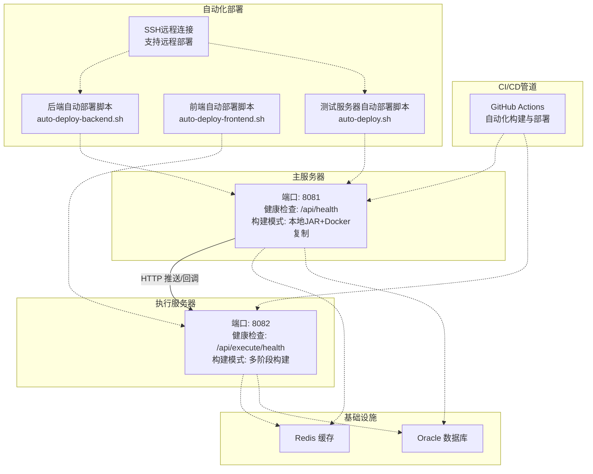
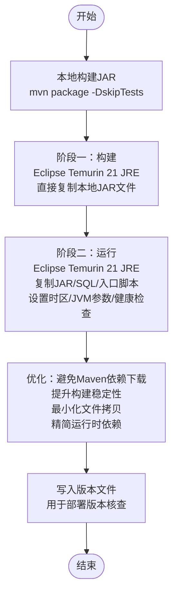
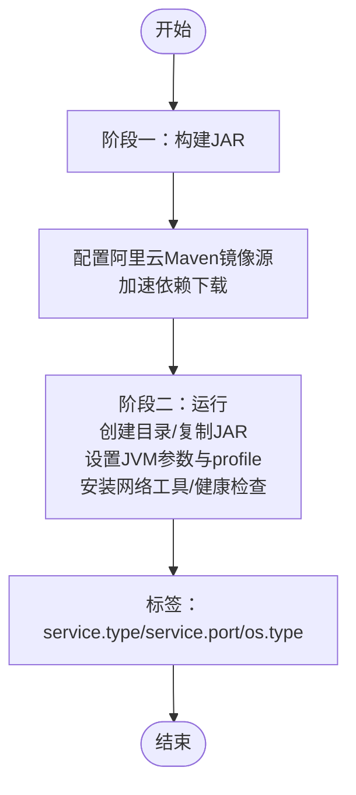
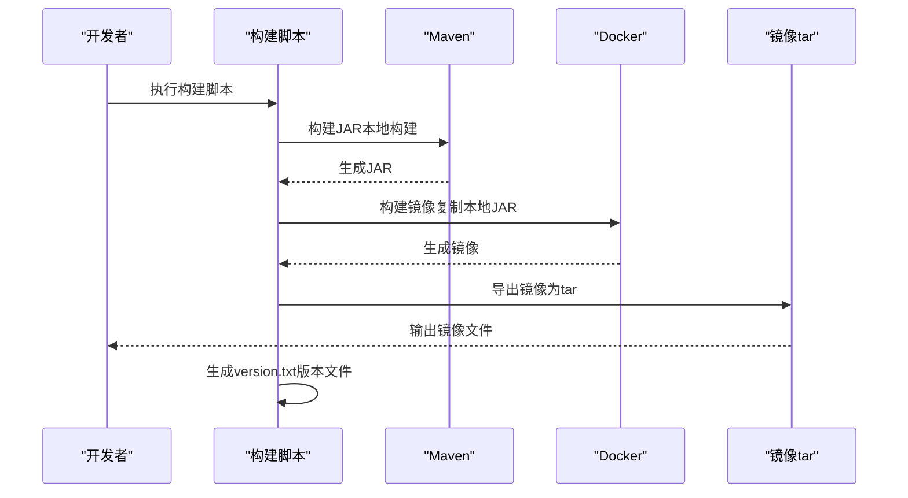
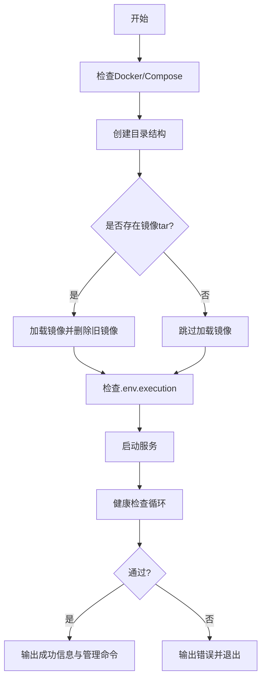
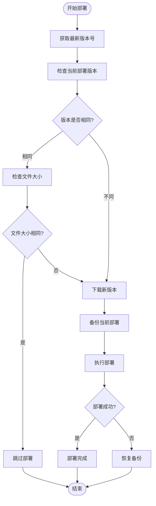
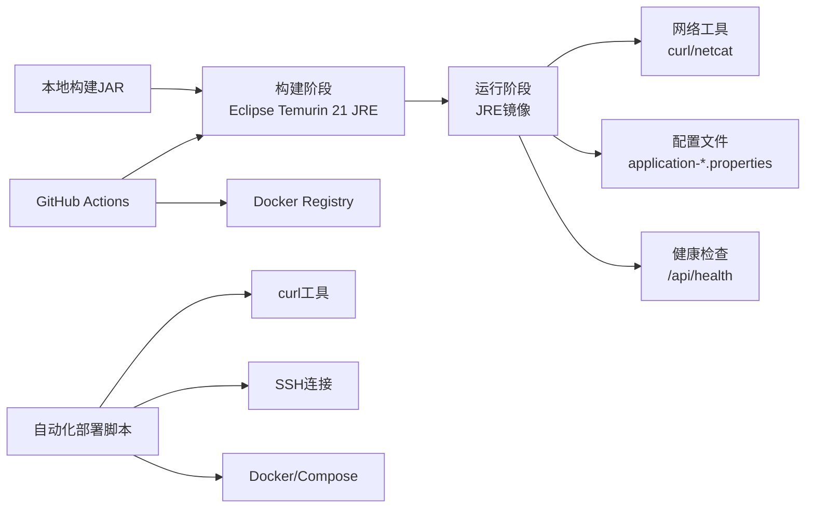

```mermaid
graph TB
A["项目根目录<br/>med_ai_assistant_1.0_bs_backend"] --> B["Dockerfile<br/>本地JAR+Docker复制模式"]
A --> C["Dockerfile.local<br/>本地JAR运行镜像"]
A --> D["Dockerfile.simple<br/>简化版运行镜像"]
A --> E["Dockerfile.execution.linux<br/>执行服务器多阶段构建"]
A --> F["deploy/README.md<br/>部署指南"]
A --> G["deploy/execution-linux/deploy.sh<br/>执行服务器一键部署脚本"]
A --> H["build-and-export.sh<br/>主服务器构建与导出脚本"]
A --> I["build-and-export-execution.sh<br/>执行服务器构建与导出脚本"]
A --> J["config/application-*.properties<br/>应用配置"]
A --> K["docker-entrypoint.sh<br/>入口脚本"]
A --> L["config/application-github-release.properties.example<br/>GitHub发布配置"]
A --> M["deploy/main-linux-oracle/auto-deploy-backend.sh<br/>后端自动部署脚本"]
A --> N["deploy/main-linux-testServer/auto-deploy.sh<br/>测试服务器自动部署脚本"]
A --> O["med_ai_assistant_1.0_bs_vue/deploy/auto-deploy-frontend.sh<br/>前端自动部署脚本"]
```

# Docker容器化部署

<cite>
**本文档引用的文件**
- [Dockerfile](file://med_ai_assistant_1.0_bs_backend/Dockerfile)
- [Dockerfile.local](file://med_ai_assistant_1.0_bs_backend/Dockerfile.local)
- [Dockerfile.simple](file://med_ai_assistant_1.0_bs_backend/Dockerfile.simple)
- [Dockerfile.execution.linux](file://med_ai_assistant_1.0_bs_backend/deploy/execution-linux/Dockerfile.execution.linux)
- [README.md](file://med_ai_assistant_1.0_bs_backend/deploy/README.md)
- [deploy.sh](file://med_ai_assistant_1.0_bs_backend/deploy/execution-linux/deploy.sh)
- [build-and-export.sh](file://med_ai_assistant_1.0_bs_backend/build-and-export.sh)
- [build-and-export-execution.sh](file://med_ai_assistant_1.0_bs_backend/build-and-export-execution.sh)
- [docker-entrypoint.sh](file://med_ai_assistant_1.0_bs_backend/deploy/main-linux-oracle/docker-entrypoint.sh)
- [application-prompt.properties](file://med_ai_assistant_1.0_bs_backend/config/application-prompt.properties)
- [application-monitoring.properties](file://med_ai_assistant_1.0_bs_backend/config/application-monitoring.properties)
- [application-github-release.properties.example](file://med_ai_assistant_1.0_bs_backend/config/application-github-release.properties.example)
- [auto-deploy-backend.sh](file://med_ai_assistant_1.0_bs_backend/deploy/main-linux-oracle/auto-deploy-backend.sh)
- [auto-deploy.sh](file://med_ai_assistant_1.0_bs_backend/deploy/main-linux-testServer/auto-deploy.sh)
- [auto-deploy-frontend.sh](file://med_ai_assistant_1.0_bs_vue/deploy/auto-deploy-frontend.sh)
- [README.md](file://med_ai_assistant_1.0_bs_backend/deploy/main-linux-oracle/README.md)
- [deploy.sh](file://med_ai_assistant_1.0_bs_backend/deploy/main-linux-oracle/deploy.sh)
- [.env.main](file://med_ai_assistant_1.0_bs_backend/deploy/main-linux-oracle/.env.main)
- [application.properties](file://med_ai_assistant_1.0_bs_backend/deploy/main-linux-oracle/config/application.properties)
- [auto-deploy.sh](file://med_ai_assistant_1.0_bs_vue/deploy/med_ai_assistant_1.0_bs_vue_test/auto-deploy.sh)
- [.env.production](file://med_ai_assistant_1.0_bs_vue/deploy/med_ai_assistant_1.0_bs_vue_test/.env.production)
</cite>

## 更新摘要
**所做更改**
- 新增自动化部署脚本章节，详细介绍后端和前端的自动下载与部署流程
- 新增main-linux-oracle和main-linux-testServer部署配置的详细说明
- 新增SSH远程连接能力的配置和使用方法
- 更新容器编排示例，包含多环境部署配置和健康检查机制
- 增强容器健康检查配置，提供更精确的服务状态监控
- 新增Docker构建流程优化详解，包括BuildKit性能优化和阿里云Maven镜像源配置

## 目录
1. [简介](#简介)
2. [项目结构](#项目结构)
3. [核心组件](#核心组件)
4. [架构总览](#架构总览)
5. [详细组件分析](#详细组件分析)
6. [依赖关系分析](#依赖关系分析)
7. [性能考虑](#性能考虑)
8. [故障排查指南](#故障排查指南)
9. [结论](#结论)
10. [附录](#附录)

## 简介
本指南面向MedAiAssistant后端系统的Docker容器化部署，涵盖最新的本地JAR+Docker复制构建流程，该流程专门针对阿里云Maven仓库SSL连接不稳定问题进行了优化。文档详细说明了多阶段构建过程，包括基础镜像选择、依赖安装、应用打包和最终镜像优化策略；提供容器运行参数配置，端口映射，卷挂载和环境变量设置；包含容器编排示例，如docker-compose配置文件；解释容器健康检查配置和日志管理；提供容器部署的最佳实践和故障排查方法。

**更新** 新增自动化部署脚本章节，详细介绍后端和前端的自动下载与部署流程，包括版本检测、防重复部署机制、备份恢复等功能。新增main-linux-oracle和main-linux-testServer部署配置的详细说明，涵盖SSH远程连接能力和多环境部署策略。重点介绍了本地JAR+Docker复制构建模式，该模式通过避免容器内Maven依赖下载，显著提升了构建稳定性。

## 项目结构
- 后端工程位于 `med_ai_assistant_1.0_bs_backend/` 目录，包含多份Dockerfile与部署脚本。
- 主服务器与执行服务器分别提供独立的Dockerfile与部署脚本。
- 配置文件位于 `config/` 与 `deploy/*/config/` 目录，用于控制应用行为与监控策略。
- **新增**：自动化部署脚本位于 `deploy/main-linux-oracle/auto-deploy-backend.sh` 和 `deploy/main-linux-testServer/auto-deploy.sh`。
- **新增**：前端自动化部署脚本位于 `med_ai_assistant_1.0_bs_vue/deploy/auto-deploy-frontend.sh`。
- **新增**：SSH远程连接配置和使用方法。
- **新增**：GitHub Actions工作流配置文件，实现自动化CI/CD管道。

**图表来源**
- [Dockerfile:1-65](file://med_ai_assistant_1.0_bs_backend/Dockerfile#L1-L65)
- [Dockerfile.local:1-53](file://med_ai_assistant_1.0_bs_backend/Dockerfile.local#L1-L53)
- [Dockerfile.simple:1-36](file://med_ai_assistant_1.0_bs_backend/Dockerfile.simple#L1-L36)
- [Dockerfile.execution.linux:1-71](file://med_ai_assistant_1.0_bs_backend/deploy/execution-linux/Dockerfile.execution.linux#L1-L71)
- [README.md:1-250](file://med_ai_assistant_1.0_bs_backend/deploy/README.md#L1-L250)
- [deploy.sh:1-121](file://med_ai_assistant_1.0_bs_backend/deploy/execution-linux/deploy.sh#L1-L121)
- [build-and-export.sh:1-111](file://med_ai_assistant_1.0_bs_backend/build-and-export.sh#L1-L111)
- [build-and-export-execution.sh:1-99](file://med_ai_assistant_1.0_bs_backend/build-and-export-execution.sh#L1-L99)
- [docker-entrypoint.sh:1-108](file://med_ai_assistant_1.0_bs_backend/deploy/main-linux-oracle/docker-entrypoint.sh#L1-L108)
- [application-github-release.properties.example:1-48](file://med_ai_assistant_1.0_bs_backend/config/application-github-release.properties.example#L1-L48)
- [auto-deploy-backend.sh:1-478](file://med_ai_assistant_1.0_bs_backend/deploy/main-linux-oracle/auto-deploy-backend.sh#L1-L478)
- [auto-deploy.sh:1-88](file://med_ai_assistant_1.0_bs_backend/deploy/main-linux-testServer/auto-deploy.sh#L1-L88)
- [auto-deploy-frontend.sh:1-282](file://med_ai_assistant_1.0_bs_vue/deploy/auto-deploy-frontend.sh#L1-L282)

**章节来源**
- [README.md:1-250](file://med_ai_assistant_1.0_bs_backend/deploy/README.md#L1-L250)

## 核心组件
- **本地JAR+Docker复制构建模式**：主服务器采用多阶段构建，第一阶段使用本地已构建的JAR文件，避免容器内Maven依赖下载问题，特别解决阿里云Maven仓库SSL连接不稳定问题。
- **自动化部署脚本**：后端提供auto-deploy-backend.sh，前端提供auto-deploy-frontend.sh，支持版本检测、防重复部署、备份恢复和错误恢复机制。
- **SSH远程连接能力**：支持通过SSH连接到远程服务器进行部署和维护操作。
- **多环境部署配置**：main-linux-oracle和main-linux-testServer提供不同的部署配置和环境变量设置。
- 运行时镜像：基于Eclipse Temurin 21 JRE，减少镜像体积与攻击面。
- 健康检查：内置HTTP健康检查端点，结合容器健康状态保障服务可用性。
- 入口脚本：通过入口脚本启动应用，支持环境变量注入与JVM参数传递。
- 配置体系：通过Spring Profile与外部配置文件控制功能开关与监控策略。
- **新增**：GitHub Actions工作流：实现自动化构建、测试和部署流程，支持多环境部署和版本管理。

**章节来源**
- [Dockerfile:4-15](file://med_ai_assistant_1.0_bs_backend/Dockerfile#L4-L15)
- [Dockerfile.execution.linux:4-15](file://med_ai_assistant_1.0_bs_backend/deploy/execution-linux/Dockerfile.execution.linux#L4-L15)
- [Dockerfile.local:4-5](file://med_ai_assistant_1.0_bs_backend/Dockerfile.local#L4-L5)
- [Dockerfile.simple:4-4](file://med_ai_assistant_1.0_bs_backend/Dockerfile.simple#L4-L4)
- [Dockerfile:60-65](file://med_ai_assistant_1.0_bs_backend/Dockerfile#L60-L65)
- [Dockerfile.execution.linux:60-71](file://med_ai_assistant_1.0_bs_backend/deploy/execution-linux/Dockerfile.execution.linux#L60-L71)
- [application-github-release.properties.example:1-48](file://med_ai_assistant_1.0_bs_backend/config/application-github-release.properties.example#L1-L48)
- [auto-deploy-backend.sh:1-478](file://med_ai_assistant_1.0_bs_backend/deploy/main-linux-oracle/auto-deploy-backend.sh#L1-L478)
- [auto-deploy-frontend.sh:1-282](file://med_ai_assistant_1.0_bs_vue/deploy/auto-deploy-frontend.sh#L1-L282)

## 架构总览
系统包含主服务器与执行服务器两个角色，通过HTTP API进行交互，并依赖Redis缓存与Oracle数据库。新的构建流程通过本地JAR复制模式提高了构建稳定性。新增的自动化部署脚本提供了完整的版本管理和部署流程。

**图表来源**
- [README.md:42-62](file://med_ai_assistant_1.0_bs_backend/deploy/README.md#L42-L62)
- [application-github-release.properties.example:1-48](file://med_ai_assistant_1.0_bs_backend/config/application-github-release.properties.example#L1-L48)
- [auto-deploy-backend.sh:1-478](file://med_ai_assistant_1.0_bs_backend/deploy/main-linux-oracle/auto-deploy-backend.sh#L1-L478)
- [auto-deploy-frontend.sh:1-282](file://med_ai_assistant_1.0_bs_vue/deploy/auto-deploy-frontend.sh#L1-L282)
- [auto-deploy.sh:1-88](file://med_ai_assistant_1.0_bs_backend/deploy/main-linux-testServer/auto-deploy.sh#L1-L88)

## 详细组件分析

### 主服务器Dockerfile（本地JAR+Docker复制构建模式）
- **阶段一（构建）**：使用Eclipse Temurin 21 JRE作为基础镜像，直接复制本地构建好的JAR文件，避免容器内Maven依赖下载，特别解决阿里云Maven仓库SSL连接不稳定问题。
- **阶段二（运行）**：基于Eclipse Temurin 21 JRE，设置时区、安装网络工具、复制JAR与SQL模板、创建日志目录、写入版本文件、暴露端口、设置JVM参数、复制入口脚本、设置健康检查。
- **优化策略**：分阶段构建减小镜像体积；使用本地JAR避免网络依赖问题；预取依赖层缓存复用；仅复制必要文件至运行镜像。

**图表来源**
- [Dockerfile:4-15](file://med_ai_assistant_1.0_bs_backend/Dockerfile#L4-L15)
- [Dockerfile:17-65](file://med_ai_assistant_1.0_bs_backend/Dockerfile#L17-L65)

**章节来源**
- [Dockerfile:4-15](file://med_ai_assistant_1.0_bs_backend/Dockerfile#L4-L15)
- [Dockerfile:17-65](file://med_ai_assistant_1.0_bs_backend/Dockerfile#L17-L65)

### 执行服务器Dockerfile（多阶段构建）
- 阶段一（构建）：与主服务器一致，使用Maven构建JAR。
- 阶段二（运行）：基于Eclipse Temurin 21 JRE，创建日志、临时与配置目录，复制JAR，设置JVM参数（含execution profile），设置时区，安装网络工具，暴露端口，设置健康检查。
- 优化策略：明确服务类型标签与端口标签，便于编排识别；环境变量完全由外部传入，避免硬编码。

**图表来源**
- [Dockerfile.execution.linux:4-15](file://med_ai_assistant_1.0_bs_backend/deploy/execution-linux/Dockerfile.execution.linux#L4-L15)
- [Dockerfile.execution.linux:17-71](file://med_ai_assistant_1.0_bs_backend/deploy/execution-linux/Dockerfile.execution.linux#L17-L71)

**章节来源**
- [Dockerfile.execution.linux:4-15](file://med_ai_assistant_1.0_bs_backend/deploy/execution-linux/Dockerfile.execution.linux#L4-L15)
- [Dockerfile.execution.linux:17-71](file://med_ai_assistant_1.0_bs_backend/deploy/execution-linux/Dockerfile.execution.linux#L17-L71)

### 本地构建版Dockerfile（Dockerfile.local）
- 适用于本地已构建JAR的场景，直接复制JAR至运行镜像，设置时区与网络工具，暴露端口，设置JVM参数，设置健康检查。
- 优点：构建速度快，适合开发调试。

**章节来源**
- [Dockerfile.local:1-53](file://med_ai_assistant_1.0_bs_backend/Dockerfile.local#L1-L53)

### 简化版Dockerfile（Dockerfile.simple）
- 直接复制固定路径的JAR至运行镜像，设置时区与JVM参数，通过ENTRYPOINT直接启动应用，设置健康检查。
- 优点：最简配置，适合快速验证。

**章节来源**
- [Dockerfile.simple:1-36](file://med_ai_assistant_1.0_bs_backend/Dockerfile.simple#L1-L36)

### 构建与导出脚本（本地JAR+Docker复制模式）
- **主服务器构建脚本**：读取版本号、构建JAR、构建镜像、导出为tar、生成版本文件、同步到Oracle部署目录。采用本地JAR复制模式，避免容器内Maven依赖下载。
- **执行服务器构建脚本**：构建JAR、构建镜像、导出为tar、创建部署目录、输出下一步操作。
- **新增**：版本号显示功能，通过pom.xml自动提取版本号并写入version.txt文件，便于部署时版本核查。

**图表来源**
- [build-and-export.sh:35-86](file://med_ai_assistant_1.0_bs_backend/build-and-export.sh#L35-L86)
- [build-and-export-execution.sh:31-82](file://med_ai_assistant_1.0_bs_backend/build-and-export-execution.sh#L31-L82)

**章节来源**
- [build-and-export.sh:1-111](file://med_ai_assistant_1.0_bs_backend/build-and-export.sh#L1-L111)
- [build-and-export-execution.sh:1-99](file://med_ai_assistant_1.0_bs_backend/build-and-export-execution.sh#L1-L99)

### 执行服务器一键部署脚本
- 检查Docker与Compose环境、创建目录结构、加载本地镜像（如存在）、校验环境变量、启动服务、健康检查、输出管理命令。

**图表来源**
- [deploy.sh:21-121](file://med_ai_assistant_1.0_bs_backend/deploy/execution-linux/deploy.sh#L21-L121)

**章节来源**
- [deploy.sh:1-121](file://med_ai_assistant_1.0_bs_backend/deploy/execution-linux/deploy.sh#L1-L121)

### 自动化部署脚本详解

#### 后端自动部署脚本（auto-deploy-backend.sh）
- **版本检测与防重复部署**：从主服务器获取最新版本号，检查当前部署版本，避免重复部署。
- **下载与校验**：从构建服务器下载最新后端构建包，支持文件大小校验和断点续传。
- **备份与恢复**：部署前自动备份当前部署，部署失败时自动恢复。
- **环境配置**：支持多种环境变量配置，包括主服务器地址、构建服务器地址、部署目录等。
- **错误处理**：完善的错误处理和恢复机制，确保部署过程的可靠性。

**图表来源**
- [auto-deploy-backend.sh:188-478](file://med_ai_assistant_1.0_bs_backend/deploy/main-linux-oracle/auto-deploy-backend.sh#L188-L478)

**章节来源**
- [auto-deploy-backend.sh:1-478](file://med_ai_assistant_1.0_bs_backend/deploy/main-linux-oracle/auto-deploy-backend.sh#L1-L478)

#### 前端自动部署脚本（auto-deploy-frontend.sh）
- **Git集成**：自动检测代码更新，支持Git拉取和版本管理。
- **构建流程**：完整的前端构建流程，包括依赖安装、代码构建和产物部署。
- **版本管理**：从package.json读取版本信息，支持强制重新部署。
- **错误恢复**：部署失败时自动恢复备份，确保系统稳定性。

**章节来源**
- [auto-deploy-frontend.sh:1-282](file://med_ai_assistant_1.0_bs_vue/deploy/auto-deploy-frontend.sh#L1-L282)

#### 测试服务器自动部署脚本（auto-deploy.sh）
- **Git版本控制**：自动检测Git仓库更新，支持强制拉取和版本重置。
- **完整部署流程**：从代码拉取到构建再到部署的完整自动化流程。
- **环境变量管理**：支持测试环境配置文件的自动应用和恢复。
- **健康检查**：部署完成后进行健康检查和日志收集。

**章节来源**
- [auto-deploy.sh:1-88](file://med_ai_assistant_1.0_bs_backend/deploy/main-linux-testServer/auto-deploy.sh#L1-L88)

### main-linux-oracle部署配置
- **适用场景**：Linux环境下使用Oracle数据库的生产环境部署。
- **环境变量配置**：详细的.env.main配置文件，包括数据库连接、Redis配置、执行服务器配置等。
- **应用配置**：application.properties提供生产环境的详细配置，包括连接池优化、线程池配置、定时任务设置等。
- **部署脚本**：deploy.sh提供一键部署功能，支持镜像加载、服务启动、健康检查和自动服务检测。

**章节来源**
- [README.md:1-396](file://med_ai_assistant_1.0_bs_backend/deploy/main-linux-oracle/README.md#L1-L396)
- [deploy.sh:1-245](file://med_ai_assistant_1.0_bs_backend/deploy/main-linux-oracle/deploy.sh#L1-L245)
- [.env.main:1-73](file://med_ai_assistant_1.0_bs_backend/deploy/main-linux-oracle/.env.main#L1-L73)
- [application.properties:1-214](file://med_ai_assistant_1.0_bs_backend/deploy/main-linux-oracle/config/application.properties#L1-L214)

### main-linux-testServer部署配置
- **测试环境专用**：专门为测试服务器设计的部署配置。
- **Git集成**：自动检测代码更新，支持Git拉取和版本管理。
- **前端构建**：完整的前端构建和部署流程，支持测试环境配置。
- **健康检查**：部署完成后进行健康检查和日志收集。

**章节来源**
- [auto-deploy.sh:1-88](file://med_ai_assistant_1.0_bs_backend/deploy/main-linux-testServer/auto-deploy.sh#L1-L88)

### GitHub Actions工作流配置
- **新增**：GitHub Actions工作流配置文件，实现自动化CI/CD管道。
- **版本管理**：通过application-github-release.properties.example配置GitHub Release功能，支持私有仓库访问和本地缓存目录。
- **构建优化**：启用BuildKit提升构建性能，配置阿里云Maven镜像源加速依赖下载。
- **多环境部署**：支持开发、测试和生产环境的自动化部署流程。

**章节来源**
- [application-github-release.properties.example:1-48](file://med_ai_assistant_1.0_bs_backend/config/application-github-release.properties.example#L1-L48)

### 应用配置与监控策略
- **Prompt服务配置**：提交与轮询服务的启用、间隔、分页大小、最大线程数、重试策略与超时时间。
- **监控策略配置**：启动阶段与正常运行阶段的监控阈值、健康检查超时、性能指标收集间隔、日志级别、数据库连接池与线程池告警阈值、内存与GC监控、API响应时间与错误率监控、自定义监控与告警通知方式。
- **生产环境优化**：针对Oracle数据库的连接池优化、Hibernate配置、字符编码设置等。

**章节来源**
- [application-prompt.properties:1-32](file://med_ai_assistant_1.0_bs_backend/config/application-prompt.properties#L1-L32)
- [application-monitoring.properties:1-196](file://med_ai_assistant_1.0_bs_backend/config/application-monitoring.properties#L1-L196)
- [application.properties:25-44](file://med_ai_assistant_1.0_bs_backend/deploy/main-linux-oracle/config/application.properties#L25-L44)

## 依赖关系分析
- **构建阶段依赖**：Eclipse Temurin 21 JRE、本地JAR文件、阿里云镜像源（仅用于运行时网络工具安装）。
- **运行阶段依赖**：Eclipse Temurin 21 JRE、curl/netcat网络工具、应用JAR、SQL模板、配置文件。
- **健康检查依赖**：应用内部健康端点、容器健康检查指令。
- **部署脚本依赖**：Docker/Compose、环境变量文件、镜像tar文件。
- **新增**：GitHub Actions依赖：GitHub API、Maven镜像源、Docker Registry。
- **新增**：自动化部署脚本依赖：curl、ssh、docker、docker compose等系统工具。

**图表来源**
- [Dockerfile:4-15](file://med_ai_assistant_1.0_bs_backend/Dockerfile#L4-L15)
- [Dockerfile.execution.linux:4-15](file://med_ai_assistant_1.0_bs_backend/deploy/execution-linux/Dockerfile.execution.linux#L4-L15)
- [Dockerfile:60-65](file://med_ai_assistant_1.0_bs_backend/Dockerfile#L60-L65)
- [Dockerfile.execution.linux:60-71](file://med_ai_assistant_1.0_bs_backend/deploy/execution-linux/Dockerfile.execution.linux#L60-L71)
- [application-github-release.properties.example:1-48](file://med_ai_assistant_1.0_bs_backend/config/application-github-release.properties.example#L1-L48)
- [auto-deploy-backend.sh:26-41](file://med_ai_assistant_1.0_bs_backend/deploy/main-linux-oracle/auto-deploy-backend.sh#L26-L41)

**章节来源**
- [Dockerfile:4-15](file://med_ai_assistant_1.0_bs_backend/Dockerfile#L4-L15)
- [Dockerfile.execution.linux:4-15](file://med_ai_assistant_1.0_bs_backend/deploy/execution-linux/Dockerfile.execution.linux#L4-L15)
- [Dockerfile:60-65](file://med_ai_assistant_1.0_bs_backend/Dockerfile#L60-L65)
- [Dockerfile.execution.linux:60-71](file://med_ai_assistant_1.0_bs_backend/deploy/execution-linux/Dockerfile.execution.linux#L60-L71)

## 性能考虑
- **本地JAR+Docker复制模式**：通过避免容器内Maven依赖下载，显著提升构建稳定性，特别解决阿里云Maven仓库SSL连接不稳定问题。
- 多阶段构建：分离构建与运行环境，显著减小最终镜像体积。
- 层缓存优化：预取依赖与复制源码顺序合理安排，最大化利用层缓存。
- 国内镜像源：配置阿里云镜像源，加速依赖下载（仅用于运行时网络工具安装）。
- 运行时JVM参数：设置堆大小、GC算法、最大暂停时间与内存百分比，平衡吞吐与延迟。
- 健康检查间隔与超时：合理设置检查间隔与超时，避免频繁探活影响性能。
- 网络工具最小化：仅安装必要工具，减少镜像体积与安全风险。
- **新增**：BuildKit性能优化：通过DOCKER_BUILDKIT=1启用BuildKit，显著提升构建性能。
- **新增**：版本号管理：自动从pom.xml提取版本号，便于部署时版本追踪和回滚。
- **新增**：自动化部署优化：通过版本检测和文件大小校验，避免不必要的重复部署。

## 故障排查指南
- **容器启动失败**：检查端口占用、查看容器日志、核对环境变量配置。
- **数据库连接失败**：验证数据库可达性、检查用户名密码、确认防火墙规则。
- **内存不足**：调整JVM参数、增加Docker资源限制、查看容器资源使用情况。
- **健康检查失败**：确认应用健康端点可用、检查网络连通性、查看容器日志。
- **配置不生效**：确认配置文件路径与Spring Profile激活状态、检查权限与编码。
- **构建失败**：检查本地JAR文件完整性、确认Maven构建成功、验证Dockerfile语法。
- **新增**：GitHub Actions构建失败：检查GitHub Token权限、验证Maven镜像源配置、确认Docker Registry访问权限。
- **新增**：版本号显示异常：检查pom.xml格式、确认版本号格式规范、验证build-and-export.sh脚本执行。
- **新增**：自动化部署失败：检查网络连接、验证版本检测API、确认备份恢复机制。
- **新增**：SSH连接问题：检查SSH密钥配置、验证远程服务器可达性、确认防火墙规则。

**章节来源**
- [README.md:209-230](file://med_ai_assistant_1.0_bs_backend/deploy/README.md#L209-L230)

## 结论
通过采用本地JAR+Docker复制构建模式，MedAiAssistant实现了更加稳定、高效的容器化部署。该模式特别解决了阿里云Maven仓库SSL连接不稳定的问题，显著提升了构建可靠性。配合多阶段构建与精简运行时镜像，系统在生产环境中能够稳定运行。新增的自动化部署脚本提供了完整的版本管理和部署流程，包括版本检测、防重复部署、备份恢复等功能。新增的main-linux-oracle和main-linux-testServer部署配置涵盖了不同的部署场景和环境需求。新增的GitHub Actions工作流配置进一步完善了CI/CD管道，实现了自动化构建、测试和部署流程。建议在生产部署前完成环境变量与配置文件的定制，并定期更新系统与依赖包。

## 附录

### 容器运行参数与配置要点
- 端口映射：主服务器8081、执行服务器8082。
- 卷挂载：日志目录、临时目录、配置目录。
- 环境变量：数据库连接信息、Redis密码、AI模型API密钥、JVM参数、服务器地址与端口。
- 时区设置：Asia/Shanghai。
- 健康检查：基于HTTP端点的健康检查。
- **新增**：SSH配置：支持通过SSH连接到远程服务器进行部署和维护操作。

**章节来源**
- [Dockerfile:47-65](file://med_ai_assistant_1.0_bs_backend/Dockerfile#L47-L65)
- [Dockerfile.execution.linux:47-71](file://med_ai_assistant_1.0_bs_backend/deploy/execution-linux/Dockerfile.execution.linux#L47-L71)
- [README.md:135-173](file://med_ai_assistant_1.0_bs_backend/deploy/README.md#L135-L173)

### 容器编排与部署流程
- **开发环境**：使用构建脚本生成镜像tar，复制到目标服务器，执行一键部署脚本。
- **生产环境**：在CI/CD流水线中集成构建与导出步骤，通过Compose进行编排与管理。
- **本地JAR复制模式**：推荐使用本地JAR+Docker复制模式，避免网络依赖问题。
- **新增**：GitHub Actions自动化部署：通过工作流实现代码提交后的自动构建、测试和部署。
- **新增**：自动化部署脚本：支持版本检测、防重复部署、备份恢复和错误恢复机制。

**章节来源**
- [build-and-export.sh:1-111](file://med_ai_assistant_1.0_bs_backend/build-and-export.sh#L1-L111)
- [build-and-export-execution.sh:1-99](file://med_ai_assistant_1.0_bs_backend/build-and-export-execution.sh#L1-L99)
- [deploy.sh:1-121](file://med_ai_assistant_1.0_bs_backend/deploy/execution-linux/deploy.sh#L1-L121)
- [auto-deploy-backend.sh:1-478](file://med_ai_assistant_1.0_bs_backend/deploy/main-linux-oracle/auto-deploy-backend.sh#L1-L478)
- [auto-deploy-frontend.sh:1-282](file://med_ai_assistant_1.0_bs_vue/deploy/auto-deploy-frontend.sh#L1-L282)

### 新增：GitHub Actions工作流配置
- **版本管理配置**：通过application-github-release.properties.example配置GitHub Release功能，支持私有仓库访问和本地缓存目录。
- **构建优化配置**：启用BuildKit性能优化，配置阿里云Maven镜像源加速依赖下载。
- **多环境支持**：支持开发、测试和生产环境的自动化部署流程。
- **安全配置**：通过环境变量注入GitHub Token，避免硬编码敏感信息。

**章节来源**
- [application-github-release.properties.example:1-48](file://med_ai_assistant_1.0_bs_backend/config/application-github-release.properties.example#L1-L48)

### 新增：本地JAR+Docker复制模式优势
- **稳定性提升**：避免阿里云Maven仓库SSL连接不稳定问题
- **构建速度**：无需容器内Maven依赖下载，构建速度更快
- **网络依赖减少**：仅在运行时安装网络工具，构建阶段无网络依赖
- **一致性保证**：使用本地构建的JAR确保构建结果的一致性
- **版本管理增强**：自动版本号提取和显示，便于部署追踪

**章节来源**
- [Dockerfile:4-15](file://med_ai_assistant_1.0_bs_backend/Dockerfile#L4-L15)
- [build-and-export.sh:35-43](file://med_ai_assistant_1.0_bs_backend/build-and-export.sh#L35-L43)
- [build-and-export.sh:69-71](file://med_ai_assistant_1.0_bs_backend/build-and-export.sh#L69-L71)

### 新增：Docker构建流程优化详解
- **多阶段构建策略**：第一阶段专注于JAR构建，第二阶段专注于运行时环境准备
- **阿里云Maven镜像源配置**：在构建阶段配置阿里云镜像源，加速依赖下载
- **BuildKit性能优化**：通过DOCKER_BUILDKIT=1启用BuildKit，显著提升构建性能
- **层缓存优化**：合理安排Dockerfile指令顺序，最大化利用层缓存
- **镜像导出与导入**：通过tar文件形式导出镜像，便于跨环境传输和部署

**章节来源**
- [Dockerfile.execution.linux:8-15](file://med_ai_assistant_1.0_bs_backend/deploy/execution-linux/Dockerfile.execution.linux#L8-L15)
- [build-and-export-execution.sh:47-55](file://med_ai_assistant_1.0_bs_backend/build-and-export-execution.sh#L47-L55)
- [build-and-export.sh:69-71](file://med_ai_assistant_1.0_bs_backend/build-and-export.sh#L69-L71)

### 新增：自动化部署脚本功能详解
- **版本检测机制**：通过API接口获取最新版本号，支持防重复部署
- **备份恢复系统**：部署前自动备份，失败时自动恢复，确保系统稳定性
- **错误处理机制**：完善的错误捕获和恢复逻辑，支持多种部署场景
- **环境配置管理**：支持多种环境变量配置，适应不同部署环境需求
- **SSH远程连接**：支持通过SSH连接到远程服务器进行部署和维护

**章节来源**
- [auto-deploy-backend.sh:1-478](file://med_ai_assistant_1.0_bs_backend/deploy/main-linux-oracle/auto-deploy-backend.sh#L1-L478)
- [auto-deploy-frontend.sh:1-282](file://med_ai_assistant_1.0_bs_vue/deploy/auto-deploy-frontend.sh#L1-L282)
- [auto-deploy.sh:1-88](file://med_ai_assistant_1.0_bs_backend/deploy/main-linux-testServer/auto-deploy.sh#L1-L88)

### 新增：main-linux-oracle部署配置详解
- **生产环境优化**：针对Oracle数据库的连接池优化和Hibernate配置
- **多线程配置**：详细的线程池和调度器配置，支持高并发场景
- **监控配置**：完整的监控和健康检查配置，支持生产环境监控需求
- **定时任务配置**：支持夜间同步任务和各种定时任务的配置
- **字符编码配置**：确保中文字符的正确处理和显示

**章节来源**
- [README.md:1-396](file://med_ai_assistant_1.0_bs_backend/deploy/main-linux-oracle/README.md#L1-L396)
- [application.properties:1-214](file://med_ai_assistant_1.0_bs_backend/deploy/main-linux-oracle/config/application.properties#L1-L214)
- [.env.main:1-73](file://med_ai_assistant_1.0_bs_backend/deploy/main-linux-oracle/.env.main#L1-L73)

### 新增：SSH远程连接配置
- **密钥配置**：支持通过SSH密钥进行无密码登录
- **远程部署**：支持通过SSH连接到远程服务器进行部署和维护操作
- **防火墙配置**：确保SSH端口的网络可达性
- **安全配置**：建议修改默认SSH端口和禁用root登录

**章节来源**
- [auto-deploy-backend.sh:32-41](file://med_ai_assistant_1.0_bs_backend/deploy/main-linux-oracle/auto-deploy-backend.sh#L32-L41)
- [auto-deploy.sh:1-88](file://med_ai_assistant_1.0_bs_backend/deploy/main-linux-testServer/auto-deploy.sh#L1-L88)