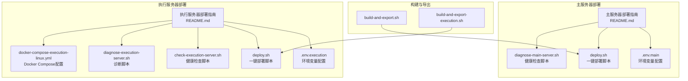
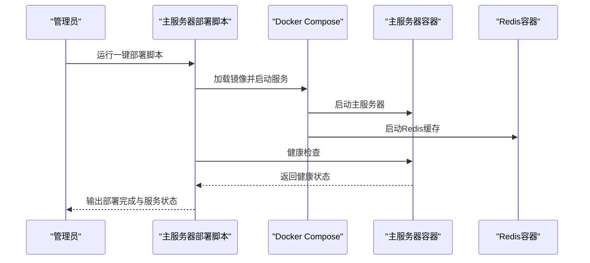
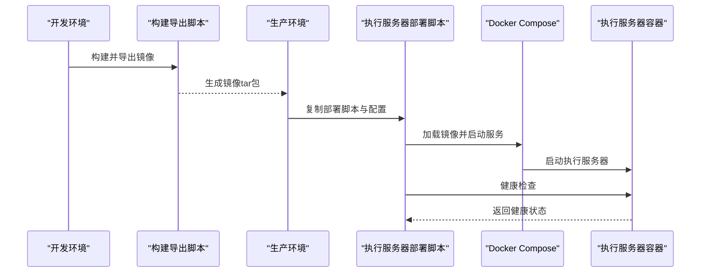
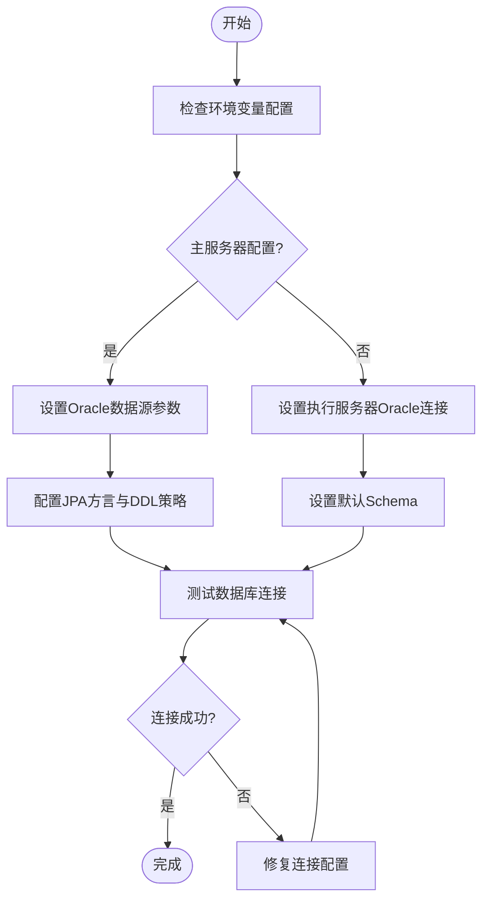
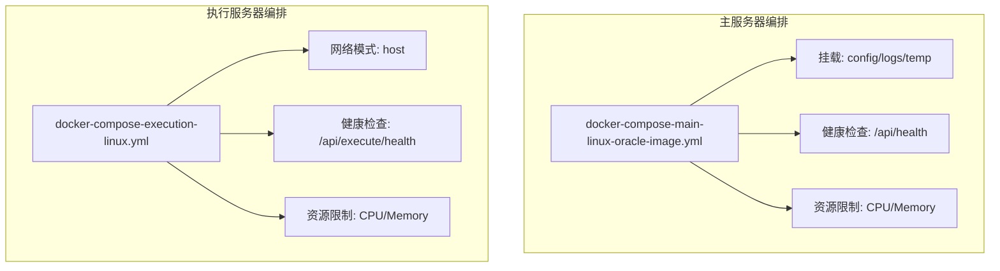
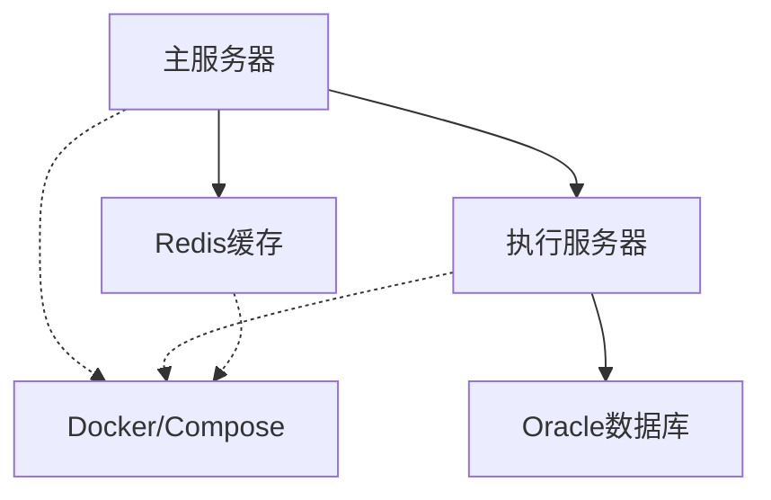
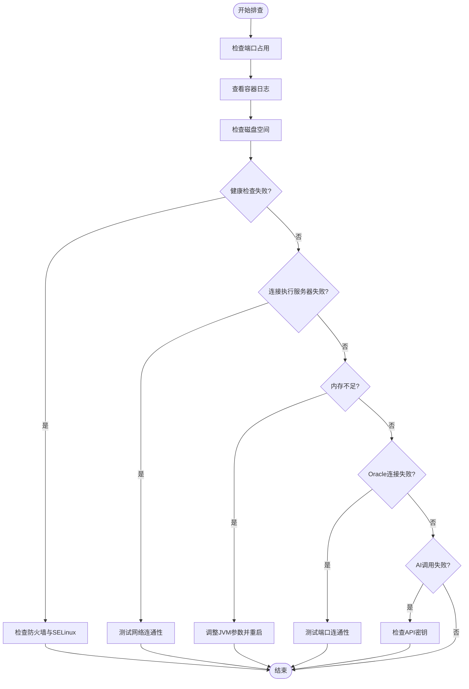

# Linux环境部署

<cite>
**本文引用的文件**
- [主服务器 Linux + Oracle 部署指南](file://med_ai_assistant_1.0_bs_backend/deploy/main-linux-oracle/README.md)
- [执行服务器 Linux 部署指南](file://med_ai_assistant_1.0_bs_backend/deploy/execution-linux/README.md)
- [主服务器环境变量配置 .env.main](file://med_ai_assistant_1.0_bs_backend/deploy/main-linux-oracle/.env.main)
- [执行服务器环境变量配置 .env.execution](file://med_ai_assistant_1.0_bs_backend/deploy/execution-linux/.env.execution)
- [执行服务器 Docker Compose 配置](file://med_ai_assistant_1.0_bs_backend/deploy/execution-linux/docker-compose-execution-linux.yml)
- [主服务器一键部署脚本 deploy.sh](file://med_ai_assistant_1.0_bs_backend/deploy/main-linux-oracle/deploy.sh)
- [执行服务器一键部署脚本 deploy.sh](file://med_ai_assistant_1.0_bs_backend/deploy/execution-linux/deploy.sh)
- [主服务器健康检查脚本](file://med_ai_assistant_1.0_bs_backend/deploy/main-linux-oracle/diagnose-main-server.sh)
- [执行服务器健康检查脚本](file://med_ai_assistant_1.0_bs_backend/deploy/execution-linux/check-execution-server.sh)
- [执行服务器诊断脚本](file://med_ai_assistant_1.0_bs_backend/deploy/execution-linux/diagnose-execution-server.sh)
- [主服务器构建导出脚本](file://med_ai_assistant_1.0_bs_backend/build-and-export.sh)
- [执行服务器构建导出脚本](file://med_ai_assistant_1.0_bs_backend/build-and-export-execution.sh)
</cite>

## 目录
1. [简介](#简介)
2. [项目结构](#项目结构)
3. [核心组件](#核心组件)
4. [架构概览](#架构概览)
5. [详细组件分析](#详细组件分析)
6. [依赖关系分析](#依赖关系分析)
7. [性能考虑](#性能考虑)
8. [故障排查指南](#故障排查指南)
9. [结论](#结论)
10. [附录](#附录)

## 简介
本指南面向Linux平台的完整部署需求，涵盖Oracle数据库集成配置、主服务器与执行服务器的部署流程、Docker Compose容器编排、防火墙与SELinux安全策略、以及性能监控与日志管理。文档基于仓库中现有的部署文档与配置文件整理而成，确保读者能够按步骤完成生产级别的部署与运维。

## 项目结构
项目采用分层与按功能划分的组织方式，主要包含以下关键目录与文件：
- 主服务器部署：包含Docker Compose编排、一键部署脚本、环境变量配置、健康检查脚本等
- 执行服务器部署：包含Docker Compose编排、一键部署脚本、环境变量配置、健康检查与诊断脚本等
- 构建导出脚本：用于在开发环境构建镜像并导出为tar包，便于在生产环境加载



**图表来源**
- [主服务器 Linux + Oracle 部署指南](file://med_ai_assistant_1.0_bs_backend/deploy/main-linux-oracle/README.md#L1-L396)
- [执行服务器 Linux 部署指南](file://med_ai_assistant_1.0_bs_backend/deploy/execution-linux/README.md#L1-L138)
- [主服务器一键部署脚本 deploy.sh](file://med_ai_assistant_1.0_bs_backend/deploy/main-linux-oracle/deploy.sh#L1-L245)
- [执行服务器 Docker Compose 配置](file://med_ai_assistant_1.0_bs_backend/deploy/execution-linux/docker-compose-execution-linux.yml#L1-L96)

**章节来源**
- [主服务器 Linux + Oracle 部署指南](file://med_ai_assistant_1.0_bs_backend/deploy/main-linux-oracle/README.md#L1-L396)
- [执行服务器 Linux 部署指南](file://med_ai_assistant_1.0_bs_backend/deploy/execution-linux/README.md#L1-L138)

## 核心组件
- 主服务器（med-ai-main）：负责业务调度、定时任务、与执行服务器通信
- 执行服务器（med-ai-execution-server）：负责具体执行、轮询、AI调用与数据库操作
- Redis（容器内）：作为缓存与消息队列支撑
- Docker Compose：统一编排主服务器与Redis，或执行服务器使用host网络模式直接暴露端口

关键配置要点：
- 主服务器通过环境变量配置Oracle数据源、Redis连接、执行服务器地址与JVM参数
- 执行服务器通过环境变量配置Oracle数据库连接、主服务器地址、AI模型密钥与轮询参数
- Docker Compose文件定义了服务、网络、健康检查、资源限制与日志驱动

**章节来源**
- [主服务器环境变量配置 .env.main](file://med_ai_assistant_1.0_bs_backend/deploy/main-linux-oracle/.env.main#L1-L73)
- [执行服务器环境变量配置 .env.execution](file://med_ai_assistant_1.0_bs_backend/deploy/execution-linux/.env.execution#L1-L57)
- [执行服务器 Docker Compose 配置](file://med_ai_assistant_1.0_bs_backend/deploy/execution-linux/docker-compose-execution-linux.yml#L1-L96)

## 架构概览
系统采用主-执行双服务器架构，主服务器负责调度与定时任务，执行服务器负责具体执行与轮询。两者通过REST API进行通信，Redis提供缓存与异步能力。

```mermaid
graph TB
subgraph "主服务器"
MAIN_APP["主应用服务<br/>端口: 8081"]
MAIN_REDIS["Redis缓存<br/>端口: 6379"]
end
subgraph "执行服务器"
EXEC_APP["执行应用服务<br/>端口: 8082"]
EXEC_DB["Oracle数据库<br/>端口: 1521"]
end
MAIN_APP <- --> EXEC_APP
MAIN_APP --> MAIN_REDIS
EXEC_APP --> EXEC_DB
```

**图表来源**
- [主服务器 Linux + Oracle 部署指南](file://med_ai_assistant_1.0_bs_backend/deploy/main-linux-oracle/README.md#L21-L26)
- [执行服务器 Linux 部署指南](file://med_ai_assistant_1.0_bs_backend/deploy/execution-linux/README.md#L20-L27)
- [执行服务器 Docker Compose 配置](file://med_ai_assistant_1.0_bs_backend/deploy/execution-linux/docker-compose-execution-linux.yml#L11-L30)

## 详细组件分析

### 主服务器部署流程
- 环境准备：安装Docker与Docker Compose，确保端口8081与6379未被占用
- 配置环境变量：修改.env.main中的Redis密码、执行服务器地址、AI模型密钥、加密参数与JVM参数
- 创建目录结构：logs/main与temp/main目录，并设置合适的权限
- 部署方式：
  - 使用一键部署脚本：赋予执行权限后运行，支持构建并启动、仅启动、停止、查看状态、查看日志等选项
  - 使用Docker Compose命令：首次部署可选择构建镜像，后续可使用镜像版compose文件启动
- 健康检查：通过curl访问主服务器健康检查端点，确认服务正常
- 日志管理：查看容器日志与应用日志文件，支持持续监控



**图表来源**
- [主服务器一键部署脚本 deploy.sh](file://med_ai_assistant_1.0_bs_backend/deploy/main-linux-oracle/deploy.sh#L35-L110)
- [主服务器 Linux + Oracle 部署指南](file://med_ai_assistant_1.0_bs_backend/deploy/main-linux-oracle/README.md#L124-L142)

**章节来源**
- [主服务器 Linux + Oracle 部署指南](file://med_ai_assistant_1.0_bs_backend/deploy/main-linux-oracle/README.md#L28-L122)
- [主服务器一键部署脚本 deploy.sh](file://med_ai_assistant_1.0_bs_backend/deploy/main-linux-oracle/deploy.sh#L1-L245)

### 执行服务器部署流程
- 环境准备：安装Docker与Docker Compose，确保端口8082未被占用
- 配置环境变量：修改.env.execution中的Oracle数据库连接、主服务器地址、AI模型密钥、轮询参数与JVM参数
- 部署方式：
  - 镜像版部署：在开发环境构建镜像并导出为tar包，复制到生产服务器后加载并启动
  - 直接构建部署：在执行服务器本地直接使用Docker Compose构建并启动
- 健康检查：通过脚本或curl访问执行服务器健康检查端点，确认服务正常
- 日志管理：查看容器日志与应用日志文件，支持持续监控



**图表来源**
- [执行服务器构建导出脚本](file://med_ai_assistant_1.0_bs_backend/build-and-export-execution.sh)
- [执行服务器一键部署脚本 deploy.sh](file://med_ai_assistant_1.0_bs_backend/deploy/execution-linux/deploy.sh)
- [执行服务器 Docker Compose 配置](file://med_ai_assistant_1.0_bs_backend/deploy/execution-linux/docker-compose-execution-linux.yml#L5-L56)

**章节来源**
- [执行服务器 Linux 部署指南](file://med_ai_assistant_1.0_bs_backend/deploy/execution-linux/README.md#L20-L55)
- [执行服务器一键部署脚本 deploy.sh](file://med_ai_assistant_1.0_bs_backend/deploy/execution-linux/deploy.sh)

### Oracle数据库集成配置
- 主服务器：通过环境变量配置Oracle数据源（URL、驱动类名、用户名、密码），并设置JPA方言与DDL策略
- 执行服务器：通过环境变量配置Oracle数据库连接（主机、端口、服务名/SID、用户名、密码），并设置默认Schema
- 连接池稳定性：执行服务器部署文档提供了连接池稳定性修复说明，建议结合实际环境进行优化



**图表来源**
- [主服务器环境变量配置 .env.main](file://med_ai_assistant_1.0_bs_backend/deploy/main-linux-oracle/.env.main#L1-L13)
- [执行服务器环境变量配置 .env.execution](file://med_ai_assistant_1.0_bs_backend/deploy/execution-linux/.env.execution#L7-L12)
- [执行服务器 Docker Compose 配置](file://med_ai_assistant_1.0_bs_backend/deploy/execution-linux/docker-compose-execution-linux.yml#L17-L22)

**章节来源**
- [主服务器环境变量配置 .env.main](file://med_ai_assistant_1.0_bs_backend/deploy/main-linux-oracle/.env.main#L1-L13)
- [执行服务器环境变量配置 .env.execution](file://med_ai_assistant_1.0_bs_backend/deploy/execution-linux/.env.execution#L7-L12)

### Docker Compose容器编排
- 主服务器：使用独立的compose文件，挂载配置、日志与临时目录，设置健康检查与资源限制
- 执行服务器：使用host网络模式，直接暴露端口8082，减少网络复杂度；同时设置健康检查与资源限制
- 日志驱动：使用json-file驱动，限制单个日志文件大小与保留数量



**图表来源**
- [执行服务器 Docker Compose 配置](file://med_ai_assistant_1.0_bs_backend/deploy/execution-linux/docker-compose-execution-linux.yml#L1-L96)

**章节来源**
- [执行服务器 Docker Compose 配置](file://med_ai_assistant_1.0_bs_backend/deploy/execution-linux/docker-compose-execution-linux.yml#L1-L96)

## 依赖关系分析
- 组件耦合：主服务器与执行服务器通过REST API耦合，主服务器依赖Redis缓存，执行服务器依赖Oracle数据库
- 外部依赖：Docker与Docker Compose、Oracle JDBC驱动、Redis服务
- 配置依赖：环境变量文件决定服务行为，Docker Compose文件决定容器编排与网络



**图表来源**
- [主服务器 Linux + Oracle 部署指南](file://med_ai_assistant_1.0_bs_backend/deploy/main-linux-oracle/README.md#L21-L26)
- [执行服务器 Linux 部署指南](file://med_ai_assistant_1.0_bs_backend/deploy/execution-linux/README.md#L20-L27)

**章节来源**
- [主服务器 Linux + Oracle 部署指南](file://med_ai_assistant_1.0_bs_backend/deploy/main-linux-oracle/README.md#L21-L26)
- [执行服务器 Linux 部署指南](file://med_ai_assistant_1.0_bs_backend/deploy/execution-linux/README.md#L20-L27)

## 性能考虑
- JVM参数：通过环境变量配置堆大小、垃圾回收算法与停顿时间目标，建议根据硬件资源与负载进行调优
- 资源限制：Docker Compose中设置了CPU与内存上限与预留，避免资源争用
- 日志轮转：使用json-file驱动并限制单文件大小与保留数量，防止磁盘空间被占满
- 连接池优化：执行服务器部署文档提供了连接池稳定性修复说明，建议结合实际环境进行优化

**章节来源**
- [主服务器环境变量配置 .env.main](file://med_ai_assistant_1.0_bs_backend/deploy/main-linux-oracle/.env.main#L21-L26)
- [执行服务器环境变量配置 .env.execution](file://med_ai_assistant_1.0_bs_backend/deploy/execution-linux/.env.execution#L43-L43)
- [执行服务器 Docker Compose 配置](file://med_ai_assistant_1.0_bs_backend/deploy/execution-linux/docker-compose-execution-linux.yml#L67-L82)

## 故障排查指南
- 容器无法启动：检查端口占用、查看容器日志、检查磁盘空间
- 健康检查失败：检查服务是否启动、检查防火墙与SELinux策略
- 连接执行服务器失败：测试网络连通性、检查环境变量配置
- 内存不足：调整JVM参数并重启服务
- Oracle连接失败：测试端口连通性、查看错误日志
- AI调用失败：检查API密钥、查看AI调用日志



**图表来源**
- [主服务器 Linux + Oracle 部署指南](file://med_ai_assistant_1.0_bs_backend/deploy/main-linux-oracle/README.md#L284-L345)
- [执行服务器 Linux 部署指南](file://med_ai_assistant_1.0_bs_backend/deploy/execution-linux/README.md#L114-L132)

**章节来源**
- [主服务器 Linux + Oracle 部署指南](file://med_ai_assistant_1.0_bs_backend/deploy/main-linux-oracle/README.md#L284-L345)
- [执行服务器 Linux 部署指南](file://med_ai_assistant_1.0_bs_backend/deploy/execution-linux/README.md#L114-L132)

## 结论
本指南基于仓库中的部署文档与配置文件，提供了Linux环境下主服务器与执行服务器的完整部署方案，涵盖了Oracle数据库集成、Docker Compose编排、防火墙与SELinux策略、性能监控与日志管理等关键环节。建议在生产环境中严格修改默认配置、启用HTTPS、定期备份与监控告警，确保系统的稳定与安全。

## 附录
- 安全建议：修改默认密码、限制网络访问、使用HTTPS、定期备份
- 监控建议：日志监控、性能监控、容器资源使用监控
- 常用命令：Docker Compose常用命令、健康检查命令、日志查看命令

**章节来源**
- [主服务器 Linux + Oracle 部署指南](file://med_ai_assistant_1.0_bs_backend/deploy/main-linux-oracle/README.md#L347-L396)
- [执行服务器 Linux 部署指南](file://med_ai_assistant_1.0_bs_backend/deploy/execution-linux/README.md#L101-L112)