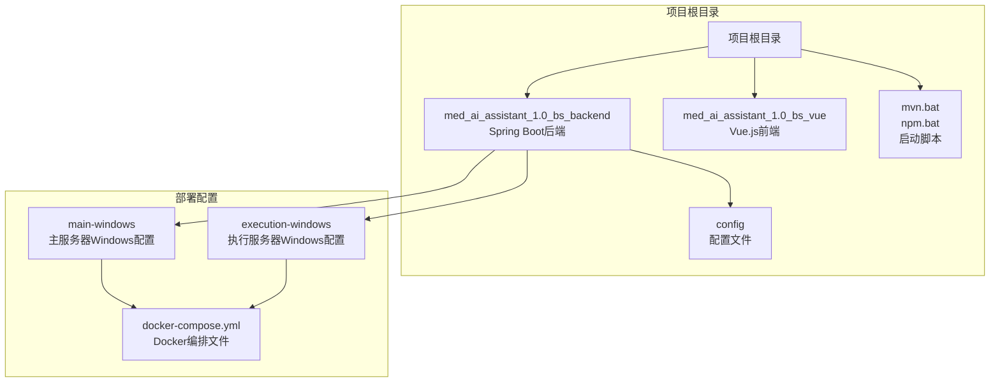
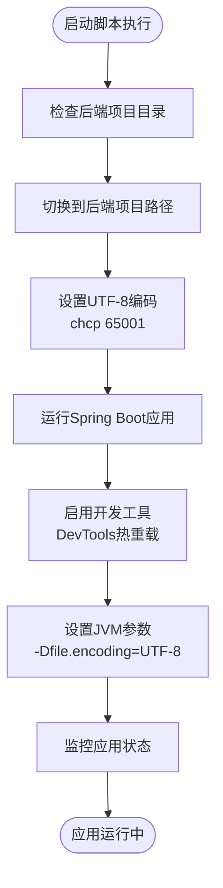
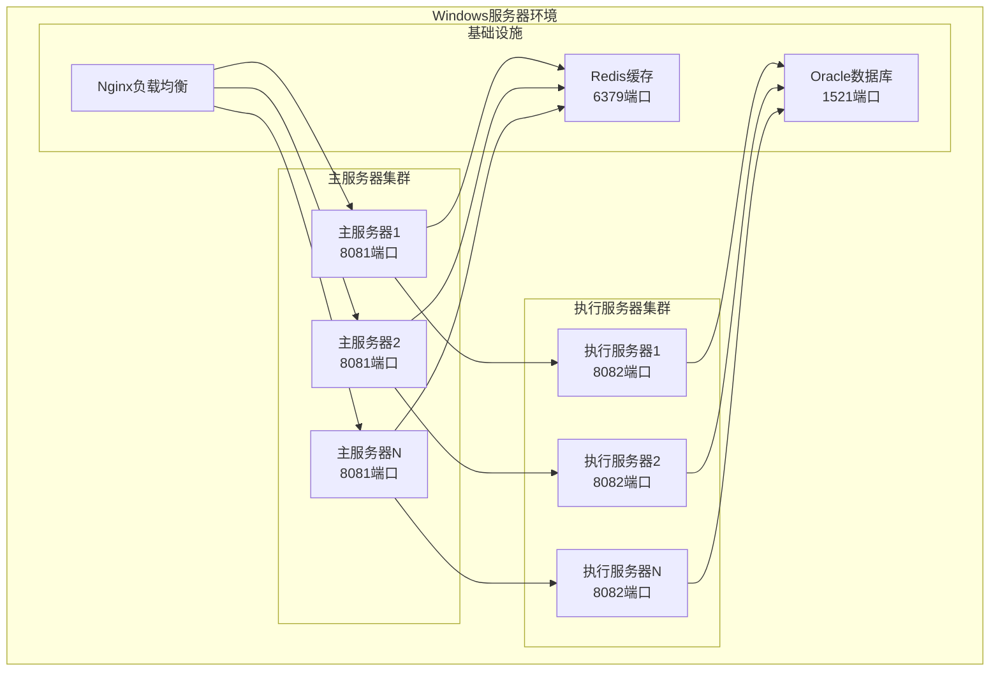
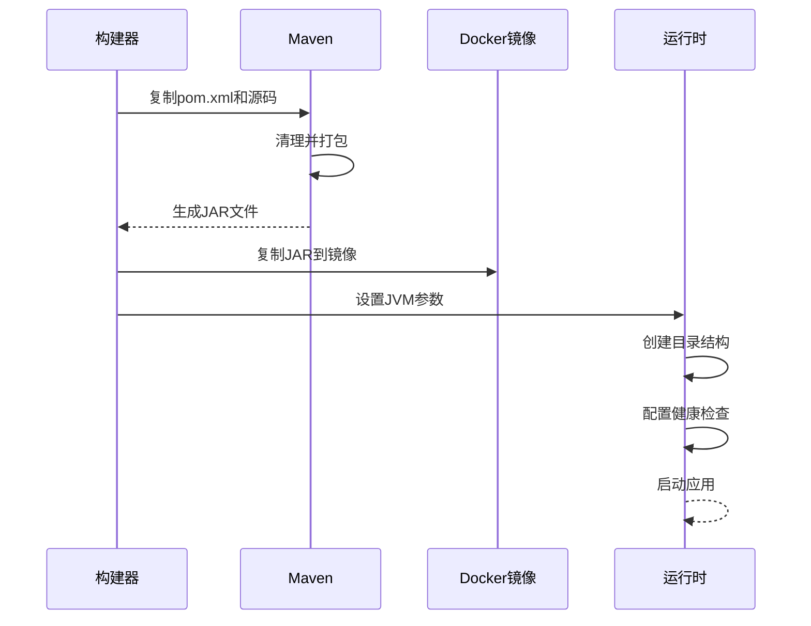
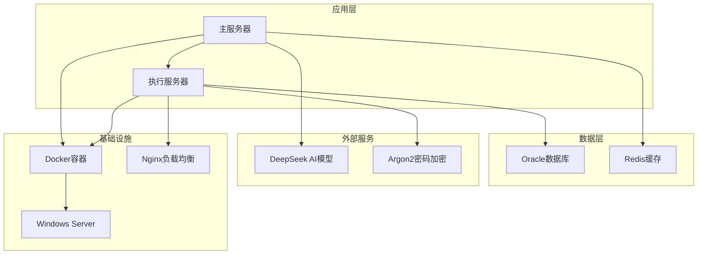

# Windows环境部署

<cite>
**本文档引用的文件**
- [mvn.bat](file://mvn.bat)
- [.gitignore](file://.gitignore)
- [pom.xml](file://med_ai_assistant_1.0_bs_backend/pom.xml)
- [application-oracle.properties](file://med_ai_assistant_1.0_bs_backend/src/main/resources/application-oracle.properties)
- [docker-compose-main-windows.yml](file://med_ai_assistant_1.0_bs_backend/deploy/main-windows/docker-compose-main-windows.yml)
- [docker-compose-execution.yml](file://med_ai_assistant_1.0_bs_backend/deploy/execution-windows/docker-compose-execution.yml)
- [Dockerfile.main.windows](file://med_ai_assistant_1.0_bs_backend/deploy/main-windows/Dockerfile.main.windows)
- [Dockerfile.execution.windows](file://med_ai_assistant_1.0_bs_backend/deploy/execution-windows/Dockerfile.execution.windows)
- [application-monitoring.properties](file://med_ai_assistant_1.0_bs_backend/config/application-monitoring.properties)
- [application-patient-status-filter.properties](file://med_ai_assistant_1.0_bs_backend/config/application-patient-status-filter.properties)
</cite>

## 目录
1. [简介](#简介)
2. [项目结构](#项目结构)
3. [核心组件](#核心组件)
4. [架构概览](#架构概览)
5. [详细组件分析](#详细组件分析)
6. [依赖关系分析](#依赖关系分析)
7. [性能考虑](#性能考虑)
8. [故障排除指南](#故障排除指南)
9. [结论](#结论)

## 简介

MedAiAssistant是一个基于Spring Boot的医疗AI助手系统，采用微服务架构设计。本指南专注于Windows平台的完整部署方案，涵盖Java 21环境配置、Spring Boot应用启动与停止脚本使用、主服务器与执行服务器的部署差异、Windows防火墙配置、服务注册与管理、Oracle数据库连接配置、JDBC驱动安装与ODBC数据源配置，以及Windows环境下的性能调优和监控配置。

## 项目结构

该项目采用多模块架构，主要包含后端Spring Boot应用和前端Vue.js应用：

**图表来源**
- [mvn.bat](file://mvn.bat#L1-L5)
- [pom.xml](file://med_ai_assistant_1.0_bs_backend/pom.xml#L1-L309)

**章节来源**
- [mvn.bat](file://mvn.bat#L1-L5)
- [.gitignore](file://.gitignore#L1-L7)

## 核心组件

### Java 21环境配置

项目明确要求使用Java 21版本进行开发和运行。在Windows环境下，需要确保以下配置：

- **Java版本**: Java 21 (JDK 21)
- **环境变量**: 设置JAVA_HOME指向Java 21安装路径
- **Maven配置**: 使用Maven 3.8.6配合OpenJDK 17进行构建
- **字符编码**: UTF-8编码支持，确保中文显示正常

### Spring Boot应用启动脚本

项目提供了专门的Windows启动脚本，支持热重载开发模式：

**图表来源**
- [mvn.bat](file://mvn.bat#L1-L5)

**章节来源**
- [mvn.bat](file://mvn.bat#L1-L5)
- [pom.xml](file://med_ai_assistant_1.0_bs_backend/pom.xml#L29-L31)

### Docker容器化部署

系统采用Docker进行容器化部署，支持Windows Server环境：

- **主服务器镜像**: 基于OpenJDK 17运行时
- **执行服务器镜像**: 基于Windows Server Core
- **多阶段构建**: 优化镜像大小和构建效率
- **资源限制**: CPU和内存配额控制

## 架构概览

系统采用主-执行服务器架构，支持分布式部署：

**图表来源**
- [docker-compose-main-windows.yml](file://med_ai_assistant_1.0_bs_backend/deploy/main-windows/docker-compose-main-windows.yml#L4-L51)
- [docker-compose-execution.yml](file://med_ai_assistant_1.0_bs_backend/deploy/execution-windows/docker-compose-execution.yml#L7-L63)

## 详细组件分析

### 主服务器部署配置

主服务器负责协调和管理执行服务器，提供统一的API接口：

#### 环境变量配置

| 配置项 | 默认值 | 用途 |
|--------|--------|------|
| SPRING_PROFILES_ACTIVE | main | 激活主服务器配置文件 |
| MAIN_SERVER_PORT | 8081 | 主服务器监听端口 |
| REDIS_HOST | redis | Redis缓存主机地址 |
| REDIS_PORT | 6379 | Redis缓存端口号 |
| EXECUTION_SERVER_HOST | 100.66.1.2 | 执行服务器地址 |
| EXECUTION_SERVER_PORT | 8082 | 执行服务器端口 |
| DEEPSEEK_API_KEY | your-api-key | AI模型API密钥 |
| JAVA_OPTS | -Xms1g -Xmx2g... | JVM内存和GC配置 |

#### 资源配置

- **内存限制**: 3GB上限，1GB预留
- **CPU限制**: 2.0核上限，0.5核预留
- **健康检查**: 30秒间隔，10秒超时
- **重启策略**: unless-stopped

**章节来源**
- [docker-compose-main-windows.yml](file://med_ai_assistant_1.0_bs_backend/deploy/main-windows/docker-compose-main-windows.yml#L10-L66)

### 执行服务器部署配置

执行服务器专门处理数据库操作和业务逻辑：

#### 数据库连接配置

| 配置项 | 默认值 | 用途 |
|--------|--------|------|
| ORACLE_HOST | 100.66.1.2 | Oracle数据库主机 |
| ORACLE_PORT | 1521 | Oracle数据库端口 |
| ORACLE_SERVICE | FREE | Oracle服务名 |
| ORACLE_USERNAME | system | 数据库用户名 |
| ORACLE_PASSWORD | Liuzh_123 | 数据库密码 |

#### 资源配置

- **内存限制**: 3GB上限，1GB预留
- **CPU限制**: 2.0核上限，1.0核预留
- **健康检查**: 30秒间隔，15秒超时
- **日志配置**: JSON格式，最大100MB，5个文件

**章节来源**
- [docker-compose-execution.yml](file://med_ai_assistant_1.0_bs_backend/deploy/execution-windows/docker-compose-execution.yml#L21-L91)

### Docker构建配置

#### 主服务器Dockerfile

**图表来源**
- [Dockerfile.main.windows](file://med_ai_assistant_1.0_bs_backend/deploy/main-windows/Dockerfile.main.windows#L4-L48)

#### 执行服务器Dockerfile

执行服务器使用Windows Server Core作为基础镜像，支持Windows容器特性：

- **基础镜像**: openjdk:17-jdk-windowsservercore
- **工作目录**: C:\app
- **目录结构**: logs、temp、config目录预创建
- **权限配置**: 脚本文件权限设置

**章节来源**
- [Dockerfile.execution.windows](file://med_ai_assistant_1.0_bs_backend/deploy/execution-windows/Dockerfile.execution.windows#L11-L59)

### 监控配置

系统内置全面的监控配置，支持分级监控策略：

#### 启动阶段监控

- **连接泄漏检测**: 2分钟阈值
- **健康检查超时**: 30秒
- **监控持续时间**: 5分钟
- **组件就绪检查**: 10秒间隔

#### 正常运行阶段监控

- **连接泄漏检测**: 30秒阈值
- **健康检查超时**: 5秒
- **监控间隔**: 60秒
- **组件健康检查**: 30秒间隔

**章节来源**
- [application-monitoring.properties](file://med_ai_assistant_1.0_bs_backend/config/application-monitoring.properties#L1-L196)

### 患者状态过滤配置

提供灵活的患者状态更新过滤机制：

#### 过滤模式

| 模式 | 配置项 | 描述 |
|------|--------|------|
| 无过滤 | department-filter-enabled=false bed-filter-enabled=false | 处理所有在院患者 |
| 仅科室过滤 | department-filter-enabled=true bed-filter-enabled=false | 处理指定科室患者 |
| 科室+床位过滤 | department-filter-enabled=true bed-filter-enabled=true | 推荐模式，精确过滤 |

#### 科室配置示例

- **目标科室**: 心血管一病区
- **床位范围**: 101,102,103

**章节来源**
- [application-patient-status-filter.properties](file://med_ai_assistant_1.0_bs_backend/config/application-patient-status-filter.properties#L1-L49)

## 依赖关系分析

系统依赖关系复杂，涉及多个外部服务：

**图表来源**
- [pom.xml](file://med_ai_assistant_1.0_bs_backend/pom.xml#L53-L214)

**章节来源**
- [pom.xml](file://med_ai_assistant_1.0_bs_backend/pom.xml#L53-L214)

## 性能考虑

### JVM调优配置

系统采用G1垃圾收集器优化配置：

- **堆内存**: 最小1GB，最大2GB
- **GC策略**: G1GC，最大GC暂停时间200ms
- **容器支持**: 启用容器内存限制支持
- **编码设置**: UTF-8字符编码
- **图形支持**: 关闭headless模式

### 线程池配置

- **核心线程**: 10个
- **最大线程**: 20个
- **队列容量**: 200
- **调度器线程**: 5个

### 监控指标

系统提供全面的性能监控指标：

- **数据库连接池**: 使用率>90%告警
- **线程池使用率**: >85%告警
- **内存使用率**: >85%告警
- **GC时间**: >5秒告警
- **API响应时间**: >10秒告警

## 故障排除指南

### 常见部署问题

#### 1. Java版本不兼容

**问题症状**: 构建失败，提示Java版本错误
**解决方法**: 
- 确保安装Java 21 JDK
- 设置JAVA_HOME环境变量
- 验证javac -version输出

#### 2. Docker容器启动失败

**问题症状**: 容器启动后立即退出
**解决方法**:
- 检查端口占用情况
- 验证环境变量配置
- 查看容器日志输出

#### 3. Oracle数据库连接失败

**问题症状**: 应用启动时报数据库连接错误
**解决方法**:
- 验证Oracle服务地址和端口
- 检查网络连通性
- 确认数据库凭据正确性

#### 4. 热重载功能失效

**问题症状**: 修改代码后应用不自动重启
**解决方法**:
- 确认DevTools依赖已启用
- 检查文件监听权限
- 验证UTF-8编码设置

### 调试方法

#### 日志分析

系统提供详细的日志配置：

- **启动阶段**: INFO级别日志
- **运行阶段**: WARN级别日志
- **错误监控**: 10秒间隔检查
- **日志轮转**: 100MB大小限制

#### 健康检查

- **主服务器**: 30秒间隔检查/api/health
- **执行服务器**: 30秒间隔检查/api/execute/health
- **Redis服务**: PING命令检查
- **超时设置**: 5-15秒不等

**章节来源**
- [docker-compose-main-windows.yml](file://med_ai_assistant_1.0_bs_backend/deploy/main-windows/docker-compose-main-windows.yml#L52-L57)
- [docker-compose-execution.yml](file://med_ai_assistant_1.0_bs_backend/deploy/execution-windows/docker-compose-execution.yml#L66-L72)

## 结论

MedAiAssistant的Windows环境部署方案提供了完整的容器化解决方案，支持主-执行服务器架构和分布式部署。通过合理的资源配置、监控设置和故障排除机制，可以确保系统的稳定运行。

关键成功因素包括：
- 正确的Java 21环境配置
- Docker容器的合理资源分配
- Oracle数据库的可靠连接
- 全面的监控和告警机制
- 详细的故障排除流程

建议在生产环境中进一步完善：
- 添加负载均衡配置
- 实施更严格的网络安全策略
- 建立完善的备份和恢复机制
- 部署集中化的日志管理系统