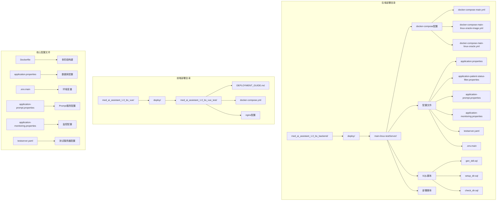
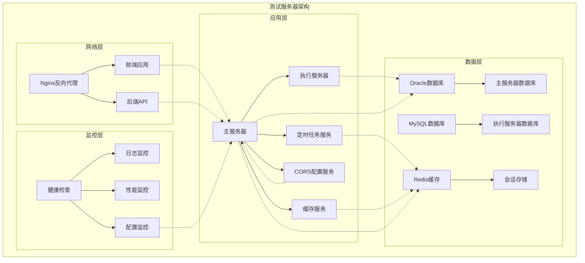
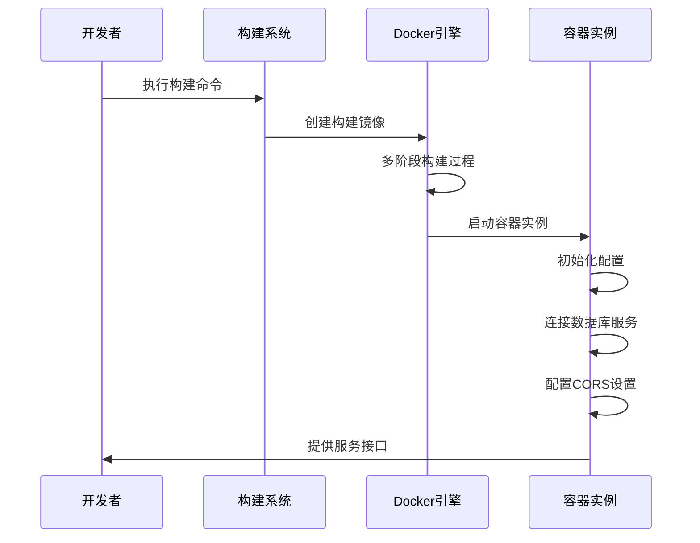
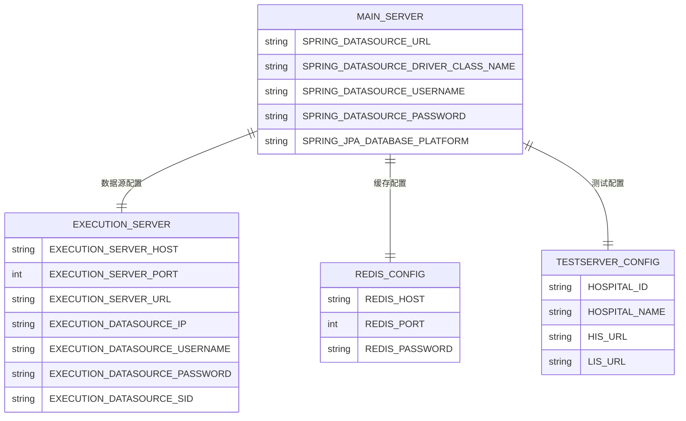
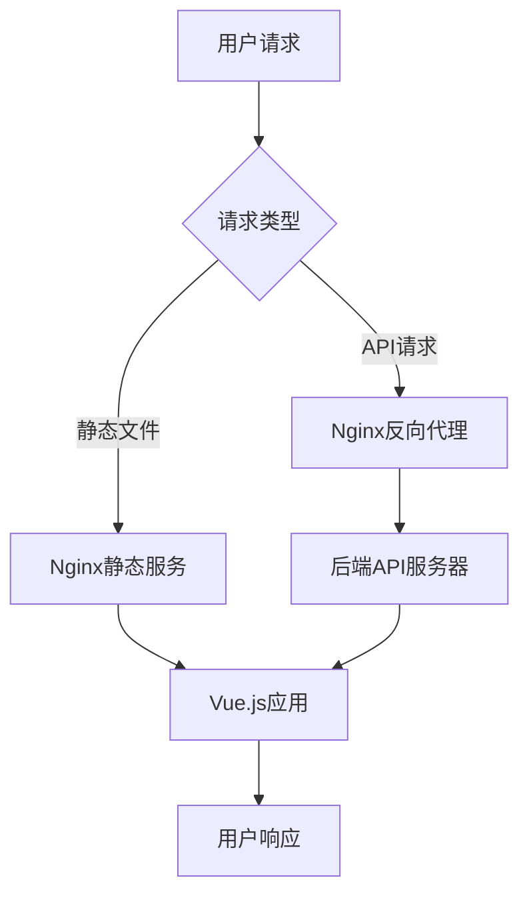
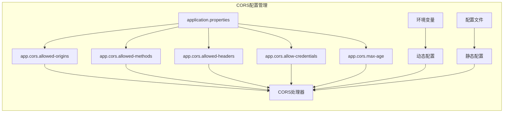
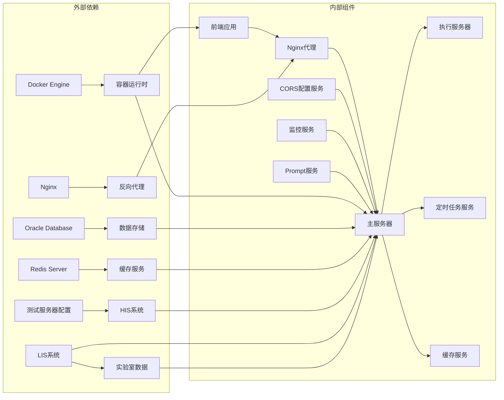

# 测试服务器部署指南

<cite>
**本文档引用的文件**
- [README.md](file://med_ai_assistant_1.0_bs_backend/deploy/main-linux-testServer/README.md)
- [deploy.sh](file://med_ai_assistant_1.0_bs_backend/deploy/main-linux-testServer/deploy.sh)
- [docker-compose-main.yml](file://med_ai_assistant_1.0_bs_backend/deploy/main-linux-testServer/docker-compose-main.yml)
- [application.properties](file://med_ai_assistant_1.0_bs_backend/deploy/main-linux-testServer/config/application.properties)
- [.env.main](file://med_ai_assistant_1.0_bs_backend/deploy/main-linux-testServer/.env.main)
- [docker-compose-main-linux-oracle-image.yml](file://med_ai_assistant_1.0_bs_backend/deploy/main-linux-testServer/docker-compose-main-linux-oracle-image.yml)
- [docker-entrypoint.sh](file://med_ai_assistant_1.0_bs_backend/deploy/main-linux-testServer/docker-entrypoint.sh)
- [gen_ddl.sql](file://med_ai_assistant_1.0_bs_backend/deploy/main-linux-testServer/sql/gen_ddl.sql)
- [setup_dir.sql](file://med_ai_assistant_1.0_bs_backend/deploy/main-linux-testServer/sql/setup_dir.sql)
- [Dockerfile](file://med_ai_assistant_1.0_bs_backend/Dockerfile)
- [DEPLOYMENT_GUIDE.md](file://med_ai_assistant_1.0_bs_vue/deploy/med_ai_assistant_1.0_bs_vue_test/DEPLOYMENT_GUIDE.md)
- [docker-compose.yml](file://med_ai_assistant_1.0_bs_vue/deploy/med_ai_assistant_1.0_bs_vue_test/docker-compose.yml)
- [test-execution-server-comprehensive.http](file://med_ai_assistant_1.0_bs_backend/test-scripts/test-execution-server-comprehensive.http)
- [application-prompt.properties](file://med_ai_assistant_1.0_bs_backend/deploy/main-linux-testServer/config/application-prompt.properties)
- [application-patient-status-filter.properties](file://med_ai_assistant_1.0_bs_backend/deploy/main-linux-testServer/config/application-patient-status-filter.properties)
- [application-monitoring.properties](file://med_ai_assistant_1.0_bs_backend/deploy/main-linux-testServer/config/application-monitoring.properties)
- [testserver.yaml](file://med_ai_assistant_1.0_bs_backend/deploy/main-linux-testServer/config/hospitals/testserver.yaml)
</cite>

## 更新摘要
**所做更改**
- 更新了定时任务配置部分，反映测试服务器禁用定时Prompt自动生成的变更
- 新增了CORS配置外部化的说明和配置示例
- 改进了部署脚本的健康检查机制说明
- 增加了新的配置文件和监控配置的详细说明

## 目录
1. [简介](#简介)
2. [项目结构](#项目结构)
3. [核心组件](#核心组件)
4. [架构概览](#架构概览)
5. [详细组件分析](#详细组件分析)
6. [依赖关系分析](#依赖关系分析)
7. [性能考虑](#性能考虑)
8. [故障排除指南](#故障排除指南)
9. [结论](#结论)
10. [附录](#附录)

## 简介

本指南详细介绍了MedAiAssistant项目的测试服务器部署方案，包括主服务器和执行服务器的完整部署流程。该项目采用微服务架构，使用Docker容器化部署，支持Linux和Windows环境。测试服务器主要用于验证系统的各项功能，包括AI诊断、患者管理、DRG分析等核心业务模块。

项目采用前后端分离架构，后端基于Spring Boot框架，前端使用Vue.js技术栈，通过Nginx进行反向代理和负载均衡。整个系统支持多数据源配置，包括Oracle数据库和MySQL数据库，以及Redis缓存服务。

**更新** 本次更新反映了应用变更：禁用测试服务器定时Prompt自动生成、新增CORS配置外部化、改进部署脚本的健康检查机制。

## 项目结构

测试服务器部署涉及的主要目录结构如下：



**图表来源**
- [README.md:1-396](file://med_ai_assistant_1.0_bs_backend/deploy/main-linux-testServer/README.md#L1-L396)
- [docker-compose-main.yml:1-110](file://med_ai_assistant_1.0_bs_backend/deploy/main-linux-testServer/docker-compose-main.yml#L1-L110)

**章节来源**
- [README.md:1-396](file://med_ai_assistant_1.0_bs_backend/deploy/main-linux-testServer/README.md#L1-L396)
- [docker-compose-main.yml:1-110](file://med_ai_assistant_1.0_bs_backend/deploy/main-linux-testServer/docker-compose-main.yml#L1-L110)

## 核心组件

### 主服务器组件

主服务器是整个系统的核心，负责协调各个子服务的工作。主要组件包括：

1. **Spring Boot应用服务器**：提供RESTful API接口，处理业务逻辑
2. **Redis缓存服务**：提供高性能的数据缓存和会话管理
3. **数据库连接池**：使用HikariCP提供高效的数据库连接管理
4. **定时任务调度器**：负责各种定时任务的执行和管理

### 执行服务器组件

执行服务器专门处理AI相关的计算任务，包括：
1. **LLM调用服务**：与外部AI模型进行交互
2. **数据处理服务**：处理和转换各种医疗数据
3. **轮询服务**：监控和管理任务队列
4. **性能监控服务**：跟踪和分析系统性能指标

### 前端组件

前端采用Vue.js框架，提供用户友好的界面：
1. **Nginx反向代理**：提供静态文件服务和API代理
2. **Vue.js单页应用**：提供丰富的用户交互体验
3. **CORS配置**：确保跨域请求的安全性和可靠性

**更新** 测试服务器现已支持CORS配置外部化，允许通过环境变量动态配置跨域访问策略。

**章节来源**
- [application.properties:1-204](file://med_ai_assistant_1.0_bs_backend/deploy/main-linux-testServer/config/application.properties#L1-L204)
- [docker-compose-main.yml:1-110](file://med_ai_assistant_1.0_bs_backend/deploy/main-linux-testServer/docker-compose-main.yml#L1-L110)

## 架构概览

系统采用微服务架构，通过Docker容器化部署，实现了高度的可扩展性和可维护性。



**图表来源**
- [docker-compose-main.yml:1-110](file://med_ai_assistant_1.0_bs_backend/deploy/main-linux-testServer/docker-compose-main.yml#L1-L110)
- [DEPLOYMENT_GUIDE.md:1-193](file://med_ai_assistant_1.0_bs_vue/deploy/med_ai_assistant_1.0_bs_vue_test/DEPLOYMENT_GUIDE.md#L1-L193)

### 数据流分析

系统的核心数据流包括：

1. **用户请求流程**：用户通过前端界面发起请求，Nginx进行反向代理，后端API处理业务逻辑
2. **AI处理流程**：主服务器接收请求后，根据业务类型将任务分配给执行服务器进行AI处理
3. **数据同步流程**：定时任务服务定期从医院信息系统同步患者数据
4. **缓存管理流程**：Redis缓存服务提供数据缓存和会话管理
5. **跨域访问流程**：CORS配置服务处理跨域请求，确保安全访问

**更新** 新增了CORS配置服务，专门处理跨域访问控制，支持动态配置和外部化管理。

**章节来源**
- [docker-entrypoint.sh:1-108](file://med_ai_assistant_1.0_bs_backend/deploy/main-linux-testServer/docker-entrypoint.sh#L1-L108)
- [test-execution-server-comprehensive.http:1-144](file://med_ai_assistant_1.0_bs_backend/test-scripts/test-execution-server-comprehensive.http#L1-L144)

## 详细组件分析

### Docker部署配置

系统采用多阶段Docker构建，优化了镜像大小和启动性能。



**图表来源**
- [Dockerfile:1-65](file://med_ai_assistant_1.0_bs_backend/Dockerfile#L1-L65)
- [docker-compose-main.yml:1-110](file://med_ai_assistant_1.0_bs_backend/deploy/main-linux-testServer/docker-compose-main.yml#L1-L110)

#### 配置文件管理

系统采用环境变量和配置文件相结合的方式管理配置：

| 配置类型 | 文件位置 | 用途 | 关键参数 |
|---------|----------|------|----------|
| 应用配置 | config/application.properties | 数据库连接、线程池配置 | spring.datasource.hikari.* |
| 环境变量 | .env.main | 环境特定配置 | SPRING_DATASOURCE_URL |
| Prompt配置 | config/application-prompt.properties | Prompt服务配置 | prompt.submission.* |
| 监控配置 | config/application-monitoring.properties | 系统监控配置 | startup.health-check.timeout |
| 医院配置 | config/hospitals/testserver.yaml | 测试服务器配置 | hospital.id, hospital.name |
| CORS配置 | application.properties | 跨域资源共享配置 | app.cors.allowed-origins |

**更新** 新增了多个配置文件的支持，包括Prompt服务配置、监控配置和测试服务器配置，以及CORS配置的外部化管理。

**章节来源**
- [.env.main:1-63](file://med_ai_assistant_1.0_bs_backend/deploy/main-linux-testServer/.env.main#L1-L63)
- [application.properties:1-204](file://med_ai_assistant_1.0_bs_backend/deploy/main-linux-testServer/config/application.properties#L1-L204)

### 数据库配置

系统支持多种数据库配置，测试服务器使用Oracle数据库：



**图表来源**
- [.env.main:1-63](file://med_ai_assistant_1.0_bs_backend/deploy/main-linux-testServer/.env.main#L1-L63)
- [application.properties:80-98](file://med_ai_assistant_1.0_bs_backend/deploy/main-linux-testServer/config/application.properties#L80-L98)
- [testserver.yaml:1-42](file://med_ai_assistant_1.0_bs_backend/deploy/main-linux-testServer/config/hospitals/testserver.yaml#L1-L42)

#### 数据库初始化脚本

系统提供了完整的数据库初始化脚本，包括DDL生成和目录设置：

**更新** 测试服务器配置文件中包含了详细的测试环境配置，包括HIS和LIS系统的连接信息。

**章节来源**
- [gen_ddl.sql:1-21](file://med_ai_assistant_1.0_bs_backend/deploy/main-linux-testServer/sql/gen_ddl.sql#L1-L21)
- [setup_dir.sql:1-6](file://med_ai_assistant_1.0_bs_backend/deploy/main-linux-testServer/sql/setup_dir.sql#L1-L6)
- [testserver.yaml:1-42](file://med_ai_assistant_1.0_bs_backend/deploy/main-linux-testServer/config/hospitals/testserver.yaml#L1-L42)

### 前端部署配置

前端采用Nginx进行反向代理和静态文件服务：



**图表来源**
- [DEPLOYMENT_GUIDE.md:92-116](file://med_ai_assistant_1.0_bs_vue/deploy/med_ai_assistant_1.0_bs_vue_test/DEPLOYMENT_GUIDE.md#L92-L116)

**章节来源**
- [DEPLOYMENT_GUIDE.md:1-193](file://med_ai_assistant_1.0_bs_vue/deploy/med_ai_assistant_1.0_bs_vue_test/DEPLOYMENT_GUIDE.md#L1-L193)
- [docker-compose.yml:1-93](file://med_ai_assistant_1.0_bs_vue/deploy/med_ai_assistant_1.0_bs_vue_test/docker-compose.yml#L1-L93)

### CORS配置外部化

**新增** 系统现在支持CORS配置的外部化管理，允许通过application.properties文件动态配置跨域访问策略。



**图表来源**
- [application.properties:196-204](file://med_ai_assistant_1.0_bs_backend/deploy/main-linux-testServer/config/application.properties#L196-L204)

**章节来源**
- [application.properties:196-204](file://med_ai_assistant_1.0_bs_backend/deploy/main-linux-testServer/config/application.properties#L196-L204)

## 依赖关系分析

系统各组件之间的依赖关系如下：



**图表来源**
- [docker-compose-main.yml:1-110](file://med_ai_assistant_1.0_bs_backend/deploy/main-linux-testServer/docker-compose-main.yml#L1-L110)
- [docker-compose.yml:1-93](file://med_ai_assistant_1.0_bs_vue/deploy/med_ai_assistant_1.0_bs_vue_test/docker-compose.yml#L1-L93)

### 服务启动顺序

系统服务的启动顺序对部署的成功至关重要：

1. **Redis服务**：首先启动，为其他服务提供缓存支持
2. **数据库服务**：启动主数据库和执行服务器数据库
3. **主服务器**：启动应用服务器，连接数据库和缓存，配置CORS
4. **执行服务器**：启动AI处理服务
5. **前端服务**：最后启动，提供用户界面

**更新** 部署脚本现在包含更完善的健康检查机制，确保所有服务按正确的顺序启动。

**章节来源**
- [docker-entrypoint.sh:59-93](file://med_ai_assistant_1.0_bs_backend/deploy/main-linux-testServer/docker-entrypoint.sh#L59-L93)
- [deploy.sh:112-196](file://med_ai_assistant_1.0_bs_backend/deploy/main-linux-testServer/deploy.sh#L112-L196)

## 性能考虑

### 资源配置优化

系统在资源配置方面采用了多项优化措施：

1. **内存配置**：主服务器内存限制为3GB，执行服务器为2GB
2. **CPU配置**：主服务器预留0.5核，限制2.0核
3. **连接池优化**：HikariCP连接池最大20个连接
4. **线程池配置**：调度线程池大小为5，执行线程池为20

### 监控和日志

系统提供了完善的监控和日志功能：

- **健康检查**：每30秒检查一次服务状态
- **性能监控**：监控容器资源使用情况
- **日志管理**：支持实时日志查看和错误日志监控
- **配置监控**：监控配置文件的变更和有效性

**更新** 新增了配置监控功能，确保所有配置文件的有效性和一致性。

**章节来源**
- [docker-compose-main.yml:60-67](file://med_ai_assistant_1.0_bs_backend/deploy/main-linux-testServer/docker-compose-main.yml#L60-L67)
- [application.properties:150-177](file://med_ai_assistant_1.0_bs_backend/deploy/main-linux-testServer/config/application.properties#L150-L177)
- [application-monitoring.properties:1-196](file://med_ai_assistant_1.0_bs_backend/deploy/main-linux-testServer/config/application-monitoring.properties#L1-L196)

## 故障排除指南

### 常见问题及解决方案

#### 容器启动失败

**问题描述**：容器启动后立即退出

**可能原因**：
1. 端口被占用
2. 环境变量配置错误
3. 数据库连接失败
4. CORS配置无效

**解决方案**：
```bash
# 检查端口占用
netstat -tulpn | grep -E '8081|6379'

# 查看容器日志
docker logs med-ai-main

# 验证环境变量
cat .env.main | grep -E '(REDIS_|EXECUTION_|SPRING_)'

# 验证CORS配置
grep -A 5 "app.cors" config/application.properties
```

#### 数据库连接问题

**问题描述**：应用无法连接到数据库

**解决方案**：
```bash
# 测试数据库连接
telnet 100.66.1.4 1521

# 检查数据库服务状态
docker ps | grep oracle

# 验证连接字符串
echo $SPRING_DATASOURCE_URL
```

#### Redis连接问题

**问题描述**：Redis连接失败

**解决方案**：
```bash
# 检查Redis服务
docker ps | grep redis

# 测试Redis连接
docker exec -it med-ai-main-redis redis-cli -a Liuzh_123 PING

# 验证Redis配置
cat .env.main | grep REDIS_
```

#### 健康检查失败

**问题描述**：健康检查返回非200状态

**解决方案**：
```bash
# 手动检查健康状态
curl http://localhost:8081/api/health

# 检查应用日志
docker logs med-ai-main | tail -n 50

# 验证JVM参数
echo $JAVA_OPTS

# 检查定时任务状态
curl http://localhost:8081/api/timer-prompt-generator/status
```

**更新** 健康检查机制得到了改进，现在包含定时任务状态检查和CORS配置验证。

**章节来源**
- [README.md:282-346](file://med_ai_assistant_1.0_bs_backend/deploy/main-linux-testServer/README.md#L282-L346)
- [deploy.sh:28-110](file://med_ai_assistant_1.0_bs_backend/deploy/main-linux-testServer/deploy.sh#L28-L110)

### 性能问题诊断

#### 内存不足问题

**症状**：应用频繁重启或性能下降

**诊断步骤**：
1. 检查容器内存使用情况
2. 分析JVM堆内存使用
3. 调整JVM参数

**解决方案**：
```bash
# 查看内存使用
docker stats --no-stream med-ai-main

# 分析JVM堆内存
docker exec med-ai-main jmap -heap 1

# 调整JVM参数
export JAVA_OPTS="-Xms2g -Xmx4g -XX:+UseG1GC"
```

#### 线程池耗尽

**症状**：请求处理缓慢或超时

**诊断步骤**：
1. 检查线程池使用率
2. 分析任务队列长度
3. 评估并发需求

**解决方案**：
```bash
# 检查线程池配置
cat config/application.properties | grep thread.pool

# 调整线程池大小
export THREAD_POOL_MAX_SIZE=30
export SCHEDULER_POOL_SIZE=10
```

#### CORS配置问题

**症状**：跨域请求失败或被阻止

**诊断步骤**：
1. 检查CORS配置文件
2. 验证允许的源和方法
3. 确认凭证设置

**解决方案**：
```bash
# 检查CORS配置
grep -A 5 "app.cors" config/application.properties

# 验证跨域请求
curl -H "Origin: http://100.66.1.4" \
     -H "Access-Control-Request-Method: GET" \
     -H "Access-Control-Request-Headers: X-Requested-With" \
     -X OPTIONS \
     -v http://localhost:8081/api/health
```

**更新** 新增了CORS配置问题的诊断和解决方案。

## 结论

测试服务器部署指南提供了完整的部署方案，涵盖了从环境准备到服务验证的全过程。通过采用Docker容器化部署，系统实现了高度的可移植性和可维护性。

关键优势包括：
1. **标准化部署**：使用Docker Compose实现一键部署
2. **配置灵活性**：支持环境变量和配置文件的灵活组合
3. **监控完善**：提供健康检查和性能监控功能
4. **故障恢复**：具备自动重启和故障转移能力
5. **CORS外部化**：支持动态跨域配置管理
6. **改进的健康检查**：包含定时任务和配置验证

**更新** 本次更新增强了系统的配置管理和监控能力，特别是CORS配置的外部化和改进的健康检查机制。

建议在生产环境中进一步增强：
1. 添加SSL证书配置
2. 实施更严格的访问控制
3. 建立完整的备份策略
4. 配置告警通知机制
5. 实施配置版本管理

## 附录

### 部署验证清单

部署完成后，建议按照以下清单进行验证：

1. **服务状态验证**
   - [ ] 主服务器健康检查通过
   - [ ] 执行服务器正常运行
   - [ ] Redis连接正常
   - [ ] 数据库连接正常
   - [ ] CORS配置生效

2. **功能测试验证**
   - [ ] 患者数据同步功能
   - [ ] AI诊断功能
   - [ ] DRG分析功能
   - [ ] 定时任务执行
   - [ ] 跨域请求测试

3. **性能基准验证**
   - [ ] 响应时间测试
   - [ ] 并发处理能力
   - [ ] 资源使用监控
   - [ ] 稳定性测试

4. **配置验证**
   - [ ] CORS配置验证
   - [ ] 定时任务配置验证
   - [ ] 监控配置验证
   - [ ] 测试服务器配置验证

### 常用命令参考

```bash
# 部署相关
./deploy.sh                    # 一键部署
docker-compose up -d           # 启动所有服务
docker-compose down            # 停止所有服务

# 监控相关
docker ps                      # 查看容器状态
docker logs -f med-ai-main     # 查看应用日志
docker stats                   # 查看资源使用

# 验证相关
curl http://localhost:8081/api/health  # 健康检查
curl http://localhost:8081/api/prompt-services/polling/status  # 轮询状态
curl http://localhost:8081/api/timer-prompt-generator/status  # 定时任务状态
curl -H "Origin: http://100.66.1.4" -X OPTIONS http://localhost:8081/api/health  # CORS测试
```

**更新** 新增了CORS测试命令和定时任务状态检查命令。

### 配置文件说明

| 配置文件 | 用途 | 关键配置项 |
|---------|------|------------|
| application.properties | 主要应用配置 | scheduling.timer.enabled, app.cors.* |
| .env.main | 环境变量配置 | SPRING_DATASOURCE_URL, REDIS_* |
| application-prompt.properties | Prompt服务配置 | prompt.submission.*, prompt.polling.* |
| application-monitoring.properties | 监控配置 | startup.*, normal.*, monitoring.* |
| testserver.yaml | 测试服务器配置 | hospital.*, his.*, lis.* |
| application-patient-status-filter.properties | 患者状态过滤配置 | scheduling.timer.* |

**更新** 新增了多个配置文件的详细说明，包括CORS配置、监控配置和测试服务器配置。