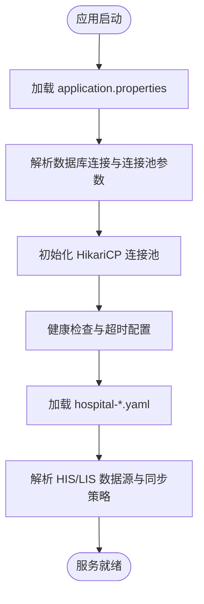
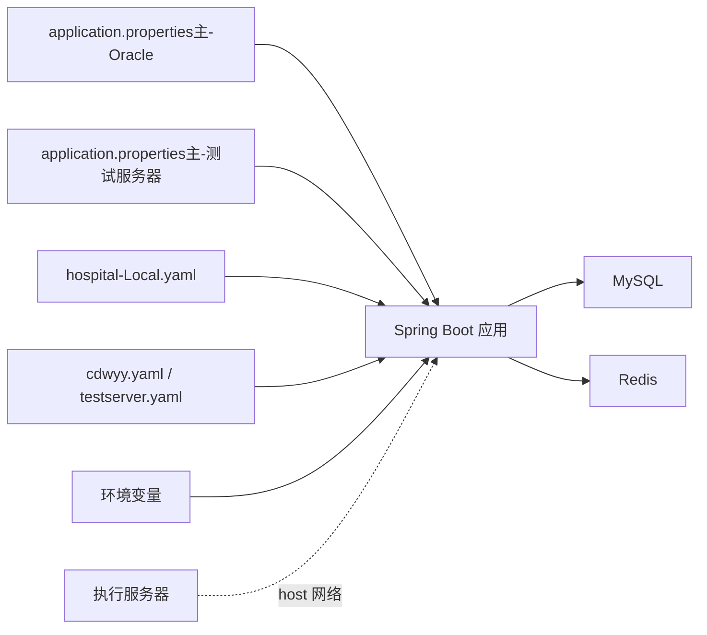

# 环境配置

<cite>
**本文引用的文件**
- [application.properties（主-Oracle）](file://med_ai_assistant_1.0_bs_backend/deploy/main-linux-oracle/config/application.properties)
- [application.properties（主-测试服务器）](file://med_ai_assistant_1.0_bs_backend/deploy/main-linux-testServer/config/application.properties)
- [hospital-Local.yaml](file://med_ai_assistant_1.0_bs_backend/config/hospitals/hospital-Local.yaml)
- [cdwyy.yaml](file://med_ai_assistant_1.0_bs_backend/deploy/main-linux-oracle/config/hospitals/cdwyy.yaml)
- [testserver.yaml](file://med_ai_assistant_1.0_bs_backend/deploy/main-linux-testServer/config/hospitals/testserver.yaml)
- [docker-compose.yml（后端主应用）](file://med_ai_assistant_1.0_bs_backend/docker-compose.yml)
- [docker-compose-execution-linux.yml（执行服务器）](file://med_ai_assistant_1.0_bs_backend/deploy/execution-linux/docker-compose-execution-linux.yml)
- [mvn.bat](file://mvn.bat)
- [.gitignore](file://.gitignore)
</cite>

## 目录
1. [简介](#简介)
2. [项目结构](#项目结构)
3. [核心组件](#核心组件)
4. [架构总览](#架构总览)
5. [详细组件分析](#详细组件分析)
6. [依赖关系分析](#依赖关系分析)
7. [性能考量](#性能考量)
8. [故障排查指南](#故障排查指南)
9. [结论](#结论)
10. [附录](#附录)

## 简介
本指南面向运维与开发人员，系统梳理 MedAiAssistant 项目的环境配置与部署要点，涵盖：
- 应用配置文件结构与关键参数
- 数据库连接、Redis 缓存、监控参数与 AI 模型集成配置
- 不同环境（开发、测试、生产）的配置差异与切换方法
- 环境变量设置与敏感信息安全存储
- 网络配置、端口规划与防火墙规则
- 配置优先级与覆盖机制
- 配置验证方法与常见错误排查

## 项目结构
项目采用前后端分离与容器化部署，后端通过 Docker Compose 编排，包含主应用、MySQL、Redis 以及独立的执行服务器。配置主要分为两类：
- 运行时配置：application.properties（Spring Boot）
- 医院集成配置：YAML 文件（按医院维度组织）

```mermaid
graph TB
subgraph "后端容器编排"
A["med-ai-backend<br/>Spring Boot 应用"]
B["med-ai-mysql<br/>MySQL 8.0"]
C["med-ai-redis<br/>Redis 7"]
end
subgraph "执行服务器"
D["med-ai-execution-server<br/>独立服务host 网络"]
end
subgraph "配置来源"
E["application.properties主-Oracle"]
F["application.properties主-测试服务器"]
G["hospital-Local.yaml"]
H["cdwyy.yaml / testserver.yaml"]
end
A --- B
A --- C
A -. 引用 .-> E
A -. 引用 .-> F
A -. 引用 .-> G
A -. 引用 .-> H
D -. 独立配置 .->|"host 网络"| A
```

图表来源
- [docker-compose.yml（后端主应用）](file://med_ai_assistant_1.0_bs_backend/docker-compose.yml#L1-L97)
- [docker-compose-execution-linux.yml（执行服务器）](file://med_ai_assistant_1.0_bs_backend/deploy/execution-linux/docker-compose-execution-linux.yml#L1-L96)
- [application.properties（主-Oracle）](file://med_ai_assistant_1.0_bs_backend/deploy/main-linux-oracle/config/application.properties#L1-L189)
- [application.properties（主-测试服务器）](file://med_ai_assistant_1.0_bs_backend/deploy/main-linux-testServer/config/application.properties#L1-L186)
- [hospital-Local.yaml](file://med_ai_assistant_1.0_bs_backend/config/hospitals/hospital-Local.yaml#L1-L38)
- [cdwyy.yaml](file://med_ai_assistant_1.0_bs_backend/deploy/main-linux-oracle/config/hospitals/cdwyy.yaml#L1-L42)
- [testserver.yaml](file://med_ai_assistant_1.0_bs_backend/deploy/main-linux-testServer/config/hospitals/testserver.yaml#L1-L42)

章节来源
- [docker-compose.yml（后端主应用）](file://med_ai_assistant_1.0_bs_backend/docker-compose.yml#L1-L97)
- [docker-compose-execution-linux.yml（执行服务器）](file://med_ai_assistant_1.0_bs_backend/deploy/execution-linux/docker-compose-execution-linux.yml#L1-L96)

## 核心组件
- Spring Boot 应用配置（application.properties）
  - 数据库连接与连接池（HikariCP）
  - Redis 缓存连接
  - 线程池与调度
  - 监控与健康检查端点
  - 服务端口与字符编码
  - 定时任务与夜间同步策略
  - 语音识别（ASR）接入参数
  - 医院默认配置与执行服务器地址
- 医院集成配置（hospital-*.yaml）
  - HIS/LIS 数据源 URL、用户名、密码、表前缀
  - 同步策略（cron、重试次数、间隔）
  - 字段映射与 SQL 模板基路径
- 容器编排（docker-compose）
  - 主应用、MySQL、Redis 的镜像、端口、环境变量与挂载卷
  - 执行服务器（host 网络模式）的独立编排

章节来源
- [application.properties（主-Oracle）](file://med_ai_assistant_1.0_bs_backend/deploy/main-linux-oracle/config/application.properties#L1-L189)
- [application.properties（主-测试服务器）](file://med_ai_assistant_1.0_bs_backend/deploy/main-linux-testServer/config/application.properties#L1-L186)
- [hospital-Local.yaml](file://med_ai_assistant_1.0_bs_backend/config/hospitals/hospital-Local.yaml#L1-L38)
- [cdwyy.yaml](file://med_ai_assistant_1.0_bs_backend/deploy/main-linux-oracle/config/hospitals/cdwyy.yaml#L1-L42)
- [testserver.yaml](file://med_ai_assistant_1.0_bs_backend/deploy/main-linux-testServer/config/hospitals/testserver.yaml#L1-L42)
- [docker-compose.yml（后端主应用）](file://med_ai_assistant_1.0_bs_backend/docker-compose.yml#L1-L97)
- [docker-compose-execution-linux.yml（执行服务器）](file://med_ai_assistant_1.0_bs_backend/deploy/execution-linux/docker-compose-execution-linux.yml#L1-L96)

## 架构总览
下图展示配置在整体架构中的位置与流向：Spring Boot 应用通过 application.properties 读取数据库、Redis、定时任务等参数；同时加载 hospital-*.yaml 完成 HIS/LIS 集成；容器编排负责服务发现与网络互通。

```mermaid
graph TB
subgraph "容器层"
BE["med-ai-backend"]
DB["MySQL"]
RC["Redis"]
EX["med-ai-execution-server"]
end
subgraph "配置层"
AP["application.properties"]
H1["hospital-Local.yaml"]
H2["cdwyy.yaml / testserver.yaml"]
end
BE --> AP
BE --> H1
BE --> H2
BE --- DB
BE --- RC
EX -. 独立运行 .-|host 网络| BE
```

图表来源
- [docker-compose.yml（后端主应用）](file://med_ai_assistant_1.0_bs_backend/docker-compose.yml#L1-L97)
- [docker-compose-execution-linux.yml（执行服务器）](file://med_ai_assistant_1.0_bs_backend/deploy/execution-linux/docker-compose-execution-linux.yml#L1-L96)
- [application.properties（主-Oracle）](file://med_ai_assistant_1.0_bs_backend/deploy/main-linux-oracle/config/application.properties#L1-L189)
- [hospital-Local.yaml](file://med_ai_assistant_1.0_bs_backend/config/hospitals/hospital-Local.yaml#L1-L38)
- [cdwyy.yaml](file://med_ai_assistant_1.0_bs_backend/deploy/main-linux-oracle/config/hospitals/cdwyy.yaml#L1-L42)
- [testserver.yaml](file://med_ai_assistant_1.0_bs_backend/deploy/main-linux-testServer/config/hospitals/testserver.yaml#L1-L42)

## 详细组件分析

### 数据库连接配置
- 主应用（Spring Boot）
  - JPA/Hibernate 方向与时区配置
  - Jackson 时区与日期格式
  - HikariCP 连接池参数（最大池大小、空闲、超时、生命周期、泄漏检测、校验超时、保活、测试查询、初始化失败超时）
  - Oracle 连接超时与驱动优化参数
  - 字符编码（UTF-8）
- 执行服务器
  - 显式指定 Oracle URL、用户名、密码、驱动类与默认 Schema
- 医院集成
  - HIS/LIS 数据源的 JDBC URL、用户名、密码与表前缀
  - 同步策略（cron 表达式、启用开关、最大重试次数、重试间隔）



图表来源
- [application.properties（主-Oracle）](file://med_ai_assistant_1.0_bs_backend/deploy/main-linux-oracle/config/application.properties#L2-L44)
- [application.properties（主-测试服务器）](file://med_ai_assistant_1.0_bs_backend/deploy/main-linux-testServer/config/application.properties#L2-L41)
- [hospital-Local.yaml](file://med_ai_assistant_1.0_bs_backend/config/hospitals/hospital-Local.yaml#L6-L22)
- [cdwyy.yaml](file://med_ai_assistant_1.0_bs_backend/deploy/main-linux-oracle/config/hospitals/cdwyy.yaml#L6-L16)
- [testserver.yaml](file://med_ai_assistant_1.0_bs_backend/deploy/main-linux-testServer/config/hospitals/testserver.yaml#L6-L16)

章节来源
- [application.properties（主-Oracle）](file://med_ai_assistant_1.0_bs_backend/deploy/main-linux-oracle/config/application.properties#L2-L44)
- [application.properties（主-测试服务器）](file://med_ai_assistant_1.0_bs_backend/deploy/main-linux-testServer/config/application.properties#L2-L41)
- [hospital-Local.yaml](file://med_ai_assistant_1.0_bs_backend/config/hospitals/hospital-Local.yaml#L6-L22)
- [cdwyy.yaml](file://med_ai_assistant_1.0_bs_backend/deploy/main-linux-oracle/config/hospitals/cdwyy.yaml#L6-L16)
- [testserver.yaml](file://med_ai_assistant_1.0_bs_backend/deploy/main-linux-testServer/config/hospitals/testserver.yaml#L6-L16)

### Redis 缓存配置
- 主应用通过环境变量注入 Redis 地址、端口与密码
- 执行服务器未显式声明 Redis，若需使用需在编排中补充

章节来源
- [application.properties（主-Oracle）](file://med_ai_assistant_1.0_bs_backend/deploy/main-linux-oracle/config/application.properties#L82-L85)
- [application.properties（主-测试服务器）](file://med_ai_assistant_1.0_bs_backend/deploy/main-linux-testServer/config/application.properties#L80-L83)
- [docker-compose.yml（后端主应用）](file://med_ai_assistant_1.0_bs_backend/docker-compose.yml#L64-L83)

### 监控参数配置
- 暴露健康、信息、指标、环境端点
- 启用探针健康检查
- 日志级别针对数据库连接池与 Oracle 驱动进行诊断性调试

章节来源
- [application.properties（主-Oracle）](file://med_ai_assistant_1.0_bs_backend/deploy/main-linux-oracle/config/application.properties#L75-L77)
- [application.properties（主-Oracle）](file://med_ai_assistant_1.0_bs_backend/deploy/main-linux-oracle/config/application.properties#L162-L180)
- [application.properties（主-测试服务器）](file://med_ai_assistant_1.0_bs_backend/deploy/main-linux-testServer/config/application.properties#L71-L73)
- [application.properties（主-测试服务器）](file://med_ai_assistant_1.0_bs_backend/deploy/main-linux-testServer/config/application.properties#L149-L177)

### AI 模型集成配置
- Spring Boot 通过配置导入加载 AI 模型属性文件
- 执行服务器通过环境变量注入模型 API Key 与超时
- 主应用可设置默认模型标识

章节来源
- [application.properties（主-Oracle）](file://med_ai_assistant_1.0_bs_backend/deploy/main-linux-oracle/config/application.properties#L19-L24)
- [application.properties（主-测试服务器）](file://med_ai_assistant_1.0_bs_backend/deploy/main-linux-testServer/config/application.properties#L19-L21)
- [docker-compose-execution-linux.yml（执行服务器）](file://med_ai_assistant_1.0_bs_backend/deploy/execution-linux/docker-compose-execution-linux.yml#L28-L30)

### 定时任务与夜间同步
- 主应用提供每日、手术分析、午间查房等定时任务时间配置
- 夜间同步开关、启动时执行与 Cron 表达式可通过环境变量覆盖
- 执行服务器启用轮询与回调开关

章节来源
- [application.properties（主-Oracle）](file://med_ai_assistant_1.0_bs_backend/deploy/main-linux-oracle/config/application.properties#L121-L148)
- [application.properties（主-测试服务器）](file://med_ai_assistant_1.0_bs_backend/deploy/main-linux-testServer/config/application.properties#L120-L147)
- [docker-compose-execution-linux.yml（执行服务器）](file://med_ai_assistant_1.0_bs_backend/deploy/execution-linux/docker-compose-execution-linux.yml#L32-L35)

### 语音识别（ASR）配置
- 主应用提供阿里云百炼 ASR 的 API Key、模型、采样率与音频格式
- 执行服务器未显式声明该配置

章节来源
- [application.properties（主-Oracle）](file://med_ai_assistant_1.0_bs_backend/deploy/main-linux-oracle/config/application.properties#L182-L189)
- [application.properties（主-测试服务器）](file://med_ai_assistant_1.0_bs_backend/deploy/main-linux-testServer/config/application.properties#L179-L186)

### 医院集成配置（hospital-*.yaml）
- HIS/LIS 数据源 URL、用户名、密码、表前缀
- 同步策略（cron、启用、最大重试、重试间隔）
- 字段映射（字段名到数据库列名）
- SQL 模板基路径与覆盖清单

章节来源
- [hospital-Local.yaml](file://med_ai_assistant_1.0_bs_backend/config/hospitals/hospital-Local.yaml#L1-L38)
- [cdwyy.yaml](file://med_ai_assistant_1.0_bs_backend/deploy/main-linux-oracle/config/hospitals/cdwyy.yaml#L1-L42)
- [testserver.yaml](file://med_ai_assistant_1.0_bs_backend/deploy/main-linux-testServer/config/hospitals/testserver.yaml#L1-L42)

## 依赖关系分析
- 配置加载顺序
  - Spring Boot 通过配置导入加载 ai-models 属性文件
  - 通过文件系统或类路径加载 hospital-*.yaml
  - 环境变量覆盖 application.properties 中的占位符
- 容器依赖
  - 后端应用依赖 MySQL 与 Redis（可选）
  - 执行服务器独立运行，通过 host 网络访问主服务器与数据库



图表来源
- [application.properties（主-Oracle）](file://med_ai_assistant_1.0_bs_backend/deploy/main-linux-oracle/config/application.properties#L19-L24)
- [application.properties（主-测试服务器）](file://med_ai_assistant_1.0_bs_backend/deploy/main-linux-testServer/config/application.properties#L19-L21)
- [hospital-Local.yaml](file://med_ai_assistant_1.0_bs_backend/config/hospitals/hospital-Local.yaml#L1-L38)
- [cdwyy.yaml](file://med_ai_assistant_1.0_bs_backend/deploy/main-linux-oracle/config/hospitals/cdwyy.yaml#L1-L42)
- [testserver.yaml](file://med_ai_assistant_1.0_bs_backend/deploy/main-linux-testServer/config/hospitals/testserver.yaml#L1-L42)
- [docker-compose.yml（后端主应用）](file://med_ai_assistant_1.0_bs_backend/docker-compose.yml#L1-L97)
- [docker-compose-execution-linux.yml（执行服务器）](file://med_ai_assistant_1.0_bs_backend/deploy/execution-linux/docker-compose-execution-linux.yml#L1-L96)

章节来源
- [application.properties（主-Oracle）](file://med_ai_assistant_1.0_bs_backend/deploy/main-linux-oracle/config/application.properties#L19-L24)
- [application.properties（主-测试服务器）](file://med_ai_assistant_1.0_bs_backend/deploy/main-linux-testServer/config/application.properties#L19-L21)
- [docker-compose.yml（后端主应用）](file://med_ai_assistant_1.0_bs_backend/docker-compose.yml#L1-L97)
- [docker-compose-execution-linux.yml（执行服务器）](file://med_ai_assistant_1.0_bs_backend/deploy/execution-linux/docker-compose-execution-linux.yml#L1-L96)

## 性能考量
- 连接池与超时
  - HikariCP 参数已针对高并发与老旧硬件进行调优
  - Oracle 连接与读取超时设置，确保网络异常时快速失败
- 线程池与调度
  - 统一线程池与专用线程池配置，支持可从环境变量注入的核心/最大大小与队列容量
- 执行服务器
  - 使用 host 网络模式减少网络开销
  - JVM GC 参数与资源限制明确，适合高负载场景

章节来源
- [application.properties（主-Oracle）](file://med_ai_assistant_1.0_bs_backend/deploy/main-linux-oracle/config/application.properties#L25-L44)
- [application.properties（主-Oracle）](file://med_ai_assistant_1.0_bs_backend/deploy/main-linux-oracle/config/application.properties#L46-L74)
- [docker-compose-execution-linux.yml（执行服务器）](file://med_ai_assistant_1.0_bs_backend/deploy/execution-linux/docker-compose-execution-linux.yml#L37-L75)

## 故障排查指南
- 健康检查失败
  - 后端应用健康检查路径为 /api/health，确认服务端口与暴露端口一致
  - 执行服务器健康检查路径为 /api/execute/health，确认执行服务器已启动且端口开放
- 数据库连接问题
  - 校验 HikariCP 参数与 Oracle 超时设置
  - 检查 hospital-*.yaml 中 HIS/LIS URL、用户名、密码与表前缀
- Redis 连接问题
  - 确认环境变量 REDIS_HOST/PORT/PASSWORD 已正确注入
  - 若未使用 Redis，可在编排中移除或禁用相关配置
- 定时任务与夜间同步
  - 检查 Cron 表达式与开关状态
  - 确认最大并发与固定延迟配置合理
- 日志与诊断
  - 开启数据库连接池与 Oracle 驱动的调试日志，定位连接泄漏与驱动异常
- 端口与网络
  - 主应用端口 8081，MySQL 3306，Redis 6379
  - 执行服务器通过 host 网络直接使用宿主机端口，注意与主应用端口区分

章节来源
- [docker-compose.yml（后端主应用）](file://med_ai_assistant_1.0_bs_backend/docker-compose.yml#L29-L35)
- [docker-compose-execution-linux.yml（执行服务器）](file://med_ai_assistant_1.0_bs_backend/deploy/execution-linux/docker-compose-execution-linux.yml#L58-L64)
- [application.properties（主-Oracle）](file://med_ai_assistant_1.0_bs_backend/deploy/main-linux-oracle/config/application.properties#L162-L180)
- [application.properties（主-测试服务器）](file://med_ai_assistant_1.0_bs_backend/deploy/main-linux-testServer/config/application.properties#L149-L177)

## 结论
本指南基于现有配置文件梳理了 MedAiAssistant 的环境配置要点，明确了不同环境的差异与切换方法，并提供了网络、端口与安全方面的实践建议。建议在生产环境严格管理敏感信息，完善环境变量注入与密钥轮换机制，并结合健康检查与日志诊断持续优化性能与稳定性。

## 附录

### 环境切换与配置差异
- 开发环境
  - 使用类路径下的 ai-models.properties（测试服务器配置）
  - 可通过环境变量覆盖部分参数（如线程池、定时任务、夜间同步）
- 测试/生产环境
  - 使用文件系统中的 ai-models.properties（Oracle 配置）
  - 默认医院 ID 指向 cdwyy 或 testserver
  - 通过环境变量控制 Redis、定时任务与夜间同步

章节来源
- [application.properties（主-Oracle）](file://med_ai_assistant_1.0_bs_backend/deploy/main-linux-oracle/config/application.properties#L19-L24)
- [application.properties（主-测试服务器）](file://med_ai_assistant_1.0_bs_backend/deploy/main-linux-testServer/config/application.properties#L19-L21)
- [application.properties（主-Oracle）](file://med_ai_assistant_1.0_bs_backend/deploy/main-linux-oracle/config/application.properties#L135-L138)
- [application.properties（主-测试服务器）](file://med_ai_assistant_1.0_bs_backend/deploy/main-linux-testServer/config/application.properties#L134-L137)

### 环境变量设置与敏感信息管理
- 建议将敏感信息（数据库密码、Redis 密码、加密密钥、AI API Key）置于环境变量中，避免硬编码
- 在 docker-compose 中使用 ${VAR:-default} 形式的回退值，便于本地与 CI/CD 环境差异化管理
- 对于执行服务器，建议在独立的 .env 或密钥管理服务中集中管理

章节来源
- [docker-compose.yml（后端主应用）](file://med_ai_assistant_1.0_bs_backend/docker-compose.yml#L10-L19)
- [docker-compose.yml（后端主应用）](file://med_ai_assistant_1.0_bs_backend/docker-compose.yml#L64-L83)
- [docker-compose-execution-linux.yml（执行服务器）](file://med_ai_assistant_1.0_bs_backend/deploy/execution-linux/docker-compose-execution-linux.yml#L12-L43)

### 网络配置、端口规划与防火墙规则
- 主应用端口：8081（容器映射至宿主机 8081）
- MySQL：3306（容器映射至宿主机 3306）
- Redis：6379（容器映射至宿主机 6379）
- 执行服务器：使用 host 网络，端口 8082（由主应用访问）
- 防火墙建议
  - 仅开放 8081、3306、6379 至可信网段
  - 执行服务器所在宿主机放行 8082
  - 关闭不必要的入站端口，仅允许必要的出站 DNS/HTTPS

章节来源
- [docker-compose.yml（后端主应用）](file://med_ai_assistant_1.0_bs_backend/docker-compose.yml#L8-L28)
- [docker-compose.yml（后端主应用）](file://med_ai_assistant_1.0_bs_backend/docker-compose.yml#L39-L62)
- [docker-compose.yml（后端主应用）](file://med_ai_assistant_1.0_bs_backend/docker-compose.yml#L64-L83)
- [docker-compose-execution-linux.yml（执行服务器）](file://med_ai_assistant_1.0_bs_backend/deploy/execution-linux/docker-compose-execution-linux.yml#L10-L11)
- [docker-compose-execution-linux.yml（执行服务器）](file://med_ai_assistant_1.0_bs_backend/deploy/execution-linux/docker-compose-execution-linux.yml#L58-L64)

### 配置优先级与覆盖机制
- 环境变量优先于 application.properties 占位符
- 执行服务器通过独立环境变量覆盖模型与超时
- 医院配置通过 hospital.default.id 切换不同 YAML

章节来源
- [application.properties（主-Oracle）](file://med_ai_assistant_1.0_bs_backend/deploy/main-linux-oracle/config/application.properties#L47-L51)
- [application.properties（主-Oracle）](file://med_ai_assistant_1.0_bs_backend/deploy/main-linux-oracle/config/application.properties#L135-L138)
- [application.properties（主-测试服务器）](file://med_ai_assistant_1.0_bs_backend/deploy/main-linux-testServer/config/application.properties#L103-L114)
- [docker-compose-execution-linux.yml（执行服务器）](file://med_ai_assistant_1.0_bs_backend/deploy/execution-linux/docker-compose-execution-linux.yml#L12-L30)

### 配置验证方法
- 启动后访问健康检查端点
  - 主应用：/api/health
  - 执行服务器：/api/execute/health
- 校验数据库连接
  - 查看 HikariCP 与 Oracle 驱动日志
- 校验 Redis 连接
  - 使用 redis-cli 检查 ping 与认证
- 校验定时任务
  - 观察日志中定时任务触发与夜间同步执行情况

章节来源
- [docker-compose.yml（后端主应用）](file://med_ai_assistant_1.0_bs_backend/docker-compose.yml#L29-L35)
- [docker-compose-execution-linux.yml（执行服务器）](file://med_ai_assistant_1.0_bs_backend/deploy/execution-linux/docker-compose-execution-linux.yml#L58-L64)
- [application.properties（主-Oracle）](file://med_ai_assistant_1.0_bs_backend/deploy/main-linux-oracle/config/application.properties#L162-L180)
- [application.properties（主-测试服务器）](file://med_ai_assistant_1.0_bs_backend/deploy/main-linux-testServer/config/application.properties#L149-L177)

### 常见配置错误与修正
- 端口冲突
  - 确认宿主机端口未被占用，或调整映射端口
- 字符集与时区
  - 统一设置 UTF-8 与 Asia/Shanghai，避免中文乱码与时间偏差
- 环境变量缺失
  - 为敏感信息与可变参数提供默认值，避免启动失败
- 医院配置不匹配
  - 确认 hospital.default.id 与 hospital-*.yaml 文件名一致
- 执行服务器不可达
  - 使用 host 网络时，确保主应用能通过执行服务器 IP/URL 访问其端口

章节来源
- [docker-compose.yml（后端主应用）](file://med_ai_assistant_1.0_bs_backend/docker-compose.yml#L8-L28)
- [application.properties（主-Oracle）](file://med_ai_assistant_1.0_bs_backend/deploy/main-linux-oracle/config/application.properties#L117-L119)
- [application.properties（主-测试服务器）](file://med_ai_assistant_1.0_bs_backend/deploy/main-linux-testServer/config/application.properties#L116-L118)
- [application.properties（主-Oracle）](file://med_ai_assistant_1.0_bs_backend/deploy/main-linux-oracle/config/application.properties#L135-L138)
- [docker-compose-execution-linux.yml（执行服务器）](file://med_ai_assistant_1.0_bs_backend/deploy/execution-linux/docker-compose-execution-linux.yml#L10-L11)