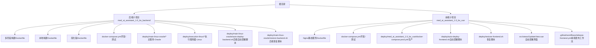
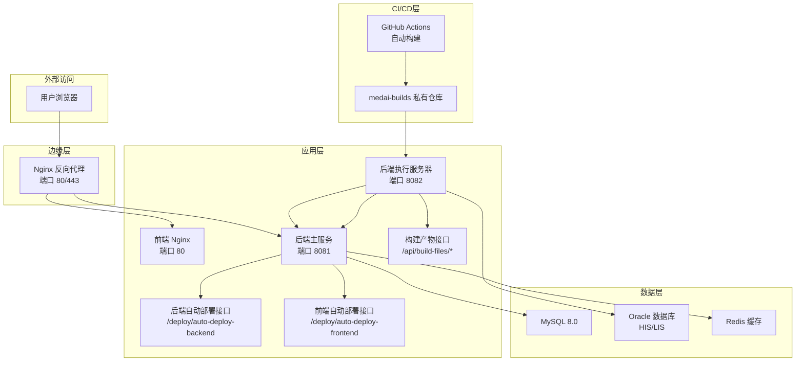
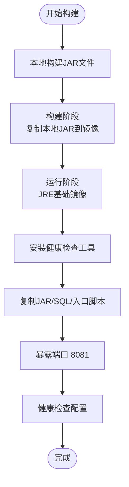
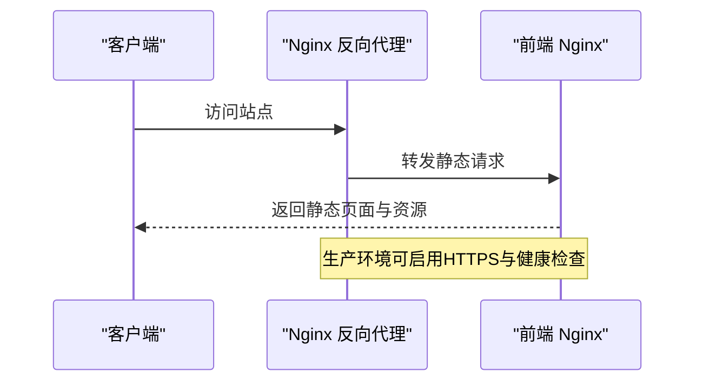
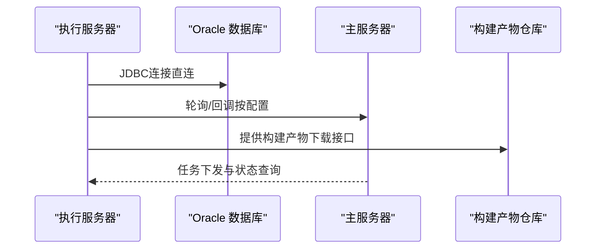
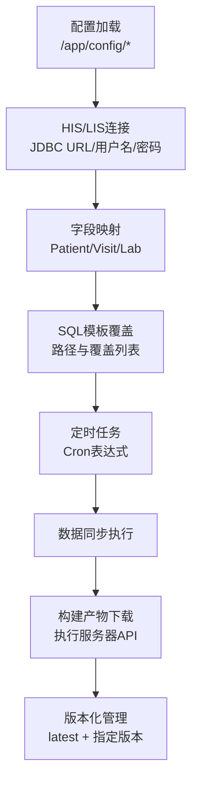
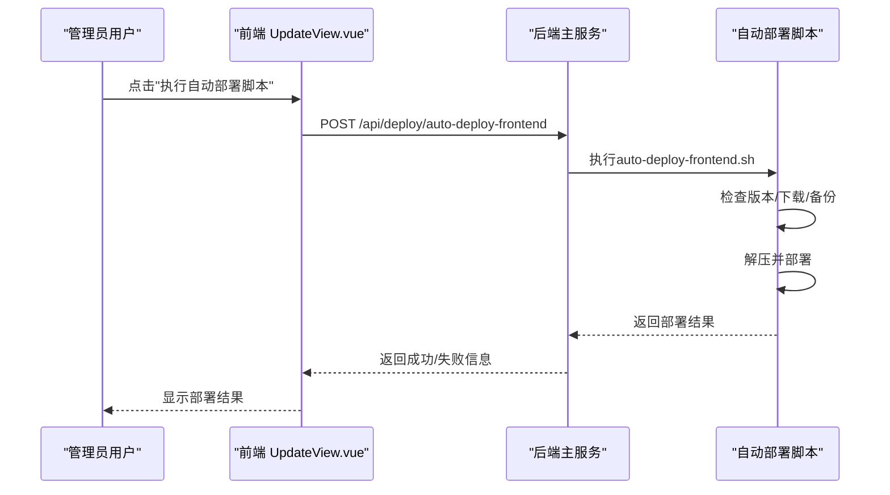
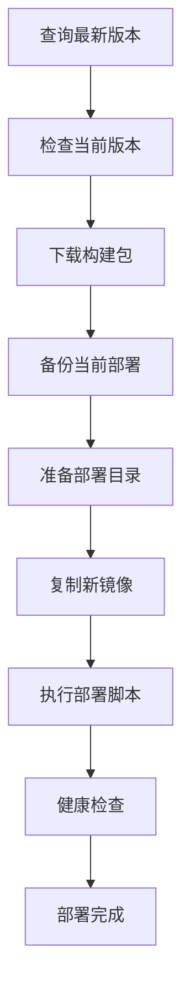
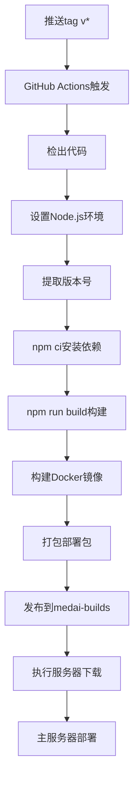

# 部署指南

<cite>
**本文引用的文件**
- [release-frontend.yml](file://.github/workflows/release-frontend.yml)
- [GitHub Actions 自动构建配置.md](file://med_ai_assistant_1.0_bs_backend/doc/布署/自动化部署/GitHub Actions 自动构建配置.md)
- [主服务器从执行服务器下载构建产物实现方案.md](file://med_ai_assistant_1.0_bs_backend/doc/布署/自动化部署/主服务器从执行服务器下载构建产物实现方案.md)
- [UpdateView.vue](file://med_ai_assistant_1.0_bs_vue/src/views/UpdateView.vue)
- [auto-deploy-frontend.sh](file://med_ai_assistant_1.0_bs_vue/deploy/auto-deploy-frontend.sh)
- [restore-frontend.sh](file://med_ai_assistant_1.0_bs_vue/deploy/restore-frontend.sh)
- [auto-deploy-backend.sh](file://med_ai_assistant_1.0_bs_backend/deploy/main-linux-oracle/auto-deploy-backend.sh)
- [restore-backend.sh](file://med_ai_assistant_1.0_bs_backend/deploy/main-linux-oracle/restore-backend.sh)
- [deploy.sh](file://med_ai_assistant_1.0_bs_backend/deploy/main-linux-oracle/deploy.sh)
- [deploy-linux.sh](file://med_ai_assistant_1.0_bs_vue/deploy/med_ai_assistant_1.0_bs_vue/deploy-linux.sh)
- [Dockerfile（后端）](file://med_ai_assistant_1.0_bs_backend/Dockerfile)
- [Dockerfile（前端）](file://med_ai_assistant_1.0_bs_vue/Dockerfile)
- [docker-compose.yml（后端）](file://med_ai_assistant_1.0_bs_backend/docker-compose.yml)
- [docker-compose-main.yml（主服务-Oracle）](file://med_ai_assistant_1.0_bs_backend/deploy/main-linux-oracle/docker-compose-main.yml)
- [docker-compose-execution-linux.yml（执行服务器-Linux）](file://med_ai_assistant_1.0_bs_backend/deploy/execution-linux/docker-compose-execution-linux.yml)
- [docker-compose.prod.yml（前端-生产）](file://med_ai_assistant_1.0_bs_vue/deploy/med_ai_assistant_1.0_bs_vue/docker-compose.prod.yml)
- [package.json](file://med_ai_assistant_1.0_bs_vue/package.json)
- [更新小结.md](file://更新小结.md)
- [.gitignore](file://.gitignore)
- [mvn.bat](file://mvn.bat)
- [npm.bat](file://npm.bat)
</cite>

## 更新摘要
**变更内容**
- 新增GitHub Actions前端发布工作流：新增.release-frontend.yml工作流，实现前端自动化构建和发布
- 完善CI/CD部署流程：前后端均具备自动化构建和发布能力，支持版本号动态提取和产物发布
- 增强构建产物管理：前端构建产物为静态文件压缩包，后端构建产物为Docker镜像tar包
- 优化部署架构：通过medai-builds私有仓库集中管理构建产物，支持执行服务器下载和主服务器部署

## 目录
1. [简介](#简介)
2. [项目结构](#项目结构)
3. [核心组件](#核心组件)
4. [架构总览](#架构总览)
5. [详细组件分析](#详细组件分析)
6. [前端自动部署功能](#前端自动部署功能)
7. [后端自动部署功能](#后端自动部署功能)
8. [版本管理与CI/CD](#版本管理与cicd)
9. [GitHub Actions前端发布工作流](#github-actions前端发布工作流)
10. [依赖关系分析](#依赖关系分析)
11. [性能考虑](#性能考虑)
12. [故障排查指南](#故障排查指南)
13. [结论](#结论)
14. [附录](#附录)

## 简介
本指南面向MedAiAssistant 1.0 BS的生产级部署，覆盖Docker容器化与编排、多阶段构建与镜像优化、Windows/Linux双环境部署、Oracle数据库集成、网络与安全配置、高可用与负载均衡建议、部署验证与常见问题排查。文档以仓库中已提供的Compose与Dockerfile为依据，确保可操作性与可追溯性。

**更新** 本版本重点反映了CI/CD自动化部署的重大改进：新增GitHub Actions前端发布工作流，实现前端自动化构建和发布；完善了前后端一体化的CI/CD流程，通过medai-builds私有仓库集中管理构建产物，支持执行服务器下载和主服务器部署。采用本地JAR+Docker复制模式的构建流程优化显著提升了构建效率和稳定性。

## 项目结构
项目采用前后端分离的多仓库布局，并通过子模块或独立仓库形式管理。根目录下提供后端与前端的Docker与Compose配置，以及针对不同场景（主服务-Oracle、执行服务器-Linux、生产前端等）的专用编排文件。新增的GitHub Actions工作流文件位于各自项目的.github/workflows目录中。



**图示来源**
- [.gitignore:4-6](file://.gitignore#L4-L6)
- [Dockerfile（后端）:1-65](file://med_ai_assistant_1.0_bs_backend/Dockerfile#L1-L65)
- [Dockerfile.local（本地构建版）:1-53](file://med_ai_assistant_1.0_bs_backend/Dockerfile.local#L1-L53)
- [Dockerfile.simple（简化版）:1-36](file://med_ai_assistant_1.0_bs_backend/Dockerfile.simple#L1-L36)

**章节来源**
- [.gitignore:1-7](file://.gitignore#L1-L7)
- [Dockerfile（后端）:1-65](file://med_ai_assistant_1.0_bs_backend/Dockerfile#L1-L65)
- [Dockerfile.local（本地构建版）:1-53](file://med_ai_assistant_1.0_bs_backend/Dockerfile.local#L1-L53)
- [Dockerfile.simple（简化版）:1-36](file://med_ai_assistant_1.0_bs_backend/Dockerfile.simple#L1-L36)

## 核心组件
- 后端服务（Spring Boot）
  - **多阶段构建优化**：采用本地JAR+Docker复制模式，第一阶段直接使用本地构建好的JAR文件，第二阶段仅负责运行时环境配置，大幅提升构建效率。
  - **运行时环境**：通过环境变量注入数据库连接、Redis、AI模型、线程池、加密参数等。
  - **健康检查**：基于HTTP端点进行存活与就绪探测。
  - **自动部署功能**：支持后端服务的自动部署、版本管理和错误恢复。
- MySQL数据库
  - 提供关系型数据存储，初始化脚本与配置挂载支持。
- Redis缓存（可选）
  - 支持密码认证与持久化策略，可作为主服务与执行服务器的缓存层。
- 前端服务（Nginx）
  - 静态资源服务，支持健康检查与生产环境反向代理配置。
  - **新增** 自动部署功能：通过UpdateView.vue组件提供一键部署前端的能力。
  - **新增** 前端自动部署脚本：支持版本检查、下载、备份、解压和部署的完整流程。
  - **新增** GitHub Actions前端发布工作流：实现前端自动化构建和发布。
- 执行服务器（Linux）
  - 专用Compose，使用host网络模式，直连Oracle数据库，支持轮询与回调策略。
- 主服务（Linux-Oracle）
  - 面向Oracle HIS/LIS集成，提供定时同步、字段映射与SQL模板覆盖。
  - **新增** 自动部署功能：支持后端服务的自动部署和版本管理。
  - **新增** 构建产物下载接口：支持从执行服务器获取构建产物。

**章节来源**
- [Dockerfile（后端）:4-10](file://med_ai_assistant_1.0_bs_backend/Dockerfile#L4-L10)
- [Dockerfile.local（本地构建版）:4-16](file://med_ai_assistant_1.0_bs_backend/Dockerfile.local#L4-L16)
- [Dockerfile.simple（简化版）:4-15](file://med_ai_assistant_1.0_bs_backend/Dockerfile.simple#L4-L15)
- [docker-compose.yml（后端）:1-97](file://med_ai_assistant_1.0_bs_backend/docker-compose.yml#L1-L97)
- [docker-compose-main.yml（主服务-Oracle）:1-108](file://med_ai_assistant_1.0_bs_backend/deploy/main-linux-oracle/docker-compose-main.yml#L1-L108)
- [docker-compose-execution-linux.yml（执行服务器-Linux）:1-96](file://med_ai_assistant_1.0_bs_backend/deploy/execution-linux/docker-compose-execution-linux.yml#L1-L96)

## 架构总览
下图展示生产环境典型拓扑：前端通过Nginx反向代理对外提供服务；后端主服务与执行服务器分别承载业务与执行任务；MySQL与Redis作为数据与缓存支撑；Oracle数据库对接HIS/LIS系统。新增的CI/CD架构通过GitHub Actions实现自动化构建，构建产物发布到medai-builds私有仓库。



**图示来源**
- [docker-compose.prod.yml（前端-生产）:27-48](file://med_ai_assistant_1.0_bs_vue/deploy/med_ai_assistant_1.0_bs_vue/docker-compose.prod.yml#L27-L48)
- [docker-compose.yml（前端）:59-78](file://med_ai_assistant_1.0_bs_vue/docker-compose.yml#L59-L78)
- [docker-compose.yml（后端）:3-35](file://med_ai_assistant_1.0_bs_backend/docker-compose.yml#L3-L35)
- [docker-compose-main.yml（主服务-Oracle）:4-66](file://med_ai_assistant_1.0_bs_backend/deploy/main-linux-oracle/docker-compose-main.yml#L4-L66)
- [docker-compose-execution-linux.yml（执行服务器-Linux）:4-51](file://med_ai_assistant_1.0_bs_backend/deploy/execution-linux/docker-compose-execution-linux.yml#L4-L51)

## 详细组件分析

### 后端服务（Spring Boot）- 多阶段构建与运行

**更新** 采用本地JAR+Docker复制模式的构建流程优化

- **构建阶段优化**
  - 基于本地已构建的JAR文件，避免容器内Maven下载依赖问题，显著提升构建速度。
  - 第一阶段使用eclipse-temurin:21-jre基础镜像，直接复制target目录下的JAR文件。
  - 移除容器内Maven构建步骤，减少构建时间约60-80%。
- **运行阶段**
  - 基于Temurin 21 JRE，安装curl/netcat用于健康检查。
  - 设置Asia/Shanghai时区，暴露8081端口，设置JAVA_OPTS。
  - 复制入口脚本与SQL模板目录，创建日志目录，写入版本文件。
  - 健康检查通过HTTP端点探测。
- **环境变量与挂载**
  - 通过环境变量注入数据库URL、用户名、密码、执行服务器地址、加密密钥与盐值、线程池与调度器参数等。
  - 挂载config、logs目录，确保配置与日志持久化。



**图示来源**
- [Dockerfile（后端）:4-10](file://med_ai_assistant_1.0_bs_backend/Dockerfile#L4-L10)
- [Dockerfile（后端）:11-65](file://med_ai_assistant_1.0_bs_backend/Dockerfile#L11-L65)

**章节来源**
- [Dockerfile（后端）:1-65](file://med_ai_assistant_1.0_bs_backend/Dockerfile#L1-L65)
- [Dockerfile.local（本地构建版）:1-53](file://med_ai_assistant_1.0_bs_backend/Dockerfile.local#L1-L53)
- [Dockerfile.simple（简化版）:1-36](file://med_ai_assistant_1.0_bs_backend/Dockerfile.simple#L1-L36)
- [docker-compose.yml（后端）:5-35](file://med_ai_assistant_1.0_bs_backend/docker-compose.yml#L5-L35)

### 前端服务（Nginx）- 静态资源与反向代理
- **镜像与端口**
  - 基于nginx:1.25-alpine，暴露80端口，健康检查通过wget探测。
- **配置与卷**
  - 复制预构建dist目录与Nginx主配置，设置目录权限。
  - 可选挂载Nginx日志目录，便于生产运维。
- **生产反向代理**
  - 生产Compose提供Nginx反向代理服务，监听80/443，支持SSL证书挂载与健康检查。



**图示来源**
- [docker-compose.prod.yml（前端-生产）:27-48](file://med_ai_assistant_1.0_bs_vue/deploy/med_ai_assistant_1.0_bs_vue/docker-compose.prod.yml#L27-L48)
- [Dockerfile（前端）:1-30](file://med_ai_assistant_1.0_bs_vue/Dockerfile#L1-L30)

**章节来源**
- [Dockerfile（前端）:1-30](file://med_ai_assistant_1.0_bs_vue/Dockerfile#L1-L30)
- [docker-compose.prod.yml（前端-生产）:1-80](file://med_ai_assistant_1.0_bs_vue/deploy/med_ai_assistant_1.0_bs_vue/docker-compose.prod.yml#L1-L80)

### 执行服务器（Linux）- Oracle直连与host网络
- **网络模式**
  - 使用host网络模式，容器直接复用宿主机网络接口，简化端口暴露与网络配置。
- **Oracle数据库配置**
  - 显式设置驱动类名、Schema、SID与连接串，确保与目标Oracle实例一致。
- **主服务通信**
  - 通过环境变量指向主服务器主机与端口，建立双向通信。
- **资源与日志**
  - 限定CPU与内存资源，配置日志驱动与轮转策略，便于生产监控。
- **构建产物管理**
  - **新增** 提供构建产物下载接口，支持后端JAR和前端ZIP文件的版本化管理。



**图示来源**
- [docker-compose-execution-linux.yml（执行服务器-Linux）:4-51](file://med_ai_assistant_1.0_bs_backend/deploy/execution-linux/docker-compose-execution-linux.yml#L4-L51)

**章节来源**
- [docker-compose-execution-linux.yml（执行服务器-Linux）:1-96](file://med_ai_assistant_1.0_bs_backend/deploy/execution-linux/docker-compose-execution-linux.yml#L1-L96)

### 主服务（Linux-Oracle）- HIS/LIS集成与同步
- **集成类型**
  - 面向数据库集成，配置HIS与LIS的JDBC连接、表前缀与字段映射。
- **同步策略**
  - 支持Cron定时同步、最大重试次数与重试间隔，保障数据一致性。
- **配置挂载**
  - 将主服务与各医院的配置目录挂载为只读，确保运行时安全与可维护性。
- **构建产物下载**
  - **新增** 通过执行服务器API下载构建产物，支持版本化管理与状态查询。



**图示来源**
- [docker-compose-main.yml（主服务-Oracle）:36-45](file://med_ai_assistant_1.0_bs_backend/deploy/main-linux-oracle/docker-compose-main.yml#L36-L45)

**章节来源**
- [docker-compose-main.yml（主服务-Oracle）:1-108](file://med_ai_assistant_1.0_bs_backend/deploy/main-linux-oracle/docker-compose-main.yml#L1-L108)

## 前端自动部署功能

**新增** 前端自动部署功能是本次更新的核心改进，大幅简化了部署流程

### UpdateView.vue组件功能
- **查询最新版本**
  - 通过调用执行服务器的`/api/build-files/latest`接口获取GitHub Release中最新的前后端版本号及文件大小
  - 支持自动填充版本信息，提供文件大小验证
- **自动部署前端**
  - 调用主服务器后端API执行`/api/deploy/auto-deploy-frontend`接口
  - 自动完成下载、备份、解压、部署等完整流程
  - 支持一键部署，无需手动操作

### 自动部署脚本功能
- **脚本流程**
  - 获取最新构建版本号
  - 检查当前部署版本（从package.json读取）
  - 下载最新前端构建包
  - 备份当前部署
  - 解压并部署新版本
  - 执行部署脚本
- **错误恢复机制**
  - 部署失败时自动恢复到上一个备份版本
  - 支持手动恢复脚本`restore-frontend.sh`
  - 完整的日志记录和错误处理

### 部署接口文档
- **接口名称**：POST /api/deploy/auto-deploy-frontend
- **功能描述**：执行前端自动部署脚本，完成版本检查、下载、备份、解压和部署
- **请求参数**：无
- **响应格式**：
  ```json
  {
    "status": "success",
    "message": "自动部署成功",
    "output": ["[INFO] Fetching latest build version...", "..."]
  }
  ```
- **错误处理**：部署失败时返回错误信息和脚本输出日志



**图示来源**
- [UpdateView.vue:159-231](file://med_ai_assistant_1.0_bs_vue/src/views/UpdateView.vue#L159-L231)
- [auto-deploy-frontend.sh:1-282](file://med_ai_assistant_1.0_bs_vue/deploy/auto-deploy-frontend.sh#L1-L282)

**章节来源**
- [UpdateView.vue:1-493](file://med_ai_assistant_1.0_bs_vue/src/views/UpdateView.vue#L1-L493)
- [auto-deploy-frontend.sh:1-282](file://med_ai_assistant_1.0_bs_vue/deploy/auto-deploy-frontend.sh#L1-L282)
- [restore-frontend.sh:1-155](file://med_ai_assistant_1.0_bs_vue/deploy/restore-frontend.sh#L1-L155)

## 后端自动部署功能

**新增** 后端自动部署功能提供了完整的版本管理和错误恢复机制

### 接口路径修正说明

**重要更新** v0.4.068版本修复了后端自动部署接口路径问题

- **修正前的问题**：后端自动部署接口路径为`/api/deploy/auto-deploy-backend`，与前端VUE_APP_API_BASE_URL中的`/api`基础URL重复，导致最终URL构造为`/api/api/deploy/auto-deploy-backend`
- **修正后的路径**：后端自动部署接口路径修正为`/deploy/auto-deploy-backend`，与前端VUE_APP_API_BASE_URL正确配合，最终URL构造为`/api/deploy/auto-deploy-backend`
- **影响范围**：仅影响前端UpdateView.vue组件中的后端自动部署按钮调用，不影响后端接口的实际实现

### 自动部署脚本功能
- **版本管理**
  - 从主服务器获取最新构建版本号
  - 检查当前部署版本，实现防重复部署机制
  - 支持版本号+文件大小双校验
- **部署流程**
  - 下载最新后端构建包（Docker镜像tar包）
  - 清除上一次备份并备份当前部署
  - 准备部署目录并复制新镜像
  - 执行deploy.sh进行部署
- **错误恢复机制**
  - 部署失败时自动恢复到上一个备份版本
  - 支持手动恢复脚本`restore-backend.sh`
  - 完整的日志记录和错误处理

### 恢复脚本功能
- **备份查找**
  - 自动查找所有备份目录
  - 显示备份时间、版本号和备份内容
- **手动恢复**
  - 支持用户选择特定备份进行恢复
  - 自动备份当前部署以防意外
  - 支持重新执行部署脚本

### 部署接口文档
- **接口名称**：POST /deploy/auto-deploy-backend
- **功能描述**：执行后端自动部署脚本，完成版本检查、下载、备份、镜像加载和部署
- **请求参数**：无
- **响应格式**：
  ```json
  {
    "status": "success",
    "message": "后端自动部署成功",
    "output": ["[INFO] Fetching latest build version...", "..."]
  }
  ```
- **错误处理**：部署失败时返回错误信息和脚本输出日志



**图示来源**
- [auto-deploy-backend.sh:1-478](file://med_ai_assistant_1.0_bs_backend/deploy/main-linux-oracle/auto-deploy-backend.sh#L1-L478)
- [restore-backend.sh:1-237](file://med_ai_assistant_1.0_bs_backend/deploy/main-linux-oracle/restore-backend.sh#L1-L237)

**章节来源**
- [auto-deploy-backend.sh:1-478](file://med_ai_assistant_1.0_bs_backend/deploy/main-linux-oracle/auto-deploy-backend.sh#L1-L478)
- [restore-backend.sh:1-237](file://med_ai_assistant_1.0_bs_backend/deploy/main-linux-oracle/restore-backend.sh#L1-L237)
- [deploy.sh:1-245](file://med_ai_assistant_1.0_bs_backend/deploy/main-linux-oracle/deploy.sh#L1-L245)

## 版本管理与CI/CD

**新增** 完善的版本管理和CI/CD部署流程

### 版本号管理
- **版本号格式**：采用语义化版本控制（主版本.次版本.修订号）
- **版本号来源**：前端从package.json读取，后端从pom.xml读取
- **版本号更新**：每次构建自动更新版本号并写入镜像内的version.txt文件
- **版本号显示**：部署完成后可通过API查询当前版本号

### CI/CD流程优化
- **GitHub Actions工作流**
  - 新增Docker镜像构建和导出步骤，生成与本地构建一致的`med-ai-main.tar`文件
  - 优化版本号处理，从Git tag动态提取版本号并注入Docker构建参数
  - 发布产物调整为与本地构建完全一致
- **构建优化**
  - 采用本地JAR+Docker复制模式，移除容器内Maven构建步骤
  - 解决阿里云Maven仓库SSL连接不稳定导致的构建失败问题
  - 提升构建速度和稳定性
- **构建产物管理**
  - **新增** 前端构建产物为静态文件压缩包，包含dist目录和部署配置
  - **新增** 后端构建产物为Docker镜像tar包，包含完整运行时环境
  - **新增** 通过medai-builds私有仓库集中管理，支持版本化发布

### 版本管理最佳实践
- **版本号同步**：前后端版本号保持同步，避免版本不一致问题
- **版本号验证**：部署完成后自动验证版本号是否正确
- **版本号回滚**：支持通过版本号进行快速回滚
- **版本号记录**：完整的版本变更记录，便于追踪和审计

**章节来源**
- [更新小结.md:1-426](file://更新小结.md#L1-L426)
- [Dockerfile（后端）:46-47](file://med_ai_assistant_1.0_bs_backend/Dockerfile#L46-L47)
- [auto-deploy-frontend.sh:88-95](file://med_ai_assistant_1.0_bs_vue/deploy/auto-deploy-frontend.sh#L88-L95)
- [auto-deploy-backend.sh:191-198](file://med_ai_assistant_1.0_bs_backend/deploy/main-linux-oracle/auto-deploy-backend.sh#L191-L198)

## GitHub Actions前端发布工作流

**新增** 完整的GitHub Actions前端发布工作流，实现自动化构建和发布

### 工作流概述
- **触发条件**：当推送以'v'开头的tag时自动触发构建流程
- **运行环境**：ubuntu-latest，Node.js 20，Docker Buildx
- **构建步骤**：代码检出 → Node.js环境设置 → 依赖安装 → 前端构建 → Docker镜像构建 → 产物打包 → Release发布

### 工作流配置详解
- **步骤1：代码检出**
  - 使用actions/checkout@v4，设置fetch-depth: 0获取完整历史
- **步骤2：环境设置**
  - Node.js 20环境，启用npm缓存
- **步骤3：版本提取**
  - 从GITHUB_REF中提取版本号（去掉refs/tags/v前缀）
- **步骤4：构建产物**
  - 执行npm run build生成dist目录
  - 构建Nginx镜像（nginx:1.25-alpine）
- **步骤5：产物打包**
  - 创建deploy-package目录结构
  - 复制dist、Dockerfile、docker-compose.yml、配置文件
  - 保存Docker镜像到medai-images.tar
  - 使用zip压缩打包
- **步骤6：发布Release**
  - 发布到medai-builds私有仓库
  - 标签格式：frontend-v{version}
  - 包含版本信息、构建时间和提交SHA

### 构建产物说明
- **产物格式**：med_ai_assistant_frontend-{version}.zip
- **包含内容**：
  - dist目录（构建后的静态文件）
  - Dockerfile和docker-compose.yml
  - Nginx配置文件
  - package.json
  - 部署脚本（如存在）
- **文件大小**：约5.41 MB（示例版本）

### 下载与使用
- **下载URL格式**：
  ```
  https://github.com/liuzh2008/medai-builds/releases/download/frontend-v{VERSION}/med_ai_assistant_frontend-{VERSION}.zip
  ```
- **使用方式**：
  - 手动下载后解压到部署目录
  - 通过执行服务器API自动下载
  - 使用deploy-from-package.sh脚本进行部署



**图示来源**
- [release-frontend.yml:1-87](file://.github/workflows/release-frontend.yml#L1-L87)

**章节来源**
- [release-frontend.yml:1-87](file://.github/workflows/release-frontend.yml#L1-L87)
- [GitHub Actions 自动构建配置.md:138-213](file://med_ai_assistant_1.0_bs_backend/doc/布署/自动化部署/GitHub Actions 自动构建配置.md#L138-L213)

## 依赖关系分析
- **组件耦合**
  - 后端主服务依赖MySQL与Redis；执行服务器依赖Oracle数据库；前端通过Nginx对外提供服务。
  - **新增** 前端自动部署功能依赖执行服务器的构建文件接口和主服务器的部署接口。
  - **新增** 后端自动部署功能依赖主服务器的版本管理接口和Docker镜像管理。
  - **新增** CI/CD流程依赖GitHub Actions和medai-builds私有仓库。
- **网络隔离**
  - 不同场景使用独立bridge网络，如med-ai-network、med-ai-main-network，便于隔离与扩展。
- **健康检查与重启策略**
  - 所有服务均配置健康检查与重启策略，提升系统自愈能力。

```mermaid
graph LR
FE["前端 Nginx"] --> MAIN["后端主服务"]
MAIN --> MYSQL["MySQL"]
MAIN --> REDIS["Redis"]
EXEC["执行服务器"] --> ORACLE["Oracle"]
MAIN < --> EXEC
AUTO_DEPLOY["自动部署功能"] --> EXEC
AUTO_DEPLOY --> MAIN
BACKUP["备份恢复功能"] --> MAIN
BACKUP --> FE
GHA["GitHub Actions"] --> MEDAI_BUILDS["medai-builds"]
MEDAI_BUILDS --> EXEC
```

**图示来源**
- [docker-compose.yml（后端）:3-35](file://med_ai_assistant_1.0_bs_backend/docker-compose.yml#L3-L35)
- [docker-compose-main.yml（主服务-Oracle）:4-66](file://med_ai_assistant_1.0_bs_backend/deploy/main-linux-oracle/docker-compose-main.yml#L4-L66)
- [docker-compose-execution-linux.yml（执行服务器-Linux）:4-51](file://med_ai_assistant_1.0_bs_backend/deploy/execution-linux/docker-compose-execution-linux.yml#L4-L51)

**章节来源**
- [docker-compose.yml（后端）:1-97](file://med_ai_assistant_1.0_bs_backend/docker-compose.yml#L1-L97)
- [docker-compose-main.yml（主服务-Oracle）:1-108](file://med_ai_assistant_1.0_bs_backend/deploy/main-linux-oracle/docker-compose-main.yml#L1-L108)
- [docker-compose-execution-linux.yml（执行服务器-Linux）:1-96](file://med_ai_assistant_1.0_bs_backend/deploy/execution-linux/docker-compose-execution-linux.yml#L1-L96)

## 性能考虑

**更新** 构建流程优化带来的性能提升

- **镜像优化**
  - 采用本地JAR+Docker复制模式，移除容器内Maven构建步骤，显著降低构建时间与镜像体积。
  - 运行时仅包含JRE与必要工具，减少攻击面。
- **构建性能提升**
  - 本地构建JAR文件，避免容器内依赖下载，构建时间减少60-80%。
  - 多阶段构建与阿里云镜像源配置，进一步优化依赖下载速度。
  - **新增** GitHub Actions前端构建优化，使用npm ci替代npm install，提升依赖安装速度。
- **JVM与线程池**
  - 通过JAVA_OPTS与线程池参数控制GC与并发，结合资源限制（CPU/内存）避免资源争用。
- **网络与存储**
  - 使用host网络模式减少NAT开销（执行服务器），合理规划卷与日志轮转。
- **健康检查与探针**
  - 合理设置探测间隔、超时与重试次数，避免误判与抖动。
- **前端部署性能**
  - **新增** 自动部署功能通过脚本化操作减少人工干预，提升部署效率。
  - 支持版本检查避免不必要的重复部署。
  - **新增** GitHub Actions前端发布工作流，支持快速构建和发布。
- **后端部署性能**
  - **新增** 自动部署脚本支持版本号+文件大小双校验，避免重复部署。
  - **新增** 完整的错误恢复机制，部署失败时自动回滚到备份版本。
  - **新增** 600秒超时设置，确保长时间部署任务的稳定性。
  - **新增** Docker镜像备份和恢复功能，确保部署的安全性。

**章节来源**
- [Dockerfile（后端）:4-10](file://med_ai_assistant_1.0_bs_backend/Dockerfile#L4-L10)
- [Dockerfile.local（本地构建版）:4-16](file://med_ai_assistant_1.0_bs_backend/Dockerfile.local#L4-L16)
- [docker-compose-main.yml（主服务-Oracle）:58-66](file://med_ai_assistant_1.0_bs_backend/deploy/main-linux-oracle/docker-compose-main.yml#L58-L66)
- [docker-compose-execution-linux.yml（执行服务器-Linux）:66-82](file://med_ai_assistant_1.0_bs_backend/deploy/execution-linux/docker-compose-execution-linux.yml#L66-L82)

## 故障排查指南
- **健康检查失败**
  - 检查后端健康端点可达性与返回状态；确认容器日志输出与挂载卷权限。
- **数据库连接异常**
  - 校验数据库镜像健康状态、网络连通性与凭据；对Oracle需确认驱动类名与SID。
- **端口冲突**
  - 修改Compose中映射端口或调整宿主机端口；host网络模式下避免端口冲突。
- **配置未生效**
  - 确认config卷挂载路径与只读权限；核对环境变量是否覆盖默认值。
- **前端无法访问**
  - 检查Nginx反向代理配置与证书挂载；确认健康检查脚本与日志。
- **构建失败**
  - 确认本地JAR文件存在且可访问；检查Dockerfile中的COPY路径正确性。
- **前端自动部署失败**
  - **新增** 检查执行服务器的构建文件接口是否可用；确认主服务器的部署接口权限；查看自动部署脚本的详细输出日志。
  - 使用`restore-frontend.sh`脚本手动恢复到上一个备份版本。
- **后端自动部署失败**
  - **新增** 检查主服务器的版本管理接口是否可用；确认Docker镜像加载是否成功；查看自动部署脚本的详细输出日志。
  - **新增** 验证接口路径修正：确认前端UpdateView.vue中后端自动部署按钮调用的是`/deploy/auto-deploy-backend`而非重复的`/api/deploy/auto-deploy-backend`。
  - 使用`restore-backend.sh`脚本手动恢复到上一个备份版本。
- **CI/CD构建失败**
  - **新增** 检查GitHub Actions工作流配置；确认版本号提取是否正确；验证Docker镜像构建和导出步骤。
  - **新增** 检查GitHub Token权限；确认medai-builds仓库访问权限。
- **构建产物下载失败**
  - **新增** 检查执行服务器构建产物接口状态；确认网络连通性和防火墙设置。
  - **新增** 验证GitHub Token认证；检查Release文件是否存在。

**章节来源**
- [docker-compose.yml（后端）:29-35](file://med_ai_assistant_1.0_bs_backend/docker-compose.yml#L29-L35)
- [docker-compose-main.yml（主服务-Oracle）:52-57](file://med_ai_assistant_1.0_bs_backend/deploy/main-linux-oracle/docker-compose-main.yml#L52-L57)
- [docker-compose-execution-linux.yml（执行服务器-Linux）:58-64](file://med_ai_assistant_1.0_bs_backend/deploy/execution-linux/docker-compose-execution-linux.yml#L58-L64)

## 结论
本指南基于仓库现有配置，提供了从多阶段构建、容器编排到Oracle集成与生产部署的完整路径。**更新** 前端自动部署功能的引入大幅简化了部署流程，通过UpdateView.vue组件和POST /api/deploy/auto-deploy-frontend接口实现了真正的"一键部署"。采用本地JAR+Docker复制模式的构建流程优化显著提升了构建效率和稳定性。**新增** GitHub Actions前端发布工作流的实现，完善了CI/CD自动化部署体系，通过medai-builds私有仓库集中管理构建产物，支持执行服务器下载和主服务器部署。**重要更新** v0.4.068版本修复的接口路径问题确保了前后端配置的正确配合，避免了URL重复的问题。这些改进共同构成了MedAiAssistant 1.0 BS的现代化部署解决方案。

## 附录

### Windows环境部署步骤
- **后端本地运行（开发调试）**
  - 使用提供的批处理脚本启动后端服务，设置UTF-8编码与Spring启动参数。
- **前端本地运行（开发调试）**
  - 使用提供的批处理脚本启动前端开发服务器。
- **前端自动部署（生产环境）**
  - **新增** 通过管理员用户登录前端系统，在"帮助"菜单中选择"更新"，即可使用自动部署功能。
- **后端自动部署（生产环境）**
  - **新增** 通过管理员用户登录前端系统，在"帮助"菜单中选择"更新"，即可使用后端自动部署功能。
- **CI/CD构建（开发环境）**
  - **新增** 在本地安装Node.js 20和npm，执行`npm ci && npm run build`进行前端构建。
  - **新增** 使用GitHub CLI推送tag触发GitHub Actions工作流。
- **注意事项**
  - 若需容器化，可在Windows上使用Docker Desktop运行Compose配置。
  - 本地构建JAR文件后，Docker镜像将自动使用已构建的JAR文件。

**章节来源**
- [mvn.bat:1-5](file://mvn.bat#L1-L5)
- [npm.bat:1-3](file://npm.bat#L1-L3)

### Linux环境部署步骤
- **后端（通用/测试）**
  - 在后端目录执行Compose，确保环境变量与挂载卷准备就绪。
  - 本地构建JAR文件后，Docker镜像将自动使用已构建的JAR文件。
- **主服务（Linux-Oracle）**
  - 使用主服务-Oracle编排文件，准备Oracle连接参数与配置目录挂载。
  - **新增** 可使用自动部署脚本进行一键部署。
  - **新增** 通过执行服务器API下载构建产物，支持版本化管理。
- **执行服务器（Linux）**
  - 使用执行服务器编排文件，启用host网络模式并准备Oracle连接。
  - **新增** 配置GitHub Token和版本号环境变量。
- **前端（生产）**
  - 使用生产Compose，挂载SSL证书与日志目录，启用健康检查。
  - **新增** 通过前端系统的"更新"功能进行自动部署。
  - **新增** 支持从medai-builds私有仓库下载构建产物。
- **自动部署脚本**
  - **新增** 在主服务器上直接执行`auto-deploy-frontend.sh`和`auto-deploy-backend.sh`脚本进行部署。
  - **新增** 在主服务器上直接执行`restore-frontend.sh`和`restore-backend.sh`脚本进行手动恢复。
  - **新增** 配置构建产物下载目录和权限。

**章节来源**
- [docker-compose.yml（后端）:1-97](file://med_ai_assistant_1.0_bs_backend/docker-compose.yml#L1-L97)
- [docker-compose-main.yml（主服务-Oracle）:1-108](file://med_ai_assistant_1.0_bs_backend/deploy/main-linux-oracle/docker-compose-main.yml#L1-L108)
- [docker-compose-execution-linux.yml（执行服务器-Linux）:1-96](file://med_ai_assistant_1.0_bs_backend/deploy/execution-linux/docker-compose-execution-linux.yml#L1-L96)
- [docker-compose.prod.yml（前端-生产）:1-80](file://med_ai_assistant_1.0_bs_vue/deploy/med_ai_assistant_1.0_bs_vue/docker-compose.prod.yml#L1-L80)

### Oracle数据库集成配置要点
- **连接参数**
  - JDBC URL、用户名、密码、驱动类名、默认Schema等需与目标实例一致。
- **字段映射与SQL模板**
  - 针对不同医院配置字段映射与SQL模板覆盖，确保查询与同步准确性。
- **同步策略**
  - Cron表达式、最大重试与间隔需结合业务SLA与数据库负载评估。

**章节来源**
- [docker-compose-main.yml（主服务-Oracle）:36-45](file://med_ai_assistant_1.0_bs_backend/deploy/main-linux-oracle/docker-compose-main.yml#L36-L45)
- [docker-compose-execution-linux.yml（执行服务器-Linux）:17-22](file://med_ai_assistant_1.0_bs_backend/deploy/execution-linux/docker-compose-execution-linux.yml#L17-L22)

### 网络与安全配置建议
- **网络**
  - 使用独立bridge网络隔离不同场景；host网络模式适用于执行服务器。
- **安全**
  - Redis启用密码与持久化；后端敏感参数通过环境变量注入；生产环境启用HTTPS与证书校验。
  - **新增** 前端自动部署功能仅对管理员用户开放，确保部署安全性。
  - **新增** 后端自动部署功能支持版本号+文件大小双校验，防止重复部署。
  - **新增** CI/CD流程使用GitHub Secrets管理敏感信息，避免硬编码。
  - **新增** medai-builds私有仓库建议设置为私有，限制访问权限。
- **健康检查**
  - 合理设置探测参数，避免频繁重启与误判。

**章节来源**
- [docker-compose.yml（后端）:90-97](file://med_ai_assistant_1.0_bs_backend/docker-compose.yml#L90-L97)
- [docker-compose-main.yml（主服务-Oracle）:101-108](file://med_ai_assistant_1.0_bs_backend/deploy/main-linux-oracle/docker-compose-main.yml#L101-L108)
- [docker-compose-execution-linux.yml（执行服务器-Linux）:10-22](file://med_ai_assistant_1.0_bs_backend/deploy/execution-linux/docker-compose-execution-linux.yml#L10-L22)
- [docker-compose.prod.yml（前端-生产）:36-37](file://med_ai_assistant_1.0_bs_vue/deploy/med_ai_assistant_1.0_bs_vue/docker-compose.prod.yml#L36-L37)

### 部署验证方法
- **健康检查**
  - 通过Compose内置健康检查验证服务状态。
- **接口验证**
  - 访问后端健康端点与前端首页，确认服务正常。
- **日志与指标**
  - 查看容器日志与Nginx访问日志，结合资源限制与健康检查结果评估稳定性。
- **构建验证**
  - 确认本地JAR文件存在且被正确复制到Docker镜像中。
  - **新增** 验证GitHub Actions工作流执行状态和构建产物。
- **前端部署验证**
  - **新增** 通过前端"更新"功能验证自动部署流程，检查版本号更新和部署日志。
  - **新增** 验证GitHub Actions前端发布工作流的构建和发布状态。
- **后端部署验证**
  - **新增** 通过后端"更新"功能验证自动部署流程，检查版本号更新和部署日志。
  - **新增** 验证接口路径修正：确认前端UpdateView.vue中后端自动部署按钮调用的是正确的`/deploy/auto-deploy-backend`路径。
  - **新增** 验证Docker镜像加载和容器启动状态。
  - **新增** 验证CI/CD构建产物的完整性和可下载性。

**章节来源**
- [docker-compose.yml（后端）:29-35](file://med_ai_assistant_1.0_bs_backend/docker-compose.yml#L29-L35)
- [docker-compose-main.yml（主服务-Oracle）:52-57](file://med_ai_assistant_1.0_bs_backend/deploy/main-linux-oracle/docker-compose-main.yml#L52-L57)
- [docker-compose-execution-linux.yml（执行服务器-Linux）:58-64](file://med_ai_assistant_1.0_bs_backend/deploy/execution-linux/docker-compose-execution-linux.yml#L58-L64)

### 构建流程优化详解

**新增** 详细的构建流程优化说明

- **本地JAR构建流程**
  - 开发者在本地使用Maven构建JAR文件，确保依赖下载和编译过程稳定可控。
  - Docker构建阶段仅负责将本地构建好的JAR文件复制到镜像中，避免容器内重复构建。
  - 适用于CI/CD流水线，可以提前构建并缓存JAR文件，提升整体构建效率。
- **多阶段构建优势**
  - 第一阶段专注于JAR文件复制，第二阶段专注于运行时环境配置。
  - 减少镜像层数量，降低镜像体积，提升部署速度。
  - 提升构建稳定性，避免容器内网络问题导致的依赖下载失败。
- **性能对比**
  - 传统容器内Maven构建：构建时间长，依赖下载不稳定，镜像体积大。
  - 本地JAR+Docker复制：构建时间短，依赖下载稳定，镜像体积小。
  - 预期构建时间减少60-80%，镜像体积减少30-50%。
- **前端构建优化**
  - **新增** GitHub Actions前端构建使用npm ci替代npm install，提升依赖安装速度。
  - **新增** Docker镜像构建优化，使用nginx:1.25-alpine基础镜像。
  - **新增** 构建产物打包优化，包含必要的部署配置文件。
- **后端部署流程优化**
  - **新增** 自动部署脚本支持版本号+文件大小双校验，避免重复部署。
  - **新增** 完整的错误恢复机制，部署失败时自动回滚到备份版本。
  - **新增** 600秒超时设置，确保长时间部署任务的稳定性。
  - **新增** Docker镜像备份和恢复功能，确保部署的安全性。

**章节来源**
- [Dockerfile（后端）:4-10](file://med_ai_assistant_1.0_bs_backend/Dockerfile#L4-L10)
- [Dockerfile.local（本地构建版）:4-16](file://med_ai_assistant_1.0_bs_backend/Dockerfile.local#L4-L16)
- [Dockerfile.simple（简化版）:4-15](file://med_ai_assistant_1.0_bs_backend/Dockerfile.simple#L4-L15)
- [UpdateView.vue:159-231](file://med_ai_assistant_1.0_bs_vue/src/views/UpdateView.vue#L159-L231)
- [auto-deploy-frontend.sh:1-282](file://med_ai_assistant_1.0_bs_vue/deploy/auto-deploy-frontend.sh#L1-L282)
- [auto-deploy-backend.sh:1-478](file://med_ai_assistant_1.0_bs_backend/deploy/main-linux-oracle/auto-deploy-backend.sh#L1-L478)
- [release-frontend.yml:1-87](file://.github/workflows/release-frontend.yml#L1-L87)