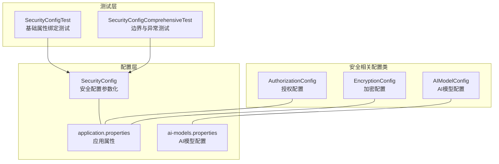
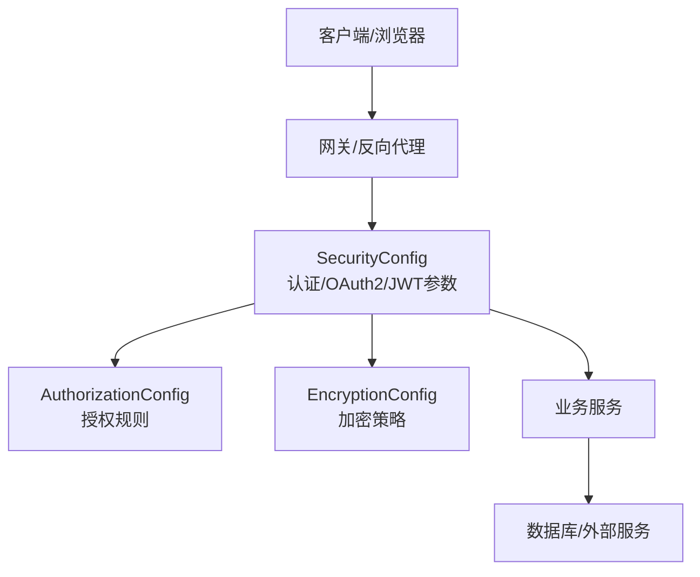
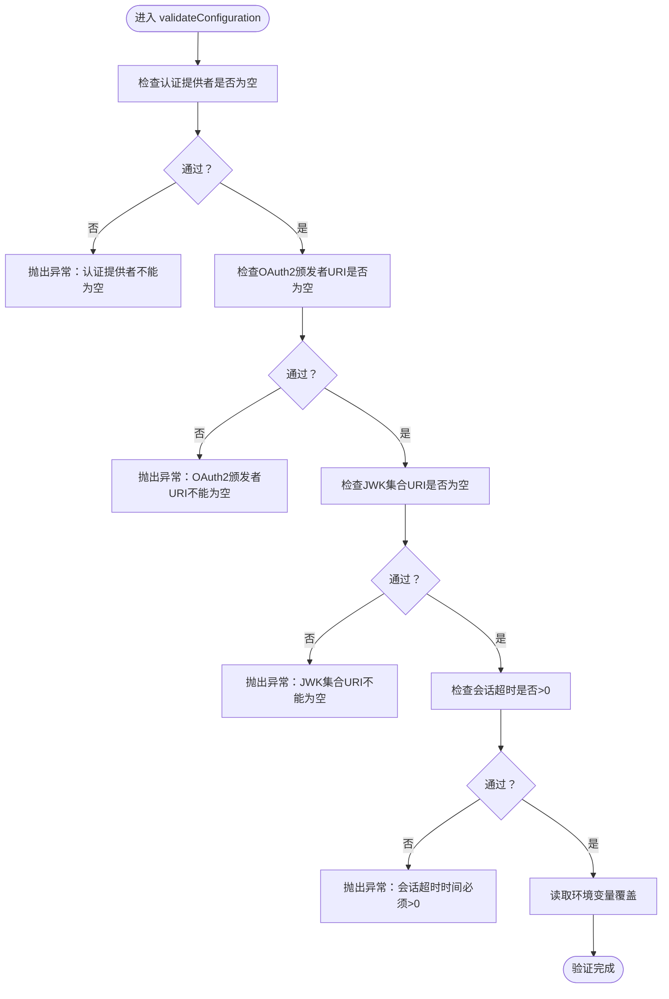
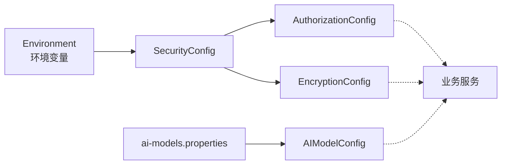

# 安全配置

<cite>
**本文引用的文件**
- [SecurityConfig.java](file://med_ai_assistant_1.0_bs_backend/src/main/java/com/example/medaiassistant/config/SecurityConfig.java)
- [SecurityConfigTest.java](file://med_ai_assistant_1.0_bs_backend/src/test/java/com/example/medaiassistant/config/SecurityConfigTest.java)
- [SecurityConfigComprehensiveTest.java](file://med_ai_assistant_1.0_bs_backend/src/test/java/com/example/medaiassistant/config/SecurityConfigComprehensiveTest.java)
- [application.properties（主资源）](file://med_ai_assistant_1.0_bs_backend/src/main/resources/application.properties)
- [application.properties（Linux Oracle 生产）](file://med_ai_assistant_1.0_bs_backend/deploy/main-linux-oracle/config/application.properties)
- [application.properties（Linux 测试服务器）](file://med_ai_assistant_1.0_bs_backend/deploy/main-linux-testServer/config/application.properties)
- [AIModelConfig.java](file://med_ai_assistant_1.0_bs_backend/src/main/java/com/example/medaiassistant/config/AIModelConfig.java)
- [AuthorizationConfig.java](file://med_ai_assistant_1.0_bs_backend/src/main/java/com/example/medaiassistant/config/AuthorizationConfig.java)
- [EncryptionConfig.java](file://med_ai_assistant_1.0_bs_backend/src/main/java/com/example/medaiassistant/config/EncryptionConfig.java)
- [ai-models.properties（主资源）](file://med_ai_assistant_1.0_bs_backend/src/main/resources/ai-models.properties)
- [ai-models.properties（Linux Oracle 生产）](file://med_ai_assistant_1.0_bs_backend/deploy/main-linux-oracle/config/ai-models.properties)
</cite>

## 目录
1. [简介](#简介)
2. [项目结构](#项目结构)
3. [核心组件](#核心组件)
4. [架构总览](#架构总览)
5. [详细组件分析](#详细组件分析)
6. [依赖分析](#依赖分析)
7. [性能考虑](#性能考虑)
8. [故障排查指南](#故障排查指南)
9. [结论](#结论)
10. [附录](#附录)

## 简介
本文件面向 MedAiAssistant 1.0 BS 的安全配置，聚焦于认证与授权、CSRF 与 CORS、会话管理、网络层安全（HTTPS/SSL/安全头）、API/OAuth2/JWT 权限控制、安全审计与访问日志、以及安全事件监控等主题。当前代码库中已实现安全配置参数化与验证，并通过测试保障配置有效性。本文将基于现有实现，给出可落地的配置建议、最佳实践与常见漏洞防护策略。

## 项目结构
后端采用 Spring Boot 结构，安全配置集中在配置类与属性文件中，并通过测试保障配置正确性与边界条件。

图表来源
- [SecurityConfig.java](file://med_ai_assistant_1.0_bs_backend/src/main/java/com/example/medaiassistant/config/SecurityConfig.java#L1-L167)
- [application.properties（主资源）](file://med_ai_assistant_1.0_bs_backend/src/main/resources/application.properties#L1-L287)
- [ai-models.properties（主资源）](file://med_ai_assistant_1.0_bs_backend/src/main/resources/ai-models.properties#L1-L200)
- [AuthorizationConfig.java](file://med_ai_assistant_1.0_bs_backend/src/main/java/com/example/medaiassistant/config/AuthorizationConfig.java#L1-L200)
- [EncryptionConfig.java](file://med_ai_assistant_1.0_bs_backend/src/main/java/com/example/medaiassistant/config/EncryptionConfig.java#L1-L200)
- [AIModelConfig.java](file://med_ai_assistant_1.0_bs_backend/src/main/java/com/example/medaiassistant/config/AIModelConfig.java#L1-L200)
- [SecurityConfigTest.java](file://med_ai_assistant_1.0_bs_backend/src/test/java/com/example/medaiassistant/config/SecurityConfigTest.java#L1-L83)
- [SecurityConfigComprehensiveTest.java](file://med_ai_assistant_1.0_bs_backend/src/test/java/com/example/medaiassistant/config/SecurityConfigComprehensiveTest.java#L1-L221)

章节来源
- [SecurityConfig.java](file://med_ai_assistant_1.0_bs_backend/src/main/java/com/example/medaiassistant/config/SecurityConfig.java#L1-L167)
- [application.properties（主资源）](file://med_ai_assistant_1.0_bs_backend/src/main/resources/application.properties#L1-L287)
- [ai-models.properties（主资源）](file://med_ai_assistant_1.0_bs_backend/src/main/resources/ai-models.properties#L1-L200)

## 核心组件
- 安全配置参数化与验证：集中于 SecurityConfig，负责认证提供者、OAuth2 颁发者 URI、JWK 集合 URI、会话超时、CSRF/CORS 开关等参数的加载、校验与环境变量覆盖。
- 授权与加密配置：AuthorizationConfig、EncryptionConfig 提供授权规则与加密相关配置扩展点。
- AI 模型安全：AIModelConfig 与 ai-models.properties 管理模型访问与密钥，间接影响 API 安全边界。
- 测试保障：SecurityConfigTest 与 SecurityConfigComprehensiveTest 覆盖属性绑定、配置验证、边界条件与异常场景。

章节来源
- [SecurityConfig.java](file://med_ai_assistant_1.0_bs_backend/src/main/java/com/example/medaiassistant/config/SecurityConfig.java#L18-L167)
- [AuthorizationConfig.java](file://med_ai_assistant_1.0_bs_backend/src/main/java/com/example/medaiassistant/config/AuthorizationConfig.java#L1-L200)
- [EncryptionConfig.java](file://med_ai_assistant_1.0_bs_backend/src/main/java/com/example/medaiassistant/config/EncryptionConfig.java#L1-L200)
- [AIModelConfig.java](file://med_ai_assistant_1.0_bs_backend/src/main/java/com/example/medaiassistant/config/AIModelConfig.java#L1-L200)
- [SecurityConfigTest.java](file://med_ai_assistant_1.0_bs_backend/src/test/java/com/example/medaiassistant/config/SecurityConfigTest.java#L18-L83)
- [SecurityConfigComprehensiveTest.java](file://med_ai_assistant_1.0_bs_backend/src/test/java/com/example/medaiassistant/config/SecurityConfigComprehensiveTest.java#L1-L221)

## 架构总览
下图展示安全配置在系统中的位置与交互关系：

图表来源
- [SecurityConfig.java](file://med_ai_assistant_1.0_bs_backend/src/main/java/com/example/medaiassistant/config/SecurityConfig.java#L18-L167)
- [AuthorizationConfig.java](file://med_ai_assistant_1.0_bs_backend/src/main/java/com/example/medaiassistant/config/AuthorizationConfig.java#L1-L200)
- [EncryptionConfig.java](file://med_ai_assistant_1.0_bs_backend/src/main/java/com/example/medaiassistant/config/EncryptionConfig.java#L1-L200)

## 详细组件分析

### 安全配置参数化与验证（SecurityConfig）
- 参数范围与默认值
  - 认证提供者：支持 oidc、jwt、basic，默认 oidc。
  - OAuth2 颁发者 URI：默认示例地址，需按实际鉴权服务替换。
  - JWK 集合 URI：默认示例地址，需指向真实 JWKS。
  - 会话超时：单位分钟，默认 30，必须 > 0。
  - CSRF/CORS：默认开启，可按需关闭。
- 配置验证
  - 空值校验：认证提供者、OAuth2 颁发者 URI、JWK 集合 URI 必须非空。
  - 数值校验：会话超时必须 > 0。
  - 环境变量覆盖：支持通过环境变量覆盖上述参数。
- 测试覆盖
  - 基础绑定测试：确认属性成功绑定与验证通过。
  - 边界与异常测试：空值、负数、零、非法提供者、CSRF/CORS 开关、环境变量映射逻辑。

图表来源
- [SecurityConfig.java](file://med_ai_assistant_1.0_bs_backend/src/main/java/com/example/medaiassistant/config/SecurityConfig.java#L66-L111)
- [SecurityConfigTest.java](file://med_ai_assistant_1.0_bs_backend/src/test/java/com/example/medaiassistant/config/SecurityConfigTest.java#L48-L66)
- [SecurityConfigComprehensiveTest.java](file://med_ai_assistant_1.0_bs_backend/src/test/java/com/example/medaiassistant/config/SecurityConfigComprehensiveTest.java#L44-L122)

章节来源
- [SecurityConfig.java](file://med_ai_assistant_1.0_bs_backend/src/main/java/com/example/medaiassistant/config/SecurityConfig.java#L25-L111)
- [SecurityConfigTest.java](file://med_ai_assistant_1.0_bs_backend/src/test/java/com/example/medaiassistant/config/SecurityConfigTest.java#L35-L81)
- [SecurityConfigComprehensiveTest.java](file://med_ai_assistant_1.0_bs_backend/src/test/java/com/example/medaiassistant/config/SecurityConfigComprehensiveTest.java#L44-L219)

### 授权配置（AuthorizationConfig）
- 角色与权限映射：定义 API 路径与角色/权限的匹配关系，决定访问控制粒度。
- 资源保护策略：结合认证提供者（OIDC/JWT/BASIC）实施细粒度授权。
- 与 SecurityConfig 协作：通过读取安全参数（如认证提供者、JWK URI）调整授权策略。

章节来源
- [AuthorizationConfig.java](file://med_ai_assistant_1.0_bs_backend/src/main/java/com/example/medaiassistant/config/AuthorizationConfig.java#L1-L200)

### 加密与密码策略（EncryptionConfig）
- 密码编码器：建议使用 Argon2（或其他现代密码哈希算法）以抵御暴力破解与彩虹表攻击。
- 对称/非对称密钥管理：用于 JWT 签名、敏感字段加解密、密钥轮换与安全存储。
- 与 SecurityConfig 协作：根据认证提供者类型选择合适的密钥与签名算法。

章节来源
- [EncryptionConfig.java](file://med_ai_assistant_1.0_bs_backend/src/main/java/com/example/medaiassistant/config/EncryptionConfig.java#L1-L200)

### AI 模型配置与 API 安全边界（AIModelConfig 与 ai-models.properties）
- 模型密钥与访问控制：通过 ai-models.properties 管理模型访问凭据，限制模型调用范围与配额。
- 与安全配置联动：模型密钥应纳入密管系统，最小权限原则下发，定期轮换。

章节来源
- [AIModelConfig.java](file://med_ai_assistant_1.0_bs_backend/src/main/java/com/example/medaiassistant/config/AIModelConfig.java#L1-L200)
- [ai-models.properties（主资源）](file://med_ai_assistant_1.0_bs_backend/src/main/resources/ai-models.properties#L1-L200)
- [ai-models.properties（Linux Oracle 生产）](file://med_ai_assistant_1.0_bs_backend/deploy/main-linux-oracle/config/ai-models.properties#L1-L200)

### HTTPS、SSL 与安全头配置
- HTTPS/SSL：由网关或反向代理统一终止 TLS，后端服务通过内部网络通信；生产环境务必启用 HTTPS 并配置强密码套件与协议版本。
- 安全头：通过网关/反向代理设置 Strict-Transport-Security、Content-Security-Policy、X-Frame-Options、X-Content-Type-Options、Referrer-Policy 等。
- 证书管理：使用受信 CA 证书，启用自动续期与监控告警。

说明：本节为通用安全建议，未直接引用具体源文件。

### CSRF 与 CORS 配置
- CSRF：默认启用，适用于基于 Cookie 的会话认证；若采用 Token 认证（JWT/OIDC），可按需关闭或通过 SameSite Cookie 策略缓解。
- CORS：默认启用，建议限定允许来源、方法与头部，避免通配符暴露风险。

章节来源
- [SecurityConfig.java](file://med_ai_assistant_1.0_bs_backend/src/main/java/com/example/medaiassistant/config/SecurityConfig.java#L48-L54)

### 会话管理配置
- 会话超时：通过安全配置项设置，建议结合 Token 刷新机制与无状态设计，减少服务端会话存储压力。
- 会话固定攻击防护：建议使用安全随机的会话 ID，登录后重建会话。

章节来源
- [SecurityConfig.java](file://med_ai_assistant_1.0_bs_backend/src/main/java/com/example/medaiassistant/config/SecurityConfig.java#L42-L44)

### OAuth2 与 JWT 集成
- OIDC/JWT：通过认证提供者类型选择 OIDC 或 JWT；配置 OAuth2 颁发者 URI 与 JWK 集合 URI，确保签名校验与声明解析。
- 令牌处理：建议使用短期访问令牌与刷新令牌，配合安全存储与传输。

章节来源
- [SecurityConfig.java](file://med_ai_assistant_1.0_bs_backend/src/main/java/com/example/medaiassistant/config/SecurityConfig.java#L27-L39)

### API 安全与权限控制
- 路由级权限：基于 AuthorizationConfig 将 API 路径与角色/权限绑定，实现最小权限访问。
- 请求级校验：在控制器或拦截器中校验用户上下文与业务权限。
- 速率限制与防刷：结合全局限流配置，防止滥用与 DDoS。

章节来源
- [AuthorizationConfig.java](file://med_ai_assistant_1.0_bs_backend/src/main/java/com/example/medaiassistant/config/AuthorizationConfig.java#L1-L200)
- [application.properties（主资源）](file://med_ai_assistant_1.0_bs_backend/src/main/resources/application.properties#L198-L210)

### 安全审计、访问日志与事件监控
- 审计日志：记录关键安全事件（登录、权限变更、敏感操作）与失败尝试。
- 访问日志：记录请求路径、用户标识、IP、UA、响应码与耗时。
- 事件监控：集成指标系统（如 Micrometer）与告警通道，设置阈值与告警规则。

章节来源
- [application.properties（Linux Oracle 生产）](file://med_ai_assistant_1.0_bs_backend/deploy/main-linux-oracle/config/application.properties#L75-L78)
- [application.properties（Linux 测试服务器）](file://med_ai_assistant_1.0_bs_backend/deploy/main-linux-testServer/config/application.properties#L71-L73)

## 依赖分析
- SecurityConfig 依赖 Spring Environment 以支持环境变量覆盖。
- AuthorizationConfig 与 EncryptionConfig 作为扩展配置类，依赖 SecurityConfig 提供的认证与密钥策略。
- AIModelConfig 与 ai-models.properties 为外部服务访问提供凭据，间接影响 API 安全边界。

图表来源
- [SecurityConfig.java](file://med_ai_assistant_1.0_bs_backend/src/main/java/com/example/medaiassistant/config/SecurityConfig.java#L23-L61)
- [AuthorizationConfig.java](file://med_ai_assistant_1.0_bs_backend/src/main/java/com/example/medaiassistant/config/AuthorizationConfig.java#L1-L200)
- [EncryptionConfig.java](file://med_ai_assistant_1.0_bs_backend/src/main/java/com/example/medaiassistant/config/EncryptionConfig.java#L1-L200)
- [AIModelConfig.java](file://med_ai_assistant_1.0_bs_backend/src/main/java/com/example/medaiassistant/config/AIModelConfig.java#L1-L200)
- [ai-models.properties（主资源）](file://med_ai_assistant_1.0_bs_backend/src/main/resources/ai-models.properties#L1-L200)

章节来源
- [SecurityConfig.java](file://med_ai_assistant_1.0_bs_backend/src/main/java/com/example/medaiassistant/config/SecurityConfig.java#L23-L61)
- [AuthorizationConfig.java](file://med_ai_assistant_1.0_bs_backend/src/main/java/com/example/medaiassistant/config/AuthorizationConfig.java#L1-L200)
- [EncryptionConfig.java](file://med_ai_assistant_1.0_bs_backend/src/main/java/com/example/medaiassistant/config/EncryptionConfig.java#L1-L200)
- [AIModelConfig.java](file://med_ai_assistant_1.0_bs_backend/src/main/java/com/example/medaiassistant/config/AIModelConfig.java#L1-L200)

## 性能考虑
- 配置验证开销：SecurityConfig 的验证逻辑简单，单次验证耗时极短，不影响启动性能。
- 连接池与超时：生产配置中已针对数据库连接池进行优化，有助于整体系统稳定性与安全性（快速失败与泄漏检测）。
- 限流与并发：通过全局限流与线程池配置，降低突发流量对安全模块的压力。

章节来源
- [SecurityConfigComprehensiveTest.java](file://med_ai_assistant_1.0_bs_backend/src/test/java/com/example/medaiassistant/config/SecurityConfigComprehensiveTest.java#L208-L219)
- [application.properties（Linux Oracle 生产）](file://med_ai_assistant_1.0_bs_backend/deploy/main-linux-oracle/config/application.properties#L25-L44)
- [application.properties（主资源）](file://med_ai_assistant_1.0_bs_backend/src/main/resources/application.properties#L198-L210)

## 故障排查指南
- 配置参数为空或非法
  - 现象：启动时报“认证提供者/颁发者/JWK 不能为空”或“会话超时必须 > 0”。
  - 排查：检查 application.properties 与环境变量覆盖，确保参数非空且数值合法。
- 认证提供者不支持
  - 现象：授权链路异常。
  - 排查：确认 AuthorizationConfig 与 EncryptionConfig 已适配所选认证提供者。
- CORS/CSRF 导致跨域失败
  - 现象：浏览器跨域请求被拒绝。
  - 排查：核对 CORS 白名单与 CSRF 设置，必要时在网关统一处理。
- 密钥与模型访问异常
  - 现象：AI 模型调用失败。
  - 排查：检查 ai-models.properties 中密钥与模型名称，确认密钥轮换与权限范围。

章节来源
- [SecurityConfig.java](file://med_ai_assistant_1.0_bs_backend/src/main/java/com/example/medaiassistant/config/SecurityConfig.java#L66-L111)
- [SecurityConfigTest.java](file://med_ai_assistant_1.0_bs_backend/src/test/java/com/example/medaiassistant/config/SecurityConfigTest.java#L58-L81)
- [SecurityConfigComprehensiveTest.java](file://med_ai_assistant_1.0_bs_backend/src/test/java/com/example/medaiassistant/config/SecurityConfigComprehensiveTest.java#L44-L122)
- [ai-models.properties（主资源）](file://med_ai_assistant_1.0_bs_backend/src/main/resources/ai-models.properties#L1-L200)

## 结论
当前代码库已实现安全配置的参数化与验证，具备良好的扩展性与测试保障。建议在生产环境中完善网关层 HTTPS/安全头、接入细粒度授权与审计日志、强化密钥与模型凭据管理，并持续监控与演练应急响应。

## 附录

### 安全配置清单（基于现有实现）
- 认证提供者：oidc/jwt/basic（默认 oidc）
- OAuth2 颁发者 URI：需指向真实鉴权服务
- JWK 集合 URI：需指向真实 JWKS
- 会话超时：分钟（默认 30，必须 > 0）
- CSRF：默认启用
- CORS：默认启用
- 密码编码器：建议使用 Argon2
- HTTPS/安全头：由网关/反向代理统一处理
- API/OAuth2/JWT 权限控制：结合 AuthorizationConfig 与认证提供者
- 安全审计/访问日志/事件监控：集成指标与告警

章节来源
- [SecurityConfig.java](file://med_ai_assistant_1.0_bs_backend/src/main/java/com/example/medaiassistant/config/SecurityConfig.java#L27-L54)
- [application.properties（主资源）](file://med_ai_assistant_1.0_bs_backend/src/main/resources/application.properties#L198-L210)
- [application.properties（Linux Oracle 生产）](file://med_ai_assistant_1.0_bs_backend/deploy/main-linux-oracle/config/application.properties#L75-L78)
- [application.properties（Linux 测试服务器）](file://med_ai_assistant_1.0_bs_backend/deploy/main-linux-testServer/config/application.properties#L71-L73)