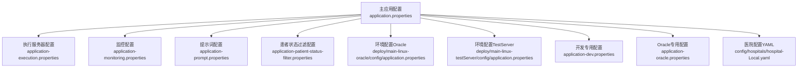
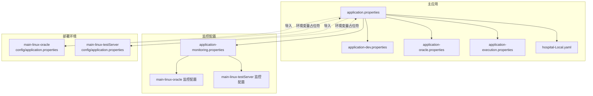
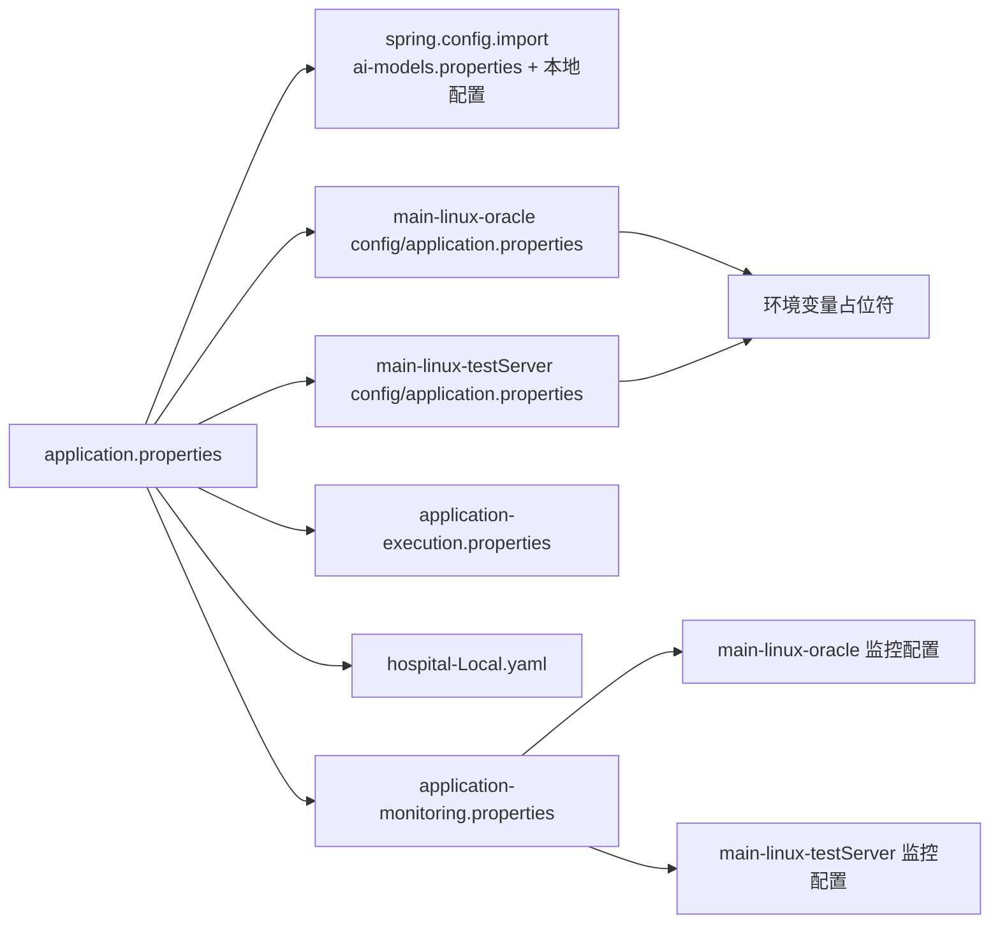
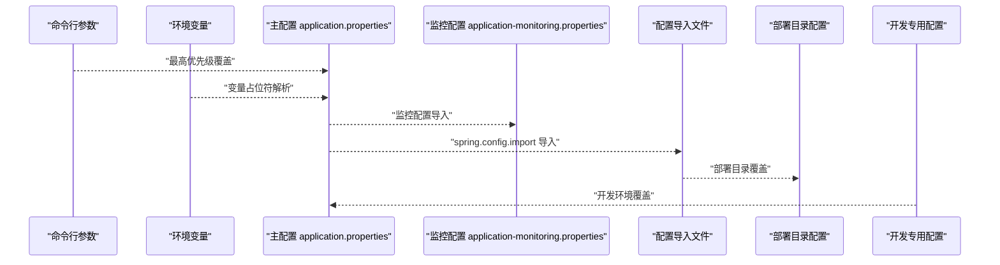

# 应用配置

<cite>
**本文引用的文件**
- [application.properties](file://med_ai_assistant_1.0_bs_backend/src/main/resources/application.properties)
- [application-dev.properties](file://med_ai_assistant_1.0_bs_backend/src/main/resources/application-dev.properties)
- [application-oracle.properties](file://med_ai_assistant_1.0_bs_backend/src/main/resources/application-oracle.properties)
- [application-execution.properties](file://med_ai_assistant_1.0_bs_backend/src/main/resources/application-execution.properties)
- [application-monitoring.properties](file://med_ai_assistant_1.0_bs_backend/config/application-monitoring.properties)
- [application-prompt.properties](file://med_ai_assistant_1.0_bs_backend/config/application-prompt.properties)
- [application-patient-status-filter.properties](file://med_ai_assistant_1.0_bs_backend/config/application-patient-status-filter.properties)
- [main-linux-oracle 部署配置](file://med_ai_assistant_1.0_bs_backend/deploy/main-linux-oracle/config/application.properties)
- [main-linux-testServer 部署配置](file://med_ai_assistant_1.0_bs_backend/deploy/main-linux-testServer/config/application.properties)
- [main-linux-oracle 监控配置](file://med_ai_assistant_1.0_bs_backend/deploy/main-linux-oracle/config/application-monitoring.properties)
- [main-linux-testServer 监控配置](file://med_ai_assistant_1.0_bs_backend/deploy/main-linux-testServer/config/application-monitoring.properties)
- [hospital-Local.yaml](file://med_ai_assistant_1.0_bs_backend/config/hospitals/hospital-Local.yaml)
</cite>

## 更新摘要
**所做更改**
- 新增详细的日志配置章节，包含 Hibernate SQL、Oracle JDBC、Spring 框架日志级别设置
- 新增监控配置章节，涵盖分级监控策略、性能监控、数据库监控、线程池监控等
- 新增性能调优参数章节，详细说明连接池优化、线程池配置、Oracle 驱动优化
- 更新配置加载顺序与优先级，增加监控配置文件的导入机制
- 新增配置验证与错误处理的最佳实践建议

## 目录
1. [简介](#简介)
2. [项目结构](#项目结构)
3. [核心组件](#核心组件)
4. [架构总览](#架构总览)
5. [详细组件分析](#详细组件分析)
6. [日志配置](#日志配置)
7. [监控配置](#监控配置)
8. [性能调优参数](#性能调优参数)
9. [依赖关系分析](#依赖关系分析)
10. [性能考量](#性能考量)
11. [故障排查指南](#故障排查指南)
12. [结论](#结论)
13. [附录](#附录)

## 简介
本文件面向 MedAiAssistant 1.0 BS 的 Spring Boot 后端应用，系统性梳理应用配置体系，涵盖以下主题：
- 核心配置项：应用名称、服务器端口、数据库与连接池、JPA/Hibernate、时区与字符集、异步与调度、限流与重试、监控与告警、文件上传、语音识别等。
- 日志配置：详细的 Hibernate SQL、Oracle JDBC、Spring 框架日志级别设置与诊断日志配置。
- 监控配置：分级监控策略、性能监控、数据库监控、线程池监控、内存监控、网络监控等全方位监控体系。
- 性能调优参数：连接池优化、线程池配置、Oracle 驱动超时设置、网络连接优化等。
- 配置加载顺序与优先级：命令行参数、环境变量、配置文件、配置导入等。
- 开发与生产环境差异：不同部署目录中的配置差异与覆盖方式。
- 配置热更新机制与验证、错误处理建议。
- 实际配置示例与最佳实践。

## 项目结构
后端工程采用标准 Spring Boot 结构，配置主要位于 resources 目录及各环境部署目录中：
- 主应用配置：src/main/resources 下的 application.properties 及其环境变体与专用模块配置。
- 执行服务器配置：application-execution.properties 用于独立端口与回调配置。
- 监控配置：application-monitoring.properties 提供分级监控策略与性能监控参数。
- 专用模块配置：application-prompt.properties 和 application-patient-status-filter.properties。
- 环境差异化配置：deploy/main-linux-oracle 与 deploy/main-linux-testServer 下的 config/application.properties。
- 医院集成配置：config/hospitals/*.yaml 描述 HIS/LIS 接入与字段映射。

**图表来源**
- [application.properties:1-312](file://med_ai_assistant_1.0_bs_backend/src/main/resources/application.properties#L1-L312)
- [application-execution.properties:1-64](file://med_ai_assistant_1.0_bs_backend/src/main/resources/application-execution.properties#L1-L64)
- [application-monitoring.properties:1-196](file://med_ai_assistant_1.0_bs_backend/config/application-monitoring.properties#L1-L196)
- [application-prompt.properties:1-32](file://med_ai_assistant_1.0_bs_backend/config/application-prompt.properties#L1-L32)
- [application-patient-status-filter.properties:1-49](file://med_ai_assistant_1.0_bs_backend/config/application-patient-status-filter.properties#L1-L49)

## 核心组件
- 应用基本信息
  - 应用名称：由主配置项指定。
  - 服务器端口：主应用默认端口与执行服务器端口分离。
- 数据库与连接池
  - 数据库类型：通过自定义属性控制，Oracle 为主。
  - 动态数据源：基于活动服务器配置动态拼接 URL、用户名、密码。
  - HikariCP：连接池大小、空闲、超时、泄漏检测、校验与初始化策略全面配置。
- ORM 与 SQL
  - JPA/Hibernate：禁用 DDL 自动管理，明确方言，时区与 SQL 输出控制。
- Web 与异步
  - Tomcat 超时、异步请求超时、线程池与调度器配置。
- 业务与调度
  - 统一调度、定时任务 Cron、并发度与固定延迟。
  - Prompt 生成、手术分析、通用执行器等专用线程池。
- 回调与 API
  - 异步回调开关、最大重试、间隔、超时与默认回调地址。
  - API 调用超时、重试策略与连接池参数。
- 监控与告警
  - JVM 与业务指标采集、阈值与抑制策略、邮件告警开关与收件人。
- 文件与字符集
  - 文件上传大小限制、强制 UTF-8 编码与 Servlet 层编码。
- 语音识别
  - 阿里云百炼 ASR 的 API Key、模型、采样率与格式。
- 医院配置
  - YAML 医院配置包含 HIS/LIS 连接、字段映射与 SQL 模板覆盖。

**章节来源**
- [application.properties:1-312](file://med_ai_assistant_1.0_bs_backend/src/main/resources/application.properties#L1-L312)
- [application-execution.properties:1-64](file://med_ai_assistant_1.0_bs_backend/src/main/resources/application-execution.properties#L1-L64)
- [hospital-Local.yaml:1-38](file://med_ai_assistant_1.0_bs_backend/config/hospitals/hospital-Local.yaml#L1-L38)

## 架构总览
下图展示配置在不同环境中的加载与覆盖关系，体现"配置导入""环境变量占位符""部署目录覆盖"的组合策略。

**图表来源**
- [application.properties:94-94](file://med_ai_assistant_1.0_bs_backend/src/main/resources/application.properties#L94-L94)
- [application-monitoring.properties:1-196](file://med_ai_assistant_1.0_bs_backend/config/application-monitoring.properties#L1-L196)
- [main-linux-oracle 监控配置:1-196](file://med_ai_assistant_1.0_bs_backend/deploy/main-linux-oracle/config/application-monitoring.properties#L1-L196)
- [main-linux-testServer 监控配置:1-196](file://med_ai_assistant_1.0_bs_backend/deploy/main-linux-testServer/config/application-monitoring.properties#L1-L196)

## 详细组件分析

### 配置加载顺序与优先级
Spring Boot 配置优先级（从高到低）：
1) 命令行参数
2) 操作系统环境变量（例如通过 Docker/Compose 注入）
3) 应用主配置文件（application.properties）
4) 配置导入（spring.config.import）指向的文件
5) 部署环境目录中的配置文件（覆盖主配置）
6) 开发专用配置（如 application-dev.properties）

在本项目中：
- 主配置通过导入机制引入 ai-models.properties、application-prompt.properties 与本地配置文件。
- 监控配置通过 application-monitoring.properties 提供分级监控策略。
- Linux 生产/测试环境通过部署目录中的 config/application.properties 使用环境变量占位符进行覆盖。
- 开发环境可通过 application-dev.properties 覆盖数据库用户名等敏感信息。

**章节来源**
- [application.properties:94-94](file://med_ai_assistant_1.0_bs_backend/src/main/resources/application.properties#L94-L94)
- [application-monitoring.properties:1-196](file://med_ai_assistant_1.0_bs_backend/config/application-monitoring.properties#L1-L196)
- [main-linux-oracle 部署配置:19-20](file://med_ai_assistant_1.0_bs_backend/deploy/main-linux-oracle/config/application.properties#L19-L20)
- [main-linux-testServer 部署配置:19-20](file://med_ai_assistant_1.0_bs_backend/deploy/main-linux-testServer/config/application.properties#L19-L20)
- [application-dev.properties:1-2](file://med_ai_assistant_1.0_bs_backend/src/main/resources/application-dev.properties#L1-L2)

### 服务器端口与应用名称
- 主应用：应用名称与端口在主配置中定义。
- 执行服务器：独立配置文件定义了不同的应用名称与端口，并配置回调地址指向主应用。

**章节来源**
- [application.properties:1-2](file://med_ai_assistant_1.0_bs_backend/src/main/resources/application.properties#L1-L2)
- [application-execution.properties:1-3](file://med_ai_assistant_1.0_bs_backend/src/main/resources/application-execution.properties#L1-L3)

### 数据库与连接池
- 数据库类型：通过自定义属性控制，Oracle 为主。
- 动态数据源：根据当前活动服务器（本地/内网）动态拼接 URL、用户名、密码。
- HikariCP：连接池容量、空闲、超时、泄漏检测、校验、初始化失败容忍、连接测试与会话初始化 SQL。
- Oracle 驱动超时与优化：连接超时、读超时、线程本地缓冲、早期通知等。
- JPA/Hibernate：禁用 DDL 自动管理，明确方言与时区，关闭 SQL 输出。

**章节来源**
- [application.properties:4-6](file://med_ai_assistant_1.0_bs_backend/src/main/resources/application.properties#L4-L6)
- [application.properties:14-34](file://med_ai_assistant_1.0_bs_backend/src/main/resources/application.properties#L14-L34)
- [application.properties:36-58](file://med_ai_assistant_1.0_bs_backend/src/main/resources/application.properties#L36-L58)
- [application.properties:63-77](file://med_ai_assistant_1.0_bs_backend/src/main/resources/application.properties#L63-L77)
- [application-oracle.properties:1-11](file://med_ai_assistant_1.0_bs_backend/src/main/resources/application-oracle.properties#L1-L11)

### Web 与异步配置
- Tomcat 超时与异步请求超时：针对长时间 LLM 处理场景优化。
- 线程池与调度器：核心线程、最大线程、队列容量与前缀。
- 专用线程池：Prompt 生成、手术分析与通用执行器的线程池配置。

**章节来源**
- [application-execution.properties:32-35](file://med_ai_assistant_1.0_bs_backend/src/main/resources/application-execution.properties#L32-L35)
- [application.properties:143-159](file://med_ai_assistant_1.0_bs_backend/src/main/resources/application.properties#L143-L159)

### 回调与 API 调用
- 回调：开关、最大重试次数、重试间隔、超时、默认回调地址。
- API 调用：连接超时、读取超时、最大重试次数。

**章节来源**
- [application.properties:102-107](file://med_ai_assistant_1.0_bs_backend/src/main/resources/application.properties#L102-L107)
- [application.properties:184-187](file://med_ai_assistant_1.0_bs_backend/src/main/resources/application.properties#L184-L187)

### 监控与告警
- 指标采集：JVM 与业务指标开关、快照间隔、保留天数。
- 阈值与抑制：系统与业务指标阈值、告警抑制时长。
- 告警：开关、最大活跃告警数、邮件告警与收件人。

**章节来源**
- [application.properties:242-247](file://med_ai_assistant_1.0_bs_backend/src/main/resources/application.properties#L242-L247)
- [application.properties:222-241](file://med_ai_assistant_1.0_bs_backend/src/main/resources/application.properties#L222-L241)

### 文件上传与字符集
- 文件上传：单文件与请求总大小限制。
- 字符集：强制 UTF-8 编码于 Spring 与 Servlet 层。

**章节来源**
- [application.properties:283-287](file://med_ai_assistant_1.0_bs_backend/src/main/resources/application.properties#L283-L287)
- [application.properties:249-255](file://med_ai_assistant_1.0_bs_backend/src/main/resources/application.properties#L249-L255)

### 语音识别（阿里云百炼 ASR）
- API Key、模型、采样率、音频格式等。

**章节来源**
- [application.properties:277-281](file://med_ai_assistant_1.0_bs_backend/src/main/resources/application.properties#L277-L281)

### 医院配置（YAML）
- HIS/LIS 连接、用户名、密码、表前缀。
- 同步策略：Cron、开关、最大重试与间隔。
- 字段映射与 SQL 模板覆盖路径。

**章节来源**
- [hospital-Local.yaml:1-38](file://med_ai_assistant_1.0_bs_backend/config/hospitals/hospital-Local.yaml#L1-L38)

### 开发与生产环境差异
- 开发环境
  - 使用 application-dev.properties 覆盖数据库用户名等敏感信息。
  - 开启 DevTools 热加载与重启。
- 生产/测试环境
  - 通过部署目录中的 config/application.properties 使用环境变量占位符覆盖。
  - 线程池与调度器参数、Redis 连接、字符编码、日志级别、夜间同步策略等按环境调整。
  - 执行服务器与主服务器的统一配置键名与回调地址。

**章节来源**
- [application-dev.properties:1-2](file://med_ai_assistant_1.0_bs_backend/src/main/resources/application-dev.properties#L1-L2)
- [application.properties:271-276](file://med_ai_assistant_1.0_bs_backend/src/main/resources/application.properties#L271-L276)
- [main-linux-oracle 部署配置:47-51](file://med_ai_assistant_1.0_bs_backend/deploy/main-linux-oracle/config/application.properties#L47-L51)
- [main-linux-oracle 部署配置:82-85](file://med_ai_assistant_1.0_bs_backend/deploy/main-linux-oracle/config/application.properties#L82-L85)
- [main-linux-oracle 部署配置:117-118](file://med_ai_assistant_1.0_bs_backend/deploy/main-linux-oracle/config/application.properties#L117-L118)
- [main-linux-oracle 部署配置:142-148](file://med_ai_assistant_1.0_bs_backend/deploy/main-linux-oracle/config/application.properties#L142-L148)
- [main-linux-testServer 部署配置:42-47](file://med_ai_assistant_1.0_bs_backend/deploy/main-linux-testServer/config/application.properties#L42-L47)
- [main-linux-testServer 部署配置:80-83](file://med_ai_assistant_1.0_bs_backend/deploy/main-linux-testServer/config/application.properties#L80-L83)
- [main-linux-testServer 部署配置:116-118](file://med_ai_assistant_1.0_bs_backend/deploy/main-linux-testServer/config/application.properties#L116-L118)
- [main-linux-testServer 部署配置:142-147](file://med_ai_assistant_1.0_bs_backend/deploy/main-linux-testServer/config/application.properties#L142-L147)

### 配置热更新机制
- Spring Boot 默认不支持配置热更新。若需热更新，可结合 Spring Cloud Config 或 @RefreshScope 注解实现。
- 本项目未见热更新相关配置，建议通过重启容器或 JVM 实现配置生效。

**章节来源**
- [application.properties:94-94](file://med_ai_assistant_1.0_bs_backend/src/main/resources/application.properties#L94-L94)

### 配置验证与错误处理
- 配置导入：通过 spring.config.import 引入外部配置文件，若文件缺失将导致启动失败，应确保路径存在且可访问。
- 环境变量占位符：部署环境中使用 ${VAR:default} 形式，若未提供 VAR 将回退到默认值，建议在 CI/CD 中显式注入。
- 敏感信息：开发环境使用 application-dev.properties 覆盖，生产环境使用环境变量注入，避免硬编码。

**章节来源**
- [application.properties:94-94](file://med_ai_assistant_1.0_bs_backend/src/main/resources/application.properties#L94-L94)
- [main-linux-oracle 部署配置:19-20](file://med_ai_assistant_1.0_bs_backend/deploy/main-linux-oracle/config/application.properties#L19-L20)
- [main-linux-testServer 部署配置:19-20](file://med_ai_assistant_1.0_bs_backend/deploy/main-linux-testServer/config/application.properties#L19-L20)
- [application-dev.properties:1-2](file://med_ai_assistant_1.0_bs_backend/src/main/resources/application-dev.properties#L1-L2)

## 日志配置

### Hibernate SQL 日志配置
项目提供了两级日志配置策略：

#### 启动阶段日志配置
- 启动阶段连接泄漏检测阈值：120000ms（2分钟）
- 启动阶段健康检查超时时间：30000ms（30秒）
- 启动阶段监控持续时间：300000ms（5分钟）
- 启动阶段组件就绪检查间隔：10000ms（10秒）

#### 正常运行阶段日志配置
- 正常运行阶段连接泄漏检测阈值：30000ms（30秒）
- 正常运行阶段健康检查超时时间：5000ms（5秒）
- 正常运行阶段监控间隔：60000ms（60秒）
- 正常运行阶段组件健康检查间隔：30000ms（30秒）

#### 日志级别配置
- 启动阶段日志级别：INFO
- 正常运行阶段日志级别：WARN
- 错误日志监控间隔：10000ms（10秒）
- 错误日志告警阈值：每分钟10个错误

**章节来源**
- [application-monitoring.properties:7-89](file://med_ai_assistant_1.0_bs_backend/config/application-monitoring.properties#L7-L89)
- [main-linux-oracle 部署配置:162-171](file://med_ai_assistant_1.0_bs_backend/deploy/main-linux-oracle/config/application.properties#L162-L171)
- [main-linux-testServer 部署配置:150-157](file://med_ai_assistant_1.0_bs_backend/deploy/main-linux-testServer/config/application.properties#L150-L157)

### Oracle JDBC 诊断日志配置
生产环境提供了详细的 Oracle JDBC 诊断日志配置：

#### HikariCP 连接池日志
- com.zaxxer.hikari：DEBUG 级别
- com.zaxxer.hikari.pool.ProxyLeakTask：DEBUG 级别
- com.zaxxer.hikari.pool.HikariPool：DEBUG 级别

#### Oracle JDBC 驱动日志
- oracle.jdbc：DEBUG 级别
- oracle.net：DEBUG 级别

#### Spring JDBC 和事务日志
- org.springframework.jdbc：DEBUG 级别
- org.springframework.transaction：DEBUG 级别
- org.springframework.orm.jpa.JpaTransactionManager：WARN 级别

**章节来源**
- [main-linux-oracle 部署配置:176-191](file://med_ai_assistant_1.0_bs_backend/deploy/main-linux-oracle/config/application.properties#L176-L191)
- [main-linux-testServer 部署配置:160-177](file://med_ai_assistant_1.0_bs_backend/deploy/main-linux-testServer/config/application.properties#L160-L177)

### Spring 框架日志配置
- org.springframework.orm.jpa：WARN 级别
- org.hibernate.SQL：OFF 级别（生产环境完全关闭）
- org.hibernate.type.descriptor.sql.BasicBinder：OFF 级别

**章节来源**
- [main-linux-oracle 部署配置:171-171](file://med_ai_assistant_1.0_bs_backend/deploy/main-linux-oracle/config/application.properties#L171-L171)
- [main-linux-testServer 部署配置:157-157](file://med_ai_assistant_1.0_bs_backend/deploy/main-linux-testServer/config/application.properties#L157-L157)

## 监控配置

### 分级监控策略配置
项目实现了启动阶段和正常运行阶段的分级监控策略：

#### 启动阶段监控配置
- 连接泄漏检测阈值：120000ms（2分钟）
- 健康检查超时时间：30000ms（30秒）
- 监控持续时间：300000ms（5分钟）
- 组件就绪检查间隔：10000ms（10秒）

#### 正常运行阶段监控配置
- 连接泄漏检测阈值：30000ms（30秒）
- 健康检查超时时间：5000ms（5秒）
- 监控间隔：60000ms（60秒）
- 组件健康检查间隔：30000ms（30秒）

#### 监控过渡条件配置
- 过渡条件：系统运行时间 > 300000ms（5分钟）
- 过渡阶段缓冲时间：30000ms（30秒）

### 监控告警配置
- 连接泄漏告警阈值：连续3次检测到泄漏
- 连接泄漏告警间隔：300000ms（5分钟）
- 系统健康度告警阈值：健康度 < 80%
- 系统健康度告警间隔：120000ms（2分钟）

### 性能监控配置
- 性能指标收集间隔：30000ms（30秒）
- 性能指标保留时间：86400000ms（24小时）
- 性能基线计算周期：3600000ms（1小时）

### 数据库监控配置
- 连接池监控间隔：15000ms（15秒）
- 连接池告警阈值：使用率 > 90%
- 查询性能监控阈值：查询时间 > 5000ms

### 线程池监控配置
- 线程池监控间隔：20000ms（20秒）
- 线程池使用率告警阈值：使用率 > 85%
- 线程池队列长度告警阈值：队列长度 > 80%

### 内存监控配置
- 内存使用率监控间隔：30000ms（30秒）
- 内存使用率告警阈值：使用率 > 85%
- GC 监控间隔：60000ms（60秒）
- GC 时间告警阈值：单次 GC 时间 > 5000ms

### 网络监控配置
- API 响应时间监控间隔：30000ms（30秒）
- API 响应时间告警阈值：响应时间 > 10000ms
- API 错误率监控间隔：60000ms（60秒）
- API 错误率告警阈值：错误率 > 5%

### 自定义监控配置
- 自定义监控启用开关：true
- 自定义监控间隔：60000ms（60秒）
- 自定义监控超时时间：10000ms（10秒）

### 监控数据导出配置
- 监控数据导出间隔：300000ms（5分钟）
- 监控数据保留天数：30天
- 监控数据压缩启用：true
- 监控数据导出格式：JSON

### 告警通知配置
- 告警通知启用开关：true
- 告警通知方式：EMAIL, WEBHOOK
- 告警通知重试次数：3次
- 告警通知重试间隔：30000ms（30秒）
- 告警通知静默时间：600000ms（10分钟）

**章节来源**
- [application-monitoring.properties:1-196](file://med_ai_assistant_1.0_bs_backend/config/application-monitoring.properties#L1-L196)
- [main-linux-oracle 监控配置:1-196](file://med_ai_assistant_1.0_bs_backend/deploy/main-linux-oracle/config/application-monitoring.properties#L1-L196)
- [main-linux-testServer 监控配置:1-196](file://med_ai_assistant_1.0_bs_backend/deploy/main-linux-testServer/config/application-monitoring.properties#L1-L196)

## 性能调优参数

### 连接池优化配置
项目针对不同环境提供了优化的连接池配置：

#### 开发环境优化
- 最大池大小：15
- 最小空闲：3
- 连接超时：10000ms
- 空闲超时：240000ms
- 最大生存时间：1800000ms
- 保持活跃时间：120000ms
- 验证超时：5000ms
- 泄漏检测阈值：30000ms
- 初始化失败超时：0
- 连接测试查询：SELECT 1 FROM DUAL
- 连接初始化 SQL：ALTER SESSION SET NLS_DATE_FORMAT='YYYY-MM-DD HH24:MI:SS'

#### 生产环境优化
- 最大池大小：20（相比开发环境增加50%）
- 最小空闲：5（相比开发环境增加67%）
- 连接超时：10000ms（保持不变）
- 空闲超时：240000ms（保持不变）
- 最大生存时间：1800000ms（保持不变）
- 泄漏检测阈值：30000ms（保持不变）
- 验证超时：5000ms（保持不变）
- 保持活跃时间：120000ms（保持不变）
- 连接测试查询：SELECT 1 FROM DUAL（保持不变）
- 初始化失败超时：0（保持不变）

### Oracle 驱动超时与优化
- 连接超时：10000ms（生产环境优化）
- 读取超时：30000ms（生产环境优化）
- 线程本地缓冲：true
- 启用早期通知：true
- Fan 启用：false

### 网络连接优化
针对网络中断问题进行了专门优化：
- Oracle JDBC ReadTimeout：60000ms
- Oracle Net CONNECT_TIMEOUT：30000ms
- Oracle Net READ_TIMEOUT：60000ms
- useThreadLocalBufferCache：true
- ENABLE_EARLY_NOTIFICATION：true

### 线程池与调度优化
- 调度线程池大小：5（可从环境变量注入）
- 执行线程池核心大小：10（可从环境变量注入）
- 执行线程池最大大小：20（可从环境变量注入）
- 执行线程池队列容量：100（可从环境变量注入）

### 提示词服务性能优化
- 提交服务页面大小：20（从10提升到20）
- 轮询服务页面大小：50（从20提升到50）
- 轮询服务批次大小：100（从50提升到100）

**章节来源**
- [application.properties:40-58](file://med_ai_assistant_1.0_bs_backend/src/main/resources/application.properties#L40-L58)
- [main-linux-oracle 部署配置:25-44](file://med_ai_assistant_1.0_bs_backend/deploy/main-linux-oracle/config/application.properties#L25-L44)
- [main-linux-testServer 部署配置:22-40](file://med_ai_assistant_1.0_bs_backend/deploy/main-linux-testServer/config/application.properties#L22-L40)
- [application-prompt.properties:1-32](file://med_ai_assistant_1.0_bs_backend/config/application-prompt.properties#L1-L32)

## 依赖关系分析
- 主配置导入关系
  - 主配置通过 spring.config.import 导入 ai-models.properties、application-prompt.properties 与本地配置文件。
  - 执行服务器配置同样通过 spring.config.import 导入 ai-models.properties。
  - 监控配置通过 application-monitoring.properties 提供分级监控策略。
- 环境覆盖关系
  - 部署目录中的 config/application.properties 使用环境变量占位符覆盖主配置。
- 医院配置
  - YAML 文件描述 HIS/LIS 连接与字段映射，供业务模块读取。

**图表来源**
- [application.properties:94-94](file://med_ai_assistant_1.0_bs_backend/src/main/resources/application.properties#L94-L94)
- [application-monitoring.properties:1-196](file://med_ai_assistant_1.0_bs_backend/config/application-monitoring.properties#L1-L196)
- [main-linux-oracle 监控配置:1-196](file://med_ai_assistant_1.0_bs_backend/deploy/main-linux-oracle/config/application-monitoring.properties#L1-L196)
- [main-linux-testServer 监控配置:1-196](file://med_ai_assistant_1.0_bs_backend/deploy/main-linux-testServer/config/application-monitoring.properties#L1-L196)

## 性能考量
- 连接池优化：根据并发与资源瓶颈调整最大池大小、空闲、超时与泄漏检测阈值。
- 线程池与调度：合理设置核心线程、最大线程与队列容量，避免阻塞与资源竞争。
- SQL 输出：生产环境关闭 SQL 日志，降低 IO 压力。
- 字符集与编码：统一 UTF-8，避免乱码与转换开销。
- 文件上传：限制大小与启用 multipart，防止内存溢出。
- Oracle 驱动优化：针对网络中断问题进行专门优化，确保快速失败与恢复。
- 监控配置：分级监控策略确保启动阶段和正常运行阶段的性能监控需求。

**章节来源**
- [application.properties:40-58](file://med_ai_assistant_1.0_bs_backend/src/main/resources/application.properties#L40-L58)
- [application.properties:143-159](file://med_ai_assistant_1.0_bs_backend/src/main/resources/application.properties#L143-L159)
- [application.properties:249-255](file://med_ai_assistant_1.0_bs_backend/src/main/resources/application.properties#L249-L255)
- [application.properties:283-287](file://med_ai_assistant_1.0_bs_backend/src/main/resources/application.properties#L283-L287)
- [main-linux-oracle 部署配置:25-40](file://med_ai_assistant_1.0_bs_backend/deploy/main-linux-oracle/config/application.properties#L25-L40)
- [main-linux-testServer 部署配置:22-41](file://med_ai_assistant_1.0_bs_backend/deploy/main-linux-testServer/config/application.properties#L22-L41)

## 故障排查指南
- 启动失败（DDL/方言/初始化）
  - 确认禁用 DDL 自动管理与方言设置正确。
- 数据库连接失败
  - 检查动态数据源拼接是否正确，确认活动服务器配置与连接池超时设置。
- 线程池/调度异常
  - 核对线程池参数与队列容量，检查调度 Cron 表达式。
- 回调失败
  - 校验回调地址、超时与重试策略，确认主/执行服务器网络连通。
- 监控告警误报
  - 调整阈值与抑制时长，核对指标采集与日志级别。
- 文件上传失败
  - 检查大小限制与 multipart 启用状态。
- 日志配置问题
  - 检查 Hibernate SQL 日志级别设置，确认生产环境日志级别配置正确。
- 监控配置问题
  - 验证监控阈值设置，检查监控数据导出配置。

**章节来源**
- [application.properties:63-77](file://med_ai_assistant_1.0_bs_backend/src/main/resources/application.properties#L63-L77)
- [application.properties:14-34](file://med_ai_assistant_1.0_bs_backend/src/main/resources/application.properties#L14-L34)
- [application.properties:143-159](file://med_ai_assistant_1.0_bs_backend/src/main/resources/application.properties#L143-L159)
- [application.properties:102-107](file://med_ai_assistant_1.0_bs_backend/src/main/resources/application.properties#L102-L107)
- [application.properties:222-241](file://med_ai_assistant_1.0_bs_backend/src/main/resources/application.properties#L222-L241)
- [application.properties:283-287](file://med_ai_assistant_1.0_bs_backend/src/main/resources/application.properties#L283-L287)

## 结论
本项目通过"主配置 + 配置导入 + 部署目录覆盖 + 环境变量占位符"的组合，实现了开发与生产环境的清晰分离与灵活配置。新增的日志配置、监控配置和性能调优参数进一步完善了系统的可观测性和性能表现。建议在 CI/CD 中统一注入环境变量，避免硬编码；对关键参数（数据库、回调、监控）建立变更评审流程；必要时引入配置中心以支持热更新。

## 附录

### 配置优先级与覆盖流程（序列图）

**图表来源**
- [application.properties:94-94](file://med_ai_assistant_1.0_bs_backend/src/main/resources/application.properties#L94-L94)
- [application-monitoring.properties:1-196](file://med_ai_assistant_1.0_bs_backend/config/application-monitoring.properties#L1-L196)
- [main-linux-oracle 部署配置:19-20](file://med_ai_assistant_1.0_bs_backend/deploy/main-linux-oracle/config/application.properties#L19-L20)
- [main-linux-testServer 部署配置:19-20](file://med_ai_assistant_1.0_bs_backend/deploy/main-linux-testServer/config/application.properties#L19-L20)
- [application-dev.properties:1-2](file://med_ai_assistant_1.0_bs_backend/src/main/resources/application-dev.properties#L1-L2)