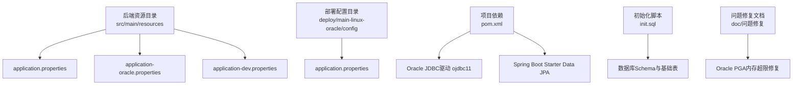
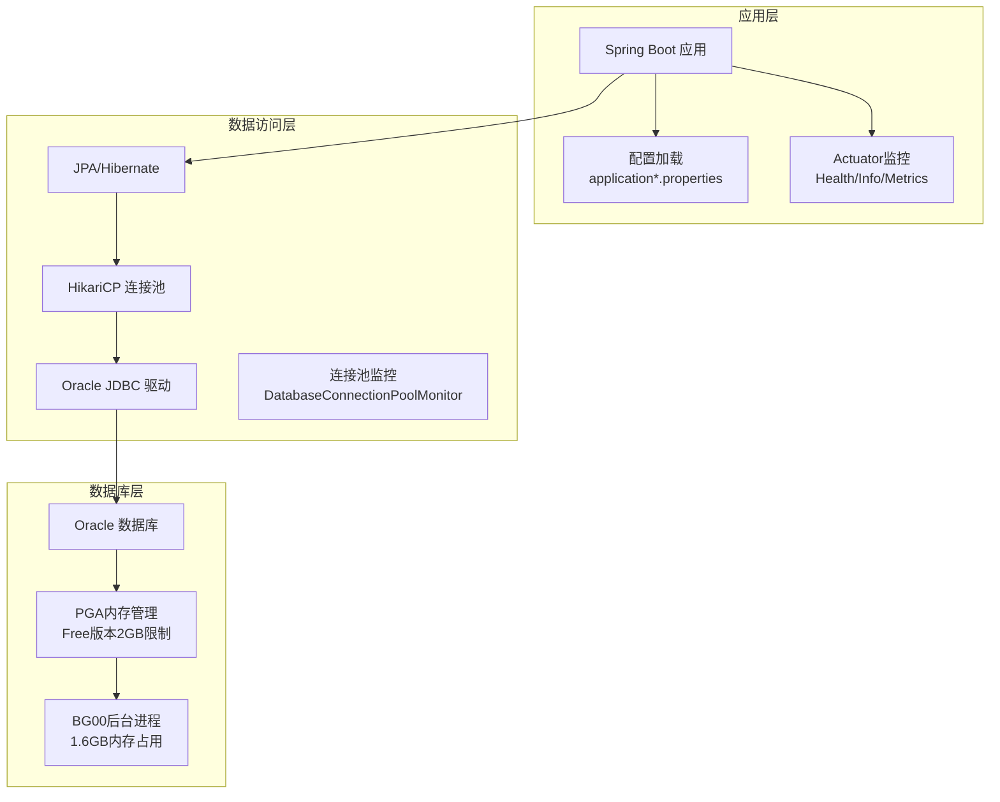
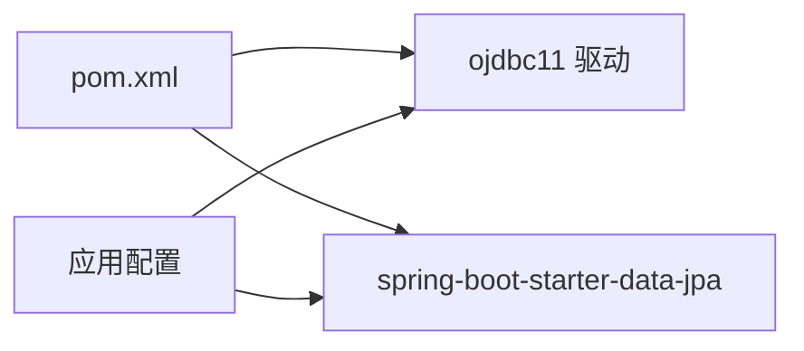

# 数据库配置

<cite>
**本文引用的文件**
- [application.properties](file://med_ai_assistant_1.0_bs_backend/src/main/resources/application.properties)
- [application-oracle.properties](file://med_ai_assistant_1.0_bs_backend/src/main/resources/application-oracle.properties)
- [application-dev.properties](file://med_ai_assistant_1.0_bs_backend/src/main/resources/application-dev.properties)
- [application.properties（main-linux-oracle）](file://med_ai_assistant_1.0_bs_backend/deploy/main-linux-oracle/config/application.properties)
- [pom.xml](file://med_ai_assistant_1.0_bs_backend/pom.xml)
- [init.sql](file://med_ai_assistant_1.0_bs_backend/init.sql)
- [Oracle数据库PGA内存超限错误修复-2026年03月14日.md](file://med_ai_assistant_1.0_bs_backend/doc/问题修复/Oracle数据库PGA内存超限错误修复-2026年03月14日.md)
- [更新日志-2026-03-14.md](file://med_ai_assistant_1.0_bs_backend/doc/更新日志/2026-03-14.md)
</cite>

## 更新摘要
**变更内容**
- 新增Oracle数据库PGA内存超限问题的故障排查案例
- 添加BG00进程内存释放的解决方案
- 更新ORA-04036错误的解决方法
- 增加v0.4.050版本的数据库性能优化实践
- 补充Oracle Free版本内存限制的注意事项

## 目录
1. [简介](#简介)
2. [项目结构](#项目结构)
3. [核心组件](#核心组件)
4. [架构总览](#架构总览)
5. [详细组件分析](#详细组件分析)
6. [依赖关系分析](#依赖关系分析)
7. [性能考虑](#性能考虑)
8. [故障排查指南](#故障排查指南)
9. [Oracle数据库PGA内存超限问题](#oracle数据库pga内存超限问题)
10. [结论](#结论)
11. [附录](#附录)

## 简介
本文件面向MedAiAssistant 1.0 BS后端的数据库配置，聚焦于Oracle数据库连接与运行配置，涵盖以下主题：
- Oracle连接参数（连接URL、用户名、密码、驱动）
- 连接池（HikariCP）配置与优化
- 事务与JPA/Hibernate配置要点
- 初始化脚本、Schema与表结构映射思路
- 性能优化、连接超时、日志与监控
- 常见连接问题排查与解决方案
- **新增**：Oracle数据库PGA内存超限问题的故障排查与解决方案

说明：当前仓库中未发现实际的实体类或JPA映射文件，因此本文件以配置与部署角度给出可操作的配置清单与流程建议。

## 项目结构
与数据库配置直接相关的文件主要位于后端资源目录与部署配置目录中，核心文件如下：
- 应用主配置：application.properties
- Oracle专用配置：application-oracle.properties
- 开发环境示例：application-dev.properties
- 生产/测试环境配置（main-linux-oracle）：deploy/main-linux-oracle/config/application.properties
- 依赖与驱动：pom.xml
- 初始化脚本：init.sql
- **新增**：Oracle PGA内存超限问题修复文档



**图表来源**
- [application.properties](file://med_ai_assistant_1.0_bs_backend/src/main/resources/application.properties#L1-L287)
- [application-oracle.properties](file://med_ai_assistant_1.0_bs_backend/src/main/resources/application-oracle.properties#L1-L11)
- [application-dev.properties](file://med_ai_assistant_1.0_bs_backend/src/main/resources/application-dev.properties#L1-L2)
- [application.properties（main-linux-oracle）](file://med_ai_assistant_1.0_bs_backend/deploy/main-linux-oracle/config/application.properties#L1-L189)
- [pom.xml](file://med_ai_assistant_1.0_bs_backend/pom.xml#L98-L124)
- [init.sql](file://med_ai_assistant_1.0_bs_backend/init.sql#L1-L119)
- [Oracle数据库PGA内存超限错误修复-2026年03月14日.md](file://med_ai_assistant_1.0_bs_backend/doc/问题修复/Oracle数据库PGA内存超限错误修复-2026年03月14日.md#L1-L173)

**章节来源**
- [application.properties](file://med_ai_assistant_1.0_bs_backend/src/main/resources/application.properties#L1-L287)
- [application-oracle.properties](file://med_ai_assistant_1.0_bs_backend/src/main/resources/application-oracle.properties#L1-L11)
- [application-dev.properties](file://med_ai_assistant_1.0_bs_backend/src/main/resources/application-dev.properties#L1-L2)
- [application.properties（main-linux-oracle）](file://med_ai_assistant_1.0_bs_backend/deploy/main-linux-oracle/config/application.properties#L1-L189)
- [pom.xml](file://med_ai_assistant_1.0_bs_backend/pom.xml#L98-L124)
- [init.sql](file://med_ai_assistant_1.0_bs_backend/init.sql#L1-L119)

## 核心组件
- 数据库连接参数
  - 连接URL：基于动态属性拼接，支持本地与内网Oracle服务器切换
  - 用户名/密码：从活动服务器配置中注入
  - 驱动类名：Oracle JDBC驱动
- 连接池（HikariCP）
  - 连接池大小、空闲超时、最大存活时间、连接超时、泄漏检测阈值、校验超时、保活时间、测试查询、初始化失败超时
  - Oracle网络与读写超时、线程本地缓冲缓存、早期通知等特性开关
- JPA/Hibernate
  - 关闭DDL自动建模，避免启动失败与类型验证冲突
  - Oracle方言与时区配置
  - SQL日志级别控制
- 初始化脚本
  - 数据库、用户、权限、基础表与视图
  - MySQL语法（与Oracle不完全一致），需注意差异

**章节来源**
- [application.properties](file://med_ai_assistant_1.0_bs_backend/src/main/resources/application.properties#L30-L59)
- [application-oracle.properties](file://med_ai_assistant_1.0_bs_backend/src/main/resources/application-oracle.properties#L4-L8)
- [application.properties（main-linux-oracle）](file://med_ai_assistant_1.0_bs_backend/deploy/main-linux-oracle/config/application.properties#L25-L44)
- [pom.xml](file://med_ai_assistant_1.0_bs_backend/pom.xml#L98-L124)
- [init.sql](file://med_ai_assistant_1.0_bs_backend/init.sql#L1-L119)

## 架构总览
下图展示应用如何通过配置加载Oracle连接参数，并由HikariCP提供连接池，再由JPA/Hibernate进行ORM访问。



**图表来源**
- [application.properties](file://med_ai_assistant_1.0_bs_backend/src/main/resources/application.properties#L30-L59)
- [application-oracle.properties](file://med_ai_assistant_1.0_bs_backend/src/main/resources/application-oracle.properties#L1-L11)
- [application.properties（main-linux-oracle）](file://med_ai_assistant_1.0_bs_backend/deploy/main-linux-oracle/config/application.properties#L25-L44)
- [pom.xml](file://med_ai_assistant_1.0_bs_backend/pom.xml#L98-L124)
- [Oracle数据库PGA内存超限错误修复-2026年03月14日.md](file://med_ai_assistant_1.0_bs_backend/doc/问题修复/Oracle数据库PGA内存超限错误修复-2026年03月14日.md#L1-L173)

## 详细组件分析

### Oracle连接参数配置
- 连接URL
  - 采用动态属性拼接，根据当前活动服务器（本地/内网）决定IP、端口与SID
  - URL模板与占位符在主配置中定义
- 用户名/密码
  - 从活动服务器配置注入，便于切换不同环境
- 驱动类名
  - 指定Oracle JDBC驱动类名
- 方言与DDL
  - Oracle专用配置显式设置方言，并禁用DDL自动建模

**章节来源**
- [application.properties](file://med_ai_assistant_1.0_bs_backend/src/main/resources/application.properties#L14-L34)
- [application-oracle.properties](file://med_ai_assistant_1.0_bs_backend/src/main/resources/application-oracle.properties#L1-L11)

### HikariCP连接池配置
- 基础参数
  - 最大池大小、最小空闲、连接超时、空闲超时、最大存活时间、保活时间
- 泄漏检测与校验
  - 泄漏检测阈值、连接测试查询、初始化失败超时、校验超时
- Oracle网络与读写超时
  - CONNECT_TIMEOUT、READ_TIMEOUT等
- 线程与缓冲
  - useThreadLocalBufferCache、ENABLE_EARLY_NOTIFICATION等
- 测试查询
  - 使用Oracle兼容的测试查询

**章节来源**
- [application.properties（main-linux-oracle）](file://med_ai_assistant_1.0_bs_backend/deploy/main-linux-oracle/config/application.properties#L25-L44)
- [application.properties](file://med_ai_assistant_1.0_bs_backend/src/main/resources/application.properties#L36-L59)

### JPA/Hibernate配置
- DDL策略
  - 关闭自动建模，避免启动失败与类型验证冲突
- 方言与时区
  - Oracle方言与Asia/Shanghai时区
- SQL日志
  - 关闭SQL输出，降低日志噪声
- 物理命名策略
  - 表名/列名映射策略

**章节来源**
- [application-oracle.properties](file://med_ai_assistant_1.0_bs_backend/src/main/resources/application-oracle.properties#L4-L8)
- [application.properties](file://med_ai_assistant_1.0_bs_backend/src/main/resources/application.properties#L63-L84)

### 初始化脚本与Schema
- 数据库与用户
  - 创建数据库、应用用户与root用户并授权
- 参数设置
  - 设置最大连接数、等待超时、缓冲池大小、日志文件大小等
- 基础表与视图
  - 版本管理表、系统配置表、数据库状态视图、连接状态视图
- 注意事项
  - 脚本使用MySQL语法，部署至Oracle时需转换为Oracle兼容语法

**章节来源**
- [init.sql](file://med_ai_assistant_1.0_bs_backend/init.sql#L1-L119)

### 事务管理配置
- 事务管理器
  - 使用Spring声明式事务，默认JpaTransactionManager
- 传播行为与隔离级别
  - 由业务方法与注解控制，配置文件中未显式覆盖
- 事务超时与回滚规则
  - 由业务层定义，配置文件中未显式覆盖

**章节来源**
- [application.properties（main-linux-oracle）](file://med_ai_assistant_1.0_bs_backend/deploy/main-linux-oracle/config/application.properties#L75-L77)

### 开发环境示例
- 开发环境用户名占位符
  - 提供占位符以便本地覆盖真实凭据

**章节来源**
- [application-dev.properties](file://med_ai_assistant_1.0_bs_backend/src/main/resources/application-dev.properties#L1-L2)

## 依赖关系分析
- Oracle JDBC驱动
  - 通过Maven引入ojdbc11，版本与作用域在POM中定义
- Spring Data JPA
  - 提供JPA/Hibernate集成与连接池自动配置入口
- Actuator与监控
  - 暴露健康与指标端点，辅助诊断连接池与数据库状态



**图表来源**
- [pom.xml](file://med_ai_assistant_1.0_bs_backend/pom.xml#L98-L124)
- [application.properties（main-linux-oracle）](file://med_ai_assistant_1.0_bs_backend/deploy/main-linux-oracle/config/application.properties#L75-L77)

**章节来源**
- [pom.xml](file://med_ai_assistant_1.0_bs_backend/pom.xml#L98-L124)
- [application.properties（main-linux-oracle）](file://med_ai_assistant_1.0_bs_backend/deploy/main-linux-oracle/config/application.properties#L75-L77)

## 性能考虑
- 连接池参数
  - 合理设置最大池大小、空闲超时、最大存活时间，避免资源浪费与抖动
  - 连接超时与校验超时应结合业务峰值与网络状况调整
- 泄漏检测
  - 启用泄漏检测阈值，结合日志定位未释放连接
- Oracle特性
  - 线程本地缓冲缓存、早期通知等特性可提升高并发场景稳定性
- SQL日志
  - 生产环境关闭SQL日志，避免I/O与CPU开销
- 线程池与调度
  - 业务线程池与调度线程池参数与数据库连接池协同配置，避免争抢
- **新增**：PGA内存管理
  - Oracle Free版本有2GB内存限制，需合理配置pga_aggregate_limit参数
  - 监控BG00后台进程内存占用，避免超过限制

**章节来源**
- [application.properties（main-linux-oracle）](file://med_ai_assistant_1.0_bs_backend/deploy/main-linux-oracle/config/application.properties#L25-L44)
- [application.properties](file://med_ai_assistant_1.0_bs_backend/src/main/resources/application.properties#L86-L88)
- [Oracle数据库PGA内存超限错误修复-2026年03月14日.md](file://med_ai_assistant_1.0_bs_backend/doc/问题修复/Oracle数据库PGA内存超限错误修复-2026年03月14日.md#L1-L173)

## 故障排查指南
- 启动失败（DDL相关）
  - 现象：启动时报DDL验证或类型不匹配错误
  - 排查：确认已禁用自动DDL建模
  - 参考
    - [application-oracle.properties](file://med_ai_assistant_1.0_bs_backend/src/main/resources/application-oracle.properties#L4-L8)
    - [application.properties](file://med_ai_assistant_1.0_bs_backend/src/main/resources/application.properties#L63-L75)
- 连接超时
  - 现象：获取连接超时或查询超时
  - 排查：检查连接池大小、连接超时、网络超时、Oracle READ_TIMEOUT
  - 参考
    - [application.properties（main-linux-oracle）](file://med_ai_assistant_1.0_bs_backend/deploy/main-linux-oracle/config/application.properties#L25-L44)
    - [application.properties](file://med_ai_assistant_1.0_bs_backend/src/main/resources/application.properties#L36-L59)
- 连接泄漏
  - 现象：连接池增长、最终耗尽
  - 排查：启用泄漏检测阈值，结合HikariCP与Oracle JDBC日志定位
  - 参考
    - [application.properties（main-linux-oracle）](file://med_ai_assistant_1.0_bs_backend/deploy/main-linux-oracle/config/application.properties#L165-L177)
- 方言与类型不匹配
  - 现象：方言检测异常或类型映射错误
  - 排查：确认Oracle方言设置与DDL策略
  - 参考
    - [application-oracle.properties](file://med_ai_assistant_1.0_bs_backend/src/main/resources/application-oracle.properties#L7-L8)
- 初始化脚本不兼容
  - 现象：部署至Oracle时报语法错误
  - 排查：将脚本中的MySQL语法转换为Oracle兼容语法
  - 参考
    - [init.sql](file://med_ai_assistant_1.0_bs_backend/init.sql#L1-L119)

### **新增**：Oracle数据库PGA内存超限问题排查

- **ORA-04036错误**
  - 现象：PGA memory used by the instance or PDB exceeds PGA_AGGREGATE_LIMIT
  - 影响：数据库操作失败，事务回滚
  - 根本原因：Oracle AI Database 26ai Free版本内存限制为2GB，初始配置4G超过限制
  - 解决方案：
    1. 调整pga_aggregate_limit参数：从4G降至2G
    2. 重启Oracle容器释放BG00进程占用的1.6GB内存
    3. 验证：不再出现ORA-04036错误
  - 预防措施：
    - 监控PGA内存使用情况
    - 关注Oracle Free版本内存限制
    - 优化大批量数据插入逻辑

**章节来源**
- [Oracle数据库PGA内存超限错误修复-2026年03月14日.md](file://med_ai_assistant_1.0_bs_backend/doc/问题修复/Oracle数据库PGA内存超限错误修复-2026年03月14日.md#L1-L173)
- [更新日志-2026-03-14.md](file://med_ai_assistant_1.0_bs_backend/doc/更新日志/2026-03-14.md#L1-L78)

## Oracle数据库PGA内存超限问题

### 问题背景
在v0.4.050版本中，系统遇到了Oracle数据库PGA内存超限问题，具体表现为ORA-04036错误。该问题发生在执行服务器的Oracle数据库中，由于Oracle AI Database 26ai Free版本的严格内存限制导致。

### 问题分析
- **环境信息**：Oracle AI Database 26ai Free Release 23.26.0.0.0，Docker容器部署
- **内存限制**：Free版本最大RAM为2GB，最大数据存储为12GB
- **初始配置**：pga_aggregate_limit设置为4G，超过Free版本限制
- **内存占用**：BG00后台进程占用约1.6GB PGA内存

### 解决方案
1. **调整PGA内存限制**
   ```sql
   ALTER SYSTEM SET PGA_AGGREGATE_LIMIT = 2048M SCOPE=BOTH;
   ```

2. **重启Oracle容器释放内存**
   ```bash
   docker restart oracle-db
   ```

3. **验证修复结果**
   - PGA内存使用降至正常水平
   - ENCRYPTED_DATA_TEMP表插入操作正常执行
   - 不再出现ORA-04036错误

### 预防措施
- **监控PGA内存使用**
  ```sql
  SELECT 
      ROUND(SUM(PGA_USED_MEM)/1024/1024/1024, 2) AS "PGA_USED_GB",
      ROUND(SUM(PGA_ALLOC_MEM)/1024/1024/1024, 2) AS "PGA_ALLOC_GB",
      COUNT(*) AS "SESSION_COUNT"
  FROM V$PROCESS;
  ```

- **监控高内存占用会话**
  ```sql
  SELECT 
      s.sid,
      s.serial#,
      s.username,
      s.program,
      ROUND(p.pga_used_mem/1024/1024, 2) AS "PGA_MB"
  FROM V$SESSION s
  JOIN V$PROCESS p ON s.paddr = p.addr
  ORDER BY p.pga_used_mem DESC;
  ```

- **优化应用程序**
  - 分批插入大批量数据
  - 及时释放LOB字段数据
  - 合理配置HikariCP连接池参数

**章节来源**
- [Oracle数据库PGA内存超限错误修复-2026年03月14日.md](file://med_ai_assistant_1.0_bs_backend/doc/问题修复/Oracle数据库PGA内存超限错误修复-2026年03月14日.md#L1-L173)
- [更新日志-2026-03-14.md](file://med_ai_assistant_1.0_bs_backend/doc/更新日志/2026-03-14.md#L1-L78)

## 结论
本配置文档基于现有仓库文件梳理了MedAiAssistant 1.0 BS后端的Oracle数据库连接与运行配置要点，重点包括：
- 动态连接参数与Oracle驱动
- HikariCP连接池的全面参数与Oracle特性优化
- JPA/Hibernate的DDL与日志策略
- 初始化脚本与Schema设计思路
- 性能优化与故障排查建议
- **新增**：Oracle数据库PGA内存超限问题的完整解决方案

由于实体映射文件不在当前仓库范围内，建议在后续迭代中补充实体类与Schema迁移脚本，以实现更完整的数据库生命周期管理。

**更新**：本次更新特别增加了Oracle数据库PGA内存超限问题的故障排查案例，体现了v0.4.050版本的数据库性能优化实践，包括BG00进程内存释放和ORA-04036错误的完整解决方案。

## 附录
- 配置清单（按类别）
  - 连接参数
    - 连接URL模板与占位符
      - [application.properties](file://med_ai_assistant_1.0_bs_backend/src/main/resources/application.properties#L30-L34)
    - 驱动类名
      - [application.properties](file://med_ai_assistant_1.0_bs_backend/src/main/resources/application.properties#L32-L33)
  - 连接池（HikariCP）
    - 基础参数
      - [application.properties（main-linux-oracle）](file://med_ai_assistant_1.0_bs_backend/deploy/main-linux-oracle/config/application.properties#L25-L37)
      - [application.properties](file://med_ai_assistant_1.0_bs_backend/src/main/resources/application.properties#L40-L51)
    - Oracle网络与读写超时
      - [application.properties（main-linux-oracle）](file://med_ai_assistant_1.0_bs_backend/deploy/main-linux-oracle/config/application.properties#L39-L44)
      - [application.properties](file://med_ai_assistant_1.0_bs_backend/src/main/resources/application.properties#L53-L58)
  - JPA/Hibernate
    - DDL策略与方言
      - [application-oracle.properties](file://med_ai_assistant_1.0_bs_backend/src/main/resources/application-oracle.properties#L4-L8)
      - [application.properties](file://med_ai_assistant_1.0_bs_backend/src/main/resources/application.properties#L63-L76)
    - SQL日志与时区
      - [application.properties](file://med_ai_assistant_1.0_bs_backend/src/main/resources/application.properties#L86-L81)
  - 初始化脚本
    - 数据库、用户、权限、基础表与视图
      - [init.sql](file://med_ai_assistant_1.0_bs_backend/init.sql#L1-L119)
  - 依赖与驱动
    - Oracle JDBC驱动与Spring Data JPA
      - [pom.xml](file://med_ai_assistant_1.0_bs_backend/pom.xml#L98-L124)
  - **新增**：Oracle PGA内存超限问题
    - 问题描述与影响
      - [Oracle数据库PGA内存超限错误修复-2026年03月14日.md](file://med_ai_assistant_1.0_bs_backend/doc/问题修复/Oracle数据库PGA内存超限错误修复-2026年03月14日.md#L1-L173)
    - 解决方案与预防措施
      - [更新日志-2026-03-14.md](file://med_ai_assistant_1.0_bs_backend/doc/更新日志/2026-03-14.md#L1-L78)