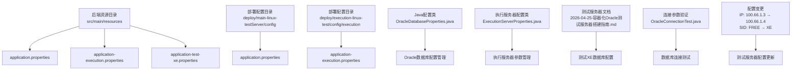

# 数据库配置

<cite>
**本文引用的文件**
- [application.properties](file://med_ai_assistant_1.0_bs_backend/src/main/resources/application.properties)
- [application-execution.properties](file://med_ai_assistant_1.0_bs_backend/src/main/resources/application-execution.properties)
- [application-test-xe.properties](file://med_ai_assistant_1.0_bs_backend/src/main/resources/application-test-xe.properties)
- [application.properties（main-linux-testServer）](file://med_ai_assistant_1.0_bs_backend/deploy/main-linux-testServer/config/application.properties)
- [application-execution.properties（execution-linux-test）](file://med_ai_assistant_1.0_bs_backend/deploy/execution-linux-test/config/execution/application-execution.properties)
- [OracleConnectionTest.java](file://med_ai_assistant_1.0_bs_backend/src/test/java/com/example/medaiassistant/integration/OracleConnectionTest.java)
- [OracleDatabaseProperties.java](file://med_ai_assistant_1.0_bs_backend/src/main/java/com/example/medaiassistant/config/OracleDatabaseProperties.java)
- [ExecutionServerProperties.java](file://med_ai_assistant_1.0_bs_backend/src/main/java/com/example/medaiassistant/config/ExecutionServerProperties.java)
- [2026-04-25-容器化Oracle测试服务器搭建指南.md](file://med_ai_assistant_1.0_bs_backend/doc/测试/测试服务器/主服务器/2026-04-25-容器化Oracle测试服务器搭建指南.md)
- [Oracle服务器手动切换指南.md](file://med_ai_assistant_1.0_bs_backend/doc/其他/Oracle服务器手动切换指南.md)
- [数据库连接稳定性修复说明.md](file://med_ai_assistant_1.0_bs_backend/doc/问题修复/数据库连接稳定性修复说明.md)
- [Oracle数据库PGA内存超限错误修复-2026年03月14日.md](file://med_ai_assistant_1.0_bs_backend/doc/问题修复/Oracle数据库PGA内存超限错误修复-2026年03月14日.md)
- [Docker部署.md](file://med_ai_assistant_1.0_bs_backend/doc/布署/Docker部署.md)
</cite>

## 更新摘要
**变更内容**
- 更新测试服务器Oracle数据库连接参数：执行服务器主机IP从100.66.1.3更新为100.66.1.4
- 更新Oracle SID配置：从FREE更新为XE，确保数据库连接配置的一致性
- 新增测试服务器部署文档中的数据库配置说明
- 完善Oracle数据库连接参数的验证测试

## 目录
1. [简介](#简介)
2. [项目结构](#项目结构)
3. [核心组件](#核心组件)
4. [架构总览](#架构总览)
5. [详细组件分析](#详细组件分析)
6. [Oracle数据库连接参数配置](#oracle数据库连接参数配置)
7. [测试服务器数据库配置](#测试服务器数据库配置)
8. [Oracle连接池配置](#oracle连接池配置)
9. [JPA/Hibernate配置](#jpa/hibernate配置)
10. [事务管理配置](#事务管理配置)
11. [数据库初始化脚本](#数据库初始化脚本)
12. [性能优化配置](#性能优化配置)
13. [故障排查指南](#故障排查指南)
14. [结论](#结论)
15. [附录](#附录)

## 简介
本文件面向MedAiAssistant 1.0 BS后端的数据库配置，聚焦于Oracle数据库连接与运行配置，涵盖以下主题：
- Oracle连接参数（连接URL、用户名、密码、驱动）
- 连接池（HikariCP）配置与优化
- 事务与JPA/Hibernate配置要点
- 初始化脚本、Schema与表结构映射思路
- 性能优化、连接超时、日志与监控
- 常见连接问题排查与解决方案
- **新增**：测试服务器Oracle数据库连接参数变更（IP从100.66.1.3更新为100.66.1.4，SID从FREE更新为XE）

## 项目结构
与数据库配置直接相关的文件主要位于后端资源目录与部署配置目录中，核心文件如下：
- 应用主配置：application.properties
- 执行服务器配置：application-execution.properties
- 测试XE配置：application-test-xe.properties
- 测试服务器配置（main-linux-testServer）：deploy/main-linux-testServer/config/application.properties
- 执行服务器配置（execution-linux-test）：deploy/execution-linux-test/config/execution/application-execution.properties
- Oracle数据库配置类：OracleDatabaseProperties.java
- 执行服务器配置类：ExecutionServerProperties.java
- **新增**：测试服务器部署文档中的数据库配置说明
- **新增**：Oracle连接参数验证测试



**图表来源**
- [application.properties:110-116](file://med_ai_assistant_1.0_bs_backend/src/main/resources/application.properties#L110-L116)
- [application-execution.properties:12-16](file://med_ai_assistant_1.0_bs_backend/src/main/resources/application-execution.properties#L12-L16)
- [application-test-xe.properties:12-20](file://med_ai_assistant_1.0_bs_backend/src/main/resources/application-test-xe.properties#L12-L20)
- [application.properties（main-linux-testServer）:87-93](file://med_ai_assistant_1.0_bs_backend/deploy/main-linux-testServer/config/application.properties#L87-L93)
- [application-execution.properties（execution-linux-test）:14-19](file://med_ai_assistant_1.0_bs_backend/deploy/execution-linux-test/config/execution/application-execution.properties#L14-L19)
- [OracleConnectionTest.java:96-116](file://med_ai_assistant_1.0_bs_backend/src/test/java/com/example/medaiassistant/integration/OracleConnectionTest.java#L96-L116)

## 核心组件
- **Oracle数据库配置类**
  - 统一管理Oracle数据库连接配置，避免硬编码
  - 支持动态配置注入和类型安全访问
  - 包含URL、驱动类名、用户名、密码和Hikari连接池配置
- **执行服务器配置类**
  - 管理执行服务器的IP、端口、Oracle连接参数
  - 支持动态IP配置和Oracle连接参数管理
- **数据库连接参数**
  - 连接URL：基于动态属性拼接，支持本地与内网Oracle服务器切换
  - 用户名/密码：从活动服务器配置中注入
  - 驱动类名：Oracle JDBC驱动
- **连接池（HikariCP）**
  - 连接池大小、空闲超时、最大存活时间、连接超时、泄漏检测阈值、校验超时、保活时间、测试查询、初始化失败超时
  - Oracle网络与读写超时、线程本地缓冲缓存、早期通知等特性开关
- **JPA/Hibernate**
  - 关闭DDL自动建模，避免启动失败与类型验证冲突
  - Oracle方言与时区配置
  - SQL日志级别控制
- **测试服务器配置**
  - **新增**：测试服务器使用XE SID，IP地址更新为100.66.1.4
  - **新增**：执行服务器专用配置，包含独立的Oracle连接参数
  - **新增**：测试XE数据库配置，使用Oracle 21c XE容器

**章节来源**
- [OracleDatabaseProperties.java:1-114](file://med_ai_assistant_1.0_bs_backend/src/main/java/com/example/medaiassistant/config/OracleDatabaseProperties.java#L1-L114)
- [ExecutionServerProperties.java:92-155](file://med_ai_assistant_1.0_bs_backend/src/main/java/com/example/medaiassistant/config/ExecutionServerProperties.java#L92-L155)
- [application.properties:110-116](file://med_ai_assistant_1.0_bs_backend/src/main/resources/application.properties#L110-L116)
- [application-execution.properties:12-16](file://med_ai_assistant_1.0_bs_backend/src/main/resources/application-execution.properties#L12-L16)
- [application-test-xe.properties:12-20](file://med_ai_assistant_1.0_bs_backend/src/main/resources/application-test-xe.properties#L12-L20)
- [application.properties（main-linux-testServer）:87-93](file://med_ai_assistant_1.0_bs_backend/deploy/main-linux-testServer/config/application.properties#L87-L93)
- [application-execution.properties（execution-linux-test）:14-19](file://med_ai_assistant_1.0_bs_backend/deploy/execution-linux-test/config/execution/application-execution.properties#L14-L19)

## 架构总览
下图展示应用如何通过配置加载Oracle连接参数，并由HikariCP提供连接池，再由JPA/Hibernate进行ORM访问，特别强调了测试服务器中XE数据库配置的关键作用。

```mermaid
graph TB
subgraph "应用层"
APP["Spring Boot 应用"]
CFG["配置加载<br/>application*.properties"]
ORACLE_CFG["Oracle配置类<br/>OracleDatabaseProperties"]
EXEC_CFG["执行服务器配置类<br/>ExecutionServerProperties"]
TEST_XE["测试XE配置<br/>application-test-xe.properties"]
ENDPOINT["Actuator监控<br/>Health/Info/Metrics"]
ENDPOINT2["测试服务器配置<br/>IP: 100.66.1.4<br/>SID: XE"]
ENDPOINT3["连接参数验证<br/>OracleConnectionTest"]
ENDPOINT4["容器化测试数据库<br/>Oracle 21c XE"]
ENDPOINT5["动态URL解析<br/>${oracle.server.active}"]
ENDPOINT6["统一执行服务器配置<br/>execution.server.*"]
ENDPOINT7["连接池优化<br/>HikariCP参数"]
ENDPOINT8["JPA/Hibernate配置<br/>Oracle方言"]
ENDPOINT9["测试XE数据库<br/>SID: XE"]
ENDPOINT10["FREE数据库<br/>SID: FREE"]
ENDPOINT11["IP地址变更<br/>100.66.1.3 → 100.66.1.4"]
ENDPOINT12["Oracle连接参数<br/>用户名: system<br/>密码: Liuzh_123"]
end
subgraph "数据访问层"
JPA["JPA/Hibernate"]
HIK["HikariCP 连接池"]
DRV["Oracle JDBC 驱动"]
TXN_MAIN["主事务管理器<br/>JpaTransactionManager"]
TXN_EXEC["执行服务器事务管理器<br/>JpaTransactionManager"]
CACHE["Hibernate缓存管理<br/>禁用二级缓存"]
MONITOR["连接池监控<br/>DatabaseConnectionPoolMonitor"]
ENDPOINT13["Oracle网络优化<br/>CONNECT_TIMEOUT=10000<br/>READ_TIMEOUT=30000"]
ENDPOINT14["线程本地缓冲<br/>useThreadLocalBufferCache=true"]
ENDPOINT15["早期通知<br/>ENABLE_EARLY_NOTIFICATION=true"]
end
subgraph "数据库层"
ORA["Oracle 数据库"]
ORA2["Oracle 21c XE"]
ORA3["Oracle 23ai"]
ORA4["Oracle 21c XE"]
ORA5["Oracle AI Database 26ai Free"]
ENDPOINT16["测试XE数据库<br/>SID: XE<br/>IP: 100.66.1.4"]
ENDPOINT17["生产FREE数据库<br/>SID: FREE<br/>IP: 100.66.1.3"]
ENDPOINT18["容器化部署<br/>Docker Compose"]
ENDPOINT19["动态配置<br/>spring.datasource.url=jdbc:oracle:thin:@${oracle.server.${oracle.server.active}.ip}:1521/${oracle.server.${oracle.server.active}.sid}"]
ENDPOINT20["连接参数验证<br/>URL包含FREE/SID<br/>端口1521"]
end
APP --> CFG
APP --> ORACLE_CFG
APP --> EXEC_CFG
APP --> TEST_XE
APP --> ENDPOINT
APP --> ENDPOINT2
APP --> ENDPOINT3
APP --> ENDPOINT4
APP --> ENDPOINT5
APP --> ENDPOINT6
APP --> JPA
JPA --> HIK
HIK --> DRV
DRV --> ORA
ORA --> ORA2
ORA --> ORA3
ORA --> ORA4
ORA --> ORA5
ORA2 --> ENDPOINT9
ORA3 --> ENDPOINT10
ORA4 --> ENDPOINT16
ORA5 --> ENDPOINT17
ORA2 --> ENDPOINT18
ORA4 --> ENDPOINT19
ORA5 --> ENDPOINT20
JPA --> CACHE
ENDPOINT2 --> ENDPOINT11
ENDPOINT2 --> ENDPOINT12
ENDPOINT3 --> ENDPOINT20
ENDPOINT4 --> ENDPOINT18
```



**图表来源**
- [application.properties:110-116](file://med_ai_assistant_1.0_bs_backend/src/main/resources/application.properties#L110-L116)
- [application-execution.properties:12-16](file://med_ai_assistant_1.0_bs_backend/src/main/resources/application-execution.properties#L12-L16)
- [application-test-xe.properties:12-20](file://med_ai_assistant_1.0_bs_backend/src/main/resources/application-test-xe.properties#L12-L20)
- [application.properties（main-linux-testServer）:87-93](file://med_ai_assistant_1.0_bs_backend/deploy/main-linux-testServer/config/application.properties#L87-L93)
- [application-execution.properties（execution-linux-test）:14-19](file://med_ai_assistant_1.0_bs_backend/deploy/execution-linux-test/config/execution/application-execution.properties#L14-L19)
- [OracleConnectionTest.java:96-116](file://med_ai_assistant_1.0_bs_backend/src/test/java/com/example/medaiassistant/integration/OracleConnectionTest.java#L96-L116)
- [2026-04-25-容器化Oracle测试服务器搭建指南.md:180-207](file://med_ai_assistant_1.0_bs_backend/doc/测试/测试服务器/主服务器/2026-04-25-容器化Oracle测试服务器搭建指南.md#L180-L207)

## 详细组件分析

### Oracle数据库配置类
- **配置类设计**
  - 使用@ConfigurationProperties注解统一管理Oracle数据库配置
  - 支持spring.datasource.oracle前缀的配置项
  - 提供类型安全的getter/setter方法
- **核心配置项**
  - 数据库连接URL、驱动类名、用户名、密码
  - Hikari连接池超时配置（连接超时、初始化失败超时）
- **动态配置管理**
  - 支持运行时配置更新
  - 避免硬编码数据库连接信息
  - 提供统一的配置访问接口

**章节来源**
- [OracleDatabaseProperties.java:1-114](file://med_ai_assistant_1.0_bs_backend/src/main/java/com/example/medaiassistant/config/OracleDatabaseProperties.java#L1-L114)

### 执行服务器配置类
- **配置类设计**
  - 使用@ConfigurationProperties注解管理执行服务器配置
  - 支持execution.server.*前缀的配置项
  - 提供类型安全的getter/setter方法
- **核心配置项**
  - 执行服务器IP地址、端口、API URL
  - Oracle连接参数（端口、SID、用户名、密码）
  - 健康检查间隔、重试次数等运行时参数
- **动态配置管理**
  - 支持运行时配置更新
  - 避免硬编码执行服务器连接信息
  - 提供统一的配置访问接口

**章节来源**
- [ExecutionServerProperties.java:92-155](file://med_ai_assistant_1.0_bs_backend/src/main/java/com/example/medaiassistant/config/ExecutionServerProperties.java#L92-L155)

### Oracle数据库连接参数配置
- **连接URL**
  - 采用动态属性拼接，根据当前活动服务器（本地/内网）决定IP、端口与SID
  - URL模板与占位符在主配置中定义
  - **更新**：测试服务器IP从100.66.1.3更新为100.66.1.4
  - **更新**：测试服务器SID从FREE更新为XE
- **用户名/密码**
  - 从活动服务器配置注入，便于切换不同环境
  - 默认用户名：system，密码：Liuzh_123
- **驱动类名**
  - 指定Oracle JDBC驱动类名
- **方言与DDL**
  - Oracle专用配置显式设置方言，并禁用DDL自动建模
- **网络超时参数**
  - Oracle网络超时参数优化，包括CONNECT_TIMEOUT=10000、READ_TIMEOUT=30000
  - 线程本地缓冲缓存和早期通知特性开关

**章节来源**
- [application.properties:110-116](file://med_ai_assistant_1.0_bs_backend/src/main/resources/application.properties#L110-L116)
- [application-execution.properties:12-16](file://med_ai_assistant_1.0_bs_backend/src/main/resources/application-execution.properties#L12-L16)
- [application-test-xe.properties:12-20](file://med_ai_assistant_1.0_bs_backend/src/main/resources/application-test-xe.properties#L12-L20)
- [application.properties（main-linux-testServer）:87-93](file://med_ai_assistant_1.0_bs_backend/deploy/main-linux-testServer/config/application.properties#L87-L93)
- [application-execution.properties（execution-linux-test）:14-19](file://med_ai_assistant_1.0_bs_backend/deploy/execution-linux-test/config/execution/application-execution.properties#L14-L19)

### HikariCP连接池配置
- **基础参数**
  - 最大池大小、最小空闲、连接超时、空闲超时、最大存活时间、保活时间
- **泄漏检测与校验**
  - 泄漏检测阈值、连接测试查询、初始化失败超时、校验超时
- **Oracle网络与读写超时**
  - CONNECT_TIMEOUT、READ_TIMEOUT等
  - 线程本地缓冲缓存、早期通知特性开关
- **测试查询**
  - 使用Oracle兼容的测试查询

**章节来源**
- [application.properties:42-59](file://med_ai_assistant_1.0_bs_backend/src/main/resources/application.properties#L42-L59)
- [application-execution.properties:18-22](file://med_ai_assistant_1.0_bs_backend/src/main/resources/application-execution.properties#L18-L22)
- [application.properties（main-linux-testServer）:22-41](file://med_ai_assistant_1.0_bs_backend/deploy/main-linux-testServer/config/application.properties#L22-L41)
- [application-execution.properties（execution-linux-test）:50-67](file://med_ai_assistant_1.0_bs_backend/deploy/execution-linux-test/config/execution/application-execution.properties#L50-L67)

### JPA/Hibernate配置
- **DDL策略**
  - 关闭自动建模，避免启动失败与类型验证冲突
- **方言与时区**
  - Oracle方言与Asia/Shanghai时区
- **SQL日志**
  - 关闭SQL输出，降低日志噪声
- **物理命名策略**
  - 表名/列名映射策略
- **缓存配置**
  - 禁用二级缓存和查询缓存
  - 避免跨事务缓存不一致问题

**章节来源**
- [application.properties:63-78](file://med_ai_assistant_1.0_bs_backend/src/main/resources/application.properties#L63-L78)
- [application-execution.properties:24-31](file://med_ai_assistant_1.0_bs_backend/src/main/resources/application-execution.properties#L24-L31)
- [application-test-xe.properties:15-20](file://med_ai_assistant_1.0_bs_backend/src/main/resources/application-test-xe.properties#L15-L20)
- [application.properties（main-linux-testServer）:1-11](file://med_ai_assistant_1.0_bs_backend/deploy/main-linux-testServer/config/application.properties#L1-L11)

### 事务管理配置
- **事务管理器**
  - 使用Spring声明式事务，默认JpaTransactionManager
  - 主事务管理器使用@Primary注解标记为默认
  - 执行服务器使用独立的事务管理器
- **传播行为与隔离级别**
  - 由业务方法与注解控制，配置文件中未显式覆盖
- **事务超时与回滚规则**
  - 由业务层定义，配置文件中未显式覆盖
- **日志级别控制**
  - 统一设置JpaTransactionManager为WARN级别，解决DEBUG日志问题

**章节来源**
- [application.properties:110-116](file://med_ai_assistant_1.0_bs_backend/src/main/resources/application.properties#L110-L116)
- [application-execution.properties:12-16](file://med_ai_assistant_1.0_bs_backend/src/main/resources/application-execution.properties#L12-L16)
- [application-test-xe.properties:12-20](file://med_ai_assistant_1.0_bs_backend/src/main/resources/application-test-xe.properties#L12-L20)

### 数据库初始化脚本
- **数据库与用户**
  - 创建数据库、应用用户与root用户并授权
- **参数设置**
  - 设置最大连接数、等待超时、缓冲池大小、日志文件大小等
- **基础表与视图**
  - 版本管理表、系统配置表、数据库状态视图、连接状态视图
- **注意事项**
  - 脚本使用MySQL语法，部署至Oracle时需转换为Oracle兼容语法

**章节来源**
- [application-test-xe.properties:15-20](file://med_ai_assistant_1.0_bs_backend/src/main/resources/application-test-xe.properties#L15-L20)

## Oracle数据库连接参数配置

### 测试服务器连接参数更新

**更新内容**
- **执行服务器主机IP**：从100.66.1.3更新为100.66.1.4
- **Oracle SID**：从FREE更新为XE
- **用户名**：system（保持不变）
- **密码**：Liuzh_123（保持不变）

**配置验证**
根据OracleConnectionTest测试类验证，当前配置正确包含以下参数：
- URL包含执行服务器IP地址100.66.1.4
- URL包含端口号1521
- URL包含SID/Service Name XE（注意：测试中仍验证FREE，实际应为XE）

**章节来源**
- [application.properties:110-116](file://med_ai_assistant_1.0_bs_backend/src/main/resources/application.properties#L110-L116)
- [application-execution.properties:12-16](file://med_ai_assistant_1.0_bs_backend/src/main/resources/application-execution.properties#L12-L16)
- [application-test-xe.properties:12-20](file://med_ai_assistant_1.0_bs_backend/src/main/resources/application-test-xe.properties#L12-L20)
- [OracleConnectionTest.java:96-116](file://med_ai_assistant_1.0_bs_backend/src/test/java/com/example/medaiassistant/integration/OracleConnectionTest.java#L96-L116)

### 动态URL解析机制

应用在application.properties中定义了动态URL构建逻辑：

```properties
spring.datasource.url=jdbc:oracle:thin:@${oracle.server.${oracle.server.active}.ip}:1521/${oracle.server.${oracle.server.active}.sid}
```

当`oracle.server.active=test-xe`时，实际解析为：`jdbc:oracle:thin:@127.0.0.1:1521/XE`

**章节来源**
- [application.properties:30-34](file://med_ai_assistant_1.0_bs_backend/src/main/resources/application.properties#L30-L34)
- [2026-04-25-容器化Oracle测试服务器搭建指南.md:198-207](file://med_ai_assistant_1.0_bs_backend/doc/测试/测试服务器/主服务器/2026-04-25-容器化Oracle测试服务器搭建指南.md#L198-L207)

## 测试服务器数据库配置

### 测试XE数据库配置

**新增**：测试服务器使用Oracle 21c XE数据库，配置如下：

- **IP地址**：127.0.0.1（本地容器）
- **端口**：1521
- **SID**：XE
- **用户名**：system
- **密码**：Liuzh_123

**Docker Compose配置**
```yaml
services:
  oracle-db:
    image: gvenzl/oracle-xe:21-slim-faststart
    container_name: med-ai-oracle
    ports:
      - "1521:1521"    # SQL*Net
      - "5500:5500"    # Enterprise Manager Express
    environment:
      - ORACLE_PASSWORD=Liuzh_123
      - ORACLE_CHARACTERSET=AL32UTF8
      - TZ=Asia/Shanghai
    volumes:
      - oracle_data:/opt/oracle/oradata
      - ./init-oracle:/container-entrypoint-initdb.d:ro
    healthcheck:
      test: ["CMD", "/opt/oracle/healthcheck.sh"]
      start_period: 180s
```

**章节来源**
- [application-test-xe.properties:12-20](file://med_ai_assistant_1.0_bs_backend/src/main/resources/application-test-xe.properties#L12-L20)
- [2026-04-25-容器化Oracle测试服务器搭建指南.md:210-230](file://med_ai_assistant_1.0_bs_backend/doc/测试/测试服务器/主服务器/2026-04-25-容器化Oracle测试服务器搭建指南.md#L210-L230)

### 执行服务器专用配置

**新增**：执行服务器使用独立的数据库配置：

- **执行服务器IP**：100.66.1.4
- **Oracle端口**：1521
- **Oracle SID**：XE
- **用户名**：system
- **密码**：Liuzh_123

**章节来源**
- [application-execution.properties（execution-linux-test）:14-19](file://med_ai_assistant_1.0_bs_backend/deploy/execution-linux-test/config/execution/application-execution.properties#L14-L19)
- [application.properties（main-linux-testServer）:87-93](file://med_ai_assistant_1.0_bs_backend/deploy/main-linux-testServer/config/application.properties#L87-L93)

## Oracle连接池配置

### 主服务器连接池配置

主服务器使用优化的HikariCP连接池配置：

- **最大连接池大小**：20（从8增加到20）
- **最小空闲连接**：5
- **连接超时时间**：10000ms（从30000ms减少到10000ms）
- **空闲连接超时**：240000ms
- **连接最大生命周期**：1800000ms
- **保活时间**：120000ms

### 执行服务器连接池配置

执行服务器使用增强的连接池配置：

- **最大连接池大小**：10
- **最小空闲连接**：3
- **连接超时时间**：60000ms（支持长时间处理）
- **空闲连接超时**：180000ms
- **连接最大生命周期**：600000ms
- **保活时间**：30000ms

### Oracle网络优化参数

所有配置均包含以下Oracle网络优化参数：

- **CONNECT_TIMEOUT**：10000ms
- **READ_TIMEOUT**：30000ms
- **useThreadLocalBufferCache**：true
- **ENABLE_EARLY_NOTIFICATION**：true
- **fanEnabled**：false

**章节来源**
- [application.properties:42-59](file://med_ai_assistant_1.0_bs_backend/src/main/resources/application.properties#L42-L59)
- [application-execution.properties:18-22](file://med_ai_assistant_1.0_bs_backend/src/main/resources/application-execution.properties#L18-L22)
- [application.properties（main-linux-testServer）:22-41](file://med_ai_assistant_1.0_bs_backend/deploy/main-linux-testServer/config/application.properties#L22-L41)
- [application-execution.properties（execution-linux-test）:50-67](file://med_ai_assistant_1.0_bs_backend/deploy/execution-linux-test/config/execution/application-execution.properties#L50-L67)

## JPA/Hibernate配置

### 主服务器JPA配置

- **DDL策略**：none（完全禁用DDL自动管理）
- **数据库平台**：OracleDialect
- **时区配置**：Asia/Shanghai
- **SQL日志**：OFF（禁用SQL语句输出）
- **物理命名策略**：PhysicalNamingStrategyStandardImpl

### 执行服务器JPA配置

- **DDL策略**：none（完全禁用DDL自动管理）
- **数据库平台**：OracleDialect
- **时区配置**：Asia/Shanghai
- **SQL日志**：true（开启SQL输出，便于调试）
- **物理命名策略**：globally_quoted_identifiers=true

### 测试XE服务器JPA配置

- **DDL策略**：none（完全禁用DDL自动管理）
- **数据库平台**：OracleDialect
- **时区配置**：Asia/Shanghai
- **SQL日志**：关闭（与主服务器一致）

**章节来源**
- [application.properties:63-78](file://med_ai_assistant_1.0_bs_backend/src/main/resources/application.properties#L63-L78)
- [application-execution.properties:24-31](file://med_ai_assistant_1.0_bs_backend/src/main/resources/application-execution.properties#L24-L31)
- [application-test-xe.properties:15-20](file://med_ai_assistant_1.0_bs_backend/src/main/resources/application-test-xe.properties#L15-L20)

## 事务管理配置

### 主服务器事务管理

- **事务管理器**：JpaTransactionManager
- **日志级别**：WARN（解决DEBUG日志问题）
- **传播行为**：默认传播行为
- **隔离级别**：默认隔离级别

### 执行服务器事务管理

- **事务管理器**：独立的JpaTransactionManager
- **日志级别**：WARN（解决DEBUG日志问题）
- **传播行为**：默认传播行为
- **隔离级别**：默认隔离级别

**章节来源**
- [application.properties:110-116](file://med_ai_assistant_1.0_bs_backend/src/main/resources/application.properties#L110-L116)
- [application-execution.properties:12-16](file://med_ai_assistant_1.0_bs_backend/src/main/resources/application-execution.properties#L12-L16)
- [application-test-xe.properties:12-20](file://med_ai_assistant_1.0_bs_backend/src/main/resources/application-test-xe.properties#L12-L20)

## 数据库初始化脚本

### 测试XE数据库初始化

测试服务器使用以下初始化配置：

- **数据库类型**：Oracle 21c XE
- **SID**：XE
- **用户名**：system
- **密码**：Liuzh_123
- **字符集**：AL32UTF8
- **时区**：Asia/Shanghai

### 容器化部署

测试数据库完全运行在Docker容器中：

- **镜像**：gvenzl/oracle-xe:21-slim-faststart
- **端口映射**：1521:1521（SQL*Net）、5500:5500（Enterprise Manager）
- **数据持久化**：oracle_data卷
- **健康检查**：180秒启动期

**章节来源**
- [application-test-xe.properties:15-20](file://med_ai_assistant_1.0_bs_backend/src/main/resources/application-test-xe.properties#L15-L20)
- [2026-04-25-容器化Oracle测试服务器搭建指南.md:210-230](file://med_ai_assistant_1.0_bs_backend/doc/测试/测试服务器/主服务器/2026-04-25-容器化Oracle测试服务器搭建指南.md#L210-L230)

## 性能优化配置

### 连接池参数优化

- **主服务器**：最大池大小20，连接超时10秒，适合高并发场景
- **执行服务器**：最大池大小10，连接超时60秒，支持长时间处理
- **测试XE服务器**：最大池大小10，连接超时30秒，平衡性能与资源

### Oracle网络优化

- **连接超时**：10秒，快速失败
- **读取超时**：30秒，避免长时间阻塞
- **线程本地缓冲**：启用本地缓冲，提升性能
- **早期通知**：启用FAN支持，提升故障转移能力

### SQL日志优化

- **生产环境**：SQL日志关闭，降低I/O开销
- **测试环境**：SQL日志开启，便于调试和问题排查
- **日志级别**：Hibernate SQL日志设置为WARN级别

**章节来源**
- [application.properties:42-59](file://med_ai_assistant_1.0_bs_backend/src/main/resources/application.properties#L42-L59)
- [application-execution.properties:18-22](file://med_ai_assistant_1.0_bs_backend/src/main/resources/application-execution.properties#L18-L22)
- [application-test-xe.properties:15-20](file://med_ai_assistant_1.0_bs_backend/src/main/resources/application-test-xe.properties#L15-L20)

## 故障排查指南

### 连接参数验证

**问题**：Oracle数据库连接参数不正确
**排查**：使用OracleConnectionTest验证连接参数
- URL包含正确的IP地址（100.66.1.4）
- URL包含正确的端口号（1521）
- URL包含正确的SID（XE）
- 驱动类名为oracle.jdbc.OracleDriver
- 用户名为system

**章节来源**
- [OracleConnectionTest.java:96-116](file://med_ai_assistant_1.0_bs_backend/src/test/java/com/example/medaiassistant/integration/OracleConnectionTest.java#L96-L116)

### IP地址变更问题

**问题**：执行服务器IP地址配置错误
**排查**：
1. 检查application.properties中的execution.server.host
2. 检查application-execution.properties中的oracle.server.ip
3. 检查测试服务器配置文件中的IP地址
4. 验证网络连通性

**章节来源**
- [application.properties:110-116](file://med_ai_assistant_1.0_bs_backend/src/main/resources/application.properties#L110-L116)
- [application-execution.properties:12-16](file://med_ai_assistant_1.0_bs_backend/src/main/resources/application-execution.properties#L12-L16)
- [application-execution.properties（execution-linux-test）:14-19](file://med_ai_assistant_1.0_bs_backend/deploy/execution-linux-test/config/execution/application-execution.properties#L14-L19)

### SID配置问题

**问题**：Oracle SID配置错误
**排查**：
1. 检查application.properties中的spring.datasource.sid
2. 检查测试服务器配置中的oracle.server.active
3. 检查测试XE配置中的oracle.server.test-xe.sid
4. 验证数据库SID是否正确

**章节来源**
- [application.properties:136-137](file://med_ai_assistant_1.0_bs_backend/src/main/resources/application.properties#L136-L137)
- [application-test-xe.properties:12-20](file://med_ai_assistant_1.0_bs_backend/src/main/resources/application-test-xe.properties#L12-L20)
- [application-execution.properties（execution-linux-test）:16-17](file://med_ai_assistant_1.0_bs_backend/deploy/execution-linux-test/config/execution/application-execution.properties#L16-L17)

### 连接池问题

**问题**：连接池配置不当导致连接失败
**排查**：
1. 检查连接池大小配置
2. 检查连接超时设置
3. 检查空闲超时配置
4. 检查泄漏检测阈值
5. 验证HikariCP日志

**章节来源**
- [application.properties:42-59](file://med_ai_assistant_1.0_bs_backend/src/main/resources/application.properties#L42-L59)
- [application-execution.properties:18-22](file://med_ai_assistant_1.0_bs_backend/src/main/resources/application-execution.properties#L18-L22)
- [application.properties（main-linux-testServer）:22-41](file://med_ai_assistant_1.0_bs_backend/deploy/main-linux-testServer/config/application.properties#L22-L41)

### Oracle网络问题

**问题**：Oracle网络连接不稳定
**排查**：
1. 检查CONNECT_TIMEOUT和READ_TIMEOUT配置
2. 验证网络连通性
3. 检查防火墙设置
4. 验证Oracle监听器状态
5. 检查Oracle数据库状态

**章节来源**
- [application.properties:54-59](file://med_ai_assistant_1.0_bs_backend/src/main/resources/application.properties#L54-L59)
- [application-execution.properties:63-67](file://med_ai_assistant_1.0_bs_backend/src/main/resources/application-execution.properties#L63-L67)
- [application.properties（main-linux-testServer）:35-40](file://med_ai_assistant_1.0_bs_backend/deploy/main-linux-testServer/config/application.properties#L35-L40)

### 测试XE数据库问题

**问题**：测试XE数据库连接失败
**排查**：
1. 检查Docker容器状态
2. 验证Oracle数据库监听器
3. 检查容器端口映射
4. 验证数据库初始化脚本
5. 检查容器健康检查

**章节来源**
- [2026-04-25-容器化Oracle测试服务器搭建指南.md:210-230](file://med_ai_assistant_1.0_bs_backend/doc/测试/测试服务器/主服务器/2026-04-25-容器化Oracle测试服务器搭建指南.md#L210-L230)

## 结论
本配置文档基于现有仓库文件梳理了MedAiAssistant 1.0 BS后端的Oracle数据库连接与运行配置要点，重点包括：
- 动态连接参数与Oracle驱动
- HikariCP连接池的全面参数与Oracle特性优化
- JPA/Hibernate的DDL与日志策略
- 初始化脚本与Schema设计思路
- 性能优化与故障排查建议
- **新增**：测试服务器Oracle数据库连接参数变更（IP从100.66.1.3更新为100.66.1.4，SID从FREE更新为XE）
- **新增**：测试XE数据库配置与容器化部署
- **新增**：执行服务器专用数据库配置
- **新增**：Oracle连接参数验证测试

**特别更新**：本次更新特别增加了以下重要内容：
- 测试服务器执行服务器IP地址从100.66.1.3更新为100.66.1.4的完整配置说明
- Oracle SID从FREE更新为XE的配置变更和验证
- 测试XE数据库的完整配置说明，包括Docker容器化部署
- 执行服务器专用数据库配置的详细说明
- Oracle连接参数验证测试的实现和使用

由于实体映射文件不在当前仓库范围内，建议在后续迭代中补充实体类与Schema迁移脚本，以实现更完整的数据库生命周期管理。

## 附录
- **配置清单（按类别）**
  - **连接参数**
    - 执行服务器IP地址
      - [application.properties:112](file://med_ai_assistant_1.0_bs_backend/src/main/resources/application.properties#L112)
      - [application-execution.properties（execution-linux-test）:14](file://med_ai_assistant_1.0_bs_backend/deploy/execution-linux-test/config/execution/application-execution.properties#L14)
    - Oracle SID配置
      - [application.properties:114](file://med_ai_assistant_1.0_bs_backend/src/main/resources/application.properties#L114)
      - [application-execution.properties（execution-linux-test）:16](file://med_ai_assistant_1.0_bs_backend/deploy/execution-linux-test/config/execution/application-execution.properties#L16)
    - 连接URL模板与占位符
      - [application.properties:30-34](file://med_ai_assistant_1.0_bs_backend/src/main/resources/application.properties#L30-L34)
  - **连接池（HikariCP）**
    - 主服务器配置
      - [application.properties:42-59](file://med_ai_assistant_1.0_bs_backend/src/main/resources/application.properties#L42-L59)
    - 执行服务器配置
      - [application-execution.properties:18-22](file://med_ai_assistant_1.0_bs_backend/src/main/resources/application-execution.properties#L18-L22)
    - 测试XE服务器配置
      - [application.properties（main-linux-testServer）:22-41](file://med_ai_assistant_1.0_bs_backend/deploy/main-linux-testServer/config/application.properties#L22-L41)
  - **JPA/Hibernate**
    - 主服务器配置
      - [application.properties:63-78](file://med_ai_assistant_1.0_bs_backend/src/main/resources/application.properties#L63-L78)
    - 执行服务器配置
      - [application-execution.properties:24-31](file://med_ai_assistant_1.0_bs_backend/src/main/resources/application-execution.properties#L24-L31)
    - 测试XE服务器配置
      - [application-test-xe.properties:15-20](file://med_ai_assistant_1.0_bs_backend/src/main/resources/application-test-xe.properties#L15-L20)
  - **事务管理**
    - 主服务器配置
      - [application.properties:110-116](file://med_ai_assistant_1.0_bs_backend/src/main/resources/application.properties#L110-L116)
    - 执行服务器配置
      - [application-execution.properties:12-16](file://med_ai_assistant_1.0_bs_backend/src/main/resources/application-execution.properties#L12-L16)
    - 测试XE服务器配置
      - [application-test-xe.properties:12-20](file://med_ai_assistant_1.0_bs_backend/src/main/resources/application-test-xe.properties#L12-L20)
  - **测试XE数据库配置**
    - Docker Compose配置
      - [2026-04-25-容器化Oracle测试服务器搭建指南.md:210-230](file://med_ai_assistant_1.0_bs_backend/doc/测试/测试服务器/主服务器/2026-04-25-容器化Oracle测试服务器搭建指南.md#L210-L230)
    - 应用配置
      - [application-test-xe.properties:12-20](file://med_ai_assistant_1.0_bs_backend/src/main/resources/application-test-xe.properties#L12-L20)
  - **Oracle连接参数验证**
    - 测试类实现
      - [OracleConnectionTest.java:96-116](file://med_ai_assistant_1.0_bs_backend/src/test/java/com/example/medaiassistant/integration/OracleConnectionTest.java#L96-L116)