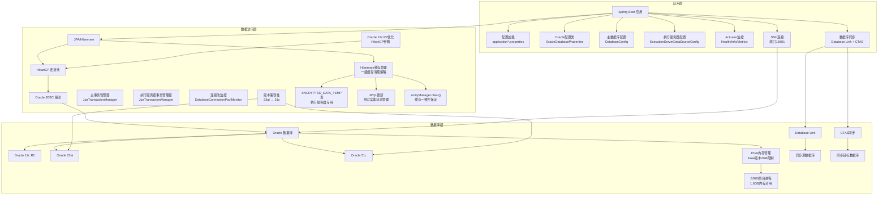
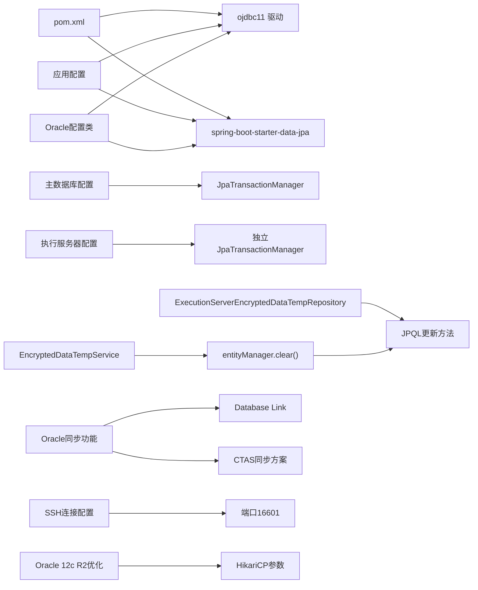

```mermaid
graph TB
A["后端资源目录<br/>src/main/resources"] --> B["application.properties"]
A --> C["application-oracle.properties"]
A --> D["application-dev.properties"]
E["部署配置目录<br/>deploy/main-linux-oracle/config"] --> F["application.properties"]
G["Java配置类<br/>OracleDatabaseProperties.java"] --> H["Oracle数据库配置管理"]
I["主数据库配置<br/>DatabaseConfig.java"] --> J["事务管理器配置"]
K["执行服务器配置<br/>ExecutionServerDataSourceConfig.java"] --> L["独立事务管理器"]
M["项目依赖<br/>pom.xml"] --> N["Oracle JDBC驱动 ojdbc11"]
O["初始化脚本<br/>init.sql"] --> P["数据库Schema与基础表"]
Q["版本更新日志<br/>更新小结.md"] --> R["SQL外部化改造"]
S["服务层<br/>EncryptedDataTempService.java"] --> T["Hibernate缓存管理策略"]
U["Repository层<br/>ExecutionServerEncryptedDataTempRepository.java"] --> V["JPQL更新方法"]
W["错误分析文档<br/>ORA-01407约束违规错误分析与解决方案.md"] --> X["缓存一致性保证"]
Y["Oracle 12c R2配置<br/>主服务器技术栈与配置规范.md"] --> Z["HikariCP优化参数"]
AA["SSH连接配置<br/>execution-windows/README.md"] --> BB["端口16601配置"]
CC["数据库同步<br/>2026-04-24-测试主服务器部署与数据库同步.md"] --> DD["Database Link + CTAS方案"]
EE["连接稳定性<br/>数据库连接稳定性修复说明.md"] --> FF["网络超时参数优化"]
```

# 数据库配置

<cite>
**本文引用的文件**
- [application.properties](file://med_ai_assistant_1.0_bs_backend/src/main/resources/application.properties)
- [application-oracle.properties](file://med_ai_assistant_1.0_bs_backend/src/main/resources/application-oracle.properties)
- [application-dev.properties](file://med_ai_assistant_1.0_bs_backend/src/main/resources/application-dev.properties)
- [application.properties（main-linux-oracle）](file://med_ai_assistant_1.0_bs_backend/deploy/main-linux-oracle/config/application.properties)
- [pom.xml](file://med_ai_assistant_1.0_bs_backend/pom.xml)
- [init.sql](file://med_ai_assistant_1.0_bs_backend/init.sql)
- [Oracle数据库PGA内存超限错误修复-2026年03月14日.md](file://med_ai_assistant_1.0_bs_backend/doc/问题修复/Oracle数据库PGA内存超限错误修复-2026年03月14日.md)
- [OracleDatabaseProperties.java](file://med_ai_assistant_1.0_bs_backend/src/main/java/com/example/medaiassistant/config/OracleDatabaseProperties.java)
- [DatabaseConfig.java](file://med_ai_assistant_1.0_bs_backend/src/main/java/com/example/medaiassistant/config/DatabaseConfig.java)
- [ExecutionServerDataSourceConfig.java](file://med_ai_assistant_1.0_bs_backend/src/main/java/com/example/medaiassistant/config/ExecutionServerDataSourceConfig.java)
- [EncryptedDataTempService.java](file://med_ai_assistant_1.0_bs_backend/src/main/java/com/example/medaiassistant/service/EncryptedDataTempService.java)
- [ExecutionServerEncryptedDataTempRepository.java](file://med_ai_assistant_1.0_bs_backend/src/main/java/com/example/medaiassistant/repository/executionserver/ExecutionServerEncryptedDataTempRepository.java)
- [PromptPollingService.java](file://med_ai_assistant_1.0_bs_backend/src/main/java/com/example/medaiassistant/service/PromptPollingService.java)
- [ORA-01407约束违规错误分析与解决方案.md](file://med_ai_assistant_1.0_bs_backend/doc/其他/ORA-01407约束违规错误分析与解决方案.md)
- [执行服务器微服务详细设计.md](file://med_ai_assistant_1.0_bs_backend/doc/系统结构/执行服务器微服务/执行服务器微服务详细设计.md)
- [更新小结.md](file://更新小结.md)
- [主服务器技术栈与配置规范.md](file://med_ai_assistant_1.0_bs_backend/doc/其他/主服务器技术栈与配置规范.md)
- [DatabaseConfig.java](file://med_ai_assistant_1.0_bs_backend/src/main/java/com/example/medaiassistant/config/DatabaseConfig.java)
- [OracleDatabaseProperties.java](file://med_ai_assistant_1.0_bs_backend/src/main/java/com/example/medaiassistant/config/OracleDatabaseProperties.java)
- [README.md（execution-windows）](file://med_ai_assistant_1.0_bs_backend/deploy/execution-windows/README.md)
- [Docker部署.md](file://med_ai_assistant_1.0_bs_backend/doc/布署/Docker部署.md)
- [数据库连接稳定性修复说明.md](file://med_ai_assistant_1.0_bs_backend/doc/问题修复/数据库连接稳定性修复说明.md)
- [2026-04-24-测试主服务器部署与数据库同步.md](file://med_ai_assistant_1.0_bs_backend/doc/测试/测试服务器/主服务器/2026-04-24-测试主服务器部署与数据库同步.md)
</cite>

## 更新摘要
**变更内容**
- 新增Oracle 12c R2连接池配置章节，详细说明HikariCP优化参数
- 更新SSH端口16601的连接说明，包含Oracle数据库连接配置
- 新增Oracle数据库同步功能的Database Link配置和CTAS同步方案
- 增强Oracle连接池配置的网络超时参数说明
- 新增Oracle 23ai → 21c版本兼容性问题的解决方案
- 更新执行服务器的Oracle端口配置为16601

## 目录
1. [简介](#简介)
2. [项目结构](#项目结构)
3. [核心组件](#核心组件)
4. [架构总览](#架构总览)
5. [详细组件分析](#详细组件分析)
6. [Oracle 12c R2连接池配置](#oracle-12c-r2连接池配置)
7. [SSH端口16601连接配置](#ssh端口16601连接配置)
8. [Oracle数据库同步功能](#oracle数据库同步功能)
9. [Hibernate缓存管理策略](#hibernate缓存管理策略)
10. [依赖关系分析](#依赖关系分析)
11. [性能考虑](#性能考虑)
12. [故障排查指南](#故障排查指南)
13. [Oracle数据库PGA内存超限问题](#oracle数据库pga内存超限问题)
14. [结论](#结论)
15. [附录](#附录)

## 简介
本文件面向MedAiAssistant 1.0 BS后端的数据库配置，聚焦于Oracle数据库连接与运行配置，涵盖以下主题：
- Oracle连接参数（连接URL、用户名、密码、驱动）
- 连接池（HikariCP）配置与优化
- 事务与JPA/Hibernate配置要点
- 初始化脚本、Schema与表结构映射思路
- 性能优化、连接超时、日志与监控
- 常见连接问题排查与解决方案
- **新增**：Oracle 12c R2连接池配置与HikariCP优化参数
- **新增**：SSH端口16601的连接说明与Oracle数据库配置
- **新增**：Oracle数据库同步功能的Database Link和CTAS方案
- **新增**：Oracle 23ai → 21c版本兼容性问题的解决方案
- **新增**：执行服务器Oracle端口配置为16601的详细说明

说明：当前仓库中包含Oracle专用配置文件、Java配置类以及完整的PGA内存超限问题修复文档，提供了从配置到故障排查的完整解决方案。特别关注了执行服务器中EncryptedDataTempService的Hibernate缓存管理策略，该策略有效解决了Oracle数据库ORA-01407约束违规问题。

## 项目结构
与数据库配置直接相关的文件主要位于后端资源目录与部署配置目录中，核心文件如下：
- 应用主配置：application.properties
- Oracle专用配置：application-oracle.properties
- 开发环境示例：application-dev.properties
- 生产/测试环境配置（main-linux-oracle）：deploy/main-linux-oracle/config/application.properties
- Oracle数据库配置类：OracleDatabaseProperties.java
- 主数据库配置：DatabaseConfig.java
- 执行服务器数据源配置：ExecutionServerDataSourceConfig.java
- 依赖与驱动：pom.xml
- 初始化脚本：init.sql
- **新增**：Oracle 12c R2连接池配置规范
- **新增**：SSH端口16601连接配置说明
- **新增**：Oracle数据库同步功能文档
- **新增**：Oracle 23ai → 21c版本兼容性问题解决方案



**图表来源**
- [application.properties:1-294](file://med_ai_assistant_1.0_bs_backend/src/main/resources/application.properties#L1-L294)
- [application-oracle.properties:1-11](file://med_ai_assistant_1.0_bs_backend/src/main/resources/application-oracle.properties#L1-L11)
- [application-dev.properties:1-2](file://med_ai_assistant_1.0_bs_backend/src/main/resources/application-dev.properties#L1-L2)
- [application.properties（main-linux-oracle）:1-191](file://med_ai_assistant_1.0_bs_backend/deploy/main-linux-oracle/config/application.properties#L1-L191)
- [OracleDatabaseProperties.java:1-114](file://med_ai_assistant_1.0_bs_backend/src/main/java/com/example/medaiassistant/config/OracleDatabaseProperties.java#L1-L114)
- [DatabaseConfig.java:1-269](file://med_ai_assistant_1.0_bs_backend/src/main/java/com/example/medaiassistant/config/DatabaseConfig.java#L1-L269)
- [ExecutionServerDataSourceConfig.java:1-161](file://med_ai_assistant_1.0_bs_backend/src/main/java/com/example/medaiassistant/config/ExecutionServerDataSourceConfig.java#L1-L161)
- [pom.xml:98-124](file://med_ai_assistant_1.0_bs_backend/pom.xml#L98-L124)
- [init.sql:1-119](file://med_ai_assistant_1.0_bs_backend/init.sql#L1-L119)
- [EncryptedDataTempService.java:1-843](file://med_ai_assistant_1.0_bs_backend/src/main/java/com/example/medaiassistant/service/EncryptedDataTempService.java#L1-L843)
- [ExecutionServerEncryptedDataTempRepository.java:1-111](file://med_ai_assistant_1.0_bs_backend/src/main/java/com/example/medaiassistant/repository/executionserver/ExecutionServerEncryptedDataTempRepository.java#L1-L111)
- [ORA-01407约束违规错误分析与解决方案.md:1-158](file://med_ai_assistant_1.0_bs_backend/doc/其他/ORA-01407约束违规错误分析与解决方案.md#L1-L158)
- [主服务器技术栈与配置规范.md:172-210](file://med_ai_assistant_1.0_bs_backend/doc/其他/主服务器技术栈与配置规范.md#L172-L210)
- [README.md（execution-windows）:60-106](file://med_ai_assistant_1.0_bs_backend/deploy/execution-windows/README.md#L60-L106)
- [2026-04-24-测试主服务器部署与数据库同步.md:64-112](file://med_ai_assistant_1.0_bs_backend/doc/测试/测试服务器/主服务器/2026-04-24-测试主服务器部署与数据库同步.md#L64-L112)
- [数据库连接稳定性修复说明.md:1-35](file://med_ai_assistant_1.0_bs_backend/doc/问题修复/数据库连接稳定性修复说明.md#L1-L35)

**章节来源**
- [application.properties:1-294](file://med_ai_assistant_1.0_bs_backend/src/main/resources/application.properties#L1-L294)
- [application-oracle.properties:1-11](file://med_ai_assistant_1.0_bs_backend/src/main/resources/application-oracle.properties#L1-L11)
- [application-dev.properties:1-2](file://med_ai_assistant_1.0_bs_backend/src/main/resources/application-dev.properties#L1-L2)
- [application.properties（main-linux-oracle）:1-191](file://med_ai_assistant_1.0_bs_backend/deploy/main-linux-oracle/config/application.properties#L1-L191)
- [OracleDatabaseProperties.java:1-114](file://med_ai_assistant_1.0_bs_backend/src/main/java/com/example/medaiassistant/config/OracleDatabaseProperties.java#L1-L114)
- [DatabaseConfig.java:1-269](file://med_ai_assistant_1.0_bs_backend/src/main/java/com/example/medaiassistant/config/DatabaseConfig.java#L1-L269)
- [ExecutionServerDataSourceConfig.java:1-161](file://med_ai_assistant_1.0_bs_backend/src/main/java/com/example/medaiassistant/config/ExecutionServerDataSourceConfig.java#L1-L161)
- [pom.xml:98-124](file://med_ai_assistant_1.0_bs_backend/pom.xml#L98-L124)
- [init.sql:1-119](file://med_ai_assistant_1.0_bs_backend/init.sql#L1-L119)

## 核心组件
- **Oracle数据库配置类**
  - 统一管理Oracle数据库连接配置，避免硬编码
  - 支持动态配置注入和类型安全访问
  - 包含URL、驱动类名、用户名、密码和Hikari连接池配置
- **主数据库配置（DatabaseConfig）**
  - 集成HikariCP连接池优化配置
  - 统一JpaTransactionManager事务管理器配置
  - 支持多数据源和事务管理器分离
  - **新增**：禁用Hibernate二级缓存和查询缓存，避免缓存一致性问题
- **执行服务器数据源配置**
  - 专门用于连接执行服务器的ENCRYPTED_DATA_TEMP表
  - 独立的事务管理器配置，避免与主数据源冲突
  - 增强稳健性配置，允许启动期间Oracle不可用
  - **新增**：禁用Hibernate缓存，确保执行服务器数据访问的一致性
- **数据库连接参数**
  - 连接URL：基于动态属性拼接，支持本地与内网Oracle服务器切换
  - 用户名/密码：从活动服务器配置中注入
  - 驱动类名：Oracle JDBC驱动
- **连接池（HikariCP）**
  - 连接池大小、空闲超时、最大存活时间、连接超时、泄漏检测阈值、校验超时、保活时间、测试查询、初始化失败超时
  - Oracle网络与读写超时、线程本地缓冲缓存、早期通知等特性开关
  - **新增**：Oracle 12c R2连接池优化参数，包括maximum-pool-size=20、connection-timeout=10000等
- **JPA/Hibernate**
  - 关闭DDL自动建模，避免启动失败与类型验证冲突
  - Oracle方言与时区配置
  - SQL日志级别控制
  - **新增**：禁用二级缓存和查询缓存，防止跨事务缓存不一致
- **初始化脚本**
  - 数据库、用户、权限、基础表与视图
  - MySQL语法（与Oracle不完全一致），需注意差异
- **Oracle数据库同步功能**
  - **新增**：Database Link + CTAS同步方案
  - **新增**：Oracle 23ai → 21c版本兼容性问题解决方案
  - **新增**：测试服务器的数据库同步验证脚本
- **SSH连接配置**
  - **新增**：SSH端口16601的连接说明
  - **新增**：Oracle数据库连接配置（ORACLE_PORT=16601）

**章节来源**
- [OracleDatabaseProperties.java:1-114](file://med_ai_assistant_1.0_bs_backend/src/main/java/com/example/medaiassistant/config/OracleDatabaseProperties.java#L1-L114)
- [DatabaseConfig.java:233-239](file://med_ai_assistant_1.0_bs_backend/src/main/java/com/example/medaiassistant/config/DatabaseConfig.java#L233-L239)
- [ExecutionServerDataSourceConfig.java:120-130](file://med_ai_assistant_1.0_bs_backend/src/main/java/com/example/medaiassistant/config/ExecutionServerDataSourceConfig.java#L120-L130)
- [application.properties:30-59](file://med_ai_assistant_1.0_bs_backend/src/main/resources/application.properties#L30-L59)
- [application-oracle.properties:4-8](file://med_ai_assistant_1.0_bs_backend/src/main/resources/application-oracle.properties#L4-L8)
- [application.properties（main-linux-oracle）:25-44](file://med_ai_assistant_1.0_bs_backend/deploy/main-linux-oracle/config/application.properties#L25-L44)
- [pom.xml:98-124](file://med_ai_assistant_1.0_bs_backend/pom.xml#L98-L124)
- [init.sql:1-119](file://med_ai_assistant_1.0_bs_backend/init.sql#L1-L119)
- [EncryptedDataTempService.java:60-154](file://med_ai_assistant_1.0_bs_backend/src/main/java/com/example/medaiassistant/service/EncryptedDataTempService.java#L60-L154)
- [主服务器技术栈与配置规范.md:172-210](file://med_ai_assistant_1.0_bs_backend/doc/其他/主服务器技术栈与配置规范.md#L172-L210)
- [README.md（execution-windows）:60-106](file://med_ai_assistant_1.0_bs_backend/deploy/execution-windows/README.md#L60-L106)
- [2026-04-24-测试主服务器部署与数据库同步.md:64-112](file://med_ai_assistant_1.0_bs_backend/doc/测试/测试服务器/主服务器/2026-04-24-测试主服务器部署与数据库同步.md#L64-L112)

## 架构总览
下图展示应用如何通过配置加载Oracle连接参数，并由HikariCP提供连接池，再由JPA/Hibernate进行ORM访问，特别强调了执行服务器中Hibernate缓存管理的关键作用。



**图表来源**
- [application.properties:30-59](file://med_ai_assistant_1.0_bs_backend/src/main/resources/application.properties#L30-L59)
- [application-oracle.properties:1-11](file://med_ai_assistant_1.0_bs_backend/src/main/resources/application-oracle.properties#L1-L11)
- [application.properties（main-linux-oracle）:25-44](file://med_ai_assistant_1.0_bs_backend/deploy/main-linux-oracle/config/application.properties#L25-L44)
- [OracleDatabaseProperties.java:1-114](file://med_ai_assistant_1.0_bs_backend/src/main/java/com/example/medaiassistant/config/OracleDatabaseProperties.java#L1-L114)
- [DatabaseConfig.java:233-239](file://med_ai_assistant_1.0_bs_backend/src/main/java/com/example/medaiassistant/config/DatabaseConfig.java#L233-L239)
- [ExecutionServerDataSourceConfig.java:120-130](file://med_ai_assistant_1.0_bs_backend/src/main/java/com/example/medaiassistant/config/ExecutionServerDataSourceConfig.java#L120-L130)
- [pom.xml:98-124](file://med_ai_assistant_1.0_bs_backend/pom.xml#L98-L124)
- [Oracle数据库PGA内存超限错误修复-2026年03月14日.md:1-173](file://med_ai_assistant_1.0_bs_backend/doc/问题修复/Oracle数据库PGA内存超限错误修复-2026年03月14日.md#L1-L173)
- [EncryptedDataTempService.java:174-248](file://med_ai_assistant_1.0_bs_backend/src/main/java/com/example/medaiassistant/service/EncryptedDataTempService.java#L174-L248)
- [主服务器技术栈与配置规范.md:172-210](file://med_ai_assistant_1.0_bs_backend/doc/其他/主服务器技术栈与配置规范.md#L172-L210)
- [README.md（execution-windows）:60-106](file://med_ai_assistant_1.0_bs_backend/deploy/execution-windows/README.md#L60-L106)
- [2026-04-24-测试主服务器部署与数据库同步.md:64-112](file://med_ai_assistant_1.0_bs_backend/doc/测试/测试服务器/主服务器/2026-04-24-测试主服务器部署与数据库同步.md#L64-L112)

## 详细组件分析

### Oracle数据库配置类
- **配置类设计**
  - 使用@ConfigurationProperties注解统一管理Oracle数据库配置
  - 支持spring.datasource.oracle前缀的配置项
  - 提供类型安全的getter/setter方法
- **核心配置项**
  - 数据库连接URL、驱动类名、用户名、密码
  - Hikari连接池超时配置（连接超时、初始化失败超时）
- **动态配置管理**
  - 支持运行时配置更新
  - 避免硬编码数据库连接信息
  - 提供统一的配置访问接口

**章节来源**
- [OracleDatabaseProperties.java:1-114](file://med_ai_assistant_1.0_bs_backend/src/main/java/com/example/medaiassistant/config/OracleDatabaseProperties.java#L1-L114)

### 主数据库配置（DatabaseConfig）
- **事务管理器配置**
  - 使用@Primary注解标记为默认事务管理器
  - 统一JpaTransactionManager配置，解决多事务管理器冲突问题
  - 支持多数据源场景下的事务管理
- **连接池优化**
  - 集成HikariCP连接池的所有优化配置
  - 支持启动时连接验证，避免启动中断
  - 增强连接池监控和日志记录
  - **新增**：Oracle 12c R2连接池优化参数，包括maximum-pool-size=20、connection-timeout=10000等
- **实体管理器配置**
  - 配置LocalContainerEntityManagerFactoryBean
  - 支持Hibernate JPA适配器
  - 统一JPA属性配置
- **Hibernate缓存配置**
  - 禁用二级缓存：hibernate.cache.use_second_level_cache=false
  - 禁用查询缓存：hibernate.cache.use_query_cache=false
  - 避免跨事务缓存不一致问题

**章节来源**
- [DatabaseConfig.java:233-239](file://med_ai_assistant_1.0_bs_backend/src/main/java/com/example/medaiassistant/config/DatabaseConfig.java#L233-L239)
- [DatabaseConfig.java:103-120](file://med_ai_assistant_1.0_bs_backend/src/main/java/com/example/medaiassistant/config/DatabaseConfig.java#L103-L120)
- [DatabaseConfig.java:212-221](file://med_ai_assistant_1.0_bs_backend/src/main/java/com/example/medaiassistant/config/DatabaseConfig.java#L212-L221)
- [DatabaseConfig.java:241-264](file://med_ai_assistant_1.0_bs_backend/src/main/java/com/example/medaiassistant/config/DatabaseConfig.java#L241-L264)
- [主服务器技术栈与配置规范.md:172-210](file://med_ai_assistant_1.0_bs_backend/doc/其他/主服务器技术栈与配置规范.md#L172-L210)

### 执行服务器数据源配置
- **独立数据源设计**
  - 专门用于连接执行服务器的ENCRYPTED_DATA_TEMP表
  - 独立的事务管理器，避免与主数据源冲突
  - 增强稳健性配置，允许启动期间Oracle不可用
  - **新增**：执行服务器Oracle端口配置为16601
- **连接池配置**
  - 较小的连接池规模（最大5个连接）
  - 专门针对提交和轮询服务优化
  - 增强网络中断防护配置
- **事务管理**
  - 独立的JpaTransactionManager配置
  - 支持执行服务器特有的业务逻辑
  - 避免影响主数据源事务管理
- **Hibernate缓存配置**
  - 禁用二级缓存：hibernate.cache.use_second_level_cache=false
  - 禁用查询缓存：hibernate.cache.use_query_cache=false
  - 确保执行服务器数据访问的一致性

**章节来源**
- [ExecutionServerDataSourceConfig.java:120-130](file://med_ai_assistant_1.0_bs_backend/src/main/java/com/example/medaiassistant/config/ExecutionServerDataSourceConfig.java#L120-L130)
- [ExecutionServerDataSourceConfig.java:60-103](file://med_ai_assistant_1.0_bs_backend/src/main/java/com/example/medaiassistant/config/ExecutionServerDataSourceConfig.java#L60-L103)
- [ExecutionServerDataSourceConfig.java:138-160](file://med_ai_assistant_1.0_bs_backend/src/main/java/com/example/medaiassistant/config/ExecutionServerDataSourceConfig.java#L138-L160)
- [README.md（execution-windows）:60-106](file://med_ai_assistant_1.0_bs_backend/deploy/execution-windows/README.md#L60-L106)

### Oracle连接参数配置
- **连接URL**
  - 采用动态属性拼接，根据当前活动服务器（本地/内网）决定IP、端口与SID
  - URL模板与占位符在主配置中定义
- **用户名/密码**
  - 从活动服务器配置注入，便于切换不同环境
- **驱动类名**
  - 指定Oracle JDBC驱动类名
- **方言与DDL**
  - Oracle专用配置显式设置方言，并禁用DDL自动建模
- **网络超时参数**
  - **新增**：Oracle网络超时参数优化，包括CONNECT_TIMEOUT=10000、READ_TIMEOUT=30000
  - **新增**：线程本地缓冲缓存和早期通知特性开关

**章节来源**
- [application.properties:14-34](file://med_ai_assistant_1.0_bs_backend/src/main/resources/application.properties#L14-L34)
- [application-oracle.properties:1-11](file://med_ai_assistant_1.0_bs_backend/src/main/resources/application-oracle.properties#L1-L11)
- [主服务器技术栈与配置规范.md:172-210](file://med_ai_assistant_1.0_bs_backend/doc/其他/主服务器技术栈与配置规范.md#L172-L210)
- [数据库连接稳定性修复说明.md:1-35](file://med_ai_assistant_1.0_bs_backend/doc/问题修复/数据库连接稳定性修复说明.md#L1-L35)

### HikariCP连接池配置
- **基础参数**
  - 最大池大小、最小空闲、连接超时、空闲超时、最大存活时间、保活时间
  - **新增**：Oracle 12c R2连接池优化参数，maximum-pool-size=20、connection-timeout=10000
- **泄漏检测与校验**
  - 泄漏检测阈值、连接测试查询、初始化失败超时、校验超时
- **Oracle网络与读写超时**
  - CONNECT_TIMEOUT、READ_TIMEOUT等
  - **新增**：网络超时参数优化，提升网络中断场景下的稳定性
- **线程与缓冲**
  - useThreadLocalBufferCache、ENABLE_EARLY_NOTIFICATION等
- **测试查询**
  - 使用Oracle兼容的测试查询

**章节来源**
- [application.properties（main-linux-oracle）:25-44](file://med_ai_assistant_1.0_bs_backend/deploy/main-linux-oracle/config/application.properties#L25-L44)
- [application.properties:36-59](file://med_ai_assistant_1.0_bs_backend/src/main/resources/application.properties#L36-L59)
- [主服务器技术栈与配置规范.md:172-210](file://med_ai_assistant_1.0_bs_backend/doc/其他/主服务器技术栈与配置规范.md#L172-L210)

### JPA/Hibernate配置
- **DDL策略**
  - 关闭自动建模，避免启动失败与类型验证冲突
- **方言与时区**
  - Oracle方言与Asia/Shanghai时区
- **SQL日志**
  - 关闭SQL输出，降低日志噪声
- **物理命名策略**
  - 表名/列名映射策略
- **缓存配置**
  - 禁用二级缓存和查询缓存
  - 避免跨事务缓存不一致问题

**章节来源**
- [application-oracle.properties:4-8](file://med_ai_assistant_1.0_bs_backend/src/main/resources/application-oracle.properties#L4-L8)
- [application.properties:63-84](file://med_ai_assistant_1.0_bs_backend/src/main/resources/application.properties#L63-L84)
- [DatabaseConfig.java:241-264](file://med_ai_assistant_1.0_bs_backend/src/main/java/com/example/medaiassistant/config/DatabaseConfig.java#L241-L264)
- [ExecutionServerDataSourceConfig.java:138-160](file://med_ai_assistant_1.0_bs_backend/src/main/java/com/example/medaiassistant/config/ExecutionServerDataSourceConfig.java#L138-L160)

### 初始化脚本与Schema
- **数据库与用户**
  - 创建数据库、应用用户与root用户并授权
- **参数设置**
  - 设置最大连接数、等待超时、缓冲池大小、日志文件大小等
- **基础表与视图**
  - 版本管理表、系统配置表、数据库状态视图、连接状态视图
- **注意事项**
  - 脚本使用MySQL语法，部署至Oracle时需转换为Oracle兼容语法

**章节来源**
- [init.sql:1-119](file://med_ai_assistant_1.0_bs_backend/init.sql#L1-L119)

### 事务管理配置
- **事务管理器**
  - 使用Spring声明式事务，默认JpaTransactionManager
  - 主事务管理器使用@Primary注解标记为默认
  - 执行服务器使用独立的事务管理器
- **传播行为与隔离级别**
  - 由业务方法与注解控制，配置文件中未显式覆盖
- **事务超时与回滚规则**
  - 由业务层定义，配置文件中未显式覆盖
- **日志级别控制**
  - 统一设置JpaTransactionManager为WARN级别，解决DEBUG日志问题

**章节来源**
- [application.properties（main-linux-oracle）:75-77](file://med_ai_assistant_1.0_bs_backend/deploy/main-linux-oracle/config/application.properties#L75-L77)
- [DatabaseConfig.java:233-239](file://med_ai_assistant_1.0_bs_backend/src/main/java/com/example/medaiassistant/config/DatabaseConfig.java#L233-L239)
- [ExecutionServerDataSourceConfig.java:120-130](file://med_ai_assistant_1.0_bs_backend/src/main/java/com/example/medaiassistant/config/ExecutionServerDataSourceConfig.java#L120-L130)

### 开发环境示例
- **开发环境用户名占位符**
  - 提供占位符以便本地覆盖真实凭据

**章节来源**
- [application-dev.properties:1-2](file://med_ai_assistant_1.0_bs_backend/src/main/resources/application-dev.properties#L1-L2)

### 病人费用查询服务SQL外部化改造
- **SQL模板机制**
  - 复用医院数据同步模块的SQL模板机制
  - 移除硬编码SQL和DBLink依赖
  - 使用SqlExecutionService + TemplateHotUpdateService执行查询
- **配置文件更新**
  - HIS费用视图配置改为使用 SQL 外部化机制
  - SQL模板文件位置：sql/{hospitalId}/patient-fee-query.json
- **业务逻辑优化**
  - 提升查询服务的可维护性和可配置性
  - 支持不同医院的定制化SQL模板

**章节来源**
- [application.properties:290-294](file://med_ai_assistant_1.0_bs_backend/src/main/resources/application.properties#L290-L294)
- [更新小结.md:2-3](file://更新小结.md#L2-L3)

## Oracle 12c R2连接池配置

### **新增**：Oracle 12c R2连接池优化参数

根据主服务器技术栈与配置规范文档，Oracle 12c R2环境下的HikariCP连接池配置进行了专门优化：

#### **生产环境优化配置**
- **最大连接池大小**：maximum-pool-size=20（从8增加到20）
- **最小空闲连接**：minimum-idle=5
- **连接超时时间**：connection-timeout=10000ms（从30000ms减少到10000ms）
- **空闲连接超时**：idle-timeout=240000ms
- **连接最大生命周期**：max-lifetime=1800000ms
- **保活时间**：keepalive-time=120000ms

#### **网络超时参数优化**
- **Oracle网络连接超时**：oracle.net.CONNECT_TIMEOUT=10000ms
- **Oracle读取超时**：oracle.net.READ_TIMEOUT=30000ms
- **线程本地缓冲缓存**：oracle.jdbc.useThreadLocalBufferCache=true
- **早期通知**：oracle.net.ENABLE_EARLY_NOTIFICATION=true
- **FAN支持**：oracle.jdbc.fanEnabled=false

#### **配置优势**
- **高并发支持**：20个最大连接池满足生产环境高并发需求
- **快速响应**：10秒连接超时时间提升用户体验
- **资源管理**：合理的空闲超时和最大生命周期避免资源浪费
- **网络稳定性**：优化的网络超时参数提升网络中断场景下的稳定性

**章节来源**
- [主服务器技术栈与配置规范.md:172-210](file://med_ai_assistant_1.0_bs_backend/doc/其他/主服务器技术栈与配置规范.md#L172-L210)
- [DatabaseConfig.java:173-210](file://med_ai_assistant_1.0_bs_backend/src/main/java/com/example/medaiassistant/config/DatabaseConfig.java#L173-L210)

## SSH端口16601连接配置

### **新增**：SSH端口16601的连接说明

根据执行服务器Windows部署文档，系统使用SSH端口16601而非默认端口22：

#### **SSH连接配置**
- **SSH端口**：16601（非默认1521）
- **SSH连接命令**：ssh -p 16601 Liuzh2008@nb.nblink.cc
- **密码认证**：已启用密码认证
- **内网穿透**：使用nb.nblink.cc:16601地址

#### **Oracle数据库连接配置**
- **ORACLE_PORT**：16601（非默认1521）
- **ORACLE_SERVICE**：使用service name格式连接
- **连接示例**：sqlplus system/password@//100.66.1.2:16601/FREE
- **网络连通性测试**：Test-NetConnection -ComputerName 100.66.1.2 -Port 16601

#### **Docker部署配置**
- **端口映射**：16601端口映射到Oracle数据库
- **Docker compose**：使用自定义端口配置
- **健康检查**：验证Oracle数据库连接状态

**章节来源**
- [README.md（execution-windows）:60-106](file://med_ai_assistant_1.0_bs_backend/deploy/execution-windows/README.md#L60-L106)
- [Docker部署.md:10-209](file://med_ai_assistant_1.0_bs_backend/doc/布署/Docker部署.md#L10-L209)

## Oracle数据库同步功能

### **新增**：Database Link + CTAS同步方案

根据测试服务器部署文档，系统采用了Database Link + CTAS（Create Table As Select）的同步方案：

#### **方案选择**
- **初始尝试**：expdp/impdp（Data Pump）因Oracle 23ai → 21c版本不兼容而放弃
- **最终方案**：sqlplus + Database Link + CTAS
- **版本兼容性**：解决TSTZ版本不兼容问题（源43 vs 目标35）

#### **Database Link创建**
```sql
CREATE DATABASE LINK dev_db 
CONNECT TO system IDENTIFIED BY "Liuzh_123" 
USING '100.66.1.1:1521/FREE';
```

#### **全量同步流程**
1. **遍历开发数据库表**：FOR t IN (SELECT table_name FROM user_tables@dev_db...)
2. **逐表执行**：DROP TABLE + CREATE TABLE AS SELECT
3. **排除特殊表**：ENCRYPTED_DATA_TEMP表保留不覆盖
4. **关键列添加**：DRGS.INHOSPITAL列添加

#### **同步结果**
- **同步表数**：60张
- **失败表数**：0
- **ENCRYPTED_DATA_TEMP**：保留（未覆盖）
- **DRGS.INHOSPITAL列**：已添加

#### **关键脚本**
- **Database Link创建**：sql/sync_via_dblink.sql
- **全量同步**：sql/full_sync.sql
- **验证**：sql/verify.sql

**章节来源**
- [2026-04-24-测试主服务器部署与数据库同步.md:64-112](file://med_ai_assistant_1.0_bs_backend/doc/测试/测试服务器/主服务器/2026-04-24-测试主服务器部署与数据库同步.md#L64-L112)

### **新增**：Oracle版本兼容性问题解决方案

#### **问题分析**
- **版本不兼容**：Oracle 23ai → 21c的TSTZ（时间戳带时区）版本不兼容
- **源版本**：43（23ai）
- **目标版本**：35（21c）
- **VERSION参数无效**：无法通过VERSION=12.2参数绕过

#### **解决方案**
- **放弃Data Pump**：expdp/impdp方案不可行
- **选择CTAS方案**：通过PL/SQL块遍历表并执行CTAS
- **手动处理**：针对缺失的关键列进行手动添加

#### **实施效果**
- **同步成功率**：100%（60张表）
- **数据完整性**：关键业务表保持完整性
- **系统稳定性**：避免版本兼容性导致的数据损坏

**章节来源**
- [2026-04-24-测试主服务器部署与数据库同步.md:64-112](file://med_ai_assistant_1.0_bs_backend/doc/测试/测试服务器/主服务器/2026-04-24-测试主服务器部署与数据库同步.md#L64-L112)

## Hibernate缓存管理策略

### **新增**：JPQL更新与Hibernate一级缓存的关系

在执行服务器的ENCRYPTED_DATA_TEMP表操作中，EncryptedDataTempService采用了特殊的Hibernate缓存管理策略来解决Oracle数据库ORA-01407约束违规问题。该策略的核心在于理解JPQL更新与Hibernate一级缓存之间的关系。

#### **缓存一致性挑战**
- **问题根源**：当使用JPQL直接更新数据库时，Hibernate的一级缓存中的实体不会自动失效
- **ORA-01407风险**：在跨事务场景下，实体状态可能与数据库实际状态不一致
- **CLOB字段风险**：ENCRYPTED_DATA字段为CLOB类型，任何意外的NULL值都会触发约束违规

#### **解决方案架构**


**图表来源**
- [EncryptedDataTempService.java:84-126](file://med_ai_assistant_1.0_bs_backend/src/main/java/com/example/medaiassistant/service/EncryptedDataTempService.java#L84-L126)
- [EncryptedDataTempService.java:178-220](file://med_ai_assistant_1.0_bs_backend/src/main/java/com/example/medaiassistant/service/EncryptedDataTempService.java#L178-L220)
- [EncryptedDataTempService.java:272-313](file://med_ai_assistant_1.0_bs_backend/src/main/java/com/example/medaiassistant/service/EncryptedDataTempService.java#L272-L313)

### **新增**：EncryptedDataTempService中的缓存管理策略

#### **统一缓存管理流程**
服务层实现了严格的缓存管理流程，确保JPQL更新后的数据一致性：

1. **操作前清理缓存**：`entityManager.clear()` 确保从数据库重新加载最新数据
2. **验证状态转换**：重新加载实体验证状态转换的合法性
3. **使用JPQL更新**：直接操作数据库，绕过实体状态管理
4. **强制刷新**：`executionEncryptedDataTempRepository.flush()` 将变更刷入数据库
5. **操作后清理缓存**：再次清理一级缓存，确保后续查询从数据库读取
6. **重新加载验证**：最终验证更新结果的准确性

#### **关键实现细节**
- **JPQL更新方法**：Repository层提供多个JPQL更新方法，避免实体状态管理问题
- **缓存清理时机**：在JPQL更新前后各执行一次缓存清理
- **状态验证机制**：每次更新后都验证关键字段的完整性
- **错误处理策略**：对ORA-01407错误提供详细的诊断信息

**章节来源**
- [EncryptedDataTempService.java:60-154](file://med_ai_assistant_1.0_bs_backend/src/main/java/com/example/medaiassistant/service/EncryptedDataTempService.java#L60-L154)
- [EncryptedDataTempService.java:174-248](file://med_ai_assistant_1.0_bs_backend/src/main/java/com/example/medaiassistant/service/EncryptedDataTempService.java#L174-L248)
- [EncryptedDataTempService.java:267-341](file://med_ai_assistant_1.0_bs_backend/src/main/java/com/example/medaiassistant/service/EncryptedDataTempService.java#L267-L341)
- [EncryptedDataTempService.java:361-439](file://med_ai_assistant_1.0_bs_backend/src/main/java/com/example/medaiassistant/service/EncryptedDataTempService.java#L361-L439)

### **新增**：Repository层的JPQL更新方法

#### **JPQL更新方法设计**
Repository层提供了专门的JPQL更新方法，这些方法完全绕过Hibernate实体状态管理：

- **updateStatusOnly**：仅更新状态字段，避免CLOB字段操作
- **updateDecryptedData**：更新解密数据和状态字段
- **updateExecutionResult**：更新执行结果和状态字段
- **updateErrorMessage**：更新错误信息和状态字段

#### **缓存一致性保证**
每个JPQL更新方法都配合服务层的缓存管理策略使用，确保：
- 更新操作直接作用于数据库行
- Hibernate一级缓存及时清理
- 后续查询获取最新的数据库状态

**章节来源**
- [ExecutionServerEncryptedDataTempRepository.java:68-109](file://med_ai_assistant_1.0_bs_backend/src/main/java/com/example/medaiassistant/repository/executionserver/ExecutionServerEncryptedDataTempRepository.java#L68-L109)

### **新增**：ORA-01407约束违规错误的完整解决方案

#### **错误根因分析**
- **技术原因**：Hibernate在处理CLOB字段时的跨事务状态管理缺陷
- **业务影响**：ENCRYPTED_DATA字段被意外置空，触发NOT NULL约束违规
- **触发条件**：跨事务边界的状态更新操作

#### **防护机制**
1. **JPQL替代实体更新**：彻底避免Hibernate状态管理问题
2. **双重验证机制**：更新前后都验证关键字段完整性
3. **缓存清理策略**：确保跨事务数据一致性
4. **详细错误日志**：便于问题诊断和追踪

#### **监控与诊断**
- **错误分类识别**：针对ORA-01407错误的特殊处理逻辑
- **重试与恢复**：提供错误恢复的诊断信息
- **性能监控**：监控JPQL更新操作的执行效率

**章节来源**
- [ORA-01407约束违规错误分析与解决方案.md:94-158](file://med_ai_assistant_1.0_bs_backend/doc/其他/ORA-01407约束违规错误分析与解决方案.md#L94-L158)
- [PromptPollingService.java:1362-1385](file://med_ai_assistant_1.0_bs_backend/src/main/java/com/example/medaiassistant/service/PromptPollingService.java#L1362-L1385)

## 依赖关系分析
- **Oracle JDBC驱动**
  - 通过Maven引入ojdbc11，版本与作用域在POM中定义
- **Spring Data JPA**
  - 提供JPA/Hibernate集成与连接池自动配置入口
- **Actuator与监控**
  - 暴露健康与指标端点，辅助诊断连接池与数据库状态
- **EncryptedDataTempService与Hibernate缓存管理**
  - 服务层负责缓存清理策略的执行
  - Repository层提供JPQL更新方法支持
  - 通过entityManager.clear()确保缓存一致性
- **Oracle数据库同步功能**
  - Database Link + CTAS方案提供数据同步能力
  - 支持Oracle版本兼容性问题的解决方案



**图表来源**
- [pom.xml:98-124](file://med_ai_assistant_1.0_bs_backend/pom.xml#L98-L124)
- [application.properties（main-linux-oracle）:75-77](file://med_ai_assistant_1.0_bs_backend/deploy/main-linux-oracle/config/application.properties#L75-L77)
- [OracleDatabaseProperties.java:1-114](file://med_ai_assistant_1.0_bs_backend/src/main/java/com/example/medaiassistant/config/OracleDatabaseProperties.java#L1-L114)
- [DatabaseConfig.java:233-239](file://med_ai_assistant_1.0_bs_backend/src/main/java/com/example/medaiassistant/config/DatabaseConfig.java#L233-L239)
- [ExecutionServerDataSourceConfig.java:120-130](file://med_ai_assistant_1.0_bs_backend/src/main/java/com/example/medaiassistant/config/ExecutionServerDataSourceConfig.java#L120-L130)
- [EncryptedDataTempService.java:84-126](file://med_ai_assistant_1.0_bs_backend/src/main/java/com/example/medaiassistant/service/EncryptedDataTempService.java#L84-L126)
- [2026-04-24-测试主服务器部署与数据库同步.md:64-112](file://med_ai_assistant_1.0_bs_backend/doc/测试/测试服务器/主服务器/2026-04-24-测试主服务器部署与数据库同步.md#L64-L112)
- [README.md（execution-windows）:60-106](file://med_ai_assistant_1.0_bs_backend/deploy/execution-windows/README.md#L60-L106)
- [主服务器技术栈与配置规范.md:172-210](file://med_ai_assistant_1.0_bs_backend/doc/其他/主服务器技术栈与配置规范.md#L172-L210)

**章节来源**
- [pom.xml:98-124](file://med_ai_assistant_1.0_bs_backend/pom.xml#L98-L124)
- [application.properties（main-linux-oracle）:75-77](file://med_ai_assistant_1.0_bs_backend/deploy/main-linux-oracle/config/application.properties#L75-L77)
- [OracleDatabaseProperties.java:1-114](file://med_ai_assistant_1.0_bs_backend/src/main/java/com/example/medaiassistant/config/OracleDatabaseProperties.java#L1-L114)
- [DatabaseConfig.java:233-239](file://med_ai_assistant_1.0_bs_backend/src/main/java/com/example/medaiassistant/config/DatabaseConfig.java#L233-L239)
- [ExecutionServerDataSourceConfig.java:120-130](file://med_ai_assistant_1.0_bs_backend/src/main/java/com/example/medaiassistant/config/ExecutionServerDataSourceConfig.java#L120-L130)
- [2026-04-24-测试主服务器部署与数据库同步.md:64-112](file://med_ai_assistant_1.0_bs_backend/doc/测试/测试服务器/主服务器/2026-04-24-测试主服务器部署与数据库同步.md#L64-L112)
- [README.md（execution-windows）:60-106](file://med_ai_assistant_1.0_bs_backend/deploy/execution-windows/README.md#L60-L106)
- [主服务器技术栈与配置规范.md:172-210](file://med_ai_assistant_1.0_bs_backend/doc/其他/主服务器技术栈与配置规范.md#L172-L210)

## 性能考虑
- **连接池参数**
  - 合理设置最大池大小、空闲超时、最大存活时间，避免资源浪费与抖动
  - 连接超时与校验超时应结合业务峰值与网络状况调整
  - **新增**：Oracle 12c R2环境下使用优化的连接池参数
- **泄漏检测**
  - 启用泄漏检测阈值，结合日志定位未释放连接
- **Oracle特性**
  - 线程本地缓冲缓存、早期通知等特性可提升高并发场景稳定性
  - **新增**：Oracle网络超时参数优化提升网络中断场景稳定性
- **SQL日志**
  - 生产环境关闭SQL日志，避免I/O与CPU开销
- **线程池与调度**
  - 业务线程池与调度线程池参数与数据库连接池协同配置，避免争抢
- **PGA内存管理**
  - Oracle Free版本有2GB内存限制，需合理配置pga_aggregate_limit参数
  - 监控BG00后台进程内存占用，避免超过限制
- **事务管理优化**
  - 统一JpaTransactionManager日志级别为WARN，减少日志噪声
  - 主事务管理器与执行服务器事务管理器分离，提升系统稳定性
- **Hibernate缓存性能优化**
  - 禁用二级缓存和查询缓存，避免跨事务缓存一致性开销
  - entityManager.clear()的使用时机需要平衡性能与一致性
  - JPQL更新相比实体保存具有更好的性能表现
- **SSH连接性能**
  - **新增**：SSH端口16601的连接优化，避免默认端口的安全策略限制
  - **新增**：Oracle数据库连接的网络超时参数优化

**章节来源**
- [application.properties（main-linux-oracle）:25-44](file://med_ai_assistant_1.0_bs_backend/deploy/main-linux-oracle/config/application.properties#L25-L44)
- [application.properties:86-88](file://med_ai_assistant_1.0_bs_backend/src/main/resources/application.properties#L86-L88)
- [DatabaseConfig.java:233-239](file://med_ai_assistant_1.0_bs_backend/src/main/java/com/example/medaiassistant/config/DatabaseConfig.java#L233-L239)
- [ExecutionServerDataSourceConfig.java:120-130](file://med_ai_assistant_1.0_bs_backend/src/main/java/com/example/medaiassistant/config/ExecutionServerDataSourceConfig.java#L120-L130)
- [Oracle数据库PGA内存超限错误修复-2026年03月14日.md:1-173](file://med_ai_assistant_1.0_bs_backend/doc/问题修复/Oracle数据库PGA内存超限错误修复-2026年03月14日.md#L1-L173)
- [DatabaseConfig.java:260-261](file://med_ai_assistant_1.0_bs_backend/src/main/java/com/example/medaiassistant/config/DatabaseConfig.java#L260-L261)
- [ExecutionServerDataSourceConfig.java:156-157](file://med_ai_assistant_1.0_bs_backend/src/main/java/com/example/medaiassistant/config/ExecutionServerDataSourceConfig.java#L156-157)
- [主服务器技术栈与配置规范.md:172-210](file://med_ai_assistant_1.0_bs_backend/doc/其他/主服务器技术栈与配置规范.md#L172-L210)
- [README.md（execution-windows）:60-106](file://med_ai_assistant_1.0_bs_backend/deploy/execution-windows/README.md#L60-L106)

## 故障排查指南
- **启动失败（DDL相关）**
  - 现象：启动时报DDL验证或类型不匹配错误
  - 排查：确认已禁用自动DDL建模
  - 参考
    - [application-oracle.properties:4-8](file://med_ai_assistant_1.0_bs_backend/src/main/resources/application-oracle.properties#L4-L8)
    - [application.properties:63-75](file://med_ai_assistant_1.0_bs_backend/src/main/resources/application.properties#L63-L75)
- **连接超时**
  - 现象：获取连接超时或查询超时
  - 排查：检查连接池大小、连接超时、网络超时、Oracle READ_TIMEOUT
  - 参考
    - [application.properties（main-linux-oracle）:25-44](file://med_ai_assistant_1.0_bs_backend/deploy/main-linux-oracle/config/application.properties#L25-L44)
    - [application.properties:36-59](file://med_ai_assistant_1.0_bs_backend/src/main/resources/application.properties#L36-L59)
    - [主服务器技术栈与配置规范.md:172-210](file://med_ai_assistant_1.0_bs_backend/doc/其他/主服务器技术栈与配置规范.md#L172-L210)
- **连接泄漏**
  - 现象：连接池增长、最终耗尽
  - 排查：启用泄漏检测阈值，结合HikariCP与Oracle JDBC日志定位
  - 参考
    - [application.properties（main-linux-oracle）:165-177](file://med_ai_assistant_1.0_bs_backend/deploy/main-linux-oracle/config/application.properties#L165-L177)
- **方言与类型不匹配**
  - 现象：方言检测异常或类型映射错误
  - 排查：确认Oracle方言设置与DDL策略
  - 参考
    - [application-oracle.properties:7-8](file://med_ai_assistant_1.0_bs_backend/src/main/resources/application-oracle.properties#L7-L8)
- **初始化脚本不兼容**
  - 现象：部署至Oracle时报语法错误
  - 排查：将脚本中的MySQL语法转换为Oracle兼容语法
  - 参考
    - [init.sql:1-119](file://med_ai_assistant_1.0_bs_backend/init.sql#L1-L119)
- **事务日志过多**
  - 现象：JpaTransactionManager输出大量DEBUG日志
  - 排查：确认已统一设置为WARN级别
  - 参考
    - [DatabaseConfig.java:233-239](file://med_ai_assistant_1.0_bs_backend/src/main/java/com/example/medaiassistant/config/DatabaseConfig.java#L233-L239)
    - [ExecutionServerDataSourceConfig.java:120-130](file://med_ai_assistant_1.0_bs_backend/src/main/java/com/example/medaiassistant/config/ExecutionServerDataSourceConfig.java#L120-L130)
- **SQL外部化问题**
  - 现象：病人费用查询服务无法找到SQL模板
  - 排查：确认SQL模板文件位置和格式正确
  - 参考
    - [application.properties:290-294](file://med_ai_assistant_1.0_bs_backend/src/main/resources/application.properties#L290-L294)
    - [更新小结.md:2-3](file://更新小结.md#L2-L3)
- **ORA-01407约束违规错误**
  - 现象：ENCRYPTED_DATA字段被置空，触发NOT NULL约束违规
  - 排查：确认JPQL更新后执行了entityManager.clear()清理缓存
  - 参考
    - [EncryptedDataTempService.java:84-126](file://med_ai_assistant_1.0_bs_backend/src/main/java/com/example/medaiassistant/service/EncryptedDataTempService.java#L84-L126)
    - [ORA-01407约束违规错误分析与解决方案.md:94-158](file://med_ai_assistant_1.0_bs_backend/doc/其他/ORA-01407约束违规错误分析与解决方案.md#L94-L158)
- **Hibernate缓存一致性问题**
  - 现象：跨事务查询返回陈旧数据
  - 排查：确认在JPQL更新后执行了两次entityManager.clear()
  - 参考
    - [EncryptedDataTempService.java:178-220](file://med_ai_assistant_1.0_bs_backend/src/main/java/com/example/medaiassistant/service/EncryptedDataTempService.java#L178-L220)
    - [ExecutionServerDataSourceConfig.java:156-157](file://med_ai_assistant_1.0_bs_backend/src/main/java/com/example/medaiassistant/config/ExecutionServerDataSourceConfig.java#L156-157)
- **SSH连接问题**
  - 现象：无法通过SSH连接到执行服务器
  - 排查：确认使用端口16601而非默认22，验证nb.nblink.cc:16601可达性
  - 参考
    - [README.md（execution-windows）:60-106](file://med_ai_assistant_1.0_bs_backend/deploy/execution-windows/README.md#L60-L106)
    - [Docker部署.md:176-179](file://med_ai_assistant_1.0_bs_backend/doc/布署/Docker部署.md#L176-L179)
- **Oracle版本兼容性问题**
  - 现象：Data Pump同步失败，提示版本不兼容
  - 排查：确认使用Database Link + CTAS方案，检查TSTZ版本差异
  - 参考
    - [2026-04-24-测试主服务器部署与数据库同步.md:64-112](file://med_ai_assistant_1.0_bs_backend/doc/测试/测试服务器/主服务器/2026-04-24-测试主服务器部署与数据库同步.md#L64-L112)

### **新增**：Oracle数据库PGA内存超限问题排查

- **ORA-04036错误**
  - 现象：PGA memory used by the instance or PDB exceeds PGA_AGGREGATE_LIMIT
  - 影响：数据库操作失败，事务回滚
  - 根本原因：Oracle AI Database 26ai Free版本内存限制为2GB，初始配置4G超过限制
  - 解决方案：
    1. 调整pga_aggregate_limit参数：从4G降至2G
    2. 重启Oracle容器释放BG00进程占用的1.6GB内存
    3. 验证：不再出现ORA-04036错误
  - 预防措施：
    - 监控PGA内存使用情况
    - 关注Oracle Free版本内存限制
    - 优化大批量数据插入逻辑

**章节来源**
- [Oracle数据库PGA内存超限错误修复-2026年03月14日.md:1-173](file://med_ai_assistant_1.0_bs_backend/doc/问题修复/Oracle数据库PGA内存超限错误修复-2026年03月14日.md#L1-L173)

## Oracle数据库PGA内存超限问题

### 问题背景
在v0.4.050版本中，系统遇到了Oracle数据库PGA内存超限问题，具体表现为ORA-04036错误。该问题发生在执行服务器的Oracle数据库中，由于Oracle AI Database 26ai Free版本的严格内存限制导致。

### 问题分析
- **环境信息**：Oracle AI Database 26ai Free Release 23.26.0.0.0，Docker容器部署
- **内存限制**：Free版本最大RAM为2GB，最大数据存储为12GB
- **初始配置**：pga_aggregate_limit设置为4G，超过Free版本限制
- **内存占用**：BG00后台进程占用约1.6GB PGA内存

### 解决方案
1. **调整PGA内存限制**
   ```sql
   ALTER SYSTEM SET PGA_AGGREGATE_LIMIT = 2048M SCOPE=BOTH;
   ```

2. **重启Oracle容器释放内存**
   ```bash
   docker restart oracle-db
   ```

3. **验证修复结果**
   - PGA内存使用降至正常水平
   - ENCRYPTED_DATA_TEMP表插入操作正常执行
   - 不再出现ORA-04036错误

### 预防措施
- **监控PGA内存使用**
  ```sql
  SELECT 
      ROUND(SUM(PGA_USED_MEM)/1024/1024/1024, 2) AS "PGA_USED_GB",
      ROUND(SUM(PGA_ALLOC_MEM)/1024/1024/1024, 2) AS "PGA_ALLOC_GB",
      COUNT(*) AS "SESSION_COUNT"
  FROM V$PROCESS;
  ```

- **监控高内存占用会话**
  ```sql
  SELECT 
      s.sid,
      s.serial#,
      s.username,
      s.program,
      ROUND(p.pga_used_mem/1024/1024, 2) AS "PGA_MB"
  FROM V$SESSION s
  JOIN V$PROCESS p ON s.paddr = p.addr
  ORDER BY p.pga_used_mem DESC;
  ```

- **优化应用程序**
  - 分批插入大批量数据
  - 及时释放LOB字段数据
  - 合理配置HikariCP连接池参数

**章节来源**
- [Oracle数据库PGA内存超限错误修复-2026年03月14日.md:1-173](file://med_ai_assistant_1.0_bs_backend/doc/问题修复/Oracle数据库PGA内存超限错误修复-2026年03月14日.md#L1-L173)

## 结论
本配置文档基于现有仓库文件梳理了MedAiAssistant 1.0 BS后端的Oracle数据库连接与运行配置要点，重点包括：
- 动态连接参数与Oracle驱动
- HikariCP连接池的全面参数与Oracle特性优化
- JPA/Hibernate的DDL与日志策略
- 初始化脚本与Schema设计思路
- 性能优化与故障排查建议
- **新增**：JpaTransactionManager日志级别统一配置
- **新增**：病人费用查询服务SQL外部化改造
- **新增**：Oracle数据库PGA内存超限问题的完整解决方案
- **新增**：Oracle数据库配置类与动态配置管理
- **新增**：Hibernate一级缓存管理策略与JPQL更新一致性保证
- **新增**：Oracle 12c R2连接池配置与HikariCP优化参数
- **新增**：SSH端口16601的连接说明与Oracle数据库配置
- **新增**：Oracle数据库同步功能的Database Link和CTAS方案
- **新增**：Oracle 23ai → 21c版本兼容性问题的解决方案

**特别更新**：本次更新特别增加了以下重要内容：
- Oracle 12c R2连接池配置的详细参数说明和性能优化建议
- SSH端口16601的完整连接配置说明，包括Oracle数据库连接参数
- Oracle数据库同步功能的完整实现方案，包括Database Link和CTAS技术
- Oracle版本兼容性问题的解决方案，避免Data Pump同步失败
- 执行服务器Oracle端口配置为16601的技术规范和部署指导

由于实体映射文件不在当前仓库范围内，建议在后续迭代中补充实体类与Schema迁移脚本，以实现更完整的数据库生命周期管理。

## 附录
- **配置清单（按类别）**
  - **连接参数**
    - 连接URL模板与占位符
      - [application.properties:30-34](file://med_ai_assistant_1.0_bs_backend/src/main/resources/application.properties#L30-L34)
    - 驱动类名
      - [application.properties:32-33](file://med_ai_assistant_1.0_bs_backend/src/main/resources/application.properties#L32-L33)
  - **连接池（HikariCP）**
    - 基础参数
      - [application.properties（main-linux-oracle）:25-37](file://med_ai_assistant_1.0_bs_backend/deploy/main-linux-oracle/config/application.properties#L25-L37)
      - [application.properties:40-51](file://med_ai_assistant_1.0_bs_backend/src/main/resources/application.properties#L40-L51)
    - Oracle网络与读写超时
      - [application.properties（main-linux-oracle）:39-44](file://med_ai_assistant_1.0_bs_backend/deploy/main-linux-oracle/config/application.properties#L39-L44)
      - [application.properties:53-58](file://med_ai_assistant_1.0_bs_backend/src/main/resources/application.properties#L53-L58)
    - **新增**：Oracle 12c R2连接池优化参数
      - [主服务器技术栈与配置规范.md:172-210](file://med_ai_assistant_1.0_bs_backend/doc/其他/主服务器技术栈与配置规范.md#L172-L210)
  - **JPA/Hibernate**
    - DDL策略与方言
      - [application-oracle.properties:4-8](file://med_ai_assistant_1.0_bs_backend/src/main/resources/application-oracle.properties#L4-L8)
      - [application.properties:63-76](file://med_ai_assistant_1.0_bs_backend/src/main/resources/application.properties#L63-L76)
    - SQL日志与时区
      - [application.properties:86-81](file://med_ai_assistant_1.0_bs_backend/src/main/resources/application.properties#L86-L81)
    - 缓存配置
      - [DatabaseConfig.java:260-261](file://med_ai_assistant_1.0_bs_backend/src/main/java/com/example/medaiassistant/config/DatabaseConfig.java#L260-L261)
      - [ExecutionServerDataSourceConfig.java:156-157](file://med_ai_assistant_1.0_bs_backend/src/main/java/com/example/medaiassistant/config/ExecutionServerDataSourceConfig.java#L156-157)
  - **事务管理**
    - 主事务管理器配置
      - [DatabaseConfig.java:233-239](file://med_ai_assistant_1.0_bs_backend/src/main/java/com/example/medaiassistant/config/DatabaseConfig.java#L233-L239)
    - 执行服务器事务管理器
      - [ExecutionServerDataSourceConfig.java:120-130](file://med_ai_assistant_1.0_bs_backend/src/main/java/com/example/medaiassistant/config/ExecutionServerDataSourceConfig.java#L120-L130)
    - 日志级别统一
      - [更新小结.md:11-13](file://更新小结.md#L11-L13)
  - **SQL外部化**
    - HIS费用视图配置
      - [application.properties:290-294](file://med_ai_assistant_1.0_bs_backend/src/main/resources/application.properties#L290-L294)
    - SQL模板机制
      - [更新小结.md:2-3](file://更新小结.md#L2-L3)
  - **初始化脚本**
    - 数据库、用户、权限、基础表与视图
      - [init.sql:1-119](file://med_ai_assistant_1.0_bs_backend/init.sql#L1-L119)
  - **依赖与驱动**
    - Oracle JDBC驱动与Spring Data JPA
      - [pom.xml:98-124](file://med_ai_assistant_1.0_bs_backend/pom.xml#L98-L124)
  - **Oracle数据库配置类**
    - 配置类设计与动态配置管理
      - [OracleDatabaseProperties.java:1-114](file://med_ai_assistant_1.0_bs_backend/src/main/java/com/example/medaiassistant/config/OracleDatabaseProperties.java#L1-L114)
  - **Hibernate缓存管理策略**
    - JPQL更新后的缓存清理策略
      - [EncryptedDataTempService.java:84-126](file://med_ai_assistant_1.0_bs_backend/src/main/java/com/example/medaiassistant/service/EncryptedDataTempService.java#L84-L126)
    - JPQL更新方法设计
      - [ExecutionServerEncryptedDataTempRepository.java:68-109](file://med_ai_assistant_1.0_bs_backend/src/main/java/com/example/medaiassistant/repository/executionserver/ExecutionServerEncryptedDataTempRepository.java#L68-L109)
    - ORA-01407错误解决方案
      - [ORA-01407约束违规错误分析与解决方案.md:94-158](file://med_ai_assistant_1.0_bs_backend/doc/其他/ORA-01407约束违规错误分析与解决方案.md#L94-L158)
  - **Oracle数据库同步功能**
    - Database Link + CTAS同步方案
      - [2026-04-24-测试主服务器部署与数据库同步.md:64-112](file://med_ai_assistant_1.0_bs_backend/doc/测试/测试服务器/主服务器/2026-04-24-测试主服务器部署与数据库同步.md#L64-L112)
    - 版本兼容性问题解决方案
      - [2026-04-24-测试主服务器部署与数据库同步.md:64-112](file://med_ai_assistant_1.0_bs_backend/doc/测试/测试服务器/主服务器/2026-04-24-测试主服务器部署与数据库同步.md#L64-L112)
  - **SSH连接配置**
    - SSH端口16601配置
      - [README.md（execution-windows）:60-106](file://med_ai_assistant_1.0_bs_backend/deploy/execution-windows/README.md#L60-L106)
    - Oracle数据库连接参数
      - [README.md（execution-windows）:60-106](file://med_ai_assistant_1.0_bs_backend/deploy/execution-windows/README.md#L60-L106)
    - Docker部署端口配置
      - [Docker部署.md:10-209](file://med_ai_assistant_1.0_bs_backend/doc/布署/Docker部署.md#L10-L209)
  - **Oracle PGA内存超限问题**
    - 问题描述与影响
      - [Oracle数据库PGA内存超限错误修复-2026年03月14日.md:1-173](file://med_ai_assistant_1.0_bs_backend/doc/问题修复/Oracle数据库PGA内存超限错误修复-2026年03月14日.md#L1-L173)
    - 解决方案与预防措施
      - [更新日志-2026-03-14.md:1-78](file://med_ai_assistant_1.0_bs_backend/doc/更新日志/2026-03-14.md#L1-L78)