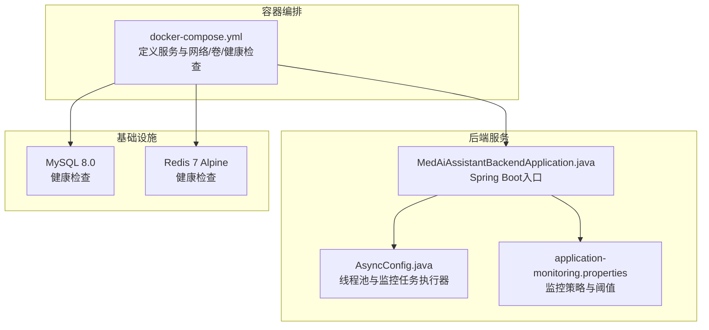
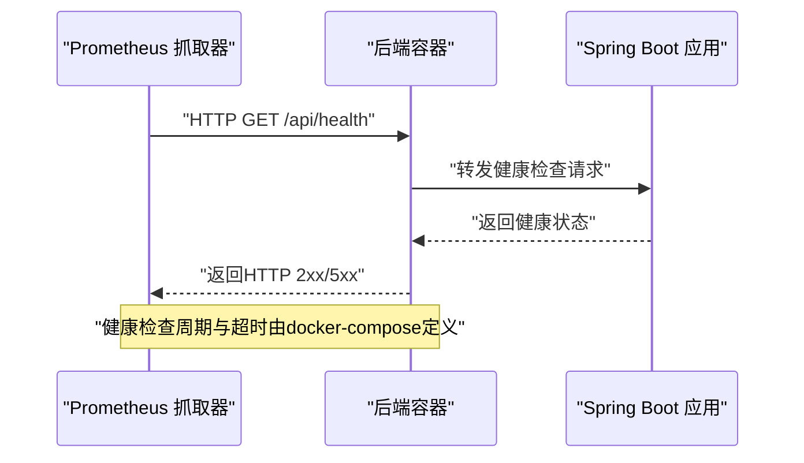
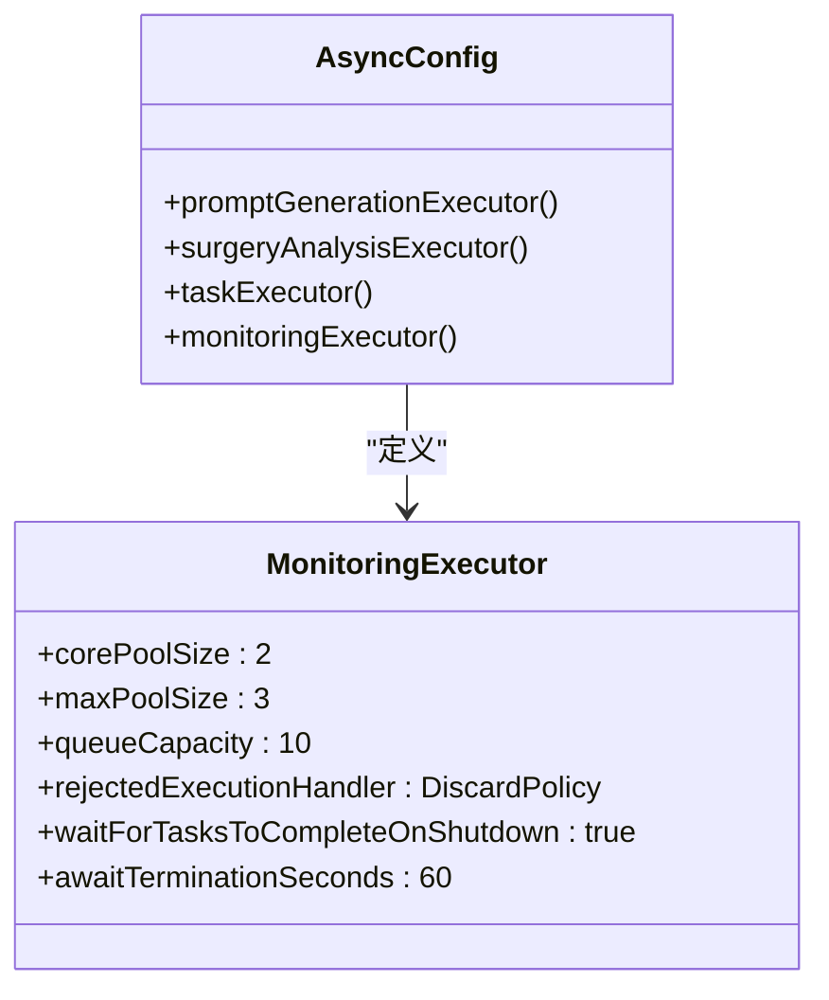
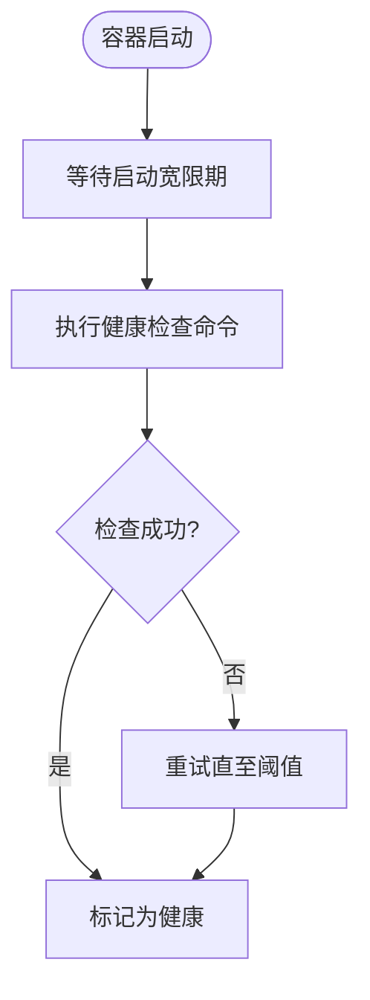
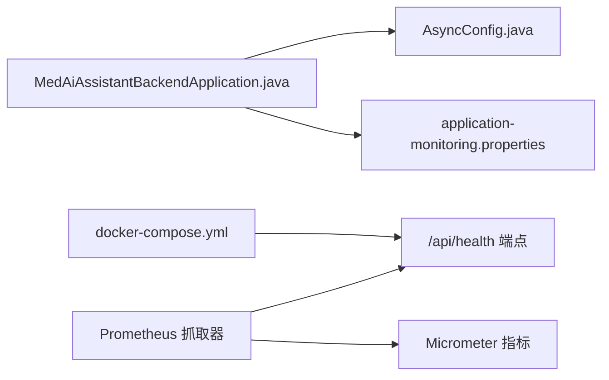

# 监控配置

<cite>
**本文引用的文件**
- [docker-compose.yml](file://med_ai_assistant_1.0_bs_backend/docker-compose.yml)
- [MedAiAssistantBackendApplication.java](file://med_ai_assistant_1.0_bs_backend/src/main/java/com/example/medaiassistant/MedAiAssistantBackendApplication.java)
- [AsyncConfig.java](file://med_ai_assistant_1.0_bs_backend/src/main/java/com/example/medaiassistant/config/AsyncConfig.java)
- [application-monitoring.properties](file://med_ai_assistant_1.0_bs_backend/config/application-monitoring.properties)
- [常用.txt](file://项目相关/常用.txt)
</cite>

## 目录
1. [简介](#简介)
2. [项目结构](#项目结构)
3. [核心组件](#核心组件)
4. [架构总览](#架构总览)
5. [详细组件分析](#详细组件分析)
6. [依赖分析](#依赖分析)
7. [性能考虑](#性能考虑)
8. [故障排查指南](#故障排查指南)
9. [结论](#结论)
10. [附录](#附录)

## 简介
本文件面向MedAiAssistant 1.0 BS后端服务，提供一套系统化的监控配置说明，覆盖指标采集与标签、自定义指标、Prometheus集成、APM、日志级别、健康检查端点、监控可视化与告警通知、以及最佳实践与性能影响分析。当前仓库中已包含独立的监控策略配置文件与容器化健康检查配置，便于快速落地。

## 项目结构
后端采用Spring Boot应用，配合Docker Compose进行编排，包含后端服务、MySQL数据库与Redis缓存。后端服务内置健康检查端点，容器编排中配置了健康检查策略；同时提供独立的监控策略配置文件，涵盖启动期与运行期的监控参数、告警阈值、日志级别、性能基线与导出策略等。

图示来源
- [docker-compose.yml](file://med_ai_assistant_1.0_bs_backend/docker-compose.yml#L1-L97)
- [MedAiAssistantBackendApplication.java](file://med_ai_assistant_1.0_bs_backend/src/main/java/com/example/medaiassistant/MedAiAssistantBackendApplication.java#L1-L50)
- [AsyncConfig.java](file://med_ai_assistant_1.0_bs_backend/src/main/java/com/example/medaiassistant/config/AsyncConfig.java#L1-L144)
- [application-monitoring.properties](file://med_ai_assistant_1.0_bs_backend/config/application-monitoring.properties#L1-L196)

章节来源
- [docker-compose.yml](file://med_ai_assistant_1.0_bs_backend/docker-compose.yml#L1-L97)
- [MedAiAssistantBackendApplication.java](file://med_ai_assistant_1.0_bs_backend/src/main/java/com/example/medaiassistant/MedAiAssistantBackendApplication.java#L1-L50)
- [AsyncConfig.java](file://med_ai_assistant_1.0_bs_backend/src/main/java/com/example/medaiassistant/config/AsyncConfig.java#L1-L144)
- [application-monitoring.properties](file://med_ai_assistant_1.0_bs_backend/config/application-monitoring.properties#L1-L196)

## 核心组件
- Spring Boot应用入口：启用调度与JPA仓库扫描，为后续指标暴露与健康检查提供基础。
- 异步与监控线程池：提供独立的监控任务执行器，降低监控对业务线程池的影响。
- 监控策略配置：集中管理启动期/运行期阈值、告警间隔、日志级别、性能基线、导出策略与通知方式等。

章节来源
- [MedAiAssistantBackendApplication.java](file://med_ai_assistant_1.0_bs_backend/src/main/java/com/example/medaiassistant/MedAiAssistantBackendApplication.java#L26-L37)
- [AsyncConfig.java](file://med_ai_assistant_1.0_bs_backend/src/main/java/com/example/medaiassistant/config/AsyncConfig.java#L124-L142)
- [application-monitoring.properties](file://med_ai_assistant_1.0_bs_backend/config/application-monitoring.properties#L1-L196)

## 架构总览
后端服务通过容器编排暴露健康检查端点，结合独立的监控策略配置文件，形成“容器健康检查 + 应用内监控策略”的双层保障。若需接入Prometheus，可在现有基础上扩展指标暴露与抓取配置。

图示来源
- [docker-compose.yml](file://med_ai_assistant_1.0_bs_backend/docker-compose.yml#L29-L34)

## 详细组件分析

### 指标与监控策略配置
- 启动期与运行期监控参数分离，支持动态过渡条件与缓冲时间。
- 健康检查超时、组件就绪检查间隔、性能指标收集间隔与保留时间等。
- 日志级别在启动期与运行期切换，错误日志监控与告警阈值可配置。
- 数据库连接池使用率、查询性能阈值；线程池使用率与队列长度阈值；内存使用率与GC时间阈值；API响应时间与错误率阈值。
- 自定义监控开关、间隔与超时；监控数据导出间隔、保留天数、压缩与格式；告警通知方式、重试与静默周期。

章节来源
- [application-monitoring.properties](file://med_ai_assistant_1.0_bs_backend/config/application-monitoring.properties#L1-L196)

### 线程池与监控任务执行器
- 提供专用监控线程池，核心线程与最大线程、队列容量、拒绝策略与关闭等待时间均明确配置，适合执行健康检查与轻量监控任务。
- 与业务线程池隔离，避免监控任务对业务造成干扰。

图示来源
- [AsyncConfig.java](file://med_ai_assistant_1.0_bs_backend/src/main/java/com/example/medaiassistant/config/AsyncConfig.java#L124-L142)

章节来源
- [AsyncConfig.java](file://med_ai_assistant_1.0_bs_backend/src/main/java/com/example/medaiassistant/config/AsyncConfig.java#L124-L142)

### 健康检查端点与容器编排
- 容器健康检查通过curl访问后端健康端点，配置了检查间隔、超时、重试与启动宽限期。
- 健康检查端点路径与返回码约定建议与实际实现一致，便于Prometheus抓取与Kubernetes探针联动。

图示来源
- [docker-compose.yml](file://med_ai_assistant_1.0_bs_backend/docker-compose.yml#L29-L34)

章节来源
- [docker-compose.yml](file://med_ai_assistant_1.0_bs_backend/docker-compose.yml#L29-L34)

### 日志级别与错误监控
- 启动期默认较细的日志级别，运行期收敛至警告级别，降低I/O开销。
- 错误日志监控间隔与告警阈值可配置，便于在生产环境快速定位异常。

章节来源
- [application-monitoring.properties](file://med_ai_assistant_1.0_bs_backend/config/application-monitoring.properties#L76-L90)

### 性能基线与指标保留
- 性能指标收集间隔与保留时间、性能基线计算周期，有助于建立趋势分析与异常检测。
- 建议结合Prometheus存储能力与外部可视化工具进行长期趋势分析。

章节来源
- [application-monitoring.properties](file://med_ai_assistant_1.0_bs_backend/config/application-monitoring.properties#L63-L74)

### 数据库、线程池、内存与网络监控
- 数据库连接池使用率与查询性能阈值；线程池使用率与队列长度阈值；内存使用率与GC时间阈值；API响应时间与错误率阈值。
- 以上阈值可作为Prometheus告警规则的基础，建议按服务SLA细化。

章节来源
- [application-monitoring.properties](file://med_ai_assistant_1.0_bs_backend/config/application-monitoring.properties#L92-L147)

### 自定义监控与数据导出
- 自定义监控开关、间隔与超时；监控数据导出间隔、保留天数、压缩与格式；便于离线分析或归档。
- 建议与Prometheus数据导出器或批处理作业配合使用。

章节来源
- [application-monitoring.properties](file://med_ai_assistant_1.0_bs_backend/config/application-monitoring.properties#L149-L177)

### 告警通知配置
- 告警通知开关、通知方式（邮件、Webhook等）、重试次数与间隔、静默周期。
- 建议与企业通知平台（如IM、短信网关）对接，确保关键告警可达。

章节来源
- [application-monitoring.properties](file://med_ai_assistant_1.0_bs_backend/config/application-monitoring.properties#L178-L196)

## 依赖分析
- 容器编排依赖后端健康检查端点；后端应用依赖线程池与监控策略配置；监控策略配置为后续Prometheus抓取与告警提供依据。
- 建议在现有基础上引入Micrometer与Actuator，以标准化指标暴露与命名空间管理。

图示来源
- [docker-compose.yml](file://med_ai_assistant_1.0_bs_backend/docker-compose.yml#L29-L34)
- [MedAiAssistantBackendApplication.java](file://med_ai_assistant_1.0_bs_backend/src/main/java/com/example/medaiassistant/MedAiAssistantBackendApplication.java#L26-L37)
- [AsyncConfig.java](file://med_ai_assistant_1.0_bs_backend/src/main/java/com/example/medaiassistant/config/AsyncConfig.java#L1-L144)
- [application-monitoring.properties](file://med_ai_assistant_1.0_bs_backend/config/application-monitoring.properties#L1-L196)

## 性能考虑
- 监控线程池规模较小且采用丢弃策略，适合轻量监控任务，避免在高负载时放大延迟。
- 日志级别在运行期收敛，可显著降低磁盘与网络压力。
- 指标收集间隔与保留时间需与Prometheus存储成本平衡，避免过度采样导致资源浪费。
- 健康检查间隔与超时应与实例规模与网络状况匹配，防止误判与抖动。

## 故障排查指南
- 健康检查失败：检查容器日志与后端健康端点可用性，确认docker-compose中的检查命令与端口映射。
- 监控任务未执行：确认监控线程池是否初始化、任务是否被拒绝或丢弃。
- 告警未触发：核对application-monitoring.properties中的阈值与间隔配置，确保Prometheus抓取端点可达。
- 日志级别过高：调整运行期日志级别，降低I/O与存储压力。

章节来源
- [docker-compose.yml](file://med_ai_assistant_1.0_bs_backend/docker-compose.yml#L29-L34)
- [AsyncConfig.java](file://med_ai_assistant_1.0_bs_backend/src/main/java/com/example/medaiassistant/config/AsyncConfig.java#L124-L142)
- [application-monitoring.properties](file://med_ai_assistant_1.0_bs_backend/config/application-monitoring.properties#L76-L90)

## 结论
当前仓库已具备容器健康检查与独立监控策略配置，可作为Prometheus集成与告警体系的起点。建议在现有基础上引入Micrometer与Actuator，完善指标命名与标签体系，并结合可视化与通知平台，形成闭环的可观测性方案。

## 附录
- 健康检查端点路径与返回约定：参见容器健康检查配置。
- 常用命令与部署参考：参见项目相关文档。

章节来源
- [docker-compose.yml](file://med_ai_assistant_1.0_bs_backend/docker-compose.yml#L29-L34)
- [常用.txt](file://项目相关/常用.txt#L66-L91)