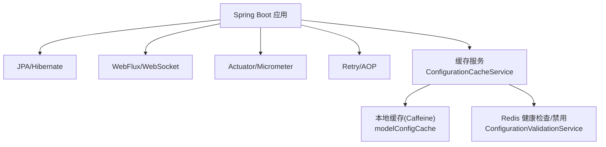
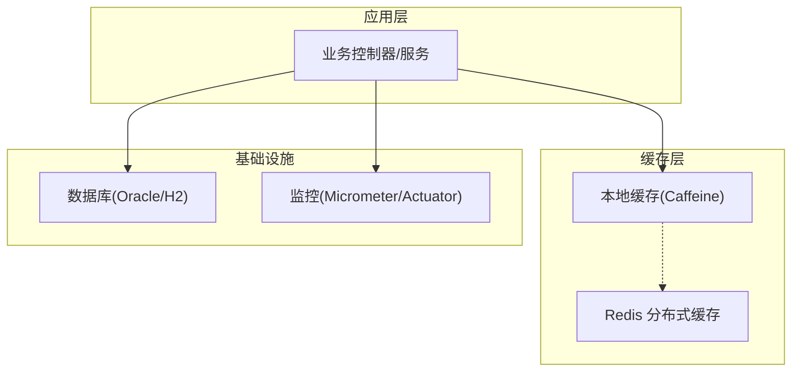
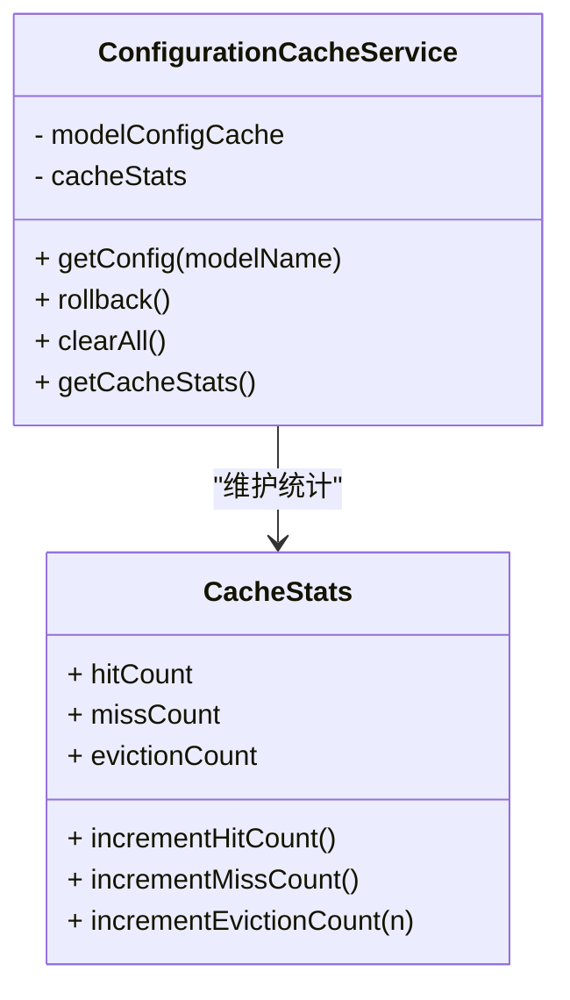
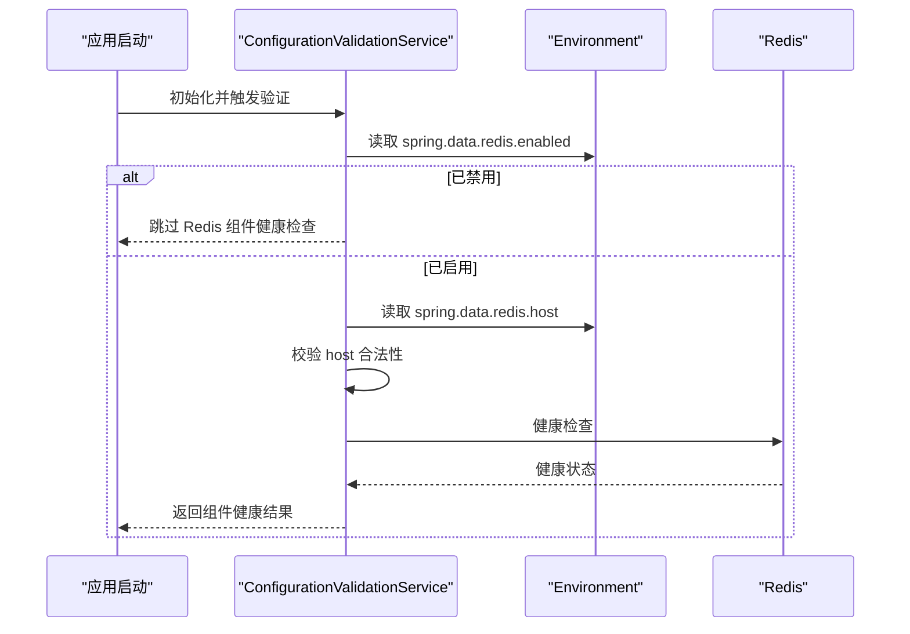
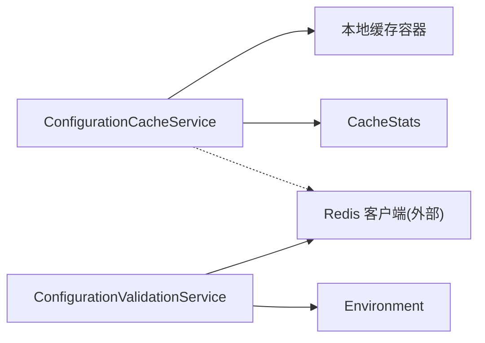

# 缓存配置

<cite>
**本文引用的文件**
- [pom.xml](file://med_ai_assistant_1.0_bs_backend/pom.xml)
- [application-execution.properties](file://med_ai_assistant_1.0_bs_backend/src/main/resources/application-execution.properties)
- [application-oracle.properties](file://med_ai_assistant_1.0_bs_backend/src/main/resources/application-oracle.properties)
- [ConfigurationCacheService.java](file://med_ai_assistant_1.0_bs_backend/src/main/java/com/example/medaiassistant/config/ConfigurationCacheService.java)
- [ConfigurationValidationService.java](file://med_ai_assistant_1.0_bs_backend/src/main/java/com/example/medaiassistant/config/ConfigurationValidationService.java)
</cite>

## 目录
1. [简介](#简介)
2. [项目结构](#项目结构)
3. [核心组件](#核心组件)
4. [架构总览](#架构总览)
5. [组件详解](#组件详解)
6. [依赖关系分析](#依赖关系分析)
7. [性能与内存优化](#性能与内存优化)
8. [故障处理与安全防护](#故障处理与安全防护)
9. [结论](#结论)
10. [附录](#附录)

## 简介
本文件面向 MedAiAssistant 1.0 BS 后端的缓存配置，聚焦于以下方面：
- Redis 缓存配置：连接配置、集群模式、哨兵模式、健康检查与禁用策略
- Spring Cache 注解与缓存键策略、过期时间设置
- 本地缓存（Caffeine）与分布式缓存（Redis）的协同
- 序列化配置、性能优化、内存管理、缓存一致性保障
- 缓存故障处理、缓存穿透与缓存雪崩的预防策略

当前仓库中未发现显式的 Redis/Spring Cache 配置文件与类，但存在与缓存相关的服务类与配置文件，本文基于现有代码与依赖进行系统化梳理与建议。

## 项目结构
后端采用 Spring Boot 架构，核心依赖与配置如下：
- 核心依赖：Spring Data JPA、WebFlux、Actuator、Micrometer、Retry、Validation 等
- 配置文件：按环境划分（主服务、执行服务、Oracle 专用），并包含异步回调、数据库连接池、超时等关键参数
- 缓存相关：存在本地缓存服务类与 Redis 健康检查/禁用逻辑

图示来源
- [pom.xml](file://med_ai_assistant_1.0_bs_backend/pom.xml#L53-L214)
- [ConfigurationCacheService.java](file://med_ai_assistant_1.0_bs_backend/src/main/java/com/example/medaiassistant/config/ConfigurationCacheService.java#L28-L151)
- [ConfigurationValidationService.java](file://med_ai_assistant_1.0_bs_backend/src/main/java/com/example/medaiassistant/config/ConfigurationValidationService.java#L29-L205)

章节来源
- [pom.xml](file://med_ai_assistant_1.0_bs_backend/pom.xml#L53-L214)
- [application-execution.properties](file://med_ai_assistant_1.0_bs_backend/src/main/resources/application-execution.properties#L1-L64)
- [application-oracle.properties](file://med_ai_assistant_1.0_bs_backend/src/main/resources/application-oracle.properties#L1-L11)

## 核心组件
- 本地缓存服务：负责模型配置的本地缓存读取、命中统计、驱逐与清空
- Redis 验证服务：负责 Redis 是否启用、主机配置、健康检查与组件状态上报

章节来源
- [ConfigurationCacheService.java](file://med_ai_assistant_1.0_bs_backend/src/main/java/com/example/medaiassistant/config/ConfigurationCacheService.java#L28-L151)
- [ConfigurationValidationService.java](file://med_ai_assistant_1.0_bs_backend/src/main/java/com/example/medaiassistant/config/ConfigurationValidationService.java#L29-L205)

## 架构总览
下图展示缓存层在系统中的位置与交互：

图示来源
- [pom.xml](file://med_ai_assistant_1.0_bs_backend/pom.xml#L53-L214)
- [ConfigurationCacheService.java](file://med_ai_assistant_1.0_bs_backend/src/main/java/com/example/medaiassistant/config/ConfigurationCacheService.java#L28-L151)
- [ConfigurationValidationService.java](file://med_ai_assistant_1.0_bs_backend/src/main/java/com/example/medaiassistant/config/ConfigurationValidationService.java#L29-L205)

## 组件详解

### 本地缓存服务（Caffeine）
职责与行为
- 提供模型配置的本地缓存读取与命中统计
- 在回滚与清空场景中进行驱逐计数与日志记录
- 维护缓存统计对象，便于监控与告警

关键点
- 缓存容器：modelConfigCache（本地缓存实例）
- 统计指标：命中次数、未命中次数、驱逐次数
- 清理策略：回滚与清空时对缓存大小进行统计与驱逐计数

图示来源
- [ConfigurationCacheService.java](file://med_ai_assistant_1.0_bs_backend/src/main/java/com/example/medaiassistant/config/ConfigurationCacheService.java#L28-L151)

章节来源
- [ConfigurationCacheService.java](file://med_ai_assistant_1.0_bs_backend/src/main/java/com/example/medaiassistant/config/ConfigurationCacheService.java#L28-L151)

### Redis 验证与健康检查
职责与行为
- 判断 Redis 是否启用（通过配置项）
- 校验 Redis 主机配置合法性
- 对 Redis 进行健康检查并将结果纳入组件健康状态
- 将 Redis 组件健康状态加入整体健康检查结果

图示来源
- [ConfigurationValidationService.java](file://med_ai_assistant_1.0_bs_backend/src/main/java/com/example/medaiassistant/config/ConfigurationValidationService.java#L137-L205)

章节来源
- [ConfigurationValidationService.java](file://med_ai_assistant_1.0_bs_backend/src/main/java/com/example/medaiassistant/config/ConfigurationValidationService.java#L29-L205)

### Spring Cache 注解与键策略
当前仓库未发现显式的 Spring Cache 配置类与注解使用。建议在业务层通过以下方式落地：
- 开启注解驱动：在配置类上启用缓存注解支持
- 自定义键生成器：基于方法签名与参数生成稳定键
- 过期策略：针对不同业务设置差异化过期时间
- 缓存同步：必要时结合 @CacheEvict/@CachePut 实现一致性

说明
- 本节为通用实践建议，不对应具体源码文件

### Redis 连接与高可用配置
当前仓库未发现显式的 Redis 配置文件。建议在 application-{env}.properties 中补充：
- 连接参数：主机、端口、密码、数据库索引、超时
- 连接池：最大连接数、最小空闲、连接超时
- 集群模式：节点列表、扫描间隔、重定向处理
- 哨兵模式：主节点名、哨兵地址、认证、超时
- 健康检查：探测周期、失败阈值
- 序列化：JSON/Jackson/Kryo 等序列化器选择与配置

说明
- 本节为通用实践建议，不对应具体源码文件

### 本地缓存（Caffeine）与分布式缓存（Redis）协同
- 本地缓存优先：先查本地缓存，未命中再查 Redis
- 失效传播：本地缓存更新/失效时，同步通知或延迟刷新 Redis
- 缓存降级：当 Redis 不可用时，仅使用本地缓存
- 统一键空间：统一键前缀与命名规范，避免冲突

说明
- 本节为通用实践建议，不对应具体源码文件

## 依赖关系分析
- 本地缓存服务依赖于缓存容器与统计对象
- Redis 验证服务依赖于环境变量与 Redis 客户端
- 应用层通过缓存服务访问本地与分布式缓存

图示来源
- [ConfigurationCacheService.java](file://med_ai_assistant_1.0_bs_backend/src/main/java/com/example/medaiassistant/config/ConfigurationCacheService.java#L28-L151)
- [ConfigurationValidationService.java](file://med_ai_assistant_1.0_bs_backend/src/main/java/com/example/medaiassistant/config/ConfigurationValidationService.java#L29-L205)

章节来源
- [ConfigurationCacheService.java](file://med_ai_assistant_1.0_bs_backend/src/main/java/com/example/medaiassistant/config/ConfigurationCacheService.java#L28-L151)
- [ConfigurationValidationService.java](file://med_ai_assistant_1.0_bs_backend/src/main/java/com/example/medaiassistant/config/ConfigurationValidationService.java#L29-L205)

## 性能与内存优化
- 本地缓存
  - 设置容量上限与过期策略，避免内存膨胀
  - 使用弱引用/软引用键值，降低 GC 压力
  - 启用统计与监控，定期评估命中率与淘汰率
- Redis
  - 合理设置连接池大小与超时，避免阻塞
  - 使用管道/批处理减少网络往返
  - 选择合适的序列化器，平衡吞吐与体积
- 一致性与并发
  - 使用带版本/ETag 的键，避免脏读
  - 对热点键进行分片或多副本
- 监控与告警
  - 结合 Actuator/Micrometer 暴露缓存指标
  - 关注命中率、淘汰率、延迟、内存占用

说明
- 本节为通用实践建议，不对应具体源码文件

## 故障处理与安全防护
- 故障处理
  - Redis 不可用时快速降级至本地缓存
  - 异常隔离：缓存异常不影响主业务流程
  - 重试与熔断：对 Redis 请求设置指数退避与熔断阈值
- 缓存穿透
  - 对空值设置短 TTL 的占位缓存
  - 使用布隆过滤器预筛不存在的键
- 缓存雪崩
  - 为过期时间引入随机抖动
  - 分层缓存：本地+二级缓存，避免全盘失效
- 一致性
  - 写策略：先写数据库，再删缓存；或写缓存并设置过期
  - 读策略：先读本地，未命中再读远端并回填

说明
- 本节为通用实践建议，不对应具体源码文件

## 结论
- 当前仓库已具备本地缓存与 Redis 健康检查的基础能力
- 建议尽快补齐 Redis/Spring Cache 的显式配置与注解使用
- 通过容量、过期、序列化与监控等手段持续优化缓存性能
- 以降级、熔断、布隆过滤器与抖动等策略保障稳定性与一致性

## 附录

### 配置文件要点摘录
- 执行服务配置（端口、数据库、异步超时、回调等）
- Oracle 专用配置（方言、DDL 策略）

章节来源
- [application-execution.properties](file://med_ai_assistant_1.0_bs_backend/src/main/resources/application-execution.properties#L1-L64)
- [application-oracle.properties](file://med_ai_assistant_1.0_bs_backend/src/main/resources/application-oracle.properties#L1-L11)