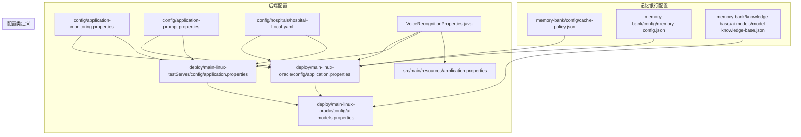
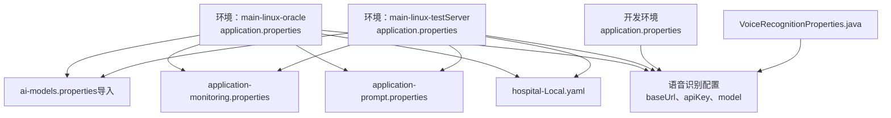
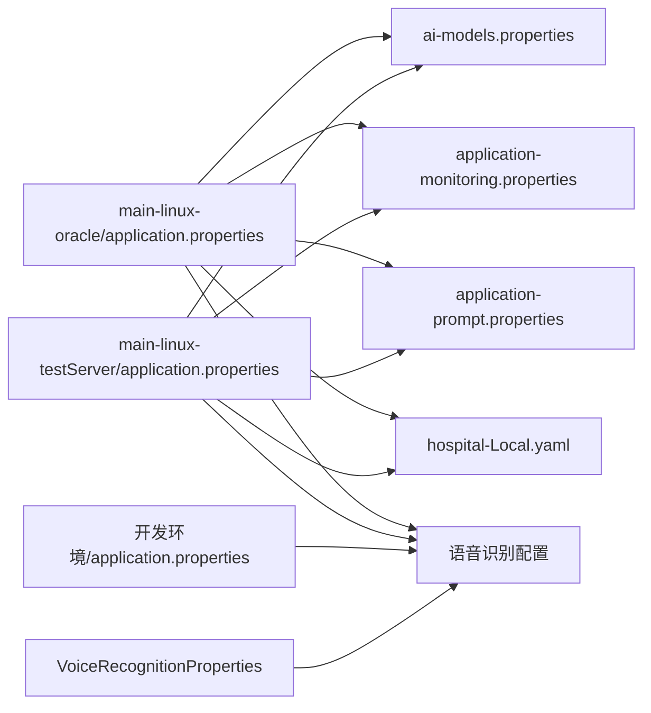

# 配置管理

<cite>
**本文引用的文件**
- [VoiceRecognitionProperties.java](file://med_ai_assistant_1.0_bs_backend/src/main/java/com/example/medaiassistant/config/VoiceRecognitionProperties.java)
- [application-monitoring.properties](file://med_ai_assistant_1.0_bs_backend/config/application-monitoring.properties)
- [application-prompt.properties](file://med_ai_assistant_1.0_bs_backend/config/application-prompt.properties)
- [hospital-Local.yaml](file://med_ai_assistant_1.0_bs_backend/config/hospitals/hospital-Local.yaml)
- [application.properties（main-linux-oracle）](file://med_ai_assistant_1.0_bs_backend/deploy/main-linux-oracle/config/application.properties)
- [ai-models.properties（main-linux-oracle）](file://med_ai_assistant_1.0_bs_backend/deploy/main-linux-oracle/config/ai-models.properties)
- [application.properties（main-linux-testServer）](file://med_ai_assistant_1.0_bs_backend/deploy/main-linux-testServer/config/application.properties)
- [cache-policy.json](file://med_ai_assistant_1.0_bs_backend/memory-bank/config/cache-policy.json)
- [memory-config.json](file://med_ai_assistant_1.0_bs_backend/memory-bank/config/memory-config.json)
- [model-knowledge-base.json](file://med_ai_assistant_1.0_bs_backend/memory-bank/knowledge-base/ai-models/model-knowledge-base.json)
- [application.properties（开发环境）](file://med_ai_assistant_1.0_bs_backend/src/main/resources/application.properties)
- [Oracle数据库PGA内存超限错误修复-2026年03月14日.md](file://med_ai_assistant_1.0_bs_backend/doc/问题修复/Oracle数据库PGA内存超限错误修复-2026年03月14日.md)
</cite>

## 更新摘要
**所做更改**
- 新增语音识别配置外化章节，详细介绍VoiceRecognitionProperties配置类和相关配置项
- 更新生产环境语音识别配置修复说明，包括baseUrl和apiKey配置项
- 新增Oracle数据库PGA内存调整配置优化章节
- 更新配置优先级规则，增加语音识别配置的特殊处理
- 完善数据库配置优化的最佳实践指导

## 目录
1. [引言](#引言)
2. [项目结构](#项目结构)
3. [核心组件](#核心组件)
4. [架构总览](#架构总览)
5. [详细组件分析](#详细组件分析)
6. [依赖分析](#依赖分析)
7. [性能考虑](#性能考虑)
8. [故障排查指南](#故障排查指南)
9. [结论](#结论)
10. [附录](#附录)

## 引言
本文件面向 MedAiAssistant 1.0 BS 的配置管理，系统性梳理配置的组织结构、层次关系与作用域，明确开发、测试、生产三类环境的差异化策略，给出配置参数优先级规则与敏感信息安全管理建议，并围绕数据库连接、监控参数、AI 模型、缓存等关键配置项提供说明、最佳实践与常见错误排查方法。

**更新** 本次更新重点反映了语音识别配置外化改进、生产环境配置修复以及数据库配置优化的最新进展，新增了VoiceRecognitionProperties配置类、baseUrl和apiKey配置项，以及Oracle数据库PGA内存调整的优化策略。

## 项目结构
MedAiAssistant 的配置主要分布在以下位置：
- 后端配置
  - config 目录：通用属性与 YAML 医院集成配置
  - deploy/<env>-<cluster>/config：按环境与集群划分的生产级配置
  - src/main/java/com/example/medaiassistant/config：Java配置类定义
- 记忆银行配置
  - memory-bank/config：缓存策略、内存与性能参数
  - memory-bank/knowledge-base/ai-models：AI 模型知识库与提示模板
- 开发资源配置
  - src/main/resources：开发环境默认配置

下图展示配置在项目中的分布与层次关系：

**图表来源**
- [application-monitoring.properties:1-196](file://med_ai_assistant_1.0_bs_backend/config/application-monitoring.properties#L1-L196)
- [application-prompt.properties:1-29](file://med_ai_assistant_1.0_bs_backend/config/application-prompt.properties#L1-L29)
- [hospital-Local.yaml:1-38](file://med_ai_assistant_1.0_bs_backend/config/hospitals/hospital-Local.yaml#L1-L38)
- [application.properties（main-linux-oracle）:1-191](file://med_ai_assistant_1.0_bs_backend/deploy/main-linux-oracle/config/application.properties#L1-L191)
- [ai-models.properties（main-linux-oracle）:1-24](file://med_ai_assistant_1.0_bs_backend/deploy/main-linux-oracle/config/ai-models.properties#L1-L24)
- [application.properties（main-linux-testServer）:1-188](file://med_ai_assistant_1.0_bs_backend/deploy/main-linux-testServer/config/application.properties#L1-L188)
- [VoiceRecognitionProperties.java:1-104](file://med_ai_assistant_1.0_bs_backend/src/main/java/com/example/medaiassistant/config/VoiceRecognitionProperties.java#L1-L104)
- [application.properties（开发环境）:1-289](file://med_ai_assistant_1.0_bs_backend/src/main/resources/application.properties#L1-L289)

**章节来源**
- [VoiceRecognitionProperties.java:1-104](file://med_ai_assistant_1.0_bs_backend/src/main/java/com/example/medaiassistant/config/VoiceRecognitionProperties.java#L1-L104)
- [application-monitoring.properties:1-196](file://med_ai_assistant_1.0_bs_backend/config/application-monitoring.properties#L1-L196)
- [application-prompt.properties:1-29](file://med_ai_assistant_1.0_bs_backend/config/application-prompt.properties#L1-L29)
- [hospital-Local.yaml:1-38](file://med_ai_assistant_1.0_bs_backend/config/hospitals/hospital-Local.yaml#L1-L38)
- [application.properties（main-linux-oracle）:1-191](file://med_ai_assistant_1.0_bs_backend/deploy/main-linux-oracle/config/application.properties#L1-L191)
- [ai-models.properties（main-linux-oracle）:1-24](file://med_ai_assistant_1.0_bs_backend/deploy/main-linux-oracle/config/ai-models.properties#L1-L24)
- [application.properties（main-linux-testServer）:1-188](file://med_ai_assistant_1.0_bs_backend/deploy/main-linux-testServer/config/application.properties#L1-L188)
- [cache-policy.json:1-46](file://med_ai_assistant_1.0_bs_backend/memory-bank/config/cache-policy.json#L1-L46)
- [memory-config.json:1-32](file://med_ai_assistant_1.0_bs_backend/memory-bank/config/memory-config.json#L1-L32)
- [model-knowledge-base.json:1-121](file://med_ai_assistant_1.0_bs_backend/memory-bank/knowledge-base/ai-models/model-knowledge-base.json#L1-L121)
- [application.properties（开发环境）:1-289](file://med_ai_assistant_1.0_bs_backend/src/main/resources/application.properties#L1-L289)

## 核心组件
- 监控配置：集中于 application-monitoring.properties，涵盖启动/运行阶段阈值、告警与导出策略，支撑系统健康度与性能观测。
- Prompt 服务配置：application-prompt.properties 控制提交、轮询与监控的频率、重试与超时等行为。
- 医院集成配置：hospital-Local.yaml 定义 HIS/LIS 数据源、字段映射、定时同步策略与 SQL 模板基路径。
- 应用配置（Spring Boot）：按环境拆分，main-linux-oracle 与 main-linux-testServer 提供生产与测试环境的 JPA/HikariCP/线程池/Redis/定时任务/日志等配置；ai-models.properties 作为外部导入的模型配置。
- **语音识别配置**：通过VoiceRecognitionProperties配置类实现配置外化，支持baseUrl、apiKey、model、sampleRate、format等参数的灵活配置。
- 记忆银行配置：cache-policy.json 与 memory-config.json 定义缓存 TTL、容量、清理与性能参数；model-knowledge-base.json 描述可用模型能力、限制与提示模板。

**更新** 新增语音识别配置外化组件，通过VoiceRecognitionProperties配置类实现配置外化，支持不同ASR服务提供商的灵活切换。

**章节来源**
- [VoiceRecognitionProperties.java:1-104](file://med_ai_assistant_1.0_bs_backend/src/main/java/com/example/medaiassistant/config/VoiceRecognitionProperties.java#L1-L104)
- [application-monitoring.properties:1-196](file://med_ai_assistant_1.0_bs_backend/config/application-monitoring.properties#L1-L196)
- [application-prompt.properties:1-29](file://med_ai_assistant_1.0_bs_backend/config/application-prompt.properties#L1-L29)
- [hospital-Local.yaml:1-38](file://med_ai_assistant_1.0_bs_backend/config/hospitals/hospital-Local.yaml#L1-L38)
- [application.properties（main-linux-oracle）:1-191](file://med_ai_assistant_1.0_bs_backend/deploy/main-linux-oracle/config/application.properties#L1-L191)
- [ai-models.properties（main-linux-oracle）:1-24](file://med_ai_assistant_1.0_bs_backend/deploy/main-linux-oracle/config/ai-models.properties#L1-L24)
- [application.properties（main-linux-testServer）:1-188](file://med_ai_assistant_1.0_bs_backend/deploy/main-linux-testServer/config/application.properties#L1-L188)
- [cache-policy.json:1-46](file://med_ai_assistant_1.0_bs_backend/memory-bank/config/cache-policy.json#L1-L46)
- [memory-config.json:1-32](file://med_ai_assistant_1.0_bs_backend/memory-bank/config/memory-config.json#L1-L32)
- [model-knowledge-base.json:1-121](file://med_ai_assistant_1.0_bs_backend/memory-bank/knowledge-base/ai-models/model-knowledge-base.json#L1-L121)

## 架构总览
下图展示配置在系统中的作用域与交互关系，包括环境差异、配置导入与关键参数来源。

**图表来源**
- [application.properties（main-linux-oracle）:1-191](file://med_ai_assistant_1.0_bs_backend/deploy/main-linux-oracle/config/application.properties#L1-L191)
- [ai-models.properties（main-linux-oracle）:1-24](file://med_ai_assistant_1.0_bs_backend/deploy/main-linux-oracle/config/ai-models.properties#L1-L24)
- [application.properties（main-linux-testServer）:1-188](file://med_ai_assistant_1.0_bs_backend/deploy/main-linux-testServer/config/application.properties#L1-L188)
- [application-monitoring.properties:1-196](file://med_ai_assistant_1.0_bs_backend/config/application-monitoring.properties#L1-L196)
- [application-prompt.properties:1-29](file://med_ai_assistant_1.0_bs_backend/config/application-prompt.properties#L1-L29)
- [hospital-Local.yaml:1-38](file://med_ai_assistant_1.0_bs_backend/config/hospitals/hospital-Local.yaml#L1-L38)
- [VoiceRecognitionProperties.java:1-104](file://med_ai_assistant_1.0_bs_backend/src/main/java/com/example/medaiassistant/config/VoiceRecognitionProperties.java#L1-L104)
- [application.properties（开发环境）:1-289](file://med_ai_assistant_1.0_bs_backend/src/main/resources/application.properties#L1-L289)

## 详细组件分析

### 监控参数配置（application-monitoring.properties）
- 分级监控策略：区分启动阶段与正常运行阶段的阈值与时序参数，确保系统在不同生命周期具备针对性的可观测性。
- 告警与导出：定义连接泄漏、健康度、性能指标、日志错误、数据库/线程池/内存/网络等维度的阈值与间隔，并支持导出格式与保留策略。
- 使用建议
  - 开发环境可适度放宽阈值，便于调试；生产环境应严格控制告警频率与静默期，避免噪声。
  - 结合业务峰值时段调整监控间隔与保留策略，平衡存储成本与可观测性。

**章节来源**
- [application-monitoring.properties:1-196](file://med_ai_assistant_1.0_bs_backend/config/application-monitoring.properties#L1-L196)

### Prompt 服务配置（application-prompt.properties）
- 功能模块：提交、轮询、监控三大模块，分别控制任务频率、分页与批大小、最大重试与超时等。
- 参数要点：提交与轮询的间隔、页面/批次大小、最大重试次数与重试间隔、连接/读取超时等。
- 使用建议
  - 根据下游服务吞吐与稳定性调整提交/轮询间隔与重试策略。
  - 监控模块的阈值应与业务 SLA 对齐，避免过早触发告警或漏报异常。

**章节来源**
- [application-prompt.properties:1-29](file://med_ai_assistant_1.0_bs_backend/config/application-prompt.properties#L1-L29)

### 医院集成配置（hospital-Local.yaml）
- HIS/LIS 数据源：JDBC URL、用户名、密码、表前缀等。
- 同步策略：定时 Cron 表达式、是否启用、最大重试次数与重试间隔。
- 字段映射：将本地字段映射到 HIS/LIS 字段，保证数据一致性。
- SQL 模板：指定 SQL 模板基路径与覆盖清单，便于按医院定制查询。
- 使用建议
  - 密码等敏感信息应通过环境变量或外部机密管理工具注入，避免硬编码。
  - 字段映射与模板路径需与实际数据库结构与部署路径保持一致。

**章节来源**
- [hospital-Local.yaml:1-38](file://med_ai_assistant_1.0_bs_backend/config/hospitals/hospital-Local.yaml#L1-L38)

### 应用配置（Spring Boot，按环境）
- 环境划分：main-linux-oracle（生产）与 main-linux-testServer（测试）两套配置，均通过 ai-models.properties 导入模型配置。
- 关键参数
  - JPA/Hibernate：DDL 策略、方言、时区、SQL 输出控制等。
  - HikariCP：连接池大小、空闲/最大存活时间、连接超时、泄漏检测、校验超时、保活查询等。
  - 线程池与调度：全局调度线程池与专用线程池（Prompt 生成、手术分析、通用执行器）的核心/最大/队列容量与命名前缀。
  - 监控与健康：暴露端点、健康探针。
  - 服务端口与上下文路径：确保与编排暴露一致。
  - Redis：主机、端口、密码（可选）。
  - 执行服务器：统一的执行服务器地址与 Oracle 连接参数。
  - 下载目录：构建产物下载路径（宿主机挂载映射）。
  - 定时任务：每日 Prompt 生成、手术分析、中午查房记录生成的时间、最大并发与固定延迟。
  - 医院默认 ID：决定加载的医院配置。
  - 夜间同步：是否启用、启动时执行、Cron 表达式。
  - 日志：精简 Hibernate SQL 日志与数据库诊断日志级别。
  - **语音识别**：通过VoiceRecognitionProperties配置类管理baseUrl、apiKey、model、sampleRate、format等参数。
- 环境变量注入：多处参数通过 ${VAR:default} 形式注入，便于在不同环境灵活替换。

**更新** 生产环境语音识别配置已修复，baseUrl从http://10.120.8.85:3001改为https://dashscope.aliyuncs.com/compatible-mode/v1，apiKey使用正确的阿里云DashScope API Key。

**章节来源**
- [application.properties（main-linux-oracle）:1-191](file://med_ai_assistant_1.0_bs_backend/deploy/main-linux-oracle/config/application.properties#L1-L191)
- [application.properties（main-linux-testServer）:1-188](file://med_ai_assistant_1.0_bs_backend/deploy/main-linux-testServer/config/application.properties#L1-L188)

### 语音识别配置（VoiceRecognitionProperties）
- **配置类定义**：VoiceRecognitionProperties通过@ConfigurationProperties(prefix = "voice.recognition")注解实现配置外化。
- **核心配置项**：
  - apiKey：ASR服务API Key，用于访问语音识别服务的认证密钥
  - model：ASR模型名称，默认值为qwen3-asr-flash，支持配置其他模型如paraformer-realtime-v2
  - baseUrl：ASR服务基础URL，默认值为阿里云百炼DashScope API地址
  - sampleRate：音频采样率，默认值为16000（16kHz）
  - format：音频格式，默认值为pcm，支持pcm、wav、mp3等格式
- **配置外化优势**：
  - 支持通过application.properties或application.yml文件进行配置
  - 可通过环境变量覆盖默认值
  - 支持不同ASR服务提供商的灵活切换
- **使用建议**：
  - 生产环境使用阿里云DashScope API，baseUrl为https://dashscope.aliyuncs.com/compatible-mode/v1
  - 开发环境可配置为院内私有模型，baseUrl为http://10.120.8.85:3001
  - API Key通过环境变量注入，避免硬编码

**新增** 详细介绍VoiceRecognitionProperties配置类及其配置项，反映语音识别配置外化的改进成果。

**章节来源**
- [VoiceRecognitionProperties.java:1-104](file://med_ai_assistant_1.0_bs_backend/src/main/java/com/example/medaiassistant/config/VoiceRecognitionProperties.java#L1-L104)
- [application.properties（main-linux-oracle）:182-191](file://med_ai_assistant_1.0_bs_backend/deploy/main-linux-oracle/config/application.properties#L182-L191)
- [application.properties（main-linux-testServer）:179-188](file://med_ai_assistant_1.0_bs_backend/deploy/main-linux-testServer/config/application.properties#L179-L188)
- [application.properties（开发环境）:277-284](file://med_ai_assistant_1.0_bs_backend/src/main/resources/application.properties#L277-L284)

### AI 模型配置（ai-models.properties）
- 模型导入：main-linux-oracle 的 application.properties 通过 spring.config.import 引入该文件。
- 配置内容：全局流式输出开关、公有云模型（DeepSeek Chat/Reasoner）的 URL、Key、连接/读取超时；院内模型（inHospitalDeepseek）的 URL、Key、超时。
- 使用建议
  - 优先使用内网模型以降低延迟与带宽消耗；公有云模型作为备用。
  - API Key 通过环境变量注入，避免将密钥写入仓库。

**章节来源**
- [ai-models.properties（main-linux-oracle）:1-24](file://med_ai_assistant_1.0_bs_backend/deploy/main-linux-oracle/config/ai-models.properties#L1-L24)
- [application.properties（main-linux-oracle）:19-21](file://med_ai_assistant_1.0_bs_backend/deploy/main-linux-oracle/config/application.properties#L19-L21)

### Oracle数据库配置优化
- **PGA内存调整**：将pga_aggregate_limit从4G降至2G，解决Free版本内存限制问题
- **内存使用监控**：定期检查V$PROCESS视图监控高内存占用会话
- **预防措施**：
  - 分批插入大批量数据
  - 及时释放LOB字段数据
  - 合理配置HikariCP连接池参数
- **问题诊断**：通过V$SESSION和V$PROCESS视图分析BG00等后台进程的内存占用情况

**新增** 新增Oracle数据库PGA内存调整配置优化章节，反映数据库配置优化的重要改进。

**章节来源**
- [Oracle数据库PGA内存超限错误修复-2026年03月14日.md:1-173](file://med_ai_assistant_1.0_bs_backend/doc/问题修复/Oracle数据库PGA内存超限错误修复-2026年03月14日.md#L1-L173)
- [application.properties（main-linux-oracle）:39-45](file://med_ai_assistant_1.0_bs_backend/deploy/main-linux-oracle/config/application.properties#L39-L45)

### 记忆银行配置
- 缓存策略（cache-policy.json）
  - 默认 TTL、最大缓存大小、逐出策略（LRU）、压缩与加密开关。
  - 针对不同类型缓存（患者数据、AI 响应、会话数据）的独立 TTL、容量与优先级。
  - 监控（命中/缺失阈值）、清理（间隔与批量大小）、并发读写与超时。
- 内存与性能（memory-config.json）
  - 最大内存使用量、清理阈值与间隔、缓存/知识库/日志/备份开关。
  - 不同数据类型的保留天数、监控阈值与性能参数（并发操作、IO 线程、缓冲区大小）。
- 模型知识库（model-knowledge-base.json）
  - 可用模型的能力、限制与最佳实践，温度范围、最大 Token、支持语言。
  - 提示模板（诊断分析、治疗推荐、异步回调处理）与变量。
  - 系统组件（异步回调控制器）的功能、端点与响应格式。
  - 医疗领域分类。

**章节来源**
- [cache-policy.json:1-46](file://med_ai_assistant_1.0_bs_backend/memory-bank/config/cache-policy.json#L1-L46)
- [memory-config.json:1-32](file://med_ai_assistant_1.0_bs_backend/memory-bank/config/memory-config.json#L1-L32)
- [model-knowledge-base.json:1-121](file://med_ai_assistant_1.0_bs_backend/memory-bank/knowledge-base/ai-models/model-knowledge-base.json#L1-L121)

## 依赖分析
- 配置导入链
  - main-linux-oracle 的 application.properties 通过 spring.config.import 导入 ai-models.properties。
  - 两个环境的 application.properties 均被引入监控、Prompt 与医院配置。
  - **语音识别配置**通过VoiceRecognitionProperties配置类实现统一管理。
- 环境差异
  - main-linux-oracle：生产环境，日志更偏向诊断级别，定时任务与同步策略更严格。
  - main-linux-testServer：测试环境，日志相对宽松，夜间同步可在启动时执行。
  - **开发环境**：提供默认配置，支持快速开发和测试。
- 参数耦合
  - 医院默认 ID 与 hospital-Local.yaml 的 ID 保持一致，确保正确加载配置。
  - 执行服务器参数与 Oracle 连接参数需与部署环境一致。
  - **语音识别配置**通过配置类实现松耦合，支持灵活的服务提供商切换。

**图表来源**
- [application.properties（main-linux-oracle）:1-191](file://med_ai_assistant_1.0_bs_backend/deploy/main-linux-oracle/config/application.properties#L1-L191)
- [ai-models.properties（main-linux-oracle）:1-24](file://med_ai_assistant_1.0_bs_backend/deploy/main-linux-oracle/config/ai-models.properties#L1-L24)
- [application.properties（main-linux-testServer）:1-188](file://med_ai_assistant_1.0_bs_backend/deploy/main-linux-testServer/config/application.properties#L1-L188)
- [application-monitoring.properties:1-196](file://med_ai_assistant_1.0_bs_backend/config/application-monitoring.properties#L1-L196)
- [application-prompt.properties:1-29](file://med_ai_assistant_1.0_bs_backend/config/application-prompt.properties#L1-L29)
- [hospital-Local.yaml:1-38](file://med_ai_assistant_1.0_bs_backend/config/hospitals/hospital-Local.yaml#L1-L38)
- [VoiceRecognitionProperties.java:1-104](file://med_ai_assistant_1.0_bs_backend/src/main/java/com/example/medaiassistant/config/VoiceRecognitionProperties.java#L1-L104)
- [application.properties（开发环境）:1-289](file://med_ai_assistant_1.0_bs_backend/src/main/resources/application.properties#L1-L289)

**章节来源**
- [application.properties（main-linux-oracle）:1-191](file://med_ai_assistant_1.0_bs_backend/deploy/main-linux-oracle/config/application.properties#L1-L191)
- [ai-models.properties（main-linux-oracle）:1-24](file://med_ai_assistant_1.0_bs_backend/deploy/main-linux-oracle/config/ai-models.properties#L1-L24)
- [application.properties（main-linux-testServer）:1-188](file://med_ai_assistant_1.0_bs_backend/deploy/main-linux-testServer/config/application.properties#L1-L188)
- [application-monitoring.properties:1-196](file://med_ai_assistant_1.0_bs_backend/config/application-monitoring.properties#L1-L196)
- [application-prompt.properties:1-29](file://med_ai_assistant_1.0_bs_backend/config/application-prompt.properties#L1-L29)
- [hospital-Local.yaml:1-38](file://med_ai_assistant_1.0_bs_backend/config/hospitals/hospital-Local.yaml#L1-L38)
- [VoiceRecognitionProperties.java:1-104](file://med_ai_assistant_1.0_bs_backend/src/main/java/com/example/medaiassistant/config/VoiceRecognitionProperties.java#L1-L104)
- [application.properties（开发环境）:1-289](file://med_ai_assistant_1.0_bs_backend/src/main/resources/application.properties#L1-L289)

## 性能考虑
- 数据库连接池
  - 合理设置最大池大小、空闲/最大存活时间与连接超时，避免高并发下的连接争用与超时。
  - 泄漏检测阈值与校验超时应根据业务峰值与网络状况调整。
  - **Oracle数据库优化**：通过调整PGA内存限制解决内存超限问题，确保数据库稳定运行。
- 线程池与调度
  - 专用线程池（Prompt 生成、手术分析）与通用执行器的队列容量与命名前缀有助于隔离与定位性能瓶颈。
  - 定时任务的执行时间与并发数应与下游服务能力匹配。
- 缓存与内存
  - cache-policy.json 与 memory-config.json 的 TTL、容量与清理策略直接影响内存占用与访问性能。
  - 压缩与加密开关需权衡 CPU 开销与安全需求。
- 监控与日志
  - 在生产环境开启诊断日志的同时，应控制日志级别与导出频率，避免对性能造成影响。
- **语音识别性能**
  - 通过配置外化支持不同ASR服务提供商，可根据网络状况和成本选择最优方案。
  - 合理设置采样率和音频格式以平衡识别精度与传输效率。

**更新** 新增Oracle数据库PGA内存优化和语音识别性能考虑，反映最新的配置优化成果。

## 故障排查指南
- 数据库连接问题
  - 现象：连接超时、连接泄漏告警、查询性能异常。
  - 排查：检查 HikariCP 参数（最大池大小、连接超时、泄漏检测阈值）与 Oracle 驱动超时配置；核对 ai-models.properties 中模型 URL 与 Key。
  - **Oracle数据库问题**：检查PGA内存使用情况，必要时调整pga_aggregate_limit参数。
  - 参考参数
    - HikariCP：maximum-pool-size、connection-timeout、leak-detection-threshold、validation-timeout
    - Oracle 超时：CONNECT_TIMEOUT、READ_TIMEOUT
    - 模型配置：ai.models.<model>.url、ai.models.<model>.key、connectTimeout、readTimeout
    - **Oracle PGA内存**：pga_aggregate_limit、pga_aggregate_target
- 监控告警频繁
  - 现象：连接泄漏、健康度、线程池使用率、内存/GC、API 响应时间/错误率等告警频繁。
  - 排查：调整 application-monitoring.properties 中的阈值与间隔；核对生产/测试环境的日志级别与导出策略。
- Prompt 服务异常
  - 现象：提交/轮询失败、队列积压、超时。
  - 排查：检查 application-prompt.properties 的间隔、重试、超时与页面/批次大小；确认下游服务可用性。
- 医院集成失败
  - 现象：同步失败、字段映射不一致、SQL 模板未生效。
  - 排查：核对 hospital-Local.yaml 的 JDBC URL、用户名/密码、表前缀、字段映射与 SQL 模板基路径；确认定时 Cron 与重试策略。
- 缓存与内存问题
  - 现象：缓存命中率低、内存占用过高、清理不及时。
  - 排查：调整 cache-policy.json 与 memory-config.json 的 TTL、容量、清理间隔与批量大小；评估压缩与加密策略对性能的影响。
- **语音识别问题**
  - 现象：语音识别返回500错误、识别结果不准确。
  - 排查：检查VoiceRecognitionProperties配置，确认baseUrl、apiKey、model等参数正确；验证ASR服务可用性和网络连通性。
  - **生产环境修复**：确认baseUrl已从http://10.120.8.85:3001改为https://dashscope.aliyuncs.com/compatible-mode/v1，apiKey为正确的阿里云DashScope API Key。

**更新** 新增Oracle数据库PGA内存问题和语音识别问题的故障排查指导，反映最新的问题修复经验。

**章节来源**
- [application.properties（main-linux-oracle）:1-191](file://med_ai_assistant_1.0_bs_backend/deploy/main-linux-oracle/config/application.properties#L1-L191)
- [ai-models.properties（main-linux-oracle）:1-24](file://med_ai_assistant_1.0_bs_backend/deploy/main-linux-oracle/config/ai-models.properties#L1-L24)
- [application-monitoring.properties:1-196](file://med_ai_assistant_1.0_bs_backend/config/application-monitoring.properties#L1-L196)
- [application-prompt.properties:1-29](file://med_ai_assistant_1.0_bs_backend/config/application-prompt.properties#L1-L29)
- [hospital-Local.yaml:1-38](file://med_ai_assistant_1.0_bs_backend/config/hospitals/hospital-Local.yaml#L1-L38)
- [cache-policy.json:1-46](file://med_ai_assistant_1.0_bs_backend/memory-bank/config/cache-policy.json#L1-L46)
- [memory-config.json:1-32](file://med_ai_assistant_1.0_bs_backend/memory-bank/config/memory-config.json#L1-L32)
- [VoiceRecognitionProperties.java:1-104](file://med_ai_assistant_1.0_bs_backend/src/main/java/com/example/medaiassistant/config/VoiceRecognitionProperties.java#L1-L104)
- [Oracle数据库PGA内存超限错误修复-2026年03月14日.md:1-173](file://med_ai_assistant_1.0_bs_backend/doc/问题修复/Oracle数据库PGA内存超限错误修复-2026年03月14日.md#L1-L173)

## 结论
MedAiAssistant 的配置体系采用"环境分层 + 组件细分"的组织方式，通过 Spring Boot 的配置导入机制实现模型配置的集中管理，辅以 JSON/Properties 文件对缓存、内存与 AI 模型知识库进行精细化控制。**最新的配置优化**包括语音识别配置外化、生产环境配置修复以及数据库配置优化，进一步提升了系统的灵活性、稳定性和安全性。

**更新** 本次更新重点体现了配置管理的持续改进：通过VoiceRecognitionProperties实现语音识别配置外化，通过修复生产环境baseUrl和apiKey解决了语音识别服务问题，通过Oracle数据库PGA内存调整优化了数据库性能。建议在开发、测试、生产三类环境中遵循统一的优先级与安全策略，确保配置变更可追溯、敏感信息受控、性能与稳定性兼顾。

## 附录

### 环境与配置优先级规则（建议）
- 层级顺序（从高到低）
  1) 环境变量（${VAR:default} 注入）
  2) 环境专属配置（main-linux-oracle 或 main-linux-testServer）
  3) 通用配置（config/application-*.properties/yaml）
  4) 外部导入（spring.config.import 引入的 ai-models.properties）
  5) **配置类默认值**（VoiceRecognitionProperties等Java配置类）
- 说明
  - 环境变量可用于覆盖任何配置项，便于在不同部署场景快速切换。
  - 环境专属配置用于承载与部署环境强相关的参数（如执行服务器地址、端口、下载目录等）。
  - 通用配置用于跨环境共享的参数（如监控、Prompt 服务）。
  - 外部导入文件用于集中管理模型配置，避免在主配置中重复定义。
  - **配置类默认值**提供合理的缺省配置，支持通过配置文件或环境变量进行覆盖。

**更新** 新增配置类默认值的优先级说明，反映VoiceRecognitionProperties配置类在配置体系中的重要地位。

### 敏感信息安全管理
- 原则
  - 密钥与密码一律通过环境变量注入，不在仓库中保存明文。
  - 使用外部机密管理工具（如 KMS/Secrets Manager）统一管理密钥轮换与访问权限。
- 建议
  - 对缓存与内存配置中的加密开关进行统一评估，确保在满足合规要求的前提下平衡性能。
  - 定期审计配置文件与环境变量，移除不再使用的密钥与临时凭据。
  - **语音识别配置**：API Key通过环境变量注入，避免硬编码到配置文件中。

**更新** 新增语音识别配置的安全管理建议，强调API Key的环境变量注入原则。

### 关键配置项一览（用途与作用范围）
- 数据库连接
  - HikariCP 参数：maximum-pool-size、minimum-idle、connection-timeout、idle-timeout、max-lifetime、leak-detection-threshold、validation-timeout、keepalive-time、connection-test-query、initialization-fail-timeout
  - Oracle 驱动超时：oracle.net.CONNECT_TIMEOUT、oracle.net.READ_TIMEOUT
  - 模型配置：ai.models.<model>.url、ai.models.<model>.key、connectTimeout、readTimeout
  - **Oracle PGA内存**：pga_aggregate_limit、pga_aggregate_target、sga_target、sga_max_size
- 监控参数
  - 启动/运行阶段阈值与间隔、告警阈值与静默期、导出格式与保留策略
- AI 模型
  - 流式输出开关、模型 URL/Key、超时配置
- 缓存与内存
  - TTL、容量、逐出策略、压缩与加密开关、清理策略与性能参数
- Prompt 服务
  - 提交/轮询间隔、分页/批次大小、最大重试与重试间隔、连接/读取超时
- 医院集成
  - HIS/LIS JDBC、字段映射、定时同步 Cron、SQL 模板基路径
- **语音识别**
  - **baseUrl**：ASR服务基础URL，支持阿里云DashScope和院内私有模型
  - **apiKey**：ASR服务API Key，通过环境变量注入
  - **model**：ASR模型名称，默认qwen3-asr-flash
  - **sampleRate**：音频采样率，默认16000Hz
  - **format**：音频格式，默认pcm

**更新** 新增语音识别配置项和Oracle数据库PGA内存配置项，全面反映最新的配置优化成果。