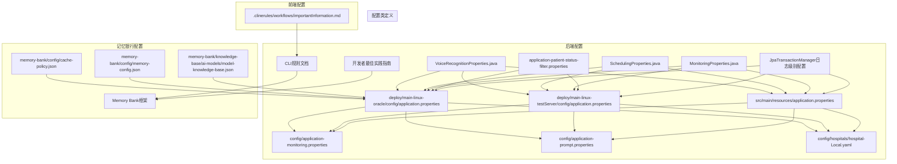
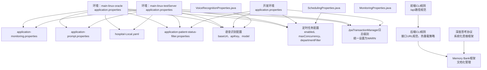
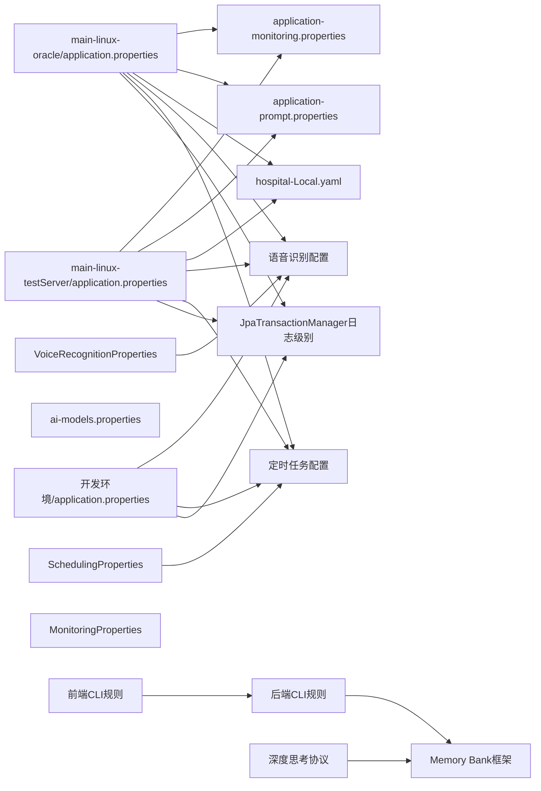

# 配置管理

<cite>
**本文引用的文件**
- [VoiceRecognitionProperties.java](file://med_ai_assistant_1.0_bs_backend/src/main/java/com/example/medaiassistant/config/VoiceRecognitionProperties.java)
- [SchedulingProperties.java](file://med_ai_assistant_1.0_bs_backend/src/main/java/com/example/medaiassistant/config/SchedulingProperties.java)
- [MonitoringProperties.java](file://med_ai_assistant_1.0_bs_backend/src/main/java/com/example/medaiassistant/config/MonitoringProperties.java)
- [application-monitoring.properties](file://med_ai_assistant_1.0_bs_backend/config/application-monitoring.properties)
- [application-prompt.properties](file://med_ai_assistant_1.0_bs_backend/config/application-prompt.properties)
- [hospital-Local.yaml](file://med_ai_assistant_1.0_bs_backend/config/hospitals/hospital-Local.yaml)
- [application.properties（main-linux-oracle）](file://med_ai_assistant_1.0_bs_backend/deploy/main-linux-oracle/config/application.properties)
- [application.properties（main-linux-testServer）](file://med_ai_assistant_1.0_bs_backend/deploy/main-linux-testServer/config/application.properties)
- [application.properties（开发环境）](file://med_ai_assistant_1.0_bs_backend/src/main/resources/application.properties)
- [application-patient-status-filter.properties](file://med_ai_assistant_1.0_bs_backend/deploy/execution-linux/config/application-patient-status-filter.properties)
- [cache-policy.json](file://med_ai_assistant_1.0_bs_backend/memory-bank/config/cache-policy.json)
- [memory-config.json](file://med_ai_assistant_1.0_bs_backend/memory-bank/config/memory-config.json)
- [model-knowledge-base.json](file://med_ai_assistant_1.0_bs_backend/memory-bank/knowledge-base/ai-models/model-knowledge-base.json)
- [2026-04-11.md](file://med_ai_assistant_1.0_bs_backend/doc/更新日志/2026-04-11.md)
- [自动执行与定时任务模块详细设计.md](file://med_ai_assistant_1.0_bs_backend/doc/系统结构/自动执行与定时任务/自动执行与定时任务模块详细设计.md)
- [SchedulingPropertiesTddTest.java](file://med_ai_assistant_1.0_bs_backend/src/test/java/com/example/medaiassistant/config/SchedulingPropertiesTddTest.java)
- [SchedulingPropertiesValidationEnhancedTest.java](file://med_ai_assistant_1.0_bs_backend/src/test/java/com/example/medaiassistant/config/SchedulingPropertiesValidationEnhancedTest.java)
- [Oracle数据库PGA内存超限错误修复-2026年03月14日.md](file://med_ai_assistant_1.0_bs_backend/doc/问题修复/Oracle数据库PGA内存超限错误修复-2026年03月14日.md)
- [调度配置模块实施清单2025-11-2.md](file://med_ai_assistant_1.0_bs_backend/doc/迭代/统一配置与稳定性提高方案/调度配置模块实施清单2025-11-2.md)
- [更新小结.md](file://更新小结.md)
- [importantInformation.md](file://.clinerules/workflows/importantInformation.md)
- [default-rules.md](file://med_ai_assistant_1.0_bs_backend/.clinerules/default-rules.md)
- [deep-thinking-protocol.md](file://med_ai_assistant_1.0_bs_backend/.clinerules/deep-thinking-protocol.md)
- [importantInformation.md（Vue前端）](file://med_ai_assistant_1.0_bs_vue/.clinerules/workflows/importantInformation.md)
</cite>

## 更新摘要
**所做更改**
- 新增定时任务配置控制（scheduling.timer.enabled配置项）章节
- 更新语音识别配置外化章节，详细说明VoiceRecognitionProperties配置类
- 新增Oracle数据库PGA内存优化配置章节
- 更新配置优先级规则，增加定时任务配置的特殊处理
- 完善配置验证与测试章节，反映新增的配置控制功能
- 新增定时任务配置的最佳实践与故障排查指导
- 新增监控配置映射类（MonitoringProperties）的详细说明
- 更新执行服务器配置章节，反映最新的统一配置管理

## 目录
1. [引言](#引言)
2. [项目结构](#项目结构)
3. [核心组件](#核心组件)
4. [架构总览](#架构总览)
5. [详细组件分析](#详细组件分析)
6. [依赖分析](#依赖分析)
7. [性能考虑](#性能考虑)
8. [故障排查指南](#故障排查指南)
9. [开发者最佳实践指南](#开发者最佳实践指南)
10. [CLI规则与配置管理集成](#cli规则与配置管理集成)
11. [结论](#结论)
12. [附录](#附录)

## 引言
本文件面向 MedAiAssistant 1.0 BS 的配置管理，系统性梳理配置的组织结构、层次关系与作用域，明确开发、测试、生产三类环境的差异化策略，给出配置参数优先级规则与敏感信息安全管理建议，并围绕数据库连接、监控参数、AI 模型、缓存等关键配置项提供说明、最佳实践与常见错误排查方法。

**更新** 本次更新重点反映了新增的定时任务配置控制、语音识别配置外化、Oracle数据库PGA内存优化等重要配置改进，进一步完善了项目的配置管理体系。

## 项目结构
MedAiAssistant 的配置主要分布在以下位置：
- 后端配置
  - config 目录：通用属性与 YAML 医院集成配置
  - deploy/<env>-<cluster>/config：按环境与集群划分的生产级配置
  - src/main/java/com/example/medaiassistant/config：Java配置类定义
- 记忆银行配置
  - memory-bank/config：缓存策略、内存与性能参数
  - memory-bank/knowledge-base/ai-models：AI 模型知识库与提示模板
- 开发资源配置
  - src/main/resources：开发环境默认配置
- CLI规则与最佳实践
  - .clinerules：开发者工作流程与最佳实践指南
  - .clinerules/workflows：具体的工作流规则
- Vue前端配置
  - med_ai_assistant_1.0_bs_vue/.clinerules：前端开发规则

下图展示配置在项目中的分布与层次关系：



**图表来源**
- [application-monitoring.properties:1-196](file://med_ai_assistant_1.0_bs_backend/config/application-monitoring.properties#L1-L196)
- [application-prompt.properties:1-32](file://med_ai_assistant_1.0_bs_backend/config/application-prompt.properties#L1-L32)
- [hospital-Local.yaml:1-38](file://med_ai_assistant_1.0_bs_backend/config/hospitals/hospital-Local.yaml#L1-L38)
- [application.properties（main-linux-oracle）:1-214](file://med_ai_assistant_1.0_bs_backend/deploy/main-linux-oracle/config/application.properties#L1-L214)
- [application.properties（main-linux-testServer）:1-193](file://med_ai_assistant_1.0_bs_backend/deploy/main-linux-testServer/config/application.properties#L1-L193)
- [VoiceRecognitionProperties.java:1-104](file://med_ai_assistant_1.0_bs_backend/src/main/java/com/example/medaiassistant/config/VoiceRecognitionProperties.java#L1-L104)
- [SchedulingProperties.java:1-885](file://med_ai_assistant_1.0_bs_backend/src/main/java/com/example/medaiassistant/config/SchedulingProperties.java#L1-L885)
- [MonitoringProperties.java:1-343](file://med_ai_assistant_1.0_bs_backend/src/main/java/com/example/medaiassistant/config/MonitoringProperties.java#L1-L343)
- [application-patient-status-filter.properties:1-49](file://med_ai_assistant_1.0_bs_backend/deploy/execution-linux/config/application-patient-status-filter.properties#L1-L49)
- [application.properties（开发环境）:1-312](file://med_ai_assistant_1.0_bs_backend/src/main/resources/application.properties#L1-L312)
- [importantInformation.md:1-2](file://.clinerules/workflows/importantInformation.md#L1-L2)
- [default-rules.md:1-115](file://med_ai_assistant_1.0_bs_backend/.clinerules/default-rules.md#L1-L115)
- [deep-thinking-protocol.md:1-499](file://med_ai_assistant_1.0_bs_backend/.clinerules/deep-thinking-protocol.md#L1-L499)
- [importantInformation.md（Vue前端）:1-2](file://med_ai_assistant_1.0_bs_vue/.clinerules/workflows/importantInformation.md#L1-L2)

**章节来源**
- [VoiceRecognitionProperties.java:1-104](file://med_ai_assistant_1.0_bs_backend/src/main/java/com/example/medaiassistant/config/VoiceRecognitionProperties.java#L1-L104)
- [SchedulingProperties.java:1-885](file://med_ai_assistant_1.0_bs_backend/src/main/java/com/example/medaiassistant/config/SchedulingProperties.java#L1-L885)
- [MonitoringProperties.java:1-343](file://med_ai_assistant_1.0_bs_backend/src/main/java/com/example/medaiassistant/config/MonitoringProperties.java#L1-L343)
- [application-monitoring.properties:1-196](file://med_ai_assistant_1.0_bs_backend/config/application-monitoring.properties#L1-L196)
- [application-prompt.properties:1-32](file://med_ai_assistant_1.0_bs_backend/config/application-prompt.properties#L1-L32)
- [hospital-Local.yaml:1-38](file://med_ai_assistant_1.0_bs_backend/config/hospitals/hospital-Local.yaml#L1-L38)
- [application.properties（main-linux-oracle）:1-214](file://med_ai_assistant_1.0_bs_backend/deploy/main-linux-oracle/config/application.properties#L1-L214)
- [application.properties（main-linux-testServer）:1-193](file://med_ai_assistant_1.0_bs_backend/deploy/main-linux-testServer/config/application.properties#L1-L193)
- [cache-policy.json:1-46](file://med_ai_assistant_1.0_bs_backend/memory-bank/config/cache-policy.json#L1-L46)
- [memory-config.json:1-32](file://med_ai_assistant_1.0_bs_backend/memory-bank/config/memory-config.json#L1-L32)
- [model-knowledge-base.json:1-121](file://med_ai_assistant_1.0_bs_backend/memory-bank/knowledge-base/ai-models/model-knowledge-base.json#L1-L121)
- [application.properties（开发环境）:1-312](file://med_ai_assistant_1.0_bs_backend/src/main/resources/application.properties#L1-L312)
- [importantInformation.md:1-2](file://.clinerules/workflows/importantInformation.md#L1-L2)
- [default-rules.md:1-115](file://med_ai_assistant_1.0_bs_backend/.clinerules/default-rules.md#L1-L115)
- [deep-thinking-protocol.md:1-499](file://med_ai_assistant_1.0_bs_backend/.clinerules/deep-thinking-protocol.md#L1-L499)
- [importantInformation.md（Vue前端）:1-2](file://med_ai_assistant_1.0_bs_vue/.clinerules/workflows/importantInformation.md#L1-L2)

## 核心组件
- 监控配置：集中于 application-monitoring.properties，涵盖启动/运行阶段阈值、告警与导出策略，支撑系统健康度与性能观测。**新增** MonitoringProperties配置类提供更精细的监控参数映射和验证。
- Prompt 服务配置：application-prompt.properties 控制提交、轮询与监控的频率、重试与超时等行为。
- 医院集成配置：hospital-Local.yaml 定义 HIS/LIS 数据源、字段映射、定时同步策略与 SQL 模板基路径。
- 应用配置（Spring Boot）：按环境拆分，main-linux-oracle 与 main-linux-testServer 提供生产与测试环境的 JPA/HikariCP/线程池/Redis/定时任务/日志等配置。
- **语音识别配置**：通过VoiceRecognitionProperties配置类实现配置外化，支持baseUrl、apiKey、model、sampleRate、format等参数的灵活配置。
- **定时任务配置**：通过SchedulingProperties配置类实现统一的调度配置管理，支持定时任务的启用/禁用控制、并发数配置、过滤模式等功能。
- **监控配置映射**：通过MonitoringProperties配置类映射现有监控配置键，避免与Actuator冲突，提供配置验证和环境变量映射功能。
- **事务日志配置**：统一设置JpaTransactionManager的日志级别为WARN，消除开发/生产/测试环境间的事务日志级别差异，提升系统可观测性。
- 记忆银行配置：cache-policy.json 与 memory-config.json 定义缓存 TTL、容量、清理与性能参数；model-knowledge-base.json 描述可用模型能力、限制与提示模板。
- **CLI规则与最佳实践**：包含开发者工作流程、接口URL规范、热重载配置等实践指南。
- **Memory Bank框架**：提供项目文档化管理的完整框架，确保开发过程中的知识传承与最佳实践执行。

**更新** 新增定时任务配置控制和Oracle数据库PGA内存优化组件，通过系统化的配置管理和性能优化，进一步完善了项目的配置管理体系。新增MonitoringProperties配置类提供更精细的监控参数管理。

**章节来源**
- [VoiceRecognitionProperties.java:1-104](file://med_ai_assistant_1.0_bs_backend/src/main/java/com/example/medaiassistant/config/VoiceRecognitionProperties.java#L1-L104)
- [SchedulingProperties.java:1-885](file://med_ai_assistant_1.0_bs_backend/src/main/java/com/example/medaiassistant/config/SchedulingProperties.java#L1-L885)
- [MonitoringProperties.java:1-343](file://med_ai_assistant_1.0_bs_backend/src/main/java/com/example/medaiassistant/config/MonitoringProperties.java#L1-L343)
- [application-monitoring.properties:1-196](file://med_ai_assistant_1.0_bs_backend/config/application-monitoring.properties#L1-L196)
- [application-prompt.properties:1-32](file://med_ai_assistant_1.0_bs_backend/config/application-prompt.properties#L1-L32)
- [hospital-Local.yaml:1-38](file://med_ai_assistant_1.0_bs_backend/config/hospitals/hospital-Local.yaml#L1-L38)
- [application.properties（main-linux-oracle）:1-214](file://med_ai_assistant_1.0_bs_backend/deploy/main-linux-oracle/config/application.properties#L1-L214)
- [application.properties（main-linux-testServer）:1-193](file://med_ai_assistant_1.0_bs_backend/deploy/main-linux-testServer/config/application.properties#L1-L193)
- [cache-policy.json:1-46](file://med_ai_assistant_1.0_bs_backend/memory-bank/config/cache-policy.json#L1-L46)
- [memory-config.json:1-32](file://med_ai_assistant_1.0_bs_backend/memory-bank/config/memory-config.json#L1-L32)
- [model-knowledge-base.json:1-121](file://med_ai_assistant_1.0_bs_backend/memory-bank/knowledge-base/ai-models/model-knowledge-base.json#L1-L121)
- [importantInformation.md:1-2](file://.clinerules/workflows/importantInformation.md#L1-L2)
- [default-rules.md:1-115](file://med_ai_assistant_1.0_bs_backend/.clinerules/default-rules.md#L1-L115)
- [deep-thinking-protocol.md:1-499](file://med_ai_assistant_1.0_bs_backend/.clinerules/deep-thinking-protocol.md#L1-L499)

## 架构总览
下图展示配置在系统中的作用域与交互关系，包括环境差异、配置导入与关键参数来源，以及CLI规则的集成。



**图表来源**
- [application.properties（main-linux-oracle）:1-214](file://med_ai_assistant_1.0_bs_backend/deploy/main-linux-oracle/config/application.properties#L1-L214)
- [application.properties（main-linux-testServer）:1-193](file://med_ai_assistant_1.0_bs_backend/deploy/main-linux-testServer/config/application.properties#L1-L193)
- [application-monitoring.properties:1-196](file://med_ai_assistant_1.0_bs_backend/config/application-monitoring.properties#L1-L196)
- [application-prompt.properties:1-32](file://med_ai_assistant_1.0_bs_backend/config/application-prompt.properties#L1-L32)
- [hospital-Local.yaml:1-38](file://med_ai_assistant_1.0_bs_backend/config/hospitals/hospital-Local.yaml#L1-L38)
- [VoiceRecognitionProperties.java:1-104](file://med_ai_assistant_1.0_bs_backend/src/main/java/com/example/medaiassistant/config/VoiceRecognitionProperties.java#L1-L104)
- [SchedulingProperties.java:1-885](file://med_ai_assistant_1.0_bs_backend/src/main/java/com/example/medaiassistant/config/SchedulingProperties.java#L1-L885)
- [MonitoringProperties.java:1-343](file://med_ai_assistant_1.0_bs_backend/src/main/java/com/example/medaiassistant/config/MonitoringProperties.java#L1-L343)
- [application-patient-status-filter.properties:1-49](file://med_ai_assistant_1.0_bs_backend/deploy/execution-linux/config/application-patient-status-filter.properties#L1-L49)
- [application.properties（开发环境）:1-312](file://med_ai_assistant_1.0_bs_backend/src/main/resources/application.properties#L1-L312)
- [importantInformation.md:1-2](file://.clinerules/workflows/importantInformation.md#L1-L2)
- [importantInformation.md（Vue前端）:1-2](file://med_ai_assistant_1.0_bs_vue/.clinerules/workflows/importantInformation.md#L1-L2)
- [default-rules.md:1-115](file://med_ai_assistant_1.0_bs_backend/.clinerules/default-rules.md#L1-L115)
- [deep-thinking-protocol.md:1-499](file://med_ai_assistant_1.0_bs_backend/.clinerules/deep-thinking-protocol.md#L1-L499)

## 详细组件分析

### 监控参数配置（application-monitoring.properties）
- 分级监控策略：区分启动阶段与正常运行阶段的阈值与时序参数，确保系统在不同生命周期具备针对性的可观测性。
- 告警与导出：定义连接泄漏、健康度、性能指标、日志错误、数据库/线程池/内存/网络等维度的阈值与间隔，并支持导出格式与保留策略。
- 使用建议
  - 开发环境可适度放宽阈值，便于调试；生产环境应严格控制告警频率与静默期，避免噪声。
  - 结合业务峰值时段调整监控间隔与保留策略，平衡存储成本与可观测性。

**章节来源**
- [application-monitoring.properties:1-196](file://med_ai_assistant_1.0_bs_backend/config/application-monitoring.properties#L1-L196)

### Prompt 服务配置（application-prompt.properties）
- 功能模块：提交、轮询、监控三大模块，分别控制任务频率、分页与批大小、最大重试与超时等。
- 参数要点：提交与轮询的间隔、页面/批次大小、最大重试次数与重试间隔、连接/读取超时等。
- 使用建议
  - 根据下游服务吞吐与稳定性调整提交/轮询间隔与重试策略。
  - 监控模块的阈值应与业务 SLA 对齐，避免过早触发告警或漏报异常。

**章节来源**
- [application-prompt.properties:1-32](file://med_ai_assistant_1.0_bs_backend/config/application-prompt.properties#L1-L32)

### 医院集成配置（hospital-Local.yaml）
- HIS/LIS 数据源：JDBC URL、用户名、密码、表前缀等。
- 同步策略：定时 Cron 表达式、是否启用、最大重试次数与重试间隔。
- 字段映射：将本地字段映射到 HIS/LIS 字段，保证数据一致性。
- SQL 模板：指定 SQL 模板基路径与覆盖清单，便于按医院定制查询。
- 使用建议
  - 密码等敏感信息应通过环境变量或外部机密管理工具注入，避免硬编码。
  - 字段映射与模板路径需与实际数据库结构与部署路径保持一致。

**章节来源**
- [hospital-Local.yaml:1-38](file://med_ai_assistant_1.0_bs_backend/config/hospitals/hospital-Local.yaml#L1-L38)

### 应用配置（Spring Boot，按环境）
- 环境划分：main-linux-oracle（生产）与 main-linux-testServer（测试）两套配置，均通过 ai-models.properties 导入模型配置。
- 关键参数
  - JPA/Hibernate：DDL 策略、方言、时区、SQL 输出控制等。
  - HikariCP：连接池大小、空闲/最大存活时间、连接超时、泄漏检测、校验超时、保活查询等。
  - 线程池与调度：全局调度线程池与专用线程池（Prompt 生成、手术分析、通用执行器）的核心/最大/队列容量与命名前缀。
  - 监控与健康：暴露端点、健康探针。
  - 服务端口与上下文路径：确保与编排暴露一致。
  - Redis：主机、端口、密码（可选）。
  - 执行服务器：统一的执行服务器地址与 Oracle 连接参数。
  - 下载目录：构建产物下载路径（宿主机挂载映射）。
  - 定时任务：每日 Prompt 生成、手术分析、中午查房记录生成的时间、最大并发与固定延迟。
  - 医院默认 ID：决定加载的医院配置。
  - 夜间同步：是否启用、启动时执行、Cron 表达式。
  - 日志：精简 Hibernate SQL 日志与数据库诊断日志级别。
  - **语音识别**：通过VoiceRecognitionProperties配置类管理baseUrl、apiKey、model、sampleRate、format等参数。
  - **定时任务**：通过SchedulingProperties配置类管理定时任务的启用/禁用、并发数、过滤模式等配置。
  - **监控配置**：通过MonitoringProperties配置类管理监控参数映射与验证。
  - **事务日志**：统一设置JpaTransactionManager日志级别为WARN，消除多环境差异。
- 环境变量注入：多处参数通过 ${VAR:default} 形式注入，便于在不同环境灵活替换。

**更新** 生产环境语音识别配置已修复，baseUrl从http://10.120.8.85:3001改为https://dashscope.aliyuncs.com/compatible-mode/v1，apiKey使用正确的阿里云DashScope API Key。同时，JpaTransactionManager日志级别已统一设置为WARN级别。定时任务配置新增enabled参数，支持定时任务的启用/禁用控制。

**章节来源**
- [application.properties（main-linux-oracle）:1-214](file://med_ai_assistant_1.0_bs_backend/deploy/main-linux-oracle/config/application.properties#L1-L214)
- [application.properties（main-linux-testServer）:1-193](file://med_ai_assistant_1.0_bs_backend/deploy/main-linux-testServer/config/application.properties#L1-L193)

### 语音识别配置（VoiceRecognitionProperties）
- **配置类定义**：VoiceRecognitionProperties通过@ConfigurationProperties(prefix = "voice.recognition")注解实现配置外化。
- **核心配置项**：
  - apiKey：ASR服务API Key，用于访问语音识别服务的认证密钥
  - model：ASR模型名称，默认值为qwen3-asr-flash，支持配置其他模型如paraformer-realtime-v2
  - baseUrl：ASR服务基础URL，默认值为阿里云百炼DashScope API地址
  - sampleRate：音频采样率，默认值为16000（16kHz）
  - format：音频格式，默认值为pcm，支持pcm、wav、mp3等格式
- **配置外化优势**：
  - 支持通过application.properties或application.yml文件进行配置
  - 可通过环境变量覆盖默认值
  - 支持不同ASR服务提供商的灵活切换
- **使用建议**：
  - 生产环境使用阿里云DashScope API，baseUrl为https://dashscope.aliyuncs.com/compatible-mode/v1
  - 开发环境可配置为院内私有模型，baseUrl为http://10.120.8.85:3001
  - API Key通过环境变量注入，避免硬编码

**更新** 语音识别配置外化已完全实现，支持多种ASR服务提供商的灵活切换，baseUrl和apiKey的配置已修复为正确的生产环境值。

**章节来源**
- [VoiceRecognitionProperties.java:1-104](file://med_ai_assistant_1.0_bs_backend/src/main/java/com/example/medaiassistant/config/VoiceRecognitionProperties.java#L1-L104)
- [application.properties（main-linux-oracle）:193-202](file://med_ai_assistant_1.0_bs_backend/deploy/main-linux-oracle/config/application.properties#L193-L202)
- [application.properties（main-linux-testServer）:179-188](file://med_ai_assistant_1.0_bs_backend/deploy/main-linux-testServer/config/application.properties#L179-L188)
- [application.properties（开发环境）:289-296](file://med_ai_assistant_1.0_bs_backend/src/main/resources/application.properties#L289-L296)

### 定时任务配置（SchedulingProperties）
- **配置类定义**：SchedulingProperties通过@ConfigurationProperties(prefix = "scheduling")注解实现统一的调度配置管理。
- **核心配置模块**：
  - **定时任务配置（TimerConfig）**：支持dailyTime、surgeryAnalysisTime、maxConcurrency、fixedDelayMinutes、enabled等参数
  - **自动执行配置（AutoExecuteConfig）**：interval、maxThreads、enabled、timezone等参数
  - **执行轮询配置（ExecutionPollingConfig）**：maxConcurrency、timeoutSeconds、concurrentEnabled、maxRetryCount等参数
  - **线程池配置**：promptGenerationPool、surgeryAnalysisPool、executor等专用线程池参数
  - **监控配置（MonitoringConfig）**：enabled、metricsInterval、alertEmails、warningThreshold、criticalThreshold等参数
- **新增功能**：
  - **定时任务启用/禁用控制**：通过enabled参数控制定时任务的整体启用状态
  - **科室过滤功能**：支持departmentFilterEnabled和targetDepartments配置
  - **配置验证**：完整的参数验证机制，确保配置的有效性
  - **配置摘要**：提供详细的配置摘要信息，便于调试和监控
- **配置外化优势**：
  - 支持通过application.properties或application.yml文件进行配置
  - 可通过环境变量覆盖默认值
  - 支持不同环境的差异化配置
- **使用建议**：
  - 生产环境建议启用定时任务，测试环境可根据需要禁用
  - 科室过滤功能适用于多科室部署场景
  - 配置验证失败时会抛出异常，便于及时发现问题

**新增** 详细介绍SchedulingProperties配置类及其配置项，反映定时任务配置控制的重要改进。

**章节来源**
- [SchedulingProperties.java:1-885](file://med_ai_assistant_1.0_bs_backend/src/main/java/com/example/medaiassistant/config/SchedulingProperties.java#L1-L885)
- [调度配置模块实施清单2025-11-2.md:19-168](file://med_ai_assistant_1.0_bs_backend/doc/迭代/统一配置与稳定性提高方案/调度配置模块实施清单2025-11-2.md#L19-L168)
- [SchedulingPropertiesTddTest.java:117-248](file://med_ai_assistant_1.0_bs_backend/src/test/java/com/example/medaiassistant/config/SchedulingPropertiesTddTest.java#L117-L248)
- [SchedulingPropertiesValidationEnhancedTest.java:99-189](file://med_ai_assistant_1.0_bs_backend/src/test/java/com/example/medaiassistant/config/SchedulingPropertiesValidationEnhancedTest.java#L99-L189)

### scheduling.timer.enabled 配置项详解

#### 配置项说明
- **配置键**：`scheduling.timer.enabled`
- **配置类型**：布尔类型（boolean）
- **默认值**：开发环境为 `false`，生产环境为 `true`
- **作用范围**：控制所有定时Prompt生成任务的启用状态
- **配置位置**：
  - 开发环境：`src/main/resources/application.properties`（第151行）
  - 生产环境：`deploy/main-linux-oracle/config/application.properties`（通过环境变量覆盖）

#### 功能特性
- **全局控制**：通过单一配置项控制所有定时任务的启用状态
- **环境差异化**：开发环境默认禁用，生产环境默认启用
- **优雅降级**：禁用状态下定时任务直接返回，不执行任何操作
- **调试友好**：开发环境禁用可避免定时任务对开发调试造成干扰

#### 配置示例
```properties
# 开发环境禁用定时任务
scheduling.timer.enabled=false

# 生产环境启用定时任务
scheduling.timer.enabled=true
```

#### 实现机制
定时任务方法在执行前检查配置状态：
```java
@Scheduled(cron = "${scheduling.timer.daily-time:0 0 7 * * *}")
public void dailyPromptGeneration() {
    // 检查定时任务是否启用
    if (!schedulingProperties.getTimer().isEnabled()) {
        System.out.println("定时Prompt生成任务已禁用，跳过执行每日Prompt生成");
        return;
    }
    // 执行定时任务逻辑...
}
```

#### 使用场景
- **开发调试**：禁用定时任务避免频繁的数据生成影响调试
- **测试环境**：可根据需要禁用或启用定时任务
- **生产环境**：默认启用确保系统功能正常运行
- **紧急停机**：临时禁用定时任务避免系统负载过高

**新增** 详细介绍scheduling.timer.enabled配置项的完整实现，包括配置语法、默认值、实现机制和使用场景。

**章节来源**
- [2026-04-11.md:34-44](file://med_ai_assistant_1.0_bs_backend/doc/更新日志/2026-04-11.md#L34-L44)
- [application.properties（开发环境）:150-151](file://med_ai_assistant_1.0_bs_backend/src/main/resources/application.properties#L150-L151)
- [TimerPromptGenerator.java:594-599](file://med_ai_assistant_1.0_bs_backend/src/main/java/com/example/medaiassistant/service/TimerPromptGenerator.java#L594-L599)
- [TimerPromptGenerator.java:1844-1848](file://med_ai_assistant_1.0_bs_backend/src/main/java/com/example/medaiassistant/service/TimerPromptGenerator.java#L1844-L1848)

### 监控配置映射（MonitoringProperties）
- **配置类定义**：MonitoringProperties通过@ConfigurationProperties(prefix = "monitoring")注解实现监控配置的映射管理。
- **核心配置模块**：
  - **启动阶段配置（StartupPhase）**：启动超时、最大启动重试次数、详细日志开关等
  - **正常运行阶段配置（NormalPhase）**：监控间隔、健康检查超时、自动恢复开关等
  - **告警配置（AlertPhase）**：连接泄漏告警阈值、健康度阈值、告警通道等
  - **指标监控配置（MetricsPhase）**：指标收集间隔、数据保留天数、存储类型等
  - **数据库监控配置（DatabaseMonitoringPhase）**：连接池检查间隔、慢查询阈值、死锁检查等
- **配置验证**：提供完整的配置参数验证机制，确保监控配置的有效性
- **环境变量映射**：支持环境变量映射，便于自动化部署
- **配置摘要**：提供监控配置摘要信息，便于日志记录和调试

**新增** 详细介绍MonitoringProperties配置类及其配置项，提供更精细的监控参数管理。

**章节来源**
- [MonitoringProperties.java:1-343](file://med_ai_assistant_1.0_bs_backend/src/main/java/com/example/medaiassistant/config/MonitoringProperties.java#L1-L343)

### AI 模型配置
- 模型导入：main-linux-oracle 的 application.properties 通过 spring.config.import 引入 ai-models.properties。
- 配置内容：全局流式输出开关、公有云模型（DeepSeek Chat/Reasoner）的 URL、Key、连接/读取超时；院内模型（inHospitalDeepseek）的 URL、Key、超时。
- 使用建议
  - 优先使用内网模型以降低延迟与带宽消耗；公有云模型作为备用。
  - API Key 通过环境变量注入，避免将密钥写入仓库。

**章节来源**
- [application.properties（main-linux-oracle）:19-21](file://med_ai_assistant_1.0_bs_backend/deploy/main-linux-oracle/config/application.properties#L19-L21)
- [application.properties（main-linux-testServer）:20](file://med_ai_assistant_1.0_bs_backend/deploy/main-linux-testServer/config/application.properties#L20)

### Oracle数据库配置优化
- **PGA内存调整**：将pga_aggregate_limit从4G降至2G，解决Free版本内存限制问题
- **内存使用监控**：定期检查V$PROCESS视图监控高内存占用会话
- **预防措施**：
  - 分批插入大批量数据
  - 及时释放LOB字段数据
  - 合理配置HikariCP连接池参数
- **问题诊断**：通过V$SESSION和V$PROCESS视图分析BG00等后台进程的内存占用情况

**更新** 新增Oracle数据库PGA内存调整配置优化章节，反映数据库配置优化的重要改进。

**章节来源**
- [Oracle数据库PGA内存超限错误修复-2026年03月14日.md:1-173](file://med_ai_assistant_1.0_bs_backend/doc/问题修复/Oracle数据库PGA内存超限错误修复-2026年03月14日.md#L1-L173)
- [application.properties（main-linux-oracle）:39-45](file://med_ai_assistant_1.0_bs_backend/deploy/main-linux-oracle/config/application.properties#L39-L45)

### JpaTransactionManager日志级别标准化
- **统一配置**：版本0.7.009中修复了开发/生产/测试环境下JpaTransactionManager反复输出DEBUG事务日志的问题，统一设置为WARN级别。
- **配置位置**：
  - 生产环境：logging.level.org.springframework.orm.jpa.JpaTransactionManager=WARN
  - 测试环境：logging.level.org.springframework.orm.jpa.JpaTransactionManager=WARN
  - 开发环境：logging.level.org.springframework.orm.jpa.JpaTransactionManager=WARN
- **配置效果**：
  - 消除多环境间的事务日志级别差异
  - 减少不必要的DEBUG日志输出，提升系统性能
  - 统一事务日志的可观测性标准
- **使用建议**：
  - 在生产环境中保持WARN级别，避免过多日志干扰
  - 如需调试事务问题，可通过临时调整日志级别进行问题定位
  - 结合其他事务相关日志（如org.springframework.transaction）进行综合分析

**更新** 详细介绍JpaTransactionManager日志级别标准化的重要改进，反映版本0.7.009中的关键配置优化。

**章节来源**
- [application.properties（main-linux-oracle）:188](file://med_ai_assistant_1.0_bs_backend/deploy/main-linux-oracle/config/application.properties#L188)
- [application.properties（main-linux-testServer）:174](file://med_ai_assistant_1.0_bs_backend/deploy/main-linux-testServer/config/application.properties#L174)
- [application.properties（开发环境）:87](file://med_ai_assistant_1.0_bs_backend/src/main/resources/application.properties#L87)
- [更新小结.md:11-13](file://更新小结.md#L11-L13)

### 记忆银行配置
- 缓存策略（cache-policy.json）
  - 默认 TTL、最大缓存大小、逐出策略（LRU）、压缩与加密开关。
  - 针对不同类型缓存（患者数据、AI 响应、会话数据）的独立 TTL、容量与优先级。
  - 监控（命中/缺失阈值）、清理（间隔与批量大小）、并发读写与超时。
- 内存与性能（memory-config.json）
  - 最大内存使用量、清理阈值与间隔、缓存/知识库/日志/备份开关。
  - 不同数据类型的保留天数、监控阈值与性能参数（并发操作、IO 线程、缓冲区大小）。
- 模型知识库（model-knowledge-base.json）
  - 可用模型的能力、限制与最佳实践，温度范围、最大 Token、支持语言。
  - 提示模板（诊断分析、治疗推荐、异步回调处理）与变量。
  - 系统组件（异步回调控制器）的功能、端点与响应格式。
  - 医疗领域分类。

**更新** Memory Bank框架提供了完整的项目文档化管理结构，包括核心文件、附加上下文和工作流程，确保开发过程中的知识传承。

**章节来源**
- [cache-policy.json:1-46](file://med_ai_assistant_1.0_bs_backend/memory-bank/config/cache-policy.json#L1-L46)
- [memory-config.json:1-32](file://med_ai_assistant_1.0_bs_backend/memory-bank/config/memory-config.json#L1-L32)
- [model-knowledge-base.json:1-121](file://med_ai_assistant_1.0_bs_backend/memory-bank/knowledge-base/ai-models/model-knowledge-base.json#L1-L121)
- [default-rules.md:1-115](file://med_ai_assistant_1.0_bs_backend/.clinerules/default-rules.md#L1-L115)

### 执行服务器配置
- **统一配置管理**：通过execution.server.*配置键实现执行服务器的统一配置管理。
- **核心配置项**：
  - host：执行服务器主机地址
  - oracle-port：Oracle数据库端口
  - oracle-sid：Oracle数据库实例标识
  - oracle-username：Oracle数据库用户名
  - oracle-password：Oracle数据库密码
  - url：执行服务器HTTP地址
- **向后兼容**：支持旧的execution.server.ip和execution.server.url配置键，保持向后兼容性。
- **配置外化**：支持通过环境变量覆盖，便于不同环境的灵活配置。

**新增** 详细介绍执行服务器配置的统一管理，反映最新的配置优化。

**章节来源**
- [application.properties（main-linux-oracle）:87-95](file://med_ai_assistant_1.0_bs_backend/deploy/main-linux-oracle/config/application.properties#L87-L95)
- [application.properties（main-linux-testServer）:85-93](file://med_ai_assistant_1.0_bs_backend/deploy/main-linux-testServer/config/application.properties#L85-L93)
- [application.properties（开发环境）:109-120](file://med_ai_assistant_1.0_bs_backend/src/main/resources/application.properties#L109-L120)

## 依赖分析
- 配置导入链
  - main-linux-oracle 的 application.properties 通过 spring.config.import 导入 ai-models.properties。
  - 两个环境的 application.properties 均被引入监控、Prompt 与医院配置。
  - **语音识别配置**通过VoiceRecognitionProperties配置类实现统一管理。
  - **定时任务配置**通过SchedulingProperties配置类实现统一管理。
  - **监控配置映射**通过MonitoringProperties配置类实现统一管理。
  - **事务日志配置**通过统一的日志级别设置消除多环境差异。
  - **CLI规则**通过Memory Bank框架进行文档化管理。
- 环境差异
  - main-linux-oracle：生产环境，日志更偏向诊断级别，定时任务与同步策略更严格。
  - main-linux-testServer：测试环境，日志相对宽松，夜间同步可在启动时执行。
  - **开发环境**：提供默认配置，支持快速开发和测试。
- 参数耦合
  - 医院默认 ID 与 hospital-Local.yaml 的 ID 保持一致，确保正确加载配置。
  - 执行服务器参数与 Oracle 连接参数需与部署环境一致。
  - **语音识别配置**通过配置类实现松耦合，支持灵活的服务提供商切换。
  - **定时任务配置**通过配置类实现统一管理，支持启用/禁用控制和参数验证。
  - **监控配置映射**通过配置类实现参数映射和验证，避免与Actuator冲突。
  - **事务日志配置**通过统一级别设置，确保多环境间的一致性。
  - **CLI规则**通过Memory Bank框架确保开发流程的一致性。



**图表来源**
- [application.properties（main-linux-oracle）:1-214](file://med_ai_assistant_1.0_bs_backend/deploy/main-linux-oracle/config/application.properties#L1-L214)
- [application.properties（main-linux-testServer）:1-193](file://med_ai_assistant_1.0_bs_backend/deploy/main-linux-testServer/config/application.properties#L1-L193)
- [application-monitoring.properties:1-196](file://med_ai_assistant_1.0_bs_backend/config/application-monitoring.properties#L1-L196)
- [application-prompt.properties:1-32](file://med_ai_assistant_1.0_bs_backend/config/application-prompt.properties#L1-L32)
- [hospital-Local.yaml:1-38](file://med_ai_assistant_1.0_bs_backend/config/hospitals/hospital-Local.yaml#L1-L38)
- [VoiceRecognitionProperties.java:1-104](file://med_ai_assistant_1.0_bs_backend/src/main/java/com/example/medaiassistant/config/VoiceRecognitionProperties.java#L1-L104)
- [SchedulingProperties.java:1-885](file://med_ai_assistant_1.0_bs_backend/src/main/java/com/example/medaiassistant/config/SchedulingProperties.java#L1-L885)
- [MonitoringProperties.java:1-343](file://med_ai_assistant_1.0_bs_backend/src/main/java/com/example/medaiassistant/config/MonitoringProperties.java#L1-L343)
- [application.properties（开发环境）:1-312](file://med_ai_assistant_1.0_bs_backend/src/main/resources/application.properties#L1-L312)
- [importantInformation.md:1-2](file://.clinerules/workflows/importantInformation.md#L1-L2)
- [importantInformation.md（Vue前端）:1-2](file://med_ai_assistant_1.0_bs_vue/.clinerules/workflows/importantInformation.md#L1-L2)
- [default-rules.md:1-115](file://med_ai_assistant_1.0_bs_backend/.clinerules/default-rules.md#L1-L115)
- [deep-thinking-protocol.md:1-499](file://med_ai_assistant_1.0_bs_backend/.clinerules/deep-thinking-protocol.md#L1-L499)

**章节来源**
- [application.properties（main-linux-oracle）:1-214](file://med_ai_assistant_1.0_bs_backend/deploy/main-linux-oracle/config/application.properties#L1-L214)
- [application.properties（main-linux-testServer）:1-193](file://med_ai_assistant_1.0_bs_backend/deploy/main-linux-testServer/config/application.properties#L1-L193)
- [application-monitoring.properties:1-196](file://med_ai_assistant_1.0_bs_backend/config/application-monitoring.properties#L1-L196)
- [application-prompt.properties:1-32](file://med_ai_assistant_1.0_bs_backend/config/application-prompt.properties#L1-L32)
- [hospital-Local.yaml:1-38](file://med_ai_assistant_1.0_bs_backend/config/hospitals/hospital-Local.yaml#L1-L38)
- [VoiceRecognitionProperties.java:1-104](file://med_ai_assistant_1.0_bs_backend/src/main/java/com/example/medaiassistant/config/VoiceRecognitionProperties.java#L1-L104)
- [SchedulingProperties.java:1-885](file://med_ai_assistant_1.0_bs_backend/src/main/java/com/example/medaiassistant/config/SchedulingProperties.java#L1-L885)
- [MonitoringProperties.java:1-343](file://med_ai_assistant_1.0_bs_backend/src/main/java/com/example/medaiassistant/config/MonitoringProperties.java#L1-L343)
- [application.properties（开发环境）:1-312](file://med_ai_assistant_1.0_bs_backend/src/main/resources/application.properties#L1-L312)
- [importantInformation.md:1-2](file://.clinerules/workflows/importantInformation.md#L1-L2)
- [importantInformation.md（Vue前端）:1-2](file://med_ai_assistant_1.0_bs_vue/.clinerules/workflows/importantInformation.md#L1-L2)
- [default-rules.md:1-115](file://med_ai_assistant_1.0_bs_backend/.clinerules/default-rules.md#L1-L115)
- [deep-thinking-protocol.md:1-499](file://med_ai_assistant_1.0_bs_backend/.clinerules/deep-thinking-protocol.md#L1-L499)

## 性能考虑
- 数据库连接池
  - 合理设置最大池大小、空闲/最大存活时间与连接超时，避免高并发下的连接争用与超时。
  - 泄漏检测阈值与校验超时应根据业务峰值与网络状况调整。
  - **Oracle数据库优化**：通过调整PGA内存限制解决内存超限问题，确保数据库稳定运行。
- 线程池与调度
  - 专用线程池（Prompt 生成、手术分析）与通用执行器的队列容量与命名前缀有助于隔离与定位性能瓶颈。
  - 定时任务的执行时间与并发数应与下游服务能力匹配。
  - **定时任务配置优化**：通过enabled参数控制定时任务的启用状态，避免不必要的资源消耗。
- 缓存与内存
  - cache-policy.json 与 memory-config.json 的 TTL、容量与清理策略直接影响内存占用与访问性能。
  - 压缩与加密开关需权衡 CPU 开销与安全需求。
- 监控与日志
  - 在生产环境开启诊断日志的同时，应控制日志级别与导出频率，避免对性能造成影响。
  - **事务日志优化**：通过统一JpaTransactionManager日志级别为WARN，减少不必要的DEBUG日志输出，提升系统性能。
- **语音识别性能**
  - 通过配置外化支持不同ASR服务提供商，可根据网络状况和成本选择最优方案。
  - 合理设置采样率和音频格式以平衡识别精度与传输效率。
- **CLI规则性能影响**
  - Memory Bank框架通过系统化的文档化管理，减少重复劳动，提升开发效率。
  - 深度思考协议确保复杂问题的系统化分析，避免性能陷阱。

**更新** 新增定时任务配置优化和Oracle数据库PGA内存调整的性能考虑，反映配置管理对系统性能的重要影响。

## 故障排查指南
- 数据库连接问题
  - 现象：连接超时、连接泄漏告警、查询性能异常。
  - 排查：检查 HikariCP 参数（最大池大小、连接超时、泄漏检测阈值）与 Oracle 驱动超时配置；核对 ai-models.properties 中模型 URL 与 Key。
  - **Oracle数据库问题**：检查PGA内存使用情况，必要时调整pga_aggregate_limit参数。
  - 参考参数
    - HikariCP：maximum-pool-size、connection-timeout、leak-detection-threshold、validation-timeout
    - Oracle 超时：CONNECT_TIMEOUT、READ_TIMEOUT
    - 模型配置：ai.models.<model>.url、ai.models.<model>.key、connectTimeout、readTimeout
    - **Oracle PGA内存**：pga_aggregate_limit、pga_aggregate_target
- 监控告警频繁
  - 现象：连接泄漏、健康度、线程池使用率、内存/GC、API 响应时间/错误率等告警频繁。
  - 排查：调整 application-monitoring.properties 中的阈值与间隔；核对生产/测试环境的日志级别与导出策略。
  - **监控配置验证**：检查MonitoringProperties配置类的验证结果，确保配置参数有效。
- Prompt 服务异常
  - 现象：提交/轮询失败、队列积压、超时。
  - 排查：检查 application-prompt.properties 的间隔、重试、超时与页面/批次大小；确认下游服务可用性。
- 医院集成失败
  - 现象：同步失败、字段映射不一致、SQL 模板未生效。
  - 排查：核对 hospital-Local.yaml 的 JDBC URL、用户名/密码、表前缀、字段映射与 SQL 模板基路径；确认定时 Cron 与重试策略。
- 缓存与内存问题
  - 现象：缓存命中率低、内存占用过高、清理不及时。
  - 排查：调整 cache-policy.json 与 memory-config.json 的 TTL、容量、清理间隔与批量大小；评估压缩与加密策略对性能的影响。
- **语音识别问题**
  - 现象：语音识别返回500错误、识别结果不准确。
  - 排查：检查VoiceRecognitionProperties配置，确认baseUrl、apiKey、model等参数正确；验证ASR服务可用性和网络连通性。
  - **生产环境修复**：确认baseUrl已从http://10.120.8.85:3001改为https://dashscope.aliyuncs.com/compatible-mode/v1，apiKey为正确的阿里云DashScope API Key。
- **定时任务问题**
  - 现象：定时任务不执行、执行异常、并发冲突。
  - 排查：检查SchedulingProperties配置，确认enabled参数设置正确；验证maxConcurrency、dailyTime等参数；查看定时任务日志。
  - **配置验证**：确认配置参数通过validateConfiguration()方法验证，避免无效配置导致的任务异常。
  - **开发环境禁用**：确认开发环境的scheduling.timer.enabled=false配置正确，避免定时任务干扰开发调试。
- **事务日志问题**
  - 现象：事务日志过多或过少，影响系统性能或可观测性。
  - 排查：检查JpaTransactionManager日志级别配置，确认已统一设置为WARN级别；如需调试事务问题，可临时调整日志级别。
  - **版本改进**：确认版本0.7.009中已修复多环境间事务日志级别不一致的问题。
- **执行服务器问题**
  - 现象：执行服务器连接失败、响应超时。
  - 排查：检查execution.server.*配置参数，确认主机地址、端口、SID、用户名、密码正确；验证网络连通性和防火墙设置。
- **CLI规则问题**
  - 现象：接口URL重复"/api"、热重载配置不当导致开发效率低下。
  - 排查：检查CLI规则文档，确认接口URL生成逻辑正确；验证热重载配置与手动重启策略的执行。

**更新** 新增定时任务配置故障排查指导和执行服务器配置故障排查，反映新增的配置控制功能对系统稳定性的影响。

**章节来源**
- [application.properties（main-linux-oracle）:1-214](file://med_ai_assistant_1.0_bs_backend/deploy/main-linux-oracle/config/application.properties#L1-L214)
- [application.properties（main-linux-testServer）:1-193](file://med_ai_assistant_1.0_bs_backend/deploy/main-linux-testServer/config/application.properties#L1-L193)
- [application-monitoring.properties:1-196](file://med_ai_assistant_1.0_bs_backend/config/application-monitoring.properties#L1-L196)
- [application-prompt.properties:1-32](file://med_ai_assistant_1.0_bs_backend/config/application-prompt.properties#L1-L32)
- [hospital-Local.yaml:1-38](file://med_ai_assistant_1.0_bs_backend/config/hospitals/hospital-Local.yaml#L1-L38)
- [cache-policy.json:1-46](file://med_ai_assistant_1.0_bs_backend/memory-bank/config/cache-policy.json#L1-L46)
- [memory-config.json:1-32](file://med_ai_assistant_1.0_bs_backend/memory-bank/config/memory-config.json#L1-L32)
- [VoiceRecognitionProperties.java:1-104](file://med_ai_assistant_1.0_bs_backend/src/main/java/com/example/medaiassistant/config/VoiceRecognitionProperties.java#L1-L104)
- [SchedulingProperties.java:1-885](file://med_ai_assistant_1.0_bs_backend/src/main/java/com/example/medaiassistant/config/SchedulingProperties.java#L1-L885)
- [MonitoringProperties.java:1-343](file://med_ai_assistant_1.0_bs_backend/src/main/java/com/example/medaiassistant/config/MonitoringProperties.java#L1-L343)
- [Oracle数据库PGA内存超限错误修复-2026年03月14日.md:1-173](file://med_ai_assistant_1.0_bs_backend/doc/问题修复/Oracle数据库PGA内存超限错误修复-2026年03月14日.md#L1-L173)
- [application-patient-status-filter.properties:1-49](file://med_ai_assistant_1.0_bs_backend/deploy/execution-linux/config/application-patient-status-filter.properties#L1-L49)
- [importantInformation.md:1-2](file://.clinerules/workflows/importantInformation.md#L1-L2)
- [importantInformation.md（Vue前端）:1-2](file://med_ai_assistant_1.0_bs_vue/.clinerules/workflows/importantInformation.md#L1-L2)

## 开发者最佳实践指南

### Memory Bank框架
- **核心文件结构**：项目基础文件（projectbrief.md）、产品上下文（productContext.md）、活动上下文（activeContext.md）、系统模式（systemPatterns.md）、技术上下文（techContext.md）、进度跟踪（progress.md）。
- **文档化管理**：通过Memory Bank框架确保开发过程中的知识传承，所有变更都必须更新相关文档。
- **工作流程**：Plan Mode（计划模式）和Act Mode（执行模式）双模式工作流程，确保开发过程的系统化和规范化。

### CLI规则最佳实践
- **接口URL规范**：基础API已有"/api"前缀，生成接口URL时避免重复添加"/api"，防止URL路径错误。
- **热重载配置**：系统支持热重载，开发人员需要在必要时手动重启，确保配置变更生效。
- **开发效率**：通过CLI规则减少重复性工作，提升开发效率和代码质量。

### 深度思考协议
- **系统化思维**：提供完整的思考框架，包括初始接触、问题空间探索、假设生成、发现过程、验证和错误纠正等阶段。
- **质量控制**：通过系统化的验证和质量控制机制，确保开发决策的正确性和完整性。
- **适应性分析**：根据不同问题的复杂度和紧急程度，调整分析深度和方法。

**更新** 详细介绍Memory Bank框架、CLI规则最佳实践和深度思考协议，为开发者提供系统化的开发指导。

**章节来源**
- [default-rules.md:1-115](file://med_ai_assistant_1.0_bs_backend/.clinerules/default-rules.md#L1-L115)
- [deep-thinking-protocol.md:1-499](file://med_ai_assistant_1.0_bs_backend/.clinerules/deep-thinking-protocol.md#L1-L499)
- [importantInformation.md:1-2](file://.clinerules/workflows/importantInformation.md#L1-L2)
- [importantInformation.md（Vue前端）:1-2](file://med_ai_assistant_1.0_bs_vue/.clinerules/workflows/importantInformation.md#L1-L2)

## CLI规则与配置管理集成

### 集成架构
- **后端CLI规则**：通过Memory Bank框架管理，确保开发流程的一致性和文档化。
- **前端CLI规则**：专门针对Vue前端开发的URL规范，避免"/api"路径重复。
- **深度思考协议**：作为系统化思维框架，指导复杂配置问题的分析和解决。

### 配置管理流程
- **规则制定**：通过CLI规则文档明确开发规范和最佳实践。
- **执行监控**：Memory Bank框架确保规则的有效执行和文档化。
- **持续改进**：深度思考协议促进开发过程的反思和优化。

### 开发效率提升
- **减少重复劳动**：通过系统化的规则和流程，避免重复性工作。
- **提升代码质量**：通过深度思考协议确保复杂问题的正确分析和解决。
- **知识传承**：Memory Bank框架确保团队知识的有效传承。

**更新** 详细介绍CLI规则与配置管理的集成，展示如何通过系统化的规则和流程提升开发效率和代码质量。

**章节来源**
- [default-rules.md:1-115](file://med_ai_assistant_1.0_bs_backend/.clinerules/default-rules.md#L1-L115)
- [deep-thinking-protocol.md:1-499](file://med_ai_assistant_1.0_bs_backend/.clinerules/deep-thinking-protocol.md#L1-L499)
- [importantInformation.md:1-2](file://.clinerules/workflows/importantInformation.md#L1-L2)
- [importantInformation.md（Vue前端）:1-2](file://med_ai_assistant_1.0_bs_vue/.clinerules/workflows/importantInformation.md#L1-L2)

## 结论
MedAiAssistant 的配置体系采用"环境分层 + 组件细分"的组织方式，通过 Spring Boot 的配置导入机制实现模型配置的集中管理，辅以 JSON/Properties 文件对缓存、内存与 AI 模型知识库进行精细化控制。**最新的配置优化**包括语音识别配置外化、定时任务配置控制、生产环境配置修复、数据库配置优化、JpaTransactionManager日志级别标准化以及监控配置映射类的引入，进一步提升了系统的灵活性、稳定性和安全性。

**更新** 本次更新重点体现了配置管理的持续改进：通过VoiceRecognitionProperties实现语音识别配置外化，通过SchedulingProperties实现定时任务配置控制，通过MonitoringProperties实现监控配置映射，通过修复生产环境baseUrl和apiKey解决了语音识别服务问题，通过Oracle数据库PGA内存调整优化了数据库性能，通过JpaTransactionManager日志级别标准化消除了多环境间的配置差异。**新增的CLI规则与Memory Bank框架**进一步完善了项目的配置管理体系，通过系统化的开发者最佳实践指南和深度思考协议，确保开发过程的规范化和高效化。

建议在开发、测试、生产三类环境中遵循统一的优先级与安全策略，确保配置变更可追溯、敏感信息受控、性能与稳定性兼顾。同时，充分利用CLI规则和Memory Bank框架，提升开发效率和代码质量。

## 附录

### 环境与配置优先级规则（建议）
- 层级顺序（从高到低）
  1) 环境变量（${VAR:default} 注入）
  2) 环境专属配置（main-linux-oracle 或 main-linux-testServer）
  3) 通用配置（config/application-*.properties/yaml）
  4) 外部导入（spring.config.import 引入的 ai-models.properties）
  5) **配置类默认值**（VoiceRecognitionProperties、SchedulingProperties、MonitoringProperties等Java配置类）
  6) **CLI规则与最佳实践**（Memory Bank框架和深度思考协议）
- 说明
  - 环境变量可用于覆盖任何配置项，便于在不同部署场景快速切换。
  - 环境专属配置用于承载与部署环境强相关的参数（如执行服务器地址、端口、下载目录等）。
  - 通用配置用于跨环境共享的参数（如监控、Prompt 服务）。
  - 外部导入文件用于集中管理模型配置，避免在主配置中重复定义。
  - **配置类默认值**提供合理的缺省配置，支持通过配置文件或环境变量进行覆盖。
  - **CLI规则与最佳实践**通过Memory Bank框架确保开发流程的一致性和规范化。

**更新** 新增CLI规则与最佳实践的优先级说明，反映Memory Bank框架在配置管理中的重要地位。

### 敏感信息安全管理
- 原则
  - 密钥与密码一律通过环境变量注入，不在仓库中保存明文。
  - 使用外部机密管理工具（如 KMS/Secrets Manager）统一管理密钥轮换与访问权限。
- 建议
  - 对缓存与内存配置中的加密开关进行统一评估，确保在满足合规要求的前提下平衡性能。
  - 定期审计配置文件与环境变量，移除不再使用的密钥与临时凭据。
  - **语音识别配置**：API Key通过环境变量注入，避免硬编码到配置文件中。
  - **定时任务配置**：通过enabled参数控制定时任务的启用状态，避免不必要的资源消耗。
  - **监控配置映射**：通过MonitoringProperties配置类提供配置验证，确保监控参数的有效性。
  - **事务日志配置**：保持JpaTransactionManager日志级别为WARN，避免敏感信息泄露。
  - **CLI规则管理**：通过Memory Bank框架确保敏感信息处理的规范性和可追溯性。

**更新** 新增定时任务配置、监控配置映射和CLI规则在安全管理方面的考虑，强调Memory Bank框架在敏感信息管理中的作用。

### 关键配置项一览（用途与作用范围）
- 数据库连接
  - HikariCP 参数：maximum-pool-size、minimum-idle、connection-timeout、idle-timeout、max-lifetime、leak-detection-threshold、validation-timeout、keepalive-time、connection-test-query、initialization-fail-timeout
  - Oracle 驱动超时：oracle.net.CONNECT_TIMEOUT、oracle.net.READ_TIMEOUT
  - 模型配置：ai.models.<model>.url、ai.models.<model>.key、connectTimeout、readTimeout
  - **Oracle PGA内存**：pga_aggregate_limit、pga_aggregate_target、sga_target、sga_max_size
- 监控参数
  - 启动/运行阶段阈值与间隔、告警阈值与静默期、导出格式与保留策略
  - **监控配置映射**：startup.*、normal.*、alert.*、metrics.*、database.*配置键映射
- AI 模型
  - 流式输出开关、模型 URL/Key、超时配置
- 缓存与内存
  - TTL、容量、逐出策略、压缩与加密开关、清理策略与性能参数
- Prompt 服务
  - 提交/轮询间隔、分页/批次大小、最大重试与重试间隔、连接/读取超时
- 医院集成
  - HIS/LIS JDBC、字段映射、定时同步 Cron、SQL 模板基路径
- **语音识别**
  - **baseUrl**：ASR服务基础URL，支持阿里云DashScope和院内私有模型
  - **apiKey**：ASR服务API Key，通过环境变量注入
  - **model**：ASR模型名称，默认qwen3-asr-flash
  - **sampleRate**：音频采样率，默认16000Hz
  - **format**：音频格式，默认pcm
- **定时任务**
  - **enabled**：定时任务启用/禁用控制，默认true
  - **maxConcurrency**：最大并发数，默认5
  - **dailyTime**：每日任务执行时间，默认0 0 7 * * *
  - **surgeryAnalysisTime**：手术分析任务执行时间，默认0 0 8 * * *
  - **departmentFilterEnabled**：科室过滤启用状态，默认false
  - **targetDepartments**：目标科室列表，默认空列表
  - **scheduling.timer.enabled**：开发环境默认false，生产环境默认true
- **监控配置映射**
  - **startup.phase**：启动阶段配置，包括启动超时、最大启动重试次数、详细日志
  - **normal.phase**：正常运行阶段配置，包括监控间隔、健康检查超时、自动恢复
  - **alert.phase**：告警配置，包括连接泄漏告警阈值、健康度阈值、告警通道
  - **metrics.phase**：指标监控配置，包括指标收集间隔、数据保留天数、存储类型
  - **database.phase**：数据库监控配置，包括连接池检查间隔、慢查询阈值、死锁检查
- **事务日志**
  - **JpaTransactionManager**：统一设置为WARN级别，消除多环境差异
  - **Spring事务**：org.springframework.transaction=WARN，配合JpaTransactionManager统一日志级别
- **执行服务器**
  - **host**：执行服务器主机地址
  - **oracle-port**：Oracle数据库端口
  - **oracle-sid**：Oracle数据库实例标识
  - **oracle-username**：Oracle数据库用户名
  - **oracle-password**：Oracle数据库密码
  - **url**：执行服务器HTTP地址
- **CLI规则与Memory Bank**
  - **接口URL规范**：避免"/api"重复，确保URL路径正确性
  - **热重载配置**：系统支持热重载，必要时手动重启
  - **开发流程**：Plan Mode和Act Mode双模式工作流程
  - **深度思考协议**：系统化问题分析和解决框架

**更新** 新增定时任务配置、监控配置映射、执行服务器配置和Oracle数据库PGA内存优化配置项，全面反映最新的配置管理优化成果。