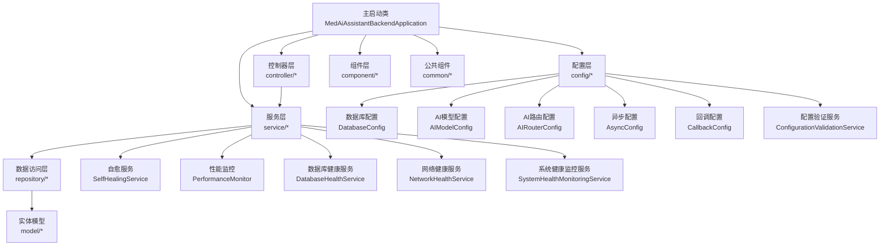
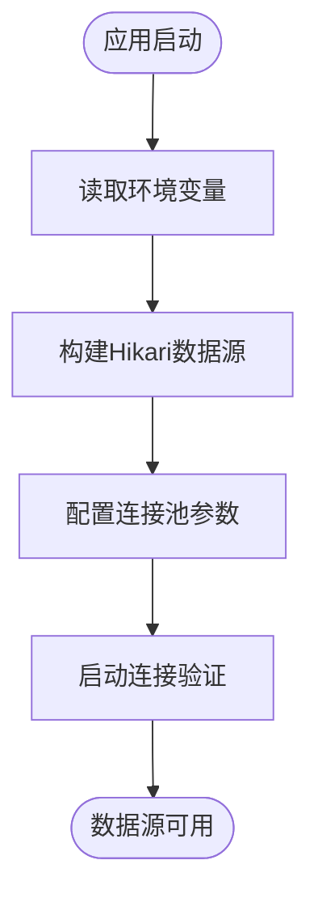
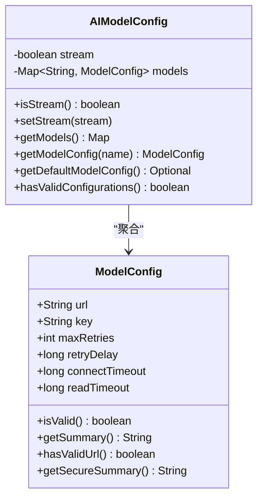
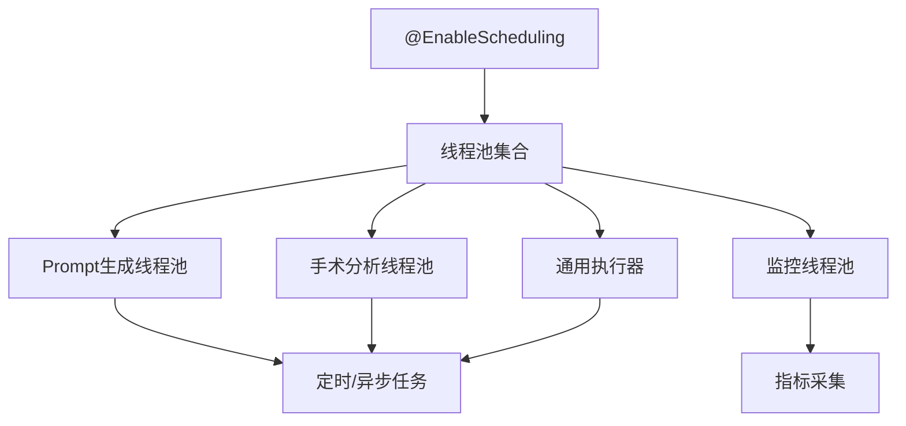
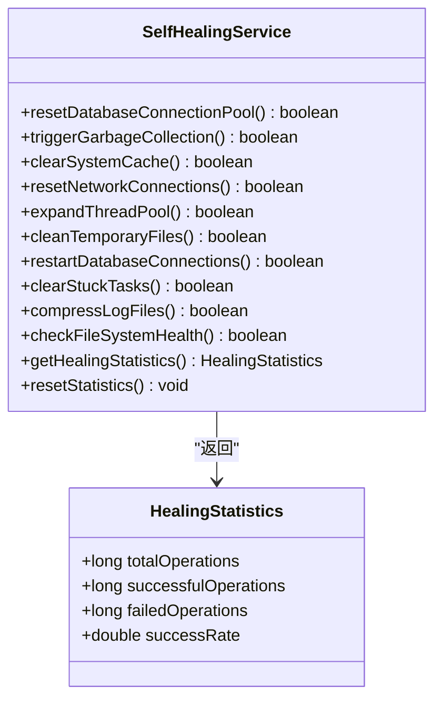
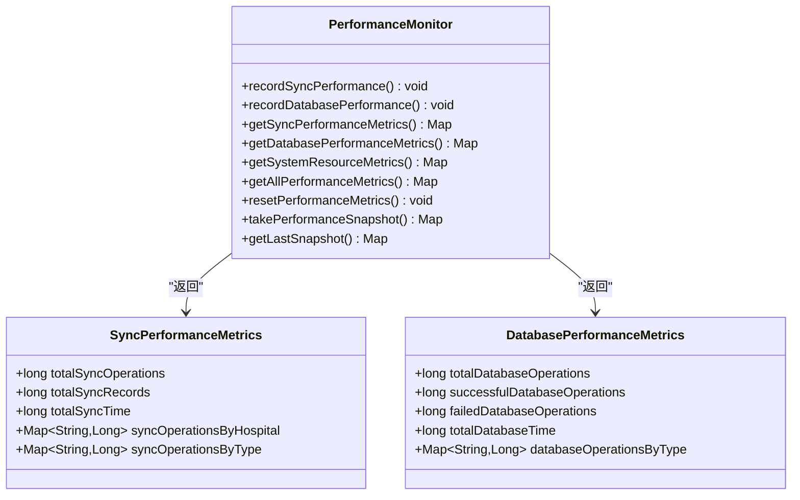
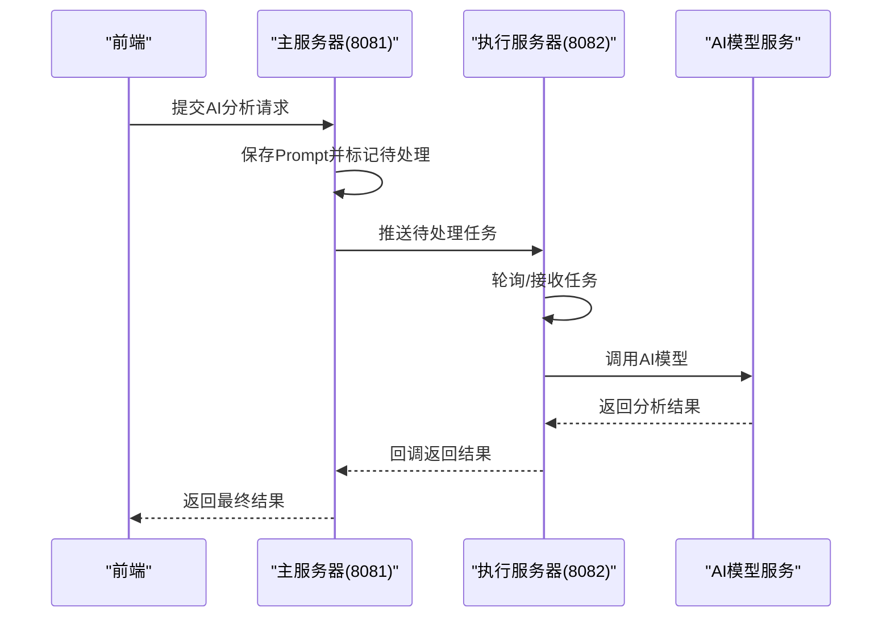
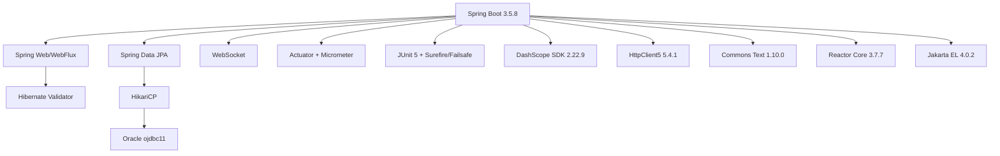

# 项目概述

<cite>
**本文引用的文件**
- [pom.xml](file://med_ai_assistant_1.0_bs_backend/pom.xml)
- [MedAiAssistantBackendApplication.java](file://med_ai_assistant_1.0_bs_backend/src/main/java/com/example/medaiassistant/MedAiAssistantBackendApplication.java)
- [HomeController.java](file://med_ai_assistant_1.0_bs_backend/src/main/java/com/example/medaiassistant/HomeController.java)
- [README.md（部署总览）](file://med_ai_assistant_1.0_bs_backend/deploy/README.md)
- [README.md（主服务器 Linux+Oracle）](file://med_ai_assistant_1.0_bs_backend/deploy/main-linux-oracle/README.md)
- [README.md（执行服务器 Windows）](file://med_ai_assistant_1.0_bs_backend/deploy/execution-windows/README.md)
- [README.md（项目主文档）](file://med_ai_assistant_1.0_bs_backend/doc/其他/README.md)
- [DatabaseConfig.java](file://med_ai_assistant_1.0_bs_backend/src/main/java/com/example/medaiassistant/config/DatabaseConfig.java)
- [AIModelConfig.java](file://med_ai_assistant_1.0_bs_backend/src/main/java/com/example/medaiassistant/config/AIModelConfig.java)
- [AIRouterConfig.java](file://med_ai_assistant_1.0_bs_backend/src/main/java/com/example/medaiassistant/config/AIRouterConfig.java)
- [AsyncConfig.java](file://med_ai_assistant_1.0_bs_backend/src/main/java/com/example/medaiassistant/config/AsyncConfig.java)
- [CallbackConfig.java](file://med_ai_assistant_1.0_bs_backend/src/main/java/com/example/medaiassistant/config/CallbackConfig.java)
- [ConfigurationValidationService.java](file://med_ai_assistant_1.0_bs_backend/src/main/java/com/example/medaiassistant/config/ConfigurationValidationService.java)
- [DepartmentFilterConfigValidator.java](file://med_ai_assistant_1.0_bs_backend/src/main/java/com/example/medaiassistant/config/DepartmentFilterConfigValidator.java)
- [SelfHealingService.java](file://med_ai_assistant_1.0_bs_backend/src/main/java/com/example/medaiassistant/service/SelfHealingService.java)
- [PerformanceMonitor.java](file://med_ai_assistant_1.0_bs_backend/src/main/java/com/example/medaiassistant/service/PerformanceMonitor.java)
- [DatabaseHealthService.java](file://med_ai_assistant_1.0_bs_backend/src/main/java/com/example/medaiassistant/service/DatabaseHealthService.java)
- [NetworkHealthService.java](file://med_ai_assistant_1.0_bs_backend/src/main/java/com/example/medaiassistant/service/NetworkHealthService.java)
- [SystemHealthMonitoringService.java](file://med_ai_assistant_1.0_bs_backend/src/main/java/com/example/medaiassistant/service/SystemHealthMonitoringService.java)
- [TaskSchedulerConfig.java](file://med_ai_assistant_1.0_bs_backend/src/main/java/com/example/medaiassistant/config/TaskSchedulerConfig.java)
- [ARCHITECTURE_DIAGRAMS.md](file://med_ai_assistant_1.0_bs_backend/doc/其他/ARCHITECTURE_DIAGRAMS.md)
</cite>

## 更新摘要
**所做更改**
- 新增了系统自愈服务和健康监控机制
- 增强了性能监控和指标收集能力
- 完善了数据库和网络健康检查功能
- 添加了系统维护和优化相关的监控指标
- 更新了系统稳定性和可用性保障机制

## 目录
1. [引言](#引言)
2. [项目结构](#项目结构)
3. [核心组件](#核心组件)
4. [架构总览](#架构总览)
5. [详细组件分析](#详细组件分析)
6. [依赖分析](#依赖分析)
7. [性能考量](#性能考量)
8. [故障排查指南](#故障排查指南)
9. [结论](#结论)
10. [附录](#附录)

## 引言
MedAiAssistant 1.0 BS 医疗AI助手后端系统是一个基于 Spring Boot 的智能医疗信息系统，面向医疗机构提供"主服务器 + 执行服务器"的分离式部署方案。系统通过 AI 辅助诊断、患者数据管理、实时监控与异步任务调度等能力，为临床决策提供智能化支撑。系统支持 Windows/Linux 多平台部署，并通过 Docker 容器化实现快速上线与运维；数据库方面既可对接 Oracle（生产环境），也可灵活切换至 MySQL/H2 等，满足不同阶段需求。系统还具备加密传输、回调重试、连接池优化、指标监控等工程化特性，兼顾安全性与可运维性。

**更新** 系统现已集成了全面的系统维护和优化机制，包括自愈服务、健康监控、性能监控等能力，显著提升了系统的稳定性和可用性。新增的数据库健康检查、网络健康监控和系统健康指标监控为生产环境提供了强有力的支持。

## 项目结构
后端采用标准的 Spring Boot 分层架构，核心目录包括：
- config：集中管理数据库、AI 模型、异步任务、回调等配置
- controller：对外提供 REST 接口（如 AI、患者、用户、检查/化验结果等）
- dto/model/repository：数据传输对象、实体与数据访问层
- component：系统组件和启动监听器
- common：公共组件和服务
- service：系统服务层，包含健康监控和自愈功能
- 顶层主启动类负责组件扫描与定时任务启用



**图表来源**
- [MedAiAssistantBackendApplication.java:26-47](file://med_ai_assistant_1.0_bs_backend/src/main/java/com/example/medaiassistant/MedAiAssistantBackendApplication.java#L26-L47)
- [README.md（项目主文档）:24-75](file://med_ai_assistant_1.0_bs_backend/doc/其他/README.md#L24-L75)
- [SelfHealingService.java:18-439](file://med_ai_assistant_1.0_bs_backend/src/main/java/com/example/medaiassistant/service/SelfHealingService.java#L18-L439)
- [PerformanceMonitor.java:24-282](file://med_ai_assistant_1.0_bs_backend/src/main/java/com/example/medaiassistant/service/PerformanceMonitor.java#L24-L282)

**章节来源**
- [README.md（项目主文档）:24-75](file://med_ai_assistant_1.0_bs_backend/doc/其他/README.md#L24-L75)
- [MedAiAssistantBackendApplication.java:26-47](file://med_ai_assistant_1.0_bs_backend/src/main/java/com/example/medaiassistant/MedAiAssistantBackendApplication.java#L26-L47)

## 核心组件
- 主服务器（端口 8081）：负责 API 网关、用户与患者管理、AI Prompt 创建与结果查询、任务调度与健康检查等
- 执行服务器（端口 8082）：负责 AI 模型调用、耗时任务执行、数据处理与回调返回
- 数据库：支持 Oracle（生产）、MySQL（开发/测试）、H2（测试）
- 缓存：Redis（容器化部署，用于会话/临时数据）
- 安全：AES 加密传输（可选）、回调重试、参数校验与日志审计
- 监控：Actuator + Micrometer + Prometheus，暴露运行指标
- 实时通信：WebSocket + WebFlux，支持双向实时数据交换
- 配置管理：AI路由配置、配置验证服务、部门过滤器配置验证
- **新增** 自愈服务：自动修复数据库连接池、触发垃圾回收、清理临时文件等
- **新增** 健康监控：数据库健康检查、网络健康监控、系统健康指标监控
- **新增** 性能监控：同步性能指标、数据库性能指标、系统资源指标

**更新** 新增了完整的系统维护和优化机制，包括自愈服务、健康监控和性能监控，显著提升了系统的稳定性和可维护性。

**章节来源**
- [README.md（部署总览）:42-62](file://med_ai_assistant_1.0_bs_backend/deploy/README.md#L42-L62)
- [README.md（主服务器 Linux+Oracle）:1-396](file://med_ai_assistant_1.0_bs_backend/deploy/main-linux-oracle/README.md#L1-L396)
- [README.md（执行服务器 Windows）:1-469](file://med_ai_assistant_1.0_bs_backend/deploy/execution-windows/README.md#L1-L469)
- [SelfHealingService.java:18-439](file://med_ai_assistant_1.0_bs_backend/src/main/java/com/example/medaiassistant/service/SelfHealingService.java#L18-L439)
- [DatabaseHealthService.java:21-269](file://med_ai_assistant_1.0_bs_backend/src/main/java/com/example/medaiassistant/service/DatabaseHealthService.java#L21-L269)
- [NetworkHealthService.java:20-194](file://med_ai_assistant_1.0_bs_backend/src/main/java/com/example/medaiassistant/service/NetworkHealthService.java#L20-L194)
- [SystemHealthMonitoringService.java:32-425](file://med_ai_assistant_1.0_bs_backend/src/main/java/com/example/medaiassistant/service/SystemHealthMonitoringService.java#L32-L425)

## 架构总览
系统采用"主服务器 + 执行服务器"双节点分离架构，主服务器负责对外服务与调度，执行服务器专注 AI 与重任务处理。两者通过 HTTP 推送/回调模式通信，Redis 作为中间缓存，Oracle 作为生产数据库。新增的自愈服务、健康监控和性能监控机制确保了系统的可维护性和稳定性。

```mermaid
graph TB
subgraph "前端"
FE["前端应用"]
end
subgraph "主服务器"
GW["API网关<br/>8081"]
CTRL["控制器层"]
SVC["服务层"]
CFG["配置中心<br/>DB/AI/Async/Callback"]
HOME["首页控制器<br/>HomeController"]
ENDPOINTS["监控端点<br/>Actuator"]
HEALTH["健康监控服务"]
PERF["性能监控服务"]
SELF["自愈服务"]
end
subgraph "执行服务器"
EXE_GW["执行网关<br/>8082"]
EXE_SVC["执行服务"]
POLL["轮询服务"]
WS["WebSocket服务"]
WF["WebFlux服务"]
DB_HEALTH["数据库健康服务"]
NET_HEALTH["网络健康服务"]
SYS_HEALTH["系统健康监控服务"]
end
subgraph "基础设施"
REDIS["Redis 缓存"]
ORA["Oracle 数据库"]
AI["AI 模型服务"]
AIR["AI路由配置"]
CVS["配置验证服务"]
DFV["部门过滤验证"]
END
FE --> GW
GW --> HOME
HOME --> CTRL
CTRL --> SVC
SVC --> CFG
CFG --> AIR
CFG --> CVS
CFG --> DFV
CFG --> REDIS
CFG --> ORA
SVC --> EXE_GW
EXE_GW --> EXE_SVC
EXE_SVC --> AI
EXE_SVC --> POLL
EXE_SVC --> WS
EXE_SVC --> WF
EXE_SVC --> DB_HEALTH
EXE_SVC --> NET_HEALTH
EXE_SVC --> SYS_HEALTH
HEALTH --> DB_HEALTH
HEALTH --> NET_HEALTH
HEALTH --> SYS_HEALTH
PERF --> SVC
SELF --> SVC
POLL --> EXE_GW
WS --> FE
WF --> FE
```

**图表来源**
- [README.md（部署总览）:42-62](file://med_ai_assistant_1.0_bs_backend/deploy/README.md#L42-L62)
- [ARCHITECTURE_DIAGRAMS.md:5-60](file://med_ai_assistant_1.0_bs_backend/doc/其他/ARCHITECTURE_DIAGRAMS.md#L5-L60)
- [HomeController.java](file://med_ai_assistant_1.0_bs_backend/src/main/java/com/example/medaiassistant/HomeController.java)
- [SelfHealingService.java:18-439](file://med_ai_assistant_1.0_bs_backend/src/main/java/com/example/medaiassistant/service/SelfHealingService.java#L18-L439)
- [PerformanceMonitor.java:24-282](file://med_ai_assistant_1.0_bs_backend/src/main/java/com/example/medaiassistant/service/PerformanceMonitor.java#L24-L282)

**章节来源**
- [README.md（部署总览）:42-62](file://med_ai_assistant_1.0_bs_backend/deploy/README.md#L42-L62)
- [ARCHITECTURE_DIAGRAMS.md:5-60](file://med_ai_assistant_1.0_bs_backend/doc/其他/ARCHITECTURE_DIAGRAMS.md#L5-L60)

## 详细组件分析

### 数据库配置（DatabaseConfig）
- 使用 HikariCP 连接池，针对 Oracle 进行专项优化（连接超时、空闲超时、最大生命周期、保活、泄漏检测、验证查询等）
- 支持多属性命名方式（兼容主/执行服务器配置差异）
- 启动时进行基础连接验证，失败不阻塞应用启动
- Hibernate 属性统一为 Oracle 方言，禁用自动生成 DDL，开启批量与查询优化



**图表来源**
- [DatabaseConfig.java:103-210](file://med_ai_assistant_1.0_bs_backend/src/main/java/com/example/medaiassistant/config/DatabaseConfig.java#L103-L210)

**章节来源**
- [DatabaseConfig.java:31-269](file://med_ai_assistant_1.0_bs_backend/src/main/java/com/example/medaiassistant/config/DatabaseConfig.java#L31-L269)

### AI 模型配置（AIModelConfig）
- 支持多模型配置，统一前缀 ai.*
- 每个模型包含 URL、密钥、连接/读取超时、最大重试次数、初始重试延迟等
- 提供配置有效性校验、默认模型选择、安全摘要输出等能力
- 通过 Optional 与日志增强 API 设计与可观测性



**图表来源**
- [AIModelConfig.java:29-399](file://med_ai_assistant_1.0_bs_backend/src/main/java/com/example/medaiassistant/config/AIModelConfig.java#L29-L399)

**章节来源**
- [AIModelConfig.java:29-399](file://med_ai_assistant_1.0_bs_backend/src/main/java/com/example/medaiassistant/config/AIModelConfig.java#L29-L399)

### AI 路由配置（AIRouterConfig）
- **新增** 支持多AI模型的智能路由选择
- 基于负载均衡和模型性能的动态路由策略
- 支持模型健康检查和故障转移机制
- 提供路由配置的热更新和监控能力

**章节来源**
- [AIRouterConfig.java](file://med_ai_assistant_1.0_bs_backend/src/main/java/com/example/medaiassistant/config/AIRouterConfig.java)

### 异步任务与线程池（AsyncConfig）
- 专用线程池：Prompt 生成、手术分析、通用任务、监控
- 拒绝策略统一为 CallerRunsPolicy，保证在高负载下仍能逐步处理
- 支持优雅关闭与超时等待，避免任务丢失
- 与 @EnableAsync 结合，为定时任务与异步调用提供稳定执行环境



**图表来源**
- [AsyncConfig.java:20-144](file://med_ai_assistant_1.0_bs_backend/src/main/java/com/example/medaiassistant/config/AsyncConfig.java#L20-L144)

**章节来源**
- [AsyncConfig.java:20-144](file://med_ai_assistant_1.0_bs_backend/src/main/java/com/example/medaiassistant/config/AsyncConfig.java#L20-L144)

### 回调与重试（CallbackConfig）
- 支持最大重试次数、重试间隔、回调超时、默认回调地址、启用开关
- 与 Spring Retry 配合，实现异步回调的可靠投递
- 通过配置化参数，适配不同网络环境与下游系统能力

**章节来源**
- [CallbackConfig.java:14-95](file://med_ai_assistant_1.0_bs_backend/src/main/java/com/example/medaiassistant/config/CallbackConfig.java#L14-L95)

### 配置验证服务（ConfigurationValidationService）
- **新增** 全面的配置验证机制
- 支持AI模型配置、数据库配置、缓存配置的实时验证
- 提供配置变更的热验证和回滚机制
- 集成部门过滤器配置验证，确保医疗数据的安全性

**章节来源**
- [ConfigurationValidationService.java](file://med_ai_assistant_1.0_bs_backend/src/main/java/com/example/medaiassistant/config/ConfigurationValidationService.java)

### 部门过滤配置验证器（DepartmentFilterConfigValidator）
- **新增** 医疗部门数据过滤的专门验证器
- 支持基于部门权限的数据访问控制
- 提供配置错误的详细诊断信息
- 确保敏感医疗数据的安全访问

**章节来源**
- [DepartmentFilterConfigValidator.java](file://med_ai_assistant_1.0_bs_backend/src/main/java/com/example/medaiassistant/config/DepartmentFilterConfigValidator.java)

### 自愈服务（SelfHealingService）
- **新增** 全面的系统自愈能力
- 支持数据库连接池重置、垃圾回收触发、系统缓存清理
- 提供网络连接重置、临时文件清理、日志文件压缩
- 包含完整的操作统计和健康检查功能
- 支持文件系统健康检查和卡住任务清理



**图表来源**
- [SelfHealingService.java:18-439](file://med_ai_assistant_1.0_bs_backend/src/main/java/com/example/medaiassistant/service/SelfHealingService.java#L18-L439)

**章节来源**
- [SelfHealingService.java:18-439](file://med_ai_assistant_1.0_bs_backend/src/main/java/com/example/medaiassistant/service/SelfHealingService.java#L18-L439)

### 性能监控（PerformanceMonitor）
- **新增** 全面的性能监控能力
- 支持同步性能指标、数据库性能指标、系统资源指标
- 提供性能快照和指标重置功能
- 支持按医院和操作类型分类统计



**图表来源**
- [PerformanceMonitor.java:24-282](file://med_ai_assistant_1.0_bs_backend/src/main/java/com/example/medaiassistant/service/PerformanceMonitor.java#L24-L282)

**章节来源**
- [PerformanceMonitor.java:24-282](file://med_ai_assistant_1.0_bs_backend/src/main/java/com/example/medaiassistant/service/PerformanceMonitor.java#L24-L282)

### 数据库健康服务（DatabaseHealthService）
- **新增** 专业的数据库健康监控
- 支持连接池监控、健康检查和自动恢复功能
- 提供详细的健康统计信息和推荐重试策略
- 支持连接池重置和健康状态判断

**章节来源**
- [DatabaseHealthService.java:21-269](file://med_ai_assistant_1.0_bs_backend/src/main/java/com/example/medaiassistant/service/DatabaseHealthService.java#L21-L269)

### 网络健康服务（NetworkHealthService）
- **新增** 网络状态监控和统计功能
- 支持网络请求结果记录和延迟统计
- 提供健康状态判断和重试策略建议
- 支持执行服务器健康检查

**章节来源**
- [NetworkHealthService.java:20-194](file://med_ai_assistant_1.0_bs_backend/src/main/java/com/example/medaiassistant/service/NetworkHealthService.java#L20-L194)

### 系统健康监控服务（SystemHealthMonitoringService）
- **新增** 系统级健康指标监控
- 支持JVM内存、线程、垃圾回收、磁盘空间监控
- 提供数据库连接健康检查和系统负载监控
- 支持健康告警和阈值配置

**章节来源**
- [SystemHealthMonitoringService.java:32-425](file://med_ai_assistant_1.0_bs_backend/src/main/java/com/example/medaiassistant/service/SystemHealthMonitoringService.java#L32-L425)

### 主/执行服务器部署与通信
- 主服务器（8081）：API 网关、任务调度、健康检查、Redis 缓存、首页控制器
- 执行服务器（8082）：AI 调用、数据处理、轮询服务、回调返回、WebSocket服务
- 通信方式：主推执行拉（轮询）+ 回调返回
- 部署方式：Docker Compose（Linux/Windows），支持一键构建/启动/停止/日志查看



**图表来源**
- [ARCHITECTURE_DIAGRAMS.md:185-232](file://med_ai_assistant_1.0_bs_backend/doc/其他/ARCHITECTURE_DIAGRAMS.md#L185-L232)
- [README.md（部署总览）:42-62](file://med_ai_assistant_1.0_bs_backend/deploy/README.md#L42-L62)

**章节来源**
- [README.md（部署总览）:15-62](file://med_ai_assistant_1.0_bs_backend/deploy/README.md#L15-L62)
- [README.md（主服务器 Linux+Oracle）:124-210](file://med_ai_assistant_1.0_bs_backend/deploy/main-linux-oracle/README.md#L124-L210)
- [README.md（执行服务器 Windows）:116-200](file://med_ai_assistant_1.0_bs_backend/deploy/execution-windows/README.md#L116-L200)

## 依赖分析
- 技术栈：Spring Boot 3.5.8、Java 21、Spring Data JPA、WebFlux、WebSocket、Micrometer + Prometheus、Actuator、HikariCP、Oracle ojdbc11、Argon2-JVM、Lombok、Hibernate Validator、Jackson JSR310、Spring Retry、DevTools
- 依赖管理：Maven Profile 区分主服务器与执行服务器，仓库指向本地 lib 与阿里云镜像
- 并行测试：Surefire/Failsafe 配置，支持 JUnit 5 并行执行与集成测试
- **新增** DashScope SDK Java 2.22.9，支持阿里巴巴通义千问模型
- **新增** Apache HttpClient5 5.4.1，增强HTTP客户端功能
- **新增** Apache Commons Text 1.10.0，提供字符串相似度计算功能
- **新增** Reactor Core 3.7.7，支持响应式编程
- **新增** Jakarta EL 4.0.2，提供表达式语言支持



**图表来源**
- [pom.xml:53-214](file://med_ai_assistant_1.0_bs_backend/pom.xml#L53-L214)

**章节来源**
- [pom.xml:29-52](file://med_ai_assistant_1.0_bs_backend/pom.xml#L29-L52)
- [pom.xml:216-232](file://med_ai_assistant_1.0_bs_backend/pom.xml#L216-L232)
- [pom.xml:241-306](file://med_ai_assistant_1.0_bs_backend/pom.xml#L241-L306)

## 性能考量
- 连接池优化：HikariCP 参数精细化配置，降低连接泄漏与空闲断开风险
- 数据库方言与批处理：统一使用 Oracle 方言，开启批量插入/更新与 fetch-size 优化
- 异步与线程池：专用线程池隔离不同任务类型，拒绝策略保障系统稳定
- 监控与指标：Actuator + Prometheus 暴露 JVM 与应用指标，便于容量与性能评估
- 超时与重试：AI 模型与回调均配置合理超时与重试，提升可靠性
- **新增** WebSocket和WebFlux支持，提供低延迟的实时数据交换能力
- **新增** AI路由配置，支持智能负载均衡和故障转移
- **新增** 自愈服务，提供自动化的系统维护和修复能力
- **新增** 健康监控，实时监控数据库、网络和系统健康状态
- **新增** 性能监控，全面收集和分析系统性能指标

**章节来源**
- [DatabaseConfig.java:173-264](file://med_ai_assistant_1.0_bs_backend/src/main/java/com/example/medaiassistant/config/DatabaseConfig.java#L173-L264)
- [AsyncConfig.java:37-142](file://med_ai_assistant_1.0_bs_backend/src/main/java/com/example/medaiassistant/config/AsyncConfig.java#L37-L142)
- [AIModelConfig.java:108-224](file://med_ai_assistant_1.0_bs_backend/src/main/java/com/example/medaiassistant/config/AIModelConfig.java#L108-L224)
- [SelfHealingService.java:64-98](file://med_ai_assistant_1.0_bs_backend/src/main/java/com/example/medaiassistant/service/SelfHealingService.java#L64-L98)
- [PerformanceMonitor.java:68-99](file://med_ai_assistant_1.0_bs_backend/src/main/java/com/example/medaiassistant/service/PerformanceMonitor.java#L68-L99)

## 故障排查指南
- 容器启动失败：检查端口占用、容器日志、环境变量配置
- 数据库连接失败：验证主机/端口/服务名/凭据、防火墙与网络连通性
- 内存不足：调整 JVM 参数、增加 Docker 资源限制、查看容器资源使用
- 执行服务器轮询未启动：检查轮询配置、服务状态端点、日志输出
- AI 模型调用失败：核对 API 密钥、网络连通性、超时设置
- **新增** 自愈服务异常：检查自愈操作统计、健康检查日志、系统资源状态
- **新增** 健康监控告警：查看数据库健康状态、网络连接状态、系统负载指标
- **新增** 性能监控异常：检查性能指标收集、快照功能、重置机制
- **新增** AI路由配置错误：检查路由规则、模型健康状态、负载均衡配置
- **新增** 配置验证失败：查看配置验证服务日志、确认配置格式正确性
- **新增** WebSocket连接异常：检查实时通信配置、防火墙设置、客户端兼容性

**章节来源**
- [README.md（部署总览）:209-230](file://med_ai_assistant_1.0_bs_backend/deploy/README.md#L209-L230)
- [README.md（主服务器 Linux+Oracle）:282-346](file://med_ai_assistant_1.0_bs_backend/deploy/main-linux-oracle/README.md#L282-L346)
- [README.md（执行服务器 Windows）:282-410](file://med_ai_assistant_1.0_bs_backend/deploy/execution-windows/README.md#L282-L410)
- [SelfHealingService.java:39-59](file://med_ai_assistant_1.0_bs_backend/src/main/java/com/example/medaiassistant/service/SelfHealingService.java#L39-L59)
- [DatabaseHealthService.java:81-120](file://med_ai_assistant_1.0_bs_backend/src/main/java/com/example/medaiassistant/service/DatabaseHealthService.java#L81-L120)
- [NetworkHealthService.java:130-148](file://med_ai_assistant_1.0_bs_backend/src/main/java/com/example/medaiassistant/service/NetworkHealthService.java#L130-L148)

## 结论
MedAiAssistant 1.0 BS 后端系统以 Spring Boot 为基础，结合分离式主/执行服务器架构、完善的配置体系与工程化能力，为医疗机构提供可扩展、可运维、可监控的智能医疗解决方案。通过 Docker 容器化与多平台部署支持，系统可在 Windows/Linux 上快速落地；通过 AI 模型配置、异步任务与回调重试机制，系统在复杂业务场景下保持高可靠与高性能。

**更新** 系统现已发展为高度自动化的智能医疗平台，集成了全面的系统维护和优化机制。新增的自愈服务、健康监控、性能监控和配置验证等能力显著提升了系统的稳定性、可维护性和用户体验。通过智能化的故障检测和自动修复机制，系统能够在生产环境中提供更加可靠和高效的医疗服务支持。

## 附录
- 快速开始：选择部署场景（主服务器/执行服务器），准备 Docker 与环境变量，执行部署脚本，查看健康检查与日志
- 更新部署：构建新镜像，加载镜像，重启服务；或修改配置后重启容器
- 安全建议：修改默认密码与密钥、限制网络访问、启用 HTTPS、定期备份
- **新增** 配置管理：使用配置验证服务确保配置正确性，定期检查AI路由配置的有效性
- **新增** 实时通信：利用WebSocket和WebFlux实现实时数据交换，提升用户体验
- **新增** 系统维护：定期检查自愈服务运行状态，监控健康指标，分析性能报告
- **新增** 故障处理：利用健康监控告警，快速定位问题根因，执行相应的自愈操作

**章节来源**
- [README.md（部署总览）:63-208](file://med_ai_assistant_1.0_bs_backend/deploy/README.md#L63-L208)
- [README.md（主服务器 Linux+Oracle）:124-280](file://med_ai_assistant_1.0_bs_backend/deploy/main-linux-oracle/README.md#L124-L280)
- [README.md（执行服务器 Windows）:116-280](file://med_ai_assistant_1.0_bs_backend/deploy/execution-windows/README.md#L116-L280)
- [SelfHealingService.java:395-413](file://med_ai_assistant_1.0_bs_backend/src/main/java/com/example/medaiassistant/service/SelfHealingService.java#L395-L413)
- [PerformanceMonitor.java:205-222](file://med_ai_assistant_1.0_bs_backend/src/main/java/com/example/medaiassistant/service/PerformanceMonitor.java#L205-L222)