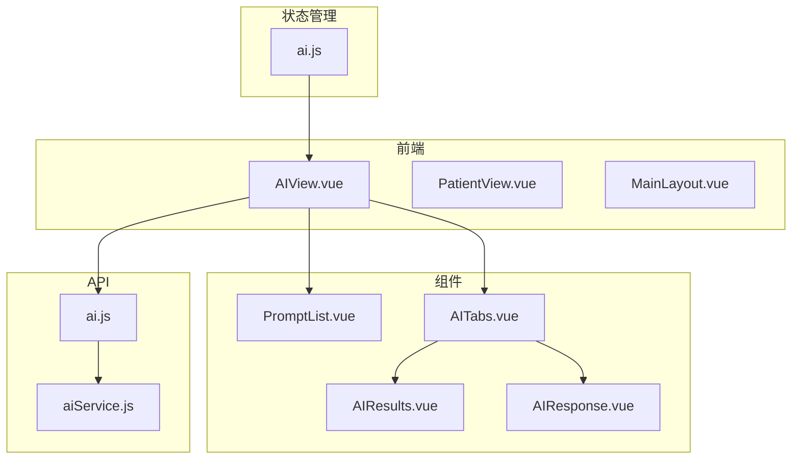
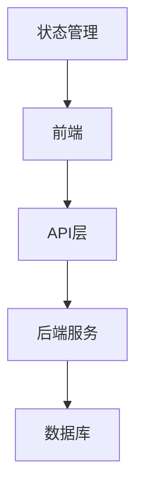
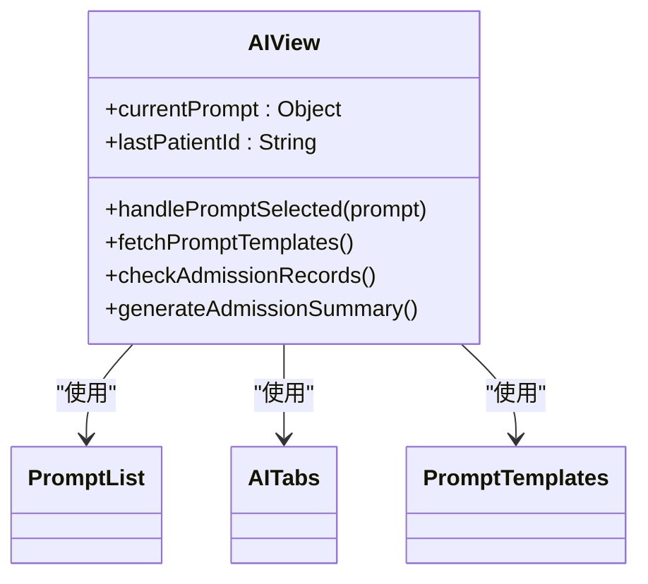
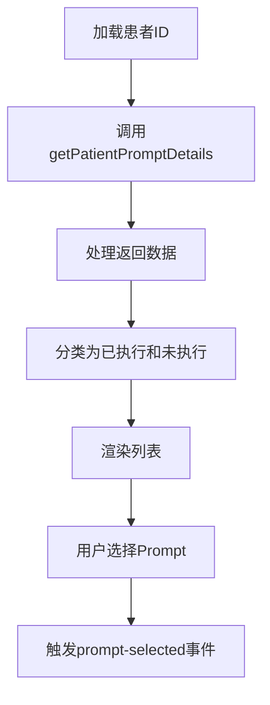
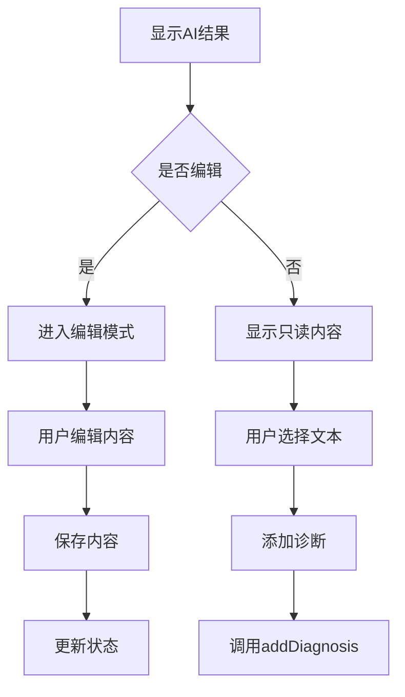
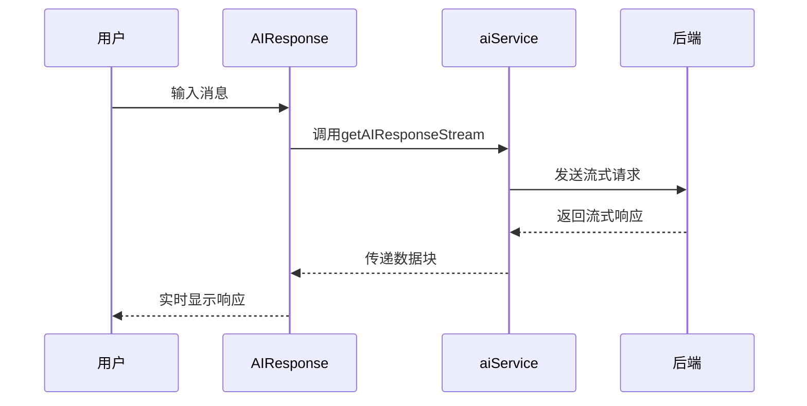
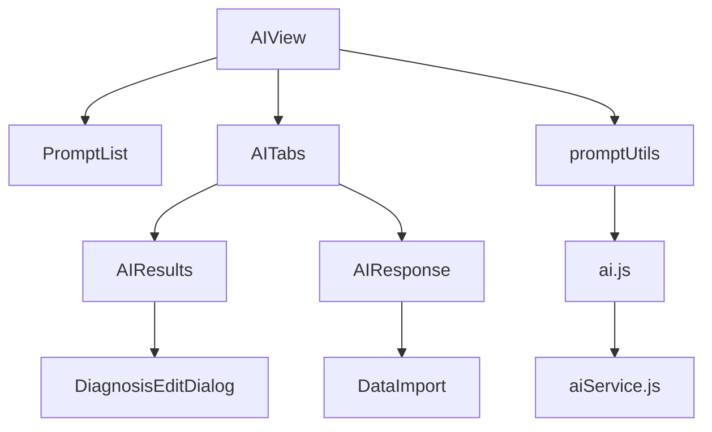

# 项目概述

<cite>
**本文档引用的文件**   
- [README.md](file://README.md)
- [AIView.vue](file://src/views/AIView.vue)
- [AITabs.vue](file://src/components/ai/AITabs.vue)
- [AIResults.vue](file://src/components/ai/AIResults.vue)
- [AIResponse.vue](file://src/components/ai/AIResponse.vue)
- [PromptList.vue](file://src/components/ai/PromptList.vue)
- [PromptTemplates.vue](file://src/components/ai/PromptTemplates.vue)
- [aiService.js](file://src/api/aiService.js)
- [promptUtils.js](file://src/utils/promptUtils.js)
- [ai.js](file://src/api/ai.js)
- [ai.js](file://src/store/modules/ai.js)
- [DiagnosisEditDialog.vue](file://src/components/patient/DiagnosisEditDialog.vue)
- [医疗AI助手使用指南.md](file://dist/docs/医疗AI助手使用指南.md)
</cite>

## 目录
1. [简介](#简介)
2. [项目结构](#项目结构)
3. [核心组件](#核心组件)
4. [架构概览](#架构概览)
5. [详细组件分析](#详细组件分析)
6. [依赖分析](#依赖分析)
7. [性能考量](#性能考量)
8. [故障排除指南](#故障排除指南)
9. [结论](#结论)

## 简介
医疗AI助手是一个基于Vue.js的前端应用，旨在为医生提供智能临床决策支持。该系统通过集成AI技术，辅助医生进行诊断分析、患者数据管理以及医疗决策。项目主要功能包括患者信息管理、AI辅助诊断、医疗数据管理和系统管理。前端采用Vue.js框架，结合Element Plus UI组件库，实现了用户友好的界面和高效的交互体验。系统通过与后端AI服务的交互，利用Prompt模板驱动AI任务执行，从而生成诊断建议和病情总结。

## 项目结构
项目采用模块化设计，主要分为以下几个部分：
- `public/`：存放静态资源文件，如HTML模板和文档。
- `src/`：源代码目录，包含API接口、组件、路由、状态管理、工具函数、视图等。
- `src/api/`：定义与后端服务的API接口。
- `src/components/`：可复用的UI组件，按功能划分，如AI相关组件、患者相关组件等。
- `src/router/`：路由配置，管理页面导航。
- `src/store/`：使用Vuex进行全局状态管理。
- `src/utils/`：工具函数，如处理Prompt执行的工具。
- `src/views/`：页面视图组件，如主布局、患者视图、AI视图等。

**图源**
- [AIView.vue](file://src/views/AIView.vue)
- [PromptList.vue](file://src/components/ai/PromptList.vue)
- [AITabs.vue](file://src/components/ai/AITabs.vue)
- [AIResults.vue](file://src/components/ai/AIResults.vue)
- [AIResponse.vue](file://src/components/ai/AIResponse.vue)
- [ai.js](file://src/api/ai.js)
- [aiService.js](file://src/api/aiService.js)
- [ai.js](file://src/store/modules/ai.js)

## 核心组件
核心组件包括AI视图、Prompt列表、AI结果展示、AI对话、Prompt模板管理等。这些组件通过Vuex进行状态管理，并通过API与后端服务交互。

**节源**
- [AIView.vue](file://src/views/AIView.vue)
- [PromptList.vue](file://src/components/ai/PromptList.vue)
- [AIResults.vue](file://src/components/ai/AIResults.vue)
- [AIResponse.vue](file://src/components/ai/AIResponse.vue)

## 架构概览
系统架构分为前端、API层、状态管理层和后端服务。前端通过API调用后端服务，获取患者数据和AI响应。状态管理层使用Vuex管理全局状态，确保组件间的数据一致性。

**图源**
- [ai.js](file://src/api/ai.js)
- [aiService.js](file://src/api/aiService.js)

## 详细组件分析
### AI视图组件分析
AI视图组件（AIView.vue）是系统的主界面，包含左侧的Prompt列表和右侧的标签页。用户选择Prompt后，系统会加载相应的AI结果或对话。

#### 组件结构

**图源**
- [AIView.vue](file://src/views/AIView.vue#L0-L174)

### Prompt列表组件分析
Prompt列表组件（PromptList.vue）显示已执行和未执行的Prompt列表。用户点击列表项时，会触发`prompt-selected`事件，传递选中的Prompt信息。

#### 数据流

**图源**
- [PromptList.vue](file://src/components/ai/PromptList.vue#L0-L279)

### AI结果展示组件分析
AI结果展示组件（AIResults.vue）显示AI生成的诊断结果，并提供编辑、保存、添加诊断等功能。

#### 功能流程

**图源**
- [AIResults.vue](file://src/components/ai/AIResults.vue#L0-L291)

### AI对话组件分析
AI对话组件（AIResponse.vue）实现与AI的实时对话，支持发送消息、导入数据、保存对话等。

#### 对话流程

**图源**
- [AIResponse.vue](file://src/components/ai/AIResponse.vue#L0-L496)
- [aiService.js](file://src/api/aiService.js#L0-L158)

## 依赖分析
系统依赖于多个外部库和内部模块。主要依赖包括Vue.js、Element Plus、Axios、marked等。内部模块间通过API和Vuex进行通信。

**图源**
- [package.json](file://package.json)
- [AIView.vue](file://src/views/AIView.vue)
- [promptUtils.js](file://src/utils/promptUtils.js)

## 性能考量
系统在处理大量患者数据和AI响应时，需考虑性能优化。建议使用流式响应处理大文本，避免阻塞UI。同时，合理使用Vuex的getter和mutation，减少不必要的状态更新。

## 故障排除指南
### 常见问题
- **登录失败**：检查用户名、密码、科室和专业组是否正确。
- **AI响应慢**：检查网络连接，确认后端服务正常运行。
- **数据未加载**：确认患者ID正确，检查API接口是否返回数据。

### 错误处理
系统在API调用失败时，会捕获错误并显示提示信息。开发者可通过浏览器控制台查看详细错误日志。

**节源**
- [ai.js](file://src/api/ai.js#L0-L399)
- [aiService.js](file://src/api/aiService.js#L0-L158)

## 结论
医疗AI助手通过集成AI技术，为医生提供了强大的临床决策支持。系统架构清晰，组件职责明确，易于维护和扩展。未来可进一步优化性能，增加更多AI功能，提升用户体验。