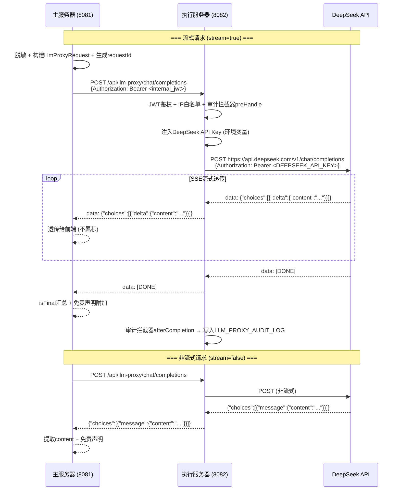

# LLM 安全代理转发实施方案

## Context

当前主服务器 `AIResponseController` 直接调用 DeepSeek API (`https://api.deepseek.com/v1/chat/completions`)，API Key 同时存储在主服务器和执行服务器两处。这导致：
- API Key 泄露面大（2 个存储点）
- 主服务器需要外网访问权限，增加攻击面
- LLM 调用日志分散，难以统一审计
- 不符合等保"最小权限"原则

**目标**：将所有 LLM 外部调用收敛到执行服务器单一出口，主服务器仅通过安全代理访问执行服务器，再由执行服务器转发至外网 DeepSeek API。

## 方案概述

采用 **AI Gateway + Nginx 混合架构**：

```
主服务器 (无外网)                 执行服务器 (AI Gateway)              外网
┌─────────────────────┐    JWT    ┌──────────────────────────┐    ┌──────────┐
│ AIResponseController │─────────▶│ /api/llm-proxy/chat/     │───▶│ DeepSeek  │
│       (改造)         │  HTTPS   │   completions            │    │ API      │
│                      │          │  ├ JWT 鉴权              │    └──────────┘
│ LlmProxyClient       │          │  ├ API Key 注入          │
│ (新增)               │          │  ├ 流式/非流式透传       │
└─────────────────────┘          │  ├ 审计日志              │
                                 │  └ IP 白名单             │
                                 └──────────────────────────┘
```

**核心原则**：
- API Key 仅执行服务器持有，主服务器不接触
- 执行服务器做透明透传，不解析 LLM 请求体内容（避免接触患者数据）
- 复用现有 JWT + 内网基础设施，不引入新依赖

---

## 文件变更清单

### 新增文件 (7 个)

| # | 文件路径 | 说明 |
|---|---------|------|
| 1 | `src/main/java/com/example/medaiassistant/dto/LlmProxyRequest.java` | LLM 代理请求 DTO，工厂方法 `static from(AIRequest)` |
| 2 | `src/main/java/com/example/medaiassistant/dto/LlmProxyResponse.java` | LLM 代理非流式响应 DTO |
| 3 | `src/main/java/com/example/medaiassistant/controller/LlmProxyController.java` | 执行服务器端 LLM 代理控制器 (`@Profile("execution")`) |
| 4 | `src/main/java/com/example/medaiassistant/exception/LlmProxyException.java` | LLM 代理异常类 |
| 5 | `src/main/java/com/example/medaiassistant/interceptor/LlmProxyAuditInterceptor.java` | 审计日志拦截器 |
| 6 | `src/main/java/com/example/medaiassistant/model/LlmProxyAuditLog.java` | 审计日志 JPA 实体 |
| 7 | `src/main/java/com/example/medaiassistant/repository/LlmProxyAuditLogRepository.java` | 审计日志 Repository |

### 修改文件 (8 个)

| # | 文件路径 | 变更类型 | 说明 |
|---|---------|----------|------|
| 8 | `controller/AIResponseController.java` | **重构** | 移除 WebClient 直连 DeepSeek，改为调用执行服务器代理 |
| 9 | `config/AIModelConfig.java` | **修改** | 新增 `llmProxyEnabled` 开关，ModelConfig 的 `key` 改为 Optional |
| 10 | `config/ExecutionServerProperties.java` | **修改** | 新增 `llmProxyPath`、`llmProxyJwtToken` 属性 |
| 11 | `config/WebSecurityConfig.java` | **修改** | 移除 `/api/ai/response` 公开路径，收紧 LLM 代理端点权限 |
| 12 | `config/WebMvcConfig.java` (或等同) | **修改** | 注册 `LlmProxyAuditInterceptor` |
| 13 | `src/main/resources/application.properties` | **修改** | 新增 `llm.proxy.*` 配置段，移除 `ai.models.*.key` |
| 14 | `src/main/resources/application-execution.properties` | **修改** | 新增 `deepseek.api.key` 环境变量，`llm.proxy.ip-whitelist` |
| 15 | `src/main/resources/logback-spring.xml` | **修改** | 新增 `LLM_PROXY_AUDIT` 独立日志追加器 |

### 数据库变更 (1 个)

| # | 说明 |
|---|------|
| 16 | 创建 `LLM_PROXY_AUDIT_LOG` 表 |

---

## 实施任务

### Task 1：DTO 层 — 请求/响应对象

**文件**：`LlmProxyRequest.java`、`LlmProxyResponse.java`

`LlmProxyRequest` 从 `AIRequest` 转换，包含代理调用所需的核心字段：

```java
public class LlmProxyRequest {
    private String model;
    private List<Map<String, String>> messages;
    private boolean stream;
    private Double temperature;
    private Integer maxTokens;
    private String requestId;  // UUID 追踪 ID

    public static LlmProxyRequest from(AIRequest aiRequest, String requestId) { ... }
    public Map<String, Object> toRequestBody() { ... }
}
```

`LlmProxyResponse` 用于非流式响应：

```java
public class LlmProxyResponse {
    private boolean success;
    private String content;
    private String error;
    private String errorCode;
    private String requestId;

    public static LlmProxyResponse success(String content, String requestId) { ... }
    public static LlmProxyResponse error(String errorCode, String error, String requestId) { ... }
}
```

### Task 2：执行服务器 — LLM 代理端点

**文件**：`LlmProxyController.java`（新增，`@Profile("execution")`）

**设计决策**：新增独立 Controller（`/api/llm-proxy`），不扩展现有 `ExecutionServerController`。理由：
- `ExecutionServerController` 已约 2850 行，职责是加密轮询 + Prompt 业务处理
- LLM 代理是纯 HTTP 透传，技术栈不同（WebClient/Flux vs RestTemplate）
- 独立端点便于安全策略隔离（IP 白名单、JWT 鉴权）

**核心端点**：

```java
@RestController
@RequestMapping("/api/llm-proxy")
@Profile("execution")
public class LlmProxyController {

    // 统一入口，根据 stream 字段分发
    @PostMapping("/chat/completions")
    public Object proxyChatCompletion(
            @RequestBody Map<String, Object> requestBody,
            HttpServletRequest request) {

        boolean isStream = Boolean.TRUE.equals(requestBody.get("stream"));
        String modelName = (String) requestBody.getOrDefault("model", "unknown");

        // MDC 设置审计上下文
        MDC.put("proxy.model", modelName);
        MDC.put("proxy.stream", String.valueOf(isStream));
        MDC.put("proxy.client_ip", request.getRemoteAddr());

        AIModelConfig.ModelConfig modelConfig = resolveModelConfig(modelName);
        if (modelConfig == null) {
            return ResponseEntity.status(400)
                    .body(Map.of("error", "Unsupported model: " + modelName));
        }

        return isStream
            ? handleStreamProxy(modelConfig, requestBody)
            : handleNonStreamProxy(modelConfig, requestBody);
    }
}
```

**流式代理** (`handleStreamProxy`)：
- 使用 `WebClient` 调用 DeepSeek API
- **透明透传**：不解析 NDJSON 内容，逐行原样转发
- 超时 300 秒，复用 `RetryUtil.createAIRetrySpec()` 重试
- 非 2xx 响应完整透传错误码和错误体

**非流式代理** (`handleNonStreamProxy`)：
- 使用 `WebClient` 调用 DeepSeek API（非流式）
- 等待完整响应后以 JSON 返回
- 透传 HTTP 状态码

**审计日志**：在 `doOnTerminate()` 中异步写入 `LlmProxyAuditLog` 表。

### Task 3：执行服务器 — 审计日志

**文件**：`LlmProxyAuditInterceptor.java`、`LlmProxyAuditLog.java`、`LlmProxyAuditLogRepository.java`

**审计拦截器** (`HandlerInterceptor`)：
- `preHandle`：记录 requestId、clientIp、startTime
- `afterCompletion`：输出审计日志（请求来源、模型、状态码、耗时）

**审计实体** (`LLM_PROXY_AUDIT_LOG` 表)：
```sql
CREATE TABLE LLM_PROXY_AUDIT_LOG (
    ID              NUMBER(19)    GENERATED BY DEFAULT AS IDENTITY PRIMARY KEY,
    REQUEST_ID      VARCHAR2(36)  NOT NULL,
    MODEL           VARCHAR2(50),
    STREAM          NUMBER(1)     DEFAULT 0,
    STATUS          VARCHAR2(20)  NOT NULL,   -- REQUEST / SUCCESS / ERROR
    PROMPT_LENGTH   NUMBER(10),
    RESPONSE_LENGTH NUMBER(10),
    DURATION_MS     NUMBER(10),
    CALLER_IP       VARCHAR2(45),
    ERROR_MESSAGE   VARCHAR2(500),
    ERROR_CODE      VARCHAR2(50),
    CREATED_AT      TIMESTAMP     DEFAULT CURRENT_TIMESTAMP
);
```

**审计日志文件分离**（`logback-spring.xml`）：
```xml
<logger name="LLM_PROXY_AUDIT" level="INFO" additivity="false">
    <appender-ref ref="LLM_PROXY_AUDIT_FILE"/>
</logger>
```

### Task 4：主服务器 — AIResponseController 改造

**文件**：`AIResponseController.java`（重构）

**核心变更**：
- **移除**：`webClient`（直连 DeepSeek 的 WebClient）
- **移除**：直接使用 `AIModelConfig.getModelConfig().getKey()` 读取 API Key
- **新增**：`LlmProxyClient` 内部类封装执行服务器调用
- **保留**：脱敏逻辑、免责声明附加、NDJSON 解析逻辑

**改造后流程**：

```
AIResponseController.getAIResponse(AIRequest)
  ├─ 1. 患者数据脱敏（不变）
  ├─ 2. 构建 LlmProxyRequest（from AIRequest）
  ├─ 3. 生成 requestId
  ├─ 4. if (stream)
  │      → WebClient 调用执行服务器 /api/llm-proxy/chat/completions
  │      → 透传 NDJSON 流（保留 [DONE]/isFinal 逻辑）
  │   else
  │      → RestTemplate 调用执行服务器 /api/llm-proxy/chat/completions
  │      → 组装 JSON 响应
  └─ 5. 附加 AI 免责声明
```

**关键代码结构**：

```java
@PostMapping("/response")
public Flux<String> getAIResponse(@Valid @RequestBody AIRequest request) {
    // 脱敏
    String cleanedPrompt = desensitizationService.desensitize(request.getPrompt());
    request.setPrompt(cleanedPrompt);

    // 构建代理请求
    String requestId = UUID.randomUUID().toString();
    LlmProxyRequest proxyRequest = LlmProxyRequest.from(request, requestId);

    if (request.isStream()) {
        return proxyStreamToExecutionServer(proxyRequest);
    } else {
        return proxyNonStreamToExecutionServer(proxyRequest);
    }
}

private Flux<String> proxyStreamToExecutionServer(LlmProxyRequest proxyRequest) {
    return webClient.post()
        .uri(executionProps.getApiUrl() + "/llm-proxy/chat/completions")
        .header("Authorization", "Bearer " + executionProps.getLlmProxyJwtToken())
        .bodyValue(proxyRequest.toRequestBody())
        .exchangeToFlux(response -> {
            if (!response.statusCode().is2xxSuccessful()) {
                return Flux.error(/* ... */);
            }
            return response.bodyToFlux(String.class);
        })
        .onErrorResume(e -> Flux.just(/* 友好错误 */));
}
```

### Task 5：配置变更

**`ai-models.properties`**：移除所有 `*.key` 字段（主服务器不再持有 API Key）：
```properties
ai.models.deepseek-chat.url=https://api.deepseek.com/v1/chat/completions
# ai.models.deepseek-chat.key=  ← 已移除
```

**`application.properties`**：新增代理配置段：
```properties
llm.proxy.enabled=true
llm.proxy.base-url=${execution.server.api-url}
llm.proxy.internal-jwt-token=${LLM_PROXY_INTERNAL_JWT:}
llm.proxy.connect-timeout=30000
llm.proxy.read-timeout=300000
```

**`application-execution.properties`**：执行服务器新增：
```properties
deepseek.api.url=https://api.deepseek.com/v1/chat/completions
deepseek.api.key=${DEEPSEEK_API_KEY}
llm.proxy.ip-whitelist=127.0.0.1,100.66.1.4
```

**环境变量**（部署时注入）：
| 变量 | 位置 | 说明 |
|------|------|------|
| `DEEPSEEK_API_KEY` | 执行服务器 | DeepSeek API 密钥 |
| `LLM_PROXY_INTERNAL_JWT` | 主服务器 | 主→执代理调用的内部 JWT |

### Task 6：安全加固

| 优先级 | 加固项 | 具体措施 |
|:------:|--------|---------|
| P0 | API Key 隔离 | 从主服务器配置移除所有 `*.key`，仅执行服务器环境变量持有 |
| P0 | JWT 鉴权 | `/api/llm-proxy/**` 不在 PUBLIC_PATHS，主服务器用内部 JWT 调用 |
| P0 | 公开路径收紧 | `/api/ai/response` 从 PUBLIC_PATHS 移除 |
| P1 | IP 白名单 | `LlmProxyController` 校验调用方 IP |
| P1 | 审计日志持久化 | 写入 `LLM_PROXY_AUDIT_LOG` 表 |
| P2 | 降级开关 | `llm.proxy.enabled=false` 可回退直连模式 |

---

## 数据流序列图



---

## 测试策略

### 单元测试

| 测试范围 | 关键用例 |
|---------|---------|
| `LlmProxyRequest.from(AIRequest)` | 字段正确映射，stream/temperature 透传 |
| `LlmProxyController.resolveModelConfig` | `inHospitalDeepseek → deepseek-chat` 映射，不存在的模型返回 null |
| `LlmProxyAuditInterceptor` | preHandle 设置属性，afterCompletion 输出日志 |
| `AIResponseController`（Mock 执行服务器） | 流式透传、非流式透传、脱敏仍生效、免责声明附加 |

### 集成测试

| 测试范围 | 关键用例 |
|---------|---------|
| 代理端点 JWT 鉴权 | 无 Token → 401，无效 Token → 401，有效 Token → 200 |
| IP 白名单 | 白名单 IP → 200，非白名单 IP → 403 |
| 审计日志写入 | 成功调用后 `LLM_PROXY_AUDIT_LOG` 有 SUCCESS 记录 |
| 超时处理 | 模拟 DeepSeek 超时 → 重试 3 次 → 返回 502 |

### 端到端测试

| 场景 | 验证点 |
|------|--------|
| 前端 AI 对话（流式） | 逐字返回 → [DONE] 正常结束 → 前端正确渲染 |
| AI 完善按钮（非流式） | 等待 → 内容返回 → 填充文本框 |
| 执行服务器不可用 | 主服务器返回友好错误 |
| API Key 泄露验证 | `git grep 'sk-'` 主服务器代码无匹配 |

---

## 实施阶段

| 阶段 | 内容 | 风险 |
|:----:|------|:----:|
| **Phase 1** | 新增执行服务器 `LlmProxyController` + 审计日志（独立功能，不影响现有流程）| 低 |
| **Phase 2** | 主服务器 `AIResponseController` 增加代理调用路径（`llm.proxy.enabled` 开关控制新旧并存）| 中 |
| **Phase 3** | 配置迁移：移除 `ai-models.properties` 密钥，配置环境变量 | 中 |
| **Phase 4** | 收紧 `WebSecurityConfig` PUBLIC_PATHS，移除 `/api/ai/response` 公开路径 | 高 |
| **Phase 5** | 全量回归测试 + 灰度切换 | 高 |

---

## 验证方式

1. **开发模式验证**：
   ```powershell
   # 启动执行服务器
   .\run-execution-server.bat
   # 启动主服务器
   mvn spring-boot:run
   # 调用代理端点测试
   curl -X POST http://localhost:8082/api/llm-proxy/chat/completions `
     -H "Content-Type: application/json" `
     -H "Authorization: Bearer <jwt_token>" `
     -d '{"model":"deepseek-chat","messages":[{"role":"user","content":"你好"}],"stream":false}'
   ```

2. **安全检查**：
   ```powershell
   # 确认主服务器无 API Key 泄露
   git grep 'sk-' -- '*.properties' '*.java'
   # 确认代理端点需 JWT
   curl http://localhost:8082/api/llm-proxy/chat/completions -d '{}'
   # 应返回 401
   ```

3. **审计日志检查**：
   ```sql
   SELECT * FROM LLM_PROXY_AUDIT_LOG ORDER BY CREATED_AT DESC FETCH FIRST 10 ROWS ONLY;
   ```
