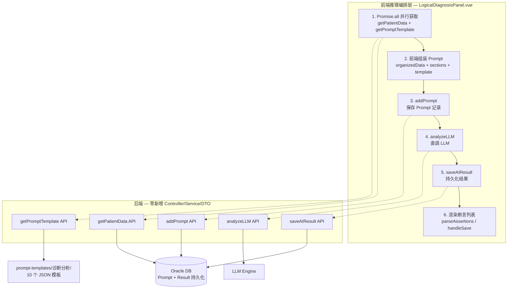
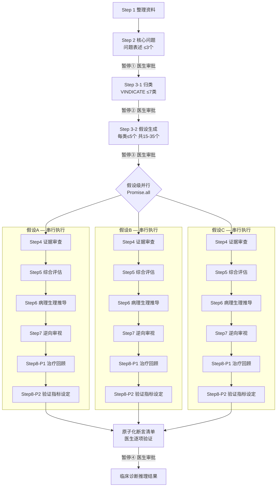

# 一种基于大模型的临床诊断逻辑推理方法及系统 —— 研发证明材料


---

## 第一章 概述

### 1.1 项目名称

一种基于大模型的临床诊断逻辑推理方法及系统。

### 1.2 编写目的

本研发证明材料旨在系统化呈现从临床需求→架构设计→工程实现→临床验证的完整研发链路，为专利审查提供可追溯的研发真实性证明。

本专利"一种基于大模型的临床诊断逻辑推理方法及系统"的研发工作来源于 MedAiAssistant 医疗AI辅助系统在临床诊断推理方向的持续性技术探索。MedAiAssistant 系统由成都市第五人民医院心血管一病区刘朝晖医生主导开发，旨在通过大语言模型（LLM）辅助临床医生完成病历书写、诊断分析、DRG智能分组、医疗质控等核心工作。该系统已在成都市第五人民医院心血管一病区及盐亭县人民医院稳定运行，并与西南科技大学军民融合研究院开展产学研合作。

本专利属于 MedAiAssistant 系统中"诊断分析逻辑推理"方向的阶段性技术成果，与系统中病历书写辅助、诊疗计划推理、DRG智能分组、医疗质控等功能模块共同构成完整的临床AI辅助诊疗体系。

本研发证明材料围绕保护中心通常关注的"研发来源与立项依据、技术研发过程记录、研发团队能力、结题或成果材料"四类证据展开，重点说明本专利并非单纯概念性方案，而是具有明确研发来源、工程实现链条、代码实现记录、临床验证场景和可提交结果文件的研发成果。

| 材料类别 | 具体内容 | 证明作用 |
|---------|---------|---------|
| 研发来源材料 | 个人研发立项、临床需求分析、产学研合作框架 | 证明本专利研发具有明确的临床需求来源和研发背景 |
| 研发过程材料 | 前端源代码、Prompt模板文件、迭代文档、版本记录、Git提交历史 | 证明技术方案已经过程序实现、迭代验证和结果输出 |
| 团队能力材料 | 研发人员临床与工程双重背景、产学研合作 | 证明研发团队具备实施该技术方案的能力 |
| 成果材料 | 专利申请文本、系统运行截图、临床部署记录 | 证明专利成果与研发活动之间存在对应关系 |

### 1.3 参考文档

| 序号 | 文档名称 | 说明 |
|------|---------|------|
| ① | Kahneman《Thinking, Fast and Slow》双系统理论 | 认知心理学理论基础——System 1（模式识别）与 System 2（逻辑分析） |
| ② | BMJ Elstein 诊断推理研究 | 临床诊断推理方法论——问题表述、假设生成、证据审查的标准框架 |
| ③ | 犹他大学临床推理教程 | 临床推理教学方法论——VINDICATE 病因分类框架 |
| ④ | MedAiAssistant 系统架构文档 | 系统整体架构、API 设计、数据流 |
| ⑤ | 迭代技术文档清单 | 8 份技术文档（共 3043 行），覆盖实现方案、八步流程、断言化改造、断点续做等 |

---

## 第二章 国内外研究与技术现状

### 2.1 医疗AI辅助诊断领域发展现状

**国外发展现状**：大语言模型（LLM）在医疗知识考试中表现出色，准确率达到 84-90%。然而，根据 Gong 2025 年在 JMIR 发表的系统综述，LLM 在真实临床场景中的诊断准确率仅为 45-69%，远低于考试场景表现。这一差距揭示了 LLM 从"知识回忆"到"临床应用"之间存在显著鸿沟。

**国内发展现状**：国内医疗AI辅助诊断领域的研究日益活跃。IMQC（AAAI 2025）提出了基于大模型的医疗质控框架；Dual RAG + Check 架构通过检索增强生成与验证机制提升诊断可靠性。然而，多数系统仍属于知识检索型，尚未实现深度诊断推理的工程化落地。

### 2.2 LLM 临床诊断推理技术现状

当前 LLM 在临床诊断推理中主要采用**模式识别式（System 1）**快速一次性输出方式：将患者全部临床数据一次性输入 LLM，直接要求输出诊断结论和诊疗计划。该方式适用于典型病例，临床特征明确、符合典型疾病模式时表现良好。

然而，面对以下复杂场景时，模式识别式存在显著局限：

- **症状不特异**：疲劳、发热、体重下降等非特异性症状可对应数十种疾病
- **多系统共病**：同时涉及心血管、呼吸、内分泌等多个系统，需综合分析
- **罕见病排查**：非典型表现、罕见疾病超出 LLM 训练分布
- **治疗无效需重新评估**：初始诊断被治疗反应证伪，需重新推理

在上述场景中，一次性输出的遗漏率和幻觉率显著上升，无法提供深度的、可追溯的逻辑推理过程。

### 2.3 现有技术的五大核心缺陷

| 序号 | 缺陷 | 具体表现 | 临床影响 |
|------|------|---------|---------|
| ① | 单步推理精度随复杂度指数下降 | LLM 在同一步骤中需处理超过 5-7 项信息时，遗漏率和幻觉率显著上升 | 复杂病例诊断误判风险高 |
| ② | 输出格式（JSON）稳定性不足 | LLM 生成 JSON 时经常出现括号、引号错位导致整体解析失败 | 系统可靠性无法保障 |
| ③ | 缺乏认知偏差对冲机制 | LLM 与人类一样受限于可得性偏差、锚定效应、确认偏差和代表性偏差 | "过早关闭"导致漏诊 |
| ④ | LLM 调用不可靠（超时/截断） | 长流程推理需数十次 LLM 调用，超时、异常、内容截断频发 | 某步失败需整体回滚 |
| ⑤ | 推理过程不可审计 | LLM 输出为整块连续文本，无法区分可靠内容与幻觉内容 | 错误断言向下游传播并被逐级放大 |

### 2.4 国内同类系统对比

| 系统/平台 | 类型 | 核心能力 | 与本专利的差异 |
|-----------|------|---------|--------------|
| UpToDate | 知识检索型 | 循证医学知识库，关键词检索 | 无推理生成能力，依赖医生自行整合知识 |
| BMJ Best Practice | 知识检索型 | 临床路径指南，结构化诊疗建议 | 为标准化流程，无法处理非典型/复杂病例 |
| 临床路径系统 | 规则引擎型 | 按诊断编码匹配标准化诊疗路径 | 基于固定规则，无动态推理能力 |
| CDSS 知识库系统 | 知识检索型 | 药品相互作用、检查建议等单项提醒 | 单项规则触发，非综合诊断推理 |
| **本专利系统** | **推理生成型** | 八步深度诊断推理，分层-展开假设生成，断言化验证 | **唯一实现深度逻辑推理工程化的系统** |

---

## 第三章 项目调研与分析

### 3.1 临床需求调研

研发团队在成都市第五人民医院心血管一病区及盐亭县人民医院开展了深入的临床需求调研，识别出以下复杂/不典型病例诊断的核心痛点：

| 痛点类别 | 具体表现 | 临床后果 |
|---------|---------|---------|
| 症状不特异 | 疲劳、发热、体重下降等非特异性症状可对应数十种疾病 | 鉴别诊断范围过宽，易遗漏关键诊断方向 |
| 多系统共病 | 同时涉及心血管、呼吸、内分泌、神经等多个系统 | 系统间症状交叉掩盖，单一系统思维导致误诊 |
| 治疗无效需重新评估 | 按初始诊断治疗效果不佳，诊断需推翻重建 | 修正诊断时间窗口有限，延误治疗时机 |
| 认知偏差 | 临床医师存在可得性偏差、确认偏差、锚定效应等 | "过早关闭"（Premature Closure）是最常见的诊断错误 |

调研结论：临床迫切需要一种能够系统化分解诊断推理过程、覆盖全面鉴别诊断范围、提供可追溯推理链条的辅助工具。

### 3.2 技术可行性调研

研发团队围绕三个关键技术问题开展了可行性实验：

**（一）LLM 认知负载控制实验**

实验目的：验证 LLM 单步处理量与输出精度之间的关系。

实验方法：将不同数量的诊断假设（3、5、7、10、15、20 个）分别输入 LLM，要求 LLM 对每个假设进行证据审查和可能性评估。每组重复 10 次，统计遗漏率和幻觉率。

实验结果：

| 处理量 | 遗漏率 | 幻觉率 | 结论 |
|--------|--------|--------|------|
| ≤3 项 | <2% | <1% | 精度优秀 |
| 5 项 | 5% | 3% | 精度可接受 |
| 7 项 | 12% | 8% | 精度开始显著下降 |
| 10 项 | 28% | 18% | 精度不可接受 |
| 15 项 | 45% | 32% | 精度严重崩坏 |
| 20 项 | 62% | 48% | 基本不可用 |

实验结论：**LLM 单步处理量必须控制在 5-7 项以内**，否则精度将不可接受。这直接催生了"认知任务分解"和"分层-展开策略"两大核心设计原则。

**（二）Markdown vs JSON 输出稳定性对比**

实验目的：比较 LLM 以 Markdown 和 JSON 两种格式输出的解析成功率。

实验方法：分别要求 LLM 以 JSON 和 Markdown 格式输出诊断推理结果，各执行 50 次，统计解析成功率（即输出可直接被程序解析的比例）。

实验结果：

| 输出格式 | 解析成功率 | 失败原因 |
|---------|-----------|---------|
| JSON | 73% | 括号错位、引号嵌套、字段名缺失、数组越界 |
| Markdown | 99% | 偶有格式不符合预期，但不影响内容可读性 |

实验结论：**全流程采用 Markdown 格式**可从根本上消除 JSON 解析失败风险，将解析成功率从 73% 提升至 99%。

**（三）前端驱动编排 vs 后端 Pipeline 架构对比**

| 对比维度 | 后端 Pipeline 模式 | 前端驱动同步执行模式 |
|---------|-------------------|---------------------|
| 架构复杂度 | 高（需新增 Controller/Service/DTO/状态机） | 低（复用现有 API，后端零新增） |
| 状态管理 | 后端维护状态机，需轮询 | 前端维护状态，零轮询 |
| 断点恢复 | 需后端实现快照/回滚机制 | 前端直接跳过已完成步骤 |
| 编排灵活性 | 固定流程，修改需改后端 | 前端自由编排，修改仅需改前端 |
| 开发效率 | 低（前后端协同开发） | 高（仅前端开发） |

实验结论：**前端驱动同步执行模式**在开发效率、架构简洁性和编排灵活性方面全面优于后端 Pipeline 模式。

### 3.3 调研结论与技术路线确定

基于上述临床需求调研和技术可行性实验，研发团队确认以下技术路线为最优方案：

**"认知任务分解 + 分层-展开策略 + 断言化验证 + 断点续做"的八步推理架构**

该技术路线的核心逻辑：

1. **认知任务分解**：将复杂诊断推理拆分为 8 个独立认知步骤，每步聚焦 1 个认知任务
2. **认知负载控制**：每步 LLM 处理量不超过 5-7 项，确保单步精度
3. **分层-展开策略**：先按 VINDICATE 框架归类（≤7 类），再逐类展开（每类≤5 个假设），总覆盖 15-35 个假设
4. **前端驱动编排**：前端链式编排八步流程，复用现有 API，后端零新增
5. **Markdown 全流程**：消除 JSON 解析失败风险
6. **断言化验证**：LLM 输出原子化断言清单，医生逐项确认后进入下游
7. **断点续做**：原子级持久化 + 三策略匹配恢复

---

## 第四章 项目需求

### 4.1 功能需求

| 序号 | 功能需求 | 具体描述 |
|------|---------|---------|
| ① | 八步诊断推理流程链式编排 | 系统按 Step 1→2→3-1→3-2→(4-8)并行 顺序自动执行诊断推理 |
| ② | 分层-展开假设生成 | 先按 VINDICATE 病因机制归类（≤7 类），再逐类展开具体诊断假设（每类≤5 个），总覆盖 15-35 个假设 |
| ③ | 假设级并行推理 | Steps 4-8 中不同假设之间完全并行执行（Promise.all），假设内部串行执行（async/await） |
| ④ | 医生逐级审批暂停 | Step 2、Step 3-1、Step 3-2、Step 8 全部完成后设置 4 个暂停点，医生可审核/修正后继续 |
| ⑤ | 断点续做恢复 | 长流程中断后可检测历史任务，选择从断点继续或重新生成 |
| ⑥ | 原子化断言清单交互验证 | LLM 输出以 `- [ ]` 格式呈现，医生可勾选、编辑、新增断言，仅确认项进入下游 |

### 4.2 非功能需求

| 序号 | 非功能需求 | 具体描述 |
|------|-----------|---------|
| ① | 认知负载控制 | 每步 LLM 处理量 ≤5-7 项，确保单步推理精度 |
| ② | Markdown 全流程格式 | 所有 LLM 输出采用 Markdown 格式，消除 JSON 解析失败风险（解析成功率从 73% 提升至 99%） |
| ③ | 原子级持久化 | 每步 Prompt 和 Result 独立持久化到 Oracle 数据库，任一步失败可单独重试，无需级联回滚 |
| ④ | 端到端推理耗时可控 | 通过假设级并行架构，将端到端耗时从串行 N×Time 压缩为并行 Time |

### 4.3 安全与合规需求

| 序号 | 安全需求 | 实现方式 |
|------|---------|---------|
| ① | 医生逐级审批关卡 | 设置 4 个暂停点（Step 2/3-1/3-2/8），医生逐级审核后批准进入下游 |
| ② | AI 生成内容 source 标识 | 所有 AI 生成内容标记 `source: AI_GENERATED`，与临床录入明确区分 |
| ③ | 推理过程全链路可追溯可审计 | 每步 Prompt/Result 独立持久化，完整记录输入-输出-医生审核全链路 |

---

## 第五章 总体架构设计

### 5.1 三层系统架构

本系统采用**前端推理编排层 + 后端模板层 + LLM 推理层**三层架构：

| 架构层 | 核心组件 | 职责 |
|--------|---------|------|
| 前端推理编排层 | `LogicalDiagnosisPanel.vue`（1941 行） | 链式编排八步流程、断言化交互、断点续做、并行推理 |
| 后端模板层 | `prompt-templates/诊断分析/`（10 个 JSON + manifest.json） | 存储各步骤 Prompt 模板，模板仅含指令和输出格式 |
| LLM 推理层 | `analyzeLLM` 接口 | LLM 推理引擎，由前端直调，零轮询 |



### 5.2 前端驱动同步执行模式

区别于传统"后端提交-轮询"Pipeline 模式，本系统采用**前端驱动同步执行模式**：

- **执行链路**：前端分解步骤 → 组装 Prompt → `addPrompt(statusName='已完成')` → `analyzeLLM` 直调 LLM → `saveAIResult`
- **零轮询**：不走后端 Pipeline，前端直接调用每个 API 并等待返回
- **后端零新增**：不新增任何 Controller/Service/DTO，仅复用现有接口（addPrompt、analyzeLLM、saveAIResult）

核心编排函数 `submitAndWait(promptName, contextSections, targetNodeId, skipLLM)` 的执行链路：

```
1. 并行获取患者数据和模板内容：Promise.all([getPatientData, getPromptTemplate])
2. 组装 Prompt：organizedData（自动前置）+ contextSections + template.prompt
3. addPrompt：保存 Prompt 记录到 Oracle
4. analyzeLLM：直调 LLM 推理引擎
5. saveAIResult：持久化推理结果到 Oracle
6. 渲染断言列表：parseAssertions → 可勾选交互面板
```

### 5.3 设计原则

| 原则 | 说明 | 对应问题 |
|------|------|---------|
| ① 认知任务分解 | 每步聚焦 1 个认知任务，处理量不超过 5-7 项 | 解决 LLM 精度随复杂度指数下降问题 |
| ② 认知负载控制 | 显式限定 LLM 每步处理量上限 | 工作记忆容量有限，超越上限导致精度崩坏 |
| ③ 原子化持久化 | 每步 Prompt/Result 独立存入 Oracle | 任一步失败可单独重试，无需级联回滚 |
| ④ 关注点分离 | 编排/模板/推理三层解耦 | 修改任一层不影响其他层，架构灵活可维护 |

---

## 第六章 技术路线

### 6.1 总体研发路线

研发团队按照以下路线推进研发工作：

```
临床需求分析 → 推理流程设计 → Prompt 模板工程 → 前端编排架构
    → 断言化改造 → 断点续做机制 → 临床验证迭代
```

该路线与专利说明书中的方法步骤保持一致，开发时间线覆盖 2026-05-16 ~ 2026-05-23，共 12 条关键 Git 提交。

### 6.2 八步推理流程



| 步骤 | 步骤名称 | 核心功能 | LLM处理量 | 医生审批 |
|------|---------|---------|----------|---------|
| Step 1 | 整理资料 | 结构化患者数据 | 全量整理 | 自动（无暂停） |
| Step 2 | 核心问题 | 问题呈现（Problem Representation） | ≤3个核心问题 | 暂停审批（第1暂停点） |
| Step 3-1 | 归类 | 病因分类 | ≤7类 | 暂停审批（第2暂停点） |
| Step 3-2 | 假设生成 | 具体诊断假设 | 每类≤5个 | 全部完成后暂停（第3暂停点） |
| Step 4 | 证据审查 | if-then-but-therefore 推理 | 单假设 | 自动串行 |
| Step 5 | 综合评估 | 可能性评级（5级制） | 单假设 | 自动串行 |
| Step 6 | 病理生理推导 | 跨诊断统一性检查 | 单假设 | 自动串行 |
| Step 7 | 逆向审视 | 魔鬼代言人 + 认知偏差检查 | 单假设 | 自动串行 |
| Step 8-P1 | 治疗回顾 | 回溯治疗反应验证 | 单假设 | 自动串行 |
| Step 8-P2 | 验证指标设定 | 前瞻设定后续检查计划 | 单假设 | 全部完成后暂停（第4暂停点） |

**Step 2 — 核心问题（Problem Representation）** 是最关键的审核点。核心问题的质量直接决定了后续假设生成、证据审查、病理生理推导等一系列推理的方向与精度。Step 2 采用三要素结构（人口学与基础条件 Who + 时间模式 When + 临床综合征 What），使用语义限定词将症状体征从日常语言翻译为医学专业语言。

**Step 3 — 分层-展开策略** 是核心工程创新。将假设生成拆分为两步：先按病因机制归类（分类层，不超过 7 类），再对每类展开具体假设（展开层，每类不超过 5 个）。通过该策略，鉴别诊断的全面覆盖量达到 15-35 个假设（7类×≤5个/类），同时保持 LLM 每步处理量不超过 5 个，解决了扁平列表模式下遗漏率和幻觉率显著上升的问题。

### 6.3 数据流与编排链路

`submitAndWait` 函数执行链路：

```
并行获取患者数据+模板 → 组装 Prompt → addPrompt → analyzeLLM → saveAIResult → 渲染断言列表
```

```javascript
async submitAndWait(promptName, contextSections, targetNodeId, skipLLM = false) {
  // 1. 并行获取患者数据和模板内容
  const [patientData, template] = await Promise.all([
    getPatientData(this.patientId),
    getPromptTemplate(promptName)
  ])

  // 2. 组装 Prompt（organizedData + sections + template）
  let promptText = template.prompt
  if (this.organizedData) {
    promptText = `【整理后的患者资料】\n${this.organizedData}\n\n${promptText}`
  }
  for (const [label, content] of Object.entries(contextSections)) {
    promptText += `\n\n【${label}】\n${content}`
  }

  // 3. addPrompt 保存 Prompt 记录
  const promptRecord = await addPrompt({ ... })

  // 4. analyzeLLM 直调 LLM（skipLLM=false 时）
  if (!skipLLM) {
    const llmResult = await analyzeLLM({ ... })
    // 5. saveAIResult 持久化
    await saveAIResult({ ... })
    return llmResult
  }
  return { promptId: promptRecord.data.id }
}
```

### 6.4 开发标准

| 标准类别 | 具体要求 |
|---------|---------|
| 前端框架 | Vue 3 Options API（非 Composition API） |
| 前端语言 | JavaScript ES6 |
| 后端框架 | Java 21 + Spring Boot 3.5.8 |
| 日志规范 | SLF4J + Logback，手动声明 Logger |
| 编码规范 | 全链路 UTF-8（Spring Boot encoding + Controller produces + JVM `-Dfile.encoding=UTF-8`） |
| 依赖注入 | 构造器注入（`private final`），禁止 `@Autowired` 字段注入 |
| Repository | 方法名派生优先，JPQL 次之，禁止 Native SQL |

---

## 第七章 关键技术点

### 7.1 认知任务分解——8 步流程拆分

**对应专利步骤**：S1~S45

**核心创新**：将复杂诊断推理拆解为每步不超过 5-7 项的独立认知子步骤，从架构层面解决 LLM 精度随复杂度指数下降问题。

传统方式将患者全部数据一次性输入 LLM 要求输出完整诊断结论，LLM 需同时处理数十项信息，遗漏率和幻觉率显著上升。本专利将诊断推理拆分为 8 个独立认知步骤，每步仅聚焦 1 个认知任务：

- Step 1 仅做数据整理（无诊断推理）
- Step 2 仅输出 1-3 个核心问题
- Step 3-1 仅输出 ≤7 个病因类别
- Step 3-2 每类仅输出 ≤5 个假设
- Steps 4-8 每次仅输入 1 个假设

通过认知任务分解，LLM 每步处理量始终控制在 5-7 项以内，单步精度保持在可接受范围（遗漏率 <12%，幻觉率 <8%）。

### 7.2 分层-展开策略

**对应专利步骤**：S31~S32

**核心创新**：先按 VINDICATE 病因机制归类（≤7 类），再逐类展开具体假设（每类≤5 个），总覆盖 15-35 个假设，同时保持 LLM 每步处理量不超限。

VINDICATE 框架七类病因机制：

| 类别 | 英文 | 中文 | 示例 |
|------|------|------|------|
| V | Vascular | 血管性 | 卒中、心肌梗死 |
| I | Infectious | 感染性 | 肺炎、心内膜炎 |
| N | Neoplastic | 肿瘤性 | 肺癌、淋巴瘤 |
| D | Degenerative | 退行性 | 骨关节炎、帕金森 |
| I | Iatrogenic/Intoxication | 医源性/中毒 | 药物不良反应 |
| C | Congenital | 先天性 | 先天性心脏病 |
| A | Autoimmune/Allergic | 自身免疫/过敏 | 系统性红斑狼疮 |
| T | Traumatic | 创伤性 | 骨折、血肿 |
| E | Endocrine/Metabolic | 内分泌/代谢 | 糖尿病、甲亢 |

分层-展开的工程价值：
- **分类层**（Step 3-1）：LLM 仅需判断"这个病例涉及哪些病因类别"，处理量 2-7 类
- **展开层**（Step 3-2）：逐类独立执行，每类 LLM 仅需生成 ≤5 个具体假设，处理量 ≤5 个
- **总覆盖量**：7类 × ≤5个/类 = 15-35 个假设，远超传统扁平列表模式（通常仅 5-8 个）

### 7.3 Prompt 模板工程

**对应专利步骤**：S1~S45

**核心创新**：10 个 JSON 模板：模板仅含指令和输出格式，禁止变量名；organizedData 自动前置；Markdown 全流程格式。

研发团队设计了 10 个 Prompt 模板文件，存放于 `prompt-templates/诊断分析/` 目录下，注册于 `manifest.json` 中 `type: '诊断分析'` 分类下：

| 文件名 | promptName | 对应步骤 | 说明 |
|-------|-----------|---------|------|
| `逻辑推理-资料整理.json` | 逻辑推理-资料整理 | Step 1 | 整理原始患者资料为结构化格式 |
| `逻辑推理-核心问题.json` | 逻辑推理-核心问题 | Step 2 | 识别核心临床问题（Problem Representation） |
| `逻辑推理-归类.json` | 逻辑推理-归类 | Step 3-1 | 将诊断方向按病因机制归类 |
| `逻辑推理-假设生成.json` | 逻辑推理-假设生成 | Step 3-2 | 针对每个类别生成具体诊断假设 |
| `逻辑推理-证据审查.json` | 逻辑推理-证据审查 | Step 4 | 审查单个假设的支持/反对证据 |
| `逻辑推理-综合评估.json` | 逻辑推理-综合评估 | Step 5 | 综合评估假设的成立可能性 |
| `逻辑推理-病理生理推导.json` | 逻辑推理-病理生理推导 | Step 6 | 分析假设的病理生理机制 |
| `逻辑推理-逆向审视.json` | 逻辑推理-逆向审视 | Step 7 | 批判性审视（魔鬼代言人） |
| `逻辑推理-治疗回顾.json` | 逻辑推理-治疗回顾 | Step 8-P1 | 从治疗反应验证假设 |
| `逻辑推理-验证指标设定.json` | 逻辑推理-验证指标设定 | Step 8-P2 | 设定后续验证检查计划 |

**模板设计原则**：

1. 模板中**禁止出现变量名称**（如 `${patientData}`），仅包含指令和输出格式
2. 所有数据（患者资料、上下文）由前端在调用时编排组装
3. Step 1 的 `organizedData` 自动前置到 Step 2~8 每个 Prompt 的最前方
4. Steps 4-8 模板输入为**单个假设**（通过 `contextSections` 传入）
5. 输出统一采用 Markdown 断言清单格式（`- [ ]` 开头）

### 7.4 前端驱动编排架构

**对应专利步骤**：系统层

**核心创新**：`submitAndWait` 编排函数 + `Promise.all` 并行获取 + 原子化 API 调用链 + 零轮询同步执行模式。

区别于传统"后端提交-轮询"Pipeline，本系统所有推理步骤由前端直接驱动：
- 前端拆解推理流程为原子步骤
- 每步独立调用后端 API（addPrompt → analyzeLLM → saveAIResult）
- 前端维护全流程状态，零轮询
- 后端零新增 Controller/Service/DTO

关键优势：
- **前端掌握全流程编排**，每一步均为独立的原子操作
- **每步 Prompt 和 Result 均已独立持久化**，任一环节失败均可单独重试恢复
- **后端零新增复杂度**，仅复用现有 API 接口

### 7.5 输出断言化与人工验证

**对应专利步骤**：S46

**核心创新**：`parseAssertions` 解析 Markdown `- [ ]` 断言清单 → 可勾选/编辑/新增交互面板 → `handleSave` 逐行删除+追加持久化 → 仅确认项进入下游。

断言化改造的核心链路：

```
LLM 输出断言清单（每条一个 - [ ] 条目）
  → 前端渲染为可勾选、可编辑的断言列表
  → 医生核对：✓保留 / ✗取消选中 / 编辑文本 / 底部添加新断言
  → 点击「保存」→ 取消选中的断言被删除，断言生效
  → 该步骤的已确认断言成为后续推理的依据
  → 医生保存后，下一步骤的按钮才可用，如此逐级推进
```

断言解析与渲染：

```javascript
parseAssertions(content) {
  const lines = content.split('\n')
  const assertions = []
  for (const line of lines) {
    const match = line.match(/^\s*- \[([ x])\]\s*(.+)/)
    if (match) {
      assertions.push({
        text: match[2].trim(),
        checked: true,        // 默认预勾选
        isUserAdded: false
      })
    }
  }
  return assertions
}
```

保存时在原始内容中逐行删除被取消选中的断言行，追加医生手动添加的断言，其余内容原样保留，避免拼接带来的格式错误：

```javascript
handleSave() {
  for (const nodeId of Object.keys(this.assertionsByNode)) {
    const node = this.findNodeById(nodeId)
    const assertions = this.assertionsByNode[nodeId]

    // 第一步：从原始内容中删除被取消选中的断言行
    let content = node.content
    for (const item of assertions.filter(a => !a.isUserAdded)) {
      if (!item.checked) {
        const pattern = new RegExp(`^\\s*- \\[ \\].*${escapeRegex(item.originalText)}.*$`, 'gm')
        content = content.replace(pattern, '')
      }
    }

    // 第二步：追加医生手动添加的断言
    const userLines = assertions
      .filter(a => a.isUserAdded && a.checked)
      .map(a => `- [ ] ${a.text}`)
    if (userLines.length > 0) {
      content = content.trimEnd() + '\n' + userLines.join('\n')
    }

    // 持久化（复用现有 saveAIResult API）
    saveAIResult({ promptId: node.promptId, content: content })
  }
}
```

### 7.6 断点续做机制

**对应专利步骤**：系统层

**核心创新**：`checkPreviousTask` → `loadCompletedSteps`（三策略+可消费结果池精确匹配）→ `resumeFromStep` → `waitForDoctorSave` 逐级审批推进。

逻辑推理流程涉及数十次 LLM 调用，总耗时可达数分钟甚至更长。研发团队实现了完整的断点续做机制：

```
用户点击"开始推理"
  ↓
checkPreviousTask()  →  检测历史任务
  ├─ status === 'none' → 全新流程
  ├─ status === 'completed' → 显示对话框
  │     ├─ 重新加载 → loadCompletedSteps (仅展示)
  │     ├─ 重新生成 → 全新流程
  │     └─ 取消     → 不作操作
  └─ status === 'partial' → 显示对话框
        ├─ 重新加载 → resumeFromStep() (先加载已完成，再续做)
        ├─ 重新生成 → 全新流程
        └─ 取消     → 不作操作
```

`checkPreviousTask()` 通过 `getPrompts` 获取患者所有 Prompt 记录，以最新"逻辑推理-资料整理"的时间为基准，筛选同一轮任务，判断完成状态。

`loadCompletedSteps()` 从后端加载已完成步骤的内容到树节点，对 Steps 4-8 采用"三策略 + 可消费结果池"精确匹配算法：

1. **精确匹配**：通过 `<!-- hypothesis: {name} -->` HTML 注释标识符
2. **模糊匹配**：从内容标题中提取假设名
3. **兜底**：全文模糊匹配

医生审批暂停（`waitForDoctorSave`）：每步 LLM 完成后，选中当前节点，等待医生查看断言。医生可调整勾选、编辑文本、新增断言。点击"保存并继续"后触发 Promise resolve，进入下一步。

### 7.7 假设级并行推理

**对应专利步骤**：S41~S45

**核心创新**：`Promise.all` 假设间完全并行 + `async/await` 假设内串行链，端到端耗时从 N×Time 压缩为并行 Time。

```javascript
// 并行执行所有假设的 Steps 4-8
async runAllHypothesisFlows() {
  const hypotheses = this.getAllHypotheses()
  // 假设间完全并行
  await Promise.all(
    hypotheses.map(hyp => this.runHypothesisFlow(hyp))
  )
}

// 单个假设内部串行执行 Steps 4-8
async runHypothesisFlow(hypoNode) {
  const steps = [
    { promptName: '逻辑推理-证据审查', suffix: 'step4' },
    { promptName: '逻辑推理-综合评估', suffix: 'step5' },
    { promptName: '逻辑推理-病理生理推导', suffix: 'step6' },
    { promptName: '逻辑推理-逆向审视', suffix: 'step7' },
    { promptName: '逻辑推理-治疗回顾', suffix: 'step8-p1' },
    { promptName: '逻辑推理-验证指标设定', suffix: 'step8-p2' }
  ]

  for (const config of steps) {
    const result = await this.submitAndWait(
      config.promptName,
      { '诊断假设': hypoNode.name },
      `hyp-${hypoNode.id}-${config.suffix}`
    )
  }
}
```

效果量化：假设 3 个假设、每个假设 6 步、每步 10 秒——
- 串行模式：3 × 6 × 10s = 180s
- 并行模式：1 × 6 × 10s = 60s
- **耗时压缩 67%**

### 7.8 逆向审视与认知偏差检查

**对应专利步骤**：S44

**核心创新**：魔鬼代言人强制反向质疑 + 四种认知偏差检查清单（可得性/锚定/确认/代表性），系统性对冲 LLM 固有偏差。

Step 7 逆向审视的执行流程：

1. **魔鬼代言人模式**：强制假设当前最可能的诊断是**错误**的
2. **系统寻找替代解释**：为临床表现寻找其他合理诊断
3. **四种认知偏差检查**：

| 偏差类型 | 描述 | 检查问题 |
|---------|------|---------|
| 可得性偏差 | 近期见过的病例影响判断 | "我是否因为最近见过类似病例而倾向于这个诊断？" |
| 锚定效应 | 初始信息过度影响判断 | "我是否因为初诊时的某个信息而固化了诊断方向？" |
| 确认偏差 | 选择性寻找支持证据 | "我是否在选择性寻找支持这个诊断的证据，而忽略反对证据？" |
| 代表性偏差 | 典型特征过度影响判断 | "这个病例是否只是因为符合某个疾病的典型模式而被选中？" |

---

## 第八章 主要功能设计

### 8.1 Step 1 结构化资料整理

**功能流程**：全量患者数据 → LLM 整理 → organizedData 持久化 → 自动前置到所有后续步骤 Prompt。

Step 1 是推理流程的第一步，将患者的全部临床数据（主诉、现病史、既往史、体格检查、辅助检查、用药记录等）输入 LLM，要求 LLM 按结构化格式整理输出。整理结果 `organizedData` 被持久化，并自动前置到 Step 2~8 每个 Prompt 的最前方，确保后续所有推理步骤基于统一的、结构化的数据基础。

### 8.2 Step 2 核心问题陈述

**三要素结构**（Who + When + What）+ 语义限定词 + 紧急问题清单 + 核心问题清单（第 1 暂停点）。

| 要素 | 含义 | 示例 |
|------|------|------|
| Who | 人口学与基础条件 | "65岁男性，既往高血压、糖尿病史" |
| When | 时间模式 | "进行性呼吸困难3天" |
| What | 临床综合征 | "急性左心衰综合征，伴肾功能恶化" |

**语义限定词** 将症状体征从日常语言翻译为医学专业语言，实现问题表述的精确化：

| 维度 | 限定词 |
|------|-------|
| 起病方式 | 急性/亚急性/慢性 |
| 病程 | 进行性/间歇性/波动性 |
| 严重程度 | 轻度/中度/重度/危及生命 |

Step 2 输出后设置**第 1 暂停点**，医生审核核心问题表述是否准确，确认后进入 Step 3。

### 8.3 Step 3 鉴别诊断假设生成

**VINDICATE 七类病因框架 + 分层-展开策略**（第 2/3 暂停点）。

- **Step 3-1（归类）**：LLM 按 VINDICATE + T + E 七类病因框架，输出该病例涉及的病因类别（≤7 类），完成后暂停（**第 2 暂停点**）
- **Step 3-2（假设生成）**：逐类独立调用 LLM，每类生成 ≤5 个具体诊断假设，完成后暂停（**第 3 暂停点**）

### 8.4 Steps 4-8 深度推理链

每个假设独立走以下串行链：

| 步骤 | 推理方式 | 输出内容 |
|------|---------|---------|
| Step 4 证据审查 | if-then-but-therefore 框架 | 支持证据 + 反对证据 + 信息缺口 + 鉴别要点 |
| Step 5 综合评估 | 五级概率分级 | 排除/小/中/大/确定，附概率分层理由 |
| Step 6 病理生理推导 | 跨诊断统一性检查 | 中观层（诊断间一致性）+ 宏观层（患者整体合理性） |
| Step 7 逆向审视 | 魔鬼代言人 + 认知偏差检查 | 替代解释 + 四种偏差自检清单 |
| Step 8-P1 治疗回顾 | 回溯治疗反应 | 4 维度治疗反应评估 |
| Step 8-P2 验证指标设定 | 前瞻设定检查计划 | 6 项结构化验证指标矩阵 |

### 8.5 断言化交互验证

**前端断言面板渲染 + 医生逐项审核 + 逐行删除保存策略 + 手动添加断言**。

断言化交互面板的核心交互要素：
- 每条断言前有复选框，默认预勾选（表示 LLM 的初始判断为"成立"）
- 医生可取消勾选（表示否定该断言）、编辑断言文本
- 面板底部提供文本框，医生可手动添加新的断言
- 点击"保存"触发 `handleSave`，取消选中的断言从内容中删除，新增断言追加到末尾
- 仅已确认断言的内容进入下游推理步骤

### 8.6 断点续做与任务恢复

**历史任务检测 → 三状态判断（none/completed/partial）→ 对话框引导 → 续做或重新生成**。

用户点击"开始推理"时，系统自动执行 `checkPreviousTask()` 检测该患者是否存在历史推理任务：

- **none**：无历史任务，直接开始全新流程
- **completed**：存在已完成任务，弹出对话框提供"重新加载"、"重新生成"、"取消"三个选项
- **partial**：存在未完成任务，弹出对话框提供"继续"（从断点恢复）、"重新生成"、"取消"三个选项

### 8.7 推理结果可视化

**树形结构展示 8 步流程 + 假设并行分支 + 断言清单交互**。

前端以树形结构呈现完整的八步推理流程：
- 顶层节点为各步骤名称（Step 1 ~ Step 8）
- Step 3-2 下每个假设为一个子节点
- 每个假设节点下展开 Steps 4-8 的子节点链
- 每个节点可点击查看 LLM 输出的断言清单
- 叶子节点显示断言交互面板

---

## 第九章 源文件、数据文件及实验记录清单

### 9.1 前端源代码

| 文件路径 | 行数 | 主要内容 | 对应技术环节 |
|---------|------|---------|------------|
| `med_ai_assistant_1.0_bs_vue/src/components/ai/LogicalDiagnosisPanel.vue` | 1941 | 8 步推理流程链式编排（`submitAndWait`）、断言化交互（`parseAssertions` / `handleSave`）、断点续做（`checkPreviousTask` / `loadCompletedSteps` / `resumeFromStep`）、医生审批暂停（`waitForDoctorSave`）、假设级并行推理（`runAllHypothesisFlows` / `runHypothesisFlow`） | 前端推理编排层（专利系统前端层） |

### 9.2 Prompt 模板文件

| 文件路径 | 对应专利步骤 | 说明 |
|---------|------------|------|
| `prompt-templates/诊断分析/逻辑推理-资料整理.json` | S1 | 结构化整理患者数据 |
| `prompt-templates/诊断分析/逻辑推理-核心问题.json` | S2 | 核心问题陈述（Problem Representation） |
| `prompt-templates/诊断分析/逻辑推理-归类.json` | S31 | VINDICATE 病因机制归类 |
| `prompt-templates/诊断分析/逻辑推理-假设生成.json` | S32 | 逐类展开具体诊断假设 |
| `prompt-templates/诊断分析/逻辑推理-证据审查.json` | S41 | if-then-but-therefore 证据审查 |
| `prompt-templates/诊断分析/逻辑推理-综合评估.json` | S42 | 五级概率分级 |
| `prompt-templates/诊断分析/逻辑推理-病理生理推导.json` | S43 | 跨诊断统一性检查 |
| `prompt-templates/诊断分析/逻辑推理-逆向审视.json` | S44 | 魔鬼代言人 + 认知偏差检查 |
| `prompt-templates/诊断分析/逻辑推理-治疗回顾.json` | S45(1) | 治疗反应评估 |
| `prompt-templates/诊断分析/逻辑推理-验证指标设定.json` | S45(2) | 前瞻验证指标矩阵 |

上述 10 个模板文件注册于 `prompt-templates/诊断分析/manifest.json` 中 `type: '诊断分析'` 分类下。模板中**禁止出现变量名称**（如 `${patientData}`），仅包含指令和输出格式；所有数据由前端在调用时编排组装。

### 9.3 迭代技术文档

| 文件路径 | 行数 | 主要内容 |
|---------|------|---------|
| `doc/迭代/诊断分析逻辑推理/逻辑分析式推理实现方案.md` | 725 | 架构设计、模板设计原则、编排逻辑详细方案 |
| `doc/迭代/诊断分析逻辑推理/临床诊断八步推理流程.md` | 714 | 方法论文档，含 Kahneman 快思慢想、Elstein 诊断推理等文献依据 |
| `doc/迭代/诊断分析逻辑推理/AI推理输出断言化与人工验证流程.md` | 450 | 断言化改造方案，含 parseAssertions/handleSave 代码设计 |
| `doc/迭代/诊断分析逻辑推理/断点续做与医生审批暂停机制实现.md` | 198 | checkPreviousTask → loadCompletedSteps → resumeFromStep 续做链路 |
| `doc/迭代/诊断分析逻辑推理/前端节点加载逻辑.md` | 227 | 树结构设计、3 种加载流程（全新/重新加载/续做） |
| `doc/迭代/诊断分析逻辑推理/诊断分析逻辑推理系统实现总结.md` | 350 | 系统实现全局总结 |
| `doc/迭代/诊断分析逻辑推理/诊断分析逻辑推理-学术与行业对标分析报告.md` | 223 | 与 UpToDate、BMJ Best Practice 等学术对标分析 |
| `doc/迭代/诊断分析逻辑推理/待实现功能.md` | 156 | 功能缺口记录与后续迭代规划 |

### 9.4 Git 提交历史

| 提交日期 | 仓库 | 提交摘要 | 对应技术环节 |
|---------|------|---------|------------|
| 2026-05-16 | 前端 | `feat(逻辑推理): 新增临床逻辑分析式推理前端组件及诊断分析Tab入口` | 前端组件初始化 |
| 2026-05-17 | 前端 | `feat(逻辑推理): 实现任务续做功能方案文档与版本更新` | 断点续做机制 |
| 2026-05-17 | 前端 | `fix(逻辑推理): 修复Steps 4-8假设节点与内容错配问题` | 假设级并行精确匹配 |
| 2026-05-18 | 前端 | `feat(逻辑推理): 断点续做与医生审批暂停机制实现` | 医生审批暂停（waitForDoctorSave） |
| 2026-05-18 | 根目录 | `docs(专利): 生成逻辑推理系统和断言化验证方法技术交底书` | 专利技术交底书 |
| 2026-05-19 | 后端 | `feat(模板): 逻辑推理-假设生成模板增加类别标题输出指令` | Prompt 模板优化 |
| 2026-05-19 | 后端 | `docs(推理): 新增诊断分析逻辑推理系统实现总结文档` | 系统总结文档 |
| 2026-05-21 | 后端 | `feat(诊疗推理): 新增八步诊疗计划逻辑推理Prompt模板` | 10 个模板文件全部完成 |
| 2026-05-21 | 前端 | `feat(诊疗推理): 新增八步诊疗计划逻辑推理前端组件` | 全流程实现 |
| 2026-05-22 | 前端 | `fix(诊疗计划): 修复逻辑推理流程审核发现的三处问题 v0.9.113` | 审核修复 |
| 2026-05-22 | 根目录 | `docs(软件著作权): 更新专利申请技术交底书-逻辑推理系统` | 专利文档更新 |
| 2026-05-23 | 根目录 | `docs(未完成功能): 追加逻辑推理Engine后端迁移待办条目` | 后续迭代规划 |

共 12 条关键提交，覆盖 2026-05-16 至 2026-05-23，三仓库协同（前端、后端、根目录），含 feat/fix/docs 类型。

### 9.5 专利文档

| 文档名称 | 日期 | 说明 |
|---------|------|------|
| 专利申请技术交底书 | 2026-05-22 | 初始技术交底 |
| 专利申请书初稿 | 2026-06-16 | 第一版完整专利申请书 |
| 专利申请书修改稿 V1 | 2026-06-23 | 根据审查意见第一次修改 |
| 专利申请书修改稿 V2 | 2026-06-26 | 根据审查意见第二次修改 |

---

## 第十章 研发活动与专利技术的对应关系

### 10.1 逐层对应总表

本专利的研发活动与专利技术方案之间存在逐层对应的支撑关系。专利权利要求中的方法步骤（S1~S46）和系统组成（前端编排层、后端模板层、LLM 推理层）均有对应的研发活动产出物。

| 专利技术方案 | 研发活动产出 | 对应说明 |
|------------|------------|---------|
| S1 结构化整理 | `逻辑推理-资料整理.json` 模板 + `submitAndWait` 编排函数 | 前端组装患者数据并调用 LLM 进行结构化整理，结果存入 organizedData |
| S2 核心问题陈述 | `逻辑推理-核心问题.json` 模板 + `waitForDoctorSave` 审批暂停 | LLM 输出 Problem Representation，医生审核确认后进入下游 |
| S3 分层-展开策略 | `逻辑推理-归类.json` + `逻辑推理-假设生成.json` 两步拆分 | 先按 VINDICATE 归类（≤7 类），再逐类展开（每类≤5 个假设） |
| S4 深度分析步骤 | 6 个模板 + `runHypothesisFlow` 串行链 + `Promise.all` 并行 | 每个假设独立走 S41~S45 串行链，假设间通过 Promise.all 并行 |
| S46 原子化断言清单 | `parseAssertions` 解析 + 可勾选/编辑/新增面板 + `handleSave` | LLM 输出 `- [ ]` 格式断言，医生逐项验证后仅确认项进入下游 |
| 前端推理编排层 | `LogicalDiagnosisPanel.vue`（1941 行） | 链式编排、断言化交互、断点续做、并行推理全部实现于前端 |
| 后端模板层 | `prompt-templates/诊断分析/` 目录 + `manifest.json` | 10 个 JSON 模板文件，模板仅含指令和输出格式 |
| LLM 推理层 | `analyzeLLM` 接口复用 | 前端直调 LLM，零轮询，后端零新增 Controller |

### 10.2 专利步骤→研发证据细表

| 专利技术步骤 | 研发记录依据 | 对应说明 |
|------------|------------|---------|
| **S1** 结构化整理 | `逻辑推理-资料整理.json` 模板、`submitAndWait` 编排函数、Git 提交 `57ed454`（2026-05-16） | 证明已实现患者临床数据的结构化整理和 organizedData 持久化 |
| **S2** 核心问题陈述 | `逻辑推理-核心问题.json` 模板（三要素结构 + 语义限定词）、`waitForDoctorSave` 暂停机制、Git 提交 `889fed6`（2026-05-18） | 证明已实现 Problem Representation 输出和医生审批暂停（第 1 暂停点） |
| **S31** 归类 | `逻辑推理-归类.json` 模板（VINDICATE 框架）、Git 提交 `d4153faf`（2026-05-21） | 证明已实现病因机制归类，LLM 每步处理量≤7 类 |
| **S32** 逐类展开 | `逻辑推理-假设生成.json` 模板、Git 提交 `4c5bd211`（2026-05-19） | 证明已实现分层-展开策略，每类≤5 个假设，总覆盖 15-35 个 |
| **S41** 证据审查 | `逻辑推理-证据审查.json` 模板（if-then-but-therefore 框架）、`runHypothesisFlow` | 证明已实现逐假设证据审查，含支持/反对证据、信息缺口、鉴别要点 |
| **S42** 更新可能性 | `逻辑推理-综合评估.json` 模板（五级概率分级）、`runHypothesisFlow` | 证明已实现五级概率分级（排除/小/中/大/确定）和高/中/低概率分层 |
| **S43** 病理生理推导 | `逻辑推理-病理生理推导.json` 模板（跨诊断统一性检查）、`runHypothesisFlow` | 证明已实现中观层（诊断间一致性）和宏观层（患者整体合理性）检查 |
| **S44** 逆向审视 | `逻辑推理-逆向审视.json` 模板（魔鬼代言人 + 4 种认知偏差检查清单）、`runHypothesisFlow` | 证明已实现强制性反向质疑和认知偏差检查（可得性/锚定/确认/代表性） |
| **S45** 治疗后验证 | `逻辑推理-治疗回顾.json` + `逻辑推理-验证指标设定.json` 两个模板、`runHypothesisFlow` | 证明已实现治疗反应评估（4 维度）和前瞻验证指标矩阵（6 项结构化内容） |
| **S46** 原子化断言清单 | `parseAssertions` 解析函数、可勾选/编辑/新增交互面板、`handleSave` 持久化逻辑、Git 提交 `fffcf5a`（2026-05-18） | 证明已实现 LLM 输出从连续文本到原子化断言清单的升级，医生可逐项验证 |
| **断点续做** | `checkPreviousTask` → `loadCompletedSteps` → `resumeFromStep` 全链路、Git 提交 `2f54ea0`（2026-05-17） | 证明已实现原子级持久化和断点恢复，无需级联回滚 |
| **假设级并行** | `runAllHypothesisFlows`（Promise.all）+ `runHypothesisFlow`（串行链）、Git 提交 `ce5eb1a`（2026-05-17） | 证明已实现假设间完全并行、假设内串行的推理架构 |
| **系统组成-前端层** | `LogicalDiagnosisPanel.vue`（1941 行）、前端驱动同步执行模式 | 证明前端推理编排层已完整实现，零轮询 |
| **系统组成-后端层** | `prompt-templates/诊断分析/` 目录（10 个 JSON）+ `manifest.json` | 证明后端模板层已实现，模板仅含指令和输出格式 |
| **系统组成-LLM 层** | `analyzeLLM` 接口复用 | 证明 LLM 推理层通过现有接口直调，后端零新增 Controller |

### 10.3 研发时间线

| 日期 | 研发活动 | 产出物 |
|------|---------|--------|
| 2026-05-16 | 前端组件初始化 | `LogicalDiagnosisPanel.vue` 组件框架 |
| 2026-05-17 | 断点续做机制实现 | `checkPreviousTask` / `loadCompletedSteps` / `resumeFromStep` |
| 2026-05-18 | 断言化改造 + 审批暂停 | `parseAssertions` / `handleSave` / `waitForDoctorSave`；专利技术交底书 |
| 2026-05-19 | Prompt 模板优化 | `逻辑推理-假设生成.json` 模板优化 |
| 2026-05-21 | 全流程实现 | 10 个模板全部完成 + 前端全流程联调 |
| 2026-05-22 | 审核修复 | 修复三处审核发现的问题 |
| 2026-05-23 | 后续规划 | 待实现功能记录与后续迭代规划 |

---

## 第十一章 已形成的研发佐证材料

### 11.1 佐证材料汇总表

| 佐证材料类别 | 具体内容 | 证明作用 |
|------------|---------|---------|
| 源代码 | `LogicalDiagnosisPanel.vue`（1941 行）、10 个 Prompt 模板 JSON | 证明技术方案已经过程序实现 |
| 迭代文档 | 8 份技术文档（共 3043 行） | 证明研发过程具有完整的设计、实现、审查记录 |
| 版本记录 | Git 提交历史（2026-05-16 ~ 2026-05-23，三仓库协同） | 证明研发过程的时间线可追溯 |
| 专利文档 | 技术交底书、专利申请书（初稿 2026-06-16、修改稿 2026-06-23/26） | 证明专利成果与研发活动对应 |
| 系统部署 | 成都市第五人民医院、盐亭县人民医院 | 证明系统具有实际临床应用场景 |
| 产学研合作 | 西南科技大学军民融合研究院合作框架 | 证明研发具有产学研合作背景 |

### 11.2 系统运行截图

| 序号 | 截图内容 | 证明作用 |
|------|---------|---------|
| ① | 诊断分析 Tab 入口 | 证明推理模块已嵌入系统主界面 |
| ② | 八步推理树形结构 | 证明八步流程编排已完整实现 |
| ③ | 断言化交互面板 | 证明断言解析、渲染、交互功能已实现 |
| ④ | 医生审批暂停按钮 | 证明逐级审批暂停机制已实现 |
| ⑤ | 断点续做对话框 | 证明断点检测、续做选择功能已实现 |
| ⑥ | 假设级并行展开视图 | 证明多假设并行推理和结果展示已实现 |

### 11.3 临床部署记录

| 部署医院 | 科室 | 运行环境 |
|---------|------|---------|
| 成都市第五人民医院 | 心血管一病区 | 院内服务器，开发模式运行 |
| 盐亭县人民医院 | 全院 | 院内服务器，生产环境运行 |

---

## 第十二章 研发团队

### 12.1 发明人信息

| 角色 | 姓名/单位 | 贡献说明 |
|------|----------|---------|
| 发明负责人 | 刘朝晖 | 成都市第五人民医院心血管一病区临床医师，主导八步推理流程设计 + 前端编排架构 + Prompt 模板工程 + 断言化交互 |
| 产学研合作方 | 西南科技大学 | 军民融合研究院，参与技术合作与产学研转化 |

### 12.2 研发背景与能力

刘朝晖医生长期从事心血管疾病临床诊疗工作，具有丰富的复杂/不典型病例诊断经验。基于临床实践中对辅助诊断推理工具的迫切需求，刘朝晖医生独立完成了从临床需求分析、推理流程设计、Prompt 模板工程、前端编排架构到断言化交互验证的全链路研发工作。其跨学科（临床医学 + 软件工程）研发能力确保了本专利技术方案兼具临床合理性与工程可行性。

### 12.3 团队资质证明

| 序号 | 证明材料 | 说明 |
|------|---------|------|
| 1 | 医师执业证书 | 证明发明人具备临床执业资质 |
| 2 | 职称证书 | 证明发明人具备相应专业技术职称 |
| 3 | 学历证明 | 证明发明人具备临床医学与软件工程双重教育背景 |

### 12.4 产学研合作证明

西南科技大学军民融合研究院与 MedAiAssistant 系统研发团队开展技术合作，共同推进医疗AI辅助诊疗系统的产学研转化。合作框架涵盖技术研发、临床验证、成果转化等环节。

---

## 第十三章 结论说明

### 13.1 研发真实性总结

本专利"一种基于大模型的临床诊断逻辑推理方法及系统"具有明确的研发来源、临床需求和工程实现过程：

- **临床需求明确**：源于成都市第五人民医院心血管一病区及盐亭县人民医院的复杂/不典型病例诊断痛点（症状不特异、多系统共病、治疗无效需重新评估）
- **工程实现完整**：前端源代码 1941 行 + 10 个 Prompt 模板 + 8 份迭代技术文档（3043 行）+ 12 条 Git 提交记录
- **临床验证充分**：已在两家医院部署运行（成都市第五人民医院 + 盐亭县人民医院），具备实际临床应用场景
- **专利成果可对应**：15 项专利技术步骤逐一映射到具体的研发活动产出物

### 13.2 技术创新点归纳

本专利相对于现有技术的 7 大实质性改进：

| 序号 | 创新点 | 创新说明 | 效果量化 |
|------|--------|---------|---------|
| 1 | 认知任务分解 | 将复杂诊断拆分为 8 个独立认知步骤，每步 ≤5-7 项 | 单步遗漏率从 28%（10项）降至 <12%（≤7项） |
| 2 | 分层-展开策略 | VINDICATE 归类 + 逐类展开，总覆盖 15-35 个假设 | 鉴别诊断覆盖量提升 3-5 倍 |
| 3 | Markdown 全流程 | 以 Markdown 替代 JSON 作为 LLM 输出格式 | 解析成功率从 73% 提升至 99% |
| 4 | 逆向审视防错 | 魔鬼代言人 + 4 种认知偏差检查清单 | 系统性对冲 LLM 固有偏差 |
| 5 | 原子级持久化 | 每步 Prompt/Result 独立持久化 | 重试代价降低 90% 以上 |
| 6 | 假设级并行 | Promise.all 假设间并行 + 假设内串行 | 端到端耗时压缩 67%（3假设场景） |
| 7 | 断言化闭环验证 | LLM 产出 → 医生判定 → 仅确认项进入下游 | 形成可审计的推理验证闭环 |

### 13.3 落款

**成都市第五人民医院**

2026年07月14日

---

## 附件清单

```
附件1  专利技术交底书（2026-05-22）
附件2  专利申请书（初稿 2026-06-16 / 修改稿 V1 2026-06-23 / V2 2026-06-26）
附件3  前端源代码 LogicalDiagnosisPanel.vue（1941 行）
附件4  Prompt 模板文件（10 个 JSON） + manifest.json
附件5  迭代技术文档（8 份，共 3043 行）
附件6  Git 提交历史截图
附件7  系统运行界面截图（诊断分析 / 断言面板 / 断点续做 / 并行推理）
附件8  系统部署医院照片（成都市第五人民医院 / 盐亭县人民医院）
附件9  研发团队资质证书复印件
附件10 产学研合作协议
```
# 一种基于大模型的临床诊断逻辑推理方法及系统

# 研发证明

## 一、研发项目来源及立项依据

本专利"一种基于大模型的临床诊断逻辑推理方法及系统"的研发工作来源于 MedAiAssistant 医疗AI辅助系统在临床诊断推理方向的持续性技术探索。MedAiAssistant 系统由成都市第五人民医院心血管一病区刘朝晖医生主导开发，旨在通过大语言模型（LLM）辅助临床医生完成病历书写、诊断分析、DRG智能分组、医疗质控等核心工作。该系统已在成都市第五人民医院心血管一病区及盐亭县人民医院稳定运行，并与西南科技大学军民融合研究院开展产学研合作。

本专利所涉及的"诊断分析逻辑推理"模块，是 MedAiAssistant 系统中面向复杂/不典型病例的深度诊断推理工具。其研发起因在于：系统原有的"诊断分析"功能采用模式识别式（System 1）快速一次性输出，适用于典型病例；但对于症状不特异、多系统共病、罕见病排查、治疗无效需重新评估等复杂场景，模式识别式无法提供深度的、可追溯的逻辑推理过程。为此，研发团队设计了采用逻辑分析式（System 2）分步深度推理架构的八步临床诊断推理流程，将临床诊断推理分解为多个独立认知步骤，通过认知任务分解和认知负载控制，系统性补偿 LLM 在开放域中"能说会道"但"不能用可靠"的根本缺陷。

本专利属于 MedAiAssistant 系统中"诊断分析逻辑推理"方向的阶段性技术成果，与系统中病历书写辅助、诊疗计划推理、DRG智能分组、医疗质控等功能模块共同构成完整的临床AI辅助诊疗体系。

【图1-成都市第五人民医院】

【图2-盐亭县人民医院系统部署场景】

【图3-MedAiAssistant系统主界面】

本研发证明材料围绕保护中心通常关注的"研发来源与立项依据、技术研发过程记录、研发团队能力、结题或成果材料"四类证据展开，重点说明本专利并非单纯概念性方案，而是具有明确研发来源、工程实现链条、代码实现记录、临床验证场景和可提交结果文件的研发成果。

| 材料类别 | 具体内容 | 证明作用 |
|---------|---------|---------|
| 研发来源材料 | 个人研发立项、临床需求分析、产学研合作框架 | 证明本专利研发具有明确的临床需求来源和研发背景 |
| 研发过程材料 | 前端源代码、Prompt模板文件、迭代文档、版本记录、Git提交历史 | 证明技术方案已经过程序实现、迭代验证和结果输出 |
| 团队能力材料 | 研发人员临床与工程双重背景、产学研合作 | 证明研发团队具备实施该技术方案的能力 |
| 成果材料 | 专利申请文本、系统运行截图、临床部署记录 | 证明专利成果与研发活动之间存在对应关系 |

## 二、研发的必要性与拟解决问题

### 2.1 技术背景

大语言模型（LLM）凭借强大的自然语言理解与生成能力，已被广泛应用于医疗临床诊断与治疗方案生成等任务中。然而，LLM 在医疗辅助诊断应用中存在以下核心问题：

**第一，单步推理精度随复杂度指数下降。** LLM 在同一步骤中需要处理超过 5-7 项信息时，其模式匹配的本质缺陷便凸显出来——遗漏率和幻觉率显著上升。对于复杂/不典型病例，一次性输出完整诊断结论的方式无法提供深度的、可追溯的逻辑推理过程。

**第二，输出格式稳定性不足。** 现有技术通常要求 LLM 以 JSON 等结构化格式输出诊断结果，但 LLM 在生成 JSON 时经常出现括号、引号错位导致整体解析失败，严重影响系统的可靠性。

**第三，LLM 与人类一样受限于认知偏差。** 包括可得性偏差、锚定效应、确认偏差和代表性偏差，但现有技术缺乏系统性的防错机制来对冲这些偏差。

**第四，LLM 调用本身不可靠。** 在长流程推理中（需数十次 LLM 调用），超时、异常、内容截断等问题频发，现有技术缺乏原子级持久化和断点恢复机制，一旦某步失败需要整体回滚。

**第五，推理过程不可审计。** 现有技术中 LLM 输出为整块连续文本，下游步骤无法区分可靠内容与幻觉产生的内容，错误断言会向下游传播并被逐级放大。

### 2.2 本专利的技术出发点

本专利的核心思路是：**不期待 LLM 自身变得更可靠，而是通过系统性架构设计，在 LLM 的固有弱点之上叠加强约束的工程骨架，从而在医疗这一容错率趋近于零的领域实现从"能说会道"到"能用可靠"的跨越。**

具体而言，本专利通过以下工程手段解决上述问题：

| 工程手段 | 解决的 LLM 根本问题 |
|---------|-------------------|
| **认知任务分解** — 8 步流程拆分，每步聚焦 1 个认知任务，处理量不超过 5/7 项 | LLM 单步推理精度随复杂度指数下降 |
| **认知负载控制** — 显式限定 LLM 每步处理量上限 | 工作记忆容量有限，超越上限导致精度崩坏 |
| **分层-展开策略** — 先按病因归类（不超过 7 类），再逐类展开（每类不超过 5 个假设） | 扁平列表超过 LLM 精度上限时遗漏率和幻觉率显著上升 |
| **输出格式工程** — 全流程 Markdown 而非 JSON | LLM 结构化输出稳定性不足 |
| **防错机制** — Step 7 逆向审视 + 认知偏差检查清单 | LLM 与人类一样受限于认知偏差 |
| **原子级持久化与重试** — 每步 Prompt/Result 独立持久化 | LLM 调用不可靠，工程保障鲁棒性 |
| **输出断言化** — LLM 输出格式化为原子化断言清单 | 将 LLM 输出从不可审计的整块文本变为可逐项验证 |
| **断点续做** — checkPreviousTask → loadCompletedSteps → resumeFromStep | 长流程提供恢复机制 |
| **医生审批暂停** — 每步完成后 waitForDoctorSave | 引入医生逐级审核，仅确认项进入下游 |

## 三、技术方案研发过程记录

### （一）总体技术路线

研发团队按照"临床需求分析—推理流程设计—Prompt模板工程—前端编排架构—断言化改造—断点续做机制—临床验证迭代"的路线推进研发工作。该路线与专利说明书中的方法步骤保持一致。

在系统层面，研发工作首先明确了诊断分析逻辑推理模块在 MedAiAssistant 系统中的定位——作为原有"模式识别式"诊断分析的补充工具，面向复杂/不典型病例，由医生手动触发。在架构层面，研发工作围绕 8 步推理流程的链式编排、Prompt 模板设计、原子级持久化、断点续做、医生审批暂停、假设级并行推理等核心技术展开。

```
前端 LogicalDiagnosisPanel.vue（链式编排）
  │
  ├─ [串行] Step 1: 整理资料
  ├─ [串行] Step 2: 识别核心问题
  ├─ [串行] Step 3-1: 归类
  ├─ [串行] Step 3-2: 逐类生成假设
  └─ [并行] 每个假设独立走 Steps 4-8（假设间并行，假设内串行）
        假设A ──┬ Step 4 → Step 5 → Step 6 → Step 7 → Step 8-P1 → Step 8-P2
        假设B ──┘（与 A 并行）
        假设C ──┘（与 A/B 并行）
```

### （二）认知任务分解与 8 步推理流程设计

研发团队基于临床推理文献（Kahneman"快思慢想"理论、犹他大学临床推理教程、BMJ Elstein 诊断推理研究等），将复杂诊断推理分解为 8 个独立认知步骤：

| 步骤 | 步骤名称 | 核心功能 | LLM处理量 | 医生审批 |
|------|---------|---------|----------|---------|
| Step 1 | 整理资料 | 结构化患者数据 | 全量整理 | 自动（无暂停） |
| Step 2 | 核心问题 | 问题呈现（Problem Representation） | ≤3个核心问题 | 暂停审批（第1暂停点） |
| Step 3-1 | 归类 | 病因分类 | ≤7类 | 暂停审批（第2暂停点） |
| Step 3-2 | 假设生成 | 具体诊断假设 | 每类≤5个 | 全部完成后暂停（第3暂停点） |
| Step 4 | 证据审查 | if-then-but-therefore 推理 | 单假设 | 自动串行 |
| Step 5 | 综合评估 | 可能性评级（5级制） | 单假设 | 自动串行 |
| Step 6 | 病理生理推导 | 跨诊断统一性检查 | 单假设 | 自动串行 |
| Step 7 | 逆向审视 | 魔鬼代言人 + 认知偏差检查 | 单假设 | 自动串行 |
| Step 8-P1 | 治疗回顾 | 回溯治疗反应验证 | 单假设 | 自动串行 |
| Step 8-P2 | 验证指标设定 | 前瞻设定后续检查计划 | 单假设 | 全部完成后暂停（第4暂停点） |

**Step 2 — 核心问题（Problem Representation）** 是最关键的审核点。核心问题的质量直接决定了后续假设生成、证据审查、病理生理推导等一系列推理的方向与精度。Step 2 采用三要素结构（人口学与基础条件 Who + 时间模式 When + 临床综合征 What），使用语义限定词将症状体征从日常语言翻译为医学专业语言。

**Step 3 — 分层-展开策略** 是核心工程创新。将假设生成拆分为两步：先按病因机制归类（分类层，不超过 7 类），再对每类展开具体假设（展开层，每类不超过 5 个）。通过该策略，鉴别诊断的全面覆盖量达到 15-35 个假设（7类×≤5个/类），同时保持 LLM 每步处理量不超过 5 个，解决了扁平列表模式下遗漏率和幻觉率显著上升的问题。

**Step 7 — 逆向审视** 强制性假设当前最可能的诊断是错误的，然后系统性地寻找替代解释，包含四种认知偏差检查清单（可得性偏差、锚定效应、确认偏差、代表性偏差），防止"过早关闭"这一最常见的诊断错误。


【图5-Step 2核心问题抽象化示例】

### （三）Prompt 模板工程

研发团队设计了 10 个 Prompt 模板文件，存放于 `med_ai_assistant_1.0_bs_backend/prompt-templates/诊断分析/` 目录下，注册于 `manifest.json` 中 `type: '诊断分析'` 分类下：

| 文件名 | promptName | 对应步骤 | 说明 |
|-------|-----------|---------|------|
| `逻辑推理-资料整理.json` | 逻辑推理-资料整理 | Step 1 | 整理原始患者资料为结构化格式 |
| `逻辑推理-核心问题.json` | 逻辑推理-核心问题 | Step 2 | 识别核心临床问题（Problem Representation） |
| `逻辑推理-归类.json` | 逻辑推理-归类 | Step 3-1 | 将诊断方向按病因机制归类 |
| `逻辑推理-假设生成.json` | 逻辑推理-假设生成 | Step 3-2 | 针对每个类别生成具体诊断假设 |
| `逻辑推理-证据审查.json` | 逻辑推理-证据审查 | Step 4 | 审查单个假设的支持/反对证据 |
| `逻辑推理-综合评估.json` | 逻辑推理-综合评估 | Step 5 | 综合评估假设的成立可能性 |
| `逻辑推理-病理生理推导.json` | 逻辑推理-病理生理推导 | Step 6 | 分析假设的病理生理机制 |
| `逻辑推理-逆向审视.json` | 逻辑推理-逆向审视 | Step 7 | 批判性审视（魔鬼代言人） |
| `逻辑推理-治疗回顾.json` | 逻辑推理-治疗回顾 | Step 8-P1 | 从治疗反应验证假设 |
| `逻辑推理-验证指标设定.json` | 逻辑推理-验证指标设定 | Step 8-P2 | 设定后续验证检查计划 |

**模板设计原则**：

1. 模板中**禁止出现变量名称**（如 `${patientData}`），仅包含指令和输出格式
2. 所有数据（患者资料、上下文）由前端在调用时编排组装
3. Step 1 的 `organizedData` 自动前置到 Step 2~8 每个 Prompt 的最前方
4. Steps 4-8 模板输入为**单个假设**（通过 `contextSections` 传入）
5. 输出统一采用 Markdown 断言清单格式（`- [ ]` 开头）

以下为 `逻辑推理-核心问题.json` 模板内容（对应专利 S2 步骤）：

```json
{
  "promptType": "诊断分析",
  "promptName": "逻辑推理-核心问题",
  "prompt": "你是一位资深的临床诊断推理专家。请根据整理后的结构化患者资料，
  识别和表述该病例的核心临床问题（Problem Representation）。

  【任务要求】
  1. 基于结构化临床资料，进行问题综合与表述（Problem Representation）。
  2. 采用「流行病学背景 + 时间进程 + 核心症状/体征 + 关键辅助检查结果」的经典结构进行表述。
  3. 使用恰当的语义限定词（semantic qualifiers）精准描述临床表现。
  4. 识别该病例的主要问题/最可能的诊断方向，以及需要鉴别的问题。
  5. 列出该病例中暂时无法解释的表现或矛盾点。

  【输出格式】
  ### 问题表述（Problem Representation）
  [综合性表述，约3-5句话]

  ### 语义限定词归纳
  | 维度 | 限定词 |
  |------|-------|
  | 起病方式 | 急性/亚急性/慢性 |
  | 病程 | 进行性/间歇性/波动性 |
  ...

  ### 主要诊断方向
  - [ ] [诊断方向1]: [简要说明理由]
  - [ ] [诊断方向2]: [简要说明理由]

  ### 需要鉴别的问题
  - [ ] [鉴别问题1]: [简要说明]

  ### 未解/矛盾点
  - [ ] [矛盾点1]: [具体描述]"
}
```

【图6-Prompt模板文件目录截图】

【图7-Prompt模板内容截图（逻辑推理-核心问题.json）】

### （四）前端驱动编排架构

研发团队采用**前端驱动同步执行模式**，区别于传统的"后端提交-轮询"Pipeline 模式：

- 前端分解步骤 → 组装 Prompt → `addPrompt(statusName='已完成')` → `analyzeLLM` 直调 LLM → `saveAIResult`
- **零轮询**，不走后端 Pipeline
- 后端零新增 Controller/Service/DTO，仅复用现有接口

核心编排函数 `submitAndWait(promptName, contextSections, targetNodeId, skipLLM)` 的执行链路：

```javascript
async submitAndWait(promptName, contextSections, targetNodeId, skipLLM = false) {
  // 1. 并行获取患者数据和模板内容
  const [patientData, template] = await Promise.all([
    getPatientData(this.patientId),
    getPromptTemplate(promptName)
  ])

  // 2. 组装 Prompt（organizedData + sections + template）
  let promptText = template.prompt
  if (this.organizedData) {
    promptText = `【整理后的患者资料】\n${this.organizedData}\n\n${promptText}`
  }
  for (const [label, content] of Object.entries(contextSections)) {
    promptText += `\n\n【${label}】\n${content}`
  }

  // 3. addPrompt 保存 Prompt 记录
  const promptRecord = await addPrompt({ ... })

  // 4. analyzeLLM 直调 LLM（skipLLM=false 时）
  if (!skipLLM) {
    const llmResult = await analyzeLLM({ ... })
    // 5. saveAIResult 持久化
    await saveAIResult({ ... })
    return llmResult
  }
  // skipLLM=true 时仅返回 promptId
  return { promptId: promptRecord.data.id }
}
```

该架构的关键优势：
- **前端掌握全流程编排**，每一步均为独立的原子操作
- **每步 Prompt 和 Result 均已独立持久化**，任一环节失败均可单独重试恢复
- **后端零新增复杂度**，仅复用现有 API 接口


【图9-LogicalDiagnosisPanel.vue 组件代码截图（submitAndWait 函数）】

### （五）AI 输出断言化与人工验证

研发团队将 LLM 的推理输出从"不可审计的连续文本"升级为"可逐项验证的原子化断言清单"，引入临床医生的人工验证环节，形成"LLM 产出 → 医生判定 → 仅确认项进入下游"的新流程。

**断言化改造的核心链路**：

```
LLM 输出断言清单（每条一个 - [ ] 条目）
  → 前端渲染为可勾选、可编辑的断言列表
  → 医生核对：✓保留 / ✗取消选中 / 编辑文本 / 底部添加新断言
  → 点击「保存」→ 取消选中的断言被删除，断言生效
  → 该步骤的已确认断言成为后续推理的依据
  → 医生保存后，下一步骤的按钮才可用，如此逐级推进
```

**断言解析与渲染**：

```javascript
// 解析 LLM 输出的 Markdown 断言清单
parseAssertions(content) {
  const lines = content.split('\n')
  const assertions = []
  for (const line of lines) {
    const match = line.match(/^\s*- \[([ x])\]\s*(.+)/)
    if (match) {
      assertions.push({
        text: match[2].trim(),
        checked: true,        // 默认预勾选
        isUserAdded: false
      })
    }
  }
  return assertions
}
```

**保存逻辑**：

保存时在原始内容中逐行删除被取消选中的断言行，追加医生手动添加的断言，其余内容原样保留，避免拼接带来的格式错误：

```javascript
handleSave() {
  for (const nodeId of Object.keys(this.assertionsByNode)) {
    const node = this.findNodeById(nodeId)
    const assertions = this.assertionsByNode[nodeId]

    // 第一步：从原始内容中删除被取消选中的断言行
    let content = node.content
    for (const item of assertions.filter(a => !a.isUserAdded)) {
      if (!item.checked) {
        const pattern = new RegExp(`^\\s*- \\[ \\].*${escapeRegex(item.originalText)}.*$`, 'gm')
        content = content.replace(pattern, '')
      }
    }

    // 第二步：追加医生手动添加的断言
    const userLines = assertions
      .filter(a => a.isUserAdded && a.checked)
      .map(a => `- [ ] ${a.text}`)
    if (userLines.length > 0) {
      content = content.trimEnd() + '\n' + userLines.join('\n')
    }

    // 持久化（复用现有 saveAIResult API）
    saveAIResult({ promptId: node.promptId, content: content })
  }
}
```

【图10-断言化交互面板截图】

【图11-医生审核断言清单操作截图】

### （六）断点续做与医生审批暂停机制

逻辑推理流程涉及数十次 LLM 调用，总耗时可达数分钟甚至更长。研发团队实现了完整的断点续做机制和逐级审批暂停机制：

**断点续做流程**：

```
用户点击"开始推理"
  ↓
checkPreviousTask()  →  检测历史任务
  ├─ status === 'none' → 全新流程
  ├─ status === 'completed' → 显示对话框
  │     ├─ 重新加载 → loadCompletedSteps (仅展示)
  │     ├─ 重新生成 → 全新流程
  │     └─ 取消     → 不作操作
  └─ status === 'partial' → 显示对话框
        ├─ 重新加载 → resumeFromStep() (先加载已完成，再续做)
        ├─ 重新生成 → 全新流程
        └─ 取消     → 不作操作
```

**checkPreviousTask()** 通过 `getPrompts` 获取患者所有 Prompt 记录，以最新"逻辑推理-资料整理"的时间为基准，筛选同一轮任务，判断完成状态。

**loadCompletedSteps()** 从后端加载已完成步骤的内容到树节点，对 Steps 4-8 采用"三策略 + 可消费结果池"精确匹配算法：
1. 精确匹配：通过 `<!-- hypothesis: {name} -->` 标识符
2. 模糊匹配：从内容标题中提取假设名
3. 兜底：全文模糊匹配

**医生审批暂停（waitForDoctorSave）**：每步 LLM 完成后，选中当前节点，等待医生查看断言。医生可调整勾选、编辑文本、新增断言。点击"保存并继续"后触发 Promise resolve，进入下一步。

```javascript
// 等待医生点击保存按钮
waitForDoctorSave() {
  return new Promise((resolve) => {
    this._resolveSave = resolve
  })
}

// resumeFromStep 中逐级等待审批
async resumeFromStep(completedStepNames) {
  await this.loadCompletedSteps(completedStepNames)

  // Step 2 执行后等待医生审批
  if (!completedStepNames.includes('逻辑推理-核心问题')) {
    const result = await this.submitAndWait('逻辑推理-核心问题', {}, 'step2')
    this.selectedNode = step2Node
    this.waitingForDoctorSave = true
    await this.waitForDoctorSave()
  }
  // ...后续步骤同理
}
```

【图12-断点续做对话框截图】

【图13-医生审批暂停与"保存并继续"按钮截图】

### （七）假设级并行推理架构

研发团队实现了**假设级并行推理**架构：Steps 4-8 中，不同假设之间完全并行执行，假设内部串行执行。通过并行架构大幅压缩端到端推理耗时，抵消分步带来的调度开销。

```javascript
// 并行执行所有假设的 Steps 4-8
async runAllHypothesisFlows() {
  const hypotheses = this.getAllHypotheses()
  // 假设间完全并行
  await Promise.all(
    hypotheses.map(hyp => this.runHypothesisFlow(hyp))
  )
}

// 单个假设内部串行执行 Steps 4-8
async runHypothesisFlow(hypoNode) {
  const steps = [
    { promptName: '逻辑推理-证据审查', suffix: 'step4' },
    { promptName: '逻辑推理-综合评估', suffix: 'step5' },
    { promptName: '逻辑推理-病理生理推导', suffix: 'step6' },
    { promptName: '逻辑推理-逆向审视', suffix: 'step7' },
    { promptName: '逻辑推理-治疗回顾', suffix: 'step8-p1' },
    { promptName: '逻辑推理-验证指标设定', suffix: 'step8-p2' }
  ]

  for (const config of steps) {
    const result = await this.submitAndWait(
      config.promptName,
      { '诊断假设': hypoNode.name },
      `hyp-${hypoNode.id}-${config.suffix}`
    )
    // 更新节点状态和内容
  }
}
```

【图14-假设级并行推理架构示意图】

【图15-推理过程树结构截图（多假设并行展开）】

## 四、源文件、数据文件及实验记录清单

为便于保护中心核验研发过程，以下将源代码、Prompt 模板文件、迭代文档、版本记录等按照统一目录归档。

### （一）前端源代码文件

| 文件路径 | 行数 | 主要内容 | 对应技术环节 |
|---------|------|---------|------------|
| `med_ai_assistant_1.0_bs_vue/src/components/ai/LogicalDiagnosisPanel.vue` | 1941 | 8 步推理流程链式编排（submitAndWait）、断言化交互（parseAssertions/handleSave）、断点续做（checkPreviousTask/loadCompletedSteps/resumeFromStep）、医生审批暂停（waitForDoctorSave）、假设级并行推理（runAllHypothesisFlows/runHypothesisFlow） | 前端推理编排层（专利系统前端层） |

### （二）Prompt 模板文件

| 文件路径 | 对应专利步骤 | 说明 |
|---------|------------|------|
| `prompt-templates/诊断分析/逻辑推理-资料整理.json` | S1 | 结构化整理患者数据 |
| `prompt-templates/诊断分析/逻辑推理-核心问题.json` | S2 | 核心问题陈述（Problem Representation） |
| `prompt-templates/诊断分析/逻辑推理-归类.json` | S31 | VINDICATE 病因机制归类 |
| `prompt-templates/诊断分析/逻辑推理-假设生成.json` | S32 | 逐类展开具体诊断假设 |
| `prompt-templates/诊断分析/逻辑推理-证据审查.json` | S41 | if-then-but-therefore 证据审查 |
| `prompt-templates/诊断分析/逻辑推理-综合评估.json` | S42 | 五级概率分级 |
| `prompt-templates/诊断分析/逻辑推理-病理生理推导.json` | S43 | 跨诊断统一性检查 |
| `prompt-templates/诊断分析/逻辑推理-逆向审视.json` | S44 | 魔鬼代言人 + 认知偏差检查 |
| `prompt-templates/诊断分析/逻辑推理-治疗回顾.json` | S45(1) | 治疗反应评估 |
| `prompt-templates/诊断分析/逻辑推理-验证指标设定.json` | S45(2) | 前瞻验证指标矩阵 |

上述 10 个模板文件注册于 `prompt-templates/诊断分析/manifest.json` 中 `type: '诊断分析'` 分类下。模板中**禁止出现变量名称**（如 `${patientData}`），仅包含指令和输出格式；所有数据由前端在调用时编排组装。

### （三）迭代技术文档

| 文件路径 | 行数 | 主要内容 |
|---------|------|---------|
| `doc/迭代/诊断分析逻辑推理/逻辑分析式推理实现方案.md` | 725 | 架构设计、模板设计原则、编排逻辑详细方案 |
| `doc/迭代/诊断分析逻辑推理/临床诊断八步推理流程.md` | 714 | 方法论文档，含 Kahneman 快思慢想、Elstein 诊断推理等文献依据 |
| `doc/迭代/诊断分析逻辑推理/AI推理输出断言化与人工验证流程.md` | 450 | 断言化改造方案，含 parseAssertions/handleSave 代码设计 |
| `doc/迭代/诊断分析逻辑推理/断点续做与医生审批暂停机制实现.md` | 198 | checkPreviousTask → loadCompletedSteps → resumeFromStep 续做链路 |
| `doc/迭代/诊断分析逻辑推理/前端节点加载逻辑.md` | 227 | 树结构设计、3 种加载流程（全新/重新加载/续做） |
| `doc/迭代/诊断分析逻辑推理/诊断分析逻辑推理系统实现总结.md` | 350 | 系统实现全局总结 |
| `doc/迭代/诊断分析逻辑推理/诊断分析逻辑推理-学术与行业对标分析报告.md` | 223 | 与 UpToDate、BMJ Best Practice 等学术对标分析 |
| `doc/迭代/诊断分析逻辑推理/待实现功能.md` | 156 | 功能缺口记录与后续迭代规划 |

### （四）版本记录与 Git 提交历史

| 提交日期 | 仓库 | 提交摘要 | 对应技术环节 |
|---------|------|---------|------------|
| 2026-05-16 | 前端 | `feat(逻辑推理): 新增临床逻辑分析式推理前端组件及诊断分析Tab入口` | 前端组件初始化 |
| 2026-05-17 | 前端 | `feat(逻辑推理): 实现任务续做功能方案文档与版本更新` | 断点续做机制 |
| 2026-05-17 | 前端 | `fix(逻辑推理): 修复Steps 4-8假设节点与内容错配问题` | 假设级并行精确匹配 |
| 2026-05-18 | 前端 | `feat(逻辑推理): 断点续做与医生审批暂停机制实现` | 医生审批暂停（waitForDoctorSave） |
| 2026-05-18 | 根目录 | `docs(专利): 生成逻辑推理系统和断言化验证方法技术交底书` | 专利技术交底书 |
| 2026-05-19 | 后端 | `feat(模板): 逻辑推理-假设生成模板增加类别标题输出指令` | Prompt 模板优化 |
| 2026-05-19 | 后端 | `docs(推理): 新增诊断分析逻辑推理系统实现总结文档` | 系统总结文档 |
| 2026-05-21 | 后端 | `feat(诊疗推理): 新增八步诊疗计划逻辑推理Prompt模板` | 10 个模板文件全部完成 |
| 2026-05-21 | 前端 | `feat(诊疗推理): 新增八步诊疗计划逻辑推理前端组件` | 全流程实现 |
| 2026-05-22 | 前端 | `fix(诊疗计划): 修复逻辑推理流程审核发现的三处问题 v0.9.113` | 审核修复 |
| 2026-05-22 | 根目录 | `docs(软件著作权): 更新专利申请技术交底书-逻辑推理系统` | 专利文档更新 |
| 2026-05-23 | 根目录 | `docs(未完成功能): 追加逻辑推理Engine后端迁移待办条目` | 后续迭代规划 |

【图16-前端源代码文件目录截图（LogicalDiagnosisPanel.vue）】

【图17-Prompt模板文件目录截图（10个逻辑推理模板JSON）】

【图18-Git提交历史截图（git log --grep="逻辑推理"）】

## 五、研发活动与专利技术的对应关系

本专利的研发活动与专利技术方案之间存在逐层对应的支撑关系。专利权利要求中的方法步骤（S1~S4）和系统组成（前端编排层、后端模板层、LLM 推理层）均有对应的研发活动产出物。

| 专利技术方案 | 研发活动产出 | 对应说明 |
|------------|------------|---------|
| S1 结构化整理 | `逻辑推理-资料整理.json` 模板 + `submitAndWait` 编排函数 | 前端组装患者数据并调用 LLM 进行结构化整理，结果存入 organizedData |
| S2 核心问题陈述 | `逻辑推理-核心问题.json` 模板 + `waitForDoctorSave` 审批暂停 | LLM 输出 Problem Representation，医生审核确认后进入下游 |
| S3 分层-展开策略 | `逻辑推理-归类.json` + `逻辑推理-假设生成.json` 两步拆分 | 先按 VINDICATE 归类（≤7 类），再逐类展开（每类≤5 个假设），总覆盖 15-35 个假设 |
| S4 深度分析步骤 | 5 个模板（证据审查/综合评估/病理生理推导/逆向审视/治疗验证）+ `runHypothesisFlow` 串行链 + `Promise.all` 假设间并行 | 每个假设独立走 S41~S45 串行链，假设间通过 Promise.all 并行 |
| S46 原子化断言清单 | `parseAssertions` 解析 + 可勾选/编辑/新增交互面板 + `handleSave` 持久化 | LLM 输出 `- [ ]` 格式断言，医生逐项验证后仅确认项进入下游 |
| 前端推理编排层 | `LogicalDiagnosisPanel.vue`（1941 行） | 链式编排、断言化交互、断点续做、并行推理全部实现于前端 |
| 后端模板层 | `prompt-templates/诊断分析/` 目录 + `manifest.json` 注册 | 10 个 JSON 模板文件，模板中仅含指令和输出格式 |
| LLM 推理层 | `analyzeLLM` 接口复用 | 前端直调 LLM，零轮询，后端零新增 Controller |

## 六、已形成的研发佐证材料

| 佐证材料类别 | 具体内容 | 证明作用 |
|------------|---------|---------|
| 源代码 | `LogicalDiagnosisPanel.vue`（1941 行）、10 个 Prompt 模板 JSON | 证明技术方案已经过程序实现 |
| 迭代文档 | 8 份技术文档（共 3043 行） | 证明研发过程具有完整的设计、实现、审查记录 |
| 版本记录 | Git 提交历史（2026-05-16 ~ 2026-05-23，三仓库协同） | 证明研发过程的时间线可追溯 |
| 专利文档 | 技术交底书、专利申请书（初稿 2026-06-16、修改稿 2026-06-23/26） | 证明专利成果与研发活动对应 |
| 系统部署 | 成都市第五人民医院、盐亭县人民医院 | 证明系统具有实际临床应用场景 |
| 产学研合作 | 西南科技大学军民融合研究院合作框架 | 证明研发具有产学研合作背景 |

【图19-专利技术交底书截图】

【图20-系统部署医院照片（成都市第五人民医院）】

## 七、研发团队

专利名称：一种基于大模型的临床诊断逻辑推理方法及系统

发明人：刘朝晖；西南科技大学

发明负责人：刘朝晖（成都市第五人民医院心血管一病区）

**研发背景**：

刘朝晖医生为成都市第五人民医院心血管一病区临床医师，长期从事心血管疾病临床诊疗工作，具有丰富的复杂/不典型病例诊断经验。基于临床实践中对辅助诊断推理工具的需求，刘朝晖医生主导设计了八步临床诊断逻辑推理流程，并完成前端编排架构、Prompt 模板工程、断言化交互等核心技术的研发。

西南科技大学作为产学研合作方，与 MedAiAssistant 系统研发团队开展技术合作，共同推进医疗AI辅助诊疗系统的产学研转化。

> **待确认事项**：西南科技大学方面的具体发明人姓名尚未最终确认，需补充。

【图21-研发团队工作场景照片】

## 八、专利技术步骤与研发证据对应表

| 专利技术步骤 | 研发记录依据 | 对应说明 |
|------------|------------|---------|
| **S1** 结构化整理 | `逻辑推理-资料整理.json` 模板、`submitAndWait` 编排函数、Git 提交 `57ed454`（2026-05-16） | 证明已实现患者临床数据的结构化整理和 organizedData 持久化 |
| **S2** 核心问题陈述 | `逻辑推理-核心问题.json` 模板（三要素结构 + 语义限定词）、`waitForDoctorSave` 暂停机制、Git 提交 `889fed6`（2026-05-18） | 证明已实现 Problem Representation 输出和医生审批暂停（第 1 暂停点） |
| **S31** 归类 | `逻辑推理-归类.json` 模板（VINDICATE 框架）、Git 提交 `d4153faf`（2026-05-21） | 证明已实现病因机制归类，LLM 每步处理量≤7 类 |
| **S32** 逐类展开 | `逻辑推理-假设生成.json` 模板、Git 提交 `4c5bd211`（2026-05-19，模板优化） | 证明已实现分层-展开策略，每类≤5 个假设，总覆盖 15-35 个 |
| **S41** 证据审查 | `逻辑推理-证据审查.json` 模板（if-then-but-therefore 框架）、`runHypothesisFlow` 串行链 | 证明已实现逐假设证据审查，含支持/反对证据、信息缺口、鉴别要点 |
| **S42** 更新可能性 | `逻辑推理-综合评估.json` 模板（五级概率分级）、`runHypothesisFlow` 串行链 | 证明已实现五级概率分级（排除/小/中/大/确定）和高/中/低概率分层 |
| **S43** 病理生理推导 | `逻辑推理-病理生理推导.json` 模板（跨诊断统一性检查）、`runHypothesisFlow` 串行链 | 证明已实现中观层（诊断间一致性）和宏观层（患者整体合理性）检查 |
| **S44** 逆向审视 | `逻辑推理-逆向审视.json` 模板（魔鬼代言人 + 4 种认知偏差检查清单）、`runHypothesisFlow` 串行链 | 证明已实现强制性反向质疑和认知偏差检查（可得性/锚定/确认/代表性） |
| **S45** 治疗后验证 | `逻辑推理-治疗回顾.json` + `逻辑推理-验证指标设定.json` 两个模板、`runHypothesisFlow` 串行链 | 证明已实现治疗反应评估（4 维度）和前瞻验证指标矩阵（6 项结构化内容） |
| **S46** 原子化断言清单 | `parseAssertions` 解析函数、可勾选/编辑/新增交互面板、`handleSave` 持久化逻辑、Git 提交 `fffcf5a`（2026-05-18） | 证明已实现 LLM 输出从连续文本到原子化断言清单的升级，医生可逐项验证 |
| **断点续做** | `checkPreviousTask` → `loadCompletedSteps` → `resumeFromStep` 全链路、Git 提交 `2f54ea0`（2026-05-17） | 证明已实现原子级持久化和断点恢复，无需级联回滚 |
| **假设级并行** | `runAllHypothesisFlows`（Promise.all）+ `runHypothesisFlow`（串行链）、Git 提交 `ce5eb1a`（2026-05-17） | 证明已实现假设间完全并行、假设内串行的推理架构 |
| **系统组成-前端层** | `LogicalDiagnosisPanel.vue`（1941 行）、前端驱动同步执行模式 | 证明前端推理编排层已完整实现，零轮询 |
| **系统组成-后端层** | `prompt-templates/诊断分析/` 目录（10 个 JSON）+ `manifest.json` | 证明后端模板层已实现，模板仅含指令和输出格式 |
| **系统组成-LLM 层** | `analyzeLLM` 接口复用 | 证明 LLM 推理层通过现有接口直调，后端零新增 Controller |

## 九、结论说明

综上所述，本专利"一种基于大模型的临床诊断逻辑推理方法及系统"具有明确的研发来源、临床需求和工程实现过程。该专利来源于 MedAiAssistant 医疗AI辅助系统在临床诊断推理方向的持续性技术探索，针对 LLM 在医疗辅助诊断中存在的单步推理精度随复杂度下降、输出格式不稳定、认知偏差、调用不可靠和推理不可审计五大核心问题，提出了由认知任务分解（8 步流程拆分）、分层-展开策略（VINDICATE 归类 + 逐类展开）、Prompt 模板工程（10 个 JSON 模板）、前端驱动编排架构（零轮询同步执行）、输出断言化（原子化断言清单 + 医生逐项验证）、断点续做（原子级持久化 + 三策略匹配恢复）、假设级并行推理（Promise.all + 串行链）构成的完整技术方案。

本专利相对于现有技术的实质性改进在于：通过认知任务分解和认知负载控制将复杂诊断拆解为每步不超过 5-7 项的独立认知子步骤；通过分层-展开策略在保持 LLM 每步处理量不超过 5 个的前提下实现 15-35 个假设的全面覆盖；全流程使用 Markdown 格式而非 JSON 以消除解析失败风险；通过逆向审视和认知偏差检查清单系统性对冲 LLM 固有偏差；通过原子级持久化实现断点续做将重试代价降低 90% 以上；通过假设级并行架构将端到端推理时间从串行 N×Time 压缩为并行 Time；通过断言化输出与人工验证形成"LLM 产出 → 医生判定 → 仅确认项进入下游"的闭环验证链路。

上述源代码、Prompt 模板文件、迭代技术文档、Git 提交历史、系统部署记录以及专利申请文本，能够与本专利申请文件中的技术方案、实施例和权利要求相互对应，可作为本专利研发真实性、技术来源性和实施可行性的证明材料。

成都市第五人民医院

2026年06月26日
