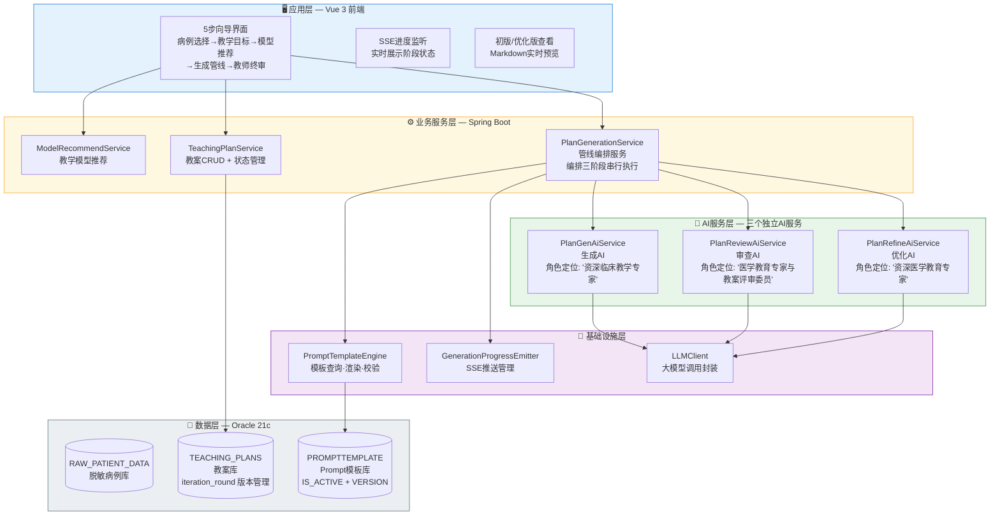
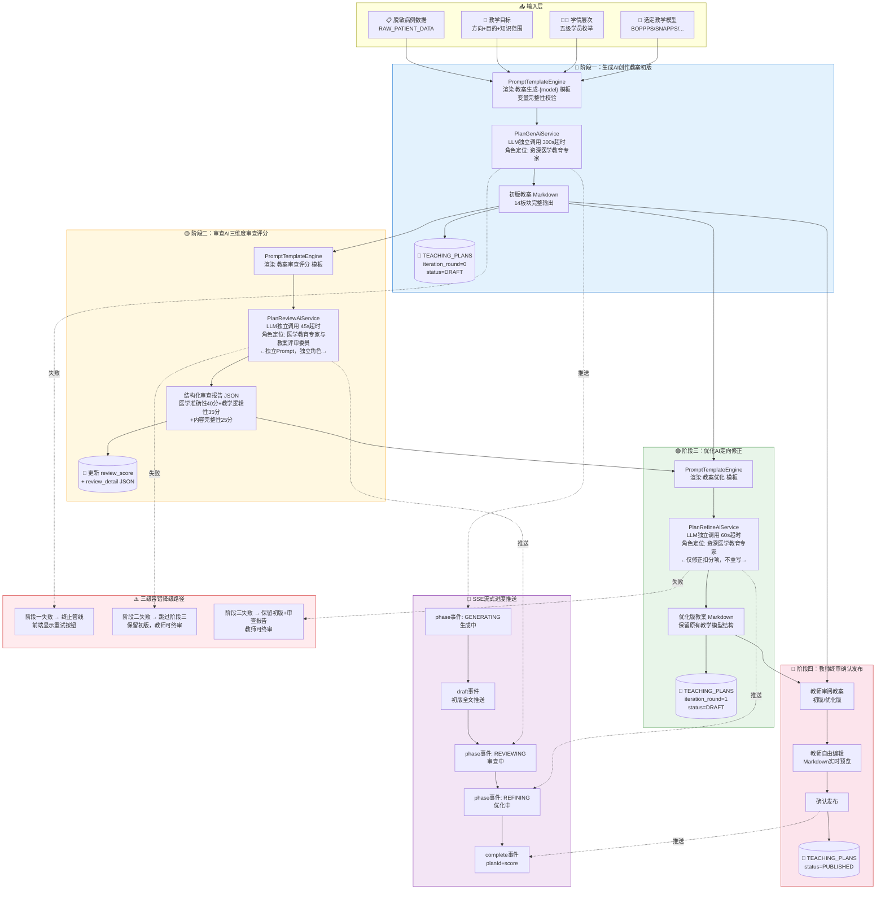
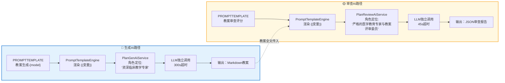
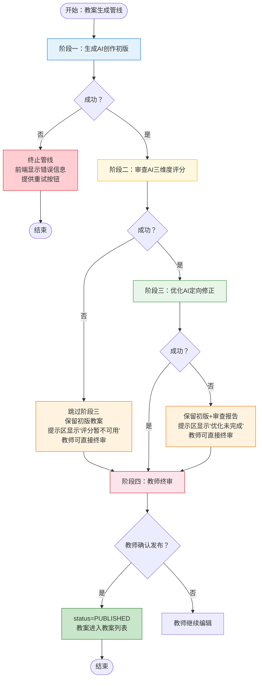
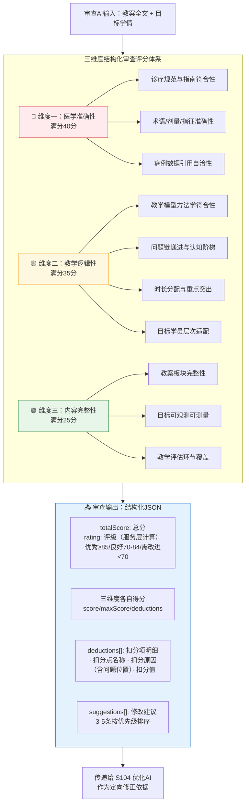
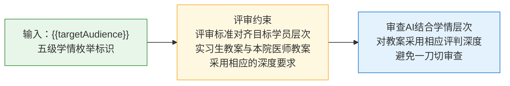

# 专利申请技术交底书

## 一、发明名称

基于 AI 双角色生成与审查的医学教案质量保障流程构建方法

---

## 二、技术领域

本发明属于医学教育与人工智能交叉技术领域，具体涉及一种基于大语言模型（Large Language Model, LLM）双角色架构的医学教案质量保障流程构建方法，通过构建"生成—审查—优化—终审"四阶段串行、以教案数据对象与审查报告数据对象为阶段间契约的自动化工件流，辅助临床教师高效生成符合医学准确性和教学规范性要求的个体化教案。

---

## 三、背景技术

### 3.1 现有技术概述

随着人工智能大语言模型在医学教育领域的应用探索日益深入，利用LLM自动生成临床教学教案已成为提升医学教育效率的重要方向。然而，LLM在生成医学教学内容时存在"幻觉"问题——即模型可能输出看似合理但实际存在医学错误、逻辑矛盾或内容遗漏的文本。在医学教育这一对准确性要求极高的领域，此类错误一旦进入课堂教学，可能误导医学生形成错误的临床认知，带来严重的教学质量和患者安全隐患。

现有技术在处理AI生成教案的质量保障方面，主要面临以下几个突出问题：

| 问题 | 具体表现 | 教学后果 |
|------|---------|----------|
| 单次生成缺乏系统性审查 | AI生成→人工审核的简单流程，教师凭个人经验审核全文，耗时30-60分钟 | 审查全面性和一致性无法保证 |
| 生成与审查共用同一AI模型 | 生成和审查使用同一模型、同一Prompt上下文，本质上是"自我审查" | 无法发现模型自身的固有偏见和知识盲区 |
| 审查标准缺乏结构化定义 | AI审查输出自然语言评论，无结构化评分维度和扣分项明细 | 教师无法快速定位问题，下游系统无法程序化消费 |
| 缺乏"审查→优化"自动化闭环 | 审查发现问题后仍需教师手动逐条修改，存在人工瓶颈 | 审查报告和教案原文之间来回对照修改，效率低下 |
| Prompt模板管理混乱 | 模板硬编码在代码中或散落在文件系统，修改需重新部署 | 缺乏统一的数据驱动模板管理、变量完整性校验和热更新机制 |
| 审查标准无法自适应多学情 | 同一病例针对不同层次学员需要不同教学深度，审查标准却一刀切 | 实习生教案被过度严苛评判，本院医师教案审查又过于宽松 |

此外，现有LLM辅助教学方案普遍停留在"单次提示词调用"层面：教案生成、质量审查、修改完善各环节孤立执行，中间结果（教案草稿、审查结论）不落库或仅供展示，下游环节无法程序化消费上游输出，流程中断后只能整体重来。这种碎片化的集成方式使AI能力难以嵌入业务流程形成稳定闭环，也无法为医学教案质量保障提供可追溯、可审计的处理链路。

### 3.2 引用文献

[1] 国家卫生健康委. 住院医师规范化培训内容与标准（2022年版）.

[2] Ma J, et al. The effectiveness of BOPPPS model in medical education: A systematic review. BMC Medical Education. 2024;24:512.

[3] Gong EJ, Bang CS, et al. Knowledge-Practice Performance Gap in Clinical Large Language Models: Systematic Review of 39 Benchmarks. J Med Internet Res. 2025;27:e84120.

[4] Liu Z, et al. IMQC: A Large Language Model Platform for Medical Quality Control. AAAI. 2025.

[5] Singhal K, et al. Large Language Models Encode Clinical Knowledge. Nature. 2023;620:172-180.

---

## 四、发明内容

### 4.1 要解决的技术问题

本申请实施例的主要目的在于提供一种医学教案质量保障流程的构建方法，解决现有大语言模型辅助教学方案以"单次提示词调用"形态组织业务所导致的流程构建缺陷：教案生成、质量审查与修改完善各环节孤立执行，环节之间缺乏数据对象契约，教案草稿与审查结论不落库或仅供展示，下游环节无法程序化消费上游输出，流程中断后只能整体重来，切换输入后残留状态污染新流程。本发明将教案质量保障过程构建为"生成—审查—优化—终审"四个串行阶段，以教案数据对象与审查报告数据对象作为阶段间的输入输出契约，配合状态持久化、三级容错降级与断点恢复机制，构成可追踪、可恢复、可审计的自动化工件流，使AI能力整体嵌入教案质量保障业务流程并形成稳定闭环。

现有技术的主要技术缺陷体现在：其一，无整体流程编排，生成、审查、修改各自独立执行，步骤间没有定义输入输出的数据关联，审查结论依赖教师人工对照教案逐条处理；其二，中间结果不落库，教案草稿与审查结论仅作展示用途，流程中断后无法从断点恢复；其三，下游环节无法程序化消费上游输出，审查报告以自然语言评论形式存在，缺乏可被程序解析的数据结构。本发明通过定义教案数据对象与审查报告数据对象两类契约载体，将各阶段输出对象持久化并绑定关联，任一阶段失败依据容错策略降级保留中间数据，从流程构建层面消除上述缺陷。

AI生成教案面临医学准确性与教学规范性的双重保障难题。现有方案中生成和审查通常共用同一AI模型，本质上是让模型"自我审查"，无法发现其自身的知识盲区和固有偏差。本发明在审查阶段构建独立的审查AI角色，与生成AI使用不同的Prompt模板和独立的LLM调用上下文，通过角色隔离实现交叉验证。审查输出的结构化审查报告并非自然语言的评分约定，而是以结构化审查数据模型（JSON Schema）约束的数据对象：审查维度、满分值与扣分项均以数据字段定义并存储于模板数据库，审查AI的输出须严格符合该数据模型约束，扣分项以结构化元素（扣分点名称、扣分原因、扣分值）产出，使审查报告可直接被下游优化阶段程序化消费，也可被前端评分面板程序化渲染；维度与分值配置随模板数据可热更新，审查标准演进无需重新部署系统。

审查发现问题之后的自动修复构成另一个技术难点。现有流程要求教师对照审查报告手动逐条修改教案，效率低下且容易遗漏。本发明引入优化AI角色，直接消费审查报告数据对象中的扣分项，对教案执行定向修正而非完全重写：粒度控制方面，优化AI仅能在审查报告指出的问题范围内做最小幅度改动，保持原有教学模型结构不变，且修正不得引入新的错误；衔接效率方面，优化阶段以教案初版数据对象与审查报告数据对象为输入，形成"发现—定位—修正"的自动化链路，避免教师在审查报告和教案原文之间反复对照。

在基础设施层面，Prompt模板的管理方式直接影响流程的可维护性与审查质量。传统做法将模板硬编码在代码中或散落在文件系统，修改需要重新部署。本发明采用数据库驱动的Prompt模板管理引擎，支持模板的增删改查、版本控制、变量完整性强制校验和运行时热更新。此外，审查标准需要随目标学员层级动态调整——同一病例的教案，面向实习生和面向本院医师应采用不同的评判尺度，审查阶段根据学情层次采用相应的审查深度，避免一刀切审查。

### 4.2 技术方案

本发明提出一种**AI双角色教案质量保障流程的构建方法**，方法的核心在于流程本身的构建方式：将教案质量保障过程划分为"生成—审查—优化—终审"四个串行阶段，以教案数据对象与审查报告数据对象作为阶段间的输入输出契约（教案对象含全文、迭代轮次与状态字段，审查报告对象遵循结构化审查数据模型约束），各阶段输出对象持久化落库并与上下游记录绑定关联，任一阶段失败依据三级容错降级策略保留中间数据、从断点继续。生成AI、审查AI、优化AI作为各阶段内的执行载体，Prompt模板与审查维度配置属于流程数据载荷的工程实现，由模板引擎统一管理。

#### 4.2.1 系统总体架构

系统采用**应用层 + 业务服务层 + 基础设施层 + 数据层**四层架构：



#### 4.2.2 AI双角色四阶段质量闭环总流程



#### 4.2.3 详细技术步骤

**总体执行流程**：本发明方法按以下方式组织各步骤——S101为初始化步骤，在系统部署时执行一次，为后续步骤建立三类独立Prompt模板及与之配套的结构化审查数据模型（审查维度、满分值与扣分规则以数据字段形式定义并存储于模板数据库，随模板数据可配置热更新）；S102至S104为串行执行的主流程，分别完成教案初版生成、三维度审查评分和定向修正；S105与S106为贯穿主流程的并行支撑步骤（进度推送与容错降级、模板渲染与变量校验）；S107为双角色Prompt隔离的实现细节说明；S108为主流程完成后的教师终审发布环节。

主流程以教案数据对象的状态流转为核心，各步骤的输入输出均为定义良好的数据结构并在数据库中持久化：

**数据对象契约定义**：本流程在阶段间传递两类核心数据对象（对应程序中的实体/DTO定义）——教案数据对象（TeachingPlan）：教案全文、迭代轮次（iteration_round，0或1）、状态（status，DRAFT/PUBLISHED）、关联病例标识、教学参数（教学模型/学情/教学方向/教学目的/知识范围）、审查数据（review_score与review_detail，审查阶段写入）；审查报告数据对象（PlanReviewReport）：总分、三维度（医学准确性/教学逻辑性/内容完整性）各自的得分与扣分项明细、修改建议列表，字段结构由结构化审查数据模型（JSON Schema）约束，审查AI的输出须严格符合该约束。教案初版（轮次0）与审查报告对象绑定持久化，优化版教案（轮次1）继承审查数据，下游阶段只程序化消费上游阶段输出的对象实例，阶段间不依赖人工转录，从而保证步骤间输入输出的确定关联。

| 步骤 | 输入数据 | 处理内容 | 输出数据（持久化状态） |
|------|---------|---------|----------------------|
| S102 | 病例标识、教学目标、学情层次、教学模型 | 模板渲染、变量校验、LLM生成、来源标识 | 教案初版（TEACHING_PLANS，iteration_round=0，status=DRAFT） |
| S103 | S102输出的教案初版全文、学情层次 | 审查模板渲染、LLM三维度审查、评分计算 | 审查报告JSON（绑定初版记录：review_score/review_detail） |
| S104 | S102输出的教案初版、S103输出的审查报告 | 优化模板渲染、LLM定向修正、篇幅约束校验 | 优化版教案（iteration_round=1，status=DRAFT，含审查数据） |
| S108 | S102教案初版与S104优化版 | 版本查看、教师编辑、确认发布 | 教案状态变更为PUBLISHED |

数据流与状态机：教案从生成到发布经历 DRAFT(round=0) → 审查绑定 → DRAFT(round=1) → PUBLISHED 的状态流转；审查报告作为独立结构化数据对象与教案记录绑定存储，被优化AI程序化消费；任一阶段失败时依据三级容错降级策略保留已持久化的中间数据，不回滚已保存结果，可从断点继续。

**S101：构建双角色Prompt模板体系。**

本步骤在模板数据库中建立三类相互独立、角色分工明确的Prompt模板，模板类型统一标识为"教学类"（teaching）：生成类模板驱动教案生成AI撰写初版教案（生成角色），审查类模板与优化类模板驱动审查AI与优化AI完成质量评分与迭代优化（审查优化角色），三者共同构成"生成—审查—优化"闭环的双角色Prompt模板体系。全部模板由开发人员与具有丰富教学工作经验的临床教师根据五种教学模型（BOPPPS/SNAPPS/PBL/CBL/翻转课堂）共同编写并持续完善——开发人员负责模板的变量设计、输出格式约束与工程化封装，临床教师负责教学模型阶段结构、教学板块内容规范与评审评价标准等教学法内容的编写及教学效果验证，保证模板既符合五种教学模型的教学法原理，又贴合临床教学实际。三类模板的具体设计如下：

（a）**生成类模板**（模板名称"教案生成-{教学模型}"）：按BOPPPS/SNAPPS/PBL/CBL/翻转课堂五种教学模型各建立一份独立模板，共5条。每条模板包含：对应教学模型的完整阶段结构指令（如BOPPPS的导入/目标/前测/参与式学习/后测/总结六环节、CBL的案例呈现/引导分析/小组讨论/总结提炼四环节）、十四个板块的详细输出规范（基本信息/教学理念/病例背景/学情分析/教学目标/教学重点与难点/教学过程设计/课程思政/教学工具与资源/PPT大纲/课后作业与延伸/思考题/教学评估/教学反思）、AI生成内容来源标记的输出规范（生成约束要求教案输出末尾以斜体来源标记（*source: AI_GENERATED*）结尾）。模板变量包括：{{caseInfo}}（脱敏病例摘要）、{{teachingModel}}（选定的教学模型名称）、{{targetAudience}}（目标学员层级）、{{teachingDirections}}（教学方向）、{{objectiveText}}（教学目的）、{{knowledgeScope}}（知识范围）。

（b）**审查类模板**（模板名称"教案审查评分"）：独立于生成模板的审查专用模板。其系统提示词将审查AI定位为"严格的医学教育专家与教案评审委员"，主要指令包括：按三维度逐项审查评分——医学准确性（满分40分，考察诊断依据、治疗方案是否符合现行诊疗规范与指南等）、教学逻辑性（满分35分，考察教学环节是否符合所选教学模型的方法学要求、问题链是否层层递进、是否适配目标学员层次等）、内容完整性（满分25分，考察教案结构板块是否完整、教学目标是否可观测可测量等）；每个维度至少列出1条扣分项（若该维度确实无可挑剔可给满分并返回空数组）；扣分原因必须引用教案中的具体内容、评审标准对齐目标学员层次。模板变量包括：{{planContent}}（待审查的教案全文）、{{targetAudience}}（目标学员层级，用于自适应调整审查深度）。

（c）**优化类模板**（模板名称"教案优化"）：独立于生成和审查模板的优化专用模板。其优化原则包括："逐条响应评审意见，每条扣分项与修改建议都必须在优化版中得到处理""保持原有结构，保留原教案的板块结构与教学模型框架，只优化内容质量""补强不推倒，原教案中未受批评的优质内容保持不变""医学准确性优先，凡涉及诊疗规范、指南依据的问题以现行指南为准修正"。模板变量包括：{{planContent}}（初版教案全文）、{{reviewReport}}（审查评分报告），优化AI基于二者输出优化后的完整教案全文与逐条对应的修改说明，完成"生成—审查—优化"闭环。

**模板隔离的技术实现**：三类模板存储在同一模板数据库中，以不同的模板名称区分，运行时由模板引擎根据模板类型和模板名称查询对应模板并分别渲染。生成模板和审查模板的系统提示词使用完全不同的角色定位描述，使得大语言模型在两次独立调用中以不同的"人格"和评判标准进行推理。

**S102：生成AI创作教案初版（第一阶段）。**

此为质量闭环的第一阶段，本步骤输入为病例标识、教学目标、学情层次与教学模型等参数，输出为教案初版（落库保存，iteration_round=0，status=DRAFT），作为S103的输入。执行流程如下：

（a）**接收教案生成请求并构建教学上下文**：教师在前端五步向导界面依次完成病例选择、教学目标设定、教学模型选择等配置后，前端向教案生成接口发起教案生成请求，请求中携带以下参数：所选病例的数据标识（前端从脱敏病例列表中选择，该标识唯一对应脱敏病例数据库中的一条病例记录）、目标学员层级（五级枚举的标识值：intern对应实习生、r1至r3对应规培一至三年级、attending对应本院医师）、教学方向、教学目的文本、知识范围说明（可选）以及选定的教学模型名称（BOPPPS/SNAPPS/PBL/CBL/翻转课堂之一）。后端接口接收请求后，根据病例数据标识调用脱敏病例数据查询模块，从脱敏病例数据库中读取该病例的脱敏记录（仅含性别、年龄、科室、诊断、手术等脱敏字段，不含任何个人身份信息），组装为病例摘要信息文本；同时将目标学员层级、教学方向、教学目的、知识范围、教学模型名称等教学参数组装为变量映射表（键名与模板占位符一一对应），供后续模板渲染使用。

（b）**生成模板渲染**：模板引擎根据模板类型"教学类"和模板名称"教案生成-{教学模型}"从模板数据库中查询对应的生成模板。通过正则表达式提取模板中所有以双花括号包裹的变量占位符，逐一校验模板变量映射表是否覆盖全部声明变量（缺失任何变量均中止本次渲染并返回缺失变量清单）。校验通过后执行变量替换，将模板变量映射表中的实际内容填入各占位符，生成完整的生成提示文本。

（c）**大语言模型生成教案**：通过生成AI服务将渲染后的生成提示文本发送至大语言模型。采用流式同步调用（默认300秒超时，超时时间可配置），要求大语言模型按Markdown结构化格式输出教案全文。

（d）**来源标识输出规范**：生成模板的生成约束要求大语言模型在教案输出末尾附带"AI生成"斜体来源标记，该标记随教案正文一同保存并在前端展示中保持可见，用于区分AI生成内容与人工编写内容。审查与优化阶段的输出由业务服务层统一标注来源标识后返回。

（e）**初版持久化**：将生成AI创作的教案初版保存至教案数据库表（迭代轮次记为0，状态为草稿），作为S103审查和S104优化的基线版本，本步骤输出的教案初版文本作为S103的输入。初版落库后立即通过进度推送通道将教案标识与全文推送给前端，前端先行展示初版，无需等待后续审查与优化阶段完成。

**S103：审查AI三维度审查评分（第二阶段）。**

此为质量闭环的第二阶段，是双角色架构的创新点所在。本步骤以S102输出的教案初版全文为输入，输出结构化审查报告（与初版记录绑定持久化），作为S104的输入：

（a）**审查模板渲染**：模板引擎根据模板类型"教学类"和模板名称"教案审查评分"从模板数据库中查询审查专用模板（与S102的生成模板完全独立）。将{{planContent}}替换为S102生成的教案全文，将{{targetAudience}}替换为目标学员层级标识。

（b）**三维度审查体系定义**：审查AI按照以下三维度评分体系进行逐项审查：

- **维度一：医学准确性（满分40分）**。审查子维度包括：诊断依据与治疗方案是否符合现行诊疗规范与指南、医学术语/药物剂量/检查指征是否准确、病例数据引用是否自洽（有无医学常识性错误）。

- **维度二：教学逻辑性（满分35分）**。审查子维度包括：教学环节设计是否符合所选教学模型的方法学要求、问题链/活动链是否层层递进并符合认知阶梯、各环节时长分配是否合理且重点突出、教案内容是否适配目标学员层次。

- **维度三：内容完整性（满分25分）**。审查子维度包括：教案结构板块是否完整（教学目标/重点难点/教学过程/教学评估等）、教学目标是否可观测可测量、是否包含教学评估环节。

上述三维度及其满分值、扣分规则并非静态的评审约定，而是以结构化审查数据模型形式预定义并存储于模板数据库：每个维度对应maxScore（满分）、score（得分）、deductions（扣分项数组）等数据字段，审查AI的输出须严格符合该数据模型约束（JSON Schema），扣分项以结构化元素（扣分点名称、扣分原因、扣分值）产出，直接供下游优化AI与前端评分面板程序化消费；维度与分值配置随模板数据可热更新，调整审查标准无需重新部署系统。

**三维度审查的具体实现方式**：

其一，**审查指令的结构化设计**。审查模板按三个维度分别列出审查要点，每个维度独立配置评分区段（医学准确性40分、教学逻辑性35分、内容完整性25分）与扣分项列表结构，审查AI逐条执行各维度下的核查要点，判定为有问题的项目即生成对应扣分项；模板同时规定每个维度至少列出1条扣分项（若该维度确实无可挑剔可给满分并返回空数组），确保审查覆盖不留空白。审查AI须为每个扣分项给出确定的扣分值并说明理由。

其二，**医学事实核查的实现**。审查AI基于大语言模型内置的医学知识进行事实比对：将教案中的诊断依据、治疗方案、药物剂量、检查指征等关键医学表述，与现行诊疗规范和临床知识逐一比对，发现不一致即判定为医学错误；扣分原因必须引用教案中的具体内容作为证据，禁止笼统表述，从而保证审查结论可追溯、可复核。

其三，**评分计算规则**。各维度得分等于该维度满分减去该维度所有扣分项扣分值之和，不得为负数；总分等于三个维度得分之和。审查AI输出各维度得分与总分后，由业务服务层按总分划分评级：优秀（85分及以上）、良好（70至84分）、需改进（70分以下），评级不依赖大语言模型的自我判断。

其四，**结构化输出约束**。审查模板要求大语言模型仅输出一个结构化JSON对象（禁止输出JSON之外的任何文字），报告字段包括总分、三个维度各自的得分与扣分项明细、修改建议列表；每个扣分项包含扣分点名称、扣分原因、扣分值三个要素，其中扣分原因须具体指出问题位置与内容；修改建议提供3至5条、按优先级排序、每条聚焦一个可执行改进点。该结构化报告直接作为S104优化阶段的输入。

（c）**学情层次感知的自适应审查**：审查模板中嵌入了目标学员层级的上下文信息（{{targetAudience}}），并在评审约束中明确规定"评审标准对齐目标学员层次：对实习生教案与对本院医师教案采用相应的深度要求"。审查AI读取目标学员层级取值，结合该约束对教案采用与学员层次相称的评判深度——低层级学员教案侧重基础流程与知识正确性的核查，高层级学员教案则按更严格的诊疗规范遵循与临床决策深度要求进行评价，避免一刀切审查。

（d）**大语言模型审查调用**：通过审查AI服务（独立的AI服务，与生成AI使用不同的Prompt模板，角色定位为"严格的医学教育专家与教案评审委员"）将渲染后的审查提示文本发送至大语言模型。采用流式同步调用（45秒超时），要求大语言模型仅输出结构化JSON格式的审查报告。

（e）**审查报告结构**：审查AI输出的结构化审查报告包含：总分、医学准确性维度（得分与扣分项明细）、教学逻辑性维度（得分与扣分项明细）、内容完整性维度（得分与扣分项明细）、修改建议列表；评级由业务服务层按总分计算（优秀85分及以上/良好70至84分/需改进70分以下）。每个扣分项包含扣分点名称、扣分原因（须具体指出问题位置与内容）、扣分值三个要素。

（f）**审查结果持久化**：将审查报告（审查评分与审查明细）更新至S102保存的教案初版记录，使初版教案与审查报告绑定保存。本步骤输出的审查报告作为S104的输入，为优化AI的定向修正提供准确指引。

**S104：优化AI定向修正教案（第三阶段）。**

此为质量闭环的第三阶段，本步骤以S102输出的教案初版和S103输出的审查报告为输入，输出优化版教案（落库保存，iteration_round=1，status=DRAFT），作为S108的输入，仅执行一轮自动优化：

（a）**优化模板渲染**：模板引擎根据模板类型"教学类"和模板名称"教案优化"从模板数据库中查询优化专用模板（与S102生成模板和S103审查模板完全独立）。将{{planContent}}替换为初版教案全文，将{{reviewReport}}替换为S103输出的审查报告。

（b）**定向修正约束机制**：优化提示文本中嵌入了四条优化原则——①逐条响应原则："评审报告中的每条扣分项与修改建议都必须在优化版中得到处理"；②保持结构原则："保留原教案的Markdown板块结构与教学模型框架，只优化内容质量"；③补强不推倒原则："原教案中未受批评的优质内容保持不变，避免为了修改而修改"；④医学准确性优先原则："凡涉及诊疗规范、指南依据的问题，以现行指南为准修正"。另附篇幅约束：优化后教案总篇幅与原教案相当（浮动不超过20%），不得降低原教案中与评审无关部分的质量。

（c）**大语言模型优化执行**：通过优化AI服务（独立的AI服务）将渲染后的优化提示文本发送至大语言模型。采用流式同步调用（60秒超时），要求大语言模型仅输出一个结构化JSON对象（禁止输出JSON之外的任何文字），包含优化后的教案全文（保持原板块结构，末尾保留AI生成来源斜体标记）与逐条修改说明（3至8条，每条对应评审报告中的问题），由业务服务层解析后分离出教案全文与修改说明。

（d）**优化后教案持久化**：将优化后的教案保存至教案数据库表的新记录（迭代轮次记为1，状态为草稿），同时将S103的审查评分与审查明细一并保存至该记录，与初版教案（迭代轮次为0，含审查评分）共存，支持教师在前端查看两版教案内容。

（e）**单轮优化约束**：仅执行一轮自动优化（迭代轮次最大为1）。设计理由：多轮优化边际收益递减，一轮已可覆盖主要扣分项；最终决定权交还教师在S108终审环节。

**S105：管线容错降级与进度推送。**本步骤为贯穿S102至S104的并行支撑步骤：

（a）**服务端事件流式进度推送**：前端发起教案生成请求后先获得携带流标识的进度流地址，随后由前端浏览器主动建立服务端事件流连接；管线线程在启动后等待该连接就绪（最多等待10秒，超时则管线继续执行但不推送进度），连接空闲超时上限为10分钟。S102至S104各阶段执行时实时向前端推送进度事件：阶段事件（生成中→审查中→优化中→已完成，携带阶段名称与提示消息）、初版事件（S102初版落库后携带教案标识与教案全文）、完成事件（携带教案标识与审查评分）、错误事件（携带失败阶段与错误消息）。前端收到事件后实时更新步骤条和进度状态展示，使教师全程掌握管线执行进度。

（b）**三级容错降级策略**：
- 阶段一（生成初版）失败：终止管线，不执行后续阶段，通过错误事件向前端推送失败消息。前端显示错误信息和"重试"按钮，教师可重新发起生成请求。
- 阶段二（审查评分）失败：跳过阶段三优化，推送"评分暂不可用"错误事件后直接推送完成事件，前端展示初版教案进入S108终审。
- 阶段三（优化教案）失败：推送"优化未完成"错误事件后仍推送完成事件（携带初版教案标识），保留初版教案和审查评分结果，教师仍可进入S108终审。

（c）**基本处理原则**：所有失败不回滚已保存的中间数据。阶段二或阶段三失败时，已完成的阶段数据完整保留在数据库中。

**S106：模板数据库驱动引擎。**本步骤为S102至S104共用的支撑步骤，为模板查询、渲染和变量校验提供统一机制：

（a）**数据库存储**：所有Prompt模板存储在模板数据库表中，主要字段包括：模板标识、模板类型（统一为"教学类"）、模板名称、模板内容（大文本字段）、过滤规则、所需数据类型、启用标记、版本号、适用范围。

（b）**模板查询与渲染接口**：模板引擎封装模板数据访问模块，对外提供三类操作：模板内容查询（仅返回模板文本）、模板渲染（执行查询→变量校验→变量替换的完整流程）、变量校验（仅校验变量覆盖情况，不执行渲染）。

（c）**变量完整性强制校验**：模板渲染操作执行前，强制遍历模板中所有以双花括号包裹的变量占位符，与调用方提供的模板变量映射表逐一比对，任何缺失变量均中止渲染并返回参数异常，异常信息中列出所有缺失变量名。

（d）**模板热更新机制**：模板存储在数据库中，通过启用标记字段控制启用状态，更新数据库记录后即时生效，无需重新部署应用。

**S107：双角色Prompt隔离的实现细节。**本步骤说明S102生成AI与S103审查AI之间角色隔离的具体实现：

（a）**系统提示词角色差异**：生成AI的系统提示词将其定位为"资深的临床教学专家，精通所选教学模型"（协作式），审查AI的系统提示词将其定位为"严格的医学教育专家与教案评审委员"（批判式）。通过以不同模板名称查询不同模板来实现角色隔离。

（b）**大语言模型调用上下文隔离**：生成AI和审查AI使用两次独立的大语言模型调用，不共享调用历史或上下文状态，审查AI无法感知生成AI的推理过程，只能基于教案文本本身进行评判。

（c）**输出格式区分**：生成AI输出自然语言教案全文；审查AI输出结构化JSON审查报告。两种完全不同的输出格式进一步强化双角色的功能边界。

**S108：教师终审确认发布（第四阶段）。**

此为质量闭环的第四阶段，属于人工把关环节，本步骤以S102输出的教案初版和S104输出的优化版教案为输入，输出教案发布状态（status由DRAFT变更为PUBLISHED），执行流程如下：

（a）**初版与优化版查看**：教案初版在生成阶段经SSE推送即时展示，教师无需等待审查与优化完成即可先行阅读；优化版生成后前端提示"AI 优化版教案已生成"，由教师主动选择加载，加载后教案全文更新为优化版并标注迭代轮次；审查评分面板可随时展开，同步展示S103输出的总分、三维度得分和扣分项明细，使教师明确了解优化版改动对应的审查依据。

（b）**教师自由编辑**：教师以生成阶段选定加载的版本（初版或优化版）为编辑底稿进行直接编辑，编辑界面支持全文本编辑与分段编辑两种模式，分段编辑按Markdown标题切分板块、逐段渲染预览，教案内容即时渲染为格式化视图；教师结合审查报告判断是否采纳优化结果。

（c）**确认发布**：教师确认教案内容无误后点击发布，系统将教案状态由草稿变更为已发布，教案进入教案列表供课堂教学使用；若教师认为仍需修改，可继续编辑，教案保持草稿状态，不进入教案列表。

（d）**发布记录**：发布时系统将教案状态由草稿变更为已发布并自动记录更新时间戳，教案的AI生成来源标识在终审界面全程可见，供后续追溯。

**S109：数据安全与合规保障。**

（a）全链路PII脱敏：教案生成全链路不接触原始个人身份信息，仅使用脱敏字段。
（b）AI调用路径安全：教案生成的大语言模型调用统一经执行服务器的代理端点转发至模型服务商，代理链路使用内部认证令牌与来源IP白名单双重校验，主服务器不直接持有模型服务商的访问凭证。
（c）日志安全约束：日志禁止包含病例摘要信息和教案全文的具体内容。
（d）AI生成内容标识：生成模板要求输出内容末尾附带"AI生成"斜体来源标记，审查与优化输出由业务服务层统一标注来源标识，保证AI生成内容可识别、可追溯。

### 4.3 有益效果

与现有技术相比，本发明具有以下有益效果。

第一，本发明提供了一种可追踪、可恢复的自动化工件流构建方法。教案质量保障过程被组织为"生成—审查—优化—终审"四个串行阶段，以教案数据对象与审查报告数据对象为阶段间输入输出契约，阶段间的数据关联由对象字段定义与绑定关系显式确定，不再依赖人工转录；教案初版、审查报告、优化版教案均落库持久化并绑定关联，状态流转（DRAFT→审查绑定→DRAFT(1)→PUBLISHED）全程可审计；任一阶段失败均按三级容错策略保留中间数据，从断点继续而非整体重来，克服了单次调用式AI方案中中间结果不可追溯、流程中断后无法恢复的缺陷。

第二，双角色交叉验证消除了单模型自我审查的盲区。生成AI和审查AI各自加载独立的Prompt模板，在互不共享调用上下文的前提下分别以"资深临床教学专家"和"医学教育专家与教案评审委员"的身份进行推理。审查AI以批判式视角审视生成AI的输出，能有效捕获单一模型无法自查的固有偏差和知识盲区。审查报告以结构化审查数据模型（JSON Schema）约束输出：医学准确性（40分）、教学逻辑性（35分）、内容完整性（25分）三维度及各维度扣分项均以数据字段定义，每项扣分包含扣分点名称、扣分原因（注明问题位置与内容）和扣分值。该结构化数据对象可直接被下游的优化AI程序化消费，形成"发现—定位—修正"的自动化链路，省去了教师在审查报告和教案原文之间来回对照的重复劳动；维度与分值配置随模板数据可热更新，审查标准演进无需重新部署系统。

第三，优化AI采用定向修正而非完全重写的策略，保住了教师原有的教学意图。优化Prompt中嵌入了四条优化原则：逐条响应评审意见、保持原有结构、补强不推倒、医学准确性优先，并规定优化后篇幅与原教案相当（浮动不超过20%）。教师通过生成界面先后查看初版与优化版全文，配合审查评分面板了解每一处改动对应的审查依据，决定采纳优化结果或继续使用初版。

第四，审查标准根据目标学员层级自适应调整。审查AI从Prompt中的{{targetAudience}}变量感知学情层次（实习生至本院医师五个级别），依据"评审标准对齐目标学员层次"的评审约束采用与学员层次相称的审查深度——低层级学员教案按基础要求评判，高层级学员教案按更严格的规范遵循与决策深度要求评判，避免了现有方案中一刀切的审查方式。

第五，数据库驱动的Prompt模板引擎使模板修改不再依赖应用重新部署。模板通过启用标记控制灰度切换，版本号记录版本演进，渲染前强制校验变量完整性，数据库记录更新后即时生效。配合SSE流式进度推送和三级容错降级策略——阶段一失败终止管线并提示重试，阶段二失败跳过优化但保留初版供终审，阶段三失败保留初版和审查报告——系统在异常场景下仍能向教师交付可用的教案。所有失败场景均不回滚已保存的中间数据。

第六，全部Prompt模板由开发人员与具有丰富教学工作经验的临床教师根据五种教学模型共同编写并持续完善：临床教师将临床教学实践沉淀的教学模型阶段结构、十四个教学板块的内容规范与三维度评审评价标准编写进模板，开发人员负责模板的变量设计、输出格式约束与工程化封装，从模板源头保障AI生成教案的教学法规范性；模板存储于数据库提示词模板表，随教学实践反馈在线更新热生效，持续迭代完善。

第七，审查标准与数据模型随模板数据可配置热更新。三维度的满分值、扣分规则与审查深度约束以数据字段形式存储于模板数据库，随模板数据在线更新即时生效，无需重新部署应用，支持审查标准随教学实践持续演进。

---

## 五、附图说明

### 图1：AI双角色四阶段质量闭环总流程图

（见 4.2.2 节 Mermaid 流程图，展示从脱敏病例数据输入→生成AI创作初版→审查AI三维度评分→优化AI定向修正→教师终审发布的完整闭环，含SSE进度事件推送和三级容错降级路径。）

### 图2：系统四层架构图

（见 4.2.1 节 Mermaid 架构图，展示应用层→业务服务层→AI服务层（三个独立AI服务）→基础设施层→数据层的完整架构及组件间调用关系。）

### 图3：生成AI与审查AI的Prompt隔离机制示意图



### 图4：管线三级容错降级策略决策流程图



### 图5：三维度审查评分体系结构图



### 图6：学情层次自适应审查标准机制示意图



---

## 六、具体实施方式

### 6.1 实施环境

| 组件 | 技术选型 |
|------|---------|
| 前端框架 | Vue 3 + Options API + Element Plus 2.10.2 |
| 后端框架 | Java 21 + Spring Boot 3.5.8 |
| AI框架 | LlmClient 流式调用 + DeepSeek 大模型 |
| 数据库 | Oracle 21c |
| Prompt模板存储 | PROMPTTEMPLATE表（CLOB字段） |
| 实时推送 | SSE（Server-Sent Events） |

### 6.2 核心Prompt模板设计

系统包含三类Prompt模板（模板类型"教学类"），存储于模板数据库表：

| 模板名称 | 对应AI角色 | 对应步骤 | 角色定位 | 输出格式 |
|-----------|-----------|---------|------------------|---------|
| 教案生成-BOPPPS | 生成AI | S102 | 资深临床教学专家（精通对应教学法） | Markdown教案 |
| 教案生成-SNAPPS | 生成AI | S102 | 资深临床教学专家（精通对应教学法） | Markdown教案 |
| 教案生成-PBL | 生成AI | S102 | 资深临床教学专家（精通对应教学法） | Markdown教案 |
| 教案生成-CBL | 生成AI | S102 | 资深临床教学专家（精通对应教学法） | Markdown教案 |
| 教案生成-翻转课堂 | 生成AI | S102 | 资深临床教学专家（精通对应教学法） | Markdown教案 |
| 教案审查评分 | 审查AI | S103 | 严格的医学教育专家与教案评审委员 | JSON审查报告 |
| 教案优化 | 优化AI | S104 | 资深的医学教育专家 | JSON（教案全文+修改说明） |

**模板设计原则**：
1. 生成模板与审查模板的角色定位完全不同，使得大语言模型以不同"人格"推理
2. 所有模板使用`{{变量}}`形式的占位符，由模板引擎在运行时渲染
3. 渲染前强制校验所有声明变量是否存在，缺失即中止渲染并返回缺失变量清单
4. 模板支持启用标记灰度切换和版本号版本控制
5. 全部模板由开发人员与具有丰富教学工作经验的临床教师根据五种教学模型共同编写并持续完善，教学模型阶段结构、教学板块规范与三维度评审标准均经临床教学实践验证

### 6.3 管线编排伪代码

前端组件调用PlanGenerationService的核心编排逻辑：

```java
// PlanGenerationService.generatePipeline() 核心编排
public void generatePipeline(Long rawDataId, String teachingModel, ...) {
    // 先完成数据准备，为前端建立 SSE 连接争取时间
    String caseInfo = buildCaseSummary(rawDataId);
    Map<String, String> variables = buildCommonVariables(caseInfo, teachingModel, ...);

    // 等待前端 SSE 连接就绪（最多 10 秒），连接后开始推送进度
    SseEmitter emitter = progressEmitter.waitForEmitter(streamKey, 10_000L);
    if (emitter != null) {
        emitter.sendPhase("GENERATING", "AI 正在生成结构化教案初版...");
    }

    // 阶段一：生成AI创作初版（模板渲染 → LLM生成 → 保存round=0）
    String genPrompt = promptEngine.render("teaching", "教案生成-" + teachingModel, variables);
    String draftPlan = genAiService.generatePlan(genPrompt);
    TeachingPlan plan = savePlan(draftPlan, iterationRound=0, status=DRAFT);
    emitter.sendDraft(plan.getId(), draftPlan); // 初版落库后立即推送全文

    // 阶段二：审查AI三维度审查评分
    try {
        PlanReviewResponse reviewResp = planReviewService.review(draftPlan, targetAudience);
        double reviewScore = reviewResp.getTotalScore();
        String reviewJson = toJson(reviewResp);
        updateReviewScore(plan, reviewScore, reviewJson);
        emitter.sendPhase("REVIEWING", "AI 正在审查评分...");
    } catch (Exception e) {
        logger.warn("审查失败，跳过阶段三: planId={}", plan.getId(), e);
        emitter.sendError("REVIEWING", "评分暂不可用: " + e.getMessage());
        emitter.sendPhase("COMPLETED", "完成");
        emitter.sendComplete(plan.getId(), null, null);
        return; // 三级降级：保留初版，教师可终审
    }

    // 阶段三：优化AI定向修正
    try {
        PlanRefineResponse refineResp = planRefineService.refine(draftPlan, reviewJson);
        TeachingPlan refined = savePlan(refineResp.getRefinedContent(),
                iterationRound=1, reviewScore=reviewScore, reviewDetail=reviewJson);
        emitter.sendPhase("REFINING", "AI 正在根据评分优化教案...");
        emitter.sendPhase("COMPLETED", "完成");
        emitter.sendComplete(refined.getId(), reviewScore, null);
    } catch (Exception e) {
        logger.warn("优化失败，保留初版和审查报告: planId={}", plan.getId(), e);
        emitter.sendError("REFINING", "优化未完成: " + e.getMessage());
        emitter.sendPhase("COMPLETED", "完成（初版）");
        emitter.sendComplete(plan.getId(), reviewScore, null); // 三级降级：保留初版+审查报告
    }
}
```

---

## 七、权利要求

### 7.1 方法权利要求

**权利要求1**：一种基于AI双角色生成与审查的医学教案质量保障流程构建方法，其特征在于，包括以下步骤：

S1：构建流程数据对象契约与状态载体——定义教案数据对象（含教案全文、迭代轮次、状态字段）与审查报告数据对象（遵循结构化审查数据模型约束，含总分、三维度得分与扣分项明细、修改建议列表），并在数据库中建立持久化存储与状态机（DRAFT(0)→审查绑定→DRAFT(1)→PUBLISHED）；

S2：编排生成阶段——接收教案生成请求（病例标识、教学目标、学情层次、教学模型），调用生成AI服务生成教案初版，封装为教案数据对象（迭代轮次0、状态DRAFT）落库，输出教案初版数据对象作为S3的输入；

S3：编排审查阶段——以S2输出的教案初版数据对象为输入，调用审查AI服务按结构化审查数据模型执行三维度审查评分，输出审查报告数据对象并与教案初版记录绑定持久化，作为S4的输入；

S4：编排优化阶段——以S2输出的教案初版数据对象与S3输出的审查报告数据对象为输入，调用优化AI服务执行定向修正，输出优化版教案数据对象（迭代轮次1、状态DRAFT，继承审查数据）落库，作为S5的输入；

S5：编排终审阶段——以教案初版与优化版数据对象驱动教师查看、编辑与确认发布，将教案状态由DRAFT变更为PUBLISHED；

S6：容错降级与断点恢复——任一步骤失败时保留已持久化的中间数据对象，依据失败阶段执行对应降级策略：生成阶段失败终止流程，审查阶段失败跳过优化阶段并保留初版教案，优化阶段失败保留初版教案与审查报告；所有失败不回滚已保存的中间数据，可从断点继续。

**权利要求2**：根据权利要求1所述的方法，其特征在于，步骤S2和S3中，生成AI和审查AI使用两次独立的LLM调用，不共享调用历史或上下文状态；生成AI的Prompt模板中角色定位为"资深的临床教学专家"（协作式），审查AI的Prompt模板中角色定位为"严格的医学教育专家与教案评审委员"（批判式），通过角色定位的差异化实现交叉验证。

**权利要求3**：根据权利要求1所述的方法，其特征在于，步骤S3中，结构化审查数据模型以数据字段定义三维度（医学准确性满分40分、教学逻辑性满分35分、内容完整性满分25分）及各维度的扣分项数组，审查AI的输出须严格符合该数据模型的JSON Schema约束，每个扣分项包含扣分点名称、扣分原因（注明问题位置与内容）和扣分值三个要素，各维度得分等于该维度满分减去扣分项扣分值之和，不得为负数，总分等于三维度得分之和，评级由业务服务层按总分计算而非依赖大语言模型自报。

**权利要求4**：根据权利要求1所述的方法，其特征在于，步骤S3中，审查AI根据目标学员层级感知变量（实习生/规培一~三年级/本院医师）采用与学员层级相称的审查深度——低层级学员教案按基础要求评判，高层级学员教案按更严格的标准评判，避免一刀切审查。

**权利要求5**：根据权利要求1所述的方法，其特征在于，步骤S4中，优化AI在"逐条响应评审意见""保持原有结构""补强不推倒""医学准确性优先"四条优化原则约束下执行定向修正，仅执行一轮自动优化（迭代轮次最大为1），最终决定权交还教师在步骤S5终审。

**权利要求6**：根据权利要求1所述的方法，其特征在于，步骤S6中，审查阶段失败时跳过优化阶段并推送"评分暂不可用"错误事件后直接推送完成事件，前端展示初版教案进入终审；优化阶段失败时推送"优化未完成"错误事件后仍推送完成事件（携带初版教案标识），保留初版教案和审查评分结果，教师仍可进入终审。

**权利要求7**：根据权利要求1所述的方法，其特征在于，还包括服务端事件流式进度推送机制，通过进度推送组件在S2-S4各阶段执行时实时向前端推送生成中→审查中→优化中→已完成进度事件，以及初版事件（初版落库后携带教案标识与全文）与完成事件（携带教案标识与审查评分）。

**权利要求8**：根据权利要求1所述的方法，其特征在于，步骤S2至S4中各阶段使用的Prompt模板存储在模板数据库表中，支持启用标记灰度切换和版本号版本控制；模板渲染前通过正则提取全部双花括号变量占位符并与调用方提供的变量映射表逐一比对，任何缺失变量均抛出异常并列出缺失变量名；审查维度与满分值配置随模板数据可热更新。

### 7.2 系统权利要求

**权利要求9**：一种基于AI双角色生成与审查的医学教案质量保障流程构建系统，其特征在于，包括：

教案数据对象管理模块，用于定义并持久化教案数据对象（含教案全文、迭代轮次与状态字段），管理DRAFT→审查绑定→DRAFT(1)→PUBLISHED的状态迁移；

审查报告数据对象管理模块，用于按结构化审查数据模型定义并持久化审查报告对象（总分、三维度得分与扣分项明细、修改建议列表）；

生成AI服务模块，用于加载生成Prompt模板并调用大语言模型生成教案初版，封装为教案数据对象；

审查AI服务模块，用于加载独立于生成模块的审查Prompt模板并调用大语言模型进行三维度结构化审查评分，输出审查报告数据对象；

优化AI服务模块，用于加载优化Prompt模板并基于教案初版数据对象与审查报告数据对象调用大语言模型进行定向修正；

Prompt模板引擎模块，用于查询、渲染和校验模板数据库表中的三类模板；

流程编排模块，用于编排生成→审查→优化→终审四阶段串行执行，管理数据对象在阶段间的流转与绑定、SSE进度推送和三级容错降级；

其中，所述生成AI服务模块与审查AI服务模块使用不同的Prompt模板角色定位和独立的LLM调用上下文。

**权利要求10**：根据权利要求9所述的系统，其特征在于，所述审查AI服务模块输出的审查报告数据对象遵循结构化审查数据模型的JSON Schema约束，扣分项以结构化元素（扣分点名称、扣分原因、扣分值）产出，被所述优化AI服务模块程序化消费以执行定向修正。

---

## 八、技术效果对比

| 对比维度 | 现有技术 | 本发明 |
|---------|---------|--------|
| 审查方式 | 人工经验审核（30-60分钟/份） | AI双角色交叉验证（生成AI+审查AI独立调用） |
| 审查标准 | 主观自然语言评论 | 三维度（医学40+教学35+内容25）结构化JSON评分 |
| 自我审查盲区 | 存在（生成和审查共用同一模型） | 消除（独立Prompt+独立调用+角色差异化） |
| 审查→优化 | 手动逐条修改，人工瓶颈 | 基于审查报告的自动定向修正 |
| 多学情适配 | 一刀切审查标准 | 五级学情自适应审查标准动态调整 |
| Prompt管理 | 硬编码/文件散落，修改需部署 | 数据库驱动，IS_ACTIVE灰度切换+热更新 |
| 变量完整性 | 无校验，占位符可能未替换 | 强制校验，缺失即抛异常并列出缺失变量名 |
| 失败处理 | 全部丢弃，需重新开始 | 三级降级，中间结果不丢失 |
| 进度可见性 | 长时间无反馈等待 | SSE流式推送实时进度 |
| 数据对象契约 | 审查结论为自然语言、无法程序化消费 | 教案对象+审查报告对象结构化契约、绑定持久化 |
| 模板扩展性 | 单场景定制 | PromptTemplateEngine按类型/名称通用管理，支持新增场景扩展 |
| 流程组织 | 单次调用、环节脱节、中间数据不落库 | 四阶段串行工件流、数据对象契约明确、状态持久化可断点恢复 |

---

## 九、发明人信息

| 角色 | 姓名/单位 | 贡献说明 |
|------|----------|---------|
| 发明负责人 | 刘朝晖 | 成都市第五人民医院心血管一病区临床医师，主导AI双角色架构设计、Prompt模板工程、三维度审查评分体系设计 |
| 产学研合作方 | 西南科技大学 | 军民融合研究院，参与技术合作与产学研转化 |

---

## 十、附件清单

```
附件1  后端源代码：
       - PlanGenAiService.java（生成AI接口）
       - PlanReviewAiService.java（审查AI接口）
       - PlanRefineAiService.java（优化AI接口）
       - PlanGenerationService.java（管线编排服务）
       - PlanReviewService.java（审查评分编排）
       - PlanRefineService.java（优化编排）
       - PromptTemplateEngine.java（模板引擎）
       - GenerationProgressEmitter.java（SSE进度推送）

附件2  Prompt模板文件（7个）：
       - 教案生成-BOPPPS / 教案生成-SNAPPS / 教案生成-PBL / 教案生成-CBL / 教案生成-翻转课堂
       - 教案审查评分
       - 教案优化

附件3  前端源代码：
       - PlanCreate.vue（5步向导界面）
       - StepFinalReview.vue（终审编辑界面）
       - TeachingPlanView.vue（教案详情查看界面）

附件4  迭代技术文档：
       - 教案生成-已实现功能清单.md
       - 教案生成AI闭环实现方案.md
       - 教案生成模块-TDD实施指南.md
       - 教案生成模块关注点分离设计方案.md

附件5  Git提交历史记录
附件6  系统运行界面截图
```
