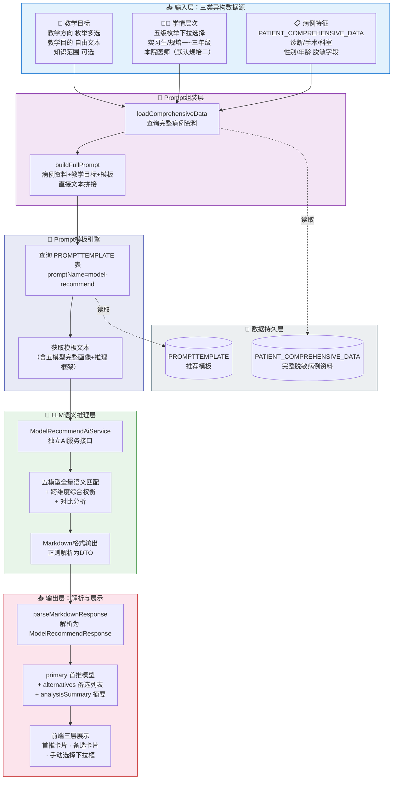
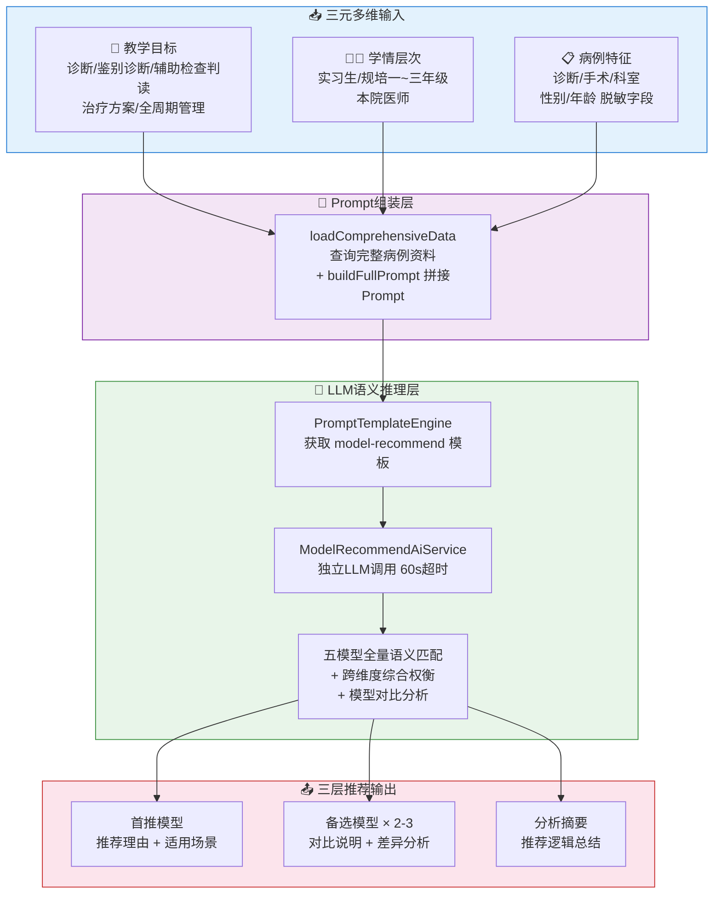
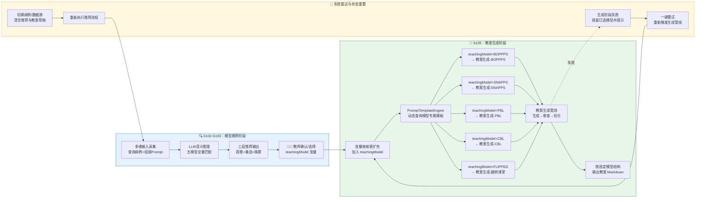
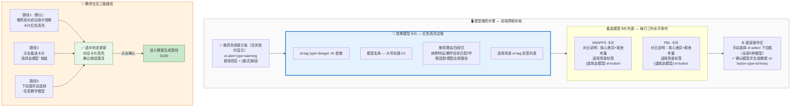
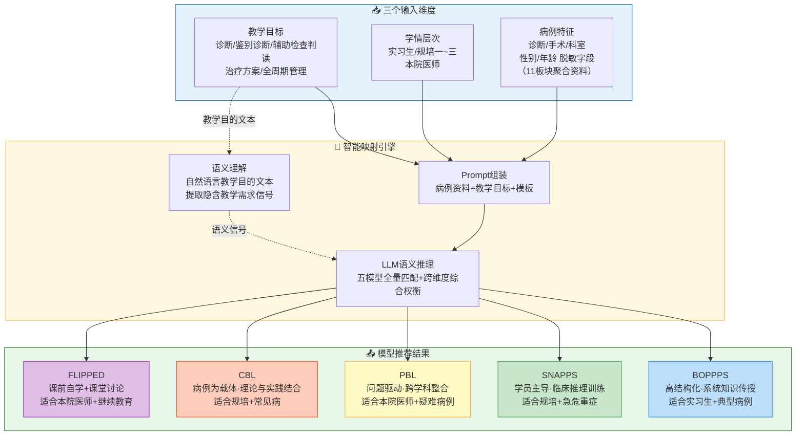

# 专利申请技术交底书

## 一、发明名称

基于多维输入的 AI 教学模型自动推荐方法

---

## 二、技术领域

本发明属于医学教育与人工智能交叉技术领域，具体涉及一种基于大语言模型（Large Language Model, LLM）的教学模型自动推荐方法，用于根据教学目标、学情层次和病例特征三个维度的输入信息，自动为临床教师推荐最优教学模型并输出备选方案对比分析。

---

## 三、背景技术

### 3.1 现有技术概述

在医学教育领域，存在多种成熟的临床教学模型，如BOPPPS模型（导言-目标-前测-参与式学习-后测-总结，适合系统化理论授课）、SNAPPS模型（总结-缩小-分析-探究-计划-选择，适合学员主导的临床推理训练）、PBL模型（以问题为导向的小组学习）、CBL模型（以病例为基础的教学）和翻转课堂（课前自学+课堂讨论）等。不同教学模型在教学目标达成、学情适配、病例类型匹配等方面各有优劣，选择合适的教学模型是决定教案质量和教学效果的关键前提。

然而，现有技术在教学模型选择方面主要面临以下几个突出问题：

| 问题 | 具体表现 | 教学后果 |
|------|---------|----------|
| 完全依赖教师主观经验 | 多数教师仅熟悉一两种惯用模型，对其他模型了解有限 | 模型选择范围狭窄，无法针对特定病例做出最优选择 |
| 缺乏多维输入→模型的自动化映射 | 教学目标×学情×病例存在复杂交互，现有技术无法自动综合 | 同一病例针对不同学情无法差异化推荐 |
| 同质化推荐无法"优中选优" | 仅输出单一推荐结果，无备选方案和对比分析 | 教师缺乏充分比较信息来支撑决策 |
| 纯规则引擎无法处理语义差异 | if-else规则数量呈指数增长（5×5×N），且无法理解语义细微差异 | "急性"暗示需快速决策等语义信息被忽略 |
| 推荐结果缺乏可解释性 | AI推荐为"黑箱"输出，教师无法理解推理过程 | 教师难以建立对推荐的信任 |
| 推荐与教案生成脱节 | 模型推荐和教案生成是两个独立环节，无自动化衔接 | 推荐结果停留在建议层面，未能嵌入生成工作流 |

### 3.2 引用文献

[1] Ma J, et al. The effectiveness of BOPPPS model in medical education: A systematic review. BMC Medical Education. 2024;24:512.

[2] Wolpaw TM, et al. SNAPPS: A Learner-centered Model for Outpatient Education. Academic Medicine. 2003;78(9):893-898.

[3] Barrows HS. Problem-based learning in medicine and beyond: A brief overview. New Directions for Teaching and Learning. 1996;68:3-12.

[4] Thistlethwaite JE, et al. The effectiveness of case-based learning in health professional education: A BEME systematic review. Medical Teacher. 2012;34(6):e421-e444.

[5] Bergmann J, Sams A. Flip Your Classroom: Reach Every Student in Every Class Every Day. ISTE; 2012.

[6] 求是杂志社经济编辑部、赛迪研究院联合课题组. 抢占智能时代制高点：我国人工智能产业发展调查. 2026-05.

---

## 四、发明内容

### 4.1 要解决的技术问题

本申请实施例的主要目的在于提供一种基于多维输入的AI教学模型自动推荐方法，通过构建"教学目标—学情—病例特征"三元输入到"最优教学模型"的智能映射，采用Prompt模板引擎+LLM语义推理的架构，实现教学模型的自动推荐、多模型横向比较和推荐结果到教案生成的无缝衔接，将教学模型选择从"教师主观经验判断"提升为"AI智能推荐+教师优选确认"的辅助决策模式。

教学模型选择的核心难题在于多维异构输入的联合建模。教师提供的三类信息性质迥异——学情层次是结构化枚举值、教学方向是多选标签、教学目的则是自由文本——这些数据缺乏天然的联合编码方式。传统纯规则引擎面临组合爆炸（5个模型×5级学情×N种病例类型），而简单关键词匹配又无法理解"急性"与"急诊"之间隐含的"需快速决策"这一语义信号。本发明在三元输入和五类教学模型之间架设了LLM语义推理层：将教学目标、学情和病例特征统一组装为结构化Prompt上下文，借助大语言模型的跨维度权衡能力实现从多维输入到最优模型的端到端推荐。

推荐结果的可解释性与教师的决策参与构成了另一个关键需求。现有方案中，AI推荐往往以"黑箱"方式给出单一结论，教师无从了解推理依据，也无法将推荐结果与下游的教案生成环节自动衔接。本发明设计了首推模型（附推荐理由和适用场景分析）+备选模型列表（含对比说明）+分析摘要的三层输出结构，使推荐过程透明可追溯；同时，教师始终保留手动选择任意模型的权限，教师确认的教学模型名称自动注入教案生成管线的提示词变量映射表，生成失败可一键重试，切换病例或数据源时自动重置推荐与生成状态。这一设计将AI定位为"辅助决策工具"而非"替代决策的权威"，推荐—确认—生成三者无缝串联。

### 4.2 技术方案

本发明提出一种**多维输入+LLM语义推理的智能推荐方法**，通过多维输入采集、Prompt模板引擎和LLM语义推理层的三层架构，实现从三元输入到结构化推荐输出的完整管线。

#### 4.2.1 系统总体架构



#### 4.2.2 三元输入→教学模型的智能映射总流程



#### 4.2.3 详细技术步骤

**S101：构建双角色Prompt模板体系。**

本步骤在模板数据库中建立三类相互独立、角色分工明确的Prompt模板，模板类型统一标识为“教学类”（teaching）：生成类模板驱动教案生成AI撰写初版教案（生成角色），审查类模板与优化类模板驱动审查AI与优化AI完成质量评分与迭代优化（审查优化角色），三者共同构成“生成—审查—优化”闭环的双角色Prompt模板体系，为推荐结果到教案生成的无缝衔接（S105）提供模板基础。全部模板由开发人员与具有丰富教学工作经验的临床教师根据五种教学模型（BOPPPS/SNAPPS/PBL/CBL/翻转课堂）共同编写并持续完善——开发人员负责模板的变量设计、输出格式约束与工程化封装，临床教师负责教学模型阶段结构、教学板块内容规范与评审评价标准等教学法内容的编写及教学效果验证，保证模板既符合五种教学模型的教学法原理，又贴合临床教学实际。三类模板的具体设计如下：

（a）**生成类模板**（模板名称“教案生成-{教学模型}”）：按BOPPPS/SNAPPS/PBL/CBL/翻转课堂五种教学模型各建立一份独立模板，共5条。每条模板包含：
- 对应教学模型的完整阶段结构指令：如BOPPPS的导入/目标/前测/参与式学习/后测/总结六环节、CBL的案例呈现/引导分析/小组讨论/总结提炼四环节等，确保生成的教案严格遵循所选教学模型的流程结构；
- 十四个板块的详细输出规范：基本信息、教学理念、病例背景、学情分析、教学目标、教学重点与难点、教学过程设计、课程思政、教学工具与资源、PPT大纲、课后作业与延伸、思考题、教学评估、教学反思，各板块均规定输出内容要点、篇幅与格式要求；
- AI生成内容来源标记的输出规范：生成约束要求教案输出末尾以斜体来源标记（*source: AI_GENERATED*）结尾，使AI生成内容与临床录入内容可区分。
模板变量包括：caseInfo（脱敏病例摘要）、teachingModel（选定的教学模型名称）、targetAudience（目标学员层级）、teachingDirections（教学方向）、objectiveText（教学目的）、knowledgeScope（知识范围），教案生成时由模板引擎经变量占位符渲染后调用生成AI。

（b）**审查类模板**（模板名称“教案审查评分”）：独立于生成模板的审查专用模板。其系统提示词将审查AI定位为“严格的医学教育专家与教案评审委员”，主要指令包括：按三维度逐项审查评分——医学准确性（满分40分，考察诊断依据、治疗方案是否符合现行诊疗规范与指南等）、教学逻辑性（满分35分，考察教学环节是否符合所选教学模型的方法学要求、问题链是否层层递进、是否适配目标学员层次等）、内容完整性（满分25分，考察教案结构板块是否完整、教学目标是否可观测可测量等）；每个维度至少列出1条扣分项并给出修改建议（若该维度确实无可挑剔可给满分并返回空数组）；扣分原因必须引用教案中的具体内容（指出问题位置与内容），禁止笼统表述；评审标准对齐目标学员层次，对实习生教案与对本院医师教案采用相应的深度要求。模板变量包括：planContent（待审查的教案全文）、targetAudience（目标学员层级，用于自适应调整审查深度）。

（c）**优化类模板**（模板名称“教案优化”）：独立于生成和审查模板的优化专用模板。其优化原则包括：“逐条响应评审意见，每条扣分项与修改建议都必须在优化版中得到处理”“保持原有结构，保留原教案的板块结构与教学模型框架，只优化内容质量”“补强不推倒，原教案中未受批评的优质内容保持不变”“医学准确性优先，凡涉及诊疗规范、指南依据的问题以现行指南为准修正”。模板变量包括：planContent（初版教案全文）、reviewReport（审查评分报告），优化AI基于二者输出优化后的完整教案全文与逐条对应的修改说明，完成“生成—审查—优化”闭环。

**S102：多维输入的采集与提示词组装。**

多维信息在教案创建五步向导的前两步中完成采集，推荐请求在教师进入“AI 推荐教学模型”步骤时自动触发，无需单独点击推荐按钮。各维度的采集与组装方式如下：

（a）**病例特征维度**：教师在前端病例选择步骤从脱敏病例库中选择教学病例，系统记录其病例标识；后端收到推荐请求后，依据该标识查询病例完整资料表，读取导入阶段已聚合十一个医疗数据板块并完成脱敏的病例完整资料文本（含诊断、手术、科室、性别、年龄等脱敏字段）；若病例完整资料不存在，接口返回“病例完整资料不存在”错误提示。

（b）**学情层次维度**：教师在教学目标步骤通过下拉选择器从五级枚举中选择目标学员层级，枚举键为 intern（实习生）、r1 至 r3（规培一至三年级）、attending（本院医师），默认选中规培二年级；提交推荐请求时将枚举键转换为中文名称（如“规培二年级”）随请求传递。

（c）**教学目标维度**：包含三个子维度——教学方向（复选框多选，选项为诊断/鉴别诊断/辅助检查判读/治疗方案/全周期管理）、教学目的文本（多行文本框自由输入，携带丰富语义信息）、知识范围（可选文本输入，如“诊断学·高血压 第3章”）。前端在进入推荐步骤前校验教学方向与教学目的均已填写，否则提示“请先选择患者并设定教学目标”。

（d）**提示词组装**：后端将上述三类信息与模板全文拼接为完整推荐提示词，拼接方式为三段式——先输出“病例资料”段（完整脱敏病例资料文本），再输出“教学目标”段（依次列出学情、选择的教学方向、输入的教学目的三行必填内容，知识范围仅在填写时追加为第四行），随后输出分隔线收尾，最后追加从提示词模板表加载的模板全文（含五模型画像、四步推理框架与推荐约束）。该拼接由“完整提示词拼接方法”（对应程序中的 buildFullPrompt 方法）完成，不经过变量占位符渲染；拼接完成的完整提示词作为唯一用户消息传入下一步的大语言模型调用。

**S103：大语言模型语义推理——全量五模型匹配与对比分析。**

（a）**提示词模板获取**：提示词模板引擎按类型（teaching）与名称（model-recommend）查询提示词模板表；记录不存在或处于停用状态时判定为服务端配置异常，接口返回“服务端配置异常”提示；加载成功则返回模板全文（含五模型画像、四步推理框架、推荐约束三大部分）。

（b）**模型推荐提示词模板（model-recommend）的构建与加载**：
本模板的知识体系属于方法层面的知识组织，不涉及独立软硬件模块，其构建与加载步骤如下：
步骤一（知识条目编写）：按“可选教学模型画像”“推荐分析框架”“输出要求”“推荐约束”四大章节组织模板文本——画像章节逐模型给出来源、核心结构、特点定位、最佳适用场景、循证依据与适合学员；推理框架章节给出四步分析逻辑；输出要求章节规定推荐结果的标题层级、章节字段与字数约束；推荐约束章节给出模型选择规则、三张差异化推荐指南与输出质量约束。
步骤二（模板入库）：将编写完成的模板文本存入数据库提示词模板表，登记类型（teaching）与名称（model-recommend）并置为启用状态，后续可在线更新热生效。
步骤三（运行时加载）：推荐服务调用提示词模板引擎，按类型与名称查询模板记录，校验记录存在且处于启用状态，否则判定为服务端配置异常；加载成功返回模板全文。
步骤四（知识注入）：加载的模板全文作为提示词尾段，与病例资料、教学目标文本拼接后一并传入大语言模型，画像与推荐指南等知识由此随提示词参与推理，业务代码中不硬编码任何教学模型知识。

（b1）**五类教学模型的完整画像定义**（模板“可选教学模型”章节内容）：

| 教学模型 | 核心结构 | 特点与定位 | 最佳适用场景 | 适合学员 |
|---------|---------|-----------|-------------|---------|
| BOPPPS | 导引→目标→前测→参与式学习→后测→总结 | 高度结构化、以学生为中心、强调参与式互动，每个环节有明确设计意图 | 临床小讲课、规范化培训课程、单次理论授课 | 所有层次，尤其适合系统化知识传授与低年资学员 |
| SNAPPS | 总结病史→缩小鉴别诊断→分析比较→向老师探询→制定计划→选择学习议题 | 以学员为中心，学员主动发起并主导病例讨论全过程，教师仅在最后环节指导 | 门诊教学、床旁教学、临床推理与诊断思维训练 | 有一定临床基础的规培二年级及以上学员 |
| PBL | 呈现开放性问题→识别已知/未知知识→自主查阅文献→小组讨论与分享→总结反思 | 以问题驱动自主学习、小组讨论为核心，教师为引导者而非讲授者 | 基础-临床桥梁课程、疑难/罕见病例讨论、多学科交叉复杂病例 | 具备较强自主学习与文献检索能力的高年资学员 |
| CBL | 呈现真实案例→教师引导逐步分析→小组讨论与决策→总结提炼 | 以真实临床案例为锚点、教师引导为主，是临床教学中最通用的教学方法 | 教学查房、病例讨论、临床思维训练 | 所有层次 |
| FLIPPED | 课前自学（视频/文献/指南）→课堂高阶互动（讨论/案例分析/技能实操/模拟演练） | 知识传递放在课前完成，课堂时间全部用于深度互动与应用 | 理论与实践紧密结合的教案、技能操作培训、有充足预习时间的课程 | 具备自主学习与时间管理能力的中高年资学员 |

此外，模板为每类模型补充了来源与循证依据（如 SNAPPS 教学法的随机对照试验结论、BOPPPS-CBL 融合模式的 Meta 分析结果等），供大语言模型在推荐理由中引用。

（b2）**五级学情层次与教学模型的适配规律**（模板“学情差异化推荐指南”章节内容）：

| 学员层次 | 倾向推荐 | 原因 |
|---------|---------|------|
| 实习生（零临床经验） | BOPPPS / CBL | 需要高度结构化的教学引导 |
| 规培一年级（初步临床经验） | CBL / BOPPPS | 以案例引导逐步建立临床思维 |
| 规培二年级（一定独立能力） | SNAPPS / CBL | 学员主导讨论，培养独立决策 |
| 规培三年级（接近独立执业） | PBL / SNAPPS / 翻转课堂 | 自主学习为主，深度探究 |
| 本院医师（继续教育） | 翻转课堂 / PBL | 高效率更新知识，解决具体问题 |

模板另内置“学科差异化推荐指南”（如门诊/急诊场景倾向 SNAPPS、疑难罕见病例倾向 PBL、外科操作类倾向翻转课堂或 BOPPPS）与“教学方向差异化推荐指南”（如诊断推理为主倾向 SNAPPS/PBL、知识讲授为主倾向 BOPPPS/CBL）两张映射表，连同“首推模型必须从五种模型中选出、避免路径依赖”等模型选择规则，共同构成完整的教学模型知识体系。

（b3）**提示词模板的指令设计**（模板原文要点）：
- 角色定位：“你是一位资深的医学教育专家和教学设计顾问，精通多种临床教学模型的理论与实践”。
- 四步推理框架：第一步病例特征分析（考察诊断复杂程度、涉及的临床能力类型、学科特点、病例教学价值）；第二步教学目标匹配（考察教学目标认知层级、教学方向覆盖范围、技能操作要求、知识与技能比例）；第三步学情适配（考察学员层次、已有知识基础、自主学习与文献检索能力、教学时长约束）；第四步综合推荐（综合前三步分析，确定首推模型与 2 至 3 个备选模型，按适配度排序）。
- 推荐约束：模型选择规则四条（首推必须从五种模型中选出、备选 2 至 3 个按适配度降序、推荐理由必须结合具体病例特征、避免路径依赖）；学科/学情/教学方向三张差异化推荐指南；输出质量约束十条（推荐理由按“病例特征→教学目标匹配→学情适配→模型应用路径”四段输出、备选对比按“核心差异→取舍考量”两段输出、摘要按“病例特点→目标要求→学情约束→推荐结论”四段输出、适用场景 2 至 4 个、输出末尾必须附带“AI 生成”来源斜体标记、模型名称使用中文全称等）。
- 输出格式：总标题“AI 教学模型推荐”，下设“首选模型”“其他可选模型”“推荐分析摘要”三个章节，各章节字段与字数约束如下：

| 章节 | 字段 | 字数约束 |
|-----|------|---------|
| 首选模型 | 模型名称；推荐理由（病例特征/教学目标匹配/学情适配/模型应用路径四段）；适用场景列表 | 四段分别 40-60/40-60/30-50/60-80 字；适用场景 2-4 个、每个 10-20 字 |
| 其他可选模型 | 模型名称；与首选模型的对比（核心差异/取舍考量两段）；适用场景列表 | 两段各 40-70 字；适用场景 2-4 个 |
| 推荐分析摘要 | 病例特点/目标要求/学情约束/推荐结论四段 | 分别 20-40/20-40/20-40/30-50 字 |

（c）**大语言模型调用**：推荐服务将完整提示词作为唯一用户消息，以流式方式调用大语言模型（默认模型为 deepseek-v4-flash），收集全部响应帧并聚合还原完整文本（优先采用汇总帧的完整内容，无汇总帧时拼接各增量帧内容，无法解析的帧按原文兜底拼接）；整体调用含文本解析在内限时 60 秒，超时、空响应或响应中无有效文本时判定调用失败；模型调用统一经执行服务器的代理端点转发至模型服务商，代理链路使用内部认证令牌与来源地址白名单双重校验，推荐服务本身不直接持有模型服务商的访问凭证。

（d）**大语言模型语义推理的能力**：
- 理解教学目的文本的语义微妙差异：如“急性”“急诊”暗示需侧重快速决策→倾向推荐 SNAPPS；“了解”“长期管理”暗示知识传递→倾向推荐 BOPPPS；诊断推理为主→倾向 SNAPPS/PBL；技能操作为主→倾向翻转课堂/BOPPPS（与模板差异化指南一致）。
- 进行跨维度综合权衡：当三个维度的信号指向不一致时（如急危重症倾向 SNAPPS 与实习生倾向 BOPPPS 冲突），模型按差异化指南识别矛盾并综合权衡给出最优解。
- 生成具有说服力的对比说明：备选模型的对比说明按“核心差异与取舍考量”两段阐述，明确说明放弃首选模型改用该模型的典型场景与代价权衡。

（e）**输出解析与结构化**：大语言模型返回的 Markdown 文本由“推荐结果解析方法”（对应程序中的 parseMarkdownResponse 方法）按三级标题切分为若干章节，依次识别“首选模型”“其他可选模型”（兼容“备选模型”写法）与“推荐分析摘要”三个章节；备选模型章节内再按四级标题切分并去除条目序号；各章节通过正则表达式提取“**字段名**：值”形式的加粗字段（模型名称、推荐理由、与首选模型的对比），适用场景通过“- ”开头的列表行提取，直至遇到空行、新字段或新标题为止；若文本中不存在“首选模型”章节则判定解析失败并报错；摘要章节去除末尾的“AI 生成”来源斜体标记后作为分析摘要文本。解析结果组装为首推模型（含名称、分段推荐理由、适用场景列表）、备选模型列表（2 至 3 个，各含名称、对比说明、适用场景列表）与分析摘要三部分的结构化对象。

**S104：推荐结果的前端展示与教师交互。**

（a）**三层推荐展示结构**：
- 首推模型卡片：左侧红色粗边框高亮，卡片头部为模型名称与红色“AI 首推”标签，正文展示分段推荐理由与适用场景标签列表，卡片内提供“选择此模型”按钮。
- 备选模型卡片列表：每行三列水平排列，每张卡片展示模型名称、对比说明、适用场景标签与“选择此模型”按钮。
- 推荐分析摘要卡片：位于备选卡片下方，正文为灰色文字并保留分段结构展示四段摘要。
- 手动选择下拉框：列表底部始终显示“或手动选择其他模型”下拉框，列出全部五种教学模型（BOPPPS/SNAP/PBL/CBL/翻转课堂）供教师直接选取。

（b）**选中状态管理**：推荐成功后系统自动选中首推模型（若教师此前未手动选择），选中卡片上的按钮显示“已选择”并高亮；教师可通过点击任意卡片的“选择此模型”按钮或从手动选择下拉框中选取来改变选中模型；“确认模型并生成教案”按钮仅在已选定模型且推荐未在进行中时可用，点击后进入教案生成流程。

（c）**AI 推荐非强制的设计原则与失败处理**：教师可随时忽略 AI 推荐，从下拉列表中选择任意其他模型，保障教学自主权不被 AI 推荐侵犯；推荐失败时，步骤顶部显示错误提示条（附“重试”按钮），同时提供空态提示“AI 推荐未完成，可手动选择模型或重试”，教师仍可通过手动下拉框选择模型继续后续流程。

**S105：推荐结果到教案生成的无缝衔接。**

（a）**教学模型变量注入**：教师点击“确认模型并生成教案”后，前端先将所选模型名称规范化为标准标识（BOPPPS→BOPPPS、SNAP 或 SNAPPS→SNAP、PBL→PBL、CBL→CBL、FLIPPED 或翻转课堂→翻转课堂），再与病例标识、学情、教学方向、教学目的、知识范围一同作为生成请求参数提交；后端教案生成服务将教学模型名称与病例摘要、学情等共六个变量组成变量映射表，供教案提示词渲染使用。

（b）**模型专属模板匹配**：教案生成阶段，生成服务按教学模型名称的前缀动态匹配对应的提示词模板——BOPPPS→“教案生成-BOPPPS”、SNAP*→“教案生成-SNAPPS”、PBL→“教案生成-PBL”、CBL→“教案生成-CBL”、翻转课堂→“教案生成-翻转课堂”；无法识别的名称按原值拼接模板名前缀，保留“模板不存在”的报错便于排查。匹配得到的模板（即 S101（a）所述生成类模板）与变量映射表经变量占位符渲染后，作为教案生成提示词调用生成 AI；初版教案生成后依次进入审查评分（S101（b）审查类模板）与优化（S101（c）优化类模板）阶段，完成“生成—审查—优化”闭环。

（c）**失败重试与状态重置**：教案生成任一阶段失败时，前端保留已选模型并显示错误信息，教师可点击“重新生成”按钮重新发起教案生成管线；教师切换病例或数据源时，系统自动清空推荐结果、已选模型与教案草稿，需重新完成推荐流程后再生成教案。

**S106：推荐结果的来源标识与安全合规。**

（a）**AI 生成来源标识**：大语言模型返回的推荐结果经解析后，由业务服务层统一标记来源为“AI 生成”（不依赖提示词约束，亦不信任模型自报），前端以红色“AI 首推”标签与卡片样式区分 AI 推荐内容，推荐失败或为空时提示手动选择。

（b）**患者信息保护**：推荐过程中仅使用导入阶段已脱敏的病例完整资料（不含姓名、身份证号、手机号等个人信息），系统日志仅记录病例标识与数据长度等非敏感信息，不记录病例资料正文。

### 4.3 有益效果

与现有技术相比，本发明具有以下有益效果。

第一，首次将教学目标、学情层次和病例特征三类异构信息统一编码为LLM可消费的Prompt上下文，实现了从多维输入到教学模型的端到端智能映射。传统方案要么依赖教师凭经验在1-2种熟悉模型中做选择，要么用纯规则引擎面对指数增长的if-else分支。本发明在三元输入和五类教学模型之间引入了LLM语义推理层，使模型能综合考虑教学方向、学员认知水平和病例复杂度之间的交互关系，从五种模型中选出最优者。

第二，三层推荐输出结构使得推理过程完整透明。首推模型附带的推荐理由按“病例特征→教学目标匹配→学情适配→模型应用路径”四段结构化输出，各段均须引用具体病例与学情依据（如“本例为急危重症”“规培二年级学员已具备初步独立推理能力”）；备选模型的对比说明按“核心差异→取舍考量”两段阐述，明确指出放弃首选改用备选的典型场景与代价权衡（如“PBL要求学员具有较强的自学能力和基础知识储备，当前实习生阶段尚不具备”）。教师获得的不是一句结论，而是一份可供审视和验证的推荐分析。

第三，LLM对自由文本的教学目的具有语义级的理解能力，超越了关键词匹配方案。当教师输入"急性心梗的处理"时，LLM能识别"急性"一词隐含的时间紧迫性信号，进而倾向推荐侧重快速临床决策的SNAPPS模型；当输入"系统掌握高血压管理"时，则倾向推荐结构化授课的BOPPPS模型。这种对自然语言微妙差异的捕捉能力是规则引擎和关键词匹配方案无法实现的。

第四，推荐结果直接嵌入教案生成工作流。教师确认的teachingModel值自动注入教案生成管线的Prompt变量映射表，教案生成阶段根据该值动态查询对应的模型专属模板（如教案生成-BOPPPS）；生成任一阶段失败时保留已选模型并支持一键重试，切换病例或数据源时自动重置推荐与生成状态。推荐不再是孤立环节，而是教案生成流程的有机组成部分。

第五，教师在AI推荐的辅助下始终保有最终选择权，体现了“AI辅助但不替代”的设计立场。前端以红色“AI 首推”标签与卡片样式明确区分AI推荐内容，手动选择下拉框列出全部五种模型供教师任意选取，AI推荐仅提供决策参考。

第六，双角色Prompt模板体系实现了教案“生成—审查—优化”的全程质量闭环。生成类模板按五种教学模型各建独立模板，将模型阶段结构指令、十四个板块输出规范与AI来源斜体标记固化其中；审查类模板将审查AI定位为严格的医学教育专家与教案评审委员，按医学准确性/教学逻辑性/内容完整性三维度输出扣分项与修改建议，扣分原因须引用教案具体内容；优化类模板遵循“逐条响应评审意见、保持原有结构、补强不推倒、医学准确性优先”原则输出优化版教案。全部模板由开发人员与具有丰富教学工作经验的临床教师共同编写并持续完善，存储于数据库提示词模板表，在线更新热生效，无需重新部署即可迭代升级。

---

## 五、附图说明

### 图1：系统四层架构图

（见 4.2.1 节 Mermaid 架构图，展示输入层→Prompt组装层→Prompt模板引擎→LLM语义推理层→输出层→数据层的完整架构。）

### 图2：三元输入→教学模型智能映射总流程图

（见 4.2.2 节 Mermaid 流程图，展示从三元多维输入→Prompt组装→LLM语义推理→三层推荐输出的完整流程。）

### 图3：推荐结果到教案生成无缝衔接数据流图



### 图4：前端三层推荐展示交互界面示意图



### 图5：三元输入→教学模型映射决策矩阵图



---

## 六、具体实施方式

### 6.1 实施环境

| 组件 | 技术选型 |
|------|---------|
| 前端框架 | Vue 3 + Options API + Element Plus 2.10.2 |
| 后端框架 | Java 21 + Spring Boot 3.5.8 |
| AI框架 | LlmClient 流式调用 + DeepSeek 大模型 |
| 数据库 | Oracle 21c |
| Prompt模板存储 | PROMPTTEMPLATE表（CLOB字段） |

### 6.2 Prompt模板设计

| promptName | promptType | 用途 | 关键变量 |
|-----------|-----------|------|---------|
| model-recommend | teaching | 教学模型推荐 | 模板嵌入五模型画像+四步推理框架+推荐约束（差异化指南/输出质量约束） |
| 教案生成-BOPPPS | teaching | BOPPPS模型教案生成 | caseInfo, targetAudience, teachingDirections, objectiveText, knowledgeScope, teachingModel |
| 教案生成-SNAPPS | teaching | SNAPPS模型教案生成 | 同上 |
| 教案生成-PBL | teaching | PBL模型教案生成 | 同上 |
| 教案生成-CBL | teaching | CBL模型教案生成 | 同上 |
| 教案生成-翻转课堂 | teaching | FLIPPED模型教案生成 | 同上 |
| 教案审查评分 | teaching | 教案三维度审查评分 | planContent, targetAudience |
| 教案优化 | teaching | 教案优化 | planContent, reviewReport |

**模板设计原则**：
1. model-recommend模板嵌入五种教学模型的完整画像信息（来源、结构、特点、最佳场景、循证依据、适合学员），使LLM在推理时拥有充分的教学模型知识
2. 使用四步推理框架（病例特征分析→教学目标匹配→学情适配→综合推荐），保证推荐逻辑的可追溯性
3. 输出格式约束为推荐理由四段（40-60/40-60/30-50/60-80字）+备选对比两段（各40-70字）+摘要四段（20-40/20-40/20-40/30-50字），保证推荐结果的信息密度和可读性
4. model-recommend模板不使用变量占位符，推荐提示词通过完整提示词拼接方法（对应程序中的 buildFullPrompt 方法）直接文本拼接
5. 教案生成/审查/优化三类模板构成“生成—审查—优化”双角色闭环：生成模板按所选教学模型的阶段结构输出十四个板块的初版教案（末尾斜体来源标记），审查模板按医学准确性/教学逻辑性/内容完整性三维度输出扣分项与修改建议，优化模板逐条响应评审意见输出优化版教案
6. 全部教学类模板由开发人员与具有丰富教学工作经验的临床教师根据五种教学模型共同编写并持续完善，存储于数据库提示词模板表，支持在线更新热生效

### 6.3 编排伪代码

```text
推荐服务编排逻辑（对应 ModelRecommendService 推荐方法）：
输入：病例标识、学情名称、教学方向列表、教学目的文本、知识范围（可选）

步骤1  依据病例标识查询病例完整资料表，读取脱敏病例完整资料；
       资料不存在 → 返回“病例完整资料不存在”错误提示（HTTP 400）。
步骤2  调用提示词模板引擎，按类型（teaching）与名称（model-recommend）获取模板全文；
       模板不存在或停用 → 判定为服务端配置异常（HTTP 500）。
步骤3  拼接完整提示词：病例资料段 + 教学目标段 + 模板全文（直接文本拼接，不经变量占位符渲染）。
步骤4  调用大语言模型（默认模型 deepseek-v4-flash）：
       以完整提示词为唯一用户消息，流式调用并收集响应帧，聚合还原全文，整体限时 60 秒；
       调用失败或返回空响应 → 抛“教学模型推荐服务暂不可用，请稍后重试”（HTTP 503）。
步骤5  解析返回的 Markdown 文本：
       按三级标题切分，识别“首选模型”“其他可选模型”“推荐分析摘要”章节；
       提取加粗字段与列表项，组装为首推模型 + 备选模型列表 + 分析摘要；
       不存在“首选模型”章节 → 判定解析失败并报错。
步骤6  将解析结果标记来源为“AI 生成”，返回结构化推荐结果。
```

---

## 七、权利要求

### 7.1 方法权利要求

**权利要求1**：一种基于多维输入的AI教学模型自动推荐方法，其特征在于，包括以下步骤：

S1：构建双角色Prompt模板体系，在模板数据库中建立三类相互独立、类型统一标识为“教学类”的Prompt模板，全部模板由开发人员与具有丰富教学工作经验的临床教师根据五种教学模型共同编写并持续完善：生成类模板（“教案生成-{教学模型}”，按BOPPPS/SNAPPS/PBL/CBL/翻转课堂五种教学模型各建立一份，含对应教学模型的阶段结构指令、十四个板块的详细输出规范与AI生成来源斜体标记的输出规范，模板变量含caseInfo、teachingModel、targetAudience、teachingDirections、objectiveText、knowledgeScope）、审查类模板（“教案审查评分”，系统提示词将审查AI定位为严格的医学教育专家与教案评审委员，按医学准确性/教学逻辑性/内容完整性三维度逐项审查评分，每个维度至少列出1条扣分项，扣分原因须引用教案中的具体内容，评审标准对齐目标学员层次，模板变量含planContent、targetAudience）、优化类模板（“教案优化”，按“逐条响应评审意见、保持原有结构、补强不推倒、医学准确性优先”四条优化原则输出优化版教案，模板变量含planContent、reviewReport）；

S2：采集教师输入的三类维度信息——教学目标（教学方向枚举多选+教学目的自由文本+知识范围）、学情层次（五级枚举）、病例特征（从病例完整资料表加载完整脱敏病例资料），通过直接文本拼接方式将病例资料、教学目标和提示词模板拼接为完整推荐提示词；

S3：从数据库提示词模板表加载模型推荐提示词模板（model-recommend，将五类教学模型的画像定义——来源、结构、特点、最佳适用场景、循证依据、适合学员——三张差异化推荐指南与输出质量约束以结构化文本固化其中，由模板引擎运行时加载注入），将组装后的推荐提示词作为唯一用户消息流式发送至大语言模型（限时60秒），调用模型进行五模型全量语义匹配、跨维度综合权衡和对比分析，模型按Markdown结构化格式输出推荐结果；

S4：解析大语言模型返回的Markdown格式推荐结果，按章节标题切分并提取加粗字段与列表项，组装为三层推荐结构——首推模型（推荐理由按“病例特征→教学目标匹配→学情适配→模型应用路径”四段输出，四段字数约束分别为40-60/40-60/30-50/60-80字，并附适用场景列表）、备选模型列表（2至3个，各含按“核心差异→取舍考量”两段输出的对比说明与适用场景列表）、分析摘要（按“病例特点→目标要求→学情约束→推荐结论”四段输出）。

S5：将教师确认的教学模型名称注入教案生成管线，教案生成阶段根据该名称动态匹配对应的模型专属生成模板（教案生成-{模型}），实现推荐结果到教案生成的无缝衔接，生成失败可一键重试，切换病例或数据源时自动重置推荐与生成状态。

**权利要求2**：根据权利要求1所述的方法，其特征在于，步骤S3中模型推荐提示词模板从数据库提示词模板表查询获取（类型为teaching、名称为model-recommend），模板中嵌入五种教学模型的完整画像信息（来源、结构、特点、最佳适用场景、循证依据、适合学员）、四步推理框架（病例特征分析→教学目标匹配→学情适配→综合推荐）与三张差异化推荐指南，推荐提示词通过直接文本拼接方式组装而非变量占位符渲染。

**权利要求3**：根据权利要求1所述的方法，其特征在于，步骤S3中LLM从教师输入的`objectiveText`自由文本中提取隐含的教学需求信号——包括时间紧迫性（→推荐SNAPPS）、零基础学情（→推荐BOPPPS）、自主学习能力培养（→推荐翻转课堂），该语义理解能力超越关键词匹配方案。

**权利要求4**：根据权利要求1所述的方法，其特征在于，步骤S4输出的备选模型对比说明按“核心差异→取舍考量”两段输出，取舍考量须说明放弃首选模型改用该备选模型的典型场景与代价权衡（如“PBL需要学员具备一定的自主学习能力和基础知识储备，当前学员层次尚不具备”），而非笼统的模型定义介绍。

**权利要求5**：根据权利要求1所述的方法，其特征在于，步骤S5中教案生成管线根据teachingModel值动态查询对应的模型专属生成模板（教案生成-{model}）；生成任一阶段失败时保留已选模型并支持一键重试，切换病例或数据源时自动重置推荐结果、已选模型与教案草稿。

**权利要求6**：根据权利要求1所述的方法，其特征在于，步骤S4中前端始终提供手动选择下拉框（列出全部五种教学模型），教师可忽略AI推荐从下拉列表中选择任意模型，AI推荐仅提供决策参考。

### 7.2 系统权利要求

**权利要求7**：一种基于多维输入的AI教学模型自动推荐系统，其特征在于，包括：

多维输入采集模块，用于从PATIENT_COMPREHENSIVE_DATA表加载完整脱敏病例资料，并接收教学目标（教学方向枚举+教学目的自由文本+知识范围）和学情层次（五级枚举）；

Prompt组装模块（ModelRecommendService），用于通过buildFullPrompt()方法将病例资料、教学目标和从PROMPTTEMPLATE表获取的model-recommend模板直接拼接为完整推荐Prompt；

LLM语义推理模块（ModelRecommendAiService），用于接收组装后的推荐Prompt，调用大语言模型进行五模型全量语义匹配和对比分析，返回Markdown格式推荐结果；

Markdown解析模块（parseMarkdownResponse），用于按章节标题分割LLM返回的Markdown文本，提取**加粗字段**和列表项，组装为ModelRecommendResponse结构化推荐结果。

**权利要求8**：根据权利要求7所述的系统，其特征在于，所述Markdown解析模块按"### 首选模型""### 其他可选模型""### 推荐分析摘要"三级标题分割文本，使用正则表达式提取**模型名称**、**推荐理由**、**与首选模型的对比**、**适用场景**等加粗字段的值，适用场景通过"- "开头的列表行提取。

---

## 八、技术效果对比

| 对比维度 | 现有技术 | 本发明 |
|---------|---------|--------|
| 模型选择方式 | 教师主观经验（仅熟悉1-2种模型） | 三元联合建模+AI智能推荐（覆盖5种模型） |
| 输入维度 | 单一维度（如仅按病例类型） | 三维联合输入（教学目标×学情×病例） |
| 推荐架构 | 纯规则引擎（规则爆炸）或纯LLM（黑箱） | Prompt模板嵌入五模型画像+LLM全量语义推理 |
| 语义理解 | 关键词匹配，无法理解"急性""掌握"等差异 | LLM理解教学目的文本的语义微妙差异 |
| 推荐输出 | 单一推荐结果 | 首推+2-3备选+对比说明三层结构 |
| 可解释性 | 黑箱输出或无解释 | 推荐理由引用具体病例特征和学情依据 |
| 与下游衔接 | 脱节，需手动传递模型信息 | teachingModel自动注入教案生成变量 |
| 教师自主权 | 无（强制使用推荐）或全手动（无AI辅助） | AI推荐+教师优选确认的辅助决策模式 |
| 失败处理 | 无降级或全部丢弃 | AI调用失败时提示用户重试 |
| 策略进化 | 规则硬编码，修改需部署 | Prompt模板可配置热更新 |

---

## 九、发明人信息

| 角色 | 姓名/单位 | 贡献说明 |
|------|----------|---------|
| 发明负责人 | 刘朝晖 | 成都市第五人民医院心血管一病区临床医师，主导三元联合建模方法设计、模型推荐Prompt模板工程、Markdown解析算法 |
| 产学研合作方 | 西南科技大学 | 军民融合研究院，参与技术合作与产学研转化 |

---

## 十、附件清单

```
附件1  后端源代码：
       - ModelRecommendService.java（推荐服务编排）
       - ModelRecommendAiService.java（LLM推荐接口+Markdown解析）
       - PromptTemplateEngine.java（模板引擎）
       - ModelRecommendController.java（推荐API控制器）

附件2  Prompt模板文件：
       - model-recommend（模型推荐模板）
       - 教案生成-BOPPPS / 教案生成-SNAPPS / 教案生成-PBL / 教案生成-CBL / 教案生成-翻转课堂

附件3  前端源代码：
       - StepModelRecommend.vue（模型推荐步骤界面）
       - PlanCreate.vue（5步向导界面）

附件4  迭代技术文档：
       - AI医学教学系统技术方案.md（含9项专利描述）
       - 教案生成模块关注点分离设计方案.md

附件5  Git提交历史记录
附件6  系统运行界面截图
```
