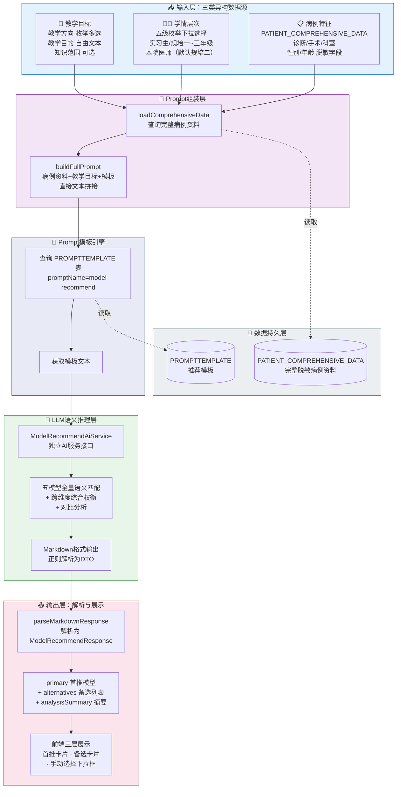
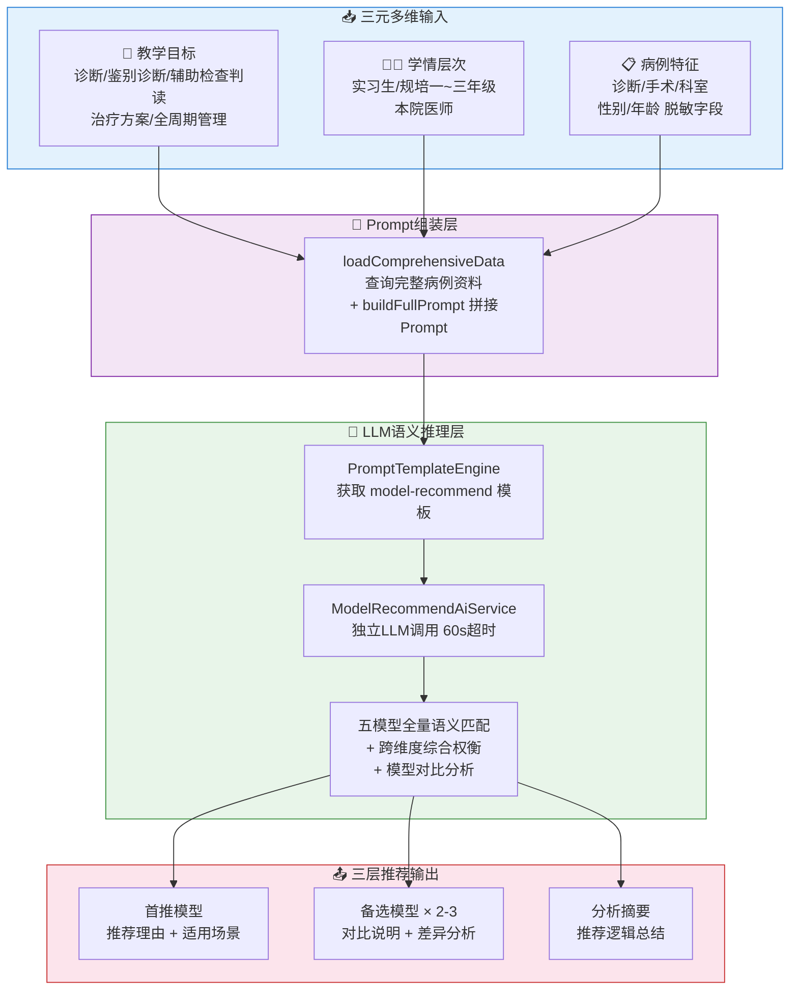
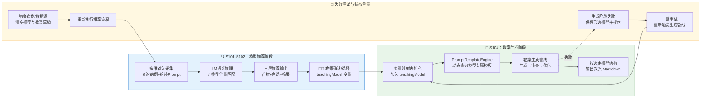
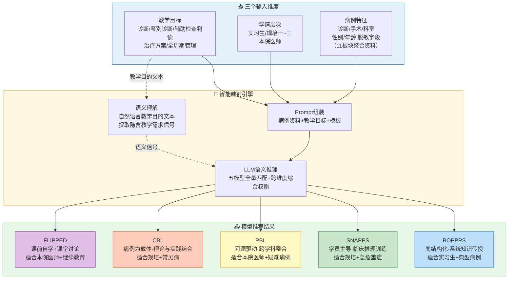

# 专利申请技术交底书

## 一、发明名称

基于多维输入的 AI 教学模型自动推荐流程构建方法

---

## 二、技术领域

本发明属于医学教育与人工智能交叉技术领域，具体涉及一种基于大语言模型（Large Language Model, LLM）的教学模型自动推荐流程构建方法，通过构建多阶段串行、以结构化数据对象为阶段间契约的自动化工件流，根据教学目标、学情层次和病例特征三个维度的输入信息，自动为临床教师推荐最优教学模型、输出备选方案对比分析，并将推荐结果无缝衔接到教案生成流程。

---

## 三、背景技术

### 3.1 现有技术概述

在医学教育领域，存在多种成熟的临床教学模型，如BOPPPS模型（导言-目标-前测-参与式学习-后测-总结，适合系统化理论授课）、SNAPPS模型（总结-缩小-分析-探究-计划-选择，适合学员主导的临床推理训练）、PBL模型（以问题为导向的小组学习）、CBL模型（以病例为基础的教学）和翻转课堂（课前自学+课堂讨论）等。不同教学模型在教学目标达成、学情适配、病例类型匹配等方面各有优劣，选择合适的教学模型是决定教案质量和教学效果的关键前提。

然而，现有技术在教学模型选择方面主要面临以下几个突出问题：

| 问题 | 具体表现 | 教学后果 |
|------|---------|----------|
| 完全依赖教师主观经验 | 多数教师仅熟悉一两种惯用模型，对其他模型了解有限 | 模型选择范围狭窄，无法针对特定病例做出最优选择 |
| 缺乏多维输入→模型的自动化映射 | 教学目标×学情×病例存在复杂交互，现有技术无法自动综合 | 同一病例针对不同学情无法差异化推荐 |
| 同质化推荐无法"优中选优" | 仅输出单一推荐结果，无备选方案和对比分析 | 教师缺乏充分比较信息来支撑决策 |
| 纯规则引擎无法处理语义差异 | if-else规则数量呈指数增长（5×5×N），且无法理解语义细微差异 | "急性"暗示需快速决策等语义信息被忽略 |
| 推荐结果缺乏可解释性 | AI推荐为"黑箱"输出，教师无法理解推理过程 | 教师难以建立对推荐的信任 |
| 推荐与教案生成脱节 | 模型推荐和教案生成是两个独立环节，无自动化衔接 | 推荐结果停留在建议层面，未能嵌入生成工作流 |

此外，现有LLM应用方案普遍停留在"单次提示词调用"层面：各业务环节之间缺乏统一的数据对象契约，AI输出依赖人工转录传递至下游，中间结果不落库，流程中断后只能整体重来，切换输入后残留状态污染新流程。这种碎片化的集成方式使AI能力难以嵌入业务流程形成稳定闭环，也无法为教学决策提供可追踪、可审计的处理链路。

### 3.2 引用文献

[1] Ma J, et al. The effectiveness of BOPPPS model in medical education: A systematic review. BMC Medical Education. 2024;24:512.

[2] Wolpaw TM, et al. SNAPPS: A Learner-centered Model for Outpatient Education. Academic Medicine. 2003;78(9):893-898.

[3] Barrows HS. Problem-based learning in medicine and beyond: A brief overview. New Directions for Teaching and Learning. 1996;68:3-12.

[4] Thistlethwaite JE, et al. The effectiveness of case-based learning in health professional education: A BEME systematic review. Medical Teacher. 2012;34(6):e421-e444.

[5] Bergmann J, Sams A. Flip Your Classroom: Reach Every Student in Every Class Every Day. ISTE; 2012.

[6] 求是杂志社经济编辑部、赛迪研究院联合课题组. 抢占智能时代制高点：我国人工智能产业发展调查. 2026-05.

---

## 四、发明内容

### 4.1 要解决的技术问题

本申请实施例的主要目的在于提供一种AI教学模型自动推荐流程的构建方法，解决现有大语言模型应用以"单次提示词调用"形态嵌入业务系统所造成的流程构建缺陷：各业务环节彼此孤立、环节之间缺乏统一的数据对象契约、AI输出依赖人工转录传递至下游、中间结果不落库、流程中断后只能整体重来、切换输入后残留状态污染新流程。本发明将教学模型推荐过程构建为"采集组装—语义推理—展示确认—生成衔接"四个串行阶段，以推荐请求对象、推荐结果对象、确认结果对象与生成请求对象四类结构化数据对象作为阶段间的输入输出契约，配合状态持久化、失败定位与降级重试、切换输入状态重置等机制，构成可编排、可恢复、可审计的自动化工件流，使AI能力整体嵌入教案生成业务流程并形成稳定闭环。

现有技术在教学模型选择与AI应用层面主要存在以下技术缺陷：其一，缺乏整体执行流程的组织方法，教学模型推荐、教师确认与教案生成是相互独立的环节，步骤之间没有定义输入输出的数据关联，推荐结论依赖人工转录才能进入下游环节，环节衔接的可靠性与一致性无法保证；其二，中间结果不落库，流程中断后无法从断点恢复，只能整体重来；其三，切换病例或数据源后残留状态未清理，前一次流程的推荐结果与已选模型会污染新流程。本发明通过定义四类数据对象并编排贯穿四个阶段的串行流程，使每一步骤的输出对象直接作为下一步骤的输入对象，中间状态全部落库可追踪，任一环节失败均可定位到具体阶段并降级恢复，切换输入时整体重置流程状态，从流程构建层面消除上述缺陷。

教学模型选择还面临多维异构输入联合建模的困难。教师提供的三类信息性质迥异——学情层次是结构化枚举值、教学方向是多选标签、教学目的则是自由文本——缺乏天然的联合编码方式；传统纯规则引擎面临组合爆炸（5个模型×5级学情×N种病例类型），而简单关键词匹配又无法理解"急性"与"急诊"之间隐含的"需快速决策"这一语义信号。本发明在采集组装阶段将三元输入封装为统一结构的推荐请求数据对象（病例资料文本、学情枚举、教学方向、教学目的、知识范围等字段），由语义推理阶段的大语言模型一次性消费该数据对象，借助模型的跨维度权衡能力完成从多维输入到最优模型的映射；提示词模板与拼接规则作为该数据对象的内容载荷设计，服务于数据对象的组装与消费，不构成独立于流程之外的发明内容。

推荐结果的可解释性与教师的决策参与构成了另一个技术问题：现有方案中AI推荐以"黑箱"方式给出单一结论，教师无从了解推理依据，推荐结果也无法与下游教案生成环节自动衔接。本发明在展示确认阶段将推荐结果解析为结构化数据对象——首推模型（附推荐理由与适用场景）、备选模型列表（含对比说明）与分析摘要，使推理过程透明可追溯；教师确认后，系统将所选模型标识固化为确认结果数据对象，再由生成衔接阶段依据该对象构造生成请求数据对象（变量映射表）注入教案生成管线，生成失败可依据持久化状态一键重试，切换病例或数据源时自动重置流程状态。推荐、确认与生成通过数据对象契约无缝串联，AI定位为"辅助决策工具"而非"替代决策的权威"。

### 4.2 技术方案

本发明提出一种**AI教学模型自动推荐流程的构建方法**，方法的核心在于流程本身的构建方式，而非单一环节的内容设计：将推荐过程划分为"采集组装—语义推理—展示确认—生成衔接"四个串行阶段，为每个阶段定义明确的数据对象输入与输出（推荐请求对象→推荐结果对象→确认结果对象→生成请求对象），阶段间仅通过数据对象契约传递信息、不依赖人工转录；各阶段输出对象持久化落库，任一环节失败可定位到具体阶段并降级重试，切换输入时整体重置流程状态。在此基础上，以Prompt模板引擎与LLM语义推理作为语义推理阶段内的执行载体，其模板内容与拼接规则属于流程数据载荷的工程实现，随流程数据模型统一配置管理。

#### 4.2.1 系统总体架构



#### 4.2.2 三元输入→教学模型的智能映射总流程



#### 4.2.3 详细技术步骤

**总体执行流程**：本发明方法按以下方式组织各步骤——S101为流程起点，采集三类输入并组装推荐提示词，输出结构化推荐请求；S102承接S101的输出，执行LLM语义推理并将模型返回的文本解析为结构化推荐结果；S103以S102输出的推荐结果驱动前端展示，将教师确认结果固化为教学模型标识；S104将S103输出的教学模型标识注入教案生成管线，输出教案生成请求并驱动教案生成流程；S105为贯穿S101至S104的并行支撑步骤，负责AI生成来源标识与患者信息保护。

**数据对象契约定义**：本流程在阶段之间传递四类结构化数据对象（对应程序中的DTO定义），各对象的字段结构如下——推荐请求对象（ModelRecommendRequest）：病例标识、学情枚举值、教学方向列表、教学目的文本、知识范围、组装完成的完整推荐提示词，由S101输出；推荐结果对象（ModelRecommendResponse）：首推模型（名称、分段推荐理由、适用场景列表）、备选模型列表（2至3个，各含名称、对比说明、适用场景列表）、分析摘要，由S102输出；确认结果对象（ModelConfirmRequest）：教学模型标识teachingModel、推荐结果引用标识、确认时间，由S103输出并持久化；生成请求对象（PlanGenerateRequest）：teachingModel与病例摘要、学情、教学方向、教学目的、知识范围组成的变量映射表，由S104输出并驱动教案生成管线。四类对象均以结构化字段定义并随流程状态持久化，下游阶段只消费上游阶段输出的对象实例，从而保证步骤间输入输出的确定关联。

各步骤间的数据衔接关系如下，数据对象在步骤间流转并落库，构成完整的自动化工件流：

| 步骤 | 输入数据 | 处理内容 | 输出数据 |
|------|---------|---------|---------|
| S101 | 病例标识、学情枚举值、教学目标（方向/目的/知识范围） | 查询脱敏病例资料、加载模板、拼接提示词 | 完整推荐提示词、推荐请求上下文 |
| S102 | 完整推荐提示词 | 模板加载、LLM流式调用、Markdown解析 | 结构化推荐结果（首推/备选/摘要） |
| S103 | 结构化推荐结果 | 前端渲染、教师交互、选中状态管理 | 教学模型标识teachingModel（持久化） |
| S104 | teachingModel与病例/学情/目标变量 | 变量映射表组装、模型专属模板匹配渲染、教案生成 | 教案草稿、生成状态 |
| S105 | 各步骤输出 | 来源标识标注、脱敏校验 | 带标识与脱敏约束的结果数据 |

流程回环机制：S104任一阶段生成失败时，保留已选教学模型状态并支持一键重试，重试仅重新执行S104；教师切换病例或数据源时，系统自动清空推荐结果、已选模型与教案草稿，流程状态整体重置后重新从S101执行。全流程以数据库为状态载体，任何步骤的中断均可依据持久化状态定位并恢复。

**S101：多维输入的采集与提示词组装。**

本步骤为流程起点，输入为病例标识、学情枚举值与教学目标三元数据，输出为完整推荐提示词与推荐请求上下文。多维信息在教案创建五步向导的前两步中完成采集，推荐请求在教师进入“AI 推荐教学模型”步骤时自动触发，无需单独点击推荐按钮。各维度的采集与组装方式如下：

（a）**病例特征维度**：教师在前端病例选择步骤从脱敏病例库中选择教学病例，系统记录其病例标识；后端收到推荐请求后，依据该标识查询病例完整资料表，读取导入阶段已聚合十一个医疗数据板块并完成脱敏的病例完整资料文本（含诊断、手术、科室、性别、年龄等脱敏字段）；若病例完整资料不存在，接口返回“病例完整资料不存在”错误提示。

（b）**学情层次维度**：教师在教学目标步骤通过下拉选择器从五级枚举中选择目标学员层级，枚举键为 intern（实习生）、r1 至 r3（规培一至三年级）、attending（本院医师），默认选中规培二年级；提交推荐请求时将枚举键转换为中文名称（如“规培二年级”）随请求传递。

（c）**教学目标维度**：包含三个子维度——教学方向（复选框多选，选项为诊断/鉴别诊断/辅助检查判读/治疗方案/全周期管理）、教学目的文本（多行文本框自由输入，携带丰富语义信息）、知识范围（可选文本输入，如“诊断学·高血压 第3章”）。前端在进入推荐步骤前校验教学方向与教学目的均已填写，否则提示“请先选择患者并设定教学目标”。

（d）**提示词组装**：后端将上述三类信息与模板全文拼接为完整推荐提示词，拼接方式为三段式——先输出“病例资料”段（完整脱敏病例资料文本），再输出“教学目标”段（依次列出学情、选择的教学方向、输入的教学目的三行必填内容，知识范围仅在填写时追加为第四行），随后输出分隔线收尾，最后追加从提示词模板表加载的模板全文。该拼接由“完整提示词拼接方法”（对应程序中的 buildFullPrompt 方法）完成，不经过变量占位符渲染；拼接完成的完整提示词作为唯一用户消息传入下一步的大语言模型调用。

**S102：大语言模型语义推理——全量五模型匹配与对比分析。**

本步骤以S101输出的完整推荐提示词为输入，输出结构化推荐结果（首推模型、备选模型列表与分析摘要），作为S103的输入。

（a）**提示词模板获取**：提示词模板引擎按类型（teaching）与名称（model-recommend）查询提示词模板表；记录不存在或处于停用状态时判定为服务端配置异常，接口返回“服务端配置异常”提示；加载成功则返回模板全文。

（b）**大语言模型调用**：推荐服务将完整提示词作为唯一用户消息，以流式方式调用大语言模型（默认模型为 deepseek-v4-flash），收集全部响应帧并聚合还原完整文本（优先采用汇总帧的完整内容，无汇总帧时拼接各增量帧内容，无法解析的帧按原文兜底拼接）；整体调用含文本解析在内限时 60 秒，超时、空响应或响应中无有效文本时判定调用失败；模型调用统一经执行服务器的代理端点转发至模型服务商，代理链路使用内部认证令牌与来源地址白名单双重校验，推荐服务本身不直接持有模型服务商的访问凭证。

（c）**大语言模型语义推理的能力**：
- 理解教学目的文本的语义微妙差异：如“急性”“急诊”暗示需侧重快速决策→倾向推荐 SNAPPS；“了解”“长期管理”暗示知识传递→倾向推荐 BOPPPS；诊断推理为主→倾向 SNAPPS/PBL；技能操作为主→倾向翻转课堂/BOPPPS。
- 进行跨维度综合权衡：当三个维度的信号指向不一致时（如急危重症倾向 SNAPPS 与实习生倾向 BOPPPS 冲突），模型识别矛盾并综合权衡给出最优解。
- 生成具有说服力的对比说明：备选模型的对比说明按“核心差异与取舍考量”两段阐述，明确说明放弃首选模型改用该模型的典型场景与代价权衡。

（d）**输出解析与结构化**：大语言模型返回的 Markdown 文本由“推荐结果解析方法”（对应程序中的 parseMarkdownResponse 方法）按三级标题切分为若干章节，依次识别“首选模型”“其他可选模型”（兼容“备选模型”写法）与“推荐分析摘要”三个章节；备选模型章节内再按四级标题切分并去除条目序号；各章节通过正则表达式提取“**字段名**：值”形式的加粗字段（模型名称、推荐理由、与首选模型的对比），适用场景通过“- ”开头的列表行提取，直至遇到空行、新字段或新标题为止；若文本中不存在“首选模型”章节则判定解析失败并报错；摘要章节去除末尾的“AI 生成”来源斜体标记后作为分析摘要文本。解析结果组装为首推模型（含名称、分段推荐理由、适用场景列表）、备选模型列表（2 至 3 个，各含名称、对比说明、适用场景列表）与分析摘要三部分的结构化对象。

**S103：推荐结果的前端展示与教师交互。**

本步骤以S102输出的结构化推荐结果为输入，输出教师确认的教学模型标识teachingModel并持久化，作为S104的输入。

（a）**三层推荐展示结构**：
- 首推模型卡片：左侧红色粗边框高亮，卡片头部为模型名称与红色“AI 首推”标签，正文展示分段推荐理由与适用场景标签列表，卡片内提供“选择此模型”按钮。
- 备选模型卡片列表：每行三列水平排列，每张卡片展示模型名称、对比说明、适用场景标签与“选择此模型”按钮。
- 推荐分析摘要卡片：位于备选卡片下方，正文为灰色文字并保留分段结构展示四段摘要。
- 手动选择下拉框：列表底部始终显示“或手动选择其他模型”下拉框，列出全部五种教学模型（BOPPPS/SNAP/PBL/CBL/翻转课堂）供教师直接选取。

（b）**选中状态管理**：推荐成功后系统自动选中首推模型（若教师此前未手动选择），选中卡片上的按钮显示“已选择”并高亮；教师可通过点击任意卡片的“选择此模型”按钮或从手动选择下拉框中选取来改变选中模型；“确认模型并生成教案”按钮仅在已选定模型且推荐未在进行中时可用，点击后进入教案生成流程。

（c）**AI 推荐非强制的设计原则与失败处理**：教师可随时忽略 AI 推荐，从下拉列表中选择任意其他模型，保障教学自主权不被 AI 推荐侵犯；推荐失败时，步骤顶部显示错误提示条（附“重试”按钮），同时提供空态提示“AI 推荐未完成，可手动选择模型或重试”，教师仍可通过手动下拉框选择模型继续后续流程。

**S104：推荐结果到教案生成的无缝衔接。**

本步骤以S103输出的教学模型标识teachingModel为输入，输出教案生成请求（变量映射表）并驱动教案生成流程，教案草稿与生成状态落库保存。

（a）**教学模型变量注入**：教师点击“确认模型并生成教案”后，前端先将所选模型名称规范化为标准标识（BOPPPS→BOPPPS、SNAP 或 SNAPPS→SNAP、PBL→PBL、CBL→CBL、FLIPPED 或翻转课堂→翻转课堂），再与病例标识、学情、教学方向、教学目的、知识范围一同作为生成请求参数提交；后端教案生成服务将教学模型名称与病例摘要、学情等共六个变量组成变量映射表，供教案提示词渲染使用。

（b）**模型专属模板匹配**：教案生成阶段，生成服务按教学模型名称的前缀动态匹配对应的模型专属生成模板；无法识别的名称按原值拼接模板名前缀，保留“模板不存在”的报错便于排查。匹配得到的模型专属生成模板与变量映射表经变量占位符渲染后，作为教案生成提示词调用生成 AI，初版教案生成后依次进入审查评分与优化阶段，完成“生成—审查—优化”闭环。

（c）**失败重试与状态重置**：教案生成任一阶段失败时，前端保留已选模型并显示错误信息，教师可点击“重新生成”按钮重新发起教案生成管线；教师切换病例或数据源时，系统自动清空推荐结果、已选模型与教案草稿，需重新完成推荐流程后再生成教案。

**S105：推荐结果的来源标识与安全合规。**

本步骤为贯穿S101至S104的并行支撑步骤，对各步骤输出结果统一附加来源标识与脱敏约束。

（a）**AI 生成来源标识**：大语言模型返回的推荐结果经解析后，由业务服务层统一标记来源为“AI 生成”（不依赖提示词约束，亦不信任模型自报），前端以红色“AI 首推”标签与卡片样式区分 AI 推荐内容，推荐失败或为空时提示手动选择。

（b）**患者信息保护**：推荐过程中仅使用导入阶段已脱敏的病例完整资料（不含姓名、身份证号、手机号等个人信息），系统日志仅记录病例标识与数据长度等非敏感信息，不记录病例资料正文。

### 4.3 有益效果

与现有技术相比，本发明具有以下有益效果。

第一，本发明提供了一种可编排、可恢复、可审计的自动化工件流构建方法。推荐过程被组织为"采集组装—语义推理—展示确认—生成衔接"四个串行阶段，各阶段以推荐请求对象、推荐结果对象、确认结果对象与生成请求对象四类结构化数据对象为输入输出契约，步骤间的数据关联由对象字段定义显式确定，不再依赖人工转录；各阶段输出对象全部落库持久化，中间结果不丢失，任一步骤失败均可依据持久化状态定位到具体阶段并降级重试；切换病例或数据源时清空全部阶段状态整体重置，克服了单次调用式LLM应用中"环节脱节、结果不可追溯、中断后无法恢复、残留状态污染新流程"的缺陷。

第二，三元异构输入被封装为统一结构的推荐请求数据对象，实现从多维输入到教学模型的端到端映射。传统方案要么依赖教师凭经验在1-2种熟悉模型中做选择，要么用纯规则引擎面对指数增长的if-else分支。本发明由采集组装阶段将教学目标、学情层次和病例特征封装为推荐请求对象，交由语义推理阶段综合处理教学方向、学员认知水平和病例复杂度之间的交互关系，从五种模型中选出最优者。

第三，三层推荐输出结构使得推理过程完整透明。首推模型附带的推荐理由按“病例特征→教学目标匹配→学情适配→模型应用路径”四段结构化输出，各段均须引用具体病例与学情依据（如“本例为急危重症”“规培二年级学员已具备初步独立推理能力”）；备选模型的对比说明按“核心差异→取舍考量”两段阐述，明确指出放弃首选改用备选的典型场景与代价权衡（如“PBL要求学员具有较强的自学能力和基础知识储备，当前实习生阶段尚不具备”）。教师获得的不是一句结论，而是一份可供审视和验证的推荐分析。

第四，LLM对自由文本的教学目的具有语义级的理解能力，超越了关键词匹配方案。当教师输入"急性心梗的处理"时，LLM能识别"急性"一词隐含的时间紧迫性信号，进而倾向推荐侧重快速临床决策的SNAPPS模型；当输入"系统掌握高血压管理"时，则倾向推荐结构化授课的BOPPPS模型。这种对自然语言微妙差异的捕捉能力是规则引擎和关键词匹配方案无法实现的。

第五，推荐结果直接嵌入教案生成工作流。确认结果对象中的teachingModel值自动注入教案生成管线的变量映射表，教案生成阶段根据该值动态查询对应的模型专属生成模板；生成任一阶段失败时保留已选模型并支持一键重试，切换病例或数据源时自动重置推荐与生成状态。推荐不再是孤立环节，而是教案生成流程的有机组成部分。

第六，教师在AI推荐的辅助下始终保有最终选择权，体现了“AI辅助但不替代”的设计立场。前端以红色“AI 首推”标签与卡片样式明确区分AI推荐内容，手动选择下拉框列出全部五种模型供教师任意选取，AI推荐仅提供决策参考。

第七，流程中的数据对象契约与状态持久化机制，使本方法区别于依赖LLM自报告和单次调用的现有方案。

---

## 五、附图说明

### 图1：系统四层架构图

（见 4.2.1 节 Mermaid 架构图，展示输入层→Prompt组装层→Prompt模板引擎→LLM语义推理层→输出层→数据层的完整架构。）

### 图2：三元输入→教学模型智能映射总流程图

（见 4.2.2 节 Mermaid 流程图，展示从三元多维输入→Prompt组装→LLM语义推理→三层推荐输出的完整流程。）

### 图3：推荐结果到教案生成无缝衔接数据流图



### 图4：前端三层推荐展示交互界面示意图


### 图5：三元输入→教学模型映射决策矩阵图



---

## 六、具体实施方式

### 6.1 实施环境

| 组件 | 技术选型 |
|------|---------|
| 前端框架 | Vue 3 + Options API + Element Plus 2.10.2 |
| 后端框架 | Java 21 + Spring Boot 3.5.8 |
| AI框架 | LlmClient 流式调用 + DeepSeek 大模型 |
| 数据库 | Oracle 21c |
| Prompt模板存储 | PROMPTTEMPLATE表（CLOB字段） |

### 6.2 编排伪代码

```text
推荐服务编排逻辑（对应 ModelRecommendService 推荐方法）：
输入：病例标识、学情名称、教学方向列表、教学目的文本、知识范围（可选）

步骤1  依据病例标识查询病例完整资料表，读取脱敏病例完整资料；
       资料不存在 → 返回“病例完整资料不存在”错误提示（HTTP 400）。
步骤2  调用提示词模板引擎，按类型（teaching）与名称（model-recommend）获取模板全文；
       模板不存在或停用 → 判定为服务端配置异常（HTTP 500）。
步骤3  拼接完整提示词：病例资料段 + 教学目标段 + 模板全文（直接文本拼接，不经变量占位符渲染）。
步骤4  调用大语言模型（默认模型 deepseek-v4-flash）：
       以完整提示词为唯一用户消息，流式调用并收集响应帧，聚合还原全文，整体限时 60 秒；
       调用失败或返回空响应 → 抛“教学模型推荐服务暂不可用，请稍后重试”（HTTP 503）。
步骤5  解析返回的 Markdown 文本：
       按三级标题切分，识别“首选模型”“其他可选模型”“推荐分析摘要”章节；
       提取加粗字段与列表项，组装为首推模型 + 备选模型列表 + 分析摘要；
       不存在“首选模型”章节 → 判定解析失败并报错。
步骤6  将解析结果标记来源为“AI 生成”，返回结构化推荐结果。
```

---

## 七、权利要求

### 7.1 方法权利要求

**权利要求1**：一种基于多维输入的AI教学模型自动推荐流程构建方法，其特征在于，包括以下步骤：

S1：构建流程数据对象契约与持久化载体——定义推荐请求对象、推荐结果对象、确认结果对象与生成请求对象四类结构化数据对象及其字段结构，作为流程各阶段之间的输入输出契约，并在数据库中建立对应的持久化存储；

S2：编排采集组装阶段——采集教师输入的三元信息（教学目标、学情层次、病例特征），组装为推荐请求对象并持久化，输出推荐请求对象实例作为S3的输入；

S3：编排语义推理阶段——以S2输出的推荐请求对象实例为唯一输入，从数据库提示词模板表加载模型推荐提示词模板，调用大语言模型执行五模型全量语义匹配、跨维度综合权衡与对比分析，将模型返回的Markdown文本解析为推荐结果对象（首推模型、备选模型列表与分析摘要）并持久化，输出推荐结果对象实例作为S4的输入；

S4：编排展示确认阶段——以S3输出的推荐结果对象实例驱动前端三层展示与教师交互，将教师确认的教学模型标识固化为确认结果对象并持久化，输出确认结果对象实例作为S5的输入；

S5：编排生成衔接阶段——以S4输出的确认结果对象实例为输入，将教学模型标识与病例摘要、学情等参数组成变量映射表，构造生成请求对象注入教案生成管线，实现推荐结果到教案生成的无缝衔接；

S6：流程状态管理与恢复——各阶段输出对象随流程状态持久化，任一步骤失败依据持久化状态定位失败阶段并支持降级重试；切换病例或数据源时清空全部阶段数据对象并重置流程状态后，重新执行S2至S5。

**权利要求2**：根据权利要求1所述的方法，其特征在于，步骤S2中推荐请求对象的组装方式为：依据病例标识查询病例完整资料表加载完整脱敏病例资料文本，将病例资料段、教学目标段（依次列出学情、教学方向、教学目的，知识范围仅在填写时追加）与模板全文以三段式直接文本拼接为完整推荐提示词，作为推荐请求对象的提示词字段。

**权利要求3**：根据权利要求1所述的方法，其特征在于，步骤S3中推荐结果对象的解析方式为：按Markdown三级标题切分模型返回文本，识别"首选模型""其他可选模型"与"推荐分析摘要"章节，通过正则表达式提取加粗字段与列表项，组装为首推模型（推荐理由按"病例特征→教学目标匹配→学情适配→模型应用路径"四段结构化输出并附适用场景列表）、备选模型列表（2至3个，各含按"核心差异→取舍考量"两段输出的对比说明与适用场景列表）与分析摘要（按"病例特点→目标要求→学情约束→推荐结论"四段输出）。

**权利要求4**：根据权利要求1所述的方法，其特征在于，步骤S3中大语言模型从教学目的自由文本中提取隐含的教学需求信号——包括时间紧迫性（→推荐SNAPPS）、零基础学情（→推荐BOPPPS）、自主学习能力培养（→推荐翻转课堂），并对三个维度信号不一致的场景进行跨维度综合权衡。

**权利要求5**：根据权利要求1所述的方法，其特征在于，步骤S4中前端始终提供手动选择下拉框（列出全部五种教学模型），教师可忽略AI推荐从下拉列表中选择任意模型；AI推荐失败时前端显示错误提示条并提供重试按钮，同时保留手动选择通道继续后续流程。

**权利要求6**：根据权利要求1所述的方法，其特征在于，步骤S5中教案生成管线根据教学模型名称的前缀动态匹配对应的模型专属生成模板，无法识别的名称按原值拼接模板名前缀并保留"模板不存在"的报错便于排查；生成任一阶段失败时保留已选模型状态并支持一键重试，重试仅重新执行生成衔接阶段，切换病例或数据源时自动清空推荐结果对象、确认结果对象与教案草稿。

### 7.2 系统权利要求

**权利要求7**：一种基于多维输入的AI教学模型自动推荐流程构建系统，其特征在于，包括：

数据对象契约模块，用于定义推荐请求对象、推荐结果对象、确认结果对象与生成请求对象四类结构化数据对象及其字段结构并持久化存储；

采集组装模块（ModelRecommendService），用于采集三元输入信息并组装为推荐请求对象；

语义推理模块（ModelRecommendAiService），用于加载提示词模板并调用大语言模型执行五模型全量语义匹配与对比分析，将模型返回的Markdown文本解析为推荐结果对象；

Markdown解析模块（parseMarkdownResponse），用于按章节标题分割LLM返回的Markdown文本，提取加粗字段和列表项，组装为推荐结果对象；

展示确认模块，用于以推荐结果对象驱动前端三层展示，并将教师确认结果固化为确认结果对象；

生成衔接模块，用于依据确认结果对象构造生成请求对象并注入教案生成管线；

流程编排模块，用于编排采集组装→语义推理→展示确认→生成衔接四阶段串行执行，管理各阶段数据对象的持久化、失败定位与降级重试、切换输入时的状态重置。

**权利要求8**：根据权利要求7所述的系统，其特征在于，所述Markdown解析模块按"### 首选模型""### 其他可选模型""### 推荐分析摘要"三级标题分割文本，使用正则表达式提取**模型名称**、**推荐理由**、**与首选模型的对比**、**适用场景**等加粗字段的值，适用场景通过"- "开头的列表行提取。

---

## 八、技术效果对比

| 对比维度 | 现有技术 | 本发明 |
|---------|---------|--------|
| 模型选择方式 | 教师主观经验（仅熟悉1-2种模型） | 三元联合建模+AI智能推荐（覆盖5种模型） |
| 输入维度 | 单一维度（如仅按病例类型） | 三维联合输入（教学目标×学情×病例） |
| 推荐架构 | 纯规则引擎（规则爆炸）或纯LLM（黑箱） | 数据库驱动Prompt模板+LLM全量语义推理 |
| 语义理解 | 关键词匹配，无法理解"急性""掌握"等差异 | LLM理解教学目的文本的语义微妙差异 |
| 推荐输出 | 单一推荐结果 | 首推+2-3备选+对比说明三层结构 |
| 可解释性 | 黑箱输出或无解释 | 推荐理由引用具体病例特征和学情依据 |
| 与下游衔接 | 脱节，需手动传递模型信息 | teachingModel自动注入教案生成变量 |
| 教师自主权 | 无（强制使用推荐）或全手动（无AI辅助） | AI推荐+教师优选确认的辅助决策模式 |
| 失败处理 | 无降级或全部丢弃 | AI调用失败时提示用户重试 |
| 策略进化 | 规则硬编码，修改需部署 | Prompt模板可配置热更新 |
| 数据对象契约 | 无，环节间依赖人工转录 | 四类结构化数据对象定义阶段间输入输出，字段确定关联 |
| 流程组织 | 单次调用、环节脱节、中间数据不落库 | 四阶段串行工件流、数据契约明确、状态持久化可断点恢复 |

---

## 九、发明人信息

| 角色 | 姓名/单位 | 贡献说明 |
|------|----------|---------|
| 发明负责人 | 刘朝晖 | 成都市第五人民医院心血管一病区临床医师，主导三元联合建模方法设计、模型推荐Prompt模板工程、Markdown解析算法 |
| 产学研合作方 | 西南科技大学 | 军民融合研究院，参与技术合作与产学研转化 |

---

## 十、附件清单

```
附件1  后端源代码：
       - ModelRecommendService.java（推荐服务编排）
       - ModelRecommendAiService.java（LLM推荐接口+Markdown解析）
       - PromptTemplateEngine.java（模板引擎）
       - ModelRecommendController.java（推荐API控制器）

附件2  Prompt模板文件：
       - model-recommend（模型推荐模板）

附件3  前端源代码：
       - StepModelRecommend.vue（模型推荐步骤界面）
       - PlanCreate.vue（5步向导界面）

附件4  迭代技术文档：
       - AI医学教学系统技术方案.md（含9项专利描述）
       - 教案生成模块关注点分离设计方案.md

附件5  Git提交历史记录
附件6  系统运行界面截图
```
