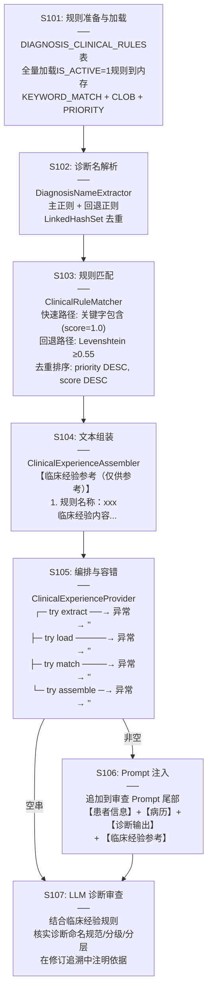
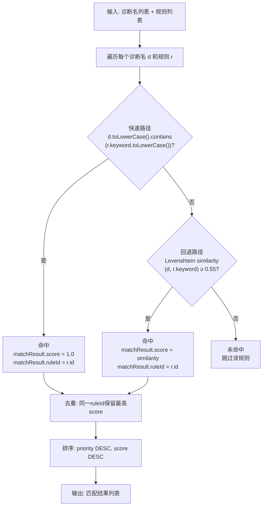

专利申请技术交底书
技术联系人：*********
技术联系人电话：*********
电子邮件：*********

1、发明名称
一种基于临床经验规则的大模型诊断审查知识注入系统及方法

2、背景技术

随着大语言模型（Large Language Model，LLM）被广泛应用于医疗临床诊断辅助，其在知识型考试中可达84%–90%准确率，但在真实临床实践评估中准确率仅45%–69%，安全性评估更跌至40%–50%。这一显著的"知识-实践鸿沟"（Knowledge-Practice Gap）的根源在于：LLM的训练数据仅覆盖教科书、指南、论文等显性知识（Explicit Knowledge），无法获取高年资医师通过数万次病例实践积累的隐性知识（Tacit Knowledge）——即"写不进教科书但实际工作中必须遵守"的临床经验规则。

现有技术应对上述问题的主要方案有三类：

第一，向量检索增强生成（RAG）。通过Embedding向量化将临床知识存入向量数据库，检索时按语义相似度返回Top-K结果注入Prompt。代表系统包括IMQC（AAAI 2025，部署于上海医学质控管理中心）及Nature Scientific Reports 2025提出的Dual RAG + Check架构。此类方案的缺陷在于：（a）向量检索为黑盒操作，无法解释"为什么检索到这条知识"，不满足医疗可审计合规要求；（b）Embedding相似度受训练语料影响，对中文医学术语的语义区分能力不稳定（如"冠状动脉硬化"与"冠状动脉粥样硬化性心脏病"在向量空间中可能高度相似但临床含义不同）；（c）需维护独立的向量数据库和Embedding模型，工程复杂度高。

第二，知识图谱注入。通过构建医学知识图谱（如疾病-症状-药物关系网），将图结构信息编码后注入LLM。此类方案的缺陷在于构建成本极高，且临床经验规则多为非结构化文本（如"若病历未提及冠脉造影结果，应在审查中提示补充"），难以用图谱三元组精确表达。

第三，提示工程（Prompt Engineering）优化。通过细化提示词指令引导LLM输出更规范的诊断结果。此类方案的缺陷在于没有引入外部知识，无法弥补LLM固有的隐性知识缺失，仅能改善输出格式而非内容正确性。

此外，在确定性与可审计性方面，现有技术普遍缺乏以下能力：（a）每条注入知识无法追溯到明确出处（哪个规则、由谁定义、何时更新）；（b）匹配过程无法审计——向量检索返回"相似度0.87"无法解释为"因为诊断名包含关键字'冠状动脉'"；（c）缺乏针对中文医疗诊断命名多样性的专用匹配策略（如"冠状动脉粥样硬化性心脏病""冠心病""冠脉病变"指向同一疾病）。

引用文献：
[1] Gong EJ, Bang CS, et al. Knowledge-Practice Performance Gap in Clinical Large Language Models: Systematic Review of 39 Benchmarks. J Med Internet Res. 2025;27:e84120.
[2] Polanyi M. The Tacit Dimension. University of Chicago Press; 1966.
[3] Thornton T. Tacit knowledge as the unifying factor in evidence based medicine and clinical judgement. Philos Ethics Humanit Med. 2006;1:2.
[4] Liu Z, et al. IMQC: A Large Language Model Platform for Medical Quality Control. AAAI. 2025.
[5] Wang R, et al. Dual retrieving and ranking medical large language model with retrieval augmented generation. Scientific Reports. 2025;15:00724.
[6] MedShard: Privacy-Preserving EMR QC with Rule Sharding and Multi-agent Collaboration. CHIP 2025, Springer.

3、发明创造所要解决的技术问题及发明目的

本申请实施例的主要目的在于提供一种基于临床经验规则的大模型诊断审查知识注入系统及方法，通过将高年资医师的隐性临床经验规则化存储于结构化数据表，并采用确定性双策略匹配机制精确检索后自动注入LLM审查Prompt，使LLM在诊断审查时获得教科书之外的临床实践知识，从而弥补LLM的隐性知识缺失，提升诊断审查的准确性和规范性。

所要解决的技术问题按重要性排序：
（1）LLM在临床实践中缺乏隐性知识（Tacit Knowledge）的问题——需建立可扩展的结构化临床经验规则库，将高年资医师的"非教科书规则"转化为可检索的格式化条目。
（2）现有RAG方案向量检索不可解释、不可审计的问题——需采用确定性匹配策略（关键字包含+编辑距离回退），使每条知识的匹配过程可追溯、可审计，满足医疗合规要求。
（3）中文医疗诊断命名的多样性导致单一匹配策略失效的问题——需采用双路径匹配策略：快速路径（关键字包含）处理同义诊断名，回退路径（编辑距离相似度）处理表述变体。
（4）知识注入链路中任一步骤异常不应阻断主流程的问题——需对解析、匹配、组装各步骤独立容错，任一步骤失败不影响LLM审查的正常执行。
（5）组件耦合导致知识注入逻辑难以独立测试和替换的问题——需按关注点分离（Separation of Concerns，SoC）原则将解析、匹配、组装、编排拆分为独立组件，每组件仅暴露一个公共方法。

4、清楚完整的叙述发明创造的技术方案

为解决上述技术问题，本申请提供了如下技术方案。

参见图1所示，为本实施例提供的一种基于临床经验规则的大模型诊断审查知识注入系统的架构示意图。该系统包括：规则存储层、诊断名解析层、规则匹配层、文本组装层和编排门面层，共五个层次，形成三段式管道（解析→匹配→组装）。

其中，规则存储层用于将临床经验规则持久化于关系型数据库表（DIAGNOSIS_CLINICAL_RULES），每条规则包含关键字匹配字段（KEYWORD_MATCH）、规则名称（RULE_NAME）、临床经验内容（CLINICAL_EXPERIENCE，CLOB类型）以及优先级（PRIORITY）和启用状态（IS_ACTIVE）字段，支持规则的动态增删和启用/停用，无需重训模型或重启服务。

诊断名解析层（DiagnosisNameExtractor）用于从LLM输出的Markdown格式诊断分析文本中提取诊断名称列表，采用主正则与回退正则双层解析策略。

规则匹配层（ClinicalRuleMatcher）用于将解析出的诊断名称集合与规则表中所有激活规则进行匹配，采用双路径匹配策略：快速路径（关键字包含匹配）与回退路径（编辑距离相似度匹配）。

文本组装层（ClinicalExperienceAssembler）用于将匹配结果格式化为符合特定Markdown格式的【临床经验参考】段落文本，直接追加到LLM审查Prompt尾部。

编排门面层（ClinicalExperienceProvider）用于编排上述三层组件的调用顺序，并实施全链路容错：解析、加载、匹配、组装四步中任一步发生异常，均返回空字符串，绝不抛出异常阻断主流程。

参见图2所示，为本实施例提供的一种基于临床经验规则的大模型诊断审查知识注入方法的流程示意图，该方法包括以下步骤：

S101：规则准备与加载。将高年资医师总结的临床经验规则存储于关系型数据库表DIAGNOSIS_CLINICAL_RULES中，该表包含以下字段：RULE_ID（主键，序列生成）、KEYWORD_MATCH（关键字，VARCHAR2(200)，用于快速路径包含匹配）、RULE_NAME（规则名称，VARCHAR2(200)）、CLINICAL_EXPERIENCE（临床经验内容，CLOB类型）、DIAGNOSIS_CATEGORY（诊断类别，VARCHAR2(100)）、PRIORITY（优先级，NUMBER(5)，多条命中时决定排序）、IS_ACTIVE（启用状态，NUMBER(1)，1=启用/0=禁用）、CREATED_TIME和UPDATED_TIME（时间戳）。

规则表结构的设计满足以下工程约束：
（a）规则量预期不超过200条，启动时全量加载激活规则（IS_ACTIVE=1）到应用内存，避免每次匹配时对数据库的CLOB字段做LIKE查询导致的性能问题；
（b）每条规则的CLINICAL_EXPERIENCE字段存储完整的中文临床经验文本，可直接注入Prompt，无需二次转换；
（c）PRIORITY字段支持优先级排序，当多个规则命中同一诊断名时，按(优先级降序, 匹配得分降序)排序，确保最重要的临床经验优先呈现。

本申请的知识注入方案在项目整体RAG（检索增强生成）知识分层体系中的定位如下：

| 知识层 | 枚举值 | 是否用本方案检索 | 说明 |
|--------|--------|:--------------:|------|
| 单病种质控标准 | QC_STANDARD | 否（DeepSeek已知） | 通用诊断标准，LLM训练数据已覆盖 |
| 临床指南 | CLINICAL_GUIDELINE | 否（用RAG向量检索） | 以治疗为核心的指南知识，量大需向量检索 |
| 专家共识 | EXPERT_CONSENSUS | 否（用RAG向量检索） | 治疗补充知识 |
| **专家经验** | **EXPERT_EXPERIENCE** | **是（本方案）** | 诊断命名/分级规范、非教科书隐性规则 |

本方案与RAG向量检索的架构关系：两者同属Prompt拼接前的知识检索层，但采用完全不同的检索策略。RAG适用于海量临床指南（数千至数万条），使用Embedding向量语义检索；本方案适用于轻量专家经验（数十至数百条），使用确定性匹配。两者可在同一Prompt中并存——RAG检索的治疗指南在Prompt前部，本方案检索的诊断经验在Prompt后部，互不干扰。

种子数据示例：插入两条初始规则——

规则一（冠状动脉命名规范）：
- KEYWORD_MATCH = "冠状动脉"，RULE_NAME = "冠状动脉命名规范"
- CLINICAL_EXPERIENCE = "1. 冠脉造影/CTA 显示任一主要心外膜冠状动脉管腔直径狭窄 ≥50% → 诊断为'冠状动脉粥样硬化性心脏病（冠心病）'；2. 冠脉造影/CTA 显示有斑块但管腔直径狭窄 <50% → 诊断为'冠状动脉硬化'（形态学诊断，不等同于冠心病）；3. 若病历中明确使用了'冠心病'或'冠状动脉粥样硬化性心脏病'的诊断，但未提供冠脉造影/CTA 结果或狭窄百分比数值，应在审查中提示'建议补充冠脉造影/CTA 结果以明确诊断依据'。"
- PRIORITY = 10, IS_ACTIVE = 1

规则二（高血压分级分层规范）：
- KEYWORD_MATCH = "高血压"，RULE_NAME = "高血压分级与危险分层"
- CLINICAL_EXPERIENCE = "高血压诊断必须包含：1. 分级（根据血压数值判断为1级/2级/3级）；2. 危险分层（根据合并危险因素、靶器官损害、临床并发症判断为低危/中危/高危/很高危）；若诊断仅写'高血压'而未包含分级和危险分层，应在审查中提示'建议补充高血压分级和危险分层'。"
- PRIORITY = 10, IS_ACTIVE = 1

此后，医学专家可随时通过INSERT新记录扩展规则，或通过UPDATE IS_ACTIVE=0停用过期规则，无需修改任何代码或重启服务。

S102：诊断名解析。从LLM诊断分析输出的Markdown全文（content）中提取诊断名称列表。

具体实现采用DiagnosisNameExtractor组件，其核心算法如下：

（a）主正则解析：使用正则表达式(?:#{2,4}\s*)?诊断名称[:：]\s*(.+?)(?:\n|$)匹配标准格式。该正则兼容以下变体格式：
- "#### 诊断名称：冠状动脉粥样硬化性心脏病"
- "诊断名称：冠状动脉粥样硬化性心脏病"
- "诊断名称:冠状动脉粥样硬化性心脏病"（英文冒号）
- "### 诊断名称：高血压"

（b）回退正则解析：当主正则无匹配时，使用宽松正则诊断[:：]\s*(.+?)匹配。此回退机制处理LLM输出的"诊断：xxx"格式（未严格按模板输出"诊断名称"字段时）。

（c）去重：使用LinkedHashSet收集提取结果，自动去重同时保持首次出现顺序。

（d）容错：输入为null或空字符串时，返回空列表。

S103：规则匹配。将步骤S102提取的诊断名称列表与步骤S101加载的所有激活规则进行双策略匹配。

具体实现采用ClinicalRuleMatcher组件，其核心算法如下：

对于每个诊断名d和每条激活规则r，按以下优先级两阶段匹配：

**第一阶段——快速路径（关键字包含匹配）：**

若r.getKeywordMatch()（转为小写后）作为子串包含于d（转为小写后），即满足d.toLowerCase().contains(r.getKeywordMatch().toLowerCase())，则直接命中，匹配得分score = 1.0。

例如：诊断名"冠状动脉粥样硬化性心脏病"包含关键字"冠状动脉" → 命中规则一（冠状动脉命名规范）；诊断名"高血压3级"包含关键字"高血压" → 命中规则二（高血压分级分层规范）。

**第二阶段——回退路径（编辑距离相似度匹配）：**

当快速路径未命中时，计算d与r.getKeywordMatch()之间的Levenshtein编辑距离相似度。相似度公式为：similarity = 1 - (编辑距离 / max(诊断名长度, 关键字长度))。

若similarity ≥ 阈值（当前设定为0.55），则命中该规则，匹配得分score = similarity；否则不命中。

例如：诊断名"冠状动脉硬化"与关键字"冠状动脉"的编辑距离为4（"硬化"为额外2字），similarity = 1 - 4/6 ≈ 0.33 < 0.55 → 不命中（不同于"冠状动脉粥样硬化性心脏病"包含"冠状动脉"后在快速路径即命中）。

这一双路径策略的设计动因为：（a）快速路径处理同义诊断名（如"冠心病""冠状动脉粥样硬化性心脏病""冠脉病变"均包含"冠状"），O(n)复杂度，高效且确定性可解释；（b）回退路径使用Levenshtein编辑距离而非语义向量，处理诊断名的文字变体（如"冠脉硬化"与"冠状动脉硬化"），结果可计算、可审计——可以精确解释为"两个字符串的编辑距离为2，相似度0.71，超过阈值0.55"。

**匹配结果去重与排序：**

对同一RULE_ID可能因多条诊断名命中而产生多条匹配结果的情况，保留最高得分的匹配结果。最终按(priority DESC, score DESC)排序返回。

S104：文本组装。将步骤S103的匹配结果（ClinicalRuleMatchResult列表）格式化为【临床经验参考】Markdown段落。

具体实现采用ClinicalExperienceAssembler组件，其输出格式如下：

```
【临床经验参考（仅供参考）】

1. 规则名称：冠状动脉命名规范
   所属类别：心血管系统
   1. 冠脉造影/CTA 显示任一主要心外膜冠状动脉管腔直径狭窄 ≥50% → 诊断为'冠状动脉粥样硬化性心脏病（冠心病）'；
   2. 冠脉造影/CTA 显示有斑块但管腔直径 <50% → 诊断为'冠状动脉硬化'；
   3. 若病历未提供冠脉造影/CTA 结果或狭窄百分比数值，应在审查中提示补充。

2. 规则名称：高血压分级与危险分层
   所属类别：心血管系统
   高血压诊断必须包含分级（1/2/3级）和危险分层（低危/中危/高危/很高危）；若诊断仅写'高血压'而未包含，应在审查中提示补充。
```

当匹配结果列表为空或所有match结果为null时，返回空字符串""。

该组装器独立于匹配器，使得Prompt格式变更（如调整标题层级、增加统计信息）仅需修改此组件，不影响上游的解析和匹配逻辑。

S105：编排执行与全链路容错。ClinicalExperienceProvider门面按以下顺序编排调用上述组件：

```java
public String provide(String diagnosisContent) {
    try {
        List<String> names = extractor.extract(diagnosisContent);
        if (names.isEmpty()) return "";
    } catch (Exception e) { return ""; }

    try {
        List<DiagnosisClinicalRule> rules = ruleRepository.findAllByIsActiveTrueOrderByPriorityDesc();
        if (rules.isEmpty()) return "";
    } catch (Exception e) { return ""; }

    try {
        List<ClinicalRuleMatchResult> matches = matcher.match(names, rules);
        if (matches.isEmpty()) return "";
    } catch (Exception e) { return ""; }

    try {
        return assembler.assemble(matches);
    } catch (Exception e) { return ""; }
}
```

核心容错机制——"四步独立try-catch"：解析、加载、匹配、组装四个步骤各自由独立的try-catch包裹，任一步骤发生异常均返回空字符串""，绝不向上层抛出异常。这确保了：
（a）知识注入是增强性功能而非阻断性功能——即使规则表损坏、数据库断连，LLM审查仍可正常执行（仅无临床经验段落）；
（b）独立性——一个规则的内容格式异常不影响其他规则的匹配和注入；
（c）可观测性——每层独立记录警告日志，便于定位异常根因而非笼统失败。

S106：Prompt注入。将步骤S105产出的【临床经验参考】段落追加到LLM审查Prompt尾部。

当ClinicalExperienceProvider.provide()返回非空字符串时，将其追加到审查Prompt的objectiveContent末尾：

```
【患者基本信息】...【原始病历资料】...【AI诊断分析输出】...
【临床经验参考（仅供参考）】
1. 冠状动脉命名规范
   ...
```

LLM审查模板中内置了对应的使用指令：
- 临床经验规则是对特定诊断的额外判定标准，需结合病历客观证据综合判断
- 当临床经验规则与病历证据一致时优先采用；矛盾时以病历客观证据为准
- 如果某条诊断在临床经验中有对应的命名规范或分级要求，须核实是否符合
- 在审查报告中若依据临床经验进行了修订，需注明依据来源

S107：关注点分离（SoC）组件化架构。

为保障系统的可维护性、可测试性和可替换性，将整个知识注入流程按关注点分离原则拆分为六个独立组件：

| 组件 | 包路径 | 单一职责 | 唯一公共方法 |
|------|--------|---------|------------|
| DiagnosisNameExtractor | service.qualitygate.parser | 从Markdown提取诊断名称 | List<String> extract(String) |
| StringSimilarity | util | Levenshtein编辑距离计算 | static double similarity(String, String) |
| ClinicalRuleMatcher | service.qualitygate.matcher | 诊断名→规则匹配 | List<ClinicalRuleMatchResult> match(...) |
| ClinicalExperienceAssembler | service.qualitygate.assembler | 匹配结果→格式化文本 | String assemble(List<ClinicalRuleMatchResult>) |
| ClinicalExperienceProvider | service.qualitygate.review | 编排解析→匹配→组装全流程 | String provide(String) |
| ReviewInputBuilder | service.qualitygate.review | 构建审查输入基础结构 | String build(Prompt, String) |

依赖关系为链式单向：ClinicalExperienceProvider依赖DiagnosisNameExtractor、ClinicalRuleMatcher和ClinicalExperienceAssembler；ClinicalRuleMatcher依赖StringSimilarity（静态工具类）和DiagnosisClinicalRuleRepository；DiagnosisReviewListener依赖ReviewInputBuilder和ClinicalExperienceProvider。

每个组件可独立进行单元测试和替换。例如，若未来需要将Levenshtein替换为Jaccard相似度或引入拼音模糊匹配处理中文同音异形，仅需修改StringSimilarity工具类或新建相似度策略类并替换ClinicalRuleMatcher中的依赖，其余组件不变。

这种SoC划分使知识注入系统在逻辑复杂度上等同于：Input → [Extract → Match → Assemble] → Output，其中方括号内的三段各自独立，可并行开发和测试。

5、与现有技术相比，本发明所具有的优点

与现有技术相比，本发明的有益效果是：

（1）通过将高年资医师的隐性临床经验规则化存储于结构化数据表（DIAGNOSIS_CLINICAL_RULES），并按需检索后自动注入LLM审查Prompt，有效弥补了LLM因训练数据仅覆盖显性知识而导致的知识-实践鸿沟（知识型考试84%-90% vs 临床实践45%-69%）。每新增一条规则仅需一条INSERT语句，无需重训模型或修改代码，扩展成本趋近于零。

（2）采用"关键字包含（快速路径）+ Levenshtein编辑距离（回退路径）"的双策略匹配机制，从根本上区别于主流RAG方案的向量语义检索。快速路径处理同义诊断名（O(n)时间复杂度，确定性可解释——可精确回溯为"诊断名X包含关键字Y"），回退路径处理文字变体（相似度可计算、可审计——可精确解释为"编辑距离为Z，相似度0.XX，超过阈值0.55"）。整个匹配过程完全透明、可追溯，满足医疗场景对可审计性的严格要求。

（3）采用"全量加载激活规则到内存 + 轻量字符串匹配"策略，规避了Oracle CLOB字段LIKE查询的性能陷阱和向量数据库的维护开销。规则量<200条时，单次匹配耗时在毫秒级，不构成管线瓶颈。

（4）四步独立try-catch全链路容错设计，使知识注入成为增强性而非阻断性功能——即使规则表损坏、数据库断连或某条规则格式异常，LLM审查仍可正常执行（仅无临床经验段落），避免了现有技术中知识库故障导致主流程阻塞的问题。

（5）按关注点分离（SoC）原则将整个知识注入流程拆分为六个独立组件（解析器、相似度工具、匹配器、组装器、门面、输入构建器），每个组件仅暴露一个公共方法，可独立测试和替换。当匹配算法需要升级（如从Levenshtein切换为Jaccard相似度，或引入拼音模糊匹配处理中文同音异形诊断名）时，仅需修改单个组件，其余组件不变。

（6）RAG知识分层体系将专家经验（EXPERT_EXPERIENCE）独立于质控标准、临床指南和专家共识，使不同知识层的检索策略可差异化配置——质控标准由LLM内置、临床指南用向量RAG海量检索、专家经验用本方案的确定性轻量匹配，避免了"一刀切"检索策略导致的资源浪费和精度损失。

6、简要说明本发明技术关键点和保护点

（1）【首要】双策略规则匹配机制：采用"关键字包含匹配（快速路径）+ Levenshtein编辑距离相似度匹配（回退路径）"的两阶段匹配策略，从AI诊断输出中提取的诊断名与预定义的临床经验规则表进行精确匹配，匹配过程完全可追溯和可审计。

（2）【重要】结构化临床经验规则表（DIAGNOSIS_CLINICAL_RULES）：以KEYWORD_MATCH关键字字段为索引、CLINICAL_EXPERIENCE CLOB字段为内容载体、PRIORITY和IS_ACTIVE为管理字段，将高年资医师隐性知识转化为可检索、可管理、可扩展的结构化规则条目。

（3）【重要】全量内存加载+确定性匹配策略：规则量<200条时全量加载到应用内存，在内存中执行字符串包含和编辑距离计算，规避Oracle CLOB LIKE查询的性能瓶颈和向量数据库的维护成本。

（4）【重要】四步独立try-catch全链路容错：解析→加载→匹配→组装四步各自独立的try-catch包裹，任一步失败返回空字符串，确保知识注入始终为增强性而非阻断性功能，绝不因知识库异常导致LLM审查主流程中断。

（5）【重要】关注点分离（SoC）三段式管道架构：将知识注入流程拆分为解析（Extract）→匹配（Match）→组装（Assemble）三个独立阶段，每阶段对应一个独立组件，各组件可独立测试、独立替换和独立演进。

（6）【重要】RAG知识分层体系中的EXPERT_EXPERIENCE层独立建模：将专家经验知识层从质控标准、临床指南和专家共识中独立出来，采用区别于向量RAG的轻量确定性匹配策略，实现不同知识层的差异化检索和注入。

（7）【重要】诊断名双层正则解析机制：主正则精确匹配标准格式"诊断名称：xxx"，回退正则宽松匹配"诊断：xxx"格式，双重保障确保LLM输出格式变化时不会导致知识注入链路断裂。

（8）【重要】匹配结果去重与优先级排序：同一规则被多条诊断名命中时保留最高得分，最终按(优先级降序, 匹配得分降序)排序，确保最重要的临床经验在有限的Prompt上下文中优先呈现。

7、附图说明

图1为本发明实施例中基于临床经验规则的大模型诊断审查知识注入系统的架构示意图。

```mermaid
graph TB
    subgraph RuleStorage["规则存储层"]
        DB[("DIAGNOSIS_CLINICAL_RULES<br/>Oracle 21c<br/>KEYWORD_MATCH + CLOB + PRIORITY")]
        Seed["种子数据<br/>冠状动脉命名规范<br/>高血压分级分层"]
    end

    subgraph Pipeline["三段式知识注入管道"]
        direction TB
        Extractor["DiagnosisNameExtractor<br/>诊断名解析层<br/>────<br/>主正则: 诊断名称[:：]<br/>回退正则: 诊断[:：]"]
        Matcher["ClinicalRuleMatcher<br/>规则匹配层<br/>────<br/>快速路径: 关键字包含<br/>回退路径: Levenshtein 0.55"]
        Assembler["ClinicalExperienceAssembler<br/>文本组装层<br/>────<br/>【临床经验参考（仅供参考）】<br/>编号列表格式"]
    end

    subgraph Facade["编排门面层"]
        Provider["ClinicalExperienceProvider<br/>────<br/>编排: extract → load → match → assemble<br/>容错: 四步独立 try-catch"]
    end

    subgraph Consumer["注入点"]
        Listener["DiagnosisReviewListener<br/>Gate 2 诊断审查监听器<br/>────<br/>reviewInput + clinicalSection<br/>→ 提交审查 Prompt"]
    end

    LLM_Review["LLM 诊断审查<br/>────<br/>DeepSeek / 阿里百炼<br/>结合临床经验规则输出审查结果"]

    DB -->|findAllByIsActiveTrue| Provider
    Seed --> DB
    Extractor --> Matcher
    Matcher --> Assembler
    Provider --> Extractor
    Provider --> Matcher
    Provider --> Assembler
    Listener -->|provide(resultContent)| Provider
    Provider -->|【临床经验参考】Markdown段落| Listener
    Listener -->|完整审查Prompt| LLM_Review
```

图2为本发明实施例中一种基于临床经验规则的大模型诊断审查知识注入方法的流程示意图。



图3为本发明实施例中双策略匹配机制的详细流程图。



注意：请提供可编辑形式的附图电子档，以便代理人编辑修改。

上述内容，如有不清楚的地方，请随时与我联系。

电话：+86-13551098471
