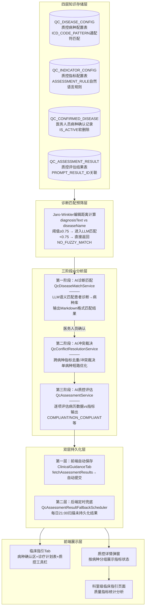
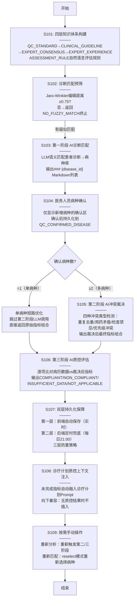
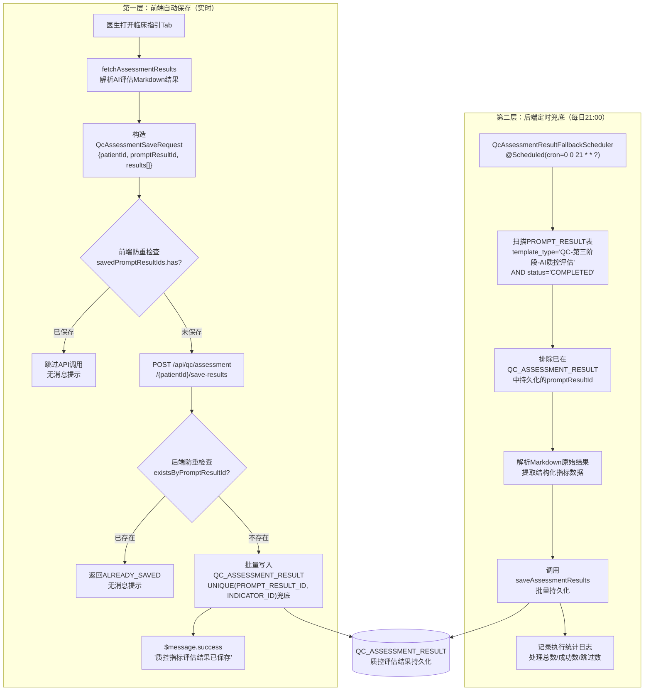

专利申请技术交底书
技术联系人：*********
技术联系人电话：*********
电子邮件：*********

1、发明名称
一种基于大模型的多阶段临床质量控制驱动系统及方法

2、背景技术

随着医疗信息化和人工智能技术的快速发展，大语言模型（Large Language Model，LLM）凭借强大的自然语言理解与生成能力，已被逐步应用于医疗临床决策支持。然而，在临床质量控制领域，现有技术仍存在以下核心问题：

第一，质控知识与临床实践脱节。现有医院质控系统多基于事后统计（如出院后回顾性分析），无法在患者住院期间提供实时、逐项的质量控制提醒。医务人员需要在繁忙的临床工作中自行检索和理解大量质控标准、临床指南、专家共识等分散的多层次知识，人工对照执行的效率极低且遗漏率高。

第二，多病种共存患者的指标冲突缺乏系统性处理。当住院患者同时患有多种疾病（如心力衰竭合并慢性阻塞性肺疾病）时，不同病种的质控指标可能存在用药矛盾（如β受体阻滞剂在心衰中推荐使用但在COPD急性加重期相对禁忌）、检查禁忌（如抗凝治疗在缺血性卒中推荐但在消化道出血患者禁忌）、指标重复（不同病种对同一检查项目的重复要求）等多类冲突。现有技术缺乏跨病种的自动化冲突检测和裁决机制，医务人员需凭经验自行权衡，存在安全隐患。

第三，诊断表述多样性与质控病种匹配困难。临床诊断书写存在大量同义变体（如"充血性心力衰竭""慢性心衰""心功能不全"实际指向同一质控病种）、ICD编码不规范、主次诊断交织等复杂场景。现有技术多依赖精确字符串匹配或ICD编码对照表，无法处理语义层面的智能匹配，导致大量患者未能纳入质控管理。

第四，LLM调用成本高且缺乏无效调用过滤。在医疗场景中，并非所有诊断变更都需要触发LLM质控分析（如患者诊断变更为"Z00.0健康查体"等非质控病种），但现有方案缺乏前置预筛机制，导致大量无效LLM调用，浪费计算资源和调用配额。

第五，质控评估结果的持久化依赖人工操作。现有方案中，AI生成质控评估结果后需医务人员手动点击"保存"按钮才能持久化到数据库，若医生查看后未点击保存即关闭页面，评估数据将永久丢失，导致质控数据不完整，无法支撑后续统计分析。

引用文献：
[1] Institute of Medicine. Crossing the Quality Chasm: A New Health System for the 21st Century. National Academies Press; 2001.
[2] 国家卫生健康委办公厅. 心力衰竭等6个病种质量控制指标（国卫办医函〔2021〕70号）.
[3] Gong EJ, Bang CS, et al. Knowledge-Practice Performance Gap in Clinical Large Language Models: Systematic Review of 39 Benchmarks. J Med Internet Res. 2025;27:e84120.
[4] Liu Z, et al. IMQC: A Large Language Model Platform for Medical Quality Control. AAAI. 2025.
[5] 求是杂志社经济编辑部、赛迪研究院联合课题组. 抢占智能时代制高点：我国人工智能产业发展调查. 2026-05.

3、发明创造所要解决的技术问题及发明目的

本申请实施例的主要目的在于提供一种基于大模型的多阶段临床质量控制驱动系统及方法，通过构建四层知识体系（单病种质控标准→临床指南→专家共识→专家经验）与三阶段AI分析+人工确认的工作流程，实现从"被动事后统计"到"主动实时质控驱动"的跨越，将质量控制嵌入日常临床诊疗流程。

所要解决的技术问题按重要性排序：
（1）质控知识与临床实践脱节的问题——需构建四层知识体系，将质控标准、临床指南、专家共识、专家经验统一转化为可被AI理解和评估的结构化指标，并通过诊疗计划生成环节将质控上下文自动融入临床工作流。
（2）多病种共存患者的跨病种指标冲突问题——需在第一阶段智能匹配所有适用病种后，第二阶段由AI系统性识别和裁决跨病种冲突（用药矛盾、检查禁忌、指标重复、优先级冲突），输出裁决后的最终指标组合。
（3）诊断表述多样性导致的质控病种匹配困难问题——需采用Jaro-Winkler字符距离预筛+LLM语义匹配的双层匹配策略，前层过滤明显不相关诊断（节省LLM调用），后层处理语义变体（如同义诊断名、ICD编码模糊匹配）。
（4）LLM调用成本高且缺乏无效过滤的问题——需在调LLM前通过Jaro-Winkler编辑距离预筛，仅当患者诊断文本与任一病种名称的相似度≥0.75时才发起LLM调用，过滤掉"健康查体"等非质控诊断。
（5）质控评估结果持久化依赖人工操作的问题——需建立"前端自动保存+后端定时兜底"的双层持久化保障机制，确保质控数据完整可靠。
（6）单病种场景下不必要的冲突裁决LLM调用问题——需设计单病种短路优化，当确认病种仅1个时自动跳过第二阶段。
（7）多层次知识差异化检索策略的问题——需按知识层特征采用不同检索方式：质控标准由LLM内置、临床指南/专家共识用向量RAG海量检索、专家经验用确定性轻量匹配。

4、清楚完整的叙述发明创造的技术方案

为解决上述技术问题，本申请提供了如下技术方案。

参见图1所示，为本实施例提供的一种基于大模型的多阶段临床质量控制驱动系统的架构示意图。该系统包括：四层知识存储层、诊断匹配预筛层、三阶段AI分析层、双层持久化层和前端展示层共五个层次。

其中，四层知识存储层用于将多层次临床知识统一转化为结构化的质控指标配置，包括QC_DISEASE_CONFIG（质控病种配置表）和QC_INDICATOR_CONFIG（质控指标配置表），每条指标标注KNOWLEDGE_SOURCE枚举值（QC_STANDARD/CLINICAL_GUIDELINE/EXPERT_CONSENSUS/EXPERT_EXPERIENCE），并包含自然语言描述的ASSESSMENT_RULE评估规则字段。

诊断匹配预筛层用于在调用LLM之前，通过Jaro-Winkler编辑距离算法对患者诊断文本与所有启用的病种名称进行快速相似度计算，仅当存在≥0.75阈值的匹配时才进入LLM语义匹配阶段，否则直接返回无匹配结果。

三阶段AI分析层为本系统的核心，包含：第一阶段（AI诊断匹配）由AI根据患者主/次诊断从病种库中智能匹配适用病种；第二阶段（AI冲突裁决与指标整合）对多病种患者进行跨病种指标冲突分析、去重合并和综合裁决；第三阶段（AI质控评估）对比患者实际病历数据与裁决后指标的组合，逐项输出达标状态及临床改进建议。

双层持久化层包含前端自动保存机制（医生打开临床指引Tab时自动提交结构化评估数据）和后端定时兜底机制（每日21:00扫描未持久化的评估结果自动保存），两者互补确保数据完整性。

前端展示层包含临床指引Tab（融合病种确认区、诊疗计划表、质控工具栏）、质控详情弹窗（按病种分组展示指标完成状态）和科室级临床指引页面（科室整体质量指标统计分析）。

参见图2所示，为本实施例提供的一种基于大模型的多阶段临床质量控制驱动方法的流程示意图，该方法包括以下步骤：

S101：四层知识体系构建与结构化存储。将多层次临床知识统一转化为系统可用的结构化质控配置数据。

（a）第一层——单病种质控标准（KNOWLEDGE_SOURCE = QC_STANDARD）：来源为国家卫健委发布的强制性质量控制指标，包括心力衰竭、急性心肌梗死、冠状动脉旁路移植术、脑梗死、社区获得性肺炎、髋/膝关节置换术等病种。该层具有最高优先级，指标必须达标。

（b）第二层——临床指南（KNOWLEDGE_SOURCE = CLINICAL_GUIDELINE）：来源为中华医学会等权威学会发布的诊疗指南，如《中国心力衰竭诊断和治疗指南2024》，提取推荐级别（I/IIa/IIb/III）和证据级别（A/B/C）转化为评估规则。

（c）第三层——专家共识（KNOWLEDGE_SOURCE = EXPERT_CONSENSUS）：来源为行业专家组达成的共识性意见，补充指南未覆盖的细分场景和特殊人群建议。

（d）第四层——专家经验（KNOWLEDGE_SOURCE = EXPERT_EXPERIENCE）：来源为本院专家的临床实践经验和个性化建议（如特定用药方案偏好、离院随访时机设定），支持科室/医生自行录入。

四层知识统一存储于关系型数据库的两张核心表中：

QC_DISEASE_CONFIG（质控病种配置表）包含：DISEASE_ID（病种编码）、DISEASE_NAME（病种名称）、ICD_CODE_PATTERN（ICD编码匹配模式，支持%通配符）、DISEASE_CATEGORY（病种分类）、IS_ACTIVE（启用状态）等字段。

QC_INDICATOR_CONFIG（质控指标配置表）包含：INDICATOR_ID（主键）、DISEASE_ID（外键）、INDICATOR_CODE（指标编码，如CVD-HF-01）、INDICATOR_NAME（指标名称）、KNOWLEDGE_SOURCE（知识来源枚举）、ASSESSMENT_RULE（自然语言评估规则，核心字段）、TIME_LIMIT（时限要求）、PRIORITY（优先级HIGH/MEDIUM/LOW）等字段。

每项指标的ASSESSMENT_RULE字段以个体患者诊疗指导视角编写，格式为"诊疗标准：...达标判断：...未达标建议：...排除条件：..."，描述"该患者应当完成什么诊疗行为"而非群体统计比例。例如心衰BNP检测率指标的ASSESSMENT_RULE为："检查患者入院24小时内是否进行了BNP或NT-proBNP检测。判断依据：检验报告中存在BNP或NT-proBNP检测项目，且检测时间在入院时间后24小时内。达标条件：存在有效的检测结果记录。排除条件：患者入院24小时内死亡或转院的除外。"

指标编码按知识层级采用差异化规则：QC_STANDARD层为CVD-{病种}-XX格式、CLINICAL_GUIDELINE层为CGD-{病种}-XX格式、EXPERT_CONSENSUS层为EC-{病种}-XX格式、EXPERT_EXPERIENCE层为EE-{病种}-XX格式。

S102：诊断匹配预筛——Jaro-Winkler编辑距离快速过滤。在调用LLM进行语义级诊断匹配之前，先通过本地字符距离算法对患者诊断文本与所有启用病种名称进行预筛。

具体实现方式如下：对患者的每条诊断文本（diagnosisText）与每个病种配置的病种名称（diseaseName），使用Apache Commons Text库的JaroWinklerDistance算法计算相似度。Jaro-Winkler算法对字符串前缀匹配给予更高权重，对中文短文本具有较好的区分能力。若任意一条诊断与任意一个病种的相似度≥0.75，则判定为"疑似匹配"，进入S103的LLM语义匹配阶段；否则直接返回NO_FUZZY_MATCH状态并终止流程。

该预筛机制的核心价值在于：对于诊断变更为"Z00.0健康查体""常规复查"等明显不属于任何质控病种的情况，可在本地以O(n×m)时间复杂度完成过滤（n=诊断条数、m=病种数，均在百级以内），避免浪费LLM调用配额。同时，该预筛为纯确定性计算（无模型依赖），可精确回溯匹配依据（"诊断X与病种Y的Jaro-Winkler距离为Z，低于阈值0.75"），满足医疗场景的可审计性要求。

S103：第一阶段——AI诊断匹配。将患者诊断信息（主诊断名称、主诊断ICD编码、次诊断列表）与所有启用病种配置组装为Prompt，调用LLM进行语义级智能匹配。

Prompt模板的核心指令包括：（a）根据患者诊断信息从标准库中选择所有适用的单病种临床指引标准；（b）主诊断和次诊断都可能触发指引标准；（c）诊断名称可能存在不同表述方式（如"充血性心力衰竭"="心力衰竭"）；（d）一个患者可能同时适用多个单病种指引标准。

LLM输出格式为Markdown三级标题列表，每个匹配病种包含：disease_id（病种编码）、病种名称、匹配理由（引用具体诊断依据）、触发诊断（触发匹配的诊断名称）。若无匹配病种则输出"### 无匹配结果"。

第一阶段触发时机包括两种：（a）医生打开"临床指引"Tab时，后端检测患者诊断是否有变更（对比上次匹配时的诊断快照），若有变更则后台静默提交第一阶段Prompt任务，不阻塞前端；（b）夜间自动任务——每晚定时批量扫描当日有诊断变更的患者，自动提交第一阶段Prompt任务。

前端展示逻辑采用"仅新病种确认"策略：打开临床指引Tab时，从PromptResult读取已有的第一阶段匹配结果，与已确认病种列表交叉去重。仅当存在新增病种（AI新匹配但未被确认过的病种）时才展示病种确认区，否则不显示确认区、直接展示质控评估结果，不打扰医生。

S104：医务人员病种确认环节。此为第一阶段与第二阶段之间的人工确认关卡，确保临床准确性。

前端展示病种确认区，每个病种显示：勾选框+病种名称+AI匹配理由。医务人员可取消勾选误匹配的病种，或手动新增AI未匹配但临床认定适用的病种。确认提交后，系统将确认的病种持久化到QC_CONFIRMED_DISEASE表（包含CONFIRMED_ID、PATIENT_ID、DISEASE_ID、DISEASE_NAME、MATCH_REASON、TRIGGER_DIAGNOSIS、CONFIRMED_TIME等字段），同时将该患者旧确认记录标记为失效（IS_ACTIVE=0），实现诊断变更后的软删除。

确认后的数据流：前端调用POST /api/qc/disease-match/confirm提交确认的病种对象列表→后端持久化→前端通过GET /api/qc/disease-match/{patientId}/confirmed获取已确认列表→AI新匹配病种与已确认列表交叉去重，确保已确认病种不重复显示为"新病种"。

S105：第二阶段——AI冲突裁决与指标整合。当确认病种数量≥2时，从QC_INDICATOR_CONFIG提取全部适用病种的质控指标规则，组装冲突裁决Prompt，调用LLM进行跨病种冲突分析和整合裁决。

LLM裁决的四种冲突类型：
（a）重复指标去重：不同病种包含相同或等效的指标时，合并为一条。
（b）用药矛盾裁决：识别不同病种间的用药推荐矛盾（典型场景：心衰推荐使用β受体阻滞剂，而COPD急性加重期相对禁忌），给出综合用药建议。
（c）检查/操作冲突裁决：识别检查禁忌冲突并给出替代方案。
（d）优先级调整：根据病情危急程度调整各指标的优先级排序。

LLM输出格式包含裁决概要（原始指标数、裁决后指标数、去重合并数、冲突裁决数）、裁决后指标列表（每条含INDICATOR_CODE、INDICATOR_NAME、来源病种、最终评估规则、时限要求、优先级、冲突说明）和冲突记录（冲突类型、涉及指标、涉及病种、冲突描述、裁决方案）。

关键优化——单病种短路：当确认病种仅1个时，QcConflictResolutionService自动跳过第二阶段LLM调用，直接返回该病种的原始指标组合（duplicatesMerged=0、conflictsResolved=0），减少不必要的LLM调用次数。

S106：第三阶段——AI质控评估。将患者实际病历数据（从EMR/LIS/检查/处方等系统同步的检验、检查、处方、手术等数据）与裁决后的指标组合组装为评估Prompt，调用LLM逐项评估每个质控指标的完成情况。

LLM对每个指标输出以下字段：INDICATOR_CODE（指标编码）、INDICATOR_NAME（指标名称）、STATUS（完成状态：COMPLIANT已完成/NON_COMPLIANT未完成/INSUFFICIENT_DATA数据不足/NOT_APPLICABLE不适用）、EVIDENCE（判断依据，引用具体检验/检查/处方数据）、RECOMMENDATION（临床实践建议，对未完成项的具体行动建议）、URGENCY（紧急程度：HIGH/MEDIUM/LOW）、CONFLICT_NOTE（冲突背景说明，若无冲突则标注"无"）。

评估结果被解析为结构化数据后，持久化到QC_ASSESSMENT_RESULT表（包含RESULT_ID、PATIENT_ID、ADMISSION_ID、DISEASE_ID、INDICATOR_ID、STATUS、EVIDENCE、RECOMMENDATION、URGENCY、ASSESSED_AT等字段）。

S107：双层持久化保障机制。为确保质控评估结果数据完整可靠，建立"前端自动保存+后端定时兜底"的双层保障。

第一层——前端自动保存（实时层）：医生打开临床指引Tab时，前端在fetchAssessmentResults()成功解析AI结果后，自动将结构化评估数据（QcAssessmentSaveRequest格式，包含patientId、promptResultId和指标结果列表）通过POST /api/qc/assessment/{patientId}/save-results接口提交保存。保存采用三层防重策略：前端Set记录已保存的promptResultId（组件级防重）→后端existsByPromptResultId查询（业务层防重）→数据库(PROMPT_RESULT_ID, INDICATOR_ID)联合唯一约束（数据库兜底）。保存成功后弹出消息提示，若返回ALREADY_SAVED则不弹提示（避免冗余打扰）。

第二层——后端定时兜底（兜底层）：通过QcAssessmentResultFallbackScheduler组件，在每日21:00（可通过qc.assessment.fallback.cron配置）自动扫描PROMPT_RESULT表中"QC-第三阶段-AI质控评估"类型且status=COMPLETED但未在QC_ASSESSMENT_RESULT中持久化的记录，解析其Markdown原始结果后调用saveAssessmentResults()完成持久化。该兜底机制覆盖了医生未打开临床指引Tab或打开后未触发前端保存的遗漏场景。

S108：诊疗计划质控上下文注入。将质控评估结果作为输入上下文融入现有诊疗计划Prompt模板，使AI在生成诊疗计划时自然参考质控要求。

具体实现方式为：在生成诊疗计划Prompt时，检查该患者是否有质控评估结果（从QC_ASSESSMENT_RESULT查询），若有则在Prompt中插入"## 适用的临床指引指标（质量控制）"区块，包含每个病种的指标列表（指标编码、指标名称、评估规则、当前完成状态）。Prompt指令明确要求"请重点关注未完成的指标，将其融入诊疗计划建议中"。

注入效果示例——融入前：诊疗计划表可能仅包含"继续使用利尿剂控制水肿""复查电解质"等常规条目；融入后：AI在诊疗计划中自然融入"启动ACEI/ARB类药物（心衰CVD-HF-03未完成）""完善超声心动图检查（心衰CVD-HF-02未完成）"等质控驱动的建议。医生执行诊疗计划的同时就在完成质控指标，实现"质量控制嵌入临床工作流"。

向下兼容设计：若患者在QC_ASSESSMENT_RESULT中无任何记录，则不插入质控上下文区块，诊疗计划正常生成，与现有行为完全一致。

S109：按需手动重新分析和病种重新匹配。系统支持两种手动触发操作。

"重新分析"按钮：点击后系统重新提交第二/三阶段质控评估任务，适用于关键诊疗行为发生后（如完成某项检查、调整用药方案）需快速获取最新质控结果的场景。

"重新匹配"按钮：点击后进入reselect模式，展示病种确认面板，医生可手动勾选/取消/新增病种后重新触发AI匹配全流程。

5、与现有技术相比，本发明所具有的优点

与现有技术相比，本发明的有益效果是：

（1）通过构建四层知识体系（质控标准→临床指南→专家共识→专家经验）与三阶段AI分析+人工确认的工作流程，将质量控制从传统的事后统计模式转变为嵌入日常临床诊疗流程的实时驱动模式。四层知识按特征采用差异化检索策略——质控标准由LLM内置、临床指南/专家共识用向量RAG检索、专家经验用确定性轻量匹配，避免"一刀切"策略导致的资源浪费。

（2）通过将LLM语义理解能力引入诊断-病种匹配，能够处理诊断表述不标准（如"充血性心力衰竭"="心衰"）、ICD编码不规范、多诊断交叉等传统字符串匹配方案无法覆盖的复杂场景。配合Jaro-Winkler预筛在前置阶段过滤明显不相关的诊断变更（如"健康查体"），在保证匹配准确率的同时大幅减少无效LLM调用（无效诊断场景下LLM调用降为零）。

（3）通过第二阶段的跨病种冲突裁决机制，系统性解决了多病种共存患者的指标冲突问题——包括用药矛盾（如心衰vs. COPD的β受体阻滞剂使用）、检查禁忌（如抗凝治疗在出血患者中的禁忌）、指标重复（不同病种对同一检查的重复要求）和优先级冲突四类问题。单病种短路优化在仅1个确认病种时自动跳过第二阶段，避免不必要的LLM调用，实现了"按需裁决"的智能调度。

（4）通过"前端自动保存+后端定时兜底"的双层持久化机制，从根本上消除了质控评估数据因人工操作遗漏而丢失的风险。前端防重采用三层策略（组件级Set→业务层existsByPromptResultId→数据库联合唯一约束），确保重复保存零影响；后端兜底以配置驱动（默认21:00执行），覆盖未被前端覆盖的遗漏场景。

（5）通过诊疗计划质控上下文注入，实现了质量控制与临床诊疗的自然融合——AI在生成诊疗计划时自动将未完成的质控指标融入计划建议，医生执行诊疗计划的同时就在完成质控指标。该注入严格向下兼容（无质控结果时不插入上下文），不影响现有诊疗计划功能。

（6）通过"仅新病种确认"的前端策略，避免了每次打开Tab都需要确认的重复操作——仅在AI发现新增病种时才显示确认区，无新病种时不显示，充分尊重医务人员的注意力和操作效率。

6、简要说明本发明技术关键点和保护点

（1）【首要】三阶段AI质控分析架构：第一阶段AI诊断匹配→医务人员确认→第二阶段AI冲突裁决→第三阶段AI质控评估，形成完整的"智能匹配→人工确认→自动评估"闭环。

（2）【重要】四层知识体系与差异化检索策略：质控标准、临床指南、专家共识、专家经验四层知识统一存储于结构化指标表（ASSESSMENT_RULE字段承载自然语言评估规则），按知识层特征采用不同的检索注入策略。

（3）【重要】跨病种指标冲突裁决机制：第二阶段LLM系统性识别四种冲突类型（重复去重、用药矛盾、检查禁忌、优先级冲突），输出裁决后的最终指标组合。配合单病种短路优化（仅1个病种时跳过第二阶段）。

（4）【重要】Jaro-Winkler预筛+LLM语义匹配双层策略：前置字符距离预筛过滤明显不相关诊断（节省LLM调用），LLM语义匹配处理同义变体。预筛为确定性计算，可精确回溯匹配依据。

（5）【重要】双层持久化保障机制：前端自动保存（打开临床指引Tab时静默提交）+后端定时兜底（每日21:00扫描未持久化结果），配合三层防重策略（组件Set→业务层exists→数据库唯一约束）确保数据完整性。

（6）【重要】诊疗计划质控上下文注入：将质控评估结果自动融入诊疗计划Prompt，使AI生成的诊疗计划包含质控驱动建议。严格向下兼容设计。

（7）【重要】"仅新病种确认"前端交互策略：通过已确认病种列表与AI新匹配结果交叉去重，仅在有新增病种时展示确认区，减少不必要的重复确认操作。

（8）【重要】指标编码体系差异化命名规则：按知识层级（QC_STANDARD/CLINICAL_GUIDELINE/EXPERT_CONSENSUS/EXPERT_EXPERIENCE）采用不同编码前缀，实现指标来源可追溯。

7、附图说明

图1为本发明实施例中基于大模型的多阶段临床质量控制驱动系统的架构示意图。

图2为本发明实施例中一种基于大模型的多阶段临床质量控制驱动方法的流程示意图。

图3为本发明实施例中双层持久化保障机制的数据流图。

注意：请提供可编辑形式的附图电子档，以便代理人编辑修改。

上述内容，如有不清楚的地方，请随时与我联系。

电话：+86-13551098471
