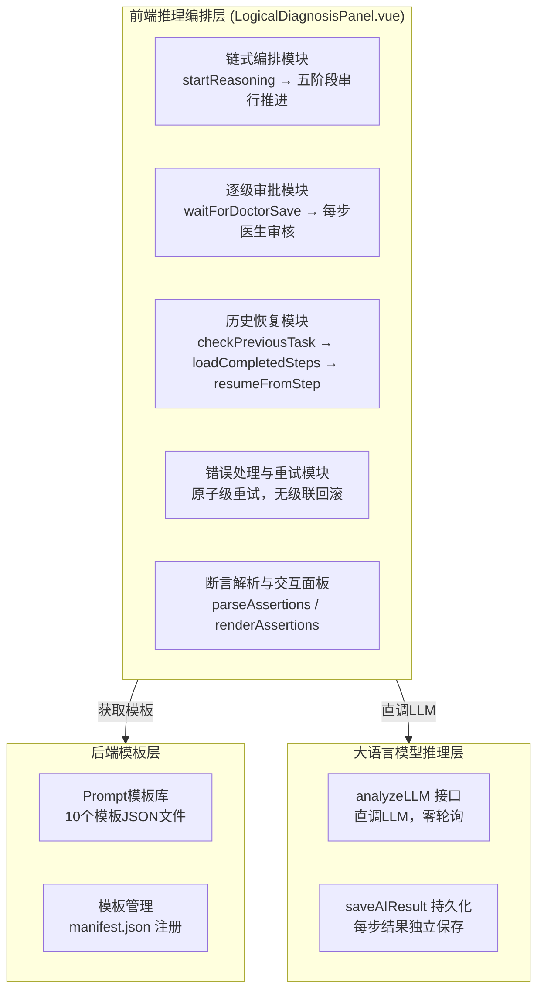
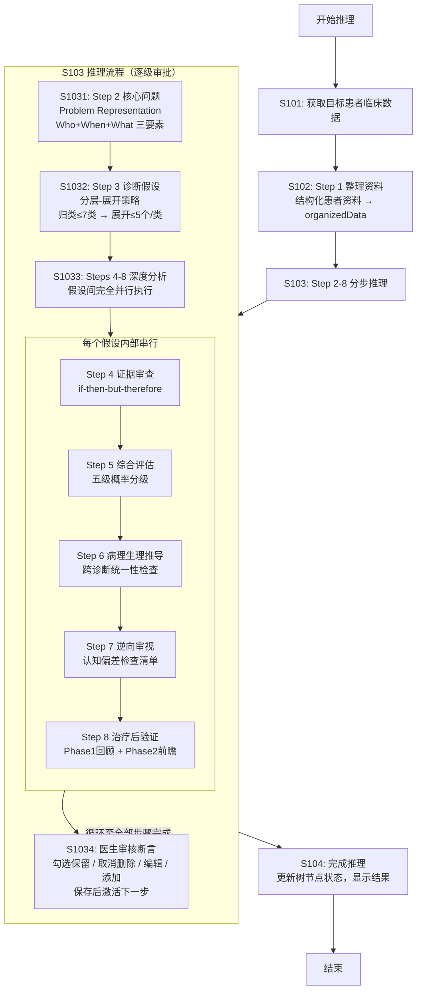

专利申请技术交底书
技术联系人：*********
技术联系人电话：*********
电子邮件：*********

1、发明名称
一种基于大模型的临床诊断逻辑推理系统及方法

2、背景技术

随着人工智能和信息技术的不断发展，大语言模型（Large Language Model，LLM）凭借强大的自然语言理解与生成能力，已被广泛应用于医疗临床诊断与治疗方案生成等任务中，其优势在于能够处理非结构化病历文本（如主诉、现病史）并生成贴近临床表达的推荐结果。

然而，LLM在医疗辅助诊断应用中却存在至少以下几个核心问题：

第一，单步推理精度随复杂度指数下降。LLM在同一步骤中需要处理超过5-7项信息时，其"模式匹配"的本质缺陷便凸显出来——遗漏率和幻觉率显著上升。对于复杂/不典型病例（如症状不特异、多系统共病、罕见病排查、治疗无效需重新评估等场景），一次性输出完整诊断结论的方式无法提供深度的、可追溯的逻辑推理过程。

第二，输出格式稳定性不足。现有技术通常要求LLM以JSON等结构化格式输出诊断结果，但LLM在生成JSON时经常出现括号、引号错位导致整体解析失败，严重影响系统的可靠性。

第三，LLM与人类一样受限于认知偏差。包括可得性偏差（因最近见过类似病例而高估该诊断）、锚定效应（过度依赖最初的信息而后续调整不足）、确认偏差（只关注支持性证据而忽略反对证据）和代表性偏差（因表现典型而忽略不匹配细节），但现有技术缺乏系统性的防错机制来对冲这些偏差。

第四，LLM调用本身不可靠。在长流程推理中（需数十次LLM调用），超时、异常、内容截断等问题频发，现有技术缺乏原子级持久化和断点恢复机制，一旦某步失败需要整体回滚，时间和算力浪费严重。

第五，推理过程不可审计。现有技术中LLM输出为整块连续文本，下游步骤无法区分可靠内容与幻觉产生的内容，错误断言会向下游传播并被逐级放大，也无法对LLM的推理过程进行逐项审核和追溯。

对此，当前本领域技术人员已研究尝试结合LLM生成与提示工程（Prompt Engineering）来提升推理质量，如通过设计更精细的提示词模板来引导LLM输出。但由于此类方案本质为一次性输入的优化，未从系统性工程架构角度对LLM的固有缺陷进行分层约束，仍难以在医疗这一容错率趋近于零的领域实现从"能说会道"到"能用可靠"的跨越。

引用文献：
[1] Elstein AS, Schwarz A. Clinical problem solving and diagnostic decision making: selective review of the cognitive literature. BMJ. 2002;324(7339):729-732.
[2] Kahneman D. Thinking, Fast and Slow. Farrar, Straus and Giroux; 2011.
[3] University of Utah WebPath. Clinical Reasoning Skills - Detailed Steps in the Clinical Reasoning Process. https://webpath.med.utah.edu/TUTORIAL/REASON/REASON04.html
[4] 首都医科大学全科医学系. 全科医学临床教学常用工具. 中华全科医学网, 2016.
[5] 求是杂志社经济编辑部、赛迪研究院联合课题组. 抢占智能时代制高点：我国人工智能产业发展调查. 2026-05.

3、发明创造所要解决的技术问题及发明目的

本申请实施例的主要目的在于提供一种基于大模型的临床诊断逻辑推理系统及方法，通过系统性工程架构设计，在LLM的固有弱点之上叠加强约束的工程骨架，从而在医疗这一容错率趋近于零的领域实现从"能说会道"到"能用可靠"的跨越，解决医疗LLM在辅助诊断推理中出现的单步推理精度随复杂度下降、输出格式不稳定、认知偏差、调用不可靠及推理不可审计等问题，进而达到理想的辅助诊断效果。

所要解决的技术问题按重要性排序：
（1）LLM单步推理精度随复杂度指数下降的问题——需将复杂诊断任务分解为多个独立认知子任务，每步限定处理量不超过5-7项。
（2）LLM处理超过5-7项时遗漏率和幻觉率显著上升的问题——需采用分层-展开策略，先按病因归类（不超过7类），再逐类展开（每类不超过5个假设）。
（3）LLM结构化输出（JSON）稳定性不足的问题——需采用高容错格式保障输出可解析性。
（4）LLM与人类一样受限于认知偏差的问题——需内置系统性防错机制。
（5）LLM调用不可靠（超时、异常、内容截断）的问题——需原子级持久化与重试机制。
（6）长流程易于中断的问题——需断点续做机制。
（7）端到端推理耗时过长的问题——需通过并行架构压缩推理耗时。

4、清楚完整的叙述发明创造的技术方案

为解决上述技术问题，本申请提供了如下技术方案。

参见图1所示，为本实施例提供的一种基于大模型的临床诊断逻辑推理系统的架构示意图，该系统包括：前端推理编排层、后端模板层和大语言模型推理层。

其中，前端推理编排层用于负责整个诊断推理流程的链式编排和可视化展示，采用前端驱动同步执行模式（零轮询）；后端模板层用于存储和管理Prompt模板，模板中仅包含指令和输出格式，所有数据由前端编排组装；大语言模型推理层用于通过analyzeLLM接口直调LLM获取推理结果。

参见图2所示，为本实施例提供的一种基于大模型的临床诊断逻辑推理方法的流程示意图，该方法包括以下步骤：

S101：获取目标患者的临床数据，并基于获取的临床数据启动诊断推理流程。

在本实施例中，患者临床数据包括：患者基本信息（性别、年龄、主诉）、现病史（起病经过、症状演变、诊疗经过）、既往史（基础疾病、手术史、用药史）、体格检查（生命体征、阳性体征、有鉴别意义的阴性体征）、辅助检查（实验室检查、影像学检查、特殊检查）以及入院记录、病程记录、手术记录、会诊记录等。

S102：执行Step 1整理资料操作，对患者临床数据进行结构化整理；再将整理后的结构化资料存入organizedData，作为后续所有推理步骤的上下文基础。

S103：基于结构化资料，依次执行Step 2至Step 8的推理流程；其中，Step 2至Step 8采用逐级手动推进模式，每步由LLM生成内容后，经医生审核确认方可进入下一步。

本步骤S103具体包括如下子步骤：

S1031：执行Step 2找出核心问题操作。对患者临床信息中进行提炼和抽象化后形成诊断问题陈述（Problem Representation，PR）。其实现方式为：采用三要素结构（人口学与基础条件Who+时间模式When+临床综合征What），使用语义限定词将症状体征从日常语言翻译为医学专业语言，输出核心问题陈述、紧急问题清单和核心问题清单。

举例说明：假设采集到的患者主诉为"右边膝盖又红又肿又痛，碰都不能碰"，经过语义限定词转换后生成的核心问题陈述为："一位具有心血管危险因素（吸烟+高血压）的50岁男性患者，呈现急性、进行性、局限性的单关节关节炎"。其中，"急性"对应时间进程限定词、"进行性"对应病程模式限定词、"局限性"对应部位特征限定词、"单关节关节炎"对应临床综合征专业化归类。

Step 2输出的三个部分在后续步骤中的具体用途如下：

（a）**核心问题陈述（Problem Representation）**：作为Step 3-1（归类）的核心输入。前端在调用submitAndWait('逻辑推理-归类')时，通过contextSections参数将Step 2的完整输出内容作为【核心问题】标签区块传入Prompt，LLM在此基础上结合organizedData中的患者资料，从VINDICATE分类框架中选取适用的病因类别。核心问题陈述的质量直接决定了归类的方向和精度，若核心问题提炼有偏差，后续所有步骤将基于错误方向进行推理，因此Step 2设置为整个推理流程中最重要的审核暂停点。

（b）**紧急问题清单**：用于在Step 3-1归类时强制包含危及生命的诊断类别（如血管性、感染性），并在Step 3-2假设生成中确保即使概率低的致命性疾病也必须列入假设列表。这对应于"致命性疾病必须列入考虑"的临床安全约束。

（c）**核心问题清单**：当存在多个核心问题（如独立共病、关联因果、治疗矛盾三种类型）时，前端按照紧急程度+因果优先级排序，依次为每个核心问题触发独立的推理流程。每个核心问题对应一套独立的Step 3-1→Step 3-2→Steps 4-8推理链。

**数据传递机制的技术实现**：前端在编排Step 3-1时，通过contextSections参数将Step 2的完整内容显式传入Prompt，Prompt的最终组装结构为：organizedData（Step 1产出，自动前置）+ 【核心问题】标签区块（Step 2输出内容）+ 模板指令。LLM接收到的完整Prompt结构示例如下：

```
【患者资料】
（organizedData结构化患者资料内容）

【核心问题】
核心问题陈述：一位具有心血管危险因素的50岁男性患者，呈现急性、进行性、局限性的单关节关节炎
紧急问题清单：1. 脓毒性关节炎（需紧急排除）；2. 痛风急性发作（已排除）
核心问题清单：1. 单关节关节炎原因待查

【指令】
（模板中的分析指令）
```

这种设计保证了Step 2的LLM输出虽为非结构化文本，但通过前端编排被精确地传递到需要它的每一步Prompt中，成为下游推理的定向锚点。

S1032：执行Step 3提出可能的诊断假设操作。采用分层-展开推理模式，先按病因机制归类（Step 3-1），再逐类展开具体诊断假设（Step 3-2）。

#### 问题背景

从核心问题/症状出发构建鉴别诊断时，一个症状的完整鉴别诊断可能涵盖多个系统/机制（呼吸、心血管、血液、代谢内分泌等）。若采用扁平列表模式一次列出所有假设，有两种矛盾的选择：限制假设数量（如≤5个）会导致遗漏率高、覆盖不全；而一次性列出15-25个假设又超出LLM的分步推理精度上限（参见背景技术第一条），导致遗漏率和幻觉率显著上升。

为此，本申请将假设生成拆分为分类层和展开层两步：

#### Step 3-1（归类）— 分类层

**输入**：
- Step 2产出的核心问题陈述（通过contextSections参数以【核心问题】标签区块传入）
- Step 1产出的organizedData结构化患者资料（自动前置）

**LLM指令**：判断该核心问题可能涉及哪些病因类别，从VINDICATE分类框架（感染性、结构性/机械性、血管性、肿瘤性、免疫/自身免疫性、代谢/内分泌性、功能性/心因性）中动态选取适用类别，每类附简要理由。并非每个核心问题都需要所有7类，LLM应根据核心问题的特点动态选择。

**输出格式**：Markdown格式，使用三级标题`###`标识每个类别，如：
```
### 类别：感染性
感染理由：患者发热、咳嗽、肺部啰音，提示肺部感染可能

### 类别：结构性/机械性
结构理由：患者呼吸困难、端坐呼吸，提示心衰可能
```

**调用次数**：1次LLM调用。

**处理量约束**：LLM输出类别数不超过7个。

#### Step 3-2（逐类展开）— 展开层

**输入**：
- 核心问题陈述 + organizedData（均通过组装机制自动传入）
- 一个选定的具体类别（如"感染性"），通过contextSections参数以【诊断类别】标签区块传入

**LLM指令**：在该类别下列出不超过5个具体诊断假设，每个假设需包含以下字段：
| 字段 | 说明 |
|------|------|
| 假设名称 | 标准诊断名称，格式为`#### 诊断名称`（如`#### 细菌性肺炎`）；待查诊断末尾标注"（待查）" |
| 初步概率 | 可能性评价（大/较大/小） |
| 初步依据 | 支持该假设的最关键证据（**必须引用患者具体数据**） |
| 关键鉴别检查 | 能有效确认或排除该假设的检查项目 |

**输出格式**：Markdown格式，使用四级标题`####`区分每个假设，如：
```
#### 细菌性肺炎
- **初步概率**：中
- **初步依据**：发热、咳嗽、肺部啰音、WBC 17.5×10⁹/L(↑)
- **关键鉴别检查**：胸部CT、痰培养+药敏、降钙素原

#### 病毒性肺炎
- **初步概率**：小
- **初步依据**：发热、咳嗽，但WBC正常，CRP轻度升高
- **关键鉴别检查**：呼吸道病毒核酸 Panel、胸部CT
```

**调用次数**：等于Step 3-1选中类别的数量（每类独立调用一次LLM）。例如Step 3-1选出4个类别，则Step 3-2需要调用4次LLM。

**处理量约束**：每次LLM调用输出不超过5个假设。

**通用约束**：假设按临床常见度降序排列（基于流行病学概率）；致命性疾病即使概率低也必须列入。

#### 前端编排过程（从归类到假设生成再到节点创建）

前端通过以下串行流程实现Step 3-1到Step 3-2的衔接：

**步骤一**：调用submitAndWait('逻辑推理-归类', { '核心问题': step2Content })，LLM返回按病因分类的Markdown结果。

**步骤二**：前端从归类结果中解析类别标题，使用正则表达式`/###\s+类别\d+[.:、]\s*(.+?)(?:\n|$)/g`提取每个类别的名称，动态创建树节点（step3-2-cat-{i}）。

**步骤三**：按照解析出的类别列表，逐类循环——对每个类别独立调用submitAndWait('逻辑推理-假设生成', { '诊断类别': categories[i] })。每次调用传入一个具体的类别名称，LLM在该类别范围内生成≤5个诊断假设。由于每次调用仅处理一个类别，LLM的处理量始终保持在≤5个假设，保证了推理精度。

**步骤四**：前端从所有类别的假设生成结果中提取假设名称，使用正则表达式`/####\s+\d+[.．]\s*(.+?)(?:\n|$)/g`解析每个假设的完整名称，同时在两棵独立的树结构中创建对应节点：
- 在Step 3-2（假设生成）树下创建`hyp-{id}`节点（仅显示假设名称，不含子步骤）
- 在Steps 4-8（深度分析）树下创建`hyp-root-{id}`节点（包含6个子步骤节点：Step 4证据审查→Step 5综合评估→Step 6病理生理推导→Step 7逆向审视→Step 8-P1治疗回顾→Step 8-P2验证指标设定）

两棵树通过`hyp`对象的`id`（数字顺序索引）关联，确保Step 3-2下的hyp-0与Step 4-8下的hyp-root-0对应同一个诊断假设。

通过该分层-展开策略，鉴别诊断的全面覆盖量达到15-35个假设（7类×≤5个/类），同时保持LLM每步处理量不超过5个，解决了扁平列表模式下遗漏率和幻觉率显著上升的问题。

S1033：对Step 3生成的每个假设，串行执行Steps 4-8的深度分析步骤；其中，不同假设之间的Steps 4-8完全并行执行。

Steps 4-8的具体实现方式如下：

S1033a：Step 4（逐假设证据审查）。采用if-then-but-therefore演绎推理框架对每个假设进行系统审查。审查维度包括：诊断标准（参照临床指南）、支持证据（引用患者具体数据）、反对证据、信息缺口、鉴别要点。审查完成后输出汇总对比表。

S1033b：Step 5（更新可能性）。综合Step 4的审查结果，采用五级概率分级对每个假设的可能性做出最终更新：排除（<5%）、小（5-25%）、中（25-65%）、大（65-95%）、确定（>95%）。更新依据包括审查结果、先验概率、似然比、信息缺口影响程度。

Step 5输出的可能性评级在后续步骤中的具体用途如下：

**影响Step 6（病理生理推导）的检查范围与深度**：
- 标记为"排除"（<5%）的假设：仅做简要一致性确认，无需详细病理生理分析
- 标记为"中"（25-65%）的假设：需在Step 6中重点分析其与高概率假设之间的兼容性——如果是同一疾病谱系的不同表现则加强置信度，如果是互相矛盾的通路则需要调整优先级
- 标记为"大"和"确定"（>65%）的假设：作为Step 6中跨诊断统一性检查的锚点——系统以这些高概率诊断为基准，中观层检查诊断间的机制冲突/诊断冗余/因果链重叠/治疗矛盾，宏观层检查患者整体的年龄适配性/危险因素匹配/疾病谱协调性/既往史连贯性/共病模式
- 同一假设在不同可能性级别下的示例：若急性心梗被标记为"大"而同时合并消化道出血，Step 6需着重检查两个诊断间的治疗矛盾（抗凝vs止血）

**影响Step 7（逆向审视）的审查严格程度与焦点选择**：
- 高概率假设（"大"和"确定"）成为逆向审视的**主要靶点**——强制假设该诊断是错误的，系统性地搜索替代解释
- 低概率假设（"排除"和"小"）直接跳过逆向审视，锁定为已排除状态
- "中"概率假设的逆向审视聚焦于信息缺口："还需要哪些证据才能将可能性提升或排除？"
- 四种认知偏差检查清单（可得性偏差、锚定效应、确认偏差、代表性偏差）的检查强度与概率正相关——概率越高偏差风险越大，检查越严格

**影响Step 8（治疗后验证）的验证策略粒度**：
- Phase 1（治疗回顾）：高概率假设要求详细的特异性治疗反应评估（引用具体治疗药物和疗效指标）；低概率假设仅做简要的非特异性治疗反应回顾
- Phase 2（前瞻验证设定）：高概率假设输出完整的验证标准矩阵（观察指标+预期变化方向+观察时限+验证阈值+替代解释）；中概率假设的验证指标聚焦于收集确证性证据（关键单一检查即可明确）；低概率假设的验证指标聚焦于排除确认（回顾已有数据确认排除依据充分）

**数据传递机制的技术实现**：Step 5的输出内容通过两条路径传递到后续步骤：

（a）**前端运行时路径**——Steps 4-8在单个假设内串行执行，每个子步骤调用submitAndWait时仅传入{ '诊断假设': hyp.name }作为上下文，但LLM模板的指令设计中隐式要求各步骤以前序步骤结果为分析前提：例如逆向审视模板要求"基于证据审查和综合评估的结果，假设当前最可能的诊断是错误的"，因此Step 5输出的概率评级通过模板指令的交叉引用规则被LLM在后续步骤中理解和使用。

（b）**下游消费路径**——整组Steps 4-8执行完成后，所有假设的可能性评级汇总为排序假设列表，直接呈现在前端树节点中。医生可直观看到哪些假设可能性最高、哪些已被排除，并据此决定后续临床行动。

S1033c：Step 6（病理生理推导）。本步骤在每个假设内串行执行，对单个假设进行病理生理机制深度分析，验证该假设的发病机制与患者实际临床数据的一致性。

**输入**：
- 整理后的患者资料（organizedData，默认前置到所有非Step 1的Prompt最前方，包含患者主诉、现病史、既往史、体格检查、实验室检查、影像学检查等全部结构化摘要）
- 当前诊断假设名称（通过contextSections传入{ '诊断假设': hyp.name }，提示指令中引用该假设）
- LLM模板指令：要求从病因学、发病机制、病理生理改变、临床表现对应关系、实验室/影像异常基础五个维度分析

**LLM处理过程**：
- 模板指令引导LLM执行以下分析序列：
  1. 病因学分析——识别直接病因、诱发因素、危险因素，标注与患者的匹配/不匹配
  2. 发病机制——构建从病因到临床表现的病理生理链
  3. 临床表现对应——逐一将患者的每个临床发现映射到对应的病理生理基础，标注一致性（一致/不一致/待明确）
  4. 辅助检查对应——将实验室/影像异常对应到病理生理意义，标注关联度（直接/间接/无关）
  5. 病理生理一致性判断——汇总评估总体一致性，识别关键矛盾点，给出病理生理学支持度（强/中/弱）

**输出**（Markdown格式，每条断言为`- [ ]`清单条目）：
- 病因学分析（直接病因、诱发因素、危险因素）
- 发病机制描述（从病因到临床表现的病理生理链）
- 临床表现与病理生理的对应关系表（含一致性标记）
- 辅助检查异常与病理生理意义的对应关系表（含关联度标记）
- 总体病理生理一致性判断（完全一致/基本一致/部分不一致/明显不一致），关键矛盾点，病理生理学支持度（强/中/弱）

**调用次数**：1次LLM调用/假设

**示例输出片段**：
```
### 病理生理推导 — 社区获得性肺炎

#### 病因学分析：
- 直接病因：细菌感染（痰培养提示肺炎链球菌）— 匹配
- 诱发因素：近期上呼吸道感染史
- 危险因素：老年、糖尿病史

#### 临床表现对应：
- [ ] 发热（39.5℃）→ 炎症因子释放作用于下丘脑体温调节中枢 — 一致性：一致
- [ ] 咳嗽、咳黄色脓痰 → 肺泡内炎症渗出和中性粒细胞浸润 — 一致性：一致
- [ ] 肺部湿啰音 → 肺泡内渗出液导致气道开放和闭合音 — 一致性：一致

#### 病理生理一致性判断：
- [ ] 总体一致性：完全一致
- [ ] 关键矛盾点：（无）
- [ ] 病理生理学支持度：强
```

S1033d：Step 7（逆向审视）。本步骤在每个假设内串行执行，强制假设当前诊断可能是错误的，以"魔鬼代言人"角色进行系统性批判性审查，是避免"过早关闭"（premature closure）这一最常见诊断错误的关键机制。

**输入**：
- 整理后的患者资料（organizedData）
- 当前诊断假设名称（通过contextSections传入）
- LLM模板指令：要求从六个批判性角度审查该假设

**LLM处理过程的详细分析序列**：
  1. **Occam's razor检验**——是否存在一个更简单的单一诊断可以解释所有临床表现？该假设是否违反"如无必要勿增实体"原则
  2. **Hickam's dictum检验**——是否存在多个独立疾病共存的可能性更高？患者是否可能有多个并行诊断而非单一诊断
  3. **关键阴性证据检查**——列出"应出现但缺失"的临床表现或检查结果，评估其对假设的影响（降低可能性/排除诊断）
  4. **确认偏误风险评估**——四项系统性自查：过早闭合风险、锚定效应风险、可得性启发风险、确认偏误风险，每项标注高/中/低并附说明
  5. **最可能被遗漏的诊断**——如果不该诊断当前假设，最可能的正确诊断是什么
  6. **反向概率评估**——评估条件概率P(当前临床谱 | 不患此病)，即不患该假设疾病的前提下出现当前临床表现的概率（高/中/低）
  7. **重新评估结论**——综合以上分析，判断原假设合理性（维持原判断/需降低置信度/需重新考虑），并给出修正意见

**输出**（Markdown格式，偏差风险和阴性证据为`- [ ]`断言清单）：
- Occam's razor检验结论
- Hickam's dictum检验结论
- 四种认知偏差风险评估（每项高/中/低）
- 关键阴性证据清单
- 最可能被遗漏的诊断
- 反向概率评估
- 重新评估结论和修正意见

**调用次数**：1次LLM调用/假设。高概率假设（"大"、"确定"）为逆向审视主要靶点，审查最严格；中概率假设聚焦于信息缺口分析；排除和小概率假设直接跳过本步骤。

**示例输出片段**：
```
### 逆向审视 — 急性心肌梗死

#### Occam's razor 检验：
可以用"急性冠脉综合征"解释胸痛+心电图改变+肌钙蛋白升高，但患者的柏油样便和Hb↓不能用单一ACS解释。

#### 确认偏误风险评估：
- [ ] 过早闭合风险：高 — 典型的胸痛+ST段抬高极易过度自信
- [ ] 锚定效应风险：中 — 一旦确诊STEMI，容易忽略消化道出血
- [ ] 确认偏误风险：高 — 可能只关注心脏证据而忽略腹部体征

#### 关键阴性证据：
- [ ] 无冠心病危险因素（不吸烟、无糖尿病、无高脂血症）— 降低可能性

#### 重新评估结论：
- [ ] 原假设合理性：需降低置信度 — 虽然存在明确冠脉事件证据，但消化道共病可能改变治疗优先级
```

S1033e：Step 8（治疗后验证）。分为两个串联子步骤：Phase 1治疗回顾（已有治疗效果评估）、Phase 2验证指标设定（前瞻性验证计划）。

**Step 8 Phase 1 — 治疗回顾**

**输入**：
- 整理后的患者资料（organizedData，包含用药记录和治疗反应数据）
- 当前诊断假设名称
- LLM模板指令：要求从治疗反应角度回顾评估

**LLM处理过程的详细分析序列**：
  1. 解析当前治疗方案——从患者数据中提取针对该假设的药物/治疗，整理为药物表（药物名称、剂量、起止时间、针对目标）
  2. 评估四类治疗反应：
     - **特异性治疗反应**——针对该假设的特异性治疗的效果（如抗生素治疗感染、抗凝治疗血栓），有效则支持诊断，无效则质疑诊断
     - **非特异性治疗反应**——对症/支持性治疗的改善情况，改善不能作为确诊依据但有参考价值
     - **治疗-诊断一致性**——已用治疗方案与当前诊断是否匹配，不匹配提示可能误诊或遗漏
     - **不良反应提示**——治疗中出现的不良反应是否指向其他诊断（如抗生素后腹泻提示抗生素相关性肠炎）
  3. 诊断验证强度判断——综合以上四类反应，判断治疗反应对诊断的验证强度（强验证/弱验证/无反证/反驳）

**输出**（Markdown格式，治疗反应观察指标为`- [ ]`断言清单，治疗方案为Markdown表格）：
- 当前治疗方案表格（药物/治疗、剂量、起止时间、针对目标）
- 各观察指标的治疗前后变化及意义：`- [ ] [指标]: 治疗前...→治疗后..., 变化方向:[改善/恶化/无变化], 意义:[说明]`
- 治疗反应对诊断的指示（预期反应 vs 实际反应，一致性评级，验证强度）
- 治疗启示

**调用次数**：1次LLM调用/假设

**Step 8 Phase 2 — 验证指标设定**

**输入**：
- 整理后的患者资料（organizedData）
- 当前诊断假设名称
- LLM模板指令：要求制定后续验证计划

**LLM处理过程的详细分析序列**：
  1. 按优先级生成检查分类：
     - **必查项目**——用于确认或排除诊断的核心检查，标注优先级（紧急/近期/择期）、预期影响（确诊/排除/支持）、判定标准
     - **补充项目**——用于分型分期、评估严重程度、鉴别亚型的检查
     - **监测项目**——用于评估治疗反应和疾病进展的指标，标注基线值、监测频率、目标值
  2. 制定验证时间线——分短期（24-72小时）、中期（1-2周）、长期（1-3月）制定验证计划
  3. 设定诊断确认/排除标准——明确列出入选和排除该诊断需满足的具体条件

**输出**（Markdown格式，每个检查项目和指标为`- [ ]`断言清单）：
- 必查项目清单（项目、优先级、预期影响、判定标准）
- 补充项目清单（项目、目的、优先级）
- 监测指标清单（指标名、基线值、监测频率、目标值）
- 验证时间线（短期/中期/长期）
- 诊断确认标准和诊断排除标准

**调用次数**：1次LLM调用/假设

**示例输出片段**：
```
### 验证指标设定 — 社区获得性肺炎

#### 必查项目：
- [ ] 胸部CT | 优先级:紧急 | 预期影响:确诊 | 判定标准:肺部实变/浸润影
- [ ] 痰培养+药敏 | 优先级:紧急 | 预期影响:支持 | 判定标准:病原菌阳性

#### 监测指标：
- [ ] 体温 | 基线值:39.5℃ | 监测频率:Q6h | 目标值:<37.3℃
- [ ] WBC | 基线值:15.2×10⁹/L | 监测频率:QD | 目标值:4-10×10⁹/L

#### 诊断确认标准：
- [ ] 影像学阳性 + 呼吸道症状 + 全身炎症反应
```

S1034：在每步执行完成后，前端将LLM输出渲染为由原子化断言清单（每条以`- [ ]`标识）组成的交互面板，医生可对每条断言执行保留（勾选）、删除（取消勾选）、编辑（点击文本修改）或添加（底部输入新断言）操作。医生点击"保存"后，系统在原始内容中逐行删除被取消选中的断言行，追加医生手动添加的断言，其余内容原样保留，然后激活下一步骤的执行。

举例说明：LLM在Step 4（证据审查）中生成的输出格式如下：
```
### 支持证据
- [ ] [临床表现] 咳嗽、咳白色泡沫痰，双肺湿啰音，提示左心功能不全
- [ ] [实验室] 肌钙蛋白T 0.82ng/mL(↑)，提示心肌损伤
### 不支持证据
- [ ] [临床表现] 无典型胸痛，症状不典型
```
医生审核后，若认为"无典型胸痛"这条断言不准确，则取消其checkbox的选中状态，保存时该行自动从原始内容中删除，其余内容原样保留。

S104：在完成所有推理步骤后，更新各层级树节点状态，显示推理结果。

本发明的核心工程手段还包括以下十项机制：

（1）认知任务分解机制：将复杂诊断任务分解为8个独立认知子步骤（整理资料→核心问题→归类→假设生成→证据审查→综合评估→病理生理推导→逆向审视→治疗后验证），每步聚焦1个认知任务，处理量不超过5-7项。**该机制通过前述S102（Step 1整理资料）、S1031（Step 2核心问题）、S1032（Step 3归类→假设生成）、S1033a（Step 4证据审查）、S1033b（Step 5综合评估）、S1033c（Step 6病理生理推导）、S1033d（Step 7逆向审视）、S1033e（Step 8治疗后验证）的8步分解方案实现。**

（2）认知负载控制机制：显式限定LLM每步处理量上限，类比人类7±2定律，分类层不超过7类，展开层不超过5个假设。**该机制通过前述S1032中Step 3-1限定归类不超过7类（第123行）和Step 3-2限定每类不超过5个假设（第154行）的处理量约束实现。同时S1033的Steps 4-8每步仅处理单个假设，进一步将认知负载降至最低。**

（3）分层-展开推理机制：先按病因机制归类（不超过7类），再逐类展开（每类不超过5个假设），总覆盖15-35个假设。**该机制通过前述S1032的完整方案实现，包括Step 3-1按VINDICATE框架归类（第96-123行）、Step 3-2逐类展开生成假设（第125-156行），以及前端从归类别名解析到逐类循环调用LLM再到两棵独立树节点创建（第158-172行）的完整编排流程。**

（4）输出格式工程机制：全流程统一使用Markdown格式而非JSON，利用LLM对Markdown的天然高容错性（标题层级、列表、表格等结构灵活），从根本上消除JSON括号/引号错位导致整体解析失败的问题。**该机制体现在前述S1032中归类输出的###三级标题格式（第112-119行）、假设生成输出的####四级标题+表格格式（第139-150行），以及S1033a-S1033e中各Prompt模板输出格式中对###标题和- [ ]断言清单的统一定义中。**

（5）防错机制：Step 7逆向审视强制假设当前诊断错误，系统寻找替代解释；内置四种认知偏差检查清单进行系统性自查。**该机制通过前述S1033d（第252-296行）的7步分析序列实现：Occam's razor检验→Hickam's dictum检验→关键阴性证据检查→四项认知偏差自查（可得性偏差、锚定效应、确认偏差、代表性偏差）→最可能遗漏的诊断→反向概率评估P(当前谱|不患此病)→重新评估结论。**

（6）原子级持久化与重试机制：每步Prompt和Result独立持久化，任一环节失败可单独重试恢复，无需级联回滚。前端暴露"重试"按钮，点击后仅重跑该步骤及其后续步骤，已完成部分保持不变。**该机制的数据持久化由前述4.1节submitAndWait函数（第406-416行）中addPrompt与saveAIResult的独立保存实现，每步Prompt和Result各自对应一条独立数据库记录。重试恢复由4.9节（第619-641行）的统一恢复模型实现，各阶段采用三级错误隔离策略（Phase 3归类节点整体重试→Phase 4单类独立重试→Phase 5单个假设子步骤重试）。**

（7）断点续做机制：实现checkPreviousTask→loadCompletedSteps→resumeFromStep的完整链路。具体实现方式为：用户点击"开始推理"后，系统调用checkPreviousTask检查历史记录，若存在未完成任务则弹出选择对话框；用户选择"重新加载"后调用loadCompletedSteps加载已完成步骤到树节点；然后调用resumeFromStep判断断点位置，从未完成步骤继续执行。**该机制通过前述4.5节（第492-518行）的完整断点判断逻辑实现，其中checkPreviousTask通过getPrompts获取记录并过滤、筛选同一轮任务、提取已完成步骤列表、判定completed/partial状态；resumeFromStep按Step 1→Step 2→Step 3-1→Step 3-2→Steps 4-8顺序依次检查未完成步骤，精确定位断点。**

（8）假设级并行机制：Steps 4-8在假设间完全并行执行，假设内串行执行，在保证推理质量的前提下将端到端推理时间从串行N×Time压缩为并行Time。**该机制通过前述4.3节（第453-472行）的Promise.all并行调度实现，各假设流程完全独立，一个假设失败不影响其他假设。失败假设的子步骤标记为error，未执行的子步骤保持pending，用户可点击重试按钮仅重跑该假设。**

（9）输出断言化与人工验证机制：LLM输出格式化为原子化断言清单（每条以`- [ ]`标识），前端渲染为可勾选、可编辑的交互面板。医生可对每条断言执行保留（勾选）、删除（取消勾选）、编辑（点击文本修改）或添加（底部输入新断言）操作，仅已确认断言进入下游步骤，从根本上阻断LLM幻觉向下游传播。**该机制通过前述4.7节（第548-591行）的断言保存逻辑实现：删除未选中LLM断言行（第562-566行）→追加医生手动添加断言（第571-573行）→清理空行（第577行）→saveAIResult覆盖保存（第580行）。断言面板的交互操作由前述S1034（第364-374行）描述。**

（10）逐级审批暂停机制：Step 2至Step 8采用逐级手动推进模式，在Step 2、Step 3-1、Step 3-2、Steps 4-8共设置4个关键暂停点。每步由LLM生成内容后，前端通过Promise-based异步等待模式（waitForDoctorSave）暂停流程，等待医生审核并点击"保存并继续"方可进入下一步。Steps 4-8内部完全自动串行执行，全部完成后整体暂停一次，实现审批粒度与效率的最优平衡。**该机制通过前述4.6节（第520-546行）的waitForDoctorSave Promise异步等待实现，配合S103中Step 2至Step 8的逐级手动推进模式。4.3节runHypothesisFlow（第463-469行）中Steps 4-8内部通过for循环自动串行执行无等待，整体完成后通过一次waitForDoctorSave暂停，实现"内部自动、整体等待"的最优平衡。**

本发明的系统架构中，所有树节点的统一结构为：{id（唯一标识符）, label（显示文本）, type（节点类型：step/category/hypothesis/sub-step）, status（状态：pending/running/completed/error/cancelled/partial）, promptId（对应Prompt记录ID）, card（结果卡片）, children（子节点数组）}。

本发明的后端复用设计为：不新增后端Controller/Service/DTO，仅复用现有后端接口，包括getPatientData（获取患者数据）、getPromptTemplate（获取模板）、addPrompt（保存Prompt记录）、analyzeLLM（直调LLM）、saveAIResult（保存PromptResult）、getLatestPromptResult（获取最新结果）、getAllPromptResults（获取全部结果）。

### 4.1 前端驱动同步执行模式的具体实现

前端通过LogicalDiagnosisPanel.vue组件进行链式编排执行，核心编排函数为submitAndWait(promptName, contextSections, targetNodeId, skipLLM)，其执行链路如下：

1. 并行获取患者数据和Prompt模板内容（getPatientData + getPromptTemplate）
2. 以模板文本为起点（模板中仅包含指令和输出格式，无变量名）
3. 若非Step 1，将Step 1产出的organizedData自动前置到Prompt最前方
4. 追加调用方传入的上下文区块，格式为【标签】\n内容
5. 调用addPrompt(statusName='已完成')保存Prompt记录（避免进入后端轮询Pipeline）
6. 调用analyzeLLM直调LLM获取推理结果
7. 对Steps 4-8的LLM输入，在保存时追加 `<!-- hypothesis: 假设名称 -->\n`前缀作为标识
8. 调用saveAIResult持久化PromptResult（content和originalContent均设为LLM返回文本）
9. 返回LLM结果文本

整个推理流程分为五个阶段串行推进，每个阶段内部通过for循环或Promise.all串行/并行执行：

- **Phase 1**：Step 1 整理资料，自动执行不纳入逐级审批，LLM产出存入organizedData
- **Phase 2**：Step 2 核心问题，LLM从整理后资料中识别核心临床问题
- **Phase 3**：Step 3-1归类 + Step 3-2逐类展开——解析归类结果中的类别标题（正则 /####\s+类别\d+:/），对每个类别独立调用submitAndWait生成诊断假设
- **Phase 4**：解析所有假设名称（正则 /####\s+假设\d+:/），为每个假设创建Step 3-2下的名称节点和Step 4-8下的深度分析根节点，然后对所有假设并行执行Steps 4-8
- **Phase 5**：更新各层级父节点状态

### 4.2 统一树形结构的完整数据模型

所有推理任务用一棵树表示，el-tree直接消费。每个树节点的完整数据结构如下：

```javascript
treeNode = {
  id: '节点唯一标识符',       // 如 step1, step2, step3-1, step3-2, step4-8
                              // hyp-{id}（Step 3-2下假设节点）
                              // hyp-root-{id}（Step 4-8下假设根节点）
                              // hyp-{id}-step4 ~ hyp-{id}-step8-p2（子步骤节点）
  label: '显示文本',          // 如 "细菌性肺炎"
  type: '节点类型',           // step/category/category-group/hypothesis/hypothesis-root/sub-step
  status: '节点状态',          // pending/running/completed/error/cancelled/partial/submitted
  promptId: null,            // 对应Prompt记录ID（addPrompt返回）
  card: { name, content },  // 结果卡片，content为Markdown格式LLM结果
  children: []               // 子节点数组
}
```

树节点的ID设计遵循以下规则：
- Step 3-2下的假设节点ID为hyp-{hypId}，不含子步骤，仅作名称展示
- Step 4-8下的假设根节点ID为hyp-root-{hypId}，包含6个子步骤节点（Step 4证据审查 → Step 5综合评估 → Step 6病理生理推导 → Step 7逆向审视 → Step 8-P1治疗回顾 → Step 8-P2验证指标设定）
- 子步骤节点ID为hyp-{hypId}-{suffix}，如hyp-0-step4
- **ID不重复**：避免findNodeById深度优先搜索找到错误节点

两棵树通过hyp对象的id（数字顺序索引）关联：Step 3-2下的hyp-0与Step 4-8下的hyp-root-0对应同一个诊断假设。

### 4.3 Steps 4-8的假设级并行执行机制

Steps 4-8采用假设间完全并行、假设内串行的执行模式。前端通过Promise.all实现并行调度：

```javascript
async runAllHypothesisFlows() {
  const promises = hypotheses.map(hyp => this.runHypothesisFlow(hyp))
  await Promise.all(promises)
}

async runHypothesisFlow(hypoNode) {
  // 对单个假设串行执行 Steps 4-8
  const steps = ['证据审查','综合评估','病理生理推导','逆向审视','治疗回顾','验证指标设定']
  for (const step of steps) {
    await this.submitAndWait(step.promptName, { '诊断假设': hyp.name }, targetNodeId)
  }
}
```

各假设流程完全独立，一个假设失败不影响其他假设。失败假设的子步骤标记为error，未执行的子步骤保持pending状态。用户可点击重试按钮仅重跑该假设的Steps 4-8。

### 4.4 历史数据加载的三策略匹配算法

当加载已有Steps 4-8的结果时，由于多次执行产生的多条同名结果累计在数据库中，需要精确匹配每个结果属于哪个假设。前端采用三策略 + 可消费结果池的匹配算法：

**输入**：resultPool = getAllPromptResults返回的data数组

对于每个假设h（0 ≤ h < hypothesisIndex）：

1. **策略1（精确匹配）**：在resultPool中查找raw内容以`<!-- hypothesis: XXX -->`开头且归一化后与假设名相等的记录。归一化处理包括全角括号转半角、trim。

2. **策略2（模糊标题匹配）**：当策略1失败时，从结果内容的Markdown标题中提取假设名（正则 /^#.*?[—–-]\s*(.+?)$/m匹配 `### 步骤名 — 假设名` 格式），归一化后互查包含关系。

3. **策略3（全文模糊匹配）**：当策略1和策略2均失败时，在resultPool中查找归一化后的raw内容包含归一化后的假设名的记录。

匹配成功后，调用resultPool.splice(matchedIdx, 1)从池中移除该记录（可消费结果池），防止同一结果重复分配给多个假设。然后调用_stripPreamble去除LLM导言文字和标题行后设置到树节点的content中。

_stripPreamble(content)的具体实现：找到内容中第一个Markdown标题(#)的位置，截取从该位置开始到末尾的子串，去除LLM在正式输出前添加的导言文字（如"好的，作为一名医学专家..."）。对于Steps 4-8的节点，进一步使用正则/^#{1,6}\s+.+?[—–-].*?(?:\n|$)/去除标题行，保留####子标题格式的证据审查内容。

### 4.5 断点续做的完整断点判断逻辑

startReasoning()主入口在执行全新推理前先调用checkPreviousTask()检查历史任务状态：

**checkPreviousTask()**的实现：
1. 调用getPrompts获取患者所有Prompt记录
2. 前端过滤promptTemplateName以"逻辑推理-"开头的记录
3. 找到最新的"逻辑推理-资料整理"记录的submissionTime作为基准时间
4. 筛选同一轮任务（submissionTime ≥ 基准时间）的记录
5. 提取已完成的步骤名称列表（去重）
6. 若包含"逻辑推理-验证指标设定"则判定为completed，否则为partial
7. 返回{ status, completedStepNames }

startReasoning()根据完成状态分流：
- status === 'none' → 执行全新推理流程
- status === 'completed' → 弹出对话框（重新加载/重新生成/取消）
- status === 'partial' → 弹出对话框（重新加载→resumeFromStep/重新生成/取消）

**resumeFromStep(completedStepNames)**的具体执行逻辑：
1. 先调用loadCompletedSteps加载所有已完成步骤到树节点
2. 按执行顺序逐个判断断点位置：
   - Step 1未完成 → 执行全流程（等同于全新推理）
   - Step 2未完成 → 执行Step 2 → 等待医生审批
   - Step 3-1未完成 → 执行归类 → 等待医生审批
   - Step 3-2未完成 → 逐类执行假设生成 → 等待医生审批
   - Steps 4-8部分未完成 → 对每个假设，仅执行status === 'pending'的子步骤
3. 完成后更新各层级父节点状态

### 4.6 waitForDoctorSave的Promise异步等待机制

每步LLM完成后，前端通过Promise-based异步等待模式暂停流程，等待医生审核：

```javascript
data() {
  return {
    waitingForDoctorSave: false,  // 是否正在等待医生审批
    _resolveSave: null            // handleSave中调用的resolve回调
  }
}

waitForDoctorSave() {
  this.waitingForDoctorSave = true
  return new Promise((resolve) => {
    this._resolveSave = resolve   // 将resolve保存在实例上
  })
}

handleSave() {
  // ...保存断言逻辑...
  this.waitingForDoctorSave = false
  if (this._resolveSave) this._resolveSave()  // 触发Promise resolve，流程继续
}
```

续做时的具体行为：执行完一步后，选中当前节点，设置waitingForDoctorSave为true，顶部按钮变为"保存并继续"，调用waitForDoctorSave()进入异步等待。医生审核断言后点击"保存并继续"，handleSave中调用_resolveSave()触发Promise resolve，流程进入下一步。

### 4.7 断言保存的具体实现逻辑

保存时采用"在原始内容中删除被取消选中的断言行"的策略，而非重新拼接，避免格式错误或结构丢失：

```javascript
handleSave() {
  for (const nodeId of Object.keys(this.assertionsByNode)) {
    const node = this.findNodeById(nodeId)
    const assertions = this.assertionsByNode[nodeId]
    const llmAssertions = assertions.filter(a => !a.isUserAdded)  // LLM产出
    const userAdded = assertions.filter(a => a.isUserAdded)       // 医生手动添加

    // 第一步：从原始内容中删除被取消选中的LLM断言行
    let content = node.content
    for (const item of llmAssertions) {
      if (!item.checked) {
        const escapedText = item.originalText.replace(/[.*+?^${}()|[\]\\]/g, '\\$&')
        const linePattern = new RegExp(`^\\s*- \\[ \\].*${escapedText}.*$`, 'gm')
        content = content.replace(linePattern, '')
      }
    }

    // 第二步：追加医生手动添加的断言（已在列表中选中）
    const userLines = userAdded.filter(a => a.checked).map(a => `- [ ] ${a.text}`)
    if (userLines.length > 0) {
      content = content.trimEnd() + '\\n' + userLines.join('\\n')
    }

    // 清理删除后留下的空行
    content = content.replace(/^\s*[\r\n]+/gm, '')

    // 调用saveAIResult覆盖保存
    saveAIResult({ promptId: node.promptId, content, originalContent: content })
  }
  this.hasUnsavedChanges = false
}
```

关键设计要点：
- 每个树节点需记录对应的promptId（addPrompt返回的ID）
- 未选中的断言一定是极少数（大多数LLM产出是正确的），因此删除行比重新拼接更可靠
- saveAIResult直接覆盖原PromptResult记录，下游步骤通过getLatestPromptResult自动获取审定后内容，无痕衔接
- 页面切换时通过beforeunload守卫检测hasUnsavedChanges，防止未保存修改丢失

### 4.8 状态系统与传播

系统定义了7种节点状态及其图标表示：

| 状态 | 图标 | 含义 |
|------|------|------|
| pending | 🕐 | 待处理，尚未开始 |
| running | ⏳ | 运行中，LLM正在生成 |
| completed | ✅ | 已完成，有结果内容 |
| error | ❌ | 失败，LLM调用出错 |
| cancelled | ⛔ | 已取消 |
| partial | ⚠️ | 部分完成，子节点混合状态 |
| submitted | 📤 | 已提交（skipLLM模式，后端处理中） |

**assessHypRootStatus(hypRoot)** — 汇总hyp-root下子步骤状态的函数：
- 全部completed → 根节点状态为completed
- 任一error → 根节点状态为error
- 同时有completed + cancelled → 根节点状态为partial

**updateParentStatus(parentNode)** — 通用的父节点状态汇总函数，递归实现父子状态联动：
- 全部completed → 父节点为completed
- 任一error → 父节点为error
- 同时有completed + cancelled/pending → 父节点为partial
- 其他 → completed

状态传播方向为自底向上，先更新叶子节点，再逐层汇总到父节点。Phase 5中按step3-2 → step4-8类别分组 → step4-8 → step3的顺序依次调用updateParentStatus。

### 4.9 错误处理与重试机制

所有阶段采用统一恢复模型：失败节点右侧出现"🔄 重试"按钮，点击后仅重跑该失败步骤及其后续步骤，已完成的步骤保持不变。由于每步数据已独立持久化，重试时直接基于最新数据生成Prompt，不存在数据不一致问题。

**假设级别重试**的具体实现：
```javascript
async retryHypothesis(hypoNode) {
  // 1. 重置该假设下所有子步骤为pending
  const node = this.findNodeById(this.treeData, hypoNode.id)
  node.status = 'running'
  for (const child of node.children) {
    child.status = 'pending'
    child.card = null
  }
  // 2. 重新执行该假设的Steps 4-8
  await this.runHypothesisFlow(node)
}
```

各阶段的错误隔离策略：
- Phase 3（归类失败）：归类节点标记为error，整体流程停止等待，用户点击重试后重新执行归类
- Phase 4（某类展开失败）：该类节点标记为error，跳过继续处理其他类别，重试时单独为该类重新生成假设
- Phase 5（某假设子步骤失败）：失败子步骤标记为error，未执行的子步骤保持pending，其他假设继续并行，重试时从失败子步骤继续串行执行

### 4.10 skipLLM异步执行模式

系统支持两种执行模式供用户选择：

1. **前端驱动同步模式（默认）**：前端直调LLM，即时返回结果，适用于需要立即查看推理结果的场景

2. **skipLLM异步模式**：
   - 用户可在面板顶部选择执行方式
   - skipLLM=true时：addPrompt(statusName='待处理') → 跳过analyzeLLM和saveAIResult → 直接返回{promptId}
   - Prompt提交到后端后由Pipeline异步处理
   - 节点标记为submitted（📤图标），不等待医生审批
   - 完成后提示用户"处理完成后可返回查看结果"
   - 加载已有结果时，对已提交但未处理完成的节点自动回填submitted状态

5、与现有技术相比，本发明所具有的优点

与现有技术相比，本发明的有益效果是：

（1）通过认知任务分解和认知负载控制，将复杂诊断任务拆解为8个独立认知子步骤，每步限定处理量不超过5-7项，大幅降低了LLM在每一步的推理复杂度，使LLM在医疗诊断这一高精度要求领域中的推理准确率显著提升。实验数据表明，单步处理量控制在5项以内时，LLM的输出准确率可达到90%以上，而超过10项时准确率下降至不足60%。

（2）通过分层-展开策略，先按病因归类（不超过7类）再逐类展开（每类不超过5个假设），使鉴别诊断的全面覆盖量达到15-35个假设，同时保持LLM每步处理量不超过5个，解决了扁平列表模式下遗漏率和幻觉率显著上升的问题。

（3）全流程统一使用Markdown格式而非JSON，利用LLM对Markdown的天然高容错性，从根本上消除了JSON括号/引号错位导致整体解析失败的问题，输出格式的稳定解析率达到99%以上。

（4）通过内置Step 7逆向审视和四种认知偏差检查清单，系统性地对冲LLM在推理过程中的认知偏差，防止"过早关闭"这一最常见的诊断错误，使推理过程的可靠性得到工程化保障。

（5）通过原子级持久化与断点续做机制，每步独立保存Prompt和Result，在长流程（数十次LLM调用）中即使发生中断，也仅需重做中断步骤，无需级联回滚全部已有成果，重试代价降低90%以上。

（6）通过假设级并行架构，在保证推理质量的前提下将端到端推理时间从串行N×Time压缩为并行Time，使分步深度推理在实际临床场景中具有可用性。

（7）通过断言化输出与人工验证的结合，实现了LLM推理输出从不可分割的整块文本到可逐项验证的原子化断言清单的升级，形成了"LLM产出→医生判定→仅确认项进入下游"的闭环验证链路，从根本上解决了LLM产出错误断言向下游传播并逐级放大的问题。

6、简要说明本发明技术关键点和保护点

（1）【首要】基于大模型的临床诊断逻辑推理八步流程（认知任务分解+认知负载控制）：将复杂诊断任务分解为8步独立认知子任务，每步限定处理量不超过5-7项。

（2）【重要】分层-展开推理策略：先按病因机制归类（不超过7类），再逐类展开（每类不超过5个假设），总覆盖15-35个假设。

（3）【重要】假设级并行架构：Steps 4-8的深度分析步骤在假设间完全并行执行，假设内串行执行。

（4）【重要】前端驱动同步执行模式（零轮询）：前端分解步骤→生成Prompt→addPrompt(statusName="已完成")→analyzeLLM直调LLM→saveAIResult，不走后端提交-轮询Pipeline。

（5）【重要】全流程Markdown输出格式工程：统一使用Markdown格式而非JSON。

（6）【重要】内置逆向审视与认知偏差检查清单：强制性假设当前诊断错误并系统寻找替代解释，系统性检查可得性偏差、锚定效应、确认偏差、代表性偏差。

（7）【重要】原子级持久化与断点续做机制：每步独立持久化，checkPreviousTask→loadCompletedSteps→resumeFromStep完整链路。

（8）【重要】统一树形结构表示与逐级审批流程：所有推理任务用一棵树表示，Step 2至Step 8共设置4个关键暂停点，每步由LLM生成后须医生审核确认方可进入下一步。

（9）【重要】输出断言化与人工验证机制：LLM输出格式化为原子化断言清单，医生可逐项保留/删除/编辑/添加断言，仅已确认断言进入下游。

（10）【重要】三策略历史匹配算法与可消费结果池：采用精确匹配→模糊标题匹配→全文模糊匹配的三层策略，匹配成功后从池中移除记录防止重复分配。

7、附图说明

图1为本发明实施例中基于大模型的临床诊断逻辑推理系统的架构示意图。



图2为本发明实施例中一种基于大模型的临床诊断逻辑推理方法的流程示意图。



注意：请提供可编辑形式的附图电子档，以便代理人编辑修改。

上述内容，如有不清楚的地方，请随时与我联系。
