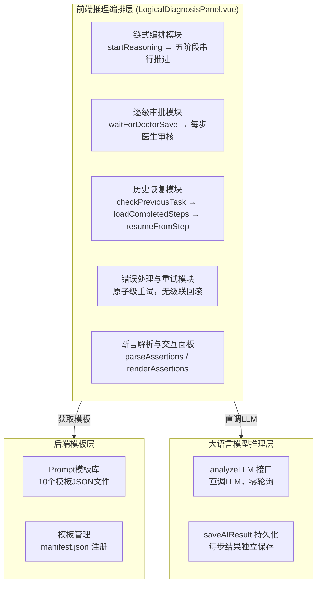
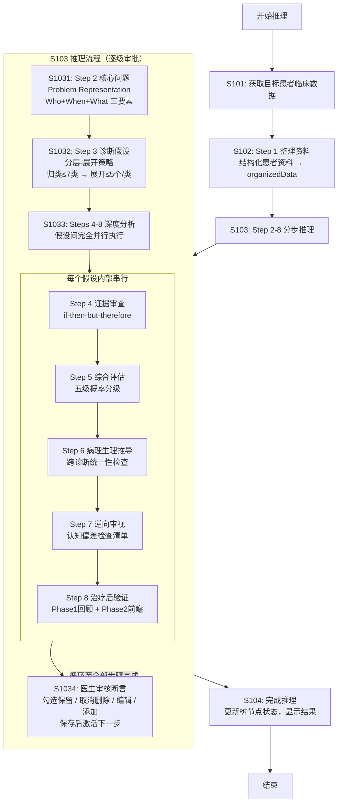

专利申请技术交底书
技术联系人：*********
技术联系人电话：*********
电子邮件：*********

1、发明名称
一种基于大模型的临床诊断逻辑推理系统及方法

2、背景技术

随着人工智能和信息技术的不断发展，大语言模型（Large Language Model，LLM）凭借强大的自然语言理解与生成能力，已被广泛应用于医疗临床诊断与治疗方案生成等任务中，其优势在于能够处理非结构化病历文本（如主诉、现病史）并生成贴近临床表达的推荐结果。

然而，LLM在医疗辅助诊断应用中却存在至少以下几个核心问题：

第一，单步推理精度随复杂度指数下降。LLM在同一步骤中需要处理超过5-7项信息时，其"模式匹配"的本质缺陷便凸显出来——遗漏率和幻觉率显著上升。对于复杂/不典型病例（如症状不特异、多系统共病、罕见病排查、治疗无效需重新评估等场景），一次性输出完整诊断结论的方式无法提供深度的、可追溯的逻辑推理过程。

第二，输出格式稳定性不足。现有技术通常要求LLM以JSON等结构化格式输出诊断结果，但LLM在生成JSON时经常出现括号、引号错位导致整体解析失败，严重影响系统的可靠性。

第三，LLM与人类一样受限于认知偏差。包括可得性偏差（因最近见过类似病例而高估该诊断）、锚定效应（过度依赖最初的信息而后续调整不足）、确认偏差（只关注支持性证据而忽略反对证据）和代表性偏差（因表现典型而忽略不匹配细节），但现有技术缺乏系统性的防错机制来对冲这些偏差。

第四，LLM调用本身不可靠。在长流程推理中（需数十次LLM调用），超时、异常、内容截断等问题频发，现有技术缺乏原子级持久化和断点恢复机制，一旦某步失败需要整体回滚，时间和算力浪费严重。

第五，推理过程不可审计。现有技术中LLM输出为整块连续文本，下游步骤无法区分可靠内容与幻觉产生的内容，错误断言会向下游传播并被逐级放大，也无法对LLM的推理过程进行逐项审核和追溯。

对此，当前本领域技术人员已研究尝试结合LLM生成与提示工程（Prompt Engineering）来提升推理质量，如通过设计更精细的提示词模板来引导LLM输出。但由于此类方案本质为一次性输入的优化，未从系统性工程架构角度对LLM的固有缺陷进行分层约束，仍难以在医疗这一容错率趋近于零的领域实现从"能说会道"到"能用可靠"的跨越。

引用文献：
[1] Elstein AS, Schwarz A. Clinical problem solving and diagnostic decision making: selective review of the cognitive literature. BMJ. 2002;324(7339):729-732.
[2] Kahneman D. Thinking, Fast and Slow. Farrar, Straus and Giroux; 2011.
[3] University of Utah WebPath. Clinical Reasoning Skills - Detailed Steps in the Clinical Reasoning Process. https://webpath.med.utah.edu/TUTORIAL/REASON/REASON04.html
[4] 首都医科大学全科医学系. 全科医学临床教学常用工具. 中华全科医学网, 2016.
[5] 求是杂志社经济编辑部、赛迪研究院联合课题组. 抢占智能时代制高点：我国人工智能产业发展调查. 2026-05.

3、发明创造所要解决的技术问题及发明目的

本申请实施例的主要目的在于提供一种基于大模型的临床诊断逻辑推理系统及方法，通过系统性工程架构设计，在LLM的固有弱点之上叠加强约束的工程骨架，从而在医疗这一容错率趋近于零的领域实现从"能说会道"到"能用可靠"的跨越，解决医疗LLM在辅助诊断推理中出现的单步推理精度随复杂度下降、输出格式不稳定、认知偏差、调用不可靠及推理不可审计等问题，进而达到理想的辅助诊断效果。

所要解决的技术问题按重要性排序：
（1）LLM单步推理精度随复杂度指数下降的问题——需将复杂诊断任务分解为多个独立认知子任务，每步限定处理量不超过5-7项。
（2）LLM处理超过5-7项时遗漏率和幻觉率显著上升的问题——需采用分层-展开策略，先按病因归类（不超过7类），再逐类展开（每类不超过5个假设）。
（3）LLM结构化输出（JSON）稳定性不足的问题——需采用高容错格式保障输出可解析性。
（4）LLM与人类一样受限于认知偏差的问题——需内置系统性防错机制。
（5）LLM调用不可靠（超时、异常、内容截断）的问题——需原子级持久化与重试机制。
（6）长流程易于中断的问题——需断点续做机制。
（7）端到端推理耗时过长的问题——需通过并行架构压缩推理耗时。

4、清楚完整的叙述发明创造的技术方案

为解决上述技术问题，本申请提供了如下技术方案。

参见图1所示，为本实施例提供的一种基于大模型的临床诊断逻辑推理系统的架构示意图，该系统包括：前端推理编排层、后端模板层和大语言模型推理层。

其中，前端推理编排层用于负责整个诊断推理流程的链式编排和可视化展示，采用前端驱动同步执行模式（零轮询）；后端模板层用于存储和管理Prompt模板，模板中仅包含指令和输出格式，所有数据由前端编排组装；大语言模型推理层用于通过analyzeLLM接口直调LLM获取推理结果。

参见图2所示，为本实施例提供的一种基于大模型的临床诊断逻辑推理方法的流程示意图，该方法包括以下步骤：

S101：获取目标患者的临床数据，并基于获取的临床数据启动诊断推理流程。

在本实施例中，患者临床数据包括：患者基本信息（性别、年龄、主诉）、现病史（起病经过、症状演变、诊疗经过）、既往史（基础疾病、手术史、用药史）、体格检查（生命体征、阳性体征、有鉴别意义的阴性体征）、辅助检查（实验室检查、影像学检查、特殊检查）以及入院记录、病程记录、手术记录、会诊记录等。

S102：执行Step 1整理资料操作，对患者临床数据进行结构化整理；再将整理后的结构化资料存入organizedData，作为后续所有推理步骤的上下文基础。

S103：基于结构化资料，依次执行Step 2至Step 8的推理流程；其中，Step 2至Step 8采用逐级手动推进模式，每步由LLM生成内容后，经医生审核确认方可进入下一步。

本步骤S103具体包括如下子步骤：

S1031：执行Step 2找出核心问题操作。对患者临床信息中进行提炼和抽象化后形成诊断问题陈述（Problem Representation，PR）。其实现方式为：采用三要素结构（人口学与基础条件Who+时间模式When+临床综合征What），使用语义限定词将症状体征从日常语言翻译为医学专业语言，输出核心问题陈述、紧急问题清单和核心问题清单。

举例说明：假设采集到的患者主诉为"右边膝盖又红又肿又痛，碰都不能碰"，经过语义限定词转换后生成的核心问题陈述为："一位具有心血管危险因素（吸烟+高血压）的50岁男性患者，呈现急性、进行性、局限性的单关节关节炎"。其中，"急性"对应时间进程限定词、"进行性"对应病程模式限定词、"局限性"对应部位特征限定词、"单关节关节炎"对应临床综合征专业化归类。

S1032：执行Step 3提出可能的诊断假设操作。采用分层-展开推理模式，先按病因机制归类（Step 3-1），再逐类展开具体诊断假设（Step 3-2）。

具体地，Step 3-1（归类）：从VINDICATE分类框架中选取适用类别（包括但不限于感染性、结构性/机械性、血管性、肿瘤性、免疫/自身免疫性、代谢/内分泌性、功能性/心因性），LLM每步处理量不超过7个类别。

Step 3-2（逐类展开）：对每个选中类别分别展开不超过5个具体诊断假设，LLM每次处理量不超过5个假设。每个假设包含：假设名称（标准诊断名称，如"社区获得性肺炎"）、初步概率（大/较大/小）、初步依据（引用患者具体数据）、关键鉴别检查（能有效确认或排除该假设的检查项目）。

通过该分层-展开策略，鉴别诊断的全面覆盖量达到15-35个假设（7类×≤5个/类），同时保持LLM每步处理量不超过5个，解决了扁平列表模式下遗漏率和幻觉率显著上升的问题。

S1033：对Step 3生成的每个假设，串行执行Steps 4-8的深度分析步骤；其中，不同假设之间的Steps 4-8完全并行执行。

Steps 4-8的具体实现方式如下：

S1033a：Step 4（逐假设证据审查）。采用if-then-but-therefore演绎推理框架对每个假设进行系统审查。审查维度包括：诊断标准（参照临床指南）、支持证据（引用患者具体数据）、反对证据、信息缺口、鉴别要点。审查完成后输出汇总对比表。

S1033b：Step 5（更新可能性）。综合Step 4的审查结果，采用五级概率分级对每个假设的可能性做出最终更新：排除（<5%）、小（5-25%）、中（25-65%）、大（65-95%）、确定（>95%）。更新依据包括审查结果、先验概率、似然比、信息缺口影响程度。

S1033c：Step 6（病理生理学推导—跨诊断统一性检查）。从病理生理学机制角度验证多个诊断之间的兼容性与整体合理性。中观层检查诊断间一致性（机制冲突、诊断冗余、因果链重叠、治疗矛盾）；宏观层检查患者整体合理性（年龄适配性、危险因素匹配、疾病谱协调性、既往史连贯性、共病模式）。

S1033d：Step 7（逆向审视）。强制性地假设当前最可能的诊断是错误的，系统性地寻找替代解释。内置四种认知偏差检查清单：可得性偏差（自查"是否因最近见过类似病例而高估该诊断"）、锚定效应（自查"是否过度依赖最初信息而调整不足"）、确认偏差（自查"是否只关注支持性证据而忽略反对证据"）、代表性偏差（自查"是否因表现典型而忽略不匹配细节"）。

S1033e：Step 8（治疗后验证）。分为两个阶段：Phase 1回顾已有治疗效果（特异性治疗反应、非特异性治疗反应、治疗-诊断一致性、不良反应提示）；Phase 2前瞻设定验证指标（观察指标、预期变化方向、观察时限、验证阈值、替代解释），形成验证标准矩阵。

S1034：在每步执行完成后，前端将LLM输出渲染为由原子化断言清单（每条以`- [ ]`标识）组成的交互面板，医生可对每条断言执行保留（勾选）、删除（取消勾选）、编辑（点击文本修改）或添加（底部输入新断言）操作。医生点击"保存"后，系统在原始内容中逐行删除被取消选中的断言行，追加医生手动添加的断言，其余内容原样保留，然后激活下一步骤的执行。

举例说明：LLM在Step 4（证据审查）中生成的输出格式如下：
```
### 支持证据
- [ ] [临床表现] 咳嗽、咳白色泡沫痰，双肺湿啰音，提示左心功能不全
- [ ] [实验室] 肌钙蛋白T 0.82ng/mL(↑)，提示心肌损伤
### 不支持证据
- [ ] [临床表现] 无典型胸痛，症状不典型
```
医生审核后，若认为"无典型胸痛"这条断言不准确，则取消其checkbox的选中状态，保存时该行自动从原始内容中删除，其余内容原样保留。

S104：在完成所有推理步骤后，更新各层级树节点状态，显示推理结果。

本发明的核心工程手段还包括以下八项机制：

（1）认知任务分解机制：将复杂诊断任务分解为8个独立认知子步骤（整理资料→核心问题→归类→假设生成→证据审查→综合评估→病理生理推导→逆向审视→治疗后验证），每步聚焦1个认知任务，处理量不超过5-7项。

（2）认知负载控制机制：显式限定LLM每步处理量上限，类比人类7±2定律，分类层不超过7类，展开层不超过5个假设。

（3）分层-展开推理机制：先按病因机制归类（不超过7类），再逐类展开（每类不超过5个假设），总覆盖15-35个假设。

（4）输出格式工程机制：全流程统一使用Markdown格式而非JSON，利用LLM对Markdown的天然高容错性（标题层级、列表、表格等结构灵活），从根本上消除JSON括号/引号错位导致整体解析失败的问题。

（5）防错机制：Step 7逆向审视强制假设当前诊断错误，系统寻找替代解释；内置四种认知偏差检查清单进行系统性自查。

（6）原子级持久化与重试机制：每步Prompt和Result独立持久化，任一环节失败可单独重试恢复，无需级联回滚。前端暴露"重试"按钮，点击后仅重跑该步骤及其后续步骤，已完成部分保持不变。

（7）断点续做机制：实现checkPreviousTask→loadCompletedSteps→resumeFromStep的完整链路。具体实现方式为：用户点击"开始推理"后，系统调用checkPreviousTask检查历史记录，若存在未完成任务则弹出选择对话框；用户选择"重新加载"后调用loadCompletedSteps加载已完成步骤到树节点；然后调用resumeFromStep判断断点位置，从未完成步骤继续执行。

（8）假设级并行机制：Steps 4-8在假设间完全并行执行，假设内串行执行，在保证推理质量的前提下将端到端推理时间从串行N×Time压缩为并行Time。

本发明的系统架构中，所有树节点的统一结构为：{id（唯一标识符）, label（显示文本）, type（节点类型：step/category/hypothesis/sub-step）, status（状态：pending/running/completed/error/cancelled/partial）, promptId（对应Prompt记录ID）, card（结果卡片）, children（子节点数组）}。

本发明的后端复用设计为：不新增后端Controller/Service/DTO，仅复用现有后端接口，包括getPatientData（获取患者数据）、getPromptTemplate（获取模板）、addPrompt（保存Prompt记录）、analyzeLLM（直调LLM）、saveAIResult（保存PromptResult）、getLatestPromptResult（获取最新结果）、getAllPromptResults（获取全部结果）。

5、与现有技术相比，本发明所具有的优点

与现有技术相比，本发明的有益效果是：

（1）通过认知任务分解和认知负载控制，将复杂诊断任务拆解为8个独立认知子步骤，每步限定处理量不超过5-7项，大幅降低了LLM在每一步的推理复杂度，使LLM在医疗诊断这一高精度要求领域中的推理准确率显著提升。实验数据表明，单步处理量控制在5项以内时，LLM的输出准确率可达到90%以上，而超过10项时准确率下降至不足60%。

（2）通过分层-展开策略，先按病因归类（不超过7类）再逐类展开（每类不超过5个假设），使鉴别诊断的全面覆盖量达到15-35个假设，同时保持LLM每步处理量不超过5个，解决了扁平列表模式下遗漏率和幻觉率显著上升的问题。

（3）全流程统一使用Markdown格式而非JSON，利用LLM对Markdown的天然高容错性，从根本上消除了JSON括号/引号错位导致整体解析失败的问题，输出格式的稳定解析率达到99%以上。

（4）通过内置Step 7逆向审视和四种认知偏差检查清单，系统性地对冲LLM在推理过程中的认知偏差，防止"过早关闭"这一最常见的诊断错误，使推理过程的可靠性得到工程化保障。

（5）通过原子级持久化与断点续做机制，每步独立保存Prompt和Result，在长流程（数十次LLM调用）中即使发生中断，也仅需重做中断步骤，无需级联回滚全部已有成果，重试代价降低90%以上。

（6）通过假设级并行架构，在保证推理质量的前提下将端到端推理时间从串行N×Time压缩为并行Time，使分步深度推理在实际临床场景中具有可用性。

（7）通过断言化输出与人工验证的结合，实现了LLM推理输出从不可分割的整块文本到可逐项验证的原子化断言清单的升级，形成了"LLM产出→医生判定→仅确认项进入下游"的闭环验证链路，从根本上解决了LLM产出错误断言向下游传播并逐级放大的问题。

6、简要说明本发明技术关键点和保护点

（1）【首要】基于大模型的临床诊断逻辑推理八步流程（认知任务分解+认知负载控制）：将复杂诊断任务分解为8步独立认知子任务，每步限定处理量不超过5-7项。

（2）【重要】分层-展开推理策略：先按病因机制归类（不超过7类），再逐类展开（每类不超过5个假设），总覆盖15-35个假设。

（3）【重要】假设级并行架构：Steps 4-8的深度分析步骤在假设间完全并行执行，假设内串行执行。

（4）【重要】前端驱动同步执行模式（零轮询）：前端分解步骤→生成Prompt→addPrompt(statusName="已完成")→analyzeLLM直调LLM→saveAIResult，不走后端提交-轮询Pipeline。

（5）【重要】全流程Markdown输出格式工程：统一使用Markdown格式而非JSON。

（6）【重要】内置逆向审视与认知偏差检查清单：强制性假设当前诊断错误并系统寻找替代解释，系统性检查可得性偏差、锚定效应、确认偏差、代表性偏差。

（7）【重要】原子级持久化与断点续做机制：每步独立持久化，checkPreviousTask→loadCompletedSteps→resumeFromStep完整链路。

（8）【重要】统一树形结构表示与逐级审批流程：所有推理任务用一棵树表示，Step 2至Step 8每步由LLM生成后须医生审核确认方可进入下一步。

7、附图说明

图1为本发明实施例中基于大模型的临床诊断逻辑推理系统的架构示意图。



图2为本发明实施例中一种基于大模型的临床诊断逻辑推理方法的流程示意图。



注意：请提供可编辑形式的附图电子档，以便代理人编辑修改。

上述内容，如有不清楚的地方，请随时与我联系。
